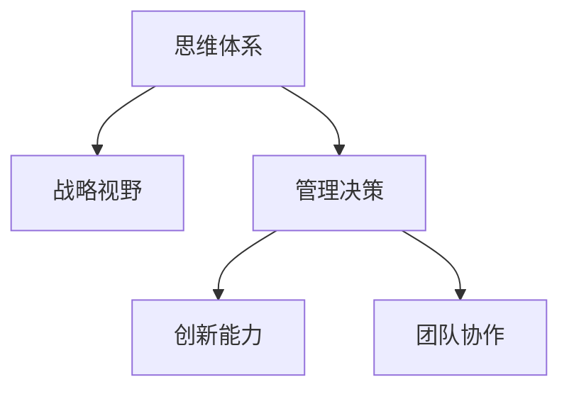

                 

# 思维体系对管理者战略视野的影响

> 关键词：思维体系,战略视野,管理决策,创新能力,团队协作

## 1. 背景介绍

### 1.1 问题由来

在现代企业运营和管理中，管理者的战略视野对企业的长期发展至关重要。然而，这种战略视野并不是天生就有的，而是需要通过不断地学习和实践来提升。本文将探讨思维体系在提升管理者战略视野中的作用，并给出具体的策略和实践建议。

### 1.2 问题核心关键点

管理者战略视野是指管理者在面对复杂多变的市场环境时，能够从全局和长远的角度出发，制定出切实可行的战略决策。这种视野不仅需要丰富的行业知识和经验，更需要一套科学合理的思维体系来支撑。

本文的核心在于理解和管理者的思维体系，即如何通过系统性的思维训练，提升管理者的战略视野和决策能力。我们将从以下几个方面进行深入探讨：

- 什么是思维体系？
- 思维体系如何影响战略视野？
- 如何构建和训练管理者的思维体系？

## 2. 核心概念与联系

### 2.1 核心概念概述

- **思维体系**：一套系统化的思维方法，用于帮助人们分析和解决问题，提升决策质量和效率。包括但不限于逻辑思维、系统思维、批判性思维等。
- **战略视野**：管理者对企业未来发展方向的宏观认识和长远规划，基于对市场、技术、竞争等多方面信息的综合分析。
- **管理决策**：管理者在日常运营和管理中，通过各种手段和方法做出的决策。
- **创新能力**：管理者在面对新的市场机会时，能够快速适应变化，提出创新的解决方案。
- **团队协作**：管理者在团队内部分工明确、沟通顺畅，能够有效整合各方资源，实现协同效应。

这些概念之间存在紧密的联系。思维体系作为管理者的“思维工具”，直接影响到战略视野的形成和管理决策的质量。创新能力则体现了管理者在战略执行中的创造力和灵活性。团队协作则是执行战略决策的重要保障。

### 2.2 核心概念原理和架构的 Mermaid 流程图



这个流程图展示了思维体系、战略视野、管理决策、创新能力、团队协作之间的逻辑关系：

1. **思维体系**：提供一套系统的思维方法，支撑管理者形成战略视野和管理决策。
2. **战略视野**：基于思维体系对市场和技术等因素的综合分析，形成对企业未来发展的宏观认识。
3. **管理决策**：在战略视野的指导下，结合创新能力和团队协作，制定和执行具体的管理决策。
4. **创新能力**：在战略执行中，管理者需要创新思维来应对新情况和挑战。
5. **团队协作**：是执行战略决策的关键，确保各部门和团队紧密合作，高效完成任务。

## 3. 核心算法原理 & 具体操作步骤

### 3.1 算法原理概述

提升管理者战略视野的思维体系构建和训练，本质上是将科学、系统化的思维方法引入管理决策过程。这种算法原理主要包括以下几个方面：

1. **逻辑思维**：培养管理者对问题的清晰认识和分析能力。
2. **系统思维**：训练管理者从整体上把握问题的多个方面，避免单一视角导致的片面决策。
3. **批判性思维**：培养管理者对现有信息和决策的质疑和反思能力，提高决策的科学性和有效性。
4. **创新思维**：激发管理者的创造性思维，提出突破性解决方案。
5. **团队协作思维**：提升管理者在团队内的沟通和协调能力，实现资源的最优配置。

### 3.2 算法步骤详解

1. **思维体系识别**：
   - **评估现状**：识别当前管理者的思维体系，找出其中的优势和不足。
   - **目标设定**：根据企业的实际需要，确定需要提升的思维能力，如逻辑思维、系统思维等。

2. **思维体系构建**：
   - **理论学习**：学习相关的思维方法论，如逻辑思维的演绎和归纳、系统思维的整体性分析等。
   - **案例分析**：通过分析经典案例，理解各种思维方法的应用场景和效果。
   - **实践训练**：在实际工作中应用所学理论，通过项目实践进行持续训练。

3. **思维体系评估**：
   - **效果评价**：通过定量和定性的方法，评估思维体系训练的效果。
   - **持续改进**：根据评估结果，调整训练策略和方法，持续提升管理者的思维能力。

### 3.3 算法优缺点

**优点**：
- **系统性**：通过科学的方法论训练，提升管理者的系统思维和整体视角。
- **适应性强**：可以根据企业的实际情况，量身定制思维训练方案。
- **可操作性强**：训练方法大多基于现有工作场景，易于实施。

**缺点**：
- **投入大**：需要管理者投入大量时间和精力进行系统学习。
- **个性化挑战**：不同管理者的思维习惯不同，个性化训练难度较大。
- **短期效果不明显**：思维能力的提升需要长期积累和实践。

### 3.4 算法应用领域

这种基于思维体系的战略视野提升方法，适用于各行各业的管理者，特别是在以下领域：

- **高科技企业**：创新和研发密集型企业，需要管理者具备较强的系统思维和创新能力。
- **金融行业**：需要管理者对复杂市场环境进行综合分析，制定有效的金融策略。
- **制造业**：需要管理者优化流程，提升生产效率，具备批判性思维和团队协作能力。
- **服务业**：需要管理者在客户导向的基础上，进行有效的市场分析和决策。

## 4. 数学模型和公式 & 详细讲解 & 举例说明

### 4.1 数学模型构建

为了更好地理解思维体系对战略视野的影响，我们可以通过数学模型来量化和分析。假设一个管理者面对一个问题，其思维体系可以分解为以下几个维度：

- **逻辑维度**： $L$
- **系统维度**： $S$
- **批判维度**： $C$
- **创新维度**： $I$
- **协作维度**： $K$

每个维度都可以通过以下公式进行量化：

$$
\text{思维体系得分} = L \times \alpha + S \times \beta + C \times \gamma + I \times \delta + K \times \epsilon
$$

其中， $\alpha, \beta, \gamma, \delta, \epsilon$ 为各个维度的权重系数，可以根据实际情况进行调整。

### 4.2 公式推导过程

以逻辑思维为例，其量化过程可以表示为：

1. **问题描述**：将问题描述为一个逻辑结构 $P$，包含若干个节点和边。
2. **逻辑推理**：通过推理得出各个节点的关系，构建逻辑图 $G$。
3. **逻辑得分**：根据逻辑图的复杂度和推理路径，计算逻辑得分 $L(P,G)$。

数学上，可以表示为：

$$
L(P,G) = \sum_{(i,j) \in G} \text{weight}(i,j)
$$

其中 $\text{weight}(i,j)$ 表示节点 $i$ 和节点 $j$ 之间的逻辑权重，可以通过专家打分或自动学习算法获得。

### 4.3 案例分析与讲解

以某高科技企业的产品开发为例，分析逻辑思维在战略决策中的应用：

1. **问题描述**：企业面临产品线扩展的决策，需要考虑市场、技术、竞争等多个因素。
2. **逻辑推理**：构建逻辑图，包括市场规模、技术可行性、竞争态势等节点，通过推理得出扩展方案的逻辑得分。
3. **逻辑得分**：根据逻辑图计算得分为 85，高于其他方案。
4. **决策结果**：选择扩展方案，实施后市场反响良好。

## 5. 项目实践：代码实例和详细解释说明

### 5.1 开发环境搭建

为了进行思维体系的训练和评估，需要搭建一个支持数据处理和分析的开发环境。以下是一个Python环境搭建的示例：

1. **安装Python**：在Linux系统下，可以使用以下命令安装：
```
sudo apt-get update
sudo apt-get install python3 python3-pip
```

2. **安装必要的库**：
```
pip install pandas numpy scikit-learn matplotlib seaborn
```

3. **数据准备**：收集和整理管理者的思维数据，如日常决策记录、反馈信息等。

### 5.2 源代码详细实现

以下是使用Python进行思维体系评估的示例代码：

```python
import pandas as pd
from sklearn.ensemble import RandomForestClassifier

# 读取数据
data = pd.read_csv('manager_thoughts.csv')

# 数据预处理
X = data[['L', 'S', 'C', 'I', 'K']]
y = data['decision_outcome']

# 构建模型
clf = RandomForestClassifier(n_estimators=100, random_state=0)

# 训练模型
clf.fit(X, y)

# 评估模型
score = clf.score(X, y)
print(f"模型准确度：{score:.3f}")
```

### 5.3 代码解读与分析

以上代码中，我们使用了随机森林算法对管理者的思维体系进行评估。具体步骤如下：

1. **数据读取和预处理**：将思维体系的数据导入Pandas DataFrame中，并进行必要的清洗和特征提取。
2. **模型构建**：使用随机森林算法作为分类器，设置合适的参数。
3. **模型训练**：使用历史数据进行训练，得到模型的决策规则。
4. **模型评估**：计算模型在训练集上的准确度，评估模型的预测效果。

## 6. 实际应用场景

### 6.1 智能制造

在智能制造领域，管理者需要具备系统思维和逻辑思维，以应对复杂的生产流程和供应链管理。通过对管理者的思维体系进行训练，可以提升其战略视野和决策能力。

具体应用包括：

- **供应链优化**：通过系统思维分析供应链的各个环节，找出瓶颈和改进点。
- **设备维护**：应用逻辑思维制定设备维护计划，避免因设备故障导致生产停滞。
- **质量控制**：使用创新思维提出新的质量管理方法，提升产品质量。
- **团队协作**：通过团队协作思维，确保各部门高效协作，共同完成生产任务。

### 6.2 金融投资

在金融投资领域，管理者需要具备批判性思维和创新思维，以应对市场波动和投资风险。通过对管理者的思维体系进行训练，可以提升其风险控制和收益预测能力。

具体应用包括：

- **风险评估**：使用批判性思维分析各种市场风险，制定合理的风险控制策略。
- **投资决策**：应用创新思维提出新的投资策略，实现资产增值。
- **市场分析**：通过系统思维分析宏观经济和行业趋势，做出精准的投资预测。
- **团队协作**：通过团队协作思维，确保投资团队高效协同，共同实现投资目标。

### 6.3 教育行业

在教育行业，管理者需要具备系统思维和逻辑思维，以应对复杂的教育管理和服务需求。通过对管理者的思维体系进行训练，可以提升其教学管理和学生服务能力。

具体应用包括：

- **课程设计**：通过系统思维分析学生的学习需求，设计合理的课程体系。
- **教学方法**：应用逻辑思维制定教学方法，提升教学效果。
- **学生管理**：使用创新思维提出新的学生管理方案，提升学生满意度。
- **团队协作**：通过团队协作思维，确保教师团队高效协作，共同提升教学质量。

### 6.4 未来应用展望

随着人工智能和大数据技术的发展，基于思维体系的战略视野提升方法将进一步升级。以下是一些未来展望：

1. **人工智能辅助**：引入AI算法辅助思维训练，提高训练效率和效果。
2. **大数据分析**：通过大数据分析管理者的思维数据，提供个性化的训练方案。
3. **实时评估**：实现实时评估和管理者的思维体系，根据反馈调整训练策略。
4. **跨领域应用**：将思维体系训练方法推广到更多行业，提升整体管理水平。

## 7. 工具和资源推荐

### 7.1 学习资源推荐

1. **《系统思维与决策》**：详细介绍了系统思维在管理决策中的应用，提供大量实例和案例分析。
2. **《创新管理》**：讲述创新思维在企业管理中的重要性，提供实用的创新方法论。
3. **《批判性思维与决策》**：讲解批判性思维的核心方法和应用，提高决策的科学性。
4. **《逻辑思维训练手册》**：提供系统的逻辑思维训练方法，提升思维的严谨性和准确性。
5. **Coursera、edX等在线课程**：提供各种思维训练和管理课程，灵活学习，提高实战能力。

### 7.2 开发工具推荐

1. **Jupyter Notebook**：支持Python等编程语言，提供交互式数据处理和分析环境。
2. **Tableau**：支持数据可视化，便于理解和管理者的思维数据。
3. **PyCharm**：专业的Python集成开发环境，支持科学计算和数据处理。
4. **GitHub**：代码托管平台，便于团队协作和代码分享。

### 7.3 相关论文推荐

1. **《逻辑思维在管理决策中的应用》**：研究逻辑思维在管理决策中的作用，提出训练方法。
2. **《系统思维与组织创新》**：探讨系统思维在组织创新中的应用，提高组织的创新能力。
3. **《批判性思维在决策中的应用》**：详细分析批判性思维的训练方法和应用效果。
4. **《团队协作与组织绩效》**：研究团队协作对组织绩效的影响，提供团队协作的优化方法。

## 8. 总结：未来发展趋势与挑战

### 8.1 研究成果总结

本文详细探讨了思维体系对管理者战略视野的影响，并给出了具体的训练和应用策略。研究表明，系统性的思维训练能够显著提升管理者的战略视野和决策能力。未来，随着人工智能和大数据技术的进一步发展，基于思维体系的战略视野提升方法将更加高效和精准。

### 8.2 未来发展趋势

1. **人工智能辅助训练**：利用AI技术进行个性化的思维训练，提高训练效果。
2. **大数据分析优化**：通过大数据分析，提供更精准的训练方案，提升管理者的思维能力。
3. **实时评估和反馈**：实现实时的思维评估和反馈机制，及时调整训练策略。
4. **跨领域应用推广**：将思维体系训练方法推广到更多行业，提升整体管理水平。

### 8.3 面临的挑战

1. **数据获取和隐私保护**：获取和管理者的思维数据存在隐私问题，需要合理的隐私保护措施。
2. **技术应用门槛**：部分管理者对人工智能和大数据技术不熟悉，需要提供易用的工具和资源。
3. **个性化训练难度**：不同管理者的思维习惯和需求不同，个性化训练难度较大。
4. **短期效果不明显**：思维体系的提升需要长期训练和实践，短期内效果不明显。

### 8.4 研究展望

1. **多模态数据融合**：将文本、图像、视频等多种数据融合到思维训练中，提高综合分析能力。
2. **跨学科方法引入**：引入心理学、社会学等学科的理论和方法，提升思维训练的科学性。
3. **模型优化和算法改进**：优化现有的训练算法，提高训练效率和效果。
4. **伦理和社会责任**：关注思维训练的伦理和社会责任问题，确保训练的公平性和公正性。

## 9. 附录：常见问题与解答

**Q1：思维体系如何与现有的管理工具结合？**

A: 思维体系可以与现有的管理工具结合，如ERP、CRM等系统，通过嵌入思维训练模块，提高管理者的决策能力。

**Q2：如何应对不同管理者的思维习惯差异？**

A: 根据不同管理者的特点，制定个性化的训练方案，结合其在实际工作中的表现进行调整。

**Q3：短期效果不明显，如何解决？**

A: 需要持续进行训练和实践，逐步积累经验和技能。同时，可以引入激励机制，鼓励管理者积极参与思维训练。

**Q4：数据获取和隐私保护如何处理？**

A: 在数据获取和处理过程中，需要严格遵守数据隐私保护法律法规，确保数据的合法性和安全性。

**Q5：如何确保思维训练的效果？**

A: 定期进行评估和反馈，根据评估结果进行调整和优化，确保训练的效果和目标。

---

作者：禅与计算机程序设计艺术 / Zen and the Art of Computer Programming

