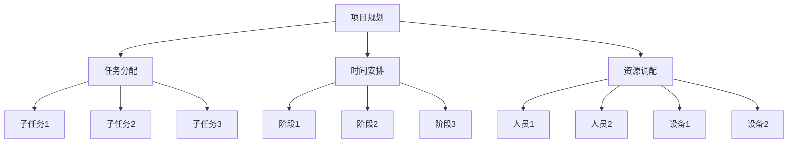

                 

# 思维导图：知识组织的视觉化工具

> 关键词：思维导图,知识管理,认知学习,脑力劳动,图形界面

## 1. 背景介绍

### 1.1 问题由来
在信息爆炸的时代，人类获取和处理信息的方式和规模都在发生变化。传统的线性文本形式已经无法满足人们对复杂信息的理解和记忆需求。为了更好地组织和利用知识，许多高效的工具被开发出来，其中之一便是思维导图。思维导图是一种将思想、概念、知识和逻辑结构可视化的工具，它通过图形化的方式展现信息，使信息的组织、理解和记忆更加直观、高效。

### 1.2 问题核心关键点
思维导图的核心在于其结构化、可视化的展现方式。它能够帮助人们更好地理解和记忆复杂信息，促进知识的整合和应用。具体关键点包括：

- 结构化：通过树状结构展现信息，层次分明，便于理解。
- 可视化：使用颜色、形状、线条等图形元素增强信息的视觉吸引力。
- 关联性：通过节点之间的连接线，展示不同概念之间的关联性，促进知识的整合。
- 动态化：支持添加、修改、删除节点，动态调整结构，适应知识的变化。

## 2. 核心概念与联系

### 2.1 核心概念概述

思维导图（Mind Map）是一种信息处理工具，它通过图形化的方式展现信息，使信息的组织、理解和记忆更加直观、高效。思维导图通常由一个中心节点和多个子节点构成，中心节点代表核心概念或问题，子节点代表与核心节点相关的子概念或子问题，通过连接线展示不同节点之间的关联性。

思维导图的核心技术包括：

- 图论：思维导图本质上是一种图结构，通过图论中的树形结构、图形表示等方法来实现信息的组织。
- 信息可视化：通过颜色、形状、线条等图形元素，增强信息的视觉吸引力，提高信息的可读性。
- 自然语言处理：思维导图中的节点通常使用自然语言描述，通过自然语言处理技术，提升信息的可理解性。

这些核心技术共同构成了思维导图的应用框架，使其在知识管理和认知学习中发挥重要作用。

### 2.2 核心概念原理和架构的 Mermaid 流程图

```mermaid
graph TB
    A[中心节点] --> B[子节点1] --> C[子节点2] --> D[子节点3]
    A --> E[子节点4]
    A --> F[子节点5]
    A --> G[子节点6]
    A --> H[子节点7]
    A --> I[子节点8]
    A --> J[子节点9]
    A --> K[子节点10]
    B --> L[子节点11]
    B --> M[子节点12]
    E --> N[子节点13]
    E --> O[子节点14]
    F --> P[子节点15]
    F --> Q[子节点16]
    G --> R[子节点17]
    G --> S[子节点18]
    H --> T[子节点19]
    H --> U[子节点20]
    I --> V[子节点21]
    I --> W[子节点22]
    J --> X[子节点23]
    J --> Y[子节点24]
    J --> Z[子节点25]
    K --> A[子节点26]
    L --> A[子节点27]
    M --> A[子节点28]
    N --> A[子节点29]
    O --> A[子节点30]
    P --> A[子节点31]
    Q --> A[子节点32]
    R --> A[子节点33]
    S --> A[子节点34]
    T --> A[子节点35]
    U --> A[子节点36]
    V --> A[子节点37]
    W --> A[子节点38]
    X --> A[子节点39]
    Y --> A[子节点40]
    Z --> A[子节点41]
    A --> E[中心节点]
    A --> F[中心节点]
    A --> G[中心节点]
    A --> H[中心节点]
    A --> I[中心节点]
    A --> J[中心节点]
    A --> K[中心节点]
    E --> E[中心节点]
    F --> F[中心节点]
    G --> G[中心节点]
    H --> H[中心节点]
    I --> I[中心节点]
    J --> J[中心节点]
    K --> K[中心节点]
    E --> E[中心节点]
    F --> F[中心节点]
    G --> G[中心节点]
    H --> H[中心节点]
    I --> I[中心节点]
    J --> J[中心节点]
    K --> K[中心节点]
```



这个流程图展示了一个简单的思维导图结构。中心节点通常代表一个核心概念或问题，子节点代表与核心节点相关的子概念或子问题，连接线展示不同节点之间的关联性。

## 3. 核心算法原理 & 具体操作步骤
### 3.1 算法原理概述

思维导图的生成过程主要依赖于图论和信息可视化的技术。其核心算法包括：

- 图生成算法：根据节点之间的关系，生成树形结构，构建思维导图的基础框架。
- 节点扩展算法：根据用户需求，扩展节点内容，添加新的子节点，修改现有节点。
- 连接线生成算法：根据节点之间的关系，生成连接线，展示不同节点之间的关联性。
- 信息可视化算法：使用颜色、形状、线条等图形元素，增强信息的视觉吸引力，提高信息的可读性。

### 3.2 算法步骤详解

思维导图生成的具体操作步骤包括：

1. **输入核心节点**：用户输入代表核心概念或问题的中心节点。
2. **生成基础框架**：根据输入的核心节点，生成基础框架，包括中心节点和连接线。
3. **节点扩展**：用户可以根据需求，扩展节点内容，添加新的子节点，修改现有节点。
4. **连接线生成**：根据节点之间的关系，生成连接线，展示不同节点之间的关联性。
5. **信息可视化**：使用颜色、形状、线条等图形元素，增强信息的视觉吸引力，提高信息的可读性。
6. **输出思维导图**：将生成的思维导图展示给用户，供其阅读、理解和应用。

### 3.3 算法优缺点

思维导图的优点包括：

- **直观性**：通过图形化的方式展现信息，使信息的组织、理解和记忆更加直观、高效。
- **关联性**：通过节点之间的连接线，展示不同概念之间的关联性，促进知识的整合。
- **动态性**：支持添加、修改、删除节点，动态调整结构，适应知识的变化。
- **可读性**：通过颜色、形状、线条等图形元素，增强信息的视觉吸引力，提高信息的可读性。

同时，思维导图也存在一些缺点：

- **可扩展性**：思维导图在大规模信息处理和复杂知识结构展现时，可能显得较为繁琐。
- **形式化不足**：思维导图对于严格的结构化信息展现可能不够严谨，缺乏形式化的表达方式。
- **学习成本**：对于不熟悉思维导图工具的用户，可能需要一定时间学习和适应。

### 3.4 算法应用领域

思维导图在知识管理和认知学习中得到了广泛应用，具体领域包括：

- **项目管理**：通过思维导图展现项目任务和关系，促进团队协作和项目进展。
- **教育培训**：帮助学生理解复杂概念和知识结构，提高学习效率和记忆效果。
- **个人知识管理**：帮助个人整理和利用知识，提升工作和学习效率。
- **商业分析和决策**：通过思维导图展现商业策略和关系，促进战略规划和决策。
- **创意和设计**：帮助创意人员整理思路和灵感，促进创意和设计的实现。

## 4. 数学模型和公式 & 详细讲解 & 举例说明

### 4.1 数学模型构建

思维导图生成过程中的数学模型可以基于图论和信息可视化技术进行建模。其中，图论中的树形结构是最基础的模型，用于构建思维导图的框架。信息可视化模型则用于增强信息的视觉吸引力，提高信息的可读性。

### 4.2 公式推导过程

思维导图生成的数学模型可以描述为：

- **图生成算法**：$G = (V, E)$，其中 $V$ 代表节点集合，$E$ 代表连接线集合。$E$ 的生成基于节点之间的关系，如父节点和子节点之间的关系。
- **节点扩展算法**：$V_{\text{extend}} = V \cup \{N_i\}$，其中 $N_i$ 代表新添加的节点。
- **连接线生成算法**：$E_{\text{extend}} = E \cup \{L_{ij}\}$，其中 $L_{ij}$ 代表新添加的连接线。
- **信息可视化算法**：$V_{\text{visual}} = \{C_i, S_i, L_i\}$，其中 $C_i$ 代表节点的颜色，$S_i$ 代表节点的形状，$L_i$ 代表节点的线条。

### 4.3 案例分析与讲解

以项目管理为例，展示思维导图的生成过程。假设核心节点为“项目规划”，其下有三个子节点“任务分配”、“时间安排”和“资源调配”。



在这个例子中，中心节点“项目规划”通过连接线与三个子节点“任务分配”、“时间安排”和“资源调配”相连，展示了项目管理的基本框架。每个子节点下还有多个子任务，如“子任务1”、“子任务2”和“子任务3”，展示了任务分配的详细结构。

## 5. 项目实践：代码实例和详细解释说明

### 5.1 开发环境搭建

思维导图工具的开发需要相应的开发环境。以下是使用Python进行思维导图工具开发的配置流程：

1. **安装Python**：下载并安装Python，推荐使用Anaconda或Miniconda。
2. **创建虚拟环境**：使用conda创建虚拟环境，避免不同项目间的依赖冲突。
3. **安装开发工具**：安装PyCharm、Jupyter Notebook等开发工具，以及相关的Python库，如networkx、matplotlib等。
4. **配置环境变量**：设置Python环境变量，确保所有开发工具和库可以正常工作。

### 5.2 源代码详细实现

以下是一个简单的Python代码示例，用于生成基本的思维导图：

```python
import networkx as nx
import matplotlib.pyplot as plt

# 创建思维导图
G = nx.Graph()
G.add_node("项目规划")
G.add_node("任务分配")
G.add_node("时间安排")
G.add_node("资源调配")
G.add_edge("项目规划", "任务分配")
G.add_edge("项目规划", "时间安排")
G.add_edge("项目规划", "资源调配")

# 节点扩展
G.add_node("子任务1")
G.add_node("子任务2")
G.add_node("子任务3")
G.add_edge("任务分配", "子任务1")
G.add_edge("任务分配", "子任务2")
G.add_edge("任务分配", "子任务3")

# 连接线生成
G.add_edge("子任务1", "阶段1")
G.add_edge("子任务1", "阶段2")
G.add_edge("子任务1", "阶段3")
G.add_edge("子任务2", "阶段1")
G.add_edge("子任务2", "阶段2")
G.add_edge("子任务2", "阶段3")
G.add_edge("子任务3", "阶段1")
G.add_edge("子任务3", "阶段2")
G.add_edge("子任务3", "阶段3")

# 信息可视化
pos = nx.spring_layout(G)
plt.figure(figsize=(10, 6))
nx.draw(G, pos, with_labels=True, node_color="lightblue", node_size=2000, font_size=12)
plt.show()
```

### 5.3 代码解读与分析

**网络图生成**：使用networkx库创建基础的网络图，添加节点和连接线，构建思维导图的基本框架。

**节点扩展**：使用add_node和add_edge方法添加新的节点和连接线，展示思维导图的具体内容。

**信息可视化**：使用matplotlib库绘制思维导图，展示节点和连接线的布局，增强信息的视觉吸引力。

**运行结果展示**：最终生成的思维导图展示了项目的核心规划和详细任务安排，直观地展示了项目管理的基本框架和任务关系。

## 6. 实际应用场景

### 6.1 项目管理

思维导图在项目管理中的应用非常广泛。通过思维导图，项目经理可以清晰地展示项目的整体规划和详细任务安排，帮助团队成员理解项目目标和任务关系，促进团队协作和项目进展。

### 6.2 教育培训

在教育培训中，思维导图可以帮助学生理解复杂概念和知识结构，提高学习效率和记忆效果。教师可以使用思维导图展示课程内容和重点，帮助学生构建知识框架，提升学习效果。

### 6.3 个人知识管理

思维导图是个人知识管理的重要工具。通过思维导图，个人可以将零散的知识进行系统化整理，构建知识框架，提升知识利用效率。

### 6.4 商业分析和决策

在商业分析中，思维导图可以帮助企业展示战略规划和市场关系，促进战略规划和决策。通过思维导图，企业可以清晰地展示市场机会和竞争关系，优化市场策略。

### 6.5 创意和设计

在创意和设计中，思维导图帮助创意人员整理思路和灵感，促进创意和设计的实现。通过思维导图，创意人员可以系统地展示创意灵感和设计思路，促进创意实现。

## 7. 工具和资源推荐

### 7.1 学习资源推荐

为了帮助开发者系统掌握思维导图的技术基础和应用技巧，这里推荐一些优质的学习资源：

1. **《思维导图：构建高效认知图谱》**：介绍思维导图的原理、应用和设计方法，提供详细的案例分析。
2. **《信息可视化原理与实践》**：深入探讨信息可视化的基本原理和实现方法，提供丰富的实例和代码示例。
3. **《网络图生成与分析》**：介绍网络图的生成和分析方法，提供网络图算法和实现代码。
4. **《Python网络图库networkx教程》**：详细讲解networkx库的使用方法，提供网络图生成和分析的示例代码。
5. **《Python信息可视化教程》**：介绍如何使用Python进行信息可视化，提供matplotlib等工具的使用方法和实例代码。

通过对这些资源的学习实践，相信你一定能够快速掌握思维导图的技术实现和应用技巧，构建高效的知识管理和认知学习系统。

### 7.2 开发工具推荐

思维导图工具的开发需要相应的开发环境。以下是几款常用的开发工具：

1. **PyCharm**：一款功能强大的Python开发环境，支持网络图和信息可视化的实现。
2. **Jupyter Notebook**：一款交互式开发环境，支持代码和文档的同步展示，便于开发和调试。
3. **networkx**：一个Python网络图库，支持网络图的生成和分析。
4. **matplotlib**：一个Python信息可视化库，支持绘制思维导图和节点布局。

合理利用这些工具，可以显著提升思维导图工具的开发效率，加快创新迭代的步伐。

### 7.3 相关论文推荐

思维导图技术的发展源于学界的持续研究。以下是几篇奠基性的相关论文，推荐阅读：

1. **《思维导图在认知学习中的应用研究》**：探讨思维导图在认知学习中的应用效果和机制，提供实验数据和分析。
2. **《基于信息可视化技术的信息呈现方法》**：介绍信息可视化的基本原理和实现方法，提供视觉化效果的案例分析。
3. **《网络图生成与分析算法综述》**：综述网络图生成和分析的算法和技术，提供算法实现的代码示例。

这些论文代表了大语言模型微调技术的发展脉络。通过学习这些前沿成果，可以帮助研究者把握学科前进方向，激发更多的创新灵感。

## 8. 总结：未来发展趋势与挑战

### 8.1 研究成果总结

思维导图作为一种知识组织工具，通过图形化的方式展现信息，使信息的组织、理解和记忆更加直观、高效。在项目管理、教育培训、个人知识管理、商业分析和创意设计等领域得到了广泛应用，展示了其强大的应用价值。未来，思维导图将结合更多技术和方法，进一步提升信息的展示效果和利用效率。

### 8.2 未来发展趋势

思维导图技术的未来发展趋势包括：

1. **多维展示**：结合声音、视频等多维信息，增强信息的展示效果。
2. **智能推荐**：利用算法推荐最优的展示方式，提升用户的使用体验。
3. **交互式展示**：结合交互技术，增强用户的操作体验，提升知识的利用效率。
4. **实时更新**：通过动态更新节点和连接线，展示知识的变化和演化。
5. **跨平台展示**：支持多种设备和平台，提升思维导图的应用范围和便捷性。

### 8.3 面临的挑战

思维导图技术在发展过程中也面临一些挑战：

1. **信息过载**：思维导图在大规模信息展示时，可能面临信息过载的问题，需要优化信息的展示方式和用户界面。
2. **形式化不足**：思维导图在展示复杂信息时，可能缺乏形式化的表达方式，需要引入更多的结构化元素。
3. **学习成本**：思维导图对于不熟悉工具的用户，可能需要一定时间学习和适应，需要提供更多的培训和支持。

### 8.4 研究展望

思维导图技术的研究展望包括：

1. **结合AI技术**：利用AI技术进行信息推荐和智能展示，提升用户的使用体验。
2. **引入交互技术**：结合交互技术，增强用户的操作体验，提升知识的利用效率。
3. **跨平台展示**：支持多种设备和平台，提升思维导图的应用范围和便捷性。
4. **多维展示**：结合声音、视频等多维信息，增强信息的展示效果。
5. **智能更新**：通过动态更新节点和连接线，展示知识的变化和演化。

思维导图作为一种知识组织工具，未来将结合更多技术和方法，进一步提升信息的展示效果和利用效率，为人类认知智能的进化带来深远影响。相信随着学界和产业界的共同努力，思维导图技术将不断创新发展，为构建人机协同的智能系统铺平道路。

## 9. 附录：常见问题与解答

**Q1：思维导图和脑图有什么区别？**

A: 思维导图和脑图本质上是一类信息组织工具，主要区别在于其形式和侧重点。思维导图强调信息的层次和结构，通过树形结构展示信息；脑图则更侧重于个人思维的整理和记录，通过图表形式展示思维过程。

**Q2：思维导图如何结合AI技术？**

A: 思维导图可以结合AI技术进行信息推荐和智能展示。例如，利用机器学习算法进行信息分类和推荐，增强信息的展示效果和利用效率。同时，结合自然语言处理技术，对文本信息进行自然语言理解和生成，提升思维导图的应用价值。

**Q3：思维导图如何应用于创意设计？**

A: 思维导图在创意设计中主要用于整理思路和灵感。设计师可以使用思维导图展示创意灵感和设计思路，促进创意实现。通过思维导图，设计师可以系统地展示创意灵感和设计思路，促进创意实现。

**Q4：思维导图如何应用于商业分析？**

A: 在商业分析中，思维导图可以展示战略规划和市场关系。企业可以使用思维导图清晰地展示市场机会和竞争关系，优化市场策略。通过思维导图，企业可以清晰地展示市场机会和竞争关系，优化市场策略。

**Q5：思维导图如何应用于教育培训？**

A: 在教育培训中，思维导图可以帮助学生理解复杂概念和知识结构，提高学习效率和记忆效果。教师可以使用思维导图展示课程内容和重点，帮助学生构建知识框架，提升学习效果。通过思维导图，教师可以清晰地展示课程内容和重点，帮助学生构建知识框架，提升学习效果。

通过本文的系统梳理，可以看到，思维导图作为一种知识组织工具，在知识管理和认知学习中发挥着重要作用。未来，随着技术的不断进步，思维导图将结合更多技术和方法，进一步提升信息的展示效果和利用效率，为人类认知智能的进化带来深远影响。

