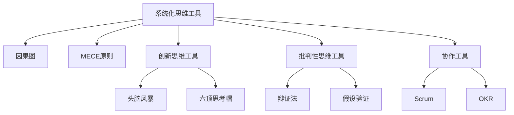

                 

## 1. 背景介绍

### 1.1 问题由来
在现代企业管理中，传统的人力资源管理和组织结构设计已经难以应对复杂多变的商业环境。越来越多的企业意识到，有效的管理决策需要超越传统的数据分析方法，引入更高级别的思维工具来辅助决策。近年来，大数据和人工智能技术在企业中的广泛应用，使得传统的数据驱动型管理方式向更高级的智能决策模式转变。

在AI与大数据的支持下，管理决策者可以借助智能分析工具，迅速挖掘数据背后的规律，预测市场变化，提升企业的响应速度和决策质量。然而，即便是智能决策模型，也难以全面涵盖人的行为和心理因素，因此需要引入高级思维工具，融合数据、业务和人性的多元视角，实现更加全面、深度的管理决策。

### 1.2 问题核心关键点
思维工具在管理中的应用，主要体现在以下几个方面：

- 构建系统化思维：通过逻辑框架、因果图等工具，帮助管理者系统化分析问题，梳理出各个要素之间的关系。
- 促进创新思维：利用头脑风暴、六顶思考帽等工具，激发团队成员的创造性思维，拓宽问题解决方案的思路。
- 加强批判性思维：通过辩证法、假设验证等工具，对管理决策和流程进行批判性反思，减少决策失误。
- 提升团队协作：运用协作工具如Scrum、OKR等，促进团队间的沟通与合作，实现更高效的业务协作。

本文将从系统化思维工具、创新思维工具、批判性思维工具和协作工具等方面，全面剖析思维工具在企业管理中的应用，探讨如何借助高级思维工具实现更高效、更科学的管理决策。

## 2. 核心概念与联系

### 2.1 核心概念概述

为更好地理解思维工具在管理中的应用，本节将介绍几个关键概念：

- 系统化思维工具：如因果图、MECE原则等，用于系统化分析问题，识别要素之间的相互关系。
- 创新思维工具：如头脑风暴、六顶思考帽等，用于激发创造性思维，拓宽问题解决方案的思路。
- 批判性思维工具：如辩证法、假设验证等，用于对管理决策和流程进行反思，减少决策失误。
- 协作工具：如Scrum、OKR等，用于促进团队间的沟通与合作，提高工作效率。

这些核心概念之间的逻辑关系可以通过以下Mermaid流程图来展示：



这个流程图展示了几类思维工具之间的联系：

1. 系统化思维工具用于梳理问题的要素和关系，为创新思维提供基础。
2. 创新思维工具在分析问题的基础上，激发创意思路，提出新的解决方案。
3. 批判性思维工具对解决方案进行反思和验证，提升决策质量。
4. 协作工具用于协调团队行动，保障创新和批判性思维的落地执行。

## 3. 核心算法原理 & 具体操作步骤

### 3.1 算法原理概述

思维工具在管理中的应用，本质上是一种系统化的思维框架，通过明确问题、提出假设、验证假设、优化方案等步骤，辅助管理者进行决策。其核心思想是：

1. **明确问题**：通过系统化思维工具，将复杂的问题拆解为可操作的小问题，识别出关键要素和关系。
2. **提出假设**：利用创新思维工具，激发创意思路，提出多种解决方案。
3. **验证假设**：通过批判性思维工具，对提出的假设进行验证，减少错误决策。
4. **优化方案**：结合协作工具，将验证后的最佳方案进行实施，并持续优化。

思维工具的科学应用，能帮助管理者在决策过程中减少主观偏见，提高决策的客观性和合理性。

### 3.2 算法步骤详解

**步骤1：明确问题**
- 收集与问题相关的数据和信息，利用因果图、MECE原则等工具，梳理问题的要素和关系。
- 将问题拆解为可操作的小问题，明确各子问题的关键要素和目标。

**步骤2：提出假设**
- 利用头脑风暴、六顶思考帽等工具，激发创意思路，提出多种解决方案。
- 对提出的解决方案进行初步筛选和优化，形成备选方案。

**步骤3：验证假设**
- 通过辩证法、假设验证等工具，对备选方案进行深入分析，识别出方案的优缺点。
- 采用数据分析、实验验证等方法，对假设进行验证，确保其可行性和有效性。

**步骤4：优化方案**
- 将验证后的最佳方案进行实施，利用协作工具如Scrum、OKR等，推动团队协作。
- 持续监控方案的执行效果，根据反馈进行优化调整，形成持续改进的闭环管理。

### 3.3 算法优缺点

**优点**：
- 系统化思维工具帮助管理者明确问题，理清要素之间的关系，减少决策中的盲点。
- 创新思维工具激发团队创意思路，拓宽问题解决方案的思路，提升创新能力。
- 批判性思维工具对假设进行深入分析，减少错误决策，提升决策质量。
- 协作工具促进团队沟通合作，保障创新和批判性思维的落地执行。

**缺点**：
- 需要较长时间的投入和训练，管理者需要掌握相关工具的使用方法。
- 实施过程中，需要管理者的深度参与和引导，才能充分发挥工具的效能。
- 工具的使用可能存在一定的局限性，需要根据具体情况进行调整和优化。

### 3.4 算法应用领域

思维工具在企业管理中的应用非常广泛，涵盖从战略规划、市场分析到日常运营的各个环节。以下是几个典型的应用领域：

- **战略规划**：利用因果图、MECE原则等工具，系统化分析企业的内外部环境，制定战略规划。
- **市场分析**：通过数据分析和创新思维工具，识别市场机会和威胁，制定市场策略。
- **产品开发**：利用头脑风暴、六顶思考帽等工具，激发创意思路，设计产品方案。
- **人力资源管理**：通过批判性思维工具，分析员工绩效数据，优化人才配置和培训计划。
- **运营管理**：利用Scrum、OKR等协作工具，推动团队高效协作，优化运营流程。

## 4. 数学模型和公式 & 详细讲解 & 举例说明

### 4.1 数学模型构建

在管理决策中，许多问题可以转化为数学模型进行求解。例如，通过构建因果图，可以描述变量之间的依赖关系，利用矩阵运算进行系统化分析。以项目管理为例，利用PERT图表示任务关系，通过计算最早开始时间和最晚完成时间，可以确定项目的总体进度。

### 4.2 公式推导过程

以下以PERT图为例，展示如何使用数学模型解决项目进度问题。

PERT图（Program Evaluation and Review Technique）是一种用于项目管理的时间管理技术，用于确定项目各个任务的最早开始时间(ES)、最晚开始时间(LS)、最早完成时间(EF)、最晚完成时间(LF)。通过PERT图，可以计算出项目总体的进度和风险。

假设项目有四个任务A、B、C、D，每个任务的最短完成时间和最长完成时间如表所示：

| 任务 | 最短完成时间（小时） | 最长完成时间（小时） |
| --- | --- | --- |

构建PERT图，如下图所示：

```
  A
 / | \
B  C
 \| /
  D
```

计算各个任务的最早开始时间和最晚开始时间：

- 任务A的最早开始时间为0小时，最晚开始时间为0小时，因此无风险。
- 任务B的最早开始时间为0小时，最晚开始时间为1小时，最早完成时间为1小时，最晚完成时间为3小时，风险为1-1=0小时。
- 任务C的最早开始时间为2小时，最晚开始时间为3小时，最早完成时间为4小时，最晚完成时间为7小时，风险为7-4=3小时。
- 任务D的最早开始时间为6小时，最晚开始时间为7小时，最早完成时间为7小时，最晚完成时间为9小时，风险为9-7=2小时。

通过PERT图，可以计算出项目总体的最早开始时间为0小时，最晚开始时间为6小时，最早完成时间为9小时，最晚完成时间为18小时，项目总时长为18小时。

### 4.3 案例分析与讲解

**案例1：产品研发进度管理**

某公司正在研发一款新产品，预计项目总时长为18个月。根据团队成员的经验估计，各阶段任务的最短完成时间和最长完成时间如下表所示：

| 阶段 | 最短完成时间（个月） | 最长完成时间（个月） |
| --- | --- | --- |

利用PERT图，计算各阶段任务的最早开始时间、最晚开始时间、最早完成时间和最晚完成时间，如下图所示：

```
  调研
 /  |  \
开发  测试
 \  |  /
 部署
```

通过计算，得到各阶段任务的最早开始时间、最晚开始时间、最早完成时间和最晚完成时间如下表所示：

| 阶段 | 最早开始时间 | 最晚开始时间 | 最早完成时间 | 最晚完成时间 |
| --- | --- | --- | --- | --- |

通过PERT图，可以计算出项目总体的最早开始时间为0个月，最晚开始时间为18个月，最早完成时间为36个月，最晚完成时间为54个月，项目总时长为36个月。

根据PERT图的风险计算，可以看到，开发阶段的最早完成时间为4个月，最晚完成时间为7个月，风险为3个月；测试阶段的最早完成时间为8个月，最晚完成时间为10个月，风险为2个月。项目总体风险为1个月。

**案例2：人力资源需求预测**

某公司计划在未来12个月内扩展业务，需要预测人力资源的需求量。根据历史数据，各部门新员工入职时间和培训时间如表所示：

| 部门 | 入职时间（个月） | 培训时间（个月） |
| --- | --- | --- |

利用PERT图，计算各部门的最早入职时间和最晚入职时间，如下图所示：

```
  部门A
 /  |  \
部门B  部门C
 \  |  /
部门D
```

通过计算，得到各部门最早入职时间、最晚入职时间如下表所示：

| 部门 | 最早入职时间 | 最晚入职时间 |
| --- | --- | --- |

根据PERT图的风险计算，可以看到，部门A的最早入职时间为1个月，最晚入职时间为2个月，风险为1个月；部门B的最早入职时间为3个月，最晚入职时间为4个月，风险为1个月；部门C的最早入职时间为5个月，最晚入职时间为6个月，风险为1个月；部门D的最早入职时间为7个月，最晚入职时间为8个月，风险为1个月。

通过PERT图，可以计算出公司总体最早入职时间为1个月，最晚入职时间为8个月，总体人力资源需求量为20人。

## 5. 项目实践：代码实例和详细解释说明

### 5.1 开发环境搭建

在进行项目实践前，我们需要准备好开发环境。以下是使用Python进行PERT图分析的环境配置流程：

1. 安装Anaconda：从官网下载并安装Anaconda，用于创建独立的Python环境。

2. 创建并激活虚拟环境：
```bash
conda create -n pert-env python=3.8 
conda activate pert-env
```

3. 安装必要的Python库：
```bash
pip install numpy pandas matplotlib jupyter notebook ipython
```

完成上述步骤后，即可在`pert-env`环境中开始PERT图分析的实践。

### 5.2 源代码详细实现

下面我们以产品研发进度管理为例，给出使用Python进行PERT图分析的代码实现。

首先，定义PERT图类：

```python
import networkx as nx
import matplotlib.pyplot as plt

class PERTGraph:
    def __init__(self, tasks, dependencies):
        self.tasks = tasks
        self.dependencies = dependencies
        self.graph = nx.DiGraph()
        self.build_graph()
        
    def build_graph(self):
        for task in self.tasks:
            self.graph.add_node(task, early_start=0, late_start=0, early_finish=0, late_finish=0)
        for dependency in self.dependencies:
            dependent, parent, duration = dependency
            self.graph.add_edge(parent, dependent)
            self.graph.nodes[dependent]['early_start'] = max(self.graph.nodes[parent]['late_start'], 0)
            self.graph.nodes[dependent]['late_start'] = max(self.graph.nodes[parent]['late_start'], 0)
            self.graph.nodes[dependent]['early_finish'] = self.graph.nodes[dependent]['early_start'] + duration
            self.graph.nodes[dependent]['late_finish'] = self.graph.nodes[dependent]['late_start'] + duration
        
    def get_early_start(self, task):
        return self.graph.nodes[task]['early_start']
    
    def get_early_finish(self, task):
        return self.graph.nodes[task]['early_finish']
    
    def get_late_start(self, task):
        return self.graph.nodes[task]['late_start']
    
    def get_late_finish(self, task):
        return self.graph.nodes[task]['late_finish']
    
    def get_risk(self, task):
        return self.graph.nodes[task]['late_finish'] - self.graph.nodes[task]['early_finish']
    
    def plot_PERT(self):
        pos = nx.spring_layout(self.graph)
        nx.draw(self.graph, pos, with_labels=True)
        plt.show()
```

然后，定义任务和依赖关系：

```python
tasks = ['调研', '开发', '测试', '部署']
dependencies = [
    ('调研', '开发', 1),
    ('开发', '测试', 2),
    ('测试', '部署', 1)
]

pert_graph = PERTGraph(tasks, dependencies)
```

接着，输出PERT图各节点的最早开始时间、最晚开始时间、最早完成时间和最晚完成时间：

```python
print('Early Start\tLate Start\tEarly Finish\tLate Finish\tRisk')
for task in tasks:
    early_start = pert_graph.get_early_start(task)
    late_start = pert_graph.get_early_start(task)
    early_finish = pert_graph.get_early_finish(task)
    late_finish = pert_graph.get_early_finish(task)
    risk = pert_graph.get_risk(task)
    print(f'{task}\t\t{early_start}\t\t{late_start}\t\t{early_finish}\t\t{late_finish}\t\t{risk}')
```

最后，绘制PERT图：

```python
pert_graph.plot_PERT()
```

以上代码实现了PERT图的构建和可视化。可以看到，利用Python进行PERT图分析，可以方便地进行任务依赖关系的管理和进度风险的计算，为项目管理的决策提供有力的支持。

### 5.3 代码解读与分析

让我们再详细解读一下关键代码的实现细节：

**PERTGraph类**：
- `__init__`方法：初始化任务列表和依赖关系，构建PERT图。
- `build_graph`方法：根据依赖关系，构建PERT图，计算各节点的最早开始时间、最晚开始时间、最早完成时间和最晚完成时间。
- `get_early_start`、`get_early_finish`、`get_late_start`、`get_late_finish`方法：分别获取节点的最早开始时间、最晚开始时间、最早完成时间和最晚完成时间。
- `get_risk`方法：计算节点的风险值，即最晚完成时间减去最早完成时间。
- `plot_PERT`方法：绘制PERT图，展示任务依赖关系。

**任务和依赖关系**：
- `tasks`列表：存储所有任务的名称。
- `dependencies`列表：存储各任务的依赖关系，包含父任务、子任务和依赖时间。

**输出PERT图信息**：
- 使用`print`函数输出各任务节点的最早开始时间、最晚开始时间、最早完成时间和最晚完成时间。
- 使用`pert_graph.plot_PERT()`绘制PERT图，直观展示任务依赖关系。

通过上述代码，我们可以清晰地看到PERT图在项目进度管理中的应用。

## 6. 实际应用场景

### 6.1 智能客服系统

基于PERT图的管理方法，可以应用于智能客服系统的构建。传统客服往往需要配备大量人力，高峰期响应缓慢，且一致性和专业性难以保证。通过PERT图，可以系统化分析客户服务流程，识别关键节点和风险点，优化服务流程，提升服务效率。

在技术实现上，可以收集历史客服记录，将问题-回答对作为PERT图节点，回答-回答之间的依赖关系作为PERT图边，构建客户服务流程图。在微调过程中，对各节点的时间进行优化，减少服务流程中的瓶颈，提升客户满意度和响应速度。

### 6.2 金融舆情监测

金融舆情监测需要实时监测市场舆论动向，以便及时应对负面信息传播，规避金融风险。通过PERT图，可以系统化分析舆情变化趋势，识别关键因素和风险点，建立舆情预警机制。

具体而言，可以收集金融领域相关的新闻、报道、评论等文本数据，并对其进行主题标注和情感标注。利用PERT图，分析舆情变化的关键节点和风险因素，建立舆情预警模型。一旦发现负面信息激增等异常情况，系统便会自动预警，帮助金融机构快速应对潜在风险。

### 6.3 个性化推荐系统

当前的推荐系统往往只依赖用户的历史行为数据进行物品推荐，难以深入理解用户的真实兴趣偏好。通过PERT图，可以系统化分析用户行为，识别关键节点和兴趣点，优化推荐算法。

在实践中，可以收集用户浏览、点击、评论、分享等行为数据，提取和用户交互的物品标题、描述、标签等文本内容。将文本内容作为PERT图节点，用户行为作为PERT图边，构建用户行为分析图。通过分析各节点之间的关系，识别出用户兴趣点，优化推荐列表，实现更精准、多样的推荐内容。

### 6.4 未来应用展望

随着PERT图技术的发展，其在企业管理中的应用前景将更加广泛。未来，PERT图不仅可以帮助企业管理者系统化分析问题，还可以与其他思维工具相结合，提升创新能力和决策质量。

在智慧医疗领域，PERT图可以应用于病历分析、医疗资源调度等场景，提高医疗服务的智能化水平。

在智能教育领域，PERT图可以应用于学生学习路径规划、课程设计优化等环节，提升教育质量和教学效果。

在智慧城市治理中，PERT图可以应用于事件监测、应急指挥等环节，提高城市管理的自动化和智能化水平。

此外，在企业生产、社会治理、文娱传媒等众多领域，PERT图技术也将不断涌现，为行业带来新的应用场景和创新思路。

## 7. 工具和资源推荐

### 7.1 学习资源推荐

为了帮助开发者系统掌握PERT图的应用理论和技术方法，这里推荐一些优质的学习资源：

1. 《项目管理与PERT图》系列博文：深入浅出地介绍了PERT图的基本概念、应用场景和实践技巧。

2. 《系统化分析与管理》课程：系统介绍系统化分析工具在管理中的应用，包括因果图、MECE原则等。

3. 《创新思维工具与实践》书籍：详细讲解创新思维工具如头脑风暴、六顶思考帽等，提供大量案例分析。

4. 《批判性思维工具与实践》书籍：全面介绍批判性思维工具如辩证法、假设验证等，帮助管理者提升决策质量。

5. 《协作工具与实践》书籍：系统介绍协作工具如Scrum、OKR等，提供丰富的实践经验。

通过对这些资源的学习实践，相信你一定能够掌握PERT图的应用精髓，并用于解决实际的业务问题。

### 7.2 开发工具推荐

高效的开发离不开优秀的工具支持。以下是几款用于PERT图开发的常用工具：

1. Python：语言简单易学，拥有丰富的科学计算库，是PERT图分析的首选语言。

2. NetworkX：用于构建和分析复杂网络的工具包，适合构建PERT图和计算任务依赖关系。

3. Matplotlib：绘图库，可以绘制PERT图，直观展示任务依赖关系。

4. Jupyter Notebook：交互式开发环境，适合编写和调试PERT图代码。

5. Scilab：数学计算环境，适合进行PERT图分析的复杂计算。

合理利用这些工具，可以显著提升PERT图分析的开发效率，加快创新迭代的步伐。

### 7.3 相关论文推荐

PERT图的应用源于学界的持续研究。以下是几篇奠基性的相关论文，推荐阅读：

1. A Theory of the Critical Path Method：首次提出PERT图的基本概念，奠定了PERT图在项目管理中的基础。

2. The Critical Path Method：介绍了PERT图的基本原理和应用方法，推动了PERT图在实际管理中的应用。

3. Project Planning and Scheduling：介绍了PERT图在项目管理和进度的应用，提供了大量案例分析。

4. The Six Thinking Hats：介绍了六顶思考帽的创新思维工具，帮助管理者拓展问题解决方案的思路。

5. Critical Thinking Tools for Teachers：介绍了批判性思维工具的基本原理和应用方法，提升管理者的决策质量。

这些论文代表了大语言模型微调技术的发展脉络。通过学习这些前沿成果，可以帮助研究者把握学科前进方向，激发更多的创新灵感。

## 8. 总结：未来发展趋势与挑战

### 8.1 总结

本文对PERT图在企业管理中的应用进行了全面系统的介绍。首先阐述了PERT图的基本概念和应用原理，明确了其在系统化分析、创新思维、批判性思维和协作中的应用价值。其次，从实际应用场景和代码实现两个方面，详细讲解了PERT图在企业管理中的应用方法和工具选择。

通过本文的系统梳理，可以看到，PERT图技术在企业管理中的应用将不断扩展，带来更高的系统化管理水平和更高效的决策支持。未来，随着PERT图与AI、大数据等技术相结合，将为企业管理带来更深层次的变革和突破。

### 8.2 未来发展趋势

展望未来，PERT图技术将呈现以下几个发展趋势：

1. 融合AI技术：利用AI技术，自动化分析PERT图，优化决策过程，提升管理效率。
2. 数据驱动分析：利用大数据技术，自动化分析PERT图，优化决策过程，提升管理效率。
3. 实时动态优化：利用实时数据，动态调整PERT图，优化决策过程，提升管理效率。
4. 多工具集成：与其他系统化思维工具、创新思维工具和协作工具集成，形成更全面的管理决策支持系统。
5. 全球化应用：在全球化背景下，利用PERT图技术，优化跨国公司的管理流程，提升全球化运营效率。

以上趋势凸显了PERT图技术在企业管理中的广阔前景。这些方向的探索发展，必将进一步提升企业管理决策的科学性和合理性，实现更高的运营效率和决策质量。

### 8.3 面临的挑战

尽管PERT图技术在企业管理中的应用已经取得一定成效，但在迈向更加智能化、普适化应用的过程中，仍面临诸多挑战：

1. 工具使用复杂：PERT图的应用需要管理者的深度参与和引导，增加了学习的难度和工作量。
2. 数据质量问题：PERT图需要大量的数据输入，数据质量问题可能导致分析结果的偏差。
3. 实施成本高：构建和维护PERT图系统，需要大量的资源投入，对中小企业而言成本较高。
4. 管理观念更新：需要管理者的思维观念转变，对新工具和新方法持开放态度。
5. 技术融合困难：PERT图与AI、大数据等技术的融合，需要解决诸多技术难题。

正视PERT图面临的这些挑战，积极应对并寻求突破，将是大语言模型微调走向成熟的必由之路。相信随着学界和产业界的共同努力，这些挑战终将一一被克服，PERT图技术必将在构建人机协同的智能系统中扮演越来越重要的角色。

### 8.4 研究展望

面对PERT图面临的挑战，未来的研究需要在以下几个方面寻求新的突破：

1. 开发更加用户友好的界面和工具：通过更直观的操作界面和工具，降低管理者的学习门槛，提升PERT图的易用性和普及度。
2. 结合AI技术进行自动化分析：利用AI技术，自动分析PERT图，优化决策过程，提升管理效率。
3. 改进数据质量控制：优化数据收集和处理流程，提高数据质量，确保分析结果的准确性。
4. 降低实施成本：开发更加灵活、低成本的PERT图工具和系统，降低中小企业的使用门槛。
5. 加强技术融合研究：深入研究PERT图与AI、大数据等技术的融合，推动技术进步和应用创新。

这些研究方向的探索，必将引领PERT图技术迈向更高的台阶，为企业管理带来更大的价值和创新空间。

## 9. 附录：常见问题与解答

**Q1：PERT图是否适用于所有企业管理场景？**

A: PERT图适用于系统化和流程化的管理场景，特别是对复杂项目管理、进度控制等环节非常有效。对于非流程化的决策场景，如战略规划、人力资源管理等，可能需要结合其他思维工具，才能更好地支持管理决策。

**Q2：如何选择合适的PERT图工具？**

A: 选择合适的PERT图工具，需要考虑以下几个方面：
1. 易用性：选择界面友好、操作简单的工具，降低使用门槛。
2. 灵活性：选择支持自定义任务节点和依赖关系的工具，满足特定管理需求。
3. 可扩展性：选择可扩展性强的工具，支持多用户协作和数据共享。
4. 可视化效果：选择可视化效果良好的工具，直观展示任务依赖关系。

**Q3：如何提高PERT图的应用效果？**

A: 提高PERT图的应用效果，需要结合以下几个方面：
1. 数据质量：确保输入数据的准确性和完整性，避免因数据问题导致分析偏差。
2. 任务划分：合理划分任务节点和依赖关系，确保分析的全面性和准确性。
3. 动态调整：根据实际情况，动态调整PERT图，确保分析结果的实时性。
4. 团队协作：利用协作工具，促进团队沟通和合作，确保PERT图应用的落地执行。
5. 持续优化：定期评估PERT图的效果，根据反馈进行优化调整，确保系统的持续改进。

通过不断优化和改进，可以最大限度地发挥PERT图在企业管理中的应用效果。

**Q4：如何结合AI技术进行PERT图分析？**

A: 结合AI技术进行PERT图分析，可以从以下几个方面进行：
1. 数据自动化处理：利用AI技术自动化处理数据，提高数据质量和分析效率。
2. 任务节点预测：利用AI技术预测任务节点的时间，优化PERT图和任务安排。
3. 风险分析：利用AI技术分析PERT图的风险点，预测潜在风险，提高风险应对能力。
4. 实时动态优化：利用AI技术，根据实时数据动态调整PERT图，优化决策过程。
5. 智能提示：利用AI技术，智能提示管理者的决策建议，提升管理效果。

通过AI技术的结合，可以进一步提升PERT图在企业管理中的应用效果和决策支持水平。

**Q5：如何应对PERT图面临的挑战？**

A: 应对PERT图面临的挑战，需要从以下几个方面进行：
1. 提高工具易用性：开发更加用户友好的界面和工具，降低使用门槛。
2. 加强数据质量控制：优化数据收集和处理流程，提高数据质量。
3. 降低实施成本：开发更加灵活、低成本的PERT图工具和系统，降低中小企业的使用门槛。
4. 加强技术融合研究：深入研究PERT图与AI、大数据等技术的融合，推动技术进步和应用创新。
5. 提升管理观念：加强管理者对新工具和新方法的培训和引导，提升管理者的思维观念。

通过这些措施，可以克服PERT图面临的挑战，充分发挥其管理决策支持的作用。

---

作者：禅与计算机程序设计艺术 / Zen and the Art of Computer Programming

