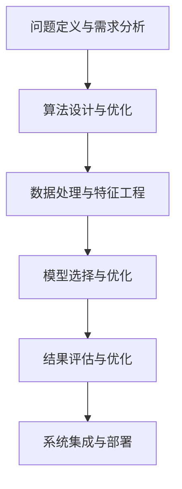

                 

## 1. 背景介绍

### 1.1 问题由来
在当今快速变化的信息时代，面对日益复杂、多变的问题，如何高效、准确地解决这些问题，成为了每一位技术从业者乃至普通人需要掌握的关键能力。特别是在人工智能领域，从数据预处理到模型训练，再到应用部署，每一个环节都需要深入理解和运用解决问题的思维方式，才能取得突破性的进展。本文旨在探讨如何通过思维工具，提升问题解决能力，帮助读者在各个技术层面和应用场景中游刃有余。

### 1.2 问题核心关键点
问题解决能力是综合素质和核心技能的表现。在技术层面，问题解决能力主要体现在以下几个方面：
- 理解问题的本质和需求，精准定位问题域。
- 设计高效算法，确保问题解决路径的正确性。
- 数据处理与特征工程，为模型提供高质量的输入。
- 模型选择与优化，构建合适且高效的模型结构。
- 结果评估与优化，确保模型效果符合预期。
- 系统集成与部署，将模型应用到实际环境中。

这些关键点构成了问题解决能力的基础，涵盖了技术栈的各个层面。通过运用正确的思维方式，我们可以更加高效地处理复杂问题，提高工作效率。

### 1.3 问题研究意义
提升问题解决能力，对于技术从业者而言，意义重大：
- 提高工作效率。运用高效的问题解决思维工具，可以在短时间内处理更多问题，提高产出。
- 增强创新能力。面对新问题时，具备良好的问题解决能力，能够快速找到创新解法，突破技术瓶颈。
- 优化决策质量。通过系统化的思维训练，可以避免片面、武断的决策，提升决策的科学性和合理性。
- 促进知识迁移。问题解决能力能够帮助技术从业者跨领域应用知识，拓宽技术视野，提升综合素养。
- 增强团队协作。高效的问题解决思维有助于团队成员协同工作，提高团队整体效能。

## 2. 核心概念与联系

### 2.1 核心概念概述

要提升问题解决能力，首先需要了解和掌握以下几个核心概念：

- **问题定义与需求分析**：精准理解问题的本质和需求，明确问题域和目标。
- **算法设计与优化**：选择或设计合适的算法，优化算法性能，确保问题解决路径的有效性。
- **数据处理与特征工程**：对原始数据进行清洗、转换、提取等操作，为模型提供高质量的输入数据。
- **模型选择与优化**：根据问题特征选择合适的模型，并进行参数调优，提高模型效果。
- **结果评估与优化**：通过科学合理的评估指标，判断模型效果，并进行必要的优化。
- **系统集成与部署**：将模型应用到实际系统中，并确保其稳定性和可靠性。

这些概念相互关联，共同构成了解决问题的完整过程。通过理解和掌握这些核心概念，我们可以系统地提升问题解决能力。

### 2.2 核心概念原理和架构的 Mermaid 流程图


## 3. 核心算法原理 & 具体操作步骤

### 3.1 算法原理概述
问题解决的核心在于运用算法和模型，高效处理和分析数据，得出正确的结论。以下是对常见问题解决算法原理的概述：

- **决策树**：通过树状结构表示决策过程，利用信息熵或基尼指数等指标进行优化。
- **线性回归**：通过最小化平方误差，拟合出一条直线，预测连续型数据。
- **逻辑回归**：通过最大化似然函数，预测分类结果，适用于二分类和多分类问题。
- **支持向量机**：通过构建最优超平面，实现分类和回归，具有较高的泛化能力。
- **随机森林**：通过集成多个决策树，降低过拟合风险，提高模型精度。
- **神经网络**：通过多层非线性变换，提取复杂特征，适用于高维数据和复杂模型。

这些算法在数据科学和人工智能领域广泛应用，是问题解决的核心工具。

### 3.2 算法步骤详解
问题解决的算法步骤通常包括以下几个关键环节：

1. **数据收集与清洗**：获取相关数据，并进行初步清洗，确保数据质量。
2. **特征提取与选择**：从原始数据中提取和选择特征，减少噪声和冗余。
3. **模型选择与训练**：根据问题特征选择合适的模型，利用训练数据进行模型训练。
4. **模型评估与优化**：通过验证集评估模型性能，进行必要的参数调优。
5. **模型部署与应用**：将训练好的模型应用到实际问题中，进行预测和推理。

### 3.3 算法优缺点
每种算法都有其独特的优缺点，以下是对常见算法优缺点的简要分析：

- **决策树**：优点在于易于理解和解释，处理高维数据能力强；缺点是容易过拟合，对噪声敏感。
- **线性回归**：优点在于模型简单，计算效率高；缺点是假设数据线性可分，无法处理非线性问题。
- **逻辑回归**：优点在于模型易于优化，适用于二分类问题；缺点是对于多分类问题效果有限。
- **支持向量机**：优点在于泛化能力强，适用于小样本高维数据；缺点是计算复杂度高，对参数敏感。
- **随机森林**：优点在于集成学习能力强，抗过拟合效果好；缺点是模型复杂度高，难以解释。
- **神经网络**：优点在于适应性强，可以处理复杂数据和结构；缺点是计算资源消耗大，训练复杂度高。

### 3.4 算法应用领域
这些算法在各个领域都有广泛的应用，以下列举几个典型领域：

- **金融风控**：利用支持向量机和随机森林进行信用评分和风险预测。
- **医疗诊断**：利用逻辑回归和神经网络进行疾病诊断和预测。
- **自然语言处理**：利用决策树和神经网络进行文本分类和情感分析。
- **图像识别**：利用卷积神经网络进行图像分类和物体检测。
- **推荐系统**：利用协同过滤和深度学习进行个性化推荐。

## 4. 数学模型和公式 & 详细讲解 & 举例说明

### 4.1 数学模型构建
问题解决中常用的数学模型包括线性回归、逻辑回归、支持向量机等。以线性回归为例，其数学模型为：

$$ y = \beta_0 + \beta_1 x_1 + \beta_2 x_2 + \cdots + \beta_n x_n + \epsilon $$

其中 $y$ 为预测值，$\beta_0, \beta_1, \cdots, \beta_n$ 为模型参数，$x_1, x_2, \cdots, x_n$ 为自变量，$\epsilon$ 为误差项。

### 4.2 公式推导过程
线性回归的推导过程如下：

1. 最小二乘法求解模型参数：

$$ \hat{\beta} = (X^T X)^{-1} X^T y $$

其中 $X$ 为自变量矩阵，$y$ 为因变量向量，$\hat{\beta}$ 为模型参数向量。

2. 模型评估指标：均方误差（MSE）和决定系数（R^2）：

$$ MSE = \frac{1}{n} \sum_{i=1}^n (y_i - \hat{y}_i)^2 $$

$$ R^2 = 1 - \frac{\sum_{i=1}^n (y_i - \hat{y}_i)^2}{\sum_{i=1}^n (y_i - \bar{y})^2} $$

其中 $\bar{y}$ 为因变量均值，$n$ 为样本数量。

### 4.3 案例分析与讲解
以某公司的客户流失预测为例，使用逻辑回归模型进行建模：

1. **数据收集与清洗**：收集客户基本信息、行为数据、消费数据等，并进行初步清洗，去除缺失值和异常值。
2. **特征提取与选择**：从清洗后的数据中提取特征，如年龄、性别、消费金额等，并进行归一化处理。
3. **模型选择与训练**：选择逻辑回归模型，利用训练数据进行模型训练，得到模型参数。
4. **模型评估与优化**：在验证集上评估模型性能，利用交叉验证和网格搜索进行参数调优。
5. **模型部署与应用**：将训练好的模型应用到实际客户流失预测中，进行实时预测和预警。

## 5. 项目实践：代码实例和详细解释说明

### 5.1 开发环境搭建
问题解决中的项目实践通常需要构建一个开发环境。以下是一个基本的Python开发环境搭建步骤：

1. 安装Python：从官网下载Python，并安装在系统环境中。
2. 安装虚拟环境：使用`virtualenv`或`conda`创建虚拟环境，避免与其他项目产生冲突。
3. 安装依赖库：通过`pip`或`conda`安装问题解决所需依赖库，如`numpy`、`pandas`、`scikit-learn`等。

### 5.2 源代码详细实现
以下是一个使用Python实现线性回归模型的代码示例：

```python
import numpy as np
from sklearn.linear_model import LinearRegression

# 数据生成
X = np.array([[1, 2], [2, 3], [3, 4], [4, 5], [5, 6]])
y = np.dot(X, np.array([0.1, 0.2])) + 1 + np.random.normal(0, 0.1, 5)

# 模型训练
model = LinearRegression()
model.fit(X, y)

# 模型预测
X_test = np.array([[1.5, 2.5], [2.5, 3.5], [3.5, 4.5]])
y_pred = model.predict(X_test)
```

### 5.3 代码解读与分析
上述代码中，首先使用NumPy生成了一个线性回归问题中的样本数据，并定义了对应的标签。然后，使用Scikit-learn库中的`LinearRegression`类进行模型训练，并利用训练好的模型对新数据进行预测。

### 5.4 运行结果展示
运行上述代码，输出模型训练结果和预测结果，可以验证模型的拟合效果：

```python
print(model.coef_)
print(model.intercept_)
print(y_pred)
```

## 6. 实际应用场景

### 6.1 金融风控
金融风控是问题解决的重要应用场景之一。金融机构利用机器学习模型对客户信用进行评估，预测违约风险。以下是一个使用决策树模型进行客户信用评分的案例：

1. **数据收集与清洗**：收集客户基本信息、消费记录、还款记录等数据，并进行清洗，去除异常值和噪声。
2. **特征提取与选择**：从清洗后的数据中提取特征，如年龄、婚姻状况、收入水平等，并进行归一化处理。
3. **模型选择与训练**：选择决策树模型，利用训练数据进行模型训练，得到决策树模型。
4. **模型评估与优化**：在验证集上评估模型性能，利用交叉验证和网格搜索进行参数调优。
5. **模型部署与应用**：将训练好的模型应用到实时信用评分中，进行实时预测和风险控制。

### 6.2 医疗诊断
医疗诊断是另一个问题解决的重要应用场景。医疗领域利用机器学习模型对疾病进行预测和诊断。以下是一个使用神经网络模型进行疾病预测的案例：

1. **数据收集与清洗**：收集患者的基本信息、症状记录、历史病历等数据，并进行清洗，去除缺失值和异常值。
2. **特征提取与选择**：从清洗后的数据中提取特征，如症状描述、实验室检查结果等，并进行归一化处理。
3. **模型选择与训练**：选择神经网络模型，利用训练数据进行模型训练，得到神经网络模型。
4. **模型评估与优化**：在验证集上评估模型性能，利用交叉验证和网格搜索进行参数调优。
5. **模型部署与应用**：将训练好的模型应用到实时诊断中，进行实时预测和诊断决策。

### 6.3 自然语言处理
自然语言处理是问题解决的重要应用场景之一。NLP领域利用机器学习模型进行文本分类、情感分析、命名实体识别等任务。以下是一个使用决策树模型进行文本分类的案例：

1. **数据收集与清洗**：收集新闻、评论、社交媒体等文本数据，并进行清洗，去除停用词和噪声。
2. **特征提取与选择**：从清洗后的数据中提取特征，如TF-IDF向量、词频向量等，并进行归一化处理。
3. **模型选择与训练**：选择决策树模型，利用训练数据进行模型训练，得到决策树模型。
4. **模型评估与优化**：在验证集上评估模型性能，利用交叉验证和网格搜索进行参数调优。
5. **模型部署与应用**：将训练好的模型应用到实时文本分类中，进行实时预测和情感分析。

## 7. 工具和资源推荐

### 7.1 学习资源推荐

要提升问题解决能力，首先需要掌握相关理论知识。以下是几本经典的推荐书籍：

1. 《Python机器学习基础教程》：介绍Python机器学习基础，包括数据预处理、特征工程、模型训练等。
2. 《机器学习实战》：介绍常用的机器学习算法和应用案例，适合初学者入门。
3. 《深度学习》：介绍深度学习的基本概念和算法，适合对深度学习有深入了解的读者。
4. 《统计学习方法》：介绍统计学习的基本方法，适合对统计学有基本了解的读者。
5. 《数据科学导论》：介绍数据科学的综合知识，适合希望全面了解数据科学领域的读者。

### 7.2 开发工具推荐

问题解决的开发过程中，需要利用各种工具进行辅助。以下是几款常用的开发工具：

1. Jupyter Notebook：开源的交互式计算环境，支持Python、R等多种语言，适合进行数据处理和算法开发。
2. PyCharm：开源的IDE，支持Python、Java等多种语言，适合进行复杂项目开发。
3. RStudio：开源的IDE，支持R语言，适合进行数据科学和机器学习开发。
4. Visual Studio Code：轻量级的IDE，支持多种语言，适合进行快速原型开发和调试。
5. Anaconda：开源的Python科学计算平台，提供丰富的科学计算库和环境管理工具。

### 7.3 相关论文推荐

以下是几篇经典的问题解决相关论文，值得深入阅读：

1. 《随机森林：决策树集成算法》：介绍随机森林算法，探讨集成学习的基本思想和应用。
2. 《深度学习在图像分类中的应用》：介绍深度学习在图像分类中的应用，探讨卷积神经网络的基本原理和优化方法。
3. 《支持向量机：一种优化决策边界的方法》：介绍支持向量机算法，探讨核函数和正则化方法。
4. 《逻辑回归：一种二分类方法》：介绍逻辑回归算法，探讨损失函数和梯度下降方法。
5. 《决策树算法：一种分治思想的应用》：介绍决策树算法，探讨特征选择和剪枝方法。

## 8. 总结：未来发展趋势与挑战

### 8.1 研究成果总结
通过深入研究问题解决的数学模型和算法，我们积累了大量理论和实践经验。未来，还需要进一步探索问题解决的跨学科应用，结合其他领域的知识，提升问题解决的综合能力。

### 8.2 未来发展趋势
未来问题解决的发展趋势包括：
1. 多学科融合：问题解决将更多地结合心理学、社会学等学科知识，提升综合应用能力。
2. 实时化：问题解决将更加注重实时性和效率，适应高速发展的信息技术环境。
3. 智能化：问题解决将更多地利用人工智能技术，提升自动化和智能化水平。
4. 多模态化：问题解决将更多地结合图像、声音、文本等多种模态数据，提升综合分析能力。
5. 可解释性：问题解决将更加注重模型的可解释性，提升透明度和可信度。

### 8.3 面临的挑战
问题解决在发展过程中，仍面临诸多挑战：
1. 数据稀缺：高质量的数据获取成本高，数据稀缺仍然是问题解决的主要瓶颈。
2. 模型复杂：复杂的模型结构和高维度数据，增加了问题解决的难度。
3. 结果可解释：模型的复杂性和黑盒性质，导致结果可解释性不足，难以满足高风险领域的要求。
4. 实时性：问题解决的实时性要求高，现有的计算资源难以满足实时性需求。
5. 安全性：问题解决的模型输出，需要保证数据安全和隐私保护。

### 8.4 研究展望
未来问题解决的研究方向包括：
1. 数据生成技术：通过数据生成技术，扩充数据集，解决数据稀缺问题。
2. 模型简化技术：通过模型简化技术，降低模型复杂度，提高问题解决的效率。
3. 解释性方法：通过解释性方法，提升模型的可解释性，增强透明度和可信度。
4. 实时化技术：通过实时化技术，提升问题解决的实时性，满足高速发展的需求。
5. 安全保护技术：通过安全保护技术，保护数据安全和隐私，提升问题解决的可靠性。

## 9. 附录：常见问题与解答

**Q1：如何提高数据预处理的质量？**

A: 提高数据预处理质量，可以从以下几个方面入手：
1. 数据清洗：去除异常值和噪声，确保数据准确性。
2. 特征选择：选择有意义的特征，减少冗余和噪声。
3. 特征工程：进行特征转换和提取，提高特征表达能力。
4. 数据标准化：对数据进行标准化处理，提高模型收敛速度。

**Q2：如何选择合适的问题解决算法？**

A: 选择合适的问题解决算法，需要考虑以下几个因素：
1. 问题类型：根据问题类型选择不同的算法，如分类、回归、聚类等。
2. 数据特征：根据数据特征选择不同的算法，如线性和非线性、高维和低维等。
3. 计算资源：根据计算资源选择不同的算法，如简单算法和复杂算法。
4. 可解释性：根据可解释性需求选择不同的算法，如黑盒算法和可解释性算法。

**Q3：如何评估模型的性能？**

A: 评估模型性能，需要选择合适的评估指标，如准确率、召回率、F1值、ROC曲线等。根据问题类型和需求，选择相应的评估指标，进行模型评估。同时，利用交叉验证、网格搜索等方法进行模型调优，提高模型效果。

**Q4：如何处理数据集不平衡问题？**

A: 数据集不平衡问题，可以通过以下几个方法处理：
1. 欠采样：减少多数类样本数量，提高少数类样本数量。
2. 过采样：增加少数类样本数量，减少多数类样本数量。
3. 重采样：通过欠采样和过采样结合的方法，平衡数据集。
4. 类别权重：调整模型训练时的类别权重，提高少数类样本的重要性。

**Q5：如何在模型训练过程中避免过拟合？**

A: 避免过拟合，可以从以下几个方面入手：
1. 增加数据量：增加训练数据量，提高模型泛化能力。
2. 正则化：引入L1、L2正则化，防止模型过拟合。
3. 早停法：在验证集性能不再提升时，停止训练，避免过拟合。
4. 数据增强：通过数据增强方法，扩充训练数据集。

---

作者：禅与计算机程序设计艺术 / Zen and the Art of Computer Programming

