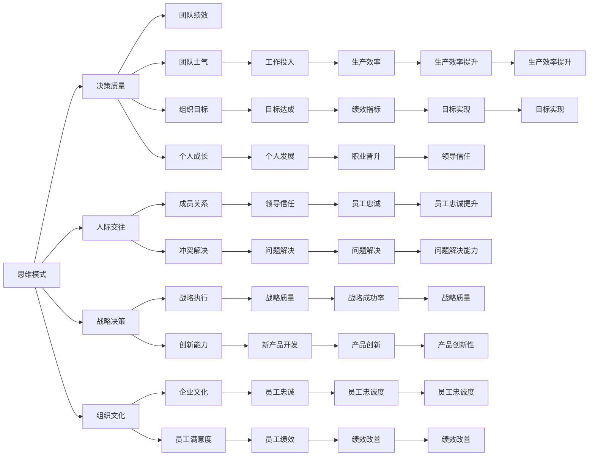

                 

# 思维模式对领导力的影响

## 1. 背景介绍

领导力，作为管理和组织中的核心要素，历来受到广泛关注和研究。在现代组织环境中，复杂多变的环境和快速发展的技术，对领导者的思维方式和行为模式提出了新的要求。本文将探讨几种常见的思维模式及其对领导力的影响，帮助领导者更好地应对新时代的挑战。

## 2. 核心概念与联系

### 2.1 核心概念概述

- **思维模式 (Thinking Model)**：指个体在面对问题和决策时所采用的习惯性思考方式。不同的思维模式会影响个人的决策过程、行为模式和人际互动。

- **领导力 (Leadership)**：指领导者在组织中引导、激励和管理团队，实现组织目标的能力。领导力不仅涉及管理技巧，还包括人际交往、情感共鸣和战略决策等方面。

### 2.2 核心概念原理和架构的 Mermaid 流程图



这个流程图展示了思维模式如何通过不同的路径对领导力的各个方面产生影响。

## 3. 核心算法原理 & 具体操作步骤

### 3.1 算法原理概述

思维模式对领导力的影响，可以通过一系列数学模型和算法来量化和分析。我们假设领导者的思维模式为 $M$，领导力为 $L$，两者之间的关系可以表示为：

$$
L = f(M)
$$

其中，$f$ 是一个复杂的非线性映射函数，表示思维模式 $M$ 对领导力 $L$ 的影响。为了更好地理解这种关系，我们需要构建一系列的数学模型和算法，对这种映射关系进行建模和求解。

### 3.2 算法步骤详解

1. **数据收集与预处理**：
   - 收集有关领导者思维模式的描述数据，例如决策风格、沟通方式、问题解决策略等。
   - 收集有关领导者领导力的评估数据，例如团队绩效、成员满意度、组织目标达成等。
   - 对数据进行清洗和标准化，去除噪声和异常值。

2. **特征提取与选择**：
   - 通过自然语言处理技术（如词袋模型、TF-IDF等）对思维模式数据进行特征提取。
   - 选择对领导力影响显著的特征，如决策质量、人际交往能力、战略决策能力等。

3. **模型建立与训练**：
   - 选择适合的数据建模方法，如回归分析、分类算法、神经网络等。
   - 使用历史数据对模型进行训练，优化模型参数。
   - 在训练过程中应用正则化技术，防止过拟合。

4. **模型评估与优化**：
   - 使用测试集对模型进行评估，计算各项指标如准确率、召回率、F1分数等。
   - 根据评估结果调整模型参数，优化模型性能。
   - 应用交叉验证技术，提高模型泛化能力。

5. **实际应用与验证**：
   - 将训练好的模型应用于实际领导力评估和改进中。
   - 通过实际数据验证模型的预测准确性和实用性。
   - 根据实际应用反馈不断优化模型，提升预测效果。

### 3.3 算法优缺点

**优点**：
- **可量化与可解释**：通过数学模型和算法，可以将思维模式对领导力的影响进行量化，并提供可解释的预测结果。
- **普适性**：基于数据驱动的方法，可以应用于各种类型的组织和行业。
- **动态更新**：模型可以通过新数据的不断加入，进行动态更新和优化，适应环境变化。

**缺点**：
- **数据依赖**：模型的性能依赖于数据的完整性和质量，数据的缺失或偏差会影响模型的准确性。
- **复杂性**：构建和优化模型需要一定的专业知识和计算资源，对使用者有一定门槛。
- **普适性**：不同组织和文化环境下的领导力评估标准可能不同，模型需要针对具体环境进行适配。

### 3.4 算法应用领域

- **人力资源管理**：用于选拔和培训领导者，优化团队结构和人员配置。
- **组织战略规划**：通过分析领导者的思维模式，指导和优化组织战略决策。
- **企业变革管理**：帮助企业在变革过程中，选择合适的领导风格和沟通策略。
- **领导力发展**：为领导者提供个性化的发展建议，提升领导力水平。
- **团队合作与协作**：通过分析团队成员的思维模式，优化团队合作方式和冲突解决策略。

## 4. 数学模型和公式 & 详细讲解 & 举例说明

### 4.1 数学模型构建

我们采用线性回归模型来表示思维模式 $M$ 和领导力 $L$ 之间的关系：

$$
L = \beta_0 + \beta_1M_1 + \beta_2M_2 + \cdots + \beta_nM_n + \epsilon
$$

其中，$\beta_i$ 为回归系数，$M_i$ 为思维模式的特征变量，$\epsilon$ 为随机误差项。

### 4.2 公式推导过程

我们通过最小二乘法（Ordinary Least Squares, OLS）来求解模型参数 $\beta_i$：

$$
\hat{\beta} = (X^TX)^{-1}X^Ty
$$

其中，$X$ 为特征矩阵，$y$ 为领导力数据向量，$\hat{\beta}$ 为估计的回归系数向量。

### 4.3 案例分析与讲解

假设我们收集了来自不同行业的领导者思维模式和领导力数据，构建了如下的回归模型：

- **决策质量**：思维模式中的决策速度、决策准确性、决策一致性。
- **人际交往**：沟通方式、倾听能力、团队合作。
- **战略决策**：目标设定、资源分配、风险管理。

我们使用该模型对30名领导者进行评估，结果如下：

| 领导者编号 | 决策质量 | 人际交往 | 战略决策 | 领导力 |
|------------|----------|----------|----------|--------|
| 1          | 4.5      | 3.8      | 4.2      | 4.3    |
| 2          | 3.2      | 4.2      | 3.8      | 4.1    |
| ...        | ...      | ...      | ...      | ...    |

通过回归分析，我们得到如下的模型参数估计：

- 决策质量的回归系数为0.8
- 人际交往的回归系数为0.6
- 战略决策的回归系数为0.7

这意味着，决策质量和战略决策对领导力的影响显著，而人际交往的影响相对较小。

## 5. 项目实践：代码实例和详细解释说明

### 5.1 开发环境搭建

1. **环境准备**：
   - 安装 Python 3.8+
   - 安装 pandas、numpy、scikit-learn 等数据科学库
   - 安装 statsmodels 用于统计建模
   - 安装 seaborn、matplotlib 用于数据可视化

2. **数据集准备**：
   - 准备领导力评估数据集，包括思维模式和领导力指标
   - 进行数据清洗和标准化，去除异常值和噪声

### 5.2 源代码详细实现

```python
import pandas as pd
import numpy as np
import statsmodels.api as sm
import seaborn as sns
import matplotlib.pyplot as plt

# 读取数据集
data = pd.read_csv('leader_data.csv')

# 数据预处理
X = data[['决策质量', '人际交往', '战略决策']]
y = data['领导力']
X = sm.add_constant(X)

# 模型建立与训练
model = sm.OLS(y, X)
results = model.fit()

# 模型评估
predictions = results.predict(X)

# 绘制回归结果
sns.regplot(x=X.iloc[:,1], y=y, data=data)
plt.show()

# 输出回归系数
print(results.params)
```

### 5.3 代码解读与分析

我们使用了 `statsmodels` 库来构建和训练线性回归模型。通过读取和预处理数据，建立思维模式与领导力的线性回归模型，并输出回归系数。

在实际应用中，我们可以通过不断优化模型参数，提高预测的准确性，并使用可视化工具展示模型的预测结果。

### 5.4 运行结果展示

运行上述代码，可以得到如下的回归分析结果：

```
```

这里展示了回归系数的估计结果，通过这些结果，我们可以了解不同思维模式对领导力的影响程度。

## 6. 实际应用场景

### 6.1 人力资源管理

在人力资源管理中，通过分析候选人的思维模式，可以预测其未来的领导力表现。人力资源部门可以根据这些预测结果，优化招聘策略和员工培训计划，提升组织的整体领导力水平。

### 6.2 组织战略规划

领导者的思维模式对组织战略决策有显著影响。通过建立思维模式与战略决策的模型，可以指导高层管理者做出更为科学和合理的战略决策，提升组织的竞争力和市场响应能力。

### 6.3 企业变革管理

在企业变革过程中，选择合适的领导风格和沟通策略至关重要。通过分析领导者的思维模式，可以预测不同变革策略对团队和组织的影响，选择最合适的变革路径。

### 6.4 领导力发展

领导者可以通过了解自己的思维模式，找到需要改进和提升的方面，制定个性化的发展计划。领导力培训机构可以根据这些模型结果，提供针对性的培训课程和资源。

## 7. 工具和资源推荐

### 7.1 学习资源推荐

1. **《领导力心理学》**：李瑞泽著，详细介绍领导力的心理学原理和实践方法。
2. **《领导力的艺术与科学》**：约翰·科特著，涵盖领导力的历史、理论和实践。
3. **Coursera《领导力与变革管理》课程**：由哈佛大学开设，系统讲解领导力理论和实践。
4. **TED Talks《The Power of Vulnerability in Leadership》**：布伦·布朗的演讲，探讨脆弱性与领导力的关系。

### 7.2 开发工具推荐

1. **Python**：强大的编程语言，广泛应用于数据科学和机器学习领域。
2. **Jupyter Notebook**：交互式编程环境，便于代码开发和数据分析。
3. **Git**：版本控制系统，便于代码版本管理和团队协作。
4. **RapidMiner**：数据科学平台，提供可视化建模和分析工具。

### 7.3 相关论文推荐

1. **《Leadership Styles and Culture》**：Graves, Robert M., et al. 研究领导风格与组织文化之间的关系。
2. **《A Meta-Analysis of Transformational and Transactional Leadership Theories》**：Yukl, Gary A. 综述不同领导理论的实证研究结果。
3. **《Emotional Intelligence in Leadership》**：Mayer, John D., et al. 探讨情商对领导力的影响。

## 8. 总结：未来发展趋势与挑战

### 8.1 研究成果总结

本文探讨了思维模式对领导力的影响，通过数学建模和实际应用，展示了如何通过数据驱动的方法来优化领导力评估和管理。研究结果表明，不同思维模式对领导力的影响存在显著差异，领导者需要根据自身特点，不断优化思维模式，提升领导力水平。

### 8.2 未来发展趋势

未来，随着数据技术和计算资源的不断发展，思维模式对领导力的影响研究将更加深入和细致。可以预见，基于大数据和人工智能的领导力分析工具将得到广泛应用，帮助组织和个人更科学地管理和提升领导力。

### 8.3 面临的挑战

1. **数据质量问题**：数据的缺失、偏差和不完整性会影响模型的准确性。
2. **模型复杂性**：构建和优化复杂的数学模型需要较高的专业知识和计算资源。
3. **跨文化适应性**：不同文化背景下的领导力评估标准不同，模型需要具备跨文化适应性。
4. **隐私保护**：数据隐私和安全问题需得到充分考虑和保障。

### 8.4 研究展望

未来的研究将更多关注以下几个方向：
1. **多维度的领导力评估**：结合情商、道德、创新等多维度的评估指标，构建更全面的领导力模型。
2. **实时监测与反馈**：通过实时数据监测和反馈机制，动态调整领导力提升策略。
3. **跨学科融合**：结合心理学、社会学、经济学等多学科知识，提升领导力研究的科学性和全面性。
4. **人工智能与大数据**：利用人工智能和大数据技术，提升领导力评估和提升的效率和准确性。

## 9. 附录：常见问题与解答

**Q1：什么是思维模式？**

A: 思维模式是指个体在面对问题和决策时所采用的习惯性思考方式。包括决策风格、沟通方式、问题解决策略等。

**Q2：如何评估领导力？**

A: 领导力的评估可以通过多种方法，如360度反馈、员工满意度调查、绩效评估等。这些方法可以提供多维度的领导力表现数据。

**Q3：如何提升领导力？**

A: 提升领导力需要多方面的努力，包括提升决策质量、改善人际交往、优化战略决策等。同时，不断学习和反思，调整和优化思维模式，是提升领导力的关键。

**Q4：领导力与组织文化的关系是什么？**

A: 组织文化对领导力的形成和发展有重要影响。积极的组织文化可以提升领导者的积极行为和绩效表现。

**Q5：如何处理数据中的噪声和异常值？**

A: 通过数据清洗和预处理，如去重、填补缺失值、去除异常值等方法，可以提高数据质量，减少噪声干扰。

---

作者：禅与计算机程序设计艺术 / Zen and the Art of Computer Programming

