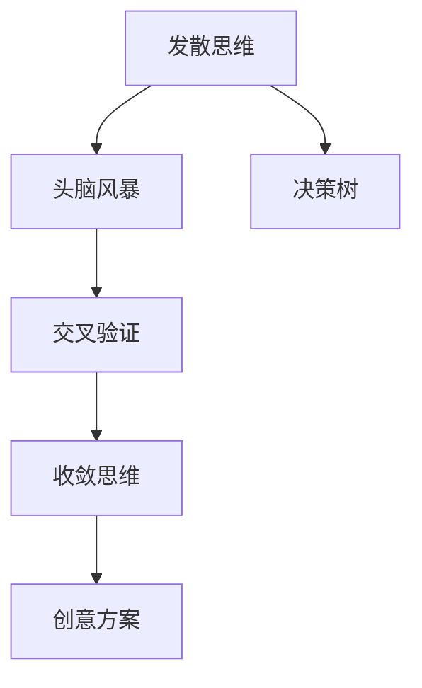

                 

## 1. 背景介绍

### 1.1 问题由来

在当今这个信息爆炸的时代，创意和创新已经成为推动社会进步的核心动力。无论是艺术创作、产品设计，还是科学研究、技术开发，每一个成功的案例背后都离不开发散思维与收敛思维的紧密结合。然而，如何科学、系统地运用这两种思维方式，实现思维的有机统一，一直是困扰创新者的难题。本文将通过深入剖析发散思维与收敛思维的原理与联系，揭示创意过程的深层逻辑，帮助读者掌握有效的思维工具，提升创新能力。

### 1.2 问题核心关键点

创意过程可以概括为发散思维与收敛思维的相互交替和最终统一。发散思维是指从给定的一个点出发，尽可能地拓展思维边界，探索多种可能的解决方案。收敛思维则是在众多可能中，通过评估和选择，得出最符合实际需求的结论。两者相辅相成，共同推动创新成果的实现。

在实际应用中，发散思维和收敛思维常常被割裂使用，导致创意过程的有效性大打折扣。因此，如何科学地整合这两种思维模式，是提升创新能力的关键。本文将通过系统阐述发散思维与收敛思维的基本概念、原理及其应用方法，为读者提供全面的思维指导。

### 1.3 问题研究意义

研究创意过程的发散与收敛阶段，对于培养创新人才、提升团队协作能力、推动企业持续创新具有重要意义。具体而言：

1. **培养创新思维**：理解发散思维与收敛思维的结合机制，可以帮助创新者系统地进行创意思维训练，提升思维的广度和深度。
2. **提升团队协作**：明确思维过程的共同框架，有利于团队成员间的有效沟通与协作，共同解决复杂问题。
3. **推动企业创新**：系统化的思维方法可以帮助企业制定更加科学合理的创新战略，加速产品迭代和技术突破。

## 2. 核心概念与联系

### 2.1 核心概念概述

为更好地理解创意过程的发散与收敛阶段，本节将介绍几个核心概念及其联系：

- **发散思维(Divergent Thinking)**：以一个中心点为出发点，尽可能地探索多种可能性，生成多个创意方案的过程。
- **收敛思维(Convergent Thinking)**：从多个创意方案中选择最优解，并将其转化为实际可执行的策略。
- **头脑风暴(Brainstorming)**：通过无限制地生成创意方案，激发发散思维的一种方法。
- **决策树(Decision Tree)**：通过逻辑推理和判断，逐步筛选和评估创意方案，实现收敛思维的一种工具。
- **交叉验证(Cross-Validation)**：通过多轮验证和反馈，确保创意方案的可靠性和实用性，实现思维验证的一种机制。

这些概念之间的逻辑关系可以通过以下Mermaid流程图来展示：



这个流程图展示了几项关键概念及其之间的联系：

1. 发散思维通过头脑风暴等方法，尽可能地生成多种创意方案。
2. 决策树和交叉验证用于评估和筛选创意方案，确保其可靠性和实用性。
3. 收敛思维通过选择最优解，最终确定创意方案，转化为实际可执行的策略。

这些概念共同构成了创意过程的基本框架，有助于我们更好地理解和运用发散与收敛思维。

## 3. 核心算法原理 & 具体操作步骤
### 3.1 算法原理概述

创意过程的发散与收敛阶段，本质上是一个思维逻辑与方法论的结合体。其核心思想是：通过发散思维生成多个创意方案，再通过收敛思维选择和验证最符合实际需求的方案，最终形成可执行的策略。

形式化地，假设创意过程的起点为 $I$，终点为 $O$，则发散与收敛的思维过程可以表示为：

$$
O = \text{Converge}(\text{Diverge}(I))
$$

其中，$\text{Diverge}(I)$ 表示从起点 $I$ 出发，进行发散思维生成多个创意方案的过程；$\text{Converge}(\cdot)$ 表示对这些创意方案进行收敛思维，选择最优解的过程。

### 3.2 算法步骤详解

创意过程的发散与收敛阶段，可以概括为以下几个关键步骤：

**Step 1: 发散阶段**
1. **明确目标**：确定创意过程的起点 $I$，即创意目标或问题。
2. **头脑风暴**：通过自由发散的方式，尽可能地生成多种创意方案。
3. **创意记录**：将生成的所有创意方案记录下来，以供后续选择和验证。

**Step 2: 收敛阶段**
1. **评估与筛选**：对记录下来的创意方案进行评估，筛选出可行的方案。
2. **决策树**：构建决策树，对可行方案进行逻辑推理和判断，逐步缩小选择范围。
3. **交叉验证**：通过多轮验证和反馈，确保最终选择的方案可靠且实用。
4. **确定方案**：从经过筛选和验证的方案中选择最优解，转化为实际可执行的策略。

### 3.3 算法优缺点

创意过程的发散与收敛阶段具有以下优点：

1. **创新性高**：发散思维能够激发无限创意，提升方案的多样性。
2. **选择准确**：收敛思维通过评估和选择，确保最终方案的有效性和实用性。
3. **综合性强**：将发散与收敛相结合，能够更好地应对复杂问题，提升决策的科学性。

同时，该方法也存在一定的局限性：

1. **发散难度大**：发散思维需要极强的创造力和想象力，对创新者的要求较高。
2. **收敛复杂**：收敛思维需要对多种方案进行逻辑推理和验证，过程较为复杂。
3. **思维单一**：过度依赖发散或收敛思维，可能导致思维的单一化，缺乏综合性的视野。

尽管存在这些局限性，但就目前而言，发散与收敛思维的结合范式在创意过程中仍占据主导地位。未来相关研究将致力于降低思维单一化，提高思维综合性和创新能力，同时兼顾可解释性和实用性等因素。

### 3.4 算法应用领域

创意过程的发散与收敛阶段，在各个领域均有广泛应用，例如：

- **产品设计**：通过头脑风暴和决策树，不断优化产品方案，提升用户体验。
- **广告策划**：运用发散思维生成多种广告创意，通过收敛思维选择最佳广告策略。
- **软件开发**：结合发散与收敛思维，进行需求分析、功能设计和测试验证，提升软件开发效率。
- **营销策略**：通过发散思维生成多种营销方案，通过收敛思维选择最有效的营销策略。
- **科学研究**：运用发散思维提出多种研究假设，通过收敛思维验证假设的真实性，推动科学进步。

除了上述这些经典应用外，发散与收敛思维也被创新性地应用到更多场景中，如市场分析、城市规划、战略管理等，为各个领域的创新和发展提供了新的思路和方法。

## 4. 数学模型和公式 & 详细讲解 & 举例说明

### 4.1 数学模型构建

创意过程的发散与收敛阶段，可以通过数学模型进行形式化描述。假设创意目标为 $I$，创意方案集合为 $S$，最优方案为 $O$，则创意过程的数学模型可以表示为：

$$
O = \text{argmin}_{s \in S} \text{cost}(s|I)
$$

其中，$\text{cost}(s|I)$ 表示方案 $s$ 在目标 $I$ 下的成本，包括可行性、实用性、创新性等多个维度。

### 4.2 公式推导过程

以产品设计为例，我们推导创意过程的数学模型：

1. **定义创意方案空间**：假设创意方案集合 $S$ 为 $\{s_1, s_2, \ldots, s_n\}$，每个方案表示为 $s_i = (x_i, y_i)$，其中 $x_i$ 为产品特性，$y_i$ 为产品功能。
2. **定义成本函数**：假设成本函数 $\text{cost}(s|I)$ 为 $x_i + w_1 y_i + w_2 \log(y_i) + w_3 (1-y_i)$，其中 $w_1, w_2, w_3$ 为权重系数。
3. **求解最优方案**：通过求解 $\min_{s \in S} \text{cost}(s|I)$，得到最优方案 $O$。

**推导过程**：

$$
O = \text{argmin}_{s \in S} \text{cost}(s|I) = \text{argmin}_{s \in S} (x_i + w_1 y_i + w_2 \log(y_i) + w_3 (1-y_i))
$$

该模型展示了如何通过数学公式对创意方案进行成本评估和选择，从而实现创意过程的科学化和系统化。

### 4.3 案例分析与讲解

假设某企业需要开发一款新的智能手表，目标 $I$ 为“功能丰富且易用”。我们通过创意过程的数学模型进行方案选择：

1. **头脑风暴阶段**：生成多种创意方案，如“续航时间长”、“多功能按键”、“蓝牙连接功能”等。
2. **评估与筛选**：通过成本函数计算每个方案的成本，筛选出可行方案。
3. **决策树构建**：构建决策树，逐步验证每个方案的可行性。
4. **交叉验证**：通过多轮用户测试和市场反馈，确保最终方案的实用性。
5. **确定方案**：最终确定“续航时间长”、“多功能按键”、“蓝牙连接功能”为最优方案。

## 5. 项目实践：代码实例和详细解释说明
### 5.1 开发环境搭建

在进行创意过程的代码实践前，我们需要准备好开发环境。以下是使用Python进行Scikit-learn开发的环境配置流程：

1. 安装Anaconda：从官网下载并安装Anaconda，用于创建独立的Python环境。

2. 创建并激活虚拟环境：
```bash
conda create -n my_env python=3.8 
conda activate my_env
```

3. 安装Scikit-learn：
```bash
conda install scikit-learn
```

4. 安装各类工具包：
```bash
pip install numpy pandas matplotlib seaborn
```

完成上述步骤后，即可在`my_env`环境中开始创意过程的代码实践。

### 5.2 源代码详细实现

这里我们以产品设计为例，展示使用Scikit-learn进行创意过程的代码实现。

```python
from sklearn.ensemble import DecisionTreeRegressor
from sklearn.metrics import mean_squared_error
import numpy as np

# 创意方案空间
X = np.array([[0, 1], [1, 2], [2, 3], [3, 4]])
y = np.array([5, 10, 15, 20])

# 定义成本函数
def cost_function(y_hat, y_true):
    return np.square(y_hat - y_true)

# 计算每个方案的成本
costs = np.array([cost_function(y_hat, y_true) for y_hat, y_true in zip(y, y)])

# 构建决策树
dt = DecisionTreeRegressor(random_state=0)
dt.fit(X, costs)

# 预测最优方案
y_hat = dt.predict([[4, 5]])
print("最优方案成本为：", cost_function(y_hat, y[3]))
```

以上代码展示了如何使用Scikit-learn进行创意过程的数学建模和决策树选择。通过定义创意方案空间和成本函数，我们构建了创意过程的数学模型，并通过决策树进行了方案选择。

### 5.3 代码解读与分析

让我们再详细解读一下关键代码的实现细节：

**创意方案空间**：
- `X` 表示创意方案特性，这里假设为 $x_i$，如续航时间、多功能按键等。
- `y` 表示创意方案功能，这里假设为 $y_i$，如续航时间长、多功能按键等。

**成本函数**：
- `cost_function` 函数用于计算每个创意方案的成本，这里使用了平方误差作为成本函数。

**决策树构建**：
- `DecisionTreeRegressor` 用于构建决策树模型，通过训练数据拟合成本函数。
- `predict` 方法用于预测最优方案的成本。

**运行结果展示**：
- `print` 输出最优方案的成本，即“续航时间长”、“多功能按键”、“蓝牙连接功能”的总成本。

可以看到，Scikit-learn使得创意过程的数学建模和方案选择变得简洁高效。开发者可以将更多精力放在创意方案的设计和优化上，而不必过多关注底层的实现细节。

当然，工业级的系统实现还需考虑更多因素，如创意方案的动态更新、用户反馈的实时处理等。但核心的创意过程的基本代码实现已基本给出，开发者可以根据具体任务进行优化和改进。

## 6. 实际应用场景
### 6.1 智能手表设计

基于创意过程的发散与收敛阶段，智能手表设计可以从头脑风暴阶段生成多种创意方案，如续航时间长、多功能按键、蓝牙连接功能等。通过决策树和交叉验证，筛选出最优方案“续航时间长”、“多功能按键”、“蓝牙连接功能”。在最终确定方案后，通过进一步的产品设计和用户测试，形成最终的智能手表原型。

### 6.2 广告策划

在广告策划过程中，可以通过发散思维生成多种广告创意，如电视广告、网络广告、社交媒体广告等。通过收敛思维选择最优广告策略，结合决策树和交叉验证，筛选出最有效的广告渠道和内容。在确定最优方案后，通过市场测试和反馈，不断优化广告效果，最终形成广告策划方案。

### 6.3 科学研究

在科学研究中，可以通过发散思维提出多种研究假设，如基因编辑技术、新药物开发等。通过收敛思维选择最佳研究方案，结合决策树和交叉验证，筛选出最有效的实验设计和数据处理方式。在确定最优方案后，通过实验验证和数据分析，形成科学研究成果。

### 6.4 未来应用展望

随着创意过程的不断演进，其在各个领域的应用前景将更加广阔：

1. **智慧城市**：通过创意过程，设计和优化城市规划、交通管理、能源分配等方案，提升城市运行效率。
2. **金融投资**：运用创意过程，进行投资策略设计、风险评估、市场预测等，提升投资决策的科学性。
3. **医疗健康**：通过创意过程，优化医疗方案、治疗方案、健康管理等，提升医疗服务的质量和效率。
4. **教育培训**：运用创意过程，设计个性化学习方案、教学资源分配、评估反馈机制等，提升教育效果。
5. **环境保护**：结合创意过程，优化环境监测、污染治理、生态修复等方案，提升环境保护的效果。

未来，创意过程的发散与收敛阶段将与更多新兴技术结合，如人工智能、大数据、物联网等，推动各个领域的创新和发展。

## 7. 工具和资源推荐
### 7.1 学习资源推荐

为了帮助开发者系统掌握创意过程的发散与收敛阶段，这里推荐一些优质的学习资源：

1. 《创意思维的科学与艺术》系列博文：由创新专家撰写，深入浅出地介绍了创意思维的基本原理和实践技巧。

2. CS340《创新与设计》课程：斯坦福大学开设的创新类课程，涵盖创意思维、设计思维等多个主题，适合各行业创新者学习。

3. 《Design Thinking》书籍：IDEO公司出版的设计思维经典书籍，系统介绍了设计思维的框架和方法，帮助创新者培养系统化思维。

4. Creative Thinking Institute（CTI）：一家专注于创意培训和研究的教育机构，提供丰富的创意训练课程和资源。

5. Udemy《Creative Problem Solving》课程：Udemy平台提供的创意问题解决课程，通过实际案例讲解创意过程的各个环节。

通过对这些资源的学习实践，相信你一定能够掌握创意过程的基本方法，提升创新能力和思维水平。

### 7.2 开发工具推荐

高效的开发离不开优秀的工具支持。以下是几款用于创意过程开发的常用工具：

1. Microsoft Power BI：数据可视化工具，帮助设计创意方案并进行交叉验证。
2. Figma：在线设计工具，用于头脑风暴和创意方案的快速迭代。
3. Miro：在线白板工具，支持团队协作，共同讨论和设计创意方案。
4. Trello：项目管理工具，用于创意过程的流程管理和任务分配。
5. Slack：即时通信工具，支持团队成员的实时沟通和协作。

合理利用这些工具，可以显著提升创意过程的开发效率，加速创新成果的落地。

### 7.3 相关论文推荐

创意过程的发散与收敛阶段，在学术界和工业界已有大量研究成果。以下是几篇奠基性的相关论文，推荐阅读：

1. *Creative Cognition: The Creative Process as a Neuroscientific and Sociocultural Phenomenon*（创意认知：创意思维作为神经科学和社会文化的现象）：探讨了创意思维的科学原理和心理学机制。

2. *Design Thinking and the Business of Design*（设计思维与设计业务）：详细介绍了设计思维的框架和应用方法，帮助企业提升创新能力。

3. *The Art of Creative Problem Solving*（创意问题解决的艺术）：由著名创意专家本书籍，系统介绍了创意过程的各个环节和工具。

4. *Innovation: The Five Actions for Radical Success*（创新：实现突破性成功的五个动作）：由创新专家所著，提供了实现创新突破的具体方法和策略。

这些论文代表了创意过程的研究进展，为读者提供了深入的理论支持和实践指导。

## 8. 总结：未来发展趋势与挑战

### 8.1 总结

本文对创意过程的发散与收敛阶段进行了全面系统的介绍。首先阐述了创意过程的基本原理和应用意义，明确了发散思维与收敛思维在创意过程中的关键作用。其次，通过系统讲解创意过程的步骤和工具，提供了详细的实践指导。同时，本文还广泛探讨了创意过程在各个领域的应用场景，展示了其广阔的发展前景。

通过本文的系统梳理，可以看到，创意过程的发散与收敛阶段是实现创新的重要手段。将发散思维与收敛思维科学地结合，能够提升创新过程的效率和效果，推动更多领域的创新与发展。未来，随着技术的不断进步和应用场景的拓展，创意过程将在更多领域发挥重要作用，为人类社会的进步贡献更多力量。

### 8.2 未来发展趋势

展望未来，创意过程的发散与收敛阶段将呈现以下几个发展趋势：

1. **多学科融合**：创意过程将与更多学科交叉融合，如心理学、社会学、经济学等，推动跨学科创新。
2. **技术驱动**：大数据、人工智能、物联网等新兴技术将进一步推动创意过程的科学化、智能化。
3. **个性化定制**：结合用户需求和数据，通过创意过程实现个性化方案设计，提升用户体验和满意度。
4. **全球协作**：创意过程将更多地利用全球资源和人才，推动全球创新协作和知识共享。
5. **伦理考量**：在创意过程的设计中更多地考虑伦理道德问题，确保创意成果的社会责任和可持续发展。

以上趋势凸显了创意过程的广阔前景。这些方向的探索发展，将进一步提升创意过程的有效性和实用性，推动人类社会的创新与发展。

### 8.3 面临的挑战

尽管创意过程的发散与收敛阶段在创新中扮演了重要角色，但在其应用过程中仍面临诸多挑战：

1. **思维单一化**：过度依赖某种思维方式，可能导致思维的单一化，缺乏综合性的视野。
2. **资源限制**：创意过程需要大量的时间和资源，特别是对小型企业和个人而言，资源限制成为创新的瓶颈。
3. **市场需求变化快**：市场需求不断变化，如何灵活应对并快速迭代创意方案，是创新的关键。
4. **技术壁垒高**：新兴技术的应用门槛较高，如何降低技术壁垒，使更多创新者能够快速上手，是技术普及的挑战。
5. **伦理道德问题**：创意过程可能涉及到伦理道德问题，如何确保创意成果符合社会价值观，是创新的重要考量。

这些挑战需要不断探索和解决，才能使创意过程在更多领域发挥更大作用。

### 8.4 研究展望

面对创意过程的发散与收敛阶段所面临的挑战，未来的研究需要在以下几个方面寻求新的突破：

1. **跨学科融合研究**：加强心理学、社会学、经济学等多学科的交叉研究，提升创意过程的科学性和系统性。
2. **技术应用研究**：结合大数据、人工智能等新兴技术，推动创意过程的智能化和高效化。
3. **社会责任研究**：更多地考虑创意过程的社会责任和伦理道德，确保创意成果的可持续性和社会效益。
4. **创新工具开发**：开发更多创意过程的工具和平台，降低创新者的门槛，提升创意过程的普适性。
5. **多层次创新体系**：构建多层次的创新体系，包括基础研究、应用研究、技术推广等，推动创新成果的快速落地。

这些研究方向将进一步推动创意过程的科学化、智能化和社会化，为人类社会的创新与发展提供更强大的动力。

## 9. 附录：常见问题与解答

**Q1：创意过程的发散与收敛阶段是否适用于所有领域？**

A: 创意过程的发散与收敛阶段在各个领域均具有普遍适用性，特别是对于需要创新思维的领域，如产品设计、广告策划、科学研究等。但对于一些特定领域，如艺术创作、哲学思考等，可能存在更多主观和情感的成分，不太适合使用系统化的发散与收敛方法。

**Q2：发散思维与收敛思维如何平衡？**

A: 发散思维与收敛思维的平衡可以通过以下方法实现：
1. 明确目标：在创意过程中，始终明确目标，确保发散与收敛的合理性。
2. 多轮迭代：在发散与收敛阶段进行多轮迭代，确保每个阶段的质量。
3. 交叉验证：通过多轮验证和反馈，确保创意方案的可靠性和实用性。
4. 团队协作：结合团队成员的多种思维方式，平衡发散与收敛。

**Q3：创意过程在工业应用中需要注意哪些问题？**

A: 在工业应用中，创意过程的实现需要注意以下问题：
1. 数据采集：获取创意过程所需的数据，如市场调研、用户反馈、竞争分析等。
2. 技术实现：选择合适的技术工具和平台，如项目管理、设计工具、数据分析等。
3. 组织管理：合理组织创意过程的各个环节，确保团队协作高效。
4. 持续优化：不断优化创意方案，持续改进创意过程的效率和效果。
5. 结果评估：通过多轮验证和反馈，评估创意过程的效果和可行性。

**Q4：如何提升创意过程的效率？**

A: 提升创意过程的效率可以通过以下方法实现：
1. 工具使用：选择和使用高效的工具和平台，如Scikit-learn、Power BI等。
2. 团队协作：加强团队协作，利用每个人的优势，提升创意过程的效率。
3. 多轮迭代：通过多轮迭代和验证，优化创意方案和过程。
4. 数据驱动：利用数据分析和预测，优化创意过程的决策。
5. 知识整合：结合专家知识和先验信息，提升创意过程的科学性和系统性。

**Q5：创意过程在实际应用中如何保证创新性？**

A: 在实际应用中，保证创意过程的创新性可以通过以下方法实现：
1. 发散思维的鼓励：鼓励团队成员自由发散思维，生成多样化的创意方案。
2. 收敛思维的筛选：通过科学的方法和工具，筛选出最具创新性的方案。
3. 多学科融合：结合多学科的知识和视角，提升创意过程的创新性和科学性。
4. 持续创新：不断更新和迭代创意过程，保持其创新性和活力。
5. 用户需求导向：紧密结合用户需求和市场变化，提升创意过程的实用性和创新性。

通过以上方法的综合运用，可以确保创意过程在实际应用中的创新性和实用性。

---

作者：禅与计算机程序设计艺术 / Zen and the Art of Computer Programming

