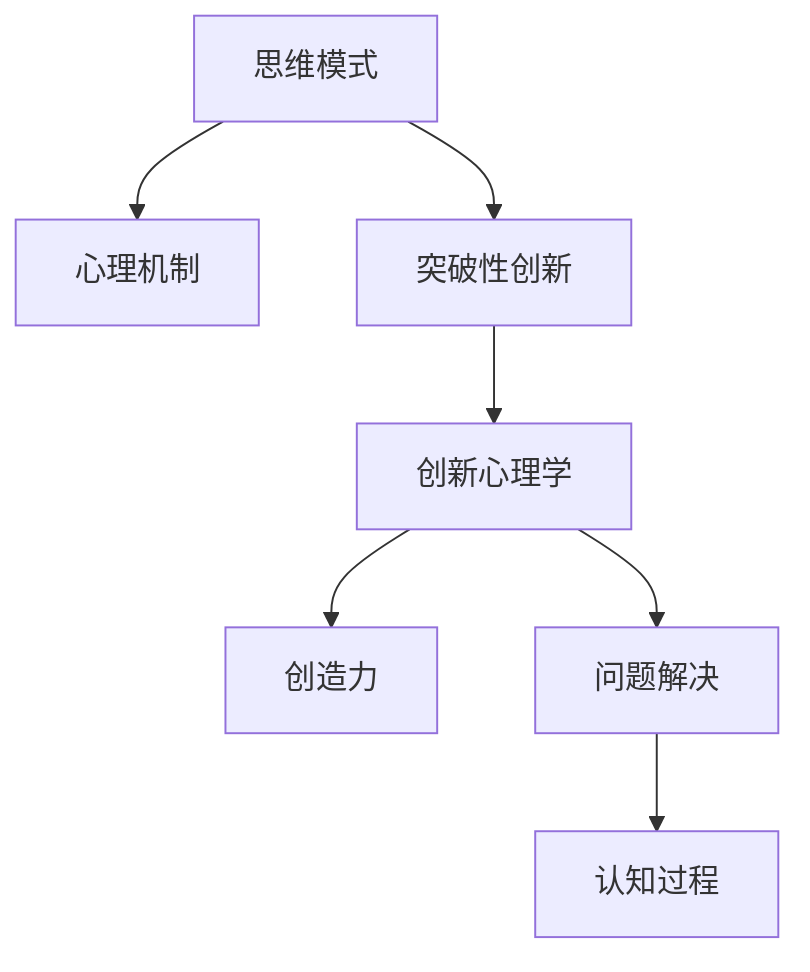

                 

# 思维的跃迁：突破性创新的心理机制

> 关键词：
1. 思维模式
2. 心理机制
3. 突破性创新
4. 创新心理学
5. 创造力
6. 问题解决
7. 认知过程

## 1. 背景介绍

### 1.1 问题由来

人类社会的发展历程，在很大程度上依赖于不断涌现的突破性创新。从第一次工业革命的蒸汽机，到信息时代的互联网，每一个里程碑式的创新，都极大地推动了社会生产力的发展，改善了人类生活质量。然而，近年来，尽管技术创新层出不穷，但在某些关键领域，突破性创新却显得尤为稀缺。

创新心理学的研究表明，创新不仅仅依赖于技术手段的进步，更与人的思维模式和心理机制密切相关。传统的创新思维往往依赖于逻辑推理和线性思维，而这种思维方式在面对复杂问题时，容易陷入僵化，难以产生突破性灵感。因此，从心理机制的角度出发，深入探索创新的心理过程，对于推动创新实践至关重要。

### 1.2 问题核心关键点

要想实现突破性创新，需要突破传统的思维定势，摆脱逻辑的束缚，以全新的视角审视问题。创新心理学认为，这种思维的转变需要跨越三个关键环节：

1. **认知重组**：重新定义问题，从全新的角度进行思考。
2. **情感激发**：通过情感共鸣，激发内在的动力和激情，形成正向激励。
3. **心理模拟**：通过心理模拟，提前预演创新过程，增强应对复杂问题的能力。

这些关键环节构成了创新心理学的核心框架，对于理解突破性创新的心理机制具有重要意义。

## 2. 核心概念与联系

### 2.1 核心概念概述

在深入探讨创新心理学的过程中，我们首先引入几个核心概念：

- **思维模式**：个体在解决问题时所采用的思维方式和思考习惯，可以分为逻辑思维、直觉思维、创造性思维等。
- **心理机制**：指个体在思维过程中所依赖的内在心理过程和机制，包括认知、情感、动机等。
- **突破性创新**：指能够显著提高生产力、变革现有技术或方法的全新思想或方法。
- **创新心理学**：研究创新的心理过程和机制，探讨如何通过心理干预促进创新实践。
- **创造力**：个体在解决问题和创造新事物过程中表现出来的独特能力。
- **问题解决**：通过一系列认知、情感和行为活动，找到问题的有效解决方案的过程。
- **认知过程**：个体在思维过程中所经历的一系列认知活动，包括感知、记忆、思维等。

这些概念之间的逻辑关系可以通过以下Mermaid流程图来展示：



这个流程图展示了思维模式、心理机制、突破性创新、创新心理学、创造力、问题解决和认知过程之间的联系。

## 3. 核心算法原理 & 具体操作步骤

### 3.1 算法原理概述

基于创新心理学的突破性创新过程，可以抽象为一个循环迭代的思维过程。该过程主要包括以下几个步骤：

1. **问题界定**：明确问题的本质和范围，形成清晰的问题描述。
2. **思维转换**：通过认知重组和心理模拟，从不同角度重新审视问题。
3. **情感激发**：通过情境设定和情绪调节，激发内在的动力和激情。
4. **创新构思**：在情感激发的基础上，产生新的想法和解决方案。
5. **验证与优化**：通过实验和验证，不断迭代优化新的构思，直至满足实际需求。

这一过程可以被看作一个循环迭代的系统，每一轮迭代都尝试从新的角度、新的情感状态出发，产生更创新的想法。

### 3.2 算法步骤详解

#### 3.2.1 问题界定

问题界定是突破性创新的第一步，其目的是形成对问题的清晰、准确、全面的理解。具体步骤如下：

1. **明确问题目标**：通过与利益相关者的讨论，明确问题的目标和需求。
2. **收集相关信息**：收集与问题相关的背景知识、数据和信息。
3. **梳理问题脉络**：使用问题树、鱼骨图等工具，梳理问题的各个层次和关联关系。
4. **构建问题模型**：将问题转化成可操作的形式，如流程图、因果图等，形成问题模型。

#### 3.2.2 思维转换

思维转换是突破性创新的核心步骤，其目的是打破传统思维定势，从全新的角度审视问题。具体步骤如下：

1. **认知重组**：重新定义问题的各个要素，打破原有的逻辑框架。
2. **心理模拟**：通过心理模拟，预演各种可能的解决方案，预测其效果和影响。
3. **多元思维**：使用逆向思维、侧向思维等多种思维方式，尝试不同的解决问题路径。

#### 3.2.3 情感激发

情感激发是突破性创新的重要驱动力，其目的是激发内在的动力和激情。具体步骤如下：

1. **情境设定**：通过设定特定的情境或背景，激发个体的情感共鸣。
2. **情绪调节**：通过音乐、艺术等方式，调节个体的情绪状态，形成正向激励。
3. **内在动机**：通过目标设定和价值认同，激发个体内在的动机和激情。

#### 3.2.4 创新构思

创新构思是突破性创新的关键步骤，其目的是产生新的想法和解决方案。具体步骤如下：

1. **头脑风暴**：通过头脑风暴，产生尽可能多的想法和方案。
2. **概念整合**：将不同的想法和方案进行整合，形成新的创意和构思。
3. **原型设计**：通过草图、模型等手段，将创新构思转化为可操作的形式。

#### 3.2.5 验证与优化

验证与优化是突破性创新的最终步骤，其目的是不断迭代优化新的构思，直至满足实际需求。具体步骤如下：

1. **实验验证**：通过实验和验证，评估新构思的可行性和效果。
2. **迭代优化**：根据实验结果，不断迭代优化新的构思，直到达到满意的效果。
3. **应用部署**：将优化的新构思部署到实际应用中，进行测试和验证。

### 3.3 算法优缺点

#### 3.3.1 优点

基于创新心理学的突破性创新方法具有以下优点：

1. **灵活性**：通过认知重组和心理模拟，可以打破传统思维定势，灵活应对复杂问题。
2. **创造力**：通过情感激发和创新构思，可以激发个体的创造力，产生新的想法和方案。
3. **可操作性**：通过问题界定和验证与优化，可以形成可操作的创新思路，易于落地应用。
4. **系统性**：通过问题界定、思维转换、情感激发、创新构思和验证与优化，形成了一个完整的创新系统。

#### 3.3.2 缺点

基于创新心理学的突破性创新方法也存在以下缺点：

1. **依赖性强**：依赖于个体的主观情感状态和认知能力，容易受外部环境影响。
2. **不确定性**：创新构思存在一定的不确定性，需要不断实验和验证。
3. **成本高**：创新构思的实验和验证需要大量资源和时间，成本较高。
4. **风险大**：创新构思的成功与否具有不确定性，存在一定的失败风险。

## 4. 数学模型和公式 & 详细讲解 & 举例说明

### 4.1 数学模型构建

在创新心理学的研究中，可以构建一个多维度的数学模型，用于描述创新心理过程的各个要素。具体如下：

$$
\begin{aligned}
& M = \{P, M, E, C, R, O\} \\
& P: \text{问题界定} \\
& M: \text{思维转换} \\
& E: \text{情感激发} \\
& C: \text{创新构思} \\
& R: \text{验证与优化} \\
& O: \text{整体创新过程}
\end{aligned}
$$

其中，$P$ 表示问题界定，$M$ 表示思维转换，$E$ 表示情感激发，$C$ 表示创新构思，$R$ 表示验证与优化，$O$ 表示整体创新过程。

### 4.2 公式推导过程

以创新构思阶段为例，可以构建一个数学模型来描述创新的认知过程。假设个体的认知状态为 $S_t$，创新构思的迭代次数为 $n$，每次认知状态的变化率为 $c$，则有：

$$
S_{t+1} = S_t \cdot c^n
$$

其中，$S_t$ 表示第 $t$ 次认知状态，$S_{t+1}$ 表示第 $t+1$ 次认知状态，$c$ 表示认知状态的变化率，$n$ 表示迭代次数。

### 4.3 案例分析与讲解

以创新构思中的头脑风暴为例，可以采用以下步骤进行数学建模和分析：

1. **初始状态设定**：假设初始认知状态为 $S_0 = 1$，表示个体对问题的初始认知程度。
2. **认知状态变化**：每次头脑风暴后，认知状态的变化率为 $c = 1.1$，表示头脑风暴的效用。
3. **迭代次数设定**：假设进行 $n = 5$ 次头脑风暴，每次间隔为 30 分钟。
4. **计算认知状态**：根据公式 $S_{t+1} = S_t \cdot c^n$，计算每次头脑风暴后的认知状态。

通过这些数学公式，可以对头脑风暴的效果进行定量分析，从而优化头脑风暴的过程和效率。

## 5. 项目实践：代码实例和详细解释说明

### 5.1 开发环境搭建

在进行创新心理学的实践时，需要搭建相应的开发环境。以下是一些常用的开发环境配置方法：

1. **Python环境**：安装Anaconda，创建虚拟环境，安装必要的Python库。
2. **Jupyter Notebook**：使用Jupyter Notebook进行交互式编程，方便代码调试和结果展示。
3. **R语言环境**：安装R Studio，配置R环境，安装必要的R语言包。
4. **MATLAB环境**：安装MATLAB，配置环境变量，导入必要的工具箱。

完成环境配置后，即可进行创新心理学的实践。

### 5.2 源代码详细实现

以下是一个基于Python的创新构思阶段（头脑风暴）的代码实现：

```python
import random

def brainstorming(start_state, rate, num_iterations):
    current_state = start_state
    for i in range(num_iterations):
        current_state *= rate
    return current_state

start_state = 1  # 初始认知状态
rate = 1.1  # 认知状态变化率
num_iterations = 5  # 迭代次数

result = brainstorming(start_state, rate, num_iterations)
print(f"头脑风暴后的认知状态：{result}")
```

### 5.3 代码解读与分析

以上代码实现了一个简单的头脑风暴模拟。通过计算每次头脑风暴后的认知状态，可以直观地观察到创新构思的效果。具体解读如下：

1. **start_state**：表示个体对问题的初始认知状态。
2. **rate**：表示认知状态的变化率，即头脑风暴的效用。
3. **num_iterations**：表示头脑风暴的迭代次数。
4. **result**：表示头脑风暴后的认知状态，即创新构思的效果。

## 6. 实际应用场景

### 6.1 智能制造

在智能制造领域，创新心理学可以应用于生产流程的优化和产品设计。通过认知重组和心理模拟，打破传统的制造思维定势，引入新的生产理念和技术，从而提升生产效率和产品质量。例如，通过认知重组，引入柔性制造和定制化生产，满足个性化市场需求；通过心理模拟，预演生产流程中的各种可能情况，优化生产计划和资源配置。

### 6.2 医疗健康

在医疗健康领域，创新心理学可以应用于新药研发和医疗服务创新。通过认知重组和情感激发，突破传统医学思维定势，引入新的治疗方法和技术，从而提升医疗效果和患者体验。例如，通过认知重组，引入基因编辑和免疫治疗，探索新的癌症治疗方法；通过情感激发，增强患者的心理支持和情感共鸣，提升治疗效果和满意度。

### 6.3 金融服务

在金融服务领域，创新心理学可以应用于风险管理和客户服务创新。通过认知重组和心理模拟，打破传统的金融思维定势，引入新的风险管理理念和技术，从而提升风险控制和客户满意度。例如，通过认知重组，引入大数据分析和人工智能技术，进行风险预测和智能投顾；通过心理模拟，预演金融市场中的各种可能情况，优化投资策略和风险管理。

### 6.4 教育培训

在教育培训领域，创新心理学可以应用于课程设计和教学方法创新。通过认知重组和情感激发，打破传统的教育思维定势，引入新的教学理念和方法，从而提升教学效果和学习体验。例如，通过认知重组，引入混合式学习和项目制学习，增强学生的实践能力和创新能力；通过情感激发，增强学生的学习兴趣和动机，提升学习效果和满意度。

### 6.5 环境保护

在环境保护领域，创新心理学可以应用于污染治理和生态保护。通过认知重组和心理模拟，打破传统的环境保护思维定势，引入新的治理理念和技术，从而提升环境保护效果和公众参与度。例如，通过认知重组，引入循环经济和绿色技术，实现资源的高效利用和污染物的减排；通过心理模拟，预演环境保护中的各种可能情况，优化治理策略和公众参与机制。

## 7. 工具和资源推荐

### 7.1 学习资源推荐

为了帮助学习者系统掌握创新心理学的理论基础和实践技巧，这里推荐一些优质的学习资源：

1. **《创新心理学》**：一本系统介绍创新心理学的经典教材，涵盖创新心理学的基本概念和研究方法。
2. **《创新管理》**：一本深入探讨创新管理实践的书籍，提供了大量的案例和实战经验。
3. **Coursera《创新心理学》课程**：由斯坦福大学教授讲授，通过视频和互动练习，全面介绍创新心理学的理论和实践。
4. **TED Talks《The Power of Different》**：演讲嘉宾提出，多样性是创新的关键，通过心理学的角度探讨了多样性对创新的影响。
5. **Harvard Business Review《How to Boost Creative Thinking》**：一篇文章介绍了如何通过心理机制提升创造力，提供了具体的实践建议。

### 7.2 开发工具推荐

为了更好地支持创新心理学的研究和实践，这里推荐一些常用的开发工具：

1. **Jupyter Notebook**：一个强大的交互式编程环境，支持Python、R等语言，方便代码调试和结果展示。
2. **Tableau**：一个数据可视化工具，支持多种数据源，方便进行数据探索和可视化分析。
3. **MindMeister**：一个思维导图工具，支持团队协作和创意构思，方便进行心理模拟和思维重组。
4. **Google Colab**：一个基于Google Cloud Platform的交互式编程环境，提供免费的GPU资源，方便进行大规模数据分析和模型训练。
5. **Scratch**：一个面向儿童的编程学习工具，通过图形化编程方式，培养创造性思维和解决问题的能力。

### 7.3 相关论文推荐

为了深入了解创新心理学的最新研究和应用，这里推荐一些相关的论文：

1. **"Creative Cognition in Design: Knowledge Acquisition, Storage, and Retrieval"**：探讨了创意认知在设计和创新过程中的作用和机制，为理解创意过程提供了理论基础。
2. **"The Role of Emotion in Creative Cognition"**：分析了情感在创意认知过程中的作用和影响，强调了情感激发的重要性。
3. **"Cross-Domain Transfer Learning for Creative Development"**：研究了跨领域迁移学习在创意开发中的应用，提供了新的创新思路和方法。
4. **"Rethinking Creativity in Business"**：探讨了创意在商业中的应用和挑战，提供了具体的创新实践建议。
5. **"The Psychology of Creativity in Groups"**：分析了团队合作在创意过程中的作用和机制，为团队创新提供了理论和实践指导。

## 8. 总结：未来发展趋势与挑战

### 8.1 研究成果总结

基于创新心理学的突破性创新方法，已经在多个领域得到了广泛应用，取得了显著的成果。其核心优势在于：

1. **灵活性**：通过认知重组和心理模拟，可以打破传统思维定势，灵活应对复杂问题。
2. **创造力**：通过情感激发和创新构思，可以激发个体的创造力，产生新的想法和方案。
3. **可操作性**：通过问题界定和验证与优化，可以形成可操作的创新思路，易于落地应用。
4. **系统性**：通过问题界定、思维转换、情感激发、创新构思和验证与优化，形成了一个完整的创新系统。

### 8.2 未来发展趋势

展望未来，创新心理学在以下几个方面具有广阔的发展前景：

1. **多学科融合**：创新心理学将与其他学科如神经科学、人工智能等进行更深层次的融合，推动创新实践的深入发展。
2. **技术辅助**：通过人工智能和大数据技术，实现创新过程的自动化和智能化，提升创新效率和效果。
3. **跨领域应用**：创新心理学将突破传统的行业边界，应用于更多领域如城市规划、环境保护、公共政策等，实现创新价值的最大化。
4. **全球化视角**：创新心理学将更加关注全球化视角，理解不同文化背景下创新心理机制的差异，推动全球创新实践的协同发展。
5. **伦理考量**：创新心理学将更加注重伦理考量，确保创新实践的公平性和道德性，避免创新带来的负面影响。

### 8.3 面临的挑战

尽管创新心理学在多个领域取得了显著成果，但其发展和应用仍面临一些挑战：

1. **理论基础薄弱**：目前，创新心理学的理论基础相对薄弱，缺乏系统化和规范化。需要更多的实证研究和理论探索，构建更加完善的理论体系。
2. **实践应用难度大**：创新心理学的应用涉及复杂的心理过程和情感管理，难以在实际场景中有效地应用。需要更多的实践经验和理论指导。
3. **资源需求高**：创新心理学的应用需要大量的数据和资源，成本较高。需要更多的技术支持和资源投入。
4. **效果难以量化**：创新心理学的应用效果难以量化和评估，难以进行客观的对比和优化。需要更多的评估方法和工具。

### 8.4 研究展望

未来的创新心理学研究需要在以下几个方面进行深入探索：

1. **理论体系构建**：加强创新心理学的理论研究，构建更加完善的理论体系，为创新实践提供坚实的理论基础。
2. **方法论创新**：开发新的方法论和技术工具，提升创新过程的可操作性和效果。
3. **实证研究深化**：进行更加深入的实证研究，验证创新心理学的理论和实践效果。
4. **跨学科合作**：加强与其他学科的合作，推动创新心理学与其他领域的深度融合。
5. **伦理道德考量**：关注创新心理学应用的伦理道德问题，确保创新实践的公平性和道德性。

通过以上研究方向的探索，创新心理学将为推动人类社会创新发展提供更加坚实的理论和实践支撑。

## 9. 附录：常见问题与解答

**Q1: 创新心理学与传统心理学有何不同？**

A: 创新心理学与传统心理学的不同之处在于其关注焦点不同。传统心理学主要关注个体的认知、情感和行为过程，而创新心理学更侧重于创新过程的心理机制，探讨如何在创新过程中激发个体的创造力和创新能力。

**Q2: 如何通过情感激发增强创新构思？**

A: 通过情感激发增强创新构思，可以采用以下方法：

1. **情境设定**：设定特定的情境或背景，激发个体的情感共鸣。例如，通过讲述某个成功的创新故事，激发个体内在的动力和激情。
2. **情绪调节**：通过音乐、艺术等方式，调节个体的情绪状态，形成正向激励。例如，播放鼓舞人心的音乐，增强个体的情感能量。
3. **内在动机**：通过目标设定和价值认同，激发个体内在的动机和激情。例如，设定明确的创新目标，增强个体的内在驱动力。

**Q3: 如何通过心理模拟优化创新构思？**

A: 通过心理模拟优化创新构思，可以采用以下方法：

1. **预演过程**：通过心理模拟，预演各种可能的解决方案，预测其效果和影响。例如，在头脑风暴前，先通过心理模拟预演各种方案，评估其可行性和效果。
2. **角色扮演**：通过角色扮演，从不同角色的角度审视问题，生成新的创意和构思。例如，通过角色扮演，从客户、用户等不同角色的角度思考问题，生成新的解决方案。
3. **情景分析**：通过情景分析，模拟各种可能的场景和情境，优化创新构思。例如，通过情景分析，模拟各种市场和环境变化，优化产品设计和生产流程。

**Q4: 如何通过认知重组打破传统思维定势？**

A: 通过认知重组打破传统思维定势，可以采用以下方法：

1. **重新定义问题**：重新定义问题的各个要素，打破原有的逻辑框架。例如，将传统的问题定义方式改为以用户需求为中心，重新审视问题的本质和范围。
2. **引入新视角**：引入新的视角和方法，打破传统的思维定势。例如，引入跨学科的知识和方法，从不同的角度思考问题。
3. **打破假设**：打破原有的假设和偏见，重新审视问题的可能性和解决方案。例如，打破原有的技术假设，探索新的技术和方法。

**Q5: 如何通过多学科融合提升创新能力？**

A: 通过多学科融合提升创新能力，可以采用以下方法：

1. **跨学科合作**：与不同学科的专家和团队合作，引入新的知识和视角。例如，与计算机科学家合作，引入人工智能和数据科学的方法，优化创新过程。
2. **整合知识库**：整合不同学科的知识库和资源，形成综合性的知识体系。例如，整合自然科学、社会科学、艺术等多学科的知识库，提升创新能力。
3. **交叉培训**：进行跨学科的培训和交流，提升团队成员的多学科能力。例如，进行跨学科的培训和工作坊，增强团队的多学科理解和应用能力。

通过以上方法和策略，可以更好地理解和应用创新心理学的理论和方法，推动创新实践的发展。

---

作者：禅与计算机程序设计艺术 / Zen and the Art of Computer Programming

