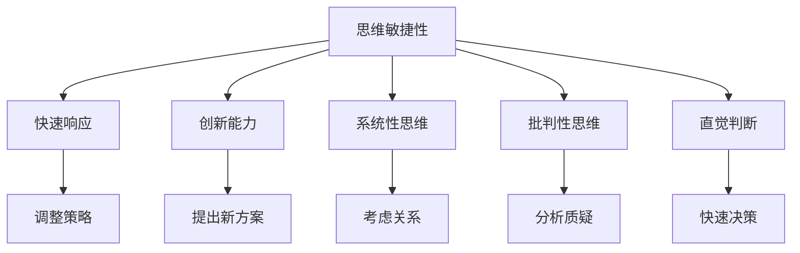

                 

## 1. 背景介绍

在当今瞬息万变的商业环境中，管理决策的准确性和及时性成为了企业竞争力的关键因素。决策不仅仅是基于数据的分析，更是基于深刻的思维能力和洞见。本文旨在探讨思维能力对管理决策的影响，揭示如何在复杂多变的环境中，运用高效的思维策略来提升管理决策的科学性和效率。

### 1.1 问题由来
现代管理决策面临着前所未有的复杂性，从传统的成本和利润管理到新兴的技术和市场竞争，无不考验着管理者的思维能力。数据和技术的快速发展为决策提供了新的工具和方法，但同时也对管理者的思维提出了更高的要求。如何在这波变革中保持优势，是每一个管理者需要深思的问题。

### 1.2 问题核心关键点
思维能力对管理决策的影响体现在多个方面，包括但不限于以下几个关键点：
- **思维敏捷性**：在快速变化的环境中，能够迅速捕捉机会和风险，做出及时响应。
- **创新能力**：具备创新思维，能够突破传统框架，提出新的解决方案。
- **系统性思维**：能够从整体角度出发，考虑不同因素之间的相互关系，做出全局最优决策。
- **批判性思维**：能够对信息进行分析和质疑，避免决策中的偏见和误区。
- **直觉判断**：在大量数据和信息中，能够凭借经验直觉做出高质量的判断。

## 2. 核心概念与联系

### 2.1 核心概念概述

为了更好地理解思维能力对管理决策的影响，本节将介绍几个密切相关的核心概念：

- **思维敏捷性(Agility)**：指在动态环境中快速适应和响应的能力。管理者需要能够迅速识别变化，并根据变化调整策略。
- **创新能力(Creativity)**：指能够提出新颖、有效的解决方案，克服传统思维的局限。
- **系统性思维(Systems Thinking)**：指考虑整体和系统各组成部分之间的关系，避免孤立看待问题。
- **批判性思维(Critical Thinking)**：指对信息和数据的分析和质疑，识别出潜在的偏差和错误。
- **直觉判断(Intuition)**：指基于经验和直觉快速做出决策的能力，尤其在不确定性环境中尤为重要。

这些概念之间相互联系，共同构成了管理决策中思维能力的基础框架。理解这些概念可以帮助管理者在复杂环境中做出更加科学和高效的决策。

### 2.2 核心概念原理和架构的 Mermaid 流程图



这个流程图展示了思维能力各组成部分之间的关系，以及它们如何共同作用于管理决策过程。

## 3. 核心算法原理 & 具体操作步骤

### 3.1 算法原理概述

思维能力对管理决策的影响是一个复杂的多层次问题，涉及多个因素的综合考量。本文将从算法角度出发，探索如何运用数据和模型来提升思维能力，从而改善管理决策。

### 3.2 算法步骤详解

#### 3.2.1 数据收集与预处理

管理决策的数据来源广泛，包括财务数据、市场信息、员工反馈等。第一步是收集相关数据，并对其进行清洗和预处理，确保数据的质量和一致性。

#### 3.2.2 数据建模与分析

在数据预处理的基础上，构建模型进行分析。常见的模型包括回归分析、时间序列分析、聚类分析等。模型能够帮助我们识别数据中的模式和趋势，提供决策依据。

#### 3.2.3 预测与模拟

基于模型，进行预测和模拟，评估不同决策方案的潜在影响。这可以帮助管理者在决策前全面评估各种可能性，选择最优方案。

#### 3.2.4 反馈与调整

在实施决策后，收集实际效果数据，并与预测结果进行对比，进行反馈和调整。这一过程有助于持续改进决策模型，提升决策的准确性。

### 3.3 算法优缺点

#### 3.3.1 优点

1. **科学性**：基于数据的模型能够提供客观的决策依据，减少主观偏见。
2. **效率性**：模型能够快速处理大量数据，提供快速决策支持。
3. **可复制性**：模型和分析方法可以重复使用，提升决策的一致性和可比性。

#### 3.3.2 缺点

1. **复杂性**：模型构建和分析过程复杂，需要专业的知识和技能。
2. **数据依赖**：模型结果高度依赖于数据质量，数据偏差可能导致决策错误。
3. **静态性**：模型往往基于历史数据构建，难以捕捉动态环境中的变化。

### 3.4 算法应用领域

思维能力对管理决策的影响不仅限于单个企业，而是广泛适用于各种组织和领域的决策制定。以下是几个典型应用领域：

- **金融投资**：投资者需要具备敏捷性和系统性思维，快速响应市场变化，做出科学投资决策。
- **市场分析**：市场营销人员需要创新思维和批判性思维，突破传统市场框架，发现新机会。
- **供应链管理**：管理者需要系统性思维和直觉判断，优化供应链布局，提高效率。
- **人力资源管理**：HR管理者需要创新能力和批判性思维，设计更具吸引力的招聘策略，提升员工满意度。

## 4. 数学模型和公式 & 详细讲解 & 举例说明

### 4.1 数学模型构建

本文将使用线性回归模型作为基础，探讨如何在决策中应用数学模型。

假设决策问题为$f(x)=\beta_0 + \beta_1x_1 + \beta_2x_2$，其中$x_1$和$x_2$为输入变量，$\beta_0$、$\beta_1$和$\beta_2$为模型参数。

### 4.2 公式推导过程

根据线性回归的定义，模型的预测值为：

$$
\hat{y} = \beta_0 + \beta_1x_1 + \beta_2x_2
$$

其中$\hat{y}$为预测值，$x_1$和$x_2$为输入变量。

模型的最小二乘估计参数为：

$$
\hat{\beta} = (X^TX)^{-1}X^Ty
$$

其中$X^TX$为矩阵$X$的转置乘积，$y$为输出变量，$X$为输入变量矩阵，$\beta$为模型参数向量。

### 4.3 案例分析与讲解

以一家电子商务公司的销售预测为例，公司希望根据历史销售数据预测未来销售额。假设输入变量为月销售额和市场指数，输出变量为下个月销售额。使用线性回归模型，可以建立如下模型：

$$
\hat{y} = \beta_0 + \beta_1x_1 + \beta_2x_2
$$

其中$x_1$为月销售额，$x_2$为市场指数，$\beta_0$、$\beta_1$和$\beta_2$为模型参数。

通过历史数据训练模型，求解$\hat{\beta}$，得到模型预测值$\hat{y}$。该模型可以为公司提供未来销售预测，帮助管理层制定有效的销售策略。

## 5. 项目实践：代码实例和详细解释说明

### 5.1 开发环境搭建

在Python环境下，可以使用Scikit-learn库进行线性回归模型的实现。

安装Scikit-learn库：

```bash
pip install scikit-learn
```

### 5.2 源代码详细实现

```python
from sklearn.linear_model import LinearRegression
import pandas as pd
import numpy as np

# 读取数据
data = pd.read_csv('sales_data.csv')

# 数据预处理
X = data[['Sales', 'Market_Index']]
y = data['Next_Month_Sales']

# 构建模型
model = LinearRegression()

# 训练模型
model.fit(X, y)

# 预测下个月销售额
X_test = pd.DataFrame({'Sales': [2000, 3000, 4000], 'Market_Index': [100, 120, 110]})
y_pred = model.predict(X_test)
print(y_pred)
```

### 5.3 代码解读与分析

- 首先，使用Pandas库读取销售数据，并进行数据预处理，将月销售额和市场指数作为输入变量，下个月销售额作为输出变量。
- 然后，使用Scikit-learn库中的LinearRegression模型，构建线性回归模型。
- 接着，使用训练数据训练模型，并使用测试数据进行预测。
- 最后，打印预测结果。

运行结果展示了模型对未来销售额的预测值，帮助管理层制定有效的销售策略。

## 6. 实际应用场景

### 6.1 金融投资

金融投资领域是思维能力对管理决策影响显著的典型场景。投资者需要具备敏捷性，快速捕捉市场变化，避免因信息滞后导致的投资失误。同时，投资者需要具备创新能力，挖掘新的投资机会，突破传统投资框架。

### 6.2 市场分析

市场营销人员需要创新思维和系统性思维，通过市场数据分析，发现潜在机会。例如，利用大数据和机器学习技术，分析消费者行为和市场趋势，制定更具针对性的营销策略。

### 6.3 供应链管理

供应链管理者需要系统性思维和直觉判断，优化供应链布局，提高效率。例如，利用优化算法，分析供应链各环节的性能，提出改进方案。

### 6.4 人力资源管理

HR管理者需要创新能力和批判性思维，设计更具吸引力的招聘策略，提升员工满意度。例如，利用人工智能技术，进行员工绩效分析，发现问题并及时调整。

## 7. 工具和资源推荐

### 7.1 学习资源推荐

为了帮助管理者系统掌握决策分析的方法和工具，这里推荐一些优质的学习资源：

1. 《数据科学导论》（Introduction to Data Science）：由知名数据科学家Grokking讲授，涵盖数据分析和机器学习的基础知识和应用。
2. 《Python数据分析与可视化》（Python Data Science Handbook）：由Jake VanderPlas撰写，介绍使用Python进行数据处理和可视化的方法。
3. 《线性回归分析与应用》（Linear Regression Analysis and Applications）：介绍线性回归的基本原理和应用，适合初学者入门。
4. Coursera和edX等在线课程平台，提供丰富的数据分析和机器学习课程，帮助管理者系统学习。
5. Kaggle等数据竞赛平台，提供大量的实战案例和比赛，提升管理者的数据处理和分析能力。

通过这些学习资源，管理者可以系统掌握数据驱动的决策分析方法，提升决策科学性和效率。

### 7.2 开发工具推荐

高效的决策分析离不开优秀的工具支持。以下是几款用于决策分析开发的常用工具：

1. Excel：功能强大的电子表格工具，适合进行简单的数据分析和可视化。
2. R语言：开源的数据分析语言，支持丰富的统计和可视化库。
3. Python：灵活的编程语言，拥有众多数据分析和机器学习库。
4. SQL：用于数据库查询和分析的语言，适合处理大量结构化数据。
5. Tableau：强大的数据可视化工具，适合进行复杂的数据分析和可视化。

合理利用这些工具，可以显著提升决策分析的效率和效果，帮助管理者做出更科学的决策。

### 7.3 相关论文推荐

决策分析技术的发展源于学界的持续研究。以下是几篇奠基性的相关论文，推荐阅读：

1. "Statistical Methods for Evaluating the Accuracy of Predictions" by F. Draper and H. Smith：介绍了预测模型的评估方法，评估模型性能的常用指标。
2. "Linear Regression: A Survey of Some Recent Advances" by J. Friedman：介绍了线性回归模型的最新进展，包括变量的选择和模型优化方法。
3. "Pattern Recognition and Machine Learning" by C. Bishop：深入介绍了机器学习的基本原理和应用，适合深入学习。
4. "Data Science: A Practitioner's Approach" by C. M. Bishop：介绍了数据科学的基本方法和应用，适合初学者和实践者。
5. "Machine Learning: A Probabilistic Perspective" by K. Murphy：介绍了机器学习的概率模型和优化方法，适合深入学习。

这些论文代表了大数据和机器学习技术的发展脉络。通过学习这些前沿成果，可以帮助管理者掌握决策分析的理论基础和实践技巧。

## 8. 总结：未来发展趋势与挑战

### 8.1 总结

本文对思维能力对管理决策的影响进行了全面系统的探讨。首先，明确了思维能力在管理决策中的重要性，提出了敏捷性、创新能力、系统性思维、批判性思维和直觉判断等核心概念。其次，从数据驱动的角度出发，介绍了线性回归模型及其应用，提供了代码实现和案例分析。最后，探讨了思维能力在金融投资、市场分析、供应链管理和人力资源管理等领域的实际应用，展示了其在决策制定中的重要价值。

通过本文的系统梳理，可以看到，思维能力是管理决策中不可或缺的元素。合理运用数据驱动的方法和工具，能够显著提升决策的科学性和效率。管理者需要在实践中不断学习和应用这些方法，提升自身思维能力，从而做出更科学的决策。

### 8.2 未来发展趋势

展望未来，大数据和机器学习技术将继续推动决策分析的发展，带来以下趋势：

1. **自动化决策**：自动化决策技术将越来越成熟，能够自主进行数据分析和决策推荐，减少人工干预。
2. **跨领域应用**：决策分析将突破传统领域限制，应用于更多行业和场景。例如，在医疗、教育、环保等领域，数据驱动的决策分析将带来深远影响。
3. **深度学习应用**：深度学习技术将应用于决策分析，提升模型的复杂度和准确性，适应更复杂的决策场景。
4. **实时决策**：实时数据分析和决策系统将越来越普及，能够快速响应动态变化，提升决策的及时性和有效性。
5. **个性化决策**：基于大数据和个性化分析，决策将变得更加精准，能够满足不同用户的需求和偏好。

这些趋势将进一步提升决策分析的科学性和效率，推动决策技术在各行业的普及和应用。

### 8.3 面临的挑战

尽管大数据和机器学习技术在决策分析中取得了显著进展，但在实际应用中，仍面临以下挑战：

1. **数据质量问题**：数据质量和完整性对决策分析结果至关重要，但现实中的数据往往存在缺失和噪声。如何有效处理和清洗数据，提升数据质量，是一个重要的挑战。
2. **模型复杂性**：复杂的决策模型虽然性能优越，但构建和维护成本高昂。如何在模型复杂性和模型性能之间找到平衡，是一个重要的问题。
3. **隐私和安全**：在数据驱动的决策中，如何保护用户隐私和数据安全，防止数据泄露和滥用，是一个重要的伦理和法律问题。
4. **模型解释性**：复杂模型往往缺乏可解释性，难以解释其决策过程。如何提升模型的可解释性，增强决策的透明度和可信度，是一个重要的研究方向。
5. **模型鲁棒性**：在动态环境中，模型的鲁棒性是一个关键问题。如何提升模型的鲁棒性，减少因数据变化导致的性能波动，是一个重要的研究方向。

这些挑战需要通过技术创新和伦理规范来解决，才能确保决策分析技术的安全、可靠和有效。

### 8.4 研究展望

面向未来，决策分析技术的研究方向将集中在以下几个方面：

1. **自动化决策系统**：开发更加智能化、自主化的决策系统，提升决策的自动化水平。
2. **跨领域应用拓展**：将决策分析技术推广到更多领域，提升不同行业的应用效果。
3. **深度学习与大数据融合**：利用深度学习和大数据技术，提升决策模型的复杂度和准确性。
4. **实时决策系统**：开发实时决策系统，能够快速响应动态变化，提升决策的及时性和有效性。
5. **模型可解释性**：提升模型的可解释性，增强决策的透明度和可信度，推动决策技术的广泛应用。

这些研究方向将推动决策分析技术的发展，提升管理决策的科学性和效率，为各行业带来深远影响。

## 9. 附录：常见问题与解答

**Q1：如何评估决策模型的效果？**

A: 评估决策模型的效果，主要通过以下几个指标：
1. **准确率(Accuracy)**：模型预测正确的比例。
2. **精确率(Precision)**：模型预测为正例且为正例的比例。
3. **召回率(Recall)**：模型预测为正例且为正例的比例。
4. **F1分数(F1-Score)**：精确率和召回率的调和平均数。
5. **ROC曲线和AUC值**：通过ROC曲线和AUC值评估模型在不同阈值下的性能表现。

通过这些指标，可以全面评估模型的性能，并根据具体情况选择合适的模型。

**Q2：决策模型是否适用于所有行业？**

A: 决策模型在大多数行业都具有广泛的应用价值，但具体应用场景和效果还需要根据行业特点进行调整和优化。例如，在医疗行业，需要考虑病患隐私和数据安全；在金融行业，需要关注模型的鲁棒性和风险控制；在零售行业，需要关注个性化推荐和用户体验等。

**Q3：如何选择适合的管理决策模型？**

A: 选择适合的管理决策模型，需要考虑以下几个因素：
1. **数据特点**：根据数据的类型、规模和特征选择合适的模型。
2. **决策目标**：根据决策目标选择最优模型。例如，分类任务可以使用逻辑回归、支持向量机等模型；回归任务可以使用线性回归、随机森林等模型。
3. **计算资源**：考虑计算资源和模型复杂度，选择适合模型的实现方式。
4. **模型可解释性**：根据实际需求，选择可解释性较高的模型，便于决策者理解和信任。

综合考虑这些因素，可以选出最适合的管理决策模型。

**Q4：如何提升决策模型的鲁棒性？**

A: 提升决策模型的鲁棒性，主要通过以下几个方法：
1. **数据增强**：通过数据增强技术，扩充训练数据集，增强模型泛化能力。
2. **正则化**：使用L1、L2正则化等方法，避免模型过拟合。
3. **对抗训练**：引入对抗样本，训练鲁棒性更强的模型，提高模型的抗干扰能力。
4. **模型集成**：使用模型集成方法，如Bagging、Boosting等，提升模型稳定性和鲁棒性。
5. **动态调整**：在动态环境中，根据实时数据调整模型参数，保持模型的最新状态。

这些方法可以帮助提升决策模型的鲁棒性，使其在实际应用中更加稳定可靠。

**Q5：如何提升决策模型的可解释性？**

A: 提升决策模型的可解释性，主要通过以下几个方法：
1. **特征工程**：通过特征选择和提取，提升模型的可解释性。
2. **可视化工具**：使用可视化工具，如图表、热力图等，展示模型的决策过程。
3. **可解释模型**：选择可解释性较高的模型，如决策树、线性回归等，便于理解模型的决策依据。
4. **特征重要性**：通过特征重要性分析，理解模型决策的关键因素。
5. **模型解释框架**：使用模型解释框架，如LIME、SHAP等，深入理解模型决策过程。

通过这些方法，可以提升决策模型的可解释性，增强决策的透明度和可信度。

---

作者：禅与计算机程序设计艺术 / Zen and the Art of Computer Programming

