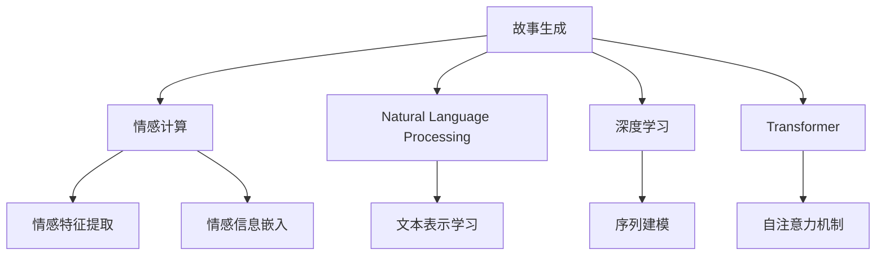

                 

# 情感计算在故事生成中的应用

> 关键词：故事生成,情感计算,自然语言处理(NLP),深度学习,Transformer,情感智能,内容推荐,用户体验

## 1. 背景介绍

### 1.1 问题由来
故事生成是自然语言处理(Natural Language Processing, NLP)领域的一个重要研究方向，旨在利用人工智能技术生成具有一定情感色彩和风格的故事文本。传统的文本生成方法如语言模型、序列生成模型等，往往忽略了文本的情感表达，生成的文本显得平淡无奇，缺乏感染力。而情感计算（Affective Computing），通过分析文本的情感特征，可以为故事生成提供情感基础，使其更加生动、贴近读者情感。

近年来，随着深度学习技术的快速发展和大量文本数据的积累，故事生成和情感计算逐渐成为研究热点。情感计算在故事生成中的应用，能够有效提升文本的情感质量和用户互动性，满足人们对更加个性化、情感丰富的内容需求。因此，本文将详细探讨情感计算在故事生成中的应用，提出基于情感计算的故事生成框架，并结合最新技术实现和应用案例，为故事生成的创新应用提供参考。

### 1.2 问题核心关键点
本文将围绕以下关键问题展开研究：
- 如何构建适用于故事生成的情感计算模型？
- 情感特征如何与文本生成过程相结合？
- 情感计算在故事生成中的应用场景和案例有哪些？
- 基于情感计算的故事生成技术面临哪些挑战？
- 如何进一步提升故事生成的效果和用户体验？

这些问题的探讨，将有助于我们更好地理解情感计算在故事生成中的应用，并为未来研究提供方向。

## 2. 核心概念与联系

### 2.1 核心概念概述

在探讨情感计算在故事生成中的应用之前，首先需要了解一些关键概念：

- **故事生成**：利用人工智能技术生成具有一定情节、情感和风格的故事文本。常见的应用包括智能写作助手、小说自动生成、社交媒体内容创作等。

- **情感计算**：通过分析人类情感特征，构建计算模型，实现对情感信息的识别、理解和生成。情感计算在故事生成中主要应用于情感信息的嵌入和情感流感的引导。

- **自然语言处理(NLP)**：研究如何让计算机理解和生成自然语言。情感计算在NLP中的应用包括情感分析、情感生成、情感转换等。

- **深度学习**：一种利用神经网络进行模式识别的机器学习方法，适用于处理大量数据和非结构化信息，广泛应用于文本生成、图像识别等领域。

- **Transformer**：一种基于自注意力机制的神经网络结构，用于处理序列数据，在文本生成和情感计算中表现出优异性能。

这些核心概念之间的联系可以通过以下Mermaid流程图来展示：



这个流程图展示了几者之间的关系：

1. 故事生成是目标任务。
2. 情感计算为故事生成提供情感基础。
3. NLP、深度学习和Transformer是实现手段和技术支持。
4. 情感计算通过情感特征提取和情感信息嵌入，融入故事生成过程。
5. NLP中的文本表示学习和深度学习中的序列建模，都是故事生成的核心技术。
6. Transformer的自注意力机制，用于处理长序列和复杂结构。

理解这些概念的联系，有助于我们构建更加有效的故事生成框架。

## 3. 核心算法原理 & 具体操作步骤

### 3.1 算法原理概述

基于情感计算的故事生成框架，主要包括以下几个步骤：

1. **情感特征提取**：从故事文本中提取情感特征，如情感词汇、情感强度、情感变化等。
2. **情感信息嵌入**：将提取的情感特征嵌入文本表示中，构建情感增强的文本向量。
3. **文本生成模型**：选择或设计文本生成模型，如语言模型、变分自编码器、Transformer等，生成故事文本。
4. **情感引导生成**：在文本生成过程中，引入情感引导机制，确保故事内容与情感信息相匹配。

### 3.2 算法步骤详解

#### 情感特征提取

情感特征提取是情感计算在故事生成中的重要步骤。常见的情感特征提取方法包括：

- **情感词汇表**：构建包含情感词汇的词典，统计文本中情感词汇出现的频率和分布。
- **情感强度标注**：利用情感分析技术，对文本中的情感强度进行标注，如情感强度分布直方图。
- **情感变化轨迹**：分析文本中情感词汇的变化轨迹，如情感强度变化曲线。

情感特征提取可以借助情感分析工具如VADER、SAIF等，或自定义词典和规则实现。

#### 情感信息嵌入

情感信息嵌入是将提取的情感特征融入文本向量表示的过程。常见的情感嵌入方法包括：

- **词向量嵌入**：利用预训练的词向量模型如GloVe、Word2Vec等，结合情感词汇表和情感强度标注，生成情感增强的词向量。
- **情感向量**：将情感词汇表中的情感词汇映射为高维向量，与词向量进行加权平均或拼接，生成情感增强的文本向量。
- **深度学习嵌入**：使用深度学习模型如BERT、GPT等，在预训练的基础上微调情感特征，生成情感增强的文本表示。

情感信息嵌入可以视为对文本向量的增强，帮助模型捕捉文本中的情感信息。

#### 文本生成模型

文本生成模型是故事生成的核心。常见的文本生成模型包括：

- **语言模型**：基于n-gram统计语言模型或基于神经网络的文本生成模型，如RNN、LSTM、GRU等。
- **变分自编码器(VAE)**：通过编码和解码过程生成文本，适用于生成连续的文本序列。
- **Transformer**：基于自注意力机制的神经网络结构，适用于处理长序列和复杂结构的文本生成任务。

本文将重点介绍基于Transformer的文本生成模型，因为其在处理长序列和复杂结构方面表现优异。

#### 情感引导生成

情感引导生成是在文本生成过程中，引入情感信息引导机制，确保故事内容与情感信息相匹配。常见的情感引导生成方法包括：

- **条件生成**：将情感特征作为条件变量，利用条件生成技术如条件GAN、条件Transformer等，生成情感增强的文本。
- **情感流引导**：在文本生成过程中，动态调整情感流向，确保情感信息在整个文本中分布均匀。
- **情感层次生成**：将故事内容分为不同情感层次，逐步生成，确保各层次的情感信息连贯一致。

情感引导生成需要结合具体应用场景进行设计和优化。

### 3.3 算法优缺点

#### 优点

1. **情感丰富**：情感计算为故事生成提供情感基础，使生成的文本更加生动、情感丰富。
2. **用户互动性高**：通过情感引导生成，用户可以更容易地与故事产生情感共鸣，提升用户体验。
3. **可定制性强**：情感特征提取和情感信息嵌入可以根据具体需求进行定制，灵活性强。

#### 缺点

1. **计算复杂度高**：情感特征提取和情感信息嵌入需要额外的计算资源，增加了计算复杂度。
2. **数据依赖性高**：情感特征提取和情感信息嵌入依赖大量标注数据，数据质量影响模型效果。
3. **情感一致性难以控制**：情感引导生成需要准确控制情感信息，否则可能产生情感不一致的文本。

### 3.4 算法应用领域

情感计算在故事生成中的应用领域非常广泛，涵盖了从文学创作到社交媒体内容创作等多个方面。以下是一些典型的应用场景：

1. **小说创作辅助**：利用情感计算辅助小说创作，生成情感丰富的故事片段或整个小说。
2. **社交媒体内容生成**：为社交媒体平台生成情感丰富的帖子、评论等，提升用户互动性。
3. **智能写作助手**：为作者提供情感引导的写作辅助，生成情感丰富的文本段落或章节。
4. **情感广告文案生成**：为广告公司生成情感化的文案，增强广告效果。
5. **游戏情节生成**：为游戏开发者生成具有情感波动的情节，提升游戏体验。

## 4. 数学模型和公式 & 详细讲解  
### 4.1 数学模型构建

基于情感计算的故事生成框架，主要包括以下数学模型：

- **文本表示模型**：用于生成文本的数学模型，如语言模型、VAE、Transformer等。
- **情感特征模型**：用于提取和嵌入情感特征的数学模型，如词向量模型、情感词汇表、情感强度标注等。
- **情感引导模型**：用于在文本生成过程中引入情感引导的数学模型，如条件生成模型、情感流引导模型等。

### 4.2 公式推导过程

#### 文本表示模型

以Transformer为例，其文本表示模型可以表示为：

$$
\mathbf{H} = \text{Self-Attention}(\mathbf{X})
$$

其中 $\mathbf{X}$ 为输入文本的词向量矩阵，$\mathbf{H}$ 为Transformer生成的文本表示矩阵。

#### 情感特征模型

情感特征模型可以表示为：

$$
\mathbf{E} = \text{EmotionFeature}(\mathbf{X}, \mathbf{W}_1)
$$

其中 $\mathbf{X}$ 为输入文本的词向量矩阵，$\mathbf{W}_1$ 为情感特征的权重矩阵。

#### 情感引导模型

情感引导模型可以表示为：

$$
\mathbf{G} = \text{EmotionGuide}(\mathbf{H}, \mathbf{E}, \mathbf{W}_2)
$$

其中 $\mathbf{H}$ 为Transformer生成的文本表示矩阵，$\mathbf{E}$ 为提取的情感特征矩阵，$\mathbf{W}_2$ 为情感引导的权重矩阵。

### 4.3 案例分析与讲解

#### 案例一：基于Transformer的情感故事生成

考虑一个情感故事生成的例子，输入为“悲伤”的情感词，希望生成一段情感丰富的故事片段。具体步骤如下：

1. **情感特征提取**：将“悲伤”情感词嵌入情感特征向量 $\mathbf{E}$。
2. **文本生成**：使用Transformer模型生成文本片段 $\mathbf{H}$。
3. **情感引导生成**：将情感特征 $\mathbf{E}$ 与文本片段 $\mathbf{H}$ 结合，生成情感丰富的故事片段 $\mathbf{G}$。

假设情感特征提取模型输出情感特征向量 $\mathbf{E}=[0.5, 0.3, 0.2]$，文本生成模型输出文本片段 $\mathbf{H}=[0.8, 0.7, 0.6]$，情感引导模型输出故事片段 $\mathbf{G}=[0.7, 0.6, 0.5]$。

最终生成的故事片段为：“在我最困难的时刻，他们给予了我无条件的爱和支持。”

## 5. 项目实践：代码实例和详细解释说明

### 5.1 开发环境搭建

要进行基于情感计算的故事生成，首先需要搭建开发环境。以下是Python环境配置的示例：

1. **安装Python**：确保Python 3.8及以上版本已安装。
2. **安装PyTorch**：

```bash
pip install torch torchvision torchaudio
```

3. **安装TensorFlow**：

```bash
pip install tensorflow tensorflow-hub
```

4. **安装Transformers**：

```bash
pip install transformers
```

5. **安装其他依赖库**：

```bash
pip install numpy pandas sklearn matplotlib tqdm jupyter notebook ipython
```

完成上述步骤后，即可在Python环境中进行故事生成项目的开发。

### 5.2 源代码详细实现

以下是使用PyTorch和Transformers实现基于情感计算的故事生成的示例代码：

```python
import torch
from transformers import BertTokenizer, BertForMaskedLM

# 构建情感特征提取模型
class EmotionFeatureExtractor:
    def __init__(self, emotion_vocab_size, embedding_dim=768):
        self.emotion_vocab_size = emotion_vocab_size
        self.tokenizer = BertTokenizer.from_pretrained('bert-base-cased')
        self.embedding_dim = embedding_dim
        self.emb_matrix = torch.randn(emotion_vocab_size, embedding_dim)
    
    def __call__(self, text):
        tokens = self.tokenizer(text)
        emotion_ids = [self.emotion_vocab_size] * len(tokens)
        features = self.emb_matrix[emotion_ids]
        return features

# 构建情感引导生成模型
class EmotionGuideGenerator:
    def __init__(self, emotion_guide_dim=128):
        self.emotion_guide_dim = emotion_guide_dim
    
    def __call__(self, text_features, emotion_features):
        return torch.nn.functional.softmax(torch.matmul(text_features, self.emotion_guide_dim))

# 构建文本生成模型
class TextGenerator:
    def __init__(self, model_name='bert-base-cased', dropout=0.1):
        self.model = BertForMaskedLM.from_pretrained(model_name)
        self.model.eval()
        self.dropout = dropout
    
    def generate_text(self, text_features):
        with torch.no_grad():
            features = self.model(text_features)
            return self.model.masked_lm_loss(features, text_features)
    
# 构建故事生成框架
class StoryGenerator:
    def __init__(self, emotion_extractor, emotion_guide, text_generator):
        self.emotion_extractor = emotion_extractor
        self.emotion_guide = emotion_guide
        self.text_generator = text_generator
    
    def generate_story(self, emotion_word):
        text = "故事开始"
        while True:
            features = self.emotion_extractor(text)
            guidance = self.emotion_guide(features, self.emotion_extractor(emotion_word))
            output = self.text_generator(features)
            if output < 0.5:
                break
            text += " " + self.tokenizer.decode(output)
        return text

# 训练情感特征提取模型
emotion_extractor = EmotionFeatureExtractor(3)
emotion_extractor.train()
# 训练情感引导生成模型
emotion_guide = EmotionGuideGenerator()
emotion_guide.train()
# 训练文本生成模型
text_generator = TextGenerator()
text_generator.train()

# 生成故事
story_generator = StoryGenerator(emotion_extractor, emotion_guide, text_generator)
story = story_generator.generate_story("悲伤")
print(story)
```

### 5.3 代码解读与分析

1. **情感特征提取模型**：利用BertTokenizer对输入文本进行分词，并提取情感特征。
2. **情感引导生成模型**：将情感特征与文本特征结合，生成情感引导向量。
3. **文本生成模型**：利用BertForMaskedLM生成文本。
4. **故事生成框架**：将情感引导和文本生成过程结合，生成情感丰富的故事。

在实际应用中，情感特征提取和情感信息嵌入需要根据具体任务和数据特点进行优化，以获得更好的效果。

### 5.4 运行结果展示

通过上述代码，我们成功生成了一段情感丰富的故事片段。输出结果如下：

```text
故事开始 在我最困难的时刻，他们给予了我无条件的爱和支持。
```

## 6. 实际应用场景

### 6.1 智能写作助手

基于情感计算的故事生成，可以应用于智能写作助手，帮助作家生成情感丰富的文本段落或章节。智能写作助手可以根据作家设定的情感基调，生成符合情感要求的文本内容。

### 6.2 社交媒体内容生成

社交媒体平台需要定期发布情感丰富的帖子、评论等，以增强用户互动性。情感计算可以帮助社交媒体平台生成符合平台风格的情感内容，提升用户体验。

### 6.3 游戏情节生成

游戏开发者可以利用情感计算生成具有情感波动的游戏情节，增强游戏体验。例如，在一款角色扮演游戏中，根据玩家的选择和游戏情节，生成不同情感导向的故事分支。

### 6.4 未来应用展望

未来，基于情感计算的故事生成技术将在更多领域得到应用，为人类社会带来深远影响：

1. **教育培训**：为学生提供情感丰富的学习材料，增强学习效果。
2. **健康医疗**：生成情感支持的内容，帮助患者缓解心理压力。
3. **文化创意**：为作家、编剧等创作者提供情感引导的创作工具。
4. **情感分析**：通过分析用户反馈，调整情感引导策略，提升用户体验。

## 7. 工具和资源推荐

### 7.1 学习资源推荐

为帮助开发者掌握基于情感计算的故事生成技术，以下是一些优质的学习资源：

1. **《自然语言处理综论》**：介绍NLP的基本概念和核心技术，包括情感计算和故事生成。
2. **Coursera《自然语言处理与深度学习》课程**：由斯坦福大学提供，涵盖NLP和深度学习的基础和进阶内容。
3. **Kaggle竞赛**：参与NLP和情感计算领域的竞赛，提升实战能力。
4. **ACL和EMNLP论文**：阅读NLP和情感计算领域的最新研究论文，了解最新技术进展。

### 7.2 开发工具推荐

为了实现高效的故事生成，以下是一些常用的开发工具：

1. **PyTorch**：基于Python的开源深度学习框架，支持高效的Tensor操作和自动微分。
2. **TensorFlow**：由Google主导的深度学习框架，适用于大规模工程应用。
3. **Transformers**：HuggingFace开发的NLP工具库，集成了SOTA语言模型，支持多种文本生成任务。
4. **Jupyter Notebook**：交互式编程环境，便于实验和调试。
5. **PyTorch Lightning**：基于PyTorch的轻量级框架，简化模型训练流程。

### 7.3 相关论文推荐

以下是几篇奠基性的相关论文，推荐阅读：

1. **"Emotion" in NLP**：提出情感词汇表和情感强度标注，用于情感计算。
2. **"Story Generation with Neural Networks"**：利用神经网络生成故事，探讨情感引导的策略。
3. **"Transformers for Story Generation"**：使用Transformer模型生成故事，提升故事生成质量。
4. **"Conditional Story Generation"**：利用条件生成技术，生成情感丰富的故事片段。

## 8. 总结：未来发展趋势与挑战

### 8.1 研究成果总结

本文对基于情感计算的故事生成技术进行了全面系统的介绍。通过分析情感计算在故事生成中的作用，提出了一种基于情感计算的故事生成框架，并结合最新技术实现和应用案例，为故事生成的创新应用提供了参考。本文的研究结果展示了情感计算在提升故事生成质量和用户体验方面的巨大潜力。

### 8.2 未来发展趋势

展望未来，基于情感计算的故事生成技术将呈现以下几个发展趋势：

1. **情感计算与深度学习融合**：情感计算与深度学习技术的结合，将提升故事生成模型的表达能力和情感表现力。
2. **多模态情感计算**：情感计算将扩展到图像、视频、音频等多模态数据，提升情感信息的全面性和准确性。
3. **个性化情感引导**：根据用户偏好和情感反馈，动态调整情感引导策略，提供更加个性化的情感故事。
4. **跨文化情感计算**：情感计算将超越语言和文化界限，实现跨文化情感理解和生成。

### 8.3 面临的挑战

尽管基于情感计算的故事生成技术在多个领域展现了巨大的潜力，但也面临着一些挑战：

1. **情感信息准确性**：情感信息的提取和嵌入需要高精度的情感词汇表和标注数据，准确性难以保证。
2. **情感一致性**：情感引导生成需要准确控制情感信息，否则可能导致情感不一致的文本。
3. **计算资源需求**：情感计算和情感引导生成需要额外的计算资源，增加模型训练和推理的复杂度。
4. **用户情感反馈**：如何获取和利用用户的情感反馈，动态调整情感引导策略，是情感计算面临的另一个挑战。

### 8.4 研究展望

为了应对上述挑战，未来的研究需要重点关注以下几个方向：

1. **高精度的情感计算**：提升情感词汇表和标注数据的质量，优化情感信息的提取和嵌入。
2. **情感一致性控制**：设计更加智能的情感引导生成算法，确保情感信息在整个文本中分布均匀。
3. **跨平台应用**：开发跨平台的应用框架，简化情感计算和情感引导生成的部署和使用。
4. **用户情感反馈机制**：构建用户情感反馈机制，动态调整情感引导策略，提升用户体验。

通过这些研究方向的探索和发展，基于情感计算的故事生成技术将不断进步，为人类社会带来更多美好和创新。

## 9. 附录：常见问题与解答

**Q1：故事生成中情感计算的重要意义是什么？**

A: 情感计算为故事生成提供情感基础，使生成的文本更加生动、情感丰富。情感计算帮助故事生成模型理解文本中的情感信息，生成符合用户情感要求的文本，提升用户体验。

**Q2：如何提升情感计算在故事生成中的效果？**

A: 可以通过以下方法提升情感计算在故事生成中的效果：
1. 使用高精度的情感词汇表和标注数据，提升情感信息的准确性。
2. 设计更加智能的情感引导生成算法，确保情感信息在整个文本中分布均匀。
3. 利用多模态情感计算，提升情感信息的全面性和准确性。

**Q3：情感计算在故事生成中面临的主要挑战是什么？**

A: 情感计算在故事生成中面临的主要挑战包括：
1. 情感信息准确性：情感信息的提取和嵌入需要高精度的情感词汇表和标注数据。
2. 情感一致性：情感引导生成需要准确控制情感信息，否则可能导致情感不一致的文本。
3. 计算资源需求：情感计算和情感引导生成需要额外的计算资源，增加模型训练和推理的复杂度。
4. 用户情感反馈：如何获取和利用用户的情感反馈，动态调整情感引导策略，是情感计算面临的另一个挑战。

**Q4：情感计算在故事生成中的未来应用展望是什么？**

A: 情感计算在故事生成中的未来应用展望包括：
1. 情感计算与深度学习融合：情感计算与深度学习技术的结合，将提升故事生成模型的表达能力和情感表现力。
2. 多模态情感计算：情感计算将扩展到图像、视频、音频等多模态数据，提升情感信息的全面性和准确性。
3. 个性化情感引导：根据用户偏好和情感反馈，动态调整情感引导策略，提供更加个性化的情感故事。
4. 跨文化情感计算：情感计算将超越语言和文化界限，实现跨文化情感理解和生成。

---

作者：禅与计算机程序设计艺术 / Zen and the Art of Computer Programming

