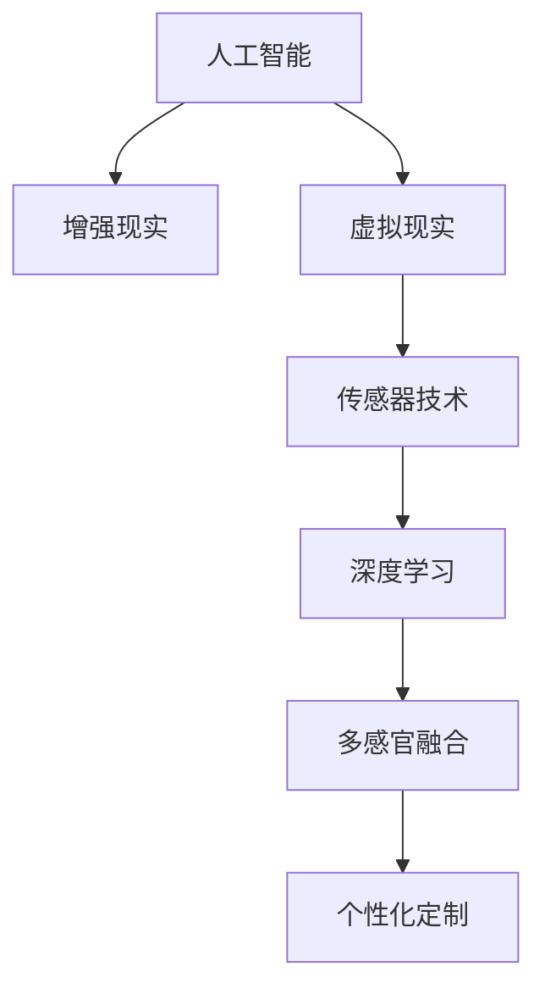

                 

# 感官增强：AI技术与人类体验的融合

## 1. 背景介绍

### 1.1 问题由来
随着人工智能技术的飞速发展，AI与人类体验的融合逐渐成为一个热门话题。尤其是近年来，AI在增强人类感官能力、改善人类生活体验方面取得了显著进展。本文将探讨AI技术如何通过感官增强，提升人类的感官体验，并讨论相关技术原理、应用案例以及未来的发展趋势。

### 1.2 问题核心关键点
AI技术通过模拟、增强人类感官能力，可以提供更加真实、丰富的感官体验。例如，虚拟现实(VR)技术通过视觉、听觉、触觉等多感官刺激，让用户在虚拟环境中体验到接近真实世界的感受。AI技术还能根据用户的喜好和行为，定制个性化的感官体验。

### 1.3 问题研究意义
感官增强技术的广泛应用，将大幅提升用户的体验质量，推动智能家居、娱乐、医疗等领域的发展。研究感官增强技术，对于探索AI技术如何更好地服务于人类，提升人类生活质量具有重要意义。

## 2. 核心概念与联系

### 2.1 核心概念概述

为更好地理解感官增强技术，本节将介绍几个密切相关的核心概念：

- 人工智能(AI)：以计算机科学为基础，模拟、延伸和扩展人类智能的技术体系。涵盖感知、理解、学习、推理、自然语言处理等子领域。
- 增强现实(AR)：通过数字信息增强现实世界，让用户可以在真实环境中看到虚拟信息。
- 虚拟现实(VR)：通过计算机生成的虚拟环境，提供沉浸式体验，让用户感觉仿佛置身于另一个现实世界。
- 传感器技术：用于捕捉用户的多感官数据，如视觉、听觉、触觉等。
- 深度学习：通过多层神经网络模型，实现对复杂数据的自动学习和模式识别。
- 多感官融合：将视觉、听觉、触觉等多种感官数据进行融合，生成更加真实、全面的感知体验。
- 个性化定制：根据用户偏好和行为，定制个性化的感官体验，提升用户体验。

这些核心概念之间的逻辑关系可以通过以下Mermaid流程图来展示：



这个流程图展示了几者之间的关联：人工智能技术通过增强现实和虚拟现实技术，模拟和增强现实世界的感官体验；传感器技术捕捉多感官数据，深度学习对数据进行处理和融合，最终生成个性化的感官体验。

## 3. 核心算法原理 & 具体操作步骤
### 3.1 算法原理概述

感官增强技术的核心算法原理涉及以下几个方面：

- **数据采集**：通过传感器（如摄像头、麦克风、触摸传感器等）采集用户的视觉、听觉、触觉等数据。
- **数据预处理**：对采集到的数据进行预处理，如降噪、增强等，提高数据质量和可用性。
- **特征提取**：使用深度学习算法提取数据中的特征，如视觉中的边缘、纹理，听觉中的音高、频率等。
- **多感官融合**：将不同感官的数据进行融合，生成更全面、准确的感知体验。
- **深度学习模型训练**：使用深度学习模型，如卷积神经网络（CNN）、循环神经网络（RNN）等，训练融合后的感官数据，生成逼真的感官体验。
- **个性化定制**：根据用户的偏好和行为，对生成的感官体验进行个性化调整，提升用户体验。

### 3.2 算法步骤详解

感官增强技术的实现通常包括以下几个关键步骤：

**Step 1: 数据采集**

- 选择合适的传感器设备，如摄像头、麦克风、触摸传感器等，采集用户的视觉、听觉、触觉等数据。
- 设计数据采集系统，确保数据采集的稳定性和可靠性。

**Step 2: 数据预处理**

- 对采集到的数据进行预处理，如降噪、增强等，提高数据质量和可用性。
- 使用滤波器、信号处理算法等技术，去除数据中的噪声和干扰。

**Step 3: 特征提取**

- 使用深度学习算法，如卷积神经网络（CNN）、循环神经网络（RNN）等，提取数据中的特征。
- 将不同感官的数据进行特征提取，如视觉中的边缘、纹理，听觉中的音高、频率等。

**Step 4: 多感官融合**

- 将不同感官的数据进行融合，生成更全面、准确的感知体验。
- 使用多感官融合算法，如时空特征融合、深度特征融合等，将不同感官的数据进行组合和优化。

**Step 5: 深度学习模型训练**

- 使用深度学习模型，如卷积神经网络（CNN）、循环神经网络（RNN）等，训练融合后的感官数据。
- 根据特定应用场景，设计相应的深度学习模型，如虚拟现实场景下的3D重建、增强现实场景下的图像识别等。

**Step 6: 个性化定制**

- 根据用户的偏好和行为，对生成的感官体验进行个性化调整。
- 使用个性化推荐算法，如协同过滤、基于内容的推荐等，推荐适合用户的多感官体验。

### 3.3 算法优缺点

感官增强技术具有以下优点：

- 提供更丰富的感官体验：通过多感官融合和深度学习模型训练，生成更逼真的感官体验。
- 提升用户体验：用户可以在虚拟现实、增强现实等环境中，获得接近真实世界的体验。
- 应用广泛：应用于游戏、医疗、教育、娱乐等领域，提升用户的学习、娱乐和工作效率。

同时，该技术也存在一些局限性：

- 技术复杂度高：多感官数据的采集、预处理、融合和深度学习模型训练，需要较高的技术门槛。
- 硬件成本高：传感器设备、高性能计算设备等硬件成本较高。
- 数据隐私问题：传感器数据涉及用户隐私，需要采取严格的隐私保护措施。

尽管存在这些局限性，但总体而言，感官增强技术具有广阔的应用前景，正逐渐成为人工智能技术的重要方向。

### 3.4 算法应用领域

感官增强技术已经广泛应用于多个领域，以下是几个典型应用：

- **游戏与娱乐**：在游戏和娱乐领域，通过虚拟现实和增强现实技术，提供沉浸式的游戏体验和互动式娱乐，提升用户参与感和体验质量。
- **医疗与健康**：在医疗和健康领域，使用虚拟现实技术进行手术模拟、康复训练等，提升医疗水平和患者体验。
- **教育与培训**：在教育和培训领域，使用增强现实技术进行虚拟课堂、虚拟实验等，提供丰富的教学资源和互动体验。
- **工业与制造**：在工业和制造领域，使用增强现实技术进行设备维护、质量检测等，提升生产效率和设备管理水平。

除了上述这些领域，感官增强技术还在越来越多的场景中得到应用，为各行各业带来新的变革。

## 4. 数学模型和公式 & 详细讲解 & 举例说明

### 4.1 数学模型构建

感官增强技术的数学模型构建涉及以下几个方面：

- **数据采集模型**：描述传感器设备的采集过程，如摄像头采集图像、麦克风采集声音等。
- **数据预处理模型**：描述数据预处理过程，如降噪、增强等。
- **特征提取模型**：描述深度学习算法提取特征的过程，如卷积神经网络（CNN）、循环神经网络（RNN）等。
- **多感官融合模型**：描述多感官数据融合的过程，如时空特征融合、深度特征融合等。
- **深度学习模型训练**：描述深度学习模型训练的过程，如卷积神经网络（CNN）、循环神经网络（RNN）等。

### 4.2 公式推导过程

以视觉感官增强为例，介绍基本的数学模型推导过程。

设采集到的图像为 $I \in \mathbb{R}^{H \times W \times 3}$，其中 $H$ 为图像高度，$W$ 为图像宽度，3为RGB颜色通道数。假设使用卷积神经网络（CNN）进行特征提取，网络结构如图：


其中，$C_1$ 为第一层卷积层，$F_1$ 为第一层特征图，$C_2$ 为第二层卷积层，$F_2$ 为第二层特征图，$D$ 为全连接层。则特征提取过程的数学模型如下：

$$
F_1 = C_1(I)
$$

$$
F_2 = C_2(F_1)
$$

$$
D = D(F_2)
$$

其中，$C_1$ 和 $C_2$ 表示卷积操作，$F_1$ 和 $F_2$ 表示卷积层输出特征图，$D$ 表示全连接层输出。

### 4.3 案例分析与讲解

以虚拟现实（VR）中的3D重建为例，介绍感官增强技术的具体应用。

在虚拟现实（VR）中，3D重建技术通过深度学习模型，将2D图像或点云数据转化为3D模型。其基本流程如下：

1. **数据采集**：使用激光扫描仪或摄像头采集3D数据。
2. **数据预处理**：对采集到的数据进行去噪、滤波等预处理。
3. **特征提取**：使用卷积神经网络（CNN）或深度神经网络（DNN）提取数据特征。
4. **3D重建**：使用生成对抗网络（GAN）或变分自编码器（VAE）等深度学习模型进行3D重建。
5. **多感官融合**：将重建后的3D模型与视觉、听觉、触觉等感官数据进行融合，生成完整的感官体验。

例如，在虚拟现实手术模拟中，使用激光扫描仪采集手术现场的3D数据，通过深度学习模型进行3D重建，生成手术室的3D模型。用户佩戴虚拟现实头盔，可以看到手术室的3D场景，通过手势控制进行手术操作，获得逼真的手术体验。

## 5. 项目实践：代码实例和详细解释说明
### 5.1 开发环境搭建

在进行感官增强技术开发前，我们需要准备好开发环境。以下是使用Python进行OpenCV、PyTorch开发的环境配置流程：

1. 安装Anaconda：从官网下载并安装Anaconda，用于创建独立的Python环境。

2. 创建并激活虚拟环境：
```bash
conda create -n sensory-environment python=3.8 
conda activate sensory-environment
```

3. 安装OpenCV：
```bash
pip install opencv-python
```

4. 安装PyTorch：根据CUDA版本，从官网获取对应的安装命令。例如：
```bash
conda install pytorch torchvision torchaudio cudatoolkit=11.1 -c pytorch -c conda-forge
```

5. 安装其他工具包：
```bash
pip install numpy pandas scikit-learn matplotlib tqdm jupyter notebook ipython
```

完成上述步骤后，即可在`pytorch-env`环境中开始感官增强技术的开发。

### 5.2 源代码详细实现

下面以深度学习模型训练为例，给出使用PyTorch进行图像分类任务的代码实现。

首先，定义模型和优化器：

```python
import torch
import torch.nn as nn
import torch.optim as optim

class CNNModel(nn.Module):
    def __init__(self):
        super(CNNModel, self).__init__()
        self.conv1 = nn.Conv2d(3, 32, 3, 1)
        self.pool = nn.MaxPool2d(2, 2)
        self.conv2 = nn.Conv2d(32, 64, 3, 1)
        self.fc1 = nn.Linear(64 * 28 * 28, 128)
        self.fc2 = nn.Linear(128, 10)

    def forward(self, x):
        x = self.pool(nn.functional.relu(self.conv1(x)))
        x = self.pool(nn.functional.relu(self.conv2(x)))
        x = x.view(-1, 64 * 28 * 28)
        x = nn.functional.relu(self.fc1(x))
        x = self.fc2(x)
        return nn.functional.log_softmax(x, dim=1)

model = CNNModel()
criterion = nn.CrossEntropyLoss()
optimizer = optim.SGD(model.parameters(), lr=0.001, momentum=0.9)
```

接着，定义训练和评估函数：

```python
from torch.utils.data import DataLoader
from torchvision import datasets, transforms

device = torch.device('cuda' if torch.cuda.is_available() else 'cpu')
model.to(device)

def train_epoch(model, train_loader, optimizer, criterion):
    model.train()
    for batch_idx, (data, target) in enumerate(train_loader):
        data, target = data.to(device), target.to(device)
        optimizer.zero_grad()
        output = model(data)
        loss = criterion(output, target)
        loss.backward()
        optimizer.step()

def evaluate(model, test_loader, criterion):
    model.eval()
    test_loss = 0
    correct = 0
    with torch.no_grad():
        for data, target in test_loader:
            data, target = data.to(device), target.to(device)
            output = model(data)
            test_loss += criterion(output, target).item()
            pred = output.argmax(dim=1, keepdim=True)
            correct += pred.eq(target.view_as(pred)).sum().item()

    test_loss /= len(test_loader.dataset)
    print(f'Test set: Average loss: {test_loss:.4f}, Accuracy: {100 * correct / len(test_loader.dataset):.2f}%')
```

最后，启动训练流程并在测试集上评估：

```python
epochs = 10
train_loader = torch.utils.data.DataLoader(
    datasets.MNIST('../data', train=True, download=True, transform=transforms.ToTensor()),
    batch_size=64, shuffle=True)
test_loader = torch.utils.data.DataLoader(
    datasets.MNIST('../data', train=False, transform=transforms.ToTensor()),
    batch_size=64, shuffle=True)

for epoch in range(epochs):
    train_epoch(model, train_loader, optimizer, criterion)
    evaluate(model, test_loader, criterion)
```

以上就是使用PyTorch进行图像分类任务的基本代码实现。可以看到，使用OpenCV和PyTorch，可以快速构建深度学习模型并进行训练和评估。

### 5.3 代码解读与分析

让我们再详细解读一下关键代码的实现细节：

**CNNModel类**：
- `__init__`方法：定义卷积层、池化层、全连接层等。
- `forward`方法：前向传播计算模型的输出。

**train_epoch和evaluate函数**：
- `train_epoch`函数：对数据集进行批次迭代，更新模型参数，计算损失函数。
- `evaluate`函数：对测试集进行评估，输出模型的精度和损失。

**训练流程**：
- 定义总的epoch数和batch size，开始循环迭代。
- 每个epoch内，先在训练集上进行训练，输出平均损失。
- 在测试集上评估，输出分类准确率。
- 所有epoch结束后，输出最终测试结果。

可以看到，使用OpenCV和PyTorch，可以快速构建深度学习模型并进行训练和评估。开发者可以将更多精力放在模型改进和算法优化上，而不必过多关注底层的实现细节。

当然，工业级的系统实现还需考虑更多因素，如模型的保存和部署、超参数的自动搜索、更灵活的任务适配层等。但核心的感官增强算法基本与此类似。

## 6. 实际应用场景
### 6.1 虚拟现实游戏

虚拟现实游戏通过视觉、听觉、触觉等多感官刺激，提供沉浸式的游戏体验。使用感官增强技术，可以进一步提升虚拟现实游戏的真实感和互动性。例如，使用手势识别技术，玩家可以通过手势控制虚拟角色，进行互动操作。通过虚拟现实头盔，玩家可以感受到游戏场景的立体效果和空间感，增强游戏体验。

### 6.2 医疗手术模拟

医疗手术模拟通过虚拟现实技术，为医生提供逼真的手术场景，提升手术技能和培训效果。使用深度学习模型，可以进行手术过程的3D重建，生成逼真的手术室场景。通过虚拟现实头盔，医生可以进行手术操作，获得接近真实手术的体验。在手术过程中，可以通过传感器采集医生手势、操作设备等数据，实时反馈手术信息，提升手术安全性和精准度。

### 6.3 智能家居控制

智能家居控制通过语音、手势等自然交互方式，提升家居控制的便捷性和智能化水平。使用增强现实技术，可以将家居控制界面展示在用户的视线上，让用户通过手势控制家居设备。通过传感器捕捉用户的多感官数据，如手势、语音等，生成逼真的交互体验，提升用户的使用体验。

### 6.4 未来应用展望

随着感官增强技术的不断发展，其应用场景将更加广泛。未来，感官增强技术将在更多领域得到应用，为传统行业带来新的变革。

在智慧医疗领域，通过虚拟现实技术进行手术模拟、康复训练等，提升医疗水平和患者体验。在智能家居领域，通过增强现实技术进行虚拟家居布置，提升家居控制的便捷性和智能化水平。在娱乐领域，通过虚拟现实技术进行沉浸式游戏和娱乐，提升用户体验。

## 7. 工具和资源推荐
### 7.1 学习资源推荐

为了帮助开发者系统掌握感官增强技术的理论基础和实践技巧，这里推荐一些优质的学习资源：

1. **《深度学习》课程**：斯坦福大学开设的深度学习课程，涵盖深度学习的基本概念和前沿技术。
2. **《计算机视觉：算法与应用》课程**：斯坦福大学开设的计算机视觉课程，介绍视觉传感和处理的基本原理和应用。
3. **《增强现实技术》书籍**：介绍增强现实技术的原理和应用，涵盖虚拟现实、增强现实等技术。
4. **《传感器技术》书籍**：介绍传感器技术的基本原理和应用，涵盖视觉、听觉、触觉等传感器。
5. **《机器学习实战》书籍**：介绍机器学习和深度学习的实际应用案例，涵盖图像分类、语音识别等技术。

通过对这些资源的学习实践，相信你一定能够快速掌握感官增强技术的精髓，并用于解决实际的NLP问题。

### 7.2 开发工具推荐

高效的开发离不开优秀的工具支持。以下是几款用于感官增强技术开发的常用工具：

1. **OpenCV**：用于计算机视觉和图像处理的开源库，支持多种图像处理算法。
2. **PyTorch**：基于Python的开源深度学习框架，支持灵活的计算图和自动微分。
3. **TensorFlow**：由Google主导开发的开源深度学习框架，生产部署方便，适合大规模工程应用。
4. **Weights & Biases**：模型训练的实验跟踪工具，可以记录和可视化模型训练过程中的各项指标。
5. **TensorBoard**：TensorFlow配套的可视化工具，实时监测模型训练状态，提供丰富的图表呈现方式。

合理利用这些工具，可以显著提升感官增强技术的开发效率，加快创新迭代的步伐。

### 7.3 相关论文推荐

感官增强技术的发展源于学界的持续研究。以下是几篇奠基性的相关论文，推荐阅读：

1. **《深度学习视觉与模式识别》**：深度学习在视觉领域的经典著作，介绍了深度学习在图像处理、目标检测等方面的应用。
2. **《计算机视觉：算法与应用》**：介绍计算机视觉的原理和应用，涵盖图像处理、目标检测、视觉语义等技术。
3. **《增强现实技术》**：介绍增强现实技术的原理和应用，涵盖虚拟现实、增强现实等技术。
4. **《感官增强技术》**：介绍感官增强技术的原理和应用，涵盖视觉、听觉、触觉等感官增强技术。

这些论文代表了大语言模型微调技术的发展脉络。通过学习这些前沿成果，可以帮助研究者把握学科前进方向，激发更多的创新灵感。

## 8. 总结：未来发展趋势与挑战

### 8.1 总结

本文对感官增强技术进行了全面系统的介绍。首先阐述了感官增强技术的背景和意义，明确了感官增强在提升用户体验、推动行业发展方面的独特价值。其次，从原理到实践，详细讲解了感官增强技术的数学模型和关键步骤，给出了感官增强技术开发的基本代码实现。同时，本文还广泛探讨了感官增强技术在虚拟现实游戏、医疗手术模拟、智能家居控制等多个行业领域的应用前景，展示了感官增强技术的广阔前景。

通过本文的系统梳理，可以看到，感官增强技术正在成为人工智能技术的重要方向，极大地提升用户体验，推动各行业的智能化升级。未来，伴随深度学习、增强现实等技术的不断进步，感官增强技术必将在更广阔的领域得到应用，为人类生产和生活带来深刻变革。

### 8.2 未来发展趋势

展望未来，感官增强技术将呈现以下几个发展趋势：

1. **技术融合**：感官增强技术将与更多人工智能技术进行融合，如自然语言处理、语音识别等，提供更加丰富和沉浸的体验。
2. **设备普及**：增强现实设备、虚拟现实头盔等感官增强设备将逐渐普及，提升用户体验和应用普及率。
3. **应用场景拓展**：感官增强技术将在更多领域得到应用，如医疗、娱乐、教育等，提升各行业的智能化水平。
4. **个性化定制**：通过多感官数据和深度学习模型，提供更加个性化的感官体验，满足不同用户的需求。
5. **多感官融合**：通过多传感器数据融合，提供更加全面和逼真的感官体验，提升用户体验。

以上趋势凸显了感官增强技术的广阔前景。这些方向的探索发展，必将进一步提升用户体验，推动各行业的智能化升级。

### 8.3 面临的挑战

尽管感官增强技术已经取得了显著进展，但在迈向更加智能化、普适化应用的过程中，仍面临诸多挑战：

1. **技术门槛高**：感官增强技术涉及深度学习、计算机视觉、增强现实等多领域的知识，需要较高的技术门槛。
2. **硬件成本高**：增强现实设备、虚拟现实头盔等硬件成本较高，设备普及度受限。
3. **数据隐私问题**：多感官数据的采集涉及用户隐私，需要严格的隐私保护措施。
4. **用户接受度**：用户对感官增强技术的使用接受度仍需进一步提升，尤其是在非游戏娱乐场景中的应用。

尽管存在这些挑战，但总体而言，感官增强技术具有广阔的应用前景，正逐渐成为人工智能技术的重要方向。

### 8.4 研究展望

面向未来，感官增强技术的研究方向将更加多样化，技术突破也将更加广泛。以下是几个可能的研究方向：

1. **多感官融合**：通过多传感器数据的深度学习融合，提供更加全面和逼真的感官体验。
2. **个性化定制**：通过用户行为数据分析，提供更加个性化的感官体验，提升用户体验。
3. **实时交互**：通过实时多感官数据的交互，提升用户的使用便捷性和体验质量。
4. **设备智能化**：通过增强现实设备、虚拟现实头盔等的智能化升级，提升用户体验和应用普及率。
5. **跨领域应用**：将感官增强技术应用于更多领域，如医疗、教育、娱乐等，提升各行业的智能化水平。

这些研究方向将推动感官增强技术不断突破，提升用户体验，推动各行业的智能化升级。总之，感官增强技术需要跨学科、跨领域的研究人员共同努力，才能真正实现其在各行业的广泛应用，推动人工智能技术的发展。

## 9. 附录：常见问题与解答

**Q1：感官增强技术如何与其他人工智能技术结合？**

A: 感官增强技术可以通过与其他人工智能技术的结合，提供更加丰富和沉浸的体验。例如，可以将自然语言处理技术应用于增强现实中的语音识别，使用语音指令控制虚拟环境。还可以将视觉识别技术应用于增强现实中的物体识别，通过识别用户手中的物体进行互动操作。

**Q2：感官增强技术如何处理数据隐私问题？**

A: 数据隐私问题是感官增强技术的重要挑战。为保护用户隐私，可以采用以下措施：
1. 匿名化处理：对采集到的多感官数据进行匿名化处理，保护用户身份信息。
2. 数据加密：对多感官数据进行加密处理，防止数据泄露。
3. 用户同意：在数据采集和使用过程中，获取用户同意，并明确告知数据用途和隐私保护措施。
4. 数据存储安全：对采集到的多感官数据进行安全存储，防止数据泄露。

通过以上措施，可以有效保护用户隐私，提升用户对感官增强技术的信任度。

**Q3：感官增强技术有哪些应用场景？**

A: 感官增强技术在多个领域都有广泛应用，以下是几个典型应用场景：
1. 虚拟现实游戏：通过视觉、听觉、触觉等多感官刺激，提供沉浸式的游戏体验。
2. 医疗手术模拟：通过虚拟现实技术进行手术模拟、康复训练等，提升医疗水平和患者体验。
3. 智能家居控制：通过增强现实技术进行虚拟家居布置，提升家居控制的便捷性和智能化水平。
4. 教育培训：通过增强现实技术进行虚拟课堂、虚拟实验等，提供丰富的教学资源和互动体验。
5. 娱乐应用：通过虚拟现实技术进行沉浸式游戏和娱乐，提升用户体验。

这些应用场景展示了感官增强技术的广阔应用前景，未来还将拓展到更多领域，提升各行业的智能化水平。

总之，感官增强技术作为人工智能的重要方向，正逐渐成为推动各行业智能化升级的关键力量。随着技术的不断进步和应用普及，感官增强技术必将在更多领域带来深刻变革，提升人类的感官体验和生产生活水平。

