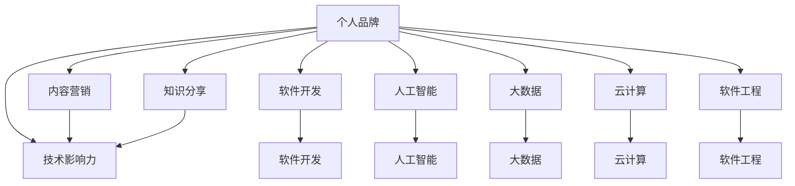

                 

# 打造个人IP：技术影响力的关键

> 关键词：个人品牌,技术影响力,内容营销,知识分享,软件开发,人工智能,大数据,云计算,软件工程

## 1. 背景介绍

### 1.1 问题由来
在当前这个信息爆炸的时代，技术开发者和专业人士如何在这个喧嚣纷扰的世界中建立自己的声音，打造个人影响力（Personal IP），成为了一个日益重要的议题。个人IP不仅仅是个人的知名度，更是个人在某个领域专业深度和广度的体现，它可以通过知识分享、技术创新、项目合作等多种方式构建和传播。

### 1.2 问题核心关键点
个人IP的建立，是一个长期、持续的过程，需要开发者在技术深度和广度、内容创作和传播、个人形象塑造等方面做出持续努力。其核心关键点包括：

1. **技术深度和广度**：在某个技术领域进行深入研究，同时保持对新兴技术的敏感和兴趣。
2. **内容创作和传播**：通过撰写技术博客、开源项目、演讲等方式，分享自己的知识和经验。
3. **个人形象塑造**：建立良好的职业形象，包括专业性、亲和力、责任感等。
4. **网络互动**：积极参与技术社区和论坛，与同行交流和合作。
5. **持续学习和创新**：保持对技术的持续学习和实践，推动自我突破和创新。

### 1.3 问题研究意义
建立个人IP不仅能提升个人在行业中的影响力，还能带来更多的职业机会，如演讲邀请、咨询顾问、技术博客收入等。对于组织而言，拥有具有个人IP的技术人员，能够提升公司的品牌价值和技术实力。此外，个人IP的建立，也是推动技术普及和应用的重要力量。

## 2. 核心概念与联系

### 2.1 核心概念概述

为更好地理解如何打造个人IP，本节将介绍几个密切相关的核心概念：

- **个人品牌（Personal Branding）**：指通过一系列有策略的行动和表现，在公众中建立起独特的形象和价值主张。个人品牌不仅与职业相关，还应涵盖个人价值观、兴趣、生活态度等方方面面。

- **技术影响力（Technical Influence）**：指在技术社区、行业内及广大开发者中，通过分享知识和经验，影响和推动技术发展、教育、应用等方面的能力。技术影响力的核心是专业性和深度，能够提供有价值的解决方案和洞察。

- **内容营销（Content Marketing）**：通过创造和分享有价值的内容，吸引、教育和参与目标受众，从而建立品牌知名度和市场份额。内容营销的关键在于内容的真实性和价值，以及传播的广度和深度。

- **知识分享（Knowledge Sharing）**：指将个人或团队的积累、经验、成果等知识以各种形式公开，包括文章、代码、演讲、视频等。知识分享旨在传递知识，帮助他人进步，同时也能增强自己的专业能力。

- **软件开发（Software Development）**：指编写、测试、维护和部署软件的过程。高质量的软件开发不仅是技术实现的体现，更是技术影响力的重要组成部分。

- **人工智能（Artificial Intelligence）**：指使计算机系统执行通常需要人类智能的任务，包括机器学习、深度学习、自然语言处理等。AI技术在各行各业的应用，需要技术专家进行推动和普及。

- **大数据（Big Data）**：指巨大、复杂的数据集，需要特殊的技术和工具进行处理和分析。大数据技术的应用，推动了各行各业的数字化转型。

- **云计算（Cloud Computing）**：指通过互联网提供计算、存储和应用软件等资源和服务的模式。云计算的普及，使技术专家可以更加便捷地进行远程协作和技术传播。

- **软件工程（Software Engineering）**：指以系统化、规范化、科学化的方式开发、测试、维护软件的过程。良好的软件工程实践，是构建高质量个人IP的基础。

这些核心概念之间的逻辑关系可以通过以下Mermaid流程图来展示：



这个流程图展示了几大核心概念及其之间的关系：

1. 个人品牌通过技术影响力、内容营销和知识分享建立，同时在软件开发、人工智能、大数据、云计算、软件工程等多个技术领域发挥作用。
2. 技术影响力与个人品牌密不可分，通过高质量的内容和深入的技术分享，影响和推动技术社区和行业发展。
3. 内容营销和知识分享是个人品牌传播的主要手段，帮助技术专家与广大开发者和用户建立连接。
4. 软件开发、人工智能、大数据、云计算、软件工程等技术领域，是技术影响力的具体应用场景，个人在其中的表现和成果，直接体现了其技术深度和广度。

## 3. 核心算法原理 & 具体操作步骤
### 3.1 算法原理概述

打造个人IP，本质上是一个通过技术深度和广度，结合内容创作和传播的过程。其核心算法原理包括以下几个方面：

- **技术深度**：指在某个技术领域进行深入研究，掌握核心原理和实践，并能够解决实际问题。
- **技术广度**：指对多个相关技术领域有所了解，能够跨领域协作和创新。
- **内容创作**：指通过撰写文章、开发开源项目、制作视频等方式，分享知识和经验。
- **内容传播**：指通过社交媒体、技术论坛、博客、演讲等方式，将内容传播给目标受众。

### 3.2 算法步骤详解

打造个人IP的一般步骤如下：

**Step 1: 定位与规划**
- 明确自己的兴趣和优势，选择适合自己的技术方向。
- 设定短期和长期目标，包括技术深度、广度提升，内容创作和传播计划。

**Step 2: 知识积累与技术实践**
- 阅读相关领域的前沿论文和书籍，积累知识。
- 参与开源项目，贡献代码和文档，实践技术。
- 参与技术社区和论坛，与同行交流和合作。

**Step 3: 内容创作与发布**
- 撰写技术博客、文章，分享技术心得和解决方案。
- 开发开源项目，展示自己的技术实力。
- 制作视频、播客等形式的内容，丰富传播形式。

**Step 4: 传播与互动**
- 利用社交媒体、技术论坛、博客平台等渠道，传播内容。
- 参与技术会议、讲座，进行演讲和互动。
- 与读者和同行互动，解答疑问，收集反馈。

**Step 5: 持续改进与优化**
- 根据反馈和数据，不断改进内容质量和技术水平。
- 持续学习和实践，保持对新技术的敏感和兴趣。
- 定期回顾和调整个人IP发展计划，确保目标达成。

### 3.3 算法优缺点

打造个人IP的优势包括：
1. 提升专业地位和影响力，获得更多职业机会。
2. 建立个人品牌，吸引更多的合作和资源。
3. 推动技术普及和应用，造福社会。

同时，也存在以下挑战：
1. 需要大量的时间和精力投入，特别是在内容创作和传播上。
2. 需要持续的学习和实践，保持技术更新。
3. 需要有良好的沟通和传播技巧，以吸引和保持受众。

### 3.4 算法应用领域

个人IP在多个领域都有广泛的应用，包括但不限于：

- **软件开发**：通过技术博客、开源项目、演讲等方式，推广软件开发工具和实践。
- **人工智能**：通过深度学习、自然语言处理等领域的知识和项目，推动AI技术的普及和应用。
- **大数据**：通过数据处理、分析技术的分享，帮助企业实现数字化转型。
- **云计算**：通过云服务和应用开发，推动云计算技术的落地和应用。
- **软件工程**：通过软件工程实践的分享，提高软件开发的质量和效率。
- **内容创作与传播**：通过技术文章、视频等形式，普及技术知识，帮助初学者和从业者提升技术水平。

## 4. 数学模型和公式 & 详细讲解  
### 4.1 数学模型构建

为了更严格地刻画个人IP的构建过程，本节将使用数学语言进行模型构建。

假设个人IP构建的目标函数为：

$$
\text{maximize } f(\theta)
$$

其中 $\theta$ 代表个人的技术深度、广度、内容质量、传播能力等维度的向量。

目标函数 $f(\theta)$ 可以通过以下形式表示：

$$
f(\theta) = w_1 \times \text{技术深度}(\theta) + w_2 \times \text{技术广度}(\theta) + w_3 \times \text{内容质量}(\theta) + w_4 \times \text{传播能力}(\theta)
$$

其中 $w_1, w_2, w_3, w_4$ 为权重，需要根据具体情况进行调整。

### 4.2 公式推导过程

以下我们以技术广度为例，推导相关公式：

假设技术广度可以通过掌握的不同技术领域数 $N$ 来衡量，每个领域掌握的深度 $D_i$ 可以用专家评分 $S_i$ 来表示。则技术广度的目标函数可以表示为：

$$
\text{技术广度}(\theta) = \frac{\sum_{i=1}^N S_i}{N}
$$

为了最大化技术广度，需要最大化每个领域的技术深度 $S_i$。可以通过阅读学术论文、参与项目、参与社区等多种方式来提升 $S_i$。

### 4.3 案例分析与讲解

假设一个开发者希望提升其在云计算领域的技术广度。可以采取以下策略：

1. **阅读学术论文**：通过阅读最新的云计算相关论文，了解最新的研究进展和技术趋势。
2. **参与项目**：加入开源的云计算项目，通过实践提升技术能力。
3. **参与社区**：在技术社区和论坛积极发言，与同行交流，获取反馈。
4. **技术博客**：通过撰写技术博客，分享自己在云计算领域的实践和心得。
5. **演讲和培训**：通过参加技术会议和培训，提升影响力。

这些策略能够帮助开发者在短时间内提升技术广度，同时通过内容创作和传播，建立个人IP。

## 5. 项目实践：代码实例和详细解释说明
### 5.1 开发环境搭建

在进行个人IP构建实践前，我们需要准备好开发环境。以下是使用Python进行内容创作的开发环境配置流程：

1. 安装Python：从官网下载并安装Python，确保版本与社区标准一致。
2. 安装Pip：通过命令行安装Pip，用于管理Python包。
3. 安装Markdown、Sphinx等工具：用于生成技术博客和文档。
4. 安装GitHub桌面版：用于版本控制和代码托管。
5. 安装Git：用于版本控制和远程协作。
6. 安装Visual Studio Code等IDE：用于编写代码和管理项目。

完成上述步骤后，即可在本地环境中进行个人IP构建实践。

### 5.2 源代码详细实现

下面以开源项目分享为例，展示如何使用GitHub进行技术实践和内容传播。

1. 创建一个GitHub仓库，用于存储项目代码和文档。
2. 编写代码，记录开发过程和思考。
3. 编写README文件，简要介绍项目和贡献方式。
4. 使用Markdown编写技术博客，记录项目进展和技术心得。
5. 使用Sphinx生成技术文档，方便阅读和引用。
6. 在GitHub页面上发布项目和博客，与社区互动。

以下是示例代码：

```python
# 代码示例
def calculate_sales_revenue(sales_data):
    total_revenue = 0
    for record in sales_data:
        total_revenue += record['sales'] * record['price']
    return total_revenue

# 技术博客示例
import sales_data
total_revenue = calculate_sales_revenue(sales_data)
print(f"总销售额为: {total_revenue}")
```

### 5.3 代码解读与分析

让我们再详细解读一下关键代码的实现细节：

**calculate_sales_revenue函数**：
- 定义一个函数，用于计算总销售额。
- 接收一个包含销售记录的列表。
- 遍历销售记录，计算每笔销售的总收入，并累加到总销售额中。
- 返回总销售额。

**技术博客示例代码**：
- 导入`sales_data`模块，用于获取销售数据。
- 调用`calculate_sales_revenue`函数，计算总销售额。
- 使用`print`函数，将总销售额输出到控制台。

这些代码虽然简单，但却展示了如何通过编写代码和博客，分享自己的技术见解和实践经验。在实际开发中，需要根据具体项目和技术领域，选择合适的内容形式和传播渠道。

## 6. 实际应用场景
### 6.1 软件开发

在软件开发领域，个人IP的构建不仅有助于提升开发者在技术社区的影响力，还能帮助吸引更多的合作机会和资源。

**技术博客**：通过撰写技术博客，分享软件开发经验和技术见解，帮助初学者和同行提升技术水平。
**开源项目**：通过参与开源项目，展示技术实力，吸引合作伙伴。
**技术讲座**：通过参加技术讲座和会议，提升个人知名度和影响力。

### 6.2 人工智能

在人工智能领域，个人IP的构建有助于推动AI技术的普及和应用，促进技术进步。

**深度学习项目**：通过参与深度学习项目，展示技术实力，吸引合作机会。
**技术论文**：通过撰写技术论文，分享研究成果，推动技术进步。
**技术讲座**：通过参加技术讲座和会议，提升影响力。

### 6.3 大数据

在大数据领域，个人IP的构建有助于推动大数据技术的普及和应用，促进企业数字化转型。

**数据处理项目**：通过参与数据处理项目，展示技术实力，吸引合作机会。
**技术博客**：通过撰写技术博客，分享数据处理经验和技术见解，帮助企业和用户提升数据处理能力。
**技术讲座**：通过参加技术讲座和会议，提升影响力。

### 6.4 云计算

在云计算领域，个人IP的构建有助于推动云计算技术的普及和应用，促进企业数字化转型。

**云服务项目**：通过参与云服务项目，展示技术实力，吸引合作机会。
**技术博客**：通过撰写技术博客，分享云计算经验和技术见解，帮助企业和用户提升云服务能力。
**技术讲座**：通过参加技术讲座和会议，提升影响力。

### 6.5 未来应用展望

随着技术的不断进步，个人IP的构建将有更广阔的应用前景。未来，个人IP的构建将更加注重跨领域融合和创新。

1. **跨领域融合**：随着技术边界的模糊，跨领域的个人IP将更加受欢迎。技术专家可以通过跨领域的项目和合作，提升影响力。
2. **技术创新**：通过不断创新，开发前沿技术，引领行业发展。技术专家可以通过创新项目和专利，提升技术地位和影响力。
3. **技术教育**：通过在线教育平台，分享技术知识和经验，帮助更多人提升技术水平。技术专家可以通过在线课程和培训，提升影响力。
4. **开源社区**：通过参与开源社区，贡献代码和文档，展示技术实力，吸引合作机会。

## 7. 工具和资源推荐
### 7.1 学习资源推荐

为了帮助开发者系统掌握个人IP的构建方法，这里推荐一些优质的学习资源：

1. **《构建个人IP：从技术开发者到行业专家》**：一本系统介绍如何通过技术深度和广度，结合内容创作和传播，建立个人IP的书籍。
2. **Coursera《个人品牌构建与影响力提升》**：由知名讲师开设的在线课程，涵盖个人品牌构建的多个方面。
3. **Udemy《技术开发者如何构建个人品牌》**：实战型的在线课程，提供具体案例和实践方法。
4. **LinkedIn Learning《个人品牌与内容营销》**：由LinkedIn专家开设的在线课程，专注于内容营销和个人品牌构建。
5. **Ted Talks《技术专家的个人品牌建设》**：一系列技术专家分享个人品牌构建经验的TED Talks视频。

通过对这些资源的学习实践，相信你一定能够快速掌握个人IP构建的精髓，并用于解决实际的职业发展和技术传播问题。

### 7.2 开发工具推荐

高效的开发离不开优秀的工具支持。以下是几款用于个人IP构建开发的常用工具：

1. GitHub：代码托管平台，方便版本控制和远程协作。
2. Git：版本控制工具，支持分支管理、合并等操作。
3. Visual Studio Code：轻量级的IDE，支持多种编程语言和插件。
4. Sphinx：技术文档生成工具，支持Markdown和ReStructuredText格式。
5. Jupyter Notebook：交互式编程环境，方便撰写技术博客和代码演示。
6. Markdown：轻量级文本格式，支持多种内容形式，如代码块、表格等。

合理利用这些工具，可以显著提升个人IP构建的开发效率，加快创新迭代的步伐。

### 7.3 相关论文推荐

个人IP的构建源于学界的持续研究。以下是几篇奠基性的相关论文，推荐阅读：

1. **《构建个人品牌：技术影响力与内容营销》**：系统介绍了个人品牌构建的多个方面，包括技术深度、内容创作、传播策略等。
2. **《跨领域融合：技术专家的未来之路》**：探讨了跨领域融合对技术专家个人IP构建的影响和重要性。
3. **《技术专家的技术分享与知识传播》**：分析了技术专家通过技术分享和知识传播建立个人IP的机制和效果。
4. **《开源社区与个人IP的构建》**：研究了开源社区对技术专家个人IP构建的影响和作用。

这些论文代表了大语言模型微调技术的发展脉络。通过学习这些前沿成果，可以帮助研究者把握学科前进方向，激发更多的创新灵感。

## 8. 总结：未来发展趋势与挑战
### 8.1 总结

本文对如何打造个人IP进行了全面系统的介绍。首先阐述了个人IP构建的背景和意义，明确了个人IP对技术深度的提升、内容的创作与传播、个人形象的塑造等方面的重要性。其次，从原理到实践，详细讲解了个人IP的数学模型和构建步骤，给出了个人IP构建的完整代码实例。同时，本文还探讨了个人IP在多个领域的应用前景，展示了其在推动技术进步、普及技术知识等方面的潜力。此外，本文精选了个人IP构建的相关资源，力求为读者提供全方位的技术指引。

通过本文的系统梳理，可以看到，个人IP的构建是一个长期、持续的过程，需要技术专家在技术深度、广度、内容创作和传播等方面不断努力。只有坚持不懈，才能在技术领域建立自己的品牌和影响力，获得更多的职业机会和发展空间。

### 8.2 未来发展趋势

展望未来，个人IP的构建将呈现以下几个发展趋势：

1. **技术深度和广度的融合**：未来，跨领域的个人IP将成为趋势，技术专家需要掌握多个相关领域的知识，提升跨领域协作能力。
2. **内容创作的多样化**：技术内容的形式将更加多样化，除了博客、文章、代码外，还将包括视频、播客、直播等多种形式。
3. **社交媒体的深度应用**：社交媒体将更加深入地融入个人IP构建过程，技术专家可以通过多种社交平台展示自己的技术和成果。
4. **数据驱动的决策**：个人IP构建将更加依赖数据驱动的决策，通过分析受众反馈和数据，优化内容和传播策略。
5. **技术教育的普及**：在线教育平台将发挥更大作用，技术专家可以通过在线课程和培训，普及技术知识，提升技术水平。
6. **开源社区的深化**：技术专家将更加深入地参与开源社区，贡献代码和文档，提升个人和社区的影响力。

这些趋势将推动个人IP构建向更高层次发展，为技术专家提供更多的机会和平台，同时也对技术社区和技术传播带来新的挑战和机遇。

### 8.3 面临的挑战

尽管个人IP的构建有诸多优势，但在实际操作中，仍然面临以下挑战：

1. **时间和精力的投入**：个人IP的构建需要大量时间和精力投入，特别是在内容创作和传播上，容易影响正常工作和生活。
2. **内容的创新性**：保持内容的创新性和时效性，避免内容雷同和低质量，是提升影响力的关键。
3. **受众的反馈和互动**：获取受众的反馈和互动，及时调整内容和传播策略，需要技术专家具备良好的沟通和互动能力。
4. **技术快速迭代**：技术不断更新，需要技术专家持续学习和实践，保持技术深度和广度。
5. **品牌的一致性**：保持个人品牌的一致性和专业性，避免内容冲突和形象混淆。
6. **数据隐私和安全**：在内容创作和传播过程中，需要保护个人隐私和数据安全。

这些挑战需要技术专家在实践中不断总结和改进，才能建立稳定、持久、具有影响力的个人IP。

### 8.4 研究展望

面对个人IP构建所面临的挑战，未来的研究需要在以下几个方面寻求新的突破：

1. **技术深度的多维度提升**：通过跨学科学习和研究，提升技术专家的技术深度和广度。
2. **内容创作的智能化**：利用人工智能和大数据分析，提升内容创作的效率和质量。
3. **社交媒体的深度融合**：探索社交媒体在个人IP构建中的深度应用，提升内容传播效果。
4. **数据驱动的决策支持**：利用数据驱动的决策支持系统，优化内容创作和传播策略。
5. **技术教育的在线化**：推动在线教育平台的发展，普及技术知识，提升技术水平。
6. **开源社区的深化参与**：深入参与开源社区，提升个人和社区的影响力。

这些研究方向的探索，将推动个人IP构建向更高层次发展，为技术专家提供更多的机会和平台，同时也对技术社区和技术传播带来新的挑战和机遇。只有勇于创新、敢于突破，才能不断拓展个人IP的边界，让技术专家在技术领域发挥更大的影响力。

## 9. 附录：常见问题与解答
----------------------------------------------------------------
> 常见问题一：个人IP与职业发展有何关系？
> 
> 回答：个人IP是技术专家在某个领域的影响力和专业地位的体现，有助于提升技术专家的职业机会和发展空间。拥有个人IP的技术专家，可以更容易地获得演讲邀请、咨询顾问、技术博客收入等职业机会。
> 
> 常见问题二：如何平衡个人IP构建与日常工作？
> 
> 回答：建议技术专家在周末或业余时间进行个人IP构建，避免影响正常工作和生活。可以通过高效的时间管理和内容规划，平衡个人IP构建和日常工作。
> 
> 常见问题三：个人IP构建需要哪些资源？
> 
> 回答：个人IP构建需要良好的编程环境、版本控制工具、代码托管平台、内容创作工具等多种资源支持。建议技术专家根据自身情况选择合适的工具和平台。
> 
> 常见问题四：如何提升内容的创新性？
> 
> 回答：建议技术专家关注最新技术动态，参与技术社区和论坛，获取行业资讯和反馈。同时，可以尝试多种内容形式和传播渠道，保持内容的创新性和时效性。
> 
> 常见问题五：如何保护个人隐私和数据安全？
> 
> 回答：建议技术专家在内容创作和传播过程中，遵守相关法律法规和平台规定，保护个人隐私和数据安全。同时，可以通过内容加密和数据脱敏等手段，保护敏感信息。

---

作者：禅与计算机程序设计艺术 / Zen and the Art of Computer Programming

