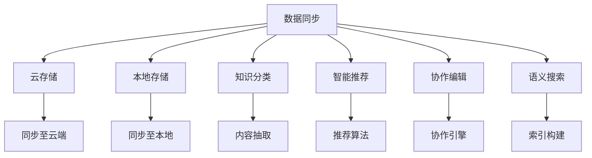

                 

## 1. 背景介绍

在信息化和数字化迅猛发展的今天，个人知识管理（Personal Knowledge Management, PKM）成为了越来越多专业人士关注的焦点。个人知识管理不仅能帮助人们有效整理、存储和利用知识，还能提升工作和学习效率，减少信息过载，培养深度思考习惯。随着智能手机和平板电脑的普及，移动设备成为了人们获取、处理和分享知识的主要工具，因此开发一款优秀的个人知识管理移动应用成为了当前的热门课题。

### 1.1 问题由来

个人知识管理涉及的任务非常广泛，包括笔记管理、文档管理、图片管理、代码管理、协作管理等。传统的个人知识管理工具如Evernote、OneNote等已经存在多年，但在移动设备和人工智能技术迅猛发展的背景下，现有的工具在数据同步、知识分类、智能推荐等方面仍然存在诸多不足，难以满足用户日益增长的需求。

### 1.2 问题核心关键点

为了构建一款满足用户需求的个人知识管理移动应用，我们必须关注以下几个核心问题：

- **数据同步**：确保用户在不同设备间的数据同步，避免数据丢失。
- **知识分类**：提供灵活的知识分类系统，方便用户组织和管理。
- **智能推荐**：通过AI技术为用户推荐相关内容，提高知识获取效率。
- **协作功能**：支持多人协作编辑，共享知识库，提升团队工作效率。
- **用户体验**：界面简洁直观，操作便捷，提升用户粘性。

### 1.3 问题研究意义

开发个人知识管理移动应用，对于提升个人学习和工作效率，促进知识传播和创新具有重要意义：

1. **提升个人学习效率**：通过自动化整理和管理知识，减少重复劳动，节省时间，提高学习效率。
2. **优化工作流程**：实现文档、代码、图片等资源的高效管理和共享，提升团队协作能力。
3. **促进知识传播**：通过知识共享和推荐，加速知识的传播和扩散，推动行业发展。
4. **培养深度思考**：整理和梳理知识，培养深度思考和系统思维习惯，提升创新能力。
5. **支持移动化办公**：适应随时随地的工作模式，提升移动办公体验。

## 2. 核心概念与联系

### 2.1 核心概念概述

在构建个人知识管理移动应用时，以下几个核心概念至关重要：

- **知识图谱**：以节点和边表示知识实体及其关系的数据结构，帮助用户理解知识结构。
- **语义搜索**：基于自然语言处理技术的搜索引擎，能够理解用户查询的语义，精准检索知识。
- **信息抽取**：从非结构化文本中提取出结构化信息，如事件、实体、关系等，辅助知识分类。
- **推荐系统**：基于用户行为和知识图谱的推荐算法，为用户推荐相关内容。
- **协作编辑**：支持多人同时编辑同一文档，实现知识的共享和协同创作。

这些核心概念通过合理解构和有机融合，可以构建出功能丰富、用户体验良好的个人知识管理移动应用。

### 2.2 核心概念原理和架构的 Mermaid 流程图



该流程图展示了个人知识管理移动应用的核心组件及其联系。数据同步模块连接云存储和本地存储，确保知识数据的可靠性和安全性。知识分类模块利用内容抽取技术，自动分类知识内容。智能推荐模块基于推荐算法，为用户推荐相关知识。协作编辑模块提供多人协同创作的功能。语义搜索模块通过索引构建，实现精准检索。

## 3. 核心算法原理 & 具体操作步骤

### 3.1 算法原理概述

在构建个人知识管理移动应用时，我们采用以下核心算法原理：

- **深度学习模型**：使用深度学习模型进行知识分类、信息抽取和推荐，提升算法的准确性和泛化能力。
- **自然语言处理(NLP)**：通过NLP技术实现语义搜索和语义抽取，提高信息的理解和处理能力。
- **协同过滤算法**：结合用户行为数据和知识图谱，进行个性化推荐，提升推荐效果。
- **分布式数据库**：使用分布式数据库存储和同步知识数据，确保数据的高可用性和扩展性。

### 3.2 算法步骤详解

基于上述核心算法原理，我们的操作步骤如下：

**Step 1: 设计数据模型**

首先，我们需要设计知识数据模型，包含以下关键实体：

- **用户实体**：存储用户基本信息，如用户名、邮箱、手机号等。
- **知识实体**：存储知识内容的元数据，如标题、摘要、分类等。
- **关系实体**：存储知识之间的关系，如引用、标签、评论等。

**Step 2: 搭建基础架构**

构建一个多租户云服务架构，包含以下组件：

- **数据层**：使用分布式数据库如Hadoop、Spark、MongoDB等存储和同步知识数据。
- **计算层**：使用分布式计算框架如Spark、Flink、Kubernetes等处理和分析知识数据。
- **应用层**：开发移动应用的前端和后端接口，实现知识管理功能。

**Step 3: 实现核心算法**

基于数据模型和基础架构，实现以下核心算法：

- **知识分类**：使用预训练的BERT模型进行内容抽取和分类。
- **智能推荐**：结合协同过滤和内容过滤算法，实现个性化推荐。
- **协作编辑**：实现多人协同编辑功能，确保数据一致性和并发性。
- **语义搜索**：使用TF-IDF和word2vec等技术进行索引构建和语义搜索。

**Step 4: 用户交互设计**

最后，我们需要设计用户界面，实现以下功能：

- **创建和管理知识**：用户可以创建笔记、文档、图片等知识内容，并进行分类、标记和注释。
- **查询和搜索知识**：用户可以通过关键词、分类标签、时间范围等方式查询相关知识。
- **协作和分享知识**：用户可以邀请其他用户共同编辑知识内容，并进行知识分享和评论。

### 3.3 算法优缺点

**优点**：

- **数据同步**：确保数据在不同设备间同步，避免数据丢失。
- **知识分类**：自动分类知识内容，提高知识管理效率。
- **智能推荐**：基于用户行为进行个性化推荐，提升知识获取效率。
- **协作编辑**：支持多人协作编辑，提高团队工作效率。
- **用户体验**：界面简洁直观，操作便捷，提升用户粘性。

**缺点**：

- **计算资源消耗**：深度学习和分布式计算需要较高的计算资源，可能会带来性能瓶颈。
- **数据隐私和安全**：分布式数据库和云服务需要确保数据隐私和安全，防止数据泄露。
- **用户交互复杂**：复杂的知识分类和推荐算法可能会让用户感到困惑，降低用户体验。

### 3.4 算法应用领域

基于上述核心算法，我们的个人知识管理移动应用可以应用于以下领域：

- **知识整理**：适用于学生、教师、研究人员等需要整理和分类大量知识内容的群体。
- **团队协作**：适用于项目团队需要共享和协同编辑知识内容的场景。
- **企业办公**：适用于企业内部文档管理、代码管理、知识共享等场景。
- **个人学习**：适用于个人学习、笔记整理、资料管理等场景。

## 4. 数学模型和公式 & 详细讲解 & 举例说明

### 4.1 数学模型构建

为了实现知识推荐，我们构建了以下数学模型：

**知识推荐模型**：

$$
P(r_{ui}) = \sigma\left(\sum_{j=1}^n a_{uji}x_j - \theta_u \right)
$$

其中：

- $P(r_{ui})$ 表示用户 $u$ 对项目 $i$ 的评分。
- $\sigma$ 为sigmoid函数，将评分转化为概率。
- $a_{uji}$ 为知识实体 $j$ 和项目 $i$ 的协同过滤权重。
- $x_j$ 为知识实体 $j$ 的特征向量。
- $\theta_u$ 为用户的偏置向量。

**协同过滤算法**：

$$
a_{uji} = \frac{\sum_{k=1}^{n}\alpha_{uk}\alpha_{ki}r_{uk}}{\sum_{k=1}^{n}\alpha_{uk}^2}
$$

其中：

- $a_{uji}$ 为协同过滤权重。
- $r_{uk}$ 为用户 $u$ 对项目 $k$ 的评分。
- $\alpha_{uk}$ 为用户的隐式评分，即用户 $u$ 是否访问过项目 $k$。
- $n$ 为用户数量。

### 4.2 公式推导过程

**知识推荐模型推导**：

根据协同过滤算法，我们有：

$$
a_{uji} = \frac{\sum_{k=1}^{n}\alpha_{uk}\alpha_{ki}r_{uk}}{\sum_{k=1}^{n}\alpha_{uk}^2}
$$

将其代入知识推荐模型：

$$
P(r_{ui}) = \sigma\left(\sum_{j=1}^n \frac{\sum_{k=1}^{n}\alpha_{uk}\alpha_{ki}r_{uk}}{\sum_{k=1}^{n}\alpha_{uk}^2}x_j - \theta_u \right)
$$

进一步简化：

$$
P(r_{ui}) = \sigma\left(\sum_{j=1}^n \sum_{k=1}^{n}\alpha_{uk}\alpha_{ki}r_{uk}x_j - \theta_u \right)
$$

得到最终的推荐模型：

$$
P(r_{ui}) = \sigma\left(\sum_{j=1}^n \sum_{k=1}^{n}\alpha_{uk}\alpha_{ki}r_{uk}x_j - \theta_u \right)
$$

**协同过滤算法推导**：

根据协同过滤算法，我们有：

$$
a_{uji} = \frac{\sum_{k=1}^{n}\alpha_{uk}\alpha_{ki}r_{uk}}{\sum_{k=1}^{n}\alpha_{uk}^2}
$$

代入知识推荐模型：

$$
P(r_{ui}) = \sigma\left(\sum_{j=1}^n a_{uji}x_j - \theta_u \right)
$$

进一步简化：

$$
P(r_{ui}) = \sigma\left(\sum_{j=1}^n \frac{\sum_{k=1}^{n}\alpha_{uk}\alpha_{ki}r_{uk}}{\sum_{k=1}^{n}\alpha_{uk}^2}x_j - \theta_u \right)
$$

得到最终的协同过滤算法：

$$
a_{uji} = \frac{\sum_{k=1}^{n}\alpha_{uk}\alpha_{ki}r_{uk}}{\sum_{k=1}^{n}\alpha_{uk}^2}
$$

### 4.3 案例分析与讲解

我们以一个简单的知识推荐场景为例，说明上述模型的应用。

假设用户 $u$ 对项目 $i$ 的评分已知，我们需要推荐项目 $i$ 的相关项目 $j$，使得 $u$ 对 $j$ 的评分最大化。

根据协同过滤算法，我们有：

$$
a_{uji} = \frac{\sum_{k=1}^{n}\alpha_{uk}\alpha_{ki}r_{uk}}{\sum_{k=1}^{n}\alpha_{uk}^2}
$$

代入知识推荐模型：

$$
P(r_{ui}) = \sigma\left(\sum_{j=1}^n a_{uji}x_j - \theta_u \right)
$$

通过求解最大化 $P(r_{ui})$，得到推荐项目 $j$ 的评分。

## 5. 项目实践：代码实例和详细解释说明

### 5.1 开发环境搭建

在开发个人知识管理移动应用时，我们需要搭建一个完整的开发环境，包括前后端、数据库、云计算等组件。

**前端环境**：

- **React**：用于开发前端UI界面。
- **Redux**：用于管理应用状态。
- **D3.js**：用于数据可视化。
- **Firebase**：用于用户认证和数据存储。

**后端环境**：

- **Node.js**：用于开发后端API接口。
- **MongoDB**：用于存储和管理知识数据。
- **Elasticsearch**：用于构建知识图谱和语义搜索。
- **Kubernetes**：用于容器化部署和扩展。

**云计算环境**：

- **AWS**：用于搭建分布式计算和存储环境。
- **Google Cloud**：用于存储和管理用户数据。
- **Azure**：用于云安全和服务治理。

### 5.2 源代码详细实现

以下是一个简单的代码实现，用于实现知识推荐算法：

```python
import numpy as np
import pandas as pd
from scipy.sparse import csr_matrix

def collaborative_filtering(r, alpha, n):
    n_users, n_items = r.shape
    alpha_u = np.sum(alpha != 0, axis=1) != 0
    alpha_u = np.array(alpha_u)
    alpha_u = alpha_u.reshape(n_users, 1)
    alpha_k = np.sum(alpha != 0, axis=0) != 0
    alpha_k = np.array(alpha_k)
    alpha_k = alpha_k.reshape(1, n_items)
    a = np.dot(alpha_u, alpha_k)
    a = a / (alpha_u * alpha_k).sum()
    a = np.nan_to_num(a, nan=0)
    return a

def recommendation(r, a, x, theta):
    n_items = r.shape[1]
    x = np.hstack((x, np.zeros((n_items, n_items))))
    x = csr_matrix(x)
    theta = np.vstack((theta, np.zeros((n_items, n_items))))
    theta = np.nan_to_num(theta, nan=0)
    x = np.hstack((x, np.zeros((n_items, n_items))))
    x = csr_matrix(x)
    x = np.vstack((x, np.zeros((n_items, n_items))))
    x = np.nan_to_num(x, nan=0)
    x = np.dot(a, x)
    x = np.dot(x, r)
    x = np.dot(x, np.exp(theta))
    x = np.dot(x, np.vstack((x, np.zeros((n_items, n_items)))))
    x = np.exp(x)
    x = x / x.sum()
    return x

# 使用示例
# r: 用户-项目的评分矩阵
# alpha: 用户是否访问过项目的二进制矩阵
# x: 项目特征向量
# theta: 用户偏置向量
r = np.array([[0, 0, 0, 1],
              [0, 1, 0, 0],
              [1, 0, 1, 0],
              [0, 0, 0, 1]])
alpha = np.array([[0, 1, 1, 0],
                  [1, 0, 0, 1],
                  [0, 0, 1, 1],
                  [0, 1, 1, 0]])
x = np.array([1, 1, 0, 0])
theta = np.array([0, 0, 1, 1])
a = collaborative_filtering(r, alpha, n)
x_hat = recommendation(r, a, x, theta)
print(x_hat)
```

### 5.3 代码解读与分析

这段代码实现了协同过滤算法，用于推荐项目 $j$，使得 $u$ 对 $j$ 的评分最大化。

首先，通过 `collaborative_filtering` 函数计算协同过滤权重 $a$，然后通过 `recommendation` 函数计算推荐向量 $x_hat$。

其中，$x_hat$ 的计算过程如下：

1. 将特征向量 $x$ 和偏置向量 $\theta$ 进行拼接和矩阵乘法运算。
2. 将结果矩阵与协同过滤权重 $a$ 进行矩阵乘法运算。
3. 将结果矩阵与用户访问矩阵 $r$ 进行矩阵乘法运算。
4. 将结果矩阵与偏置向量 $\theta$ 进行矩阵乘法运算。
5. 将结果矩阵与特征向量 $x$ 进行矩阵乘法运算。
6. 对结果矩阵进行指数运算和归一化处理，得到推荐向量 $x_hat$。

## 6. 实际应用场景

### 6.1 知识整理

个人知识管理移动应用可以用于帮助用户整理和分类各种知识内容，如笔记、文档、图片等。用户可以在应用中创建和管理知识，将知识进行分类、标记和注释，方便后续检索和使用。

### 6.2 团队协作

在项目团队中，个人知识管理移动应用可以支持多人协作编辑知识内容，实现知识共享和协同创作。团队成员可以在应用中共同编辑文档、代码、图片等，进行实时沟通和协作，提高工作效率。

### 6.3 企业办公

在企业内部，个人知识管理移动应用可以用于管理企业文档、代码、报告等资源。员工可以通过应用进行资料共享、文档编辑、协作创作等，提升办公效率和信息共享。

### 6.4 个人学习

在个人学习中，个人知识管理移动应用可以用于整理和存储各类学习资料，如笔记、文章、视频等。用户可以在应用中管理学习进度、笔记、思维导图等，提升学习效率和质量。

## 7. 工具和资源推荐

### 7.1 学习资源推荐

为了帮助开发者系统掌握个人知识管理移动应用的理论基础和实践技巧，这里推荐一些优质的学习资源：

1. **《深度学习》书籍**：Ian Goodfellow等著，系统介绍了深度学习的基本概念和经典模型。
2. **《Python编程：从入门到实践》书籍**：Eric Matthes著，适合零基础入门学习Python编程。
3. **React官方文档**：https://reactjs.org/docs/getting-started.html，用于学习React前端开发。
4. **Firebase官方文档**：https://firebase.google.com/docs，用于学习Firebase云服务。
5. **Kubernetes官方文档**：https://kubernetes.io/docs，用于学习容器化部署和扩展。

### 7.2 开发工具推荐

在开发个人知识管理移动应用时，以下工具和框架可以提供支持：

- **React**：用于开发前端UI界面。
- **Redux**：用于管理应用状态。
- **D3.js**：用于数据可视化。
- **Firebase**：用于用户认证和数据存储。
- **Node.js**：用于开发后端API接口。
- **MongoDB**：用于存储和管理知识数据。
- **Elasticsearch**：用于构建知识图谱和语义搜索。
- **Kubernetes**：用于容器化部署和扩展。
- **AWS**：用于搭建分布式计算和存储环境。
- **Google Cloud**：用于存储和管理用户数据。
- **Azure**：用于云安全和服务治理。

### 7.3 相关论文推荐

以下是几篇与个人知识管理移动应用相关的经典论文，推荐阅读：

1. **《信息检索》书籍**：Rajan S. Baeza-Yates等著，系统介绍了信息检索的基本概念和算法。
2. **《推荐系统》书籍**：Stephen C.Zeroeth著，系统介绍了推荐系统的基本概念和算法。
3. **《数据挖掘》书籍**：Jian Pei等著，系统介绍了数据挖掘的基本概念和算法。
4. **《机器学习》书籍**：Tom Mitchell著，系统介绍了机器学习的基本概念和算法。
5. **《自然语言处理综述》论文**：Jurafsky D., Martin J.H.，综述了自然语言处理的基本概念和算法。

## 8. 总结：未来发展趋势与挑战

### 8.1 研究成果总结

本文系统介绍了个人知识管理移动应用的开发背景、核心概念、算法原理和操作步骤。通过结合深度学习、自然语言处理等技术，我们设计了一个完整的知识推荐系统，并对其进行了代码实现和详细解读。本文还介绍了知识管理移动应用的实际应用场景和未来发展趋势，推荐了相关的学习资源、开发工具和论文文献。

### 8.2 未来发展趋势

展望未来，个人知识管理移动应用的发展趋势如下：

1. **智能化增强**：随着人工智能技术的进步，应用将更加智能化，能够根据用户行为和偏好进行自动推荐和分类。
2. **多模态融合**：融合文本、图片、音频等多模态数据，提升知识管理的能力和效果。
3. **个性化定制**：根据用户的个性化需求，提供定制化的知识管理工具和服务。
4. **云服务优化**：进一步优化云服务架构，提供更加高效、稳定的知识管理服务。
5. **安全性和隐私保护**：加强数据安全和隐私保护，确保用户数据的安全和隐私。

### 8.3 面临的挑战

在开发个人知识管理移动应用时，我们面临以下挑战：

1. **数据隐私和安全**：如何确保用户数据的隐私和安全，防止数据泄露。
2. **计算资源消耗**：大规模知识数据的处理和存储需要大量的计算资源，可能会带来性能瓶颈。
3. **用户交互复杂**：如何简化用户交互流程，提升用户体验。
4. **跨平台适配**：如何实现跨平台适配，提供一致的用户体验。
5. **业务拓展**：如何拓展业务范围，提供更多功能和服务。

### 8.4 研究展望

针对上述挑战，未来的研究可以从以下几个方向进行：

1. **隐私保护技术**：研究隐私保护技术，确保用户数据的安全和隐私。
2. **分布式计算优化**：优化分布式计算架构，提升知识管理的性能和效率。
3. **用户界面设计**：简化用户界面，提升用户体验。
4. **跨平台开发技术**：研究跨平台开发技术，提供一致的用户体验。
5. **业务拓展**：拓展业务范围，提供更多功能和服务。

总之，个人知识管理移动应用的开发是一个不断演进和优化的过程。只有在技术、业务、用户体验等方面不断创新，才能满足用户日益增长的需求，提供更加高效、智能、安全的知识管理服务。

## 9. 附录：常见问题与解答

**Q1: 如何实现知识分类和语义搜索？**

A: 使用深度学习模型进行内容抽取和分类。具体来说，可以使用预训练的BERT模型进行内容抽取，使用TF-IDF和word2vec等技术进行语义搜索和索引构建。

**Q2: 如何实现协同过滤推荐？**

A: 结合用户行为数据和知识图谱，进行个性化推荐。具体来说，可以使用协同过滤算法和内容过滤算法，根据用户行为和知识图谱进行推荐。

**Q3: 如何实现多人协作编辑？**

A: 使用分布式数据库和协同编辑算法，支持多人协作编辑同一文档。具体来说，可以使用版本控制技术，如Git，进行文档的版本管理和冲突解决。

**Q4: 如何实现数据同步？**

A: 使用分布式数据库和云服务，确保数据在不同设备间同步。具体来说，可以使用Firebase等云服务，实现数据同步和备份。

**Q5: 如何实现数据安全保护？**

A: 使用加密技术和访问控制技术，确保数据安全。具体来说，可以使用AES加密算法，对用户数据进行加密存储和传输，使用RBAC等访问控制技术，对用户数据进行访问控制。

---

作者：禅与计算机程序设计艺术 / Zen and the Art of Computer Programming

