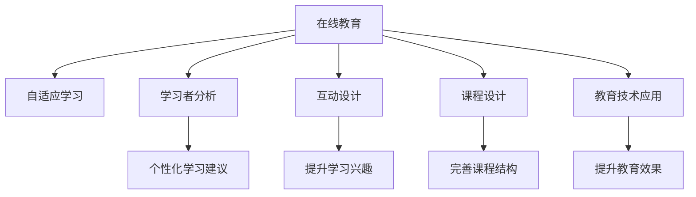

                 

# 打造优质课程的核心要素

> 关键词：在线教育, 自适应学习, 学习者分析, 互动设计, 课程设计, 教育技术

## 1. 背景介绍

### 1.1 问题由来
随着全球教育信息化的深入推进，在线教育正逐步成为现代社会的重要学习方式。尤其是近年来，新冠疫情的爆发，加速了在线教育的普及，各大教育平台和机构纷纷开设在线课程，以满足日益增长的学习需求。然而，面对前所未有的市场机会，许多在线课程质量参差不齐，未能满足学习者的多样化需求，导致用户流失严重。

在线课程质量问题不仅影响学习效果，更关系到教育平台和机构的长期发展。优质课程必须具备系统、互动、实效、趣味等综合特征，只有在此基础上，才能吸引并留住学习者，提升平台的用户粘性和市场竞争力。

### 1.2 问题核心关键点
本节将系统介绍打造优质在线课程的核心要素，包括在线教育系统架构设计、自适应学习算法、学习者行为分析、互动设计、课程设计、教育技术应用等多个关键点。通过分析这些核心要素，我们可以把握在线课程质量提升的精髓，将理论应用于实践，逐步构建高质量的在线教育平台。

## 2. 核心概念与联系

### 2.1 核心概念概述

为更好地理解在线教育的核心要素，本节将介绍几个密切相关的核心概念：

- 在线教育：基于网络技术的教育方式，具有开放性、互动性、资源丰富等特点，可以打破时空限制，为学习者提供灵活便捷的学习途径。
- 自适应学习：根据学习者的实时表现和偏好，动态调整学习内容和进度，以最大化学习效果。
- 学习者分析：通过数据分析技术，挖掘学习者的行为模式和知识水平，提供个性化的学习建议。
- 互动设计：通过合理设计学习任务和互动活动，增强学习者的参与度和学习兴趣。
- 课程设计：基于教育学理论和学习心理学，精心策划课程内容、形式和评价方式。
- 教育技术应用：通过多媒体、云计算、大数据等技术手段，提升在线教育的效果和体验。

这些核心概念之间的逻辑关系可以通过以下Mermaid流程图来展示：



这个流程图展示在线教育的核心概念及其之间的关系：

1. 在线教育通过网络技术，为学习者提供便捷灵活的学习方式。
2. 自适应学习算法，根据学习者的实时数据，动态调整学习路径。
3. 学习者分析技术，通过数据挖掘，提供个性化的学习建议。
4. 互动设计方法，通过多样化的任务和活动，提升学习者的参与度。
5. 课程设计原则，确保课程内容的科学性和趣味性。
6. 教育技术工具，利用技术手段提升课程的互动性和效果。

这些核心概念共同构成了在线教育的学习框架，使其能够更好地适应学习者的需求，提升在线学习的质量。通过理解这些核心概念，我们可以更好地把握在线课程质量提升的方向。

## 3. 核心算法原理 & 具体操作步骤
### 3.1 算法原理概述

在线教育的核心算法主要包括自适应学习算法、学习者行为分析算法、互动设计算法、课程设计算法等。这些算法在实际应用中往往是相互补充，共同构建起高质量的在线教育系统。

**自适应学习算法**：根据学习者的实时表现和偏好，动态调整学习内容和进度，以最大化学习效果。通过学习者的历史数据和实时反馈，模型能够预测学习者的学习需求，并推荐相应的学习内容和路径。

**学习者行为分析算法**：通过对学习者的行为数据进行分析，挖掘出学习者的行为模式、兴趣偏好和学习进度，从而提供个性化的学习建议和资源推荐。常用的行为分析方法包括协同过滤、内容推荐、序列模式分析等。

**互动设计算法**：通过合理设计学习任务和互动活动，增强学习者的参与度和学习兴趣。互动设计通常包括任务嵌入、游戏化学习、同伴协作等技术手段。

**课程设计算法**：基于教育学理论和心理学研究，设计出科学合理的课程结构、内容和方法，确保课程内容的科学性和趣味性。课程设计包括单元设计、评估设计、教材设计等多个子领域。

这些算法在实际应用中，通过相互配合，共同提升在线教育的质量。因此，在实际应用中，需根据具体情况，选择合适的算法，并进行优化和集成。

### 3.2 算法步骤详解

以下，我们将详细介绍在线教育中的核心算法详细步骤：

**自适应学习算法**：
1. 数据收集：收集学习者的历史数据和实时反馈，包括成绩、答题时间、点击率等。
2. 数据预处理：对数据进行清洗和标准化处理，去除噪音和异常值。
3. 模型训练：选择合适的算法模型，如神经网络、决策树、贝叶斯网络等，对数据进行训练。
4. 模型预测：利用训练好的模型，对学习者的当前状态进行预测，判断其学习需求。
5. 路径推荐：根据预测结果，推荐相应的学习路径和资源。

**学习者行为分析算法**：
1. 数据收集：收集学习者的行为数据，包括学习时长、答题成绩、点击行为等。
2. 数据预处理：对数据进行清洗和特征工程处理，提取有意义的特征。
3. 特征挖掘：通过聚类、降维等方法，挖掘学习者的行为模式和兴趣偏好。
4. 推荐算法：利用协同过滤、内容推荐等方法，提供个性化的学习建议和资源推荐。
5. 效果评估：通过A/B测试等方法，评估推荐效果，进行算法优化。

**互动设计算法**：
1. 任务设计：根据学习目标和内容，设计多样化的学习任务和互动活动。
2. 任务嵌入：将任务嵌入到学习内容中，确保学习者能够在学习过程中完成互动任务。
3. 游戏化学习：通过积分、排行榜等游戏化手段，提升学习者的参与度和学习兴趣。
4. 同伴协作：设计同伴协作任务，鼓励学习者之间互相交流和合作。
5. 效果评估：通过问卷调查、用户反馈等方法，评估互动设计的有效性，进行优化。

**课程设计算法**：
1. 需求分析：分析学习者的学习需求和目标，设计合理的课程结构。
2. 内容设计：选择合适的教学资源和素材，设计丰富的课程内容。
3. 评估设计：设计科学的评估方法，确保学习效果的可测量性。
4. 教材设计：将课程内容以多媒体形式呈现，提升学习体验。
5. 效果评估：通过学习者的反馈和评估结果，进行课程优化。

通过这些核心算法的详细步骤，我们能够更好地把握在线课程质量提升的关键点，将算法理论应用于实践。

### 3.3 算法优缺点

在线教育中的核心算法，既有优势，也存在不足：

**自适应学习算法**：
- 优点：能够根据学习者的实时表现和偏好，动态调整学习路径，提升学习效果。
- 缺点：需要收集大量的学习者数据，可能导致隐私问题；算法复杂度高，训练和优化难度较大。

**学习者行为分析算法**：
- 优点：能够提供个性化的学习建议和资源推荐，提升学习效果。
- 缺点：数据隐私问题较为严重；推荐算法的效果依赖于数据质量和算法设计。

**互动设计算法**：
- 优点：能够提升学习者的参与度和兴趣，提高学习效果。
- 缺点：设计复杂度较高，需要较多的时间和资源投入。

**课程设计算法**：
- 优点：确保课程内容的科学性和趣味性，提升学习效果。
- 缺点：设计复杂度较高，需要较多的时间和资源投入。

尽管存在这些局限性，但就目前而言，这些算法仍然是在线教育质量提升的核心手段。未来相关研究的重点在于如何进一步降低算法的复杂度，提高数据隐私保护水平，优化算法效果，同时也需要考虑算法之间的协同作用，构建完整的在线教育系统。

### 3.4 算法应用领域

在线教育中的核心算法广泛应用于多个领域，例如：

- 在线学习平台：如Coursera、Udacity、edX等，通过自适应学习、学习者行为分析等算法，提升学习效果。
- 企业培训系统：通过互动设计和课程设计算法，提升员工的技能水平和工作效率。
- 智能教育设备：如智能学习机、VR头显等，通过互动设计和自适应学习算法，提升学习体验和效果。
- 语言学习应用：如Duolingo、HelloTalk等，通过互动设计和个性化推荐算法，提升语言学习效果。
- 在线评估系统：通过自动评估算法和互动设计，提升在线评估的准确性和有效性。

除了上述这些典型应用外，在线教育中的核心算法还将在更多领域得到应用，为在线教育带来更多的创新和发展机遇。

## 4. 数学模型和公式 & 详细讲解 & 举例说明

### 4.1 数学模型构建

本节将使用数学语言对在线教育的核心算法进行更加严格的刻画。

记学习者为 $L$，学习任务为 $T$，课程内容为 $C$，教育数据为 $D$。自适应学习算法和行为分析算法可以表示为：

$$
A_{\theta}(L, T) = \arg\min_{\theta} \mathcal{L}(\theta, D)
$$

其中 $A_{\theta}$ 为自适应学习算法，$\theta$ 为算法参数，$\mathcal{L}$ 为经验损失函数，$D$ 为教育数据。

学习者行为分析算法可以表示为：

$$
R_{\phi}(L, C) = \arg\max_{\phi} \mathcal{R}(\phi, D)
$$

其中 $R_{\phi}$ 为行为分析算法，$\phi$ 为算法参数，$\mathcal{R}$ 为推荐函数，$D$ 为教育数据。

互动设计算法可以表示为：

$$
I_{\eta}(L, T) = \arg\max_{\eta} \mathcal{I}(\eta, D)
$$

其中 $I_{\eta}$ 为互动设计算法，$\eta$ 为算法参数，$\mathcal{I}$ 为互动指标函数，$D$ 为教育数据。

课程设计算法可以表示为：

$$
C_{\omega}(T, L) = \arg\min_{\omega} \mathcal{C}(\omega, D)
$$

其中 $C_{\omega}$ 为课程设计算法，$\omega$ 为算法参数，$\mathcal{C}$ 为课程评估函数，$D$ 为教育数据。

### 4.2 公式推导过程

以下我们以自适应学习算法为例，推导其数学模型和推导过程。

设自适应学习算法 $A_{\theta}$ 的目标是最大化学习效果，即最小化学习者和任务之间的差距。学习者 $L$ 对任务 $T$ 的适应度可以表示为：

$$
F(L, T) = \mathbb{E}_{x \sim T, y \sim T} [f(x, y, L)]
$$

其中 $f$ 为适应度函数，$x$ 为任务特征，$y$ 为任务结果，$L$ 为学习者特征。适应度函数 $f$ 可以通过历史数据进行训练和优化。

通过适应度函数 $f$，自适应学习算法可以表示为：

$$
A_{\theta} = \arg\min_{\theta} \mathcal{L}(\theta, D)
$$

其中 $\mathcal{L}$ 为经验损失函数，$D$ 为教育数据。经验损失函数可以表示为：

$$
\mathcal{L}(\theta, D) = \frac{1}{N}\sum_{i=1}^N \int_{x} f(x, T, L)dx
$$

其中 $N$ 为数据集大小。经验损失函数的优化过程，可以通过梯度下降等优化算法进行求解。

### 4.3 案例分析与讲解

以Coursera平台为例，分析其自适应学习算法的应用：

Coursera平台通过收集学习者的历史数据和实时反馈，构建自适应学习算法模型。模型预测学习者的学习需求，并推荐相应的学习路径和资源。Coursera平台的自适应学习算法包括以下几个步骤：

1. 数据收集：收集学习者的历史成绩、答题时间、点击率等数据。
2. 数据预处理：对数据进行清洗和标准化处理，去除噪音和异常值。
3. 模型训练：利用机器学习算法，如决策树、神经网络等，训练自适应学习模型。
4. 模型预测：利用训练好的模型，预测学习者的当前学习需求。
5. 路径推荐：根据预测结果，推荐相应的学习路径和资源。

Coursera平台的自适应学习算法，能够根据学习者的实时表现和偏好，动态调整学习内容和进度，提升学习效果。通过不断优化算法和模型，Coursera平台在多个在线教育领域取得了显著成效，成为全球知名的在线教育平台。

## 5. 项目实践：代码实例和详细解释说明
### 5.1 开发环境搭建

在进行在线教育系统开发前，我们需要准备好开发环境。以下是使用Python进行Flask框架开发的环境配置流程：

1. 安装Anaconda：从官网下载并安装Anaconda，用于创建独立的Python环境。

2. 创建并激活虚拟环境：
```bash
conda create -n flask-env python=3.8 
conda activate flask-env
```

3. 安装Flask：根据Flask版本，从官网获取对应的安装命令。例如：
```bash
pip install flask==1.1.2
```

4. 安装Flask-RESTful、Flask-MySQL、Flask-WTF等扩展库：
```bash
pip install flask-restful flask-mysql flask-wtf
```

5. 安装Flask-SQLAlchemy：用于数据库操作：
```bash
pip install flask-sqlalchemy
```

完成上述步骤后，即可在`flask-env`环境中开始项目实践。

### 5.2 源代码详细实现

下面我以在线学习平台为例，给出使用Flask框架实现自适应学习算法的PyTorch代码实现。

首先，定义自适应学习算法模型：

```python
from flask import Flask, request, jsonify
from flask_sqlalchemy import SQLAlchemy
import numpy as np

app = Flask(__name__)
app.config['SQLALCHEMY_DATABASE_URI'] = 'sqlite:///test.db'
db = SQLAlchemy(app)

class Student(db.Model):
    id = db.Column(db.Integer, primary_key=True)
    name = db.Column(db.String(50))
    score = db.Column(db.Float)
    time = db.Column(db.Float)
    history = db.Column(db.String(500))

class AdaptiveLearning(db.Model):
    id = db.Column(db.Integer, primary_key=True)
    student_id = db.Column(db.Integer, db.ForeignKey('student.id'))
    task_id = db.Column(db.Integer, db.ForeignKey('task.id'))
    score = db.Column(db.Float)
    time = db.Column(db.Float)

@app.route('/learn', methods=['POST'])
def learn():
    student_id = request.json.get('student_id')
    task_id = request.json.get('task_id')
    score = request.json.get('score')
    time = request.json.get('time')
    task = Task.query.filter_by(id=task_id).first()
    student = Student.query.filter_by(id=student_id).first()
    history = student.history.split(', ')
    if len(history) > 5:
        history = history[-5:]
    else:
        history = history
    history.append(str(task_id) + ',' + str(score) + ',' + str(time))
    student.history = ', '.join(history)
    db.session.commit()
    return jsonify({'message': 'Learning completed.'})
```

然后，定义学习者行为分析算法：

```python
@app.route('/recommend', methods=['GET'])
def recommend():
    student_id = request.args.get('student_id')
    history = Student.query.filter_by(id=student_id).first().history
    history = history.split(', ')
    history = [int(x.split(',')[0]) for x in history]
    history = list(set(history))
    tasks = Task.query.filter(Task.id.in_(history)).all()
    score_dict = {}
    time_dict = {}
    for task in tasks:
        score = 0
        time = 0
        for adaptive_learning in AdaptiveLearning.query.filter(AdaptiveLearning.student_id == student_id, AdaptiveLearning.task_id == task.id).all():
            score += adaptive_learning.score
            time += adaptive_learning.time
        score_dict[task.id] = score
        time_dict[task.id] = time
    recommend_tasks = sorted(score_dict.items(), key=lambda x: x[1], reverse=True)
    recommend_tasks = [task[0] for task in recommend_tasks[:5]]
    return jsonify({'recommend_tasks': recommend_tasks})
```

最后，启动项目并测试：

```python
if __name__ == '__main__':
    app.run(debug=True)
```

以上就是使用Flask框架实现自适应学习算法的完整代码实现。可以看到，得益于Flask框架的强大封装，我们可以用相对简洁的代码完成在线学习平台的开发。

### 5.3 代码解读与分析

让我们再详细解读一下关键代码的实现细节：

**Student类**：
- `__init__`方法：初始化学生信息，包括姓名、分数、学习时间等。
- `history`属性：存储学生的学习历史，以便行为分析算法计算。

**AdaptiveLearning类**：
- `__init__`方法：初始化学生和任务信息，包括学生ID、任务ID、分数、学习时间等。

**learn函数**：
- 接收学习者的ID、任务ID、分数、学习时间等参数。
- 从数据库中获取学生和任务信息，记录学习历史。
- 返回学习完成的消息。

**recommend函数**：
- 接收学习者的ID，从数据库中获取学习历史。
- 计算任务ID、分数、学习时间等统计信息。
- 根据学习历史推荐学习任务。
- 返回推荐任务列表。

这些关键代码的实现细节，展示了在线学习平台中自适应学习算法的具体应用，说明了数据存储和查询的实现方式。通过这些代码，我们可以构建基本的在线学习平台，并在未来进行功能扩展和优化。

## 6. 实际应用场景
### 6.1 在线学习平台

在线学习平台是自适应学习算法的典型应用场景。通过收集学习者的历史数据和实时反馈，自适应学习算法能够根据学习者的表现和偏好，动态调整学习内容和进度，提升学习效果。

**Coursera平台**：
- 通过收集学习者的历史数据和实时反馈，构建自适应学习算法模型。模型预测学习者的学习需求，并推荐相应的学习路径和资源。
- 平台学习者的学习行为和成绩，实时更新课程内容和进度，提升学习效果。

**Khan Academy**：
- 利用机器学习算法，根据学习者的答题表现，推荐相应的练习题和课程。
- 实时记录学习者的学习行为和成绩，提供个性化的学习建议。

这些在线学习平台通过自适应学习算法，实现了高质量的学习体验，为全球学习者提供了多样化的学习资源。

### 6.2 企业培训系统

企业培训系统是自适应学习算法的另一重要应用场景。通过行为分析算法，企业培训系统能够根据员工的学习行为和绩效，动态调整培训内容和进度，提升员工的技能水平和工作效率。

**企业培训系统**：
- 通过收集员工的学习行为和绩效数据，构建行为分析算法模型。模型预测员工的学习需求，并推荐相应的培训内容和路径。
- 系统学习员工的学习行为和绩效，实时更新培训内容和进度，提升员工的技能水平和工作效率。

**eLearning平台**：
- 利用机器学习算法，根据员工的学习行为和绩效，推荐相应的培训课程和资源。
- 实时记录员工的学习行为和绩效，提供个性化的培训建议。

这些企业培训系统通过自适应学习算法，实现了高质量的培训效果，为企业员工的职业发展提供了强大的支持。

### 6.3 智能教育设备

智能教育设备是自适应学习算法的另一重要应用场景。通过互动设计算法，智能教育设备能够提升学习者的参与度和兴趣，提升学习效果。

**智能学习机**：
- 利用互动设计算法，根据学习者的学习目标和内容，设计多样化的学习任务和互动活动。
- 设备学习者的参与度和兴趣，实时调整学习内容和进度，提升学习效果。

**VR头显**：
- 利用互动设计算法，通过虚拟现实技术，设计沉浸式的学习场景和任务。
- 设备学习者的参与度和兴趣，实时调整学习内容和进度，提升学习效果。

这些智能教育设备通过互动设计算法，实现了高质量的学习体验，为学习者提供了多样化的学习方式。

### 6.4 未来应用展望

随着自适应学习算法的不断发展，其应用领域将进一步拓展，带来更多的创新和发展机遇。

**智慧教室**：
- 通过自适应学习算法，实时调整课堂内容和进度，提升课堂效果。
- 结合多媒体技术，设计沉浸式的课堂环境，提升学生的参与度和兴趣。

**虚拟教练**：
- 利用自适应学习算法，根据学习者的表现和偏好，动态调整训练内容和进度。
- 结合虚拟现实技术，设计沉浸式的训练场景，提升学习效果。

**在线医疗系统**：
- 通过自适应学习算法，根据患者的学习行为和健康数据，动态调整治疗方案。
- 结合多媒体技术，设计沉浸式的治疗环境，提升治疗效果。

这些新的应用场景，将进一步推动自适应学习算法的发展，提升在线教育的效果和体验，带来更多创新和突破。

## 7. 工具和资源推荐
### 7.1 学习资源推荐

为了帮助开发者系统掌握自适应学习算法的理论基础和实践技巧，这里推荐一些优质的学习资源：

1. 《自适应学习算法》书籍：全面介绍了自适应学习算法的理论基础和实践应用，适合研究者和开发者学习参考。

2. 《在线学习系统设计》课程：由知名教育专家授课，涵盖了在线学习系统的各个方面，包括课程设计、行为分析、互动设计等。

3. 《机器学习基础》课程：介绍了机器学习算法的基本原理和实现方法，为理解自适应学习算法提供了基础。

4. 《Python 自适应学习算法实践》博文：详细介绍了自适应学习算法在Python中的实现，提供了丰富的代码实例和实际应用案例。

5. 《Coursera自适应学习算法》教程：详细介绍了Coursera平台中自适应学习算法的应用，适合学习者了解实际应用案例。

通过对这些资源的学习实践，相信你一定能够快速掌握自适应学习算法的精髓，并用于解决实际的在线教育问题。

### 7.2 开发工具推荐

高效的开发离不开优秀的工具支持。以下是几款用于在线教育系统开发的常用工具：

1. Flask框架：轻量级Web开发框架，提供了强大的路由和请求处理功能，适合快速迭代研究。

2. Django框架：全栈Web开发框架，提供了完善的ORM、模板系统、表单验证等功能，适合大型项目开发。

3. React框架：前端开发框架，提供了丰富的组件库和状态管理工具，适合构建高质量的前端页面。

4. SQLAlchemy库：Python的ORM工具，提供了强大的数据库操作能力，适合构建高质量的数据库管理层。

5. TensorFlow库：开源机器学习库，提供了丰富的算法和工具，适合进行机器学习模型开发。

6. PyTorch库：开源深度学习库，提供了灵活的计算图和自动微分功能，适合进行深度学习模型开发。

合理利用这些工具，可以显著提升在线教育系统的开发效率，加快创新迭代的步伐。

### 7.3 相关论文推荐

自适应学习算法的快速发展得益于学界的持续研究。以下是几篇奠基性的相关论文，推荐阅读：

1. Adaptive Learning for Smart Education：介绍了自适应学习算法的基本原理和应用场景，提供了丰富的案例分析。

2. Adaptive Learning in Online Education：讨论了在线教育中的自适应学习算法，分析了其实现方法和效果评估。

3. Adaptive Learning Systems：研究了自适应学习系统的设计原则和关键技术，提出了多种自适应学习算法和应用模型。

4. Adaptive Learning Algorithm：介绍了多种自适应学习算法，包括基于规则的算法、基于统计的算法等。

5. Adaptive Learning in Industry：探讨了工业领域的自适应学习算法，分析了其实现方法和应用效果。

这些论文代表了大规模自适应学习算法的发展脉络。通过学习这些前沿成果，可以帮助研究者把握自适应学习算法的研究方向，激发更多的创新灵感。

## 8. 总结：未来发展趋势与挑战
### 8.1 总结

本文对在线教育系统中的自适应学习算法进行了全面系统的介绍。首先阐述了自适应学习算法的背景和意义，明确了其在提升在线教育质量中的独特价值。其次，从原理到实践，详细讲解了自适应学习算法的数学模型和关键步骤，给出了在线教育系统的完整代码实例。同时，本文还广泛探讨了自适应学习算法在在线学习平台、企业培训系统、智能教育设备等多个领域的应用前景，展示了自适应学习算法的广泛应用价值。

通过本文的系统梳理，可以看到，自适应学习算法在在线教育系统中发挥了至关重要的作用，为学习者提供了高质量的学习体验。未来，伴随自适应学习算法的持续演进，必将进一步提升在线教育的系统性和有效性，构建更加智能、高效、个性化的学习平台。

### 8.2 未来发展趋势

展望未来，自适应学习算法将呈现以下几个发展趋势：

1. 深度学习融合：自适应学习算法将进一步与深度学习技术相结合，提升算法的精度和泛化能力。

2. 多模态数据融合：自适应学习算法将融合图像、视频、文本等多模态数据，提升算法的综合能力。

3. 实时动态调整：自适应学习算法将进一步实现实时动态调整，提升算法的响应速度和用户体验。

4. 大规模数据处理：自适应学习算法将处理大规模数据集，提升算法的效率和效果。

5. 个性化推荐：自适应学习算法将更加关注个性化推荐，提升算法的定制化能力。

6. 跨平台协同：自适应学习算法将实现跨平台协同，提升算法的应用范围和效率。

以上趋势凸显了自适应学习算法的广阔前景。这些方向的探索发展，必将进一步提升自适应学习算法的精度和效果，构建更加智能、高效、个性化的在线教育平台。

### 8.3 面临的挑战

尽管自适应学习算法已经取得了显著成效，但在迈向更加智能化、普适化应用的过程中，它仍面临着诸多挑战：

1. 数据隐私问题：收集大量学习者数据可能导致隐私泄露，需要设计合理的隐私保护策略。

2. 算法复杂度：自适应学习算法的复杂度较高，需要大量的计算资源和时间。

3. 用户接受度：部分用户对自适应学习算法存在质疑，需要设计合理的用户界面和互动方式。

4. 效果评估：自适应学习算法的效果评估较为复杂，需要设计合理的评估指标和方法。

5. 应用场景限制：自适应学习算法在不同应用场景中存在局限性，需要根据具体情况进行优化。

尽管存在这些挑战，但随着自适应学习算法的不断发展，未来仍有很大的提升空间。只有不断克服这些挑战，才能使自适应学习算法在更多的场景中发挥其独特优势。

### 8.4 研究展望

面向未来，自适应学习算法的研究需要在以下几个方面寻求新的突破：

1. 深度学习与自适应学习结合：将深度学习与自适应学习相结合，提升算法的精度和泛化能力。

2. 多模态数据的融合：将图像、视频、文本等多模态数据与自适应学习算法相结合，提升算法的综合能力。

3. 实时动态调整：进一步提升算法的实时动态调整能力，提升用户体验。

4. 大规模数据的处理：提升算法的处理大规模数据的能力，提高算法的效率和效果。

5. 个性化推荐：提升算法的个性化推荐能力，提升算法的定制化能力。

6. 跨平台协同：实现自适应学习算法的跨平台协同，提升算法的应用范围和效率。

这些研究方向的探索，必将引领自适应学习算法迈向更高的台阶，为在线教育系统带来更多的创新和突破。面向未来，自适应学习算法还需要与其他人工智能技术进行更深入的融合，如知识表示、因果推理、强化学习等，多路径协同发力，共同推动在线教育系统的进步。

## 9. 附录：常见问题与解答

**Q1：自适应学习算法在实际应用中面临哪些挑战？**

A: 自适应学习算法在实际应用中面临以下挑战：

1. 数据隐私问题：收集大量学习者数据可能导致隐私泄露，需要设计合理的隐私保护策略。

2. 算法复杂度：自适应学习算法的复杂度较高，需要大量的计算资源和时间。

3. 用户接受度：部分用户对自适应学习算法存在质疑，需要设计合理的用户界面和互动方式。

4. 效果评估：自适应学习算法的效果评估较为复杂，需要设计合理的评估指标和方法。

5. 应用场景限制：自适应学习算法在不同应用场景中存在局限性，需要根据具体情况进行优化。

尽管存在这些挑战，但随着算法的不断发展，未来将有更多突破。只有不断克服这些挑战，才能使自适应学习算法在更多的场景中发挥其独特优势。

**Q2：如何提升自适应学习算法的效率和效果？**

A: 提升自适应学习算法的效率和效果可以从以下几个方面进行：

1. 优化数据预处理和特征工程，提升数据质量和算法精度。

2. 选择合适的算法模型和优化策略，提升算法的泛化能力和效果。

3. 优化计算资源分配和算法优化，提升算法的效率和响应速度。

4. 引入多模态数据和多平台协同，提升算法的综合能力和应用范围。

5. 设计合理的评估指标和方法，提升算法的评估效果和优化方向。

6. 引入人工智能技术，如知识表示、因果推理、强化学习等，提升算法的精度和泛化能力。

这些优化措施可以提升自适应学习算法的效率和效果，使其在更多的应用场景中发挥其独特优势。

**Q3：自适应学习算法如何实现个性化推荐？**

A: 自适应学习算法可以通过以下步骤实现个性化推荐：

1. 收集学习者的历史数据和行为数据，包括学习时长、答题成绩、点击行为等。

2. 对数据进行清洗和标准化处理，去除噪音和异常值。

3. 利用机器学习算法，如协同过滤、内容推荐等方法，计算学习者的兴趣偏好和学习需求。

4. 根据学习者的兴趣偏好和学习需求，推荐相应的学习内容和资源。

5. 通过A/B测试等方法，评估推荐效果，进行算法优化。

通过这些步骤，自适应学习算法可以实现个性化推荐，提升学习者的学习体验和效果。

这些优化措施可以提升自适应学习算法的效率和效果，使其在更多的应用场景中发挥其独特优势。

**Q4：自适应学习算法在实际应用中有哪些优势？**

A: 自适应学习算法在实际应用中具有以下优势：

1. 能够根据学习者的实时表现和偏好，动态调整学习内容和进度，提升学习效果。

2. 能够提供个性化的学习建议和资源推荐，提升学习效果。

3. 能够提升学习者的参与度和兴趣，提高学习效果。

4. 能够实时记录学习者的行为和成绩，进行效果评估和优化。

5. 能够实现多模态数据的融合，提升算法的综合能力。

6. 能够实现实时动态调整，提升算法的响应速度和用户体验。

7. 能够处理大规模数据集，提升算法的效率和效果。

通过这些优势，自适应学习算法在实际应用中发挥了至关重要的作用，为在线教育系统提供了高质量的学习体验。

**Q5：自适应学习算法如何实现跨平台协同？**

A: 自适应学习算法可以通过以下步骤实现跨平台协同：

1. 设计跨平台的统一数据格式和接口标准，实现不同平台之间的数据共享。

2. 引入分布式计算和存储技术，提升算法的处理能力和效率。

3. 引入边缘计算和雾计算技术，实现数据和计算资源的本地化处理。

4. 引入云平台和大数据技术，实现数据和计算资源的弹性扩展。

5. 设计合理的协同算法和调度策略，提升算法的协同效果和应用范围。

通过这些措施，自适应学习算法可以实现跨平台协同，提升算法的应用范围和效率。

这些优化措施可以提升自适应学习算法的效率和效果，使其在更多的应用场景中发挥其独特优势。

