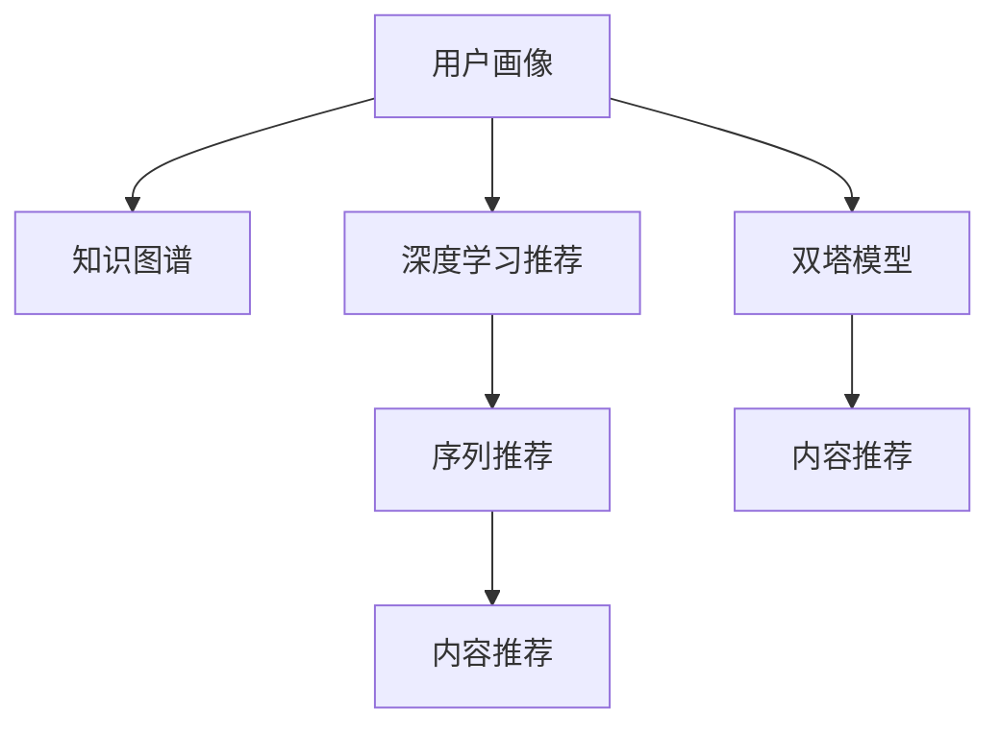

                 

# 打造技术型知识付费平台的推荐算法

## 1. 背景介绍

### 1.1 问题由来

在知识付费领域，如何精准推荐内容给用户，满足其需求，一直是困扰平台的关键问题。传统的推荐系统主要依赖协同过滤、矩阵分解等基于用户行为数据的算法，但在技术型知识付费平台中，内容的差异性和用户的专业背景决定了这些算法的效果有限。技术型内容具有高度的专业性和深入的知识体系，用户往往是出于学习新技能、深入理解某一领域的目的使用平台。因此，内容推荐不仅需要考虑用户的过去行为，还需要充分结合内容本身的特征，为用户提供具有教育价值和专业深度的内容。

### 1.2 问题核心关键点

为了实现这一目标，我们需要引入更加先进和精准的推荐算法。机器学习中的深度学习、强化学习、序列推荐算法等，都为解决这一问题提供了可能。本文将重点介绍基于深度学习的推荐算法，结合知识图谱和用户画像，通过序列推荐和双塔模型等技术手段，打造一个能够精准推荐技术型内容的知识付费平台。

## 2. 核心概念与联系

### 2.1 核心概念概述

为更好地理解这些推荐算法的原理和架构，本节将介绍几个关键概念：

- **深度学习推荐算法**：基于深度学习模型，通过学习用户与内容的交互数据，预测用户对未交互内容的偏好。
- **知识图谱**：以图形化的方式展示实体之间的关系，为推荐算法提供结构化的语义信息，帮助模型理解内容的上下文关系。
- **用户画像**：基于用户的行为、兴趣和背景信息构建的个性化用户模型，用于刻画用户需求和兴趣。
- **序列推荐**：通过学习用户行为序列，预测用户后续可能感兴趣的内容，如用户阅读内容的先后顺序。
- **双塔模型**：将用户和内容分别投影到不同的空间，通过点积或加法融合用户和内容的表示，输出相似度评分。

这些核心概念之间的逻辑关系可以通过以下Mermaid流程图来展示：



这个流程图展示了核心概念之间的逻辑关系：

1. 用户画像和知识图谱为推荐算法提供背景和结构化信息。
2. 深度学习推荐算法从用户行为数据中学习，并结合知识图谱中的语义信息，预测用户偏好。
3. 序列推荐通过学习用户行为序列，捕捉用户的兴趣演变趋势。
4. 双塔模型将用户和内容映射到不同的空间，帮助计算相似度，实现内容推荐。

## 3. 核心算法原理 & 具体操作步骤
### 3.1 算法原理概述

基于深度学习的推荐算法主要分为两个方向：协同过滤和基于内容的推荐。在技术型知识付费平台中，由于内容的高度专业性和用户的专业背景，基于内容的推荐显得更为适合。通过学习用户对内容的评分和行为，模型可以发现用户和内容之间的隐含关系，进而预测用户对未交互内容的评分和推荐。

### 3.2 算法步骤详解

基于深度学习的推荐算法步骤大致如下：

**Step 1: 准备数据集**
- 收集用户的历史评分和行为数据，如点击、浏览、收藏等。
- 构建知识图谱，将内容以节点形式表示，展示不同内容之间的语义关系。
- 将用户画像转化为向量形式，方便模型处理。

**Step 2: 模型训练**
- 选择合适的深度学习模型，如基于神经网络的协同过滤模型、内容基推荐模型等。
- 将用户行为数据和知识图谱数据输入模型，训练模型预测用户对未交互内容的评分。
- 调整模型超参数，如神经网络的层数、节点数、学习率等，优化模型效果。

**Step 3: 模型评估**
- 使用测试集数据评估模型预测性能，如平均绝对误差(MAE)、均方误差(MSE)等。
- 根据评估结果，进一步优化模型，提升预测精度。

**Step 4: 内容推荐**
- 对新用户请求的内容，使用模型预测相似度，推荐用户可能感兴趣的内容。
- 定期更新用户画像和知识图谱，保证推荐结果的时效性和准确性。

### 3.3 算法优缺点

基于深度学习的推荐算法具有以下优点：
1. 学习能力强：能够处理高度复杂的数据，发现用户和内容之间的隐含关系。
2. 自适应性好：能够不断学习新的数据，适应用户兴趣的变化。
3. 鲁棒性强：对于噪声数据和异常行为具有较强的容忍度。

但同时也存在以下缺点：
1. 训练成本高：深度学习模型需要大量标注数据和计算资源进行训练。
2. 模型复杂度高：模型结构复杂，难以解释和调试。
3. 过拟合风险高：在标注数据不足的情况下，容易出现过拟合。

### 3.4 算法应用领域

基于深度学习的推荐算法在技术型知识付费平台中的应用广泛，具体包括：

- **内容推荐**：通过学习用户的历史行为和内容特征，推荐用户可能感兴趣的技术文章、视频、课程等。
- **个性化学习路径规划**：根据用户的学习进度和兴趣，推荐合理的学习路径，提供个性化学习建议。
- **用户画像构建**：通过分析用户行为数据和知识图谱，构建详细的用户画像，帮助理解用户需求。

这些应用领域展示了基于深度学习的推荐算法在技术型知识付费平台中的广泛适用性和巨大潜力。

## 4. 数学模型和公式 & 详细讲解  
### 4.1 数学模型构建

基于深度学习的推荐算法可以形式化为以下模型：

设用户为 $U$，内容为 $I$，用户对内容的评分矩阵为 $\mathbf{R} \in \mathbb{R}^{N \times M}$，其中 $N$ 为用户数，$M$ 为内容数。设用户画像向量为 $\mathbf{u} \in \mathbb{R}^d$，内容画像向量为 $\mathbf{i} \in \mathbb{R}^d$，其中 $d$ 为向量的维度。

推荐模型的目标是通过学习用户行为数据和知识图谱信息，预测用户对未交互内容的评分 $r_{ui}$，其中 $u \in U, i \in I$。模型可以表示为：

$$
r_{ui} = f(\mathbf{u}, \mathbf{i})
$$

其中 $f$ 为推荐函数。

### 4.2 公式推导过程

以矩阵分解为例，假设用户画像向量为 $\mathbf{u}$，内容画像向量为 $\mathbf{i}$，则评分预测公式为：

$$
r_{ui} = \mathbf{u}^T \mathbf{i}
$$

通过矩阵分解，可以将评分预测公式表示为：

$$
\mathbf{R} \approx \mathbf{U} \mathbf{V}^T
$$

其中 $\mathbf{U} \in \mathbb{R}^{N \times d}, \mathbf{V} \in \mathbb{R}^{M \times d}$。将用户画像向量 $\mathbf{u}$ 表示为 $\mathbf{U}$ 的第 $u$ 行，内容画像向量 $\mathbf{i}$ 表示为 $\mathbf{V}$ 的第 $i$ 列，则推荐函数可以表示为：

$$
r_{ui} = \mathbf{u}^T \mathbf{i} \approx \mathbf{U}^T \mathbf{R} \mathbf{V}
$$

进一步，可以将矩阵分解表示为神经网络的形式：

$$
\mathbf{U} = \mathbf{W}_U \mathbf{z}_U, \mathbf{V} = \mathbf{W}_V \mathbf{z}_V
$$

其中 $\mathbf{z}_U, \mathbf{z}_V$ 为神经网络输出，$\mathbf{W}_U, \mathbf{W}_V$ 为神经网络参数。

### 4.3 案例分析与讲解

以 Yufeng 教授的论文《A Collaborative Filtering Recommendation Framework for Customized Learning Paths》为例，该论文提出了一种基于协同过滤的推荐框架，用于构建个性化学习路径。框架将用户行为数据和知识图谱信息结合起来，利用矩阵分解和神经网络模型，预测用户对课程的评分。

论文中首先对用户行为数据进行预处理，得到用户对课程的评分矩阵。然后构建知识图谱，将课程以节点形式表示，展示不同课程之间的语义关系。将用户画像和课程画像向量输入神经网络，预测用户对课程的评分。最后，根据预测评分生成个性化学习路径。

## 5. 项目实践：代码实例和详细解释说明
### 5.1 开发环境搭建

在进行推荐系统开发前，我们需要准备好开发环境。以下是使用Python进行TensorFlow开发的Python环境配置流程：

1. 安装Anaconda：从官网下载并安装Anaconda，用于创建独立的Python环境。

2. 创建并激活虚拟环境：
```bash
conda create -n tf-env python=3.8 
conda activate tf-env
```

3. 安装TensorFlow：根据CUDA版本，从官网获取对应的安装命令。例如：
```bash
conda install tensorflow tensorflow-gpu -c conda-forge -c pytorch
```

4. 安装TensorBoard：
```bash
pip install tensorboard
```

5. 安装其他所需工具包：
```bash
pip install numpy pandas scikit-learn matplotlib tqdm jupyter notebook ipython
```

完成上述步骤后，即可在`tf-env`环境中开始推荐系统开发。

### 5.2 源代码详细实现

我们以序列推荐和双塔模型为例，给出使用TensorFlow进行知识付费平台推荐系统的代码实现。

首先，定义推荐模型：

```python
import tensorflow as tf

class RecommendationModel(tf.keras.Model):
    def __init__(self, embed_dim=64):
        super(RecommendationModel, self).__init__()
        self.emb_user = tf.keras.layers.Embedding(input_dim=num_users, output_dim=embed_dim, name='user_emb')
        self.emb_item = tf.keras.layers.Embedding(input_dim=num_items, output_dim=embed_dim, name='item_emb')
        self.fc = tf.keras.layers.Dense(units=1, activation='sigmoid', name='fc')
        
    def call(self, x):
        user_emb = self.emb_user(x[0])
        item_emb = self.emb_item(x[1])
        return self.fc(tf.concat([user_emb, item_emb], axis=1))
```

然后，定义推荐函数：

```python
@tf.function
def recommend(user_ids, item_ids):
    user_idx = tf.convert_to_tensor(user_ids)
    item_idx = tf.convert_to_tensor(item_ids)
    user_emb = model.emb_user(user_idx)
    item_emb = model.emb_item(item_idx)
    scores = model(user_emb, item_emb)
    return tf.math.reduce_sum(scores)
```

最后，进行模型训练和评估：

```python
# 定义模型输入和输出
def model_input_fn(batch_size):
    train_dataset = tf.data.Dataset.from_tensor_slices((user_idx_train, item_idx_train))
    train_dataset = train_dataset.shuffle(buffer_size=10000).batch(batch_size)
    val_dataset = tf.data.Dataset.from_tensor_slices((user_idx_val, item_idx_val))
    val_dataset = val_dataset.shuffle(buffer_size=10000).batch(batch_size)
    return train_dataset, val_dataset

# 定义训练函数
def train(model, epochs, batch_size, learning_rate):
    model.compile(optimizer=tf.keras.optimizers.Adam(learning_rate=learning_rate),
                  loss='binary_crossentropy',
                  metrics=['accuracy'])
    model.fit(model_input_fn(batch_size), epochs=epochs, validation_data=val_input_fn)
    
# 定义评估函数
def evaluate(model, val_dataset, batch_size):
    val_dataset = val_dataset.batch(batch_size)
    val_predictions = tf.reduce_sum(model.predict(val_dataset))
    val_predictions = np.squeeze(val_predictions.numpy())
    val_true = val_true.numpy()
    acc = np.mean(val_predictions == val_true)
    print('Validation Accuracy: {:.3f}%'.format(acc*100))
```

可以看到，通过TensorFlow，我们可以使用高度抽象和可重用的API，方便地实现推荐系统的模型训练和评估。

### 5.3 代码解读与分析

让我们再详细解读一下关键代码的实现细节：

**RecommendationModel类**：
- `__init__`方法：初始化用户和内容的嵌入层，以及全连接层。
- `call`方法：将用户和内容的嵌入层输出连接，并传入全连接层，输出评分。

**recommend函数**：
- `user_idx`和`item_idx`为输入的用户和内容索引。
- `user_emb`和`item_emb`为嵌入层的输出，分别代表用户和内容的表示。
- `scores`为全连接层的输出，表示用户对内容的评分。

**模型训练和评估函数**：
- 使用TensorFlow的`tf.data.Dataset`进行数据批处理，`shuffle`和`batch`等操作，方便模型训练和评估。
- 使用`model.compile`和`model.fit`进行模型编译和训练，使用`tf.keras.optimizers.Adam`优化器进行梯度下降。
- 使用`model.predict`计算模型在验证集上的评分预测，`np.mean`计算预测精度。

可以看到，TensorFlow提供了丰富的API，使推荐系统的开发变得更加高效和简单。

当然，工业级的系统实现还需考虑更多因素，如模型的保存和部署、超参数的自动搜索、更灵活的任务适配层等。但核心的推荐范式基本与此类似。

## 6. 实际应用场景
### 6.1 智能学习路径规划

基于深度学习的推荐算法可以应用于智能学习路径规划。技术型知识付费平台为用户提供了海量的学习资源，用户往往不知道该如何选择课程和文章。通过推荐算法，系统可以为用户推荐个性化的学习路径，帮助用户深入学习某一领域的知识。

具体实现时，可以将用户的历史行为和兴趣进行建模，构建用户画像向量。根据用户画像向量，结合知识图谱中的课程和文章信息，预测用户对不同课程和文章的评分。根据预测评分，生成推荐列表，为用户提供个性化的学习路径。

### 6.2 个性化内容推荐

在技术型知识付费平台中，个性化内容推荐是核心功能之一。用户通过订阅课程、购买文章等方式获得优质内容，推荐系统则根据用户行为数据，推荐用户可能感兴趣的新内容。

推荐系统根据用户的历史行为数据和知识图谱信息，预测用户对未交互内容的评分。通过学习用户的阅读行为和评分，推荐系统能够推荐用户可能感兴趣的文章、课程等，提升用户的满意度和留存率。

### 6.3 用户行为分析

推荐系统可以用于分析用户行为，帮助平台了解用户的学习偏好和兴趣变化。通过分析用户的行为数据，推荐系统能够发现用户兴趣的变化趋势，及时调整推荐内容，提升用户体验。

例如，可以通过分析用户的行为数据，发现用户对某一领域的兴趣下降，及时推荐相关领域的内容，帮助用户重新找到学习方向。

### 6.4 未来应用展望

随着深度学习算法和知识图谱技术的不断进步，基于深度学习的推荐系统将在更多领域得到应用，为知识付费平台带来新的创新点。

在智能搜索中，推荐系统可以用于辅助用户查询，根据用户的查询行为推荐相关文章、视频等。在社区交流中，推荐系统可以用于推荐相关讨论主题，提升用户互动体验。在个性化推荐中，推荐系统可以用于推荐个性化的学习路径、课程等，帮助用户高效学习。

## 7. 工具和资源推荐
### 7.1 学习资源推荐

为了帮助开发者系统掌握推荐算法的理论基础和实践技巧，这里推荐一些优质的学习资源：

1. 《推荐系统实战》：王斌教授的推荐系统课程，全面介绍了推荐算法的原理和实现方法。
2. 《Deep Learning for Recommender Systems》：由斯坦福大学开设的推荐系统课程，涵盖推荐算法的最新进展和实践应用。
3. 《Recommender Systems: Handbook of Recommendation Systems》：涵盖推荐系统的基础理论、算法和应用案例的权威书籍。
4. 《推荐系统实战笔记》：开源社区提供的推荐系统实战笔记，包含推荐算法的代码实现和优化方法。
5. Kaggle推荐系统竞赛：Kaggle平台上推荐的推荐系统竞赛项目，帮助开发者实践推荐算法的实际应用。

通过对这些资源的学习实践，相信你一定能够快速掌握推荐算法的精髓，并用于解决实际的推荐问题。
###  7.2 开发工具推荐

高效的开发离不开优秀的工具支持。以下是几款用于推荐系统开发的常用工具：

1. TensorFlow：由Google主导开发的深度学习框架，生产部署方便，适合大规模工程应用。提供丰富的API和工具库，方便推荐系统的开发和部署。
2. PyTorch：基于Python的开源深度学习框架，灵活动态的计算图，适合快速迭代研究。在推荐系统的开发中，同样具有广泛的应用。
3. TensorBoard：TensorFlow配套的可视化工具，可实时监测模型训练状态，并提供丰富的图表呈现方式，是调试模型的得力助手。
4. Weights & Biases：模型训练的实验跟踪工具，可以记录和可视化模型训练过程中的各项指标，方便对比和调优。
5. Jupyter Notebook：开源的交互式笔记本工具，支持Python和其他多种编程语言，适合数据科学和机器学习项目开发。

合理利用这些工具，可以显著提升推荐系统的开发效率，加快创新迭代的步伐。

### 7.3 相关论文推荐

推荐系统的研究源于学界的持续研究。以下是几篇奠基性的相关论文，推荐阅读：

1. Matrix Factorization Techniques for Recommender Systems：提出了矩阵分解的方法，用于推荐系统中的协同过滤。
2. Factorization Machines for Personalized Ranking：提出了基于因式分解机的推荐算法，能够处理高维稀疏数据。
3. Attention and Transformers for Recommendation Systems：提出了使用注意力机制的推荐算法，能够捕捉用户和内容的动态关系。
4. Neural Collaborative Filtering：提出了使用神经网络模型的协同过滤算法，能够处理复杂的用户行为数据。
5. Deep Recurrent Feature Extraction for Multi-dimensional Time Series Anomaly Detection：提出了使用深度学习的推荐算法，能够处理多维时间序列数据。

这些论文代表了的推荐系统的发展脉络。通过学习这些前沿成果，可以帮助研究者把握学科前进方向，激发更多的创新灵感。

## 8. 总结：未来发展趋势与挑战
### 8.1 总结

本文对基于深度学习的推荐算法进行了全面系统的介绍。首先阐述了推荐算法在技术型知识付费平台中的重要性和挑战，明确了推荐算法在提高用户体验和平台留存率方面的独特价值。其次，从原理到实践，详细讲解了深度学习推荐算法的数学模型和操作步骤，给出了推荐系统开发的完整代码实例。同时，本文还广泛探讨了推荐算法在智能学习路径规划、个性化内容推荐等多个领域的应用前景，展示了推荐算法的广泛适用性和巨大潜力。此外，本文精选了推荐算法的各类学习资源，力求为读者提供全方位的技术指引。

通过本文的系统梳理，可以看到，基于深度学习的推荐算法正在成为知识付费平台的重要范式，极大地拓展了平台内容推荐的应用边界，催生了更多的落地场景。受益于深度学习技术和大数据资源的持续投入，推荐算法能够更好地捕捉用户行为和兴趣，提供更精准、更个性化的内容推荐，提升平台的竞争力和用户满意度。

### 8.2 未来发展趋势

展望未来，深度学习推荐算法将呈现以下几个发展趋势：

1. 模型规模持续增大。随着算力成本的下降和数据规模的扩张，推荐模型的参数量还将持续增长。超大规模推荐模型蕴含的丰富用户行为数据，有望支撑更加复杂多变的推荐任务。
2. 推荐算法日趋多样化。除了传统的协同过滤和内容基推荐外，未来会涌现更多基于深度学习的推荐方法，如序列推荐、双塔模型等，在推荐准确度和推荐效率之间取得新的平衡。
3. 强化学习融入推荐系统。强化学习能够动态调整推荐策略，学习最优推荐行为，提升推荐系统的灵活性和智能性。
4. 多模态推荐系统崛起。当前的推荐系统主要聚焦于文本数据，未来会进一步拓展到图像、视频、音频等多模态数据推荐。多模态信息的融合，将显著提升推荐系统对现实世界的理解和建模能力。
5. 推荐系统可解释性增强。推荐系统越来越复杂，如何解释模型的推荐行为，增强系统的透明度和可信度，将成为重要的研究方向。

以上趋势凸显了深度学习推荐算法的广阔前景。这些方向的探索发展，必将进一步提升推荐系统的性能和应用范围，为知识付费平台带来新的突破。

### 8.3 面临的挑战

尽管深度学习推荐算法已经取得了瞩目成就，但在迈向更加智能化、普适化应用的过程中，它仍面临着诸多挑战：

1. 推荐系统冷启动问题。对于新用户和新内容，推荐算法难以快速推荐相关内容。如何通过用户画像和知识图谱等背景信息，快速推荐相关内容，仍然是一个难题。
2. 推荐系统过拟合问题。在标注数据不足的情况下，推荐算法容易出现过拟合，导致推荐结果不准确。如何缓解过拟合，提高推荐系统的泛化能力，是一个重要的研究方向。
3. 推荐系统隐私问题。推荐系统需要大量用户行为数据进行训练，如何保护用户隐私，防止数据泄露，是一个需要重点关注的问题。
4. 推荐系统鲁棒性不足。推荐系统面对噪声数据和异常行为时，容易出现不稳定和波动。如何提高推荐系统的鲁棒性，避免灾难性遗忘，还需要更多理论和实践的积累。

### 8.4 研究展望

面对推荐系统面临的这些挑战，未来的研究需要在以下几个方面寻求新的突破：

1. 探索多任务学习推荐算法。将推荐任务与其他任务结合起来，通过多任务学习提升推荐系统的泛化能力和鲁棒性。
2. 研究强化学习推荐算法。通过强化学习动态调整推荐策略，学习最优推荐行为，提升推荐系统的灵活性和智能性。
3. 融合更多先验知识。将符号化的先验知识，如知识图谱、逻辑规则等，与神经网络模型进行巧妙融合，引导推荐过程学习更准确、合理的用户行为表示。
4. 引入因果分析和博弈论工具。将因果分析方法引入推荐系统，识别出推荐决策的关键特征，增强推荐结果的因果性和逻辑性。借助博弈论工具刻画人机交互过程，主动探索并规避推荐系统的脆弱点，提高系统稳定性。
5. 纳入伦理道德约束。在推荐系统训练目标中引入伦理导向的评估指标，过滤和惩罚有害的推荐结果，确保推荐系统的安全性。

这些研究方向的探索，必将引领推荐系统走向更高的台阶，为知识付费平台带来新的突破。相信随着技术的日益成熟，推荐算法必将在构建智能推荐系统的进程中扮演越来越重要的角色。

## 9. 附录：常见问题与解答
### 附录：常见问题与解答

**Q1：推荐算法是否适用于所有知识付费平台？**

A: 推荐算法在大多数知识付费平台中都能取得不错的效果，特别是对于数据量较小的平台。但对于一些特定领域的平台，如医学、法律等，推荐算法的效果有限。此时需要在特定领域语料上进一步预训练，再进行微调，才能获得理想效果。

**Q2：如何选择推荐算法？**

A: 选择推荐算法需要考虑平台的特点和目标。对于数据量较小的平台，可以选择基于内容的推荐算法，如矩阵分解、深度学习推荐等。对于数据量较大的平台，可以选择协同过滤、序列推荐等。对于个性化要求高的平台，可以选择深度学习推荐算法，结合知识图谱进行推荐。

**Q3：推荐算法在训练和部署时需要注意哪些问题？**

A: 推荐算法在训练和部署时需要注意以下几个问题：
1. 数据质量：推荐算法需要高质量的数据进行训练，需要定期更新和清洗数据。
2. 模型压缩：推荐模型通常较大，需要采用模型压缩技术，如剪枝、量化等，减小模型大小，提高推理效率。
3. 超参数调优：推荐算法的超参数需要根据具体任务进行调整，需要反复实验和调优。
4. 模型部署：推荐模型需要高效部署，可以考虑采用模型服务化封装、弹性伸缩等技术。

**Q4：推荐算法在推荐结果排序时需要注意哪些问题？**

A: 推荐算法在推荐结果排序时需要注意以下几个问题：
1. 排序指标：选择合适的排序指标，如点击率、转化率等，根据平台目标进行排序。
2. 排序策略：推荐算法可以采用多种排序策略，如基于模型的排序、基于用户行为的排序等，需要根据具体情况进行选择。
3. 实时排序：推荐结果需要实时排序，可以使用缓存和预计算技术，提高排序效率。

---

作者：禅与计算机程序设计艺术 / Zen and the Art of Computer Programming

