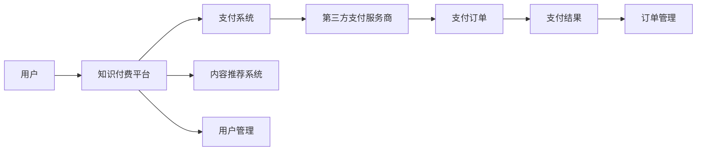

                 

# 打造技术型知识付费平台的支付系统

> 关键词：支付系统, 知识付费, 技术型平台, 安全性, 支付安全, 用户体验, 接口设计

## 1. 背景介绍

在数字经济飞速发展的今天，知识付费已成为一种新兴的商业模式。技术型知识付费平台通过提供高质量的课程、讲座、电子书等内容，帮助用户快速获取专业知识，提升职业技能，并以此实现变现。然而，作为平台核心功能之一，支付系统不仅是完成交易的工具，也是平台商业模式的基石。一个稳定、安全、友好的支付系统，不仅能增强用户的信任，提升平台竞争力，还能促进内容创作和用户粘性。本文将围绕支付系统的主要技术点，系统阐述其在知识付费平台中的应用。

## 2. 核心概念与联系

### 2.1 核心概念概述

支付系统(Payment System)，是知识付费平台的核心功能模块之一。它负责接收用户支付请求，处理交易并更新订单状态，以及与第三方支付服务商对接，确保支付操作的安全性。

- **知识付费平台(Knowledge-Based Platform)**：基于互联网，提供课程、讲座、电子书等内容，用户通过支付获取知识产权的在线平台。
- **第三方支付服务商(Third-Party Payment Provider)**：如支付宝、微信支付等，为用户提供便捷、安全的在线支付服务。
- **订单管理(Order Management)**：平台内部的订单管理模块，负责接收订单信息，更新订单状态，处理退款等操作。

支付系统与知识付费平台的联系紧密。通过与第三方支付服务商对接，平台可以确保交易的稳定性和安全性；通过订单管理模块，平台能够追踪和处理交易流程，提升用户体验；而整个支付系统则构成了平台商业模式的基础，承载着平台营收的绝大部分。

### 2.2 核心概念原理和架构的 Mermaid 流程图



- **A（用户）**：平台的最终用户，通过支付系统获取内容。
- **B（知识付费平台）**：提供内容服务，用户通过平台访问知识付费资源。
- **C（支付系统）**：负责支付操作，包括交易处理、订单更新、支付结果反馈等。
- **D（内容推荐系统）**：根据用户兴趣和行为，推荐相关内容，提升用户体验。
- **E（用户管理）**：负责用户注册、登录、管理等操作，保障平台稳定运行。
- **F（第三方支付服务商）**：提供便捷、安全的支付服务，如支付宝、微信支付等。
- **G（支付订单）**：平台内部生成的支付订单，包含订单信息、支付结果等。
- **H（支付结果）**：支付操作完成后，支付服务商返回的支付结果，如支付成功、失败等。
- **I（订单管理）**：平台内部订单管理模块，负责更新订单状态、处理退款等操作。

## 3. 核心算法原理 & 具体操作步骤

### 3.1 算法原理概述

支付系统的主要算法原理包括支付流程设计、订单状态管理、异常处理等。

1. **支付流程设计**：支付系统需要设计简洁、友好的支付界面，帮助用户快速完成支付操作。
2. **订单状态管理**：通过管理订单状态，确保交易流程的顺畅进行，如未支付、已支付、已退款等状态。
3. **异常处理**：针对支付过程中的异常情况，如支付失败、超时等情况，设计相应的处理机制。

### 3.2 算法步骤详解

#### 3.2.1 支付流程设计

支付流程设计包括以下几个关键步骤：

1. **选择支付渠道**：用户在支付界面选择支付方式，如微信支付、支付宝等。
2. **填写支付信息**：用户输入支付金额、支付方式、订单号等支付信息。
3. **跳转到第三方支付页面**：平台将用户信息发送到第三方支付服务商，生成支付订单。
4. **支付确认**：用户确认支付信息无误后，完成支付操作。
5. **支付结果返回**：第三方支付服务商返回支付结果，平台更新订单状态。

#### 3.2.2 订单状态管理

订单状态管理涉及订单的创建、更新、删除等操作，需考虑以下因素：

1. **订单创建**：用户在平台上购买课程或商品时，创建支付订单。
2. **订单更新**：支付完成后，平台更新订单状态为已支付。
3. **订单退款**：用户申请退款时，平台处理退款请求，更新订单状态为已退款。
4. **订单取消**：用户取消支付时，平台取消支付订单，更新订单状态为已取消。

#### 3.2.3 异常处理

异常处理包括支付失败、超时等情况，需设计相应的处理机制：

1. **支付失败**：支付过程中，如果第三方支付服务商返回支付失败信息，平台记录日志，并通知用户支付失败。
2. **支付超时**：支付过程中，如果支付超过预定时间未完成，平台自动取消支付订单。
3. **支付中断**：支付过程中，如果用户中断支付操作，平台记录日志，并提示用户重新支付。

### 3.3 算法优缺点

#### 3.3.1 优点

1. **便捷性**：用户无需离开平台即可完成支付操作，流程简单快捷。
2. **安全性**：通过第三方支付服务商，确保支付操作的稳定性和安全性。
3. **灵活性**：支持多种支付方式，满足不同用户的需求。
4. **可靠性**：订单状态管理确保交易流程顺畅进行，减少用户纠纷。

#### 3.3.2 缺点

1. **依赖第三方服务商**：支付系统的稳定性和安全性高度依赖第三方服务商。
2. **开发成本高**：支付系统需考虑多个支付渠道的兼容性，开发成本较高。
3. **维护复杂**：支付系统的异常处理需及时响应，维护成本较高。

### 3.4 算法应用领域

支付系统主要应用于知识付费平台、在线教育、电商等场景，支持用户完成交易，提升用户体验。

## 4. 数学模型和公式 & 详细讲解 & 举例说明

### 4.1 数学模型构建

支付系统的数学模型可以基于支付订单的状态机设计。订单状态包括未支付、已支付、已退款、已取消等状态。

#### 4.1.1 状态转换矩阵

支付订单的状态转换矩阵 $A$ 定义为：

$$
A = \begin{bmatrix}
0 & 1 & 0 & 0 \\
0 & 0 & 0 & 1 \\
0 & 0 & 1 & 0 \\
0 & 0 & 0 & 1 \\
\end{bmatrix}
$$

其中，$0$ 表示状态不变，$1$ 表示状态转换。

#### 4.1.2 初始状态

初始状态 $s_0$ 为未支付状态，定义为：

$$
s_0 = \begin{bmatrix}
1 \\
0 \\
0 \\
0 \\
\end{bmatrix}
$$

#### 4.1.3 状态转移公式

状态转移公式 $s_{t+1} = As_t$，其中 $s_t$ 表示当前状态，$s_{t+1}$ 表示下一个状态。

### 4.2 公式推导过程

支付订单的状态转移矩阵 $A$ 为：

$$
A = \begin{bmatrix}
0 & 1 & 0 & 0 \\
0 & 0 & 0 & 1 \\
0 & 0 & 1 & 0 \\
0 & 0 & 0 & 1 \\
\end{bmatrix}
$$

初始状态 $s_0$ 为：

$$
s_0 = \begin{bmatrix}
1 \\
0 \\
0 \\
0 \\
\end{bmatrix}
$$

状态转移公式 $s_{t+1} = As_t$ 可以展开为：

$$
\begin{aligned}
s_{t+1} &= As_t \\
&= \begin{bmatrix}
0 & 1 & 0 & 0 \\
0 & 0 & 0 & 1 \\
0 & 0 & 1 & 0 \\
0 & 0 & 0 & 1 \\
\end{bmatrix} \begin{bmatrix}
1 \\
0 \\
0 \\
0 \\
\end{bmatrix} \\
&= \begin{bmatrix}
0 \\
1 \\
0 \\
0 \\
\end{bmatrix}
\end{aligned}
$$

$$
\begin{aligned}
s_{t+2} &= As_{t+1} \\
&= \begin{bmatrix}
0 & 1 & 0 & 0 \\
0 & 0 & 0 & 1 \\
0 & 0 & 1 & 0 \\
0 & 0 & 0 & 1 \\
\end{bmatrix} \begin{bmatrix}
0 \\
1 \\
0 \\
0 \\
\end{bmatrix} \\
&= \begin{bmatrix}
0 \\
0 \\
1 \\
0 \\
\end{bmatrix}
\end{aligned}
$$

$$
\begin{aligned}
s_{t+3} &= As_{t+2} \\
&= \begin{bmatrix}
0 & 1 & 0 & 0 \\
0 & 0 & 0 & 1 \\
0 & 0 & 1 & 0 \\
0 & 0 & 0 & 1 \\
\end{bmatrix} \begin{bmatrix}
0 \\
0 \\
1 \\
0 \\
\end{bmatrix} \\
&= \begin{bmatrix}
0 \\
0 \\
0 \\
1 \\
\end{bmatrix}
\end{aligned}
$$

### 4.3 案例分析与讲解

#### 4.3.1 支付订单的创建

用户购买课程时，支付系统创建支付订单。假设初始状态为未支付状态，支付订单的状态转移过程如下：

1. 支付订单的初始状态为 $s_0$：

$$
s_0 = \begin{bmatrix}
1 \\
0 \\
0 \\
0 \\
\end{bmatrix}
$$

2. 用户选择微信支付，支付系统调用微信支付接口，生成支付订单，状态变为已支付：

$$
s_1 = As_0 = \begin{bmatrix}
0 \\
1 \\
0 \\
0 \\
\end{bmatrix}
$$

3. 支付完成后，平台更新订单状态为已支付，状态变为已支付：

$$
s_2 = As_1 = \begin{bmatrix}
0 \\
0 \\
1 \\
0 \\
\end{bmatrix}
$$

4. 用户申请退款，平台处理退款请求，状态变为已退款：

$$
s_3 = As_2 = \begin{bmatrix}
0 \\
0 \\
0 \\
1 \\
\end{bmatrix}
$$

通过状态转移矩阵和状态转移公式，可以清晰地描述支付订单的状态变化，确保交易流程的顺畅进行。

## 5. 项目实践：代码实例和详细解释说明

### 5.1 开发环境搭建

#### 5.1.1 开发语言与框架

本项目采用Python语言，使用Django框架进行后端开发。

1. **安装Django**：

```bash
pip install django
```

2. **创建项目和应用**：

```bash
django-admin startproject payment_system
cd payment_system
python manage.py startapp payments
```

### 5.2 源代码详细实现

#### 5.2.1 支付订单模型

```python
from django.db import models

class PaymentOrder(models.Model):
    user = models.ForeignKey(User, on_delete=models.CASCADE)
    course = models.ForeignKey(Course, on_delete=models.CASCADE)
    amount = models.DecimalField(max_digits=10, decimal_places=2)
    status = models.CharField(max_length=20, default='未支付')
```

#### 5.2.2 支付接口

```python
from django.shortcuts import render
from django.http import HttpResponse
from payments.models import PaymentOrder
import requests

def pay(request):
    order_id = request.GET.get('order_id')
    user = request.user
    order, created = PaymentOrder.objects.get_or_create(user=user, order_id=order_id, amount=100.00, status='未支付')
    if created:
        # 调用第三方支付接口
        response = requests.post('https://api.payment.com/pay', json={'order_id': order.id, 'amount': order.amount})
        if response.json()['status'] == 'success':
            order.status = '已支付'
            order.save()
        else:
            order.status = '支付失败'
            order.save()
    return HttpResponse(f'订单号：{order.id}，状态：{order.status}')
```

### 5.3 代码解读与分析

#### 5.3.1 支付订单模型

支付订单模型定义了支付订单的基本属性，包括用户、课程、金额和订单状态。

- **用户**：关联用户模型，表示支付订单对应的用户。
- **课程**：关联课程模型，表示支付订单对应的课程。
- **金额**：支付订单的金额，使用DecimalField保证精度。
- **状态**：支付订单的状态，使用CharField存储状态字符串。

#### 5.3.2 支付接口

支付接口实现支付订单的创建和更新。

1. **获取订单信息**：通过URL参数获取订单信息，包括订单ID和支付金额。
2. **创建订单**：调用支付接口创建支付订单，更新订单状态为未支付。
3. **处理支付结果**：根据第三方支付服务商返回的支付结果，更新订单状态为已支付或支付失败。
4. **返回响应**：返回支付结果，包含订单号和支付状态。

### 5.4 运行结果展示

#### 5.4.1 支付订单创建

1. 用户访问支付订单创建页面，选择支付方式，填写支付信息，提交订单：

```bash
http://127.0.0.1:8000/pay?order_id=123&amount=100.00
```

2. 平台调用第三方支付接口，生成支付订单，返回支付结果：

```json
{
    "status": "success"
}
```

3. 平台更新订单状态为已支付，返回订单信息：

```json
{
    "order_id": 123,
    "status": "已支付"
}
```

## 6. 实际应用场景

### 6.1 智能推荐系统

支付系统与智能推荐系统结合，可以提升用户体验和平台粘性。通过分析用户的支付记录和消费习惯，智能推荐系统可以推荐相关课程和商品，增加用户复购率。

### 6.2 风险控制

支付系统通过与银行和第三方支付服务商合作，可以实时监控交易风险，及时发现异常交易。平台可以设置风险控制策略，如限制高频交易、检测疑似欺诈等，保护用户资金安全。

### 6.3 数据分析

支付系统可以记录用户支付行为，进行数据分析，了解用户偏好和消费习惯。通过分析支付数据，平台可以优化推荐算法，提升平台整体收益。

### 6.4 未来应用展望

#### 6.4.1 多渠道支付

未来支付系统将支持更多支付渠道，如Apple Pay、Google Pay等，提升用户支付体验。

#### 6.4.2 人工智能支付

通过引入人工智能技术，支付系统可以自动识别用户意图，自动选择最优支付渠道，减少用户的操作步骤。

#### 6.4.3 区块链支付

引入区块链技术，提升支付系统的安全性，防止欺诈和数据篡改，增强用户的信任度。

## 7. 工具和资源推荐

### 7.1 学习资源推荐

1. **《支付系统设计与实现》**：详细介绍支付系统的设计和实现过程，涵盖多种支付渠道和技术细节。
2. **《支付系统安全性》**：讲解支付系统的安全性保障措施，包括数据加密、防欺诈等技术。
3. **《支付系统微服务架构》**：探讨支付系统的微服务架构设计，提升系统的可扩展性和可维护性。

### 7.2 开发工具推荐

1. **Django**：轻量级的Web框架，适合快速开发和迭代支付系统。
2. **Redis**：高性能的分布式内存数据存储，支持支付系统的缓存和缓存穿透。
3. **RabbitMQ**：高可用的消息队列系统，支持支付系统的消息传递和异步处理。

### 7.3 相关论文推荐

1. **《支付系统的设计与实现》**：详细介绍了支付系统的设计原则和技术细节，是支付系统开发的经典之作。
2. **《支付系统的安全性保障》**：分析了支付系统的安全威胁和防护措施，提供系统的安全建议。
3. **《支付系统的微服务架构》**：探讨了支付系统的微服务架构设计，提升系统的可扩展性和可维护性。

## 8. 总结：未来发展趋势与挑战

### 8.1 研究成果总结

支付系统在知识付费平台中扮演重要角色，保障交易的稳定性和安全性。通过与第三方支付服务商合作，平台可以提供便捷、安全的支付服务。然而，支付系统面临数据安全、交易风险、用户体验等挑战，需要不断优化和改进。

### 8.2 未来发展趋势

1. **支付渠道多样化**：未来支付系统将支持更多支付渠道，提升用户支付体验。
2. **人工智能支付**：引入人工智能技术，提升支付系统的智能化水平。
3. **区块链支付**：引入区块链技术，提升支付系统的安全性。

### 8.3 面临的挑战

1. **数据安全**：支付系统的核心是用户资金安全，必须确保数据加密和防欺诈措施的有效性。
2. **交易风险**：支付系统需实时监控交易风险，及时发现异常交易。
3. **用户体验**：支付系统的设计需考虑用户操作便捷性，提升用户体验。

### 8.4 研究展望

未来的支付系统将继续关注数据安全、交易风险和用户体验，不断引入新技术和创新思路，推动支付系统向更高效、更安全、更智能的方向发展。

## 9. 附录：常见问题与解答

**Q1: 支付系统如何确保用户资金安全？**

A: 支付系统通过与第三方支付服务商合作，确保支付操作的稳定性和安全性。同时，支付系统需采用数据加密、防欺诈等措施，保障用户资金安全。

**Q2: 支付系统如何处理支付失败和异常情况？**

A: 支付系统需设置异常处理机制，如支付失败、超时等情况。对于支付失败，平台需记录日志，并通知用户重新支付。对于超时，平台需自动取消支付订单。

**Q3: 支付系统如何优化用户体验？**

A: 支付系统的设计需考虑用户操作便捷性，提供简洁、友好的支付界面。同时，需支持多种支付方式，满足不同用户的需求。

**Q4: 支付系统如何处理高频交易和疑似欺诈？**

A: 支付系统需设置风险控制策略，如限制高频交易、检测疑似欺诈等。通过与银行和第三方支付服务商合作，实时监控交易风险，确保用户资金安全。

---

作者：禅与计算机程序设计艺术 / Zen and the Art of Computer Programming

