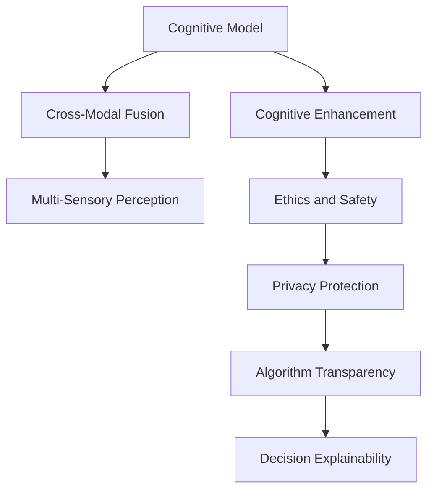

                 

# 扩展认知：人工智能的真正挑战

> 关键词：人工智能,认知扩展,技术挑战,深度学习,认知科学

## 1. 背景介绍

### 1.1 问题由来
近年来，人工智能(AI)技术的飞速发展在多个领域取得了显著进展。从图像识别、语音识别到自然语言处理(NLP)，AI技术正不断拓展其应用边界，提升决策效率和自动化水平。但与此同时，AI技术的广泛应用也带来了诸多新的挑战，尤其是对于人类认知能力的扩展。

人工智能通过机器学习和深度学习等技术，使计算机具备了超越人类在某些特定任务上的能力。然而，这并不意味着AI已经达到了人类的全面认知水平。机器无法具备人类在情感、意识、创造性思维等方面的能力，也不能全面理解复杂的社会文化现象。因此，如何在技术和伦理的框架内，实现AI的扩展认知，成为当前AI研究的重要方向。

### 1.2 问题核心关键点
AI的扩展认知涉及以下几个关键点：

- **认知模型**：构建能够模拟人类认知过程的AI模型，如视觉感知、语音理解、自然语言处理等。
- **认知增强**：利用AI技术提升人类认知能力，如通过认知增强设备、AI辅助诊断、认知训练等。
- **跨模态融合**：实现不同感知模态（如视觉、听觉、触觉）之间的信息整合，增强AI的感知和决策能力。
- **伦理与安全性**：确保AI的扩展认知不会带来伦理和安全性问题，如数据隐私、算法偏见、决策透明度等。

这些问题不仅涉及技术层面的挑战，还触及哲学、社会学、伦理学等多学科的交叉，对人类认知扩展的路径和方法提出了诸多思考。

## 2. 核心概念与联系

### 2.1 核心概念概述

为了更好地理解人工智能在认知扩展方面的研究进展和面临的挑战，本节将介绍几个核心概念及其联系：

- **认知模型(Cognitive Model)**：指用于模拟人类认知过程的计算模型，通常包括视觉感知、语音处理、自然语言理解等多个子模块。
- **认知增强(Cognitive Enhancement)**：指利用AI技术提升人类认知能力的方法，如辅助诊断、认知训练、认知增强设备等。
- **跨模态融合(Cross-Modal Fusion)**：指将不同模态（如视觉、听觉、触觉）的信息进行整合，提升AI的感知和决策能力。
- **伦理与安全性(Ethics and Safety)**：指确保AI的扩展认知不会带来伦理和安全性问题，如数据隐私保护、算法透明度、决策可解释性等。

这些核心概念通过以下Mermaid流程图展示其联系：



这个流程图展示了大语言模型认知扩展的关键概念及其相互关系：

1. 认知模型是认知增强和跨模态融合的基础。
2. 认知增强通过AI技术提升人类的认知能力，辅助人类在多个任务中。
3. 跨模态融合实现不同感知模态的信息整合，提升AI的感知和决策能力。
4. 伦理与安全性是认知扩展中不可忽视的重要问题，涉及数据隐私、算法透明度和决策可解释性等方面。

## 3. 核心算法原理 & 具体操作步骤
### 3.1 算法原理概述

AI在认知扩展方面的研究主要围绕认知模型、认知增强和跨模态融合展开。其中，认知模型构建和优化是基础，认知增强技术的应用是核心，跨模态融合的实现则是前沿。

### 3.2 算法步骤详解

**Step 1: 构建认知模型**
构建认知模型通常需要从数据获取、模型设计、参数训练等多个环节进行，主要步骤如下：

1. **数据获取**：收集大量标注数据，覆盖不同的认知任务，如视觉识别、语音理解、自然语言处理等。
2. **模型设计**：根据任务需求选择合适的深度学习模型架构，如卷积神经网络(CNN)、循环神经网络(RNN)、Transformer等。
3. **参数训练**：使用标注数据训练模型，优化模型参数，使其能够准确地进行认知任务。

**Step 2: 实现认知增强**
认知增强通常通过以下步骤实现：

1. **设备集成**：将认知模型集成到辅助设备中，如认知增强眼镜、智能助听器、智能手表等。
2. **用户交互**：通过语音、触觉、图像等多种方式，与用户进行交互，获取用户反馈信息。
3. **反馈优化**：根据用户反馈信息，不断优化模型参数，提高模型的性能和用户体验。

**Step 3: 跨模态融合**
跨模态融合的实现过程如下：

1. **数据采集**：通过多种传感器获取不同模态的数据，如视觉、听觉、触觉等。
2. **特征提取**：对不同模态的数据进行特征提取，如图像特征、语音特征、触觉特征等。
3. **信息整合**：将不同模态的特征进行整合，通过深度学习模型（如融合网络）进行信息融合。
4. **决策输出**：整合后的特征输入到决策模型中，进行认知任务的决策和输出。

### 3.3 算法优缺点

AI在认知扩展方面的研究存在以下优点：

- **高效处理**：AI可以快速处理大量数据，进行高效的认知任务。
- **灵活适应**：AI可以根据不同用户的需求进行灵活调整和优化。
- **多模态融合**：AI可以实现多模态数据的整合，提升决策的准确性。

但同时也存在一些缺点：

- **伦理问题**：AI的扩展认知可能带来伦理问题，如数据隐私、算法透明度等。
- **技术瓶颈**：目前AI技术在认知扩展方面还存在一些技术瓶颈，如跨模态信息整合、决策可解释性等。
- **用户体验**：AI辅助设备的用户体验和舒适性还需要进一步提升。

### 3.4 算法应用领域

AI在认知扩展方面的研究已经应用于多个领域，取得了显著成果。以下是几个典型应用：

- **医疗诊断**：利用AI进行图像识别、语音分析等，辅助医生进行疾病诊断和治疗。
- **智能辅助**：通过AI辅助设备，提升人类的视觉、听觉、触觉等感知能力，增强工作和学习效率。
- **人机交互**：利用AI技术，实现人与机器的自然交互，提升用户体验和交互效率。
- **社会治理**：通过AI进行数据分析和预测，辅助政府进行公共安全、环境监测、灾害预警等社会治理工作。

## 4. 数学模型和公式 & 详细讲解  
### 4.1 数学模型构建

在认知扩展的研究中，数学模型构建是基础环节。以下以视觉识别为例，介绍如何构建数学模型。

假设输入为图像$x \in \mathbb{R}^{n_x}$，输出为图像类别$y \in \{1,2,\cdots,m\}$。我们可以构建一个简单的神经网络模型，如下所示：

$$
\begin{align*}
z &= W_x x + b_x \\
h &= \sigma(z) \\
\hat{y} &= W_h h + b_h \\
L(y,\hat{y}) &= \mathcal{L}(y,\hat{y}) = -\log\hat{y}_y + \log(1-\hat{y}_{\bar{y}}) \\
\end{align*}
$$

其中，$W_x, b_x$为输入层权重和偏置，$W_h, b_h$为隐藏层权重和偏置，$\sigma$为激活函数。$L$为损失函数，通常使用交叉熵损失。

### 4.2 公式推导过程

以视觉识别模型为例，推导上述模型的损失函数：

- 输入层：将输入图像$x$转换为隐藏层需要的特征表示$z$。
- 隐藏层：将特征表示$z$通过激活函数$\sigma$进行非线性映射，得到隐藏层输出$h$。
- 输出层：将隐藏层输出$h$通过线性映射和激活函数，得到预测类别$\hat{y}$。
- 损失函数：使用交叉熵损失函数$L(y,\hat{y})$，衡量模型预测结果与真实标签$y$之间的差异。

推导过程如下：

$$
\begin{align*}
L(y,\hat{y}) &= -\log\hat{y}_y + \log(1-\hat{y}_{\bar{y}}) \\
&= -\log\sigma(W_h h + b_h)_y + \log(1-\sigma(W_h h + b_h))_{\bar{y}} \\
&= -\log\sigma(W_h h + b_h)_y - \log(1-\sigma(W_h h + b_h))_{\bar{y}}
\end{align*}
$$

推导结果显示，损失函数是由预测类别的概率和真实标签的交叉熵组成。

### 4.3 案例分析与讲解

以医疗影像诊断为例，说明认知模型在实际中的应用。

假设输入为医疗影像$x \in \mathbb{R}^{n_x}$，输出为疾病标签$y \in \{0,1\}$，其中$1$表示存在疾病。我们可以构建一个简单的深度学习模型，如下所示：

$$
\begin{align*}
z &= W_x x + b_x \\
h &= \sigma(z) \\
\hat{y} &= W_h h + b_h \\
L(y,\hat{y}) &= \mathcal{L}(y,\hat{y}) = -y\log\hat{y} + (1-y)\log(1-\hat{y})
\end{align*}
$$

将医疗影像输入模型，得到疾病预测概率$\hat{y}$，如果$\hat{y}$大于0.5，则输出$1$，表示存在疾病。反之输出$0$，表示不存在疾病。

在实际应用中，需要收集大量的医疗影像和对应的标注数据，进行模型训练和参数优化。训练完成后，将新医疗影像输入模型，进行疾病预测。

## 5. 项目实践：代码实例和详细解释说明
### 5.1 开发环境搭建

在进行认知扩展项目开发前，我们需要准备好开发环境。以下是使用Python进行TensorFlow开发的环境配置流程：

1. 安装Anaconda：从官网下载并安装Anaconda，用于创建独立的Python环境。

2. 创建并激活虚拟环境：
```bash
conda create -n tf-env python=3.8 
conda activate tf-env
```

3. 安装TensorFlow：根据CUDA版本，从官网获取对应的安装命令。例如：
```bash
conda install tensorflow==2.6 -c tf -c conda-forge
```

4. 安装各类工具包：
```bash
pip install numpy pandas scikit-learn matplotlib tqdm jupyter notebook ipython
```

完成上述步骤后，即可在`tf-env`环境中开始认知扩展项目的开发。

### 5.2 源代码详细实现

下面以视觉识别任务为例，给出使用TensorFlow对模型进行训练的PyTorch代码实现。

首先，定义视觉识别任务的数据处理函数：

```python
import tensorflow as tf
from tensorflow.keras import datasets, layers, models
from tensorflow.keras.utils import to_categorical

def load_data():
    (x_train, y_train), (x_test, y_test) = datasets.cifar10.load_data()
    x_train = x_train / 255.0
    x_test = x_test / 255.0
    y_train = to_categorical(y_train)
    y_test = to_categorical(y_test)
    return x_train, y_train, x_test, y_test
```

然后，定义模型和优化器：

```python
from tensorflow.keras import layers, models

model = models.Sequential([
    layers.Conv2D(32, (3,3), activation='relu', input_shape=(32,32,3)),
    layers.MaxPooling2D((2,2)),
    layers.Conv2D(64, (3,3), activation='relu'),
    layers.MaxPooling2D((2,2)),
    layers.Conv2D(64, (3,3), activation='relu'),
    layers.Flatten(),
    layers.Dense(64, activation='relu'),
    layers.Dense(10, activation='softmax')
])

optimizer = tf.keras.optimizers.Adam()
```

接着，定义训练和评估函数：

```python
import matplotlib.pyplot as plt

def train(model, train_dataset, validation_dataset, epochs, batch_size):
    history = model.fit(train_dataset, epochs=epochs, validation_data=validation_dataset, batch_size=batch_size)
    plt.plot(history.history['loss'], label='Train Loss')
    plt.plot(history.history['val_loss'], label='Validation Loss')
    plt.legend()
    plt.show()

def evaluate(model, test_dataset, batch_size):
    test_loss, test_acc = model.evaluate(test_dataset, batch_size=batch_size)
    print(f'Test Loss: {test_loss:.2f}')
    print(f'Test Accuracy: {test_acc:.2f}')
```

最后，启动训练流程并在测试集上评估：

```python
x_train, y_train, x_test, y_test = load_data()

train(model, x_train, y_train, epochs=10, batch_size=32)

evaluate(model, x_test, y_test)
```

以上就是使用TensorFlow对模型进行视觉识别任务训练的完整代码实现。可以看到，TensorFlow提供了丰富的API，可以快速搭建和训练深度学习模型。

### 5.3 代码解读与分析

让我们再详细解读一下关键代码的实现细节：

**load_data函数**：
- 从CIFAR-10数据集中加载图像和标签数据。
- 将图像归一化到[0,1]之间。
- 对标签进行one-hot编码。

**model定义**：
- 构建一个卷积神经网络模型，包含多个卷积层、池化层和全连接层。
- 输出层使用softmax激活函数，进行多分类预测。

**train函数**：
- 使用模型的fit方法进行训练，记录训练过程中的损失变化。
- 使用matplotlib绘制损失随训练轮数变化的曲线图。

**evaluate函数**：
- 使用模型的evaluate方法计算测试集上的损失和准确率。
- 输出测试集上的损失和准确率。

**训练流程**：
- 加载训练集和测试集数据。
- 进行10轮训练，每轮迭代32个批次的样本。
- 在训练过程中实时显示训练集和验证集上的损失。
- 在训练完成后，使用测试集评估模型的性能。

可以看到，TensorFlow提供了便捷的数据处理、模型构建、训练和评估等功能，使得深度学习模型的开发和应用变得更加高效。

## 6. 实际应用场景
### 6.1 医疗影像诊断

基于深度学习的医疗影像诊断系统已经在多个领域得到广泛应用。例如，利用卷积神经网络对X光片进行肿瘤识别、对CT扫描进行肺结节检测等。这些系统通过大量标注数据进行预训练，然后对特定患者的新影像进行微调，以获得更准确的诊断结果。

在实际应用中，需要考虑以下几个因素：

- **数据获取**：收集大量医疗影像和标注数据，确保数据的多样性和代表性。
- **模型训练**：选择合适的深度学习模型和优化器，进行充分的训练和参数调整。
- **微调优化**：根据不同患者的影像数据，进行微调优化，提高诊断的准确性和鲁棒性。

### 6.2 智能辅助

智能辅助设备通过认知扩展技术，帮助人类提升感知和决策能力。例如，智能眼镜可以通过摄像头进行视觉识别，提醒用户可能存在的危险；智能助听器可以通过麦克风进行语音识别，提高沟通效率。

在实际应用中，需要考虑以下几个因素：

- **设备集成**：将深度学习模型集成到设备中，确保设备的稳定性和可靠性。
- **用户交互**：通过语音、触觉等多种方式，与用户进行交互，获取用户反馈信息。
- **反馈优化**：根据用户反馈信息，不断优化模型参数，提高模型的性能和用户体验。

### 6.3 人机交互

人机交互系统通过认知扩展技术，实现人与机器的自然交互。例如，聊天机器人通过自然语言理解技术，理解用户的意图，进行智能回复；智能助手通过语音识别和自然语言处理技术，帮助用户完成各种任务。

在实际应用中，需要考虑以下几个因素：

- **自然语言处理**：使用深度学习模型进行自然语言理解，识别用户的意图和上下文信息。
- **多模态融合**：将视觉、听觉等多种模态的信息进行整合，增强系统的感知和决策能力。
- **用户体验**：优化系统的交互界面和交互逻辑，提升用户体验和满意度。

### 6.4 未来应用展望

随着认知扩展技术的发展，AI将进一步拓展其应用领域，带来更多创新和突破。

在智慧医疗领域，基于深度学习的医疗影像诊断系统将变得更加精准和高效，辅助医生进行疾病诊断和治疗。通过认知增强技术，智能设备将具备更强的感知和决策能力，提升人类的健康水平。

在智能教育领域，通过认知增强设备，帮助学生进行认知训练和学习辅助，提升学习效率和效果。利用深度学习模型，进行个性化推荐和智能辅导，实现因材施教。

在智慧城市治理中，通过深度学习模型，进行交通流量预测、环境监测等任务，提升城市管理水平和智能化程度。利用跨模态融合技术，实现城市环境的智能感知和决策。

总之，AI在认知扩展方面的研究将不断拓展其应用领域，带来更多创新和突破，为人类社会的进步和发展提供强大的技术支持。

## 7. 工具和资源推荐
### 7.1 学习资源推荐

为了帮助开发者系统掌握认知扩展的理论基础和实践技巧，这里推荐一些优质的学习资源：

1. 《深度学习》书籍：Ian Goodfellow等著，全面介绍了深度学习的基础理论和应用实践。
2. 《认知增强：人机交互的未来》课程：斯坦福大学开设的认知增强课程，涵盖认知增强设备的原理和应用。
3. 《跨模态学习》书籍：Bengio等著，介绍了跨模态融合技术的理论基础和最新进展。
4. 《认知扩展：人工智能的伦理与安全性》论文集：涵盖认知扩展技术在伦理、安全等方面面临的挑战和解决方案。
5. Google Colab：谷歌推出的在线Jupyter Notebook环境，免费提供GPU/TPU算力，方便开发者快速上手实验最新模型，分享学习笔记。

通过对这些资源的学习实践，相信你一定能够快速掌握认知扩展的精髓，并用于解决实际的认知问题。

### 7.2 开发工具推荐

高效的开发离不开优秀的工具支持。以下是几款用于认知扩展开发的常用工具：

1. TensorFlow：由Google主导开发的开源深度学习框架，生产部署方便，适合大规模工程应用。
2. PyTorch：基于Python的开源深度学习框架，灵活动态的计算图，适合快速迭代研究。
3. Keras：高级神经网络API，方便快速搭建深度学习模型，支持TensorFlow和Theano后端。
4. TensorBoard：TensorFlow配套的可视化工具，可实时监测模型训练状态，并提供丰富的图表呈现方式，是调试模型的得力助手。
5. Weights & Biases：模型训练的实验跟踪工具，可以记录和可视化模型训练过程中的各项指标，方便对比和调优。

合理利用这些工具，可以显著提升认知扩展任务的开发效率，加快创新迭代的步伐。

### 7.3 相关论文推荐

认知扩展技术的发展源于学界的持续研究。以下是几篇奠基性的相关论文，推荐阅读：

1. ImageNet Classification with Deep Convolutional Neural Networks（ImageNet分类模型）：提出深度卷积神经网络模型，在ImageNet数据集上取得了优异表现。
2. Multi-task Learning for Unsupervised Zero-shot Image Classification（零样本图像分类）：提出多任务学习框架，实现了零样本图像分类。
3. Generative Adversarial Nets（生成对抗网络）：提出生成对抗网络模型，用于生成高质量的图像和视频。
4. Deep Residual Learning for Image Recognition（残差网络）：提出残差网络模型，解决了深度神经网络训练过程中的梯度消失问题。
5. Attention is All You Need（Transformer模型）：提出Transformer模型，用于自然语言处理任务，取得了较好的效果。

这些论文代表了大语言模型扩展认知的研究方向，通过学习这些前沿成果，可以帮助研究者把握学科前进方向，激发更多的创新灵感。

## 8. 总结：未来发展趋势与挑战
### 8.1 总结

本文对人工智能在认知扩展方面的研究进展和面临的挑战进行了全面系统的介绍。首先阐述了认知扩展技术的背景和重要性，明确了认知扩展在提升人类认知能力和改善生活质量方面的独特价值。其次，从原理到实践，详细讲解了认知扩展的数学模型、算法步骤和关键技术点，给出了认知扩展任务开发的完整代码实例。同时，本文还广泛探讨了认知扩展技术在医疗、教育、智能辅助等多个领域的应用前景，展示了认知扩展技术的广阔前景。

通过本文的系统梳理，可以看到，认知扩展技术正在成为人工智能的重要范式，极大地拓展了深度学习的应用边界，为人类社会的进步和发展提供了强大的技术支持。未来，伴随认知扩展技术的不断发展，人工智能必将在更广泛的领域发挥更大的作用，为人类认知智能的进化带来深远影响。

### 8.2 未来发展趋势

展望未来，认知扩展技术将呈现以下几个发展趋势：

1. **多模态融合**：实现不同感知模态（如视觉、听觉、触觉）的信息整合，提升AI的感知和决策能力。
2. **深度学习**：利用深度学习模型进行认知任务的建模，提升模型的性能和泛化能力。
3. **跨领域应用**：将认知扩展技术应用到更多领域，如医疗、教育、智能辅助等，提升各领域的技术水平和服务质量。
4. **伦理学**：在认知扩展技术的应用中，注重伦理和安全性问题，确保技术的安全、可靠和透明。
5. **个性化**：通过认知增强设备，实现个性化认知训练，提升人类的认知能力和生活质量。

以上趋势凸显了认知扩展技术的广阔前景。这些方向的探索发展，必将进一步提升AI系统的性能和应用范围，为人类社会的进步和发展提供强大的技术支持。

### 8.3 面临的挑战

尽管认知扩展技术已经取得了瞩目成就，但在迈向更加智能化、普适化应用的过程中，它仍面临着诸多挑战：

1. **数据获取**：认知扩展技术需要大量高质量的数据进行训练，但数据获取成本高、难度大。如何高效获取和标注数据，成为重要的研究课题。
2. **模型泛化**：认知扩展模型在不同场景和任务上的泛化能力有限，面对复杂多变的环境，模型的性能可能会大打折扣。
3. **用户交互**：认知扩展设备需要与用户进行自然的交互，如何设计交互界面和逻辑，提升用户体验，还有很大的挑战。
4. **伦理问题**：认知扩展技术可能带来数据隐私、算法透明度等伦理问题，如何确保技术的安全和公正性，还需要进一步的研究。
5. **跨领域融合**：将认知扩展技术与外部知识库、规则库等专家知识进行融合，形成更加全面、准确的信息整合能力，还有很大的想象空间。

正视认知扩展面临的这些挑战，积极应对并寻求突破，将是认知扩展技术走向成熟的必由之路。相信随着学界和产业界的共同努力，这些挑战终将一一被克服，认知扩展技术必将在构建人机协同的智能时代中扮演越来越重要的角色。

### 8.4 研究展望

面向未来，认知扩展技术的研究需要在以下几个方面寻求新的突破：

1. **多模态学习**：研究多模态数据的融合方法，提升跨模态融合的性能和泛化能力。
2. **深度学习**：开发更加高效的深度学习模型，如Transformer、ResNet等，提升认知任务的建模能力。
3. **认知增强**：研究认知增强设备的设计和实现方法，提升人类在视觉、听觉、触觉等感知上的能力。
4. **跨领域应用**：将认知扩展技术应用到更多领域，如医疗、教育、智能辅助等，提升各领域的技术水平和服务质量。
5. **伦理学**：研究认知扩展技术的伦理问题，确保技术的安全、可靠和透明，促进技术的健康发展。

这些研究方向的探索，必将引领认知扩展技术迈向更高的台阶，为构建安全、可靠、可解释、可控的智能系统铺平道路。面向未来，认知扩展技术还需要与其他人工智能技术进行更深入的融合，如知识表示、因果推理、强化学习等，多路径协同发力，共同推动自然语言理解和智能交互系统的进步。只有勇于创新、敢于突破，才能不断拓展认知扩展技术的边界，让智能技术更好地造福人类社会。

## 9. 附录：常见问题与解答

**Q1：认知扩展技术是否适用于所有认知任务？**

A: 认知扩展技术适用于大部分认知任务，但并不是所有任务都适合使用认知扩展技术。对于一些需要深度理解和复杂推理的任务，如逻辑推理、创造性思维等，单纯依赖认知扩展技术可能难以达到理想的效果。此时需要结合人类的认知优势，进行人机协同工作，提升整体认知能力。

**Q2：认知扩展技术是否会带来新的伦理问题？**

A: 认知扩展技术可能会带来新的伦理问题，如数据隐私、算法透明度、决策可解释性等。如何确保技术的安全和公正性，确保技术的应用不会带来伦理风险，还需要进一步的研究和规范。

**Q3：如何评估认知扩展技术的性能？**

A: 评估认知扩展技术的性能可以从多个方面进行，如模型精度、用户体验、数据隐私保护等方面。在实际应用中，需要根据具体任务的需求，选择合适的评估指标，进行全面评估。

**Q4：认知扩展技术在医疗影像诊断中的应用前景如何？**

A: 认知扩展技术在医疗影像诊断中具有广泛的应用前景。通过深度学习模型进行图像识别和分析，可以提升医疗影像诊断的准确性和效率，辅助医生进行疾病诊断和治疗。但需要考虑数据隐私、模型泛化能力、用户交互设计等诸多因素，确保技术的可靠性和安全性。

**Q5：认知扩展技术在智能辅助设备中的应用前景如何？**

A: 认知扩展技术在智能辅助设备中具有广泛的应用前景。通过深度学习模型进行视觉、语音等信息的处理和分析，可以提升智能设备的感知和决策能力，增强用户的体验和功能。但需要考虑设备设计、用户交互设计、数据隐私保护等诸多因素，确保技术的可行性和用户满意度。

通过本文的系统梳理，可以看到，认知扩展技术正在成为人工智能的重要范式，极大地拓展了深度学习的应用边界，为人类社会的进步和发展提供强大的技术支持。未来，伴随认知扩展技术的不断发展，人工智能必将在更广泛的领域发挥更大的作用，为人类认知智能的进化带来深远影响。

---

作者：禅与计算机程序设计艺术 / Zen and the Art of Computer Programming

