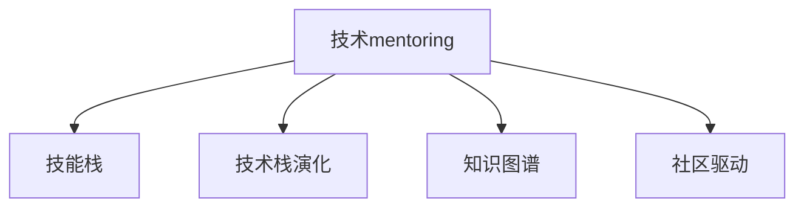

                 

## 1. 背景介绍

在日新月异的科技时代，技术的快速迭代和应用场景的多样化对程序员的技能提出了更高的要求。然而，面对复杂的编程任务和不断涌现的新技术，许多初学者和进阶开发者往往感到困惑和焦虑。为了帮助他们系统性地掌握编程技能，加速职业成长，构建一个高效、结构化的技术mentoring项目，成为了一项紧迫而重要的任务。

### 1.1 问题由来
随着信息技术的迅猛发展，编程已经成为了现代社会的重要技能之一。然而，对于初学者和中级开发者来说，面对庞杂的技术栈和不断涌现的新技术，容易产生迷茫和无助感。新手往往在掌握基本概念后难以深入理解，而中级开发者则在面对复杂系统时感到力不从心。为此，我们需要构建一个有组织、有系统的技术mentoring项目，帮助他们逐步提升技能，实现职业成长。

### 1.2 问题核心关键点
构建技术mentoring项目的核心关键点在于：
- **明确目标：** 确定项目的目标和预期效果，帮助开发者系统性地提升技能。
- **系统设计：** 设计一个模块化、层次分明的技能提升路径，确保开发者循序渐进地掌握知识。
- **实时反馈：** 建立有效的学习反馈机制，及时了解开发者的进展，并给予针对性的指导。
- **资源整合：** 整合各类学习资源和工具，确保开发者有充足的资源进行学习和实践。
- **社区支持：** 构建一个开放的社区，促进开发者之间的交流和合作，形成知识共享的氛围。

通过解决这些关键问题，我们能够构建一个高效、结构化的技术mentoring项目，为程序员提供系统的职业发展支持。

### 1.3 问题研究意义
构建技术mentoring项目，对于加速程序员的职业成长具有重要意义：

1. **系统化学习：** 通过有组织、系统化的学习路径，帮助开发者快速掌握编程技能，避免盲目摸索。
2. **技能提升：** 通过技术mentoring项目，开发者能够逐步提升编程能力，适应复杂系统开发需求。
3. **职业规划：** 帮助开发者明确职业方向，制定职业发展计划，加速职业成长。
4. **社区合作：** 通过社区支持，促进开发者之间的交流和合作，形成知识共享的良性循环。
5. **适应变化：** 在快速变化的技术环境中，通过持续学习和实践，保持技能的更新和提升。

## 2. 核心概念与联系

### 2.1 核心概念概述

为了更好地理解技术mentoring项目，本节将介绍几个密切相关的核心概念：

- **技术mentoring：** 指通过系统的技术指导和资源支持，帮助开发者系统性地提升编程技能，加速职业成长的过程。
- **技能栈：** 指开发者掌握的各项编程技能及其应用范围，包括编程语言、框架、工具等。
- **技术栈演化：** 指开发者随着技术栈的不断更新，需要不断学习新技能以适应技术变化的过程。
- **知识图谱：** 指通过图形化表示的方式，展示各项技术之间的关联关系，帮助开发者系统性地理解和应用知识。
- **社区驱动：** 指通过构建一个开放的社区，促进开发者之间的交流和合作，形成知识共享的氛围。

这些核心概念之间的逻辑关系可以通过以下Mermaid流程图来展示：



这个流程图展示了一个技术mentoring项目对程序员成长的影响：

1. 技术mentoring项目帮助开发者构建和演化其技能栈。
2. 通过知识图谱，开发者能够系统性地理解技术的关联关系，提高学习效率。
3. 社区驱动机制促进了开发者之间的交流和合作，形成知识共享的良性循环。

## 3. 核心算法原理 & 具体操作步骤
### 3.1 算法原理概述

技术mentoring项目通过系统的技术指导和资源支持，帮助开发者系统性地提升编程技能。其实现原理可以概括为以下几个步骤：

1. **技能评估：** 评估开发者当前的技能水平，确定其技能缺口。
2. **路径规划：** 根据评估结果，制定系统化的学习路径，确保开发者循序渐进地掌握新技能。
3. **资源整合：** 整合各类学习资源和工具，如在线课程、代码练习平台、编程工具等，支持开发者的学习和实践。
4. **实时反馈：** 通过定期的学习反馈和评估，了解开发者的进展，并给予针对性的指导。
5. **社区互动：** 构建一个开放的社区，促进开发者之间的交流和合作，形成知识共享的氛围。

### 3.2 算法步骤详解

技术mentoring项目的实现可以分为以下几个关键步骤：

**Step 1: 技能评估**
- 通过编程能力测试、代码审查、项目评审等方式，评估开发者当前的技能水平。
- 根据评估结果，确定开发者需要提升的技能领域。

**Step 2: 路径规划**
- 根据技能缺口，设计系统化的学习路径，包括学习目标、学习内容、学习资源等。
- 将学习路径模块化，按难易程度和重要程度进行排序，确保开发者循序渐进地掌握新技能。

**Step 3: 资源整合**
- 整合各类学习资源和工具，如在线课程、代码练习平台、编程工具等，确保开发者有充足的资源进行学习和实践。
- 通过平台化的方式，提供统一的学习入口和进度跟踪功能，方便开发者进行系统化学习。

**Step 4: 实时反馈**
- 通过定期的学习反馈和评估，了解开发者的进展，并给予针对性的指导。
- 通过学习平台的数据分析功能，了解开发者的学习习惯和难点，及时调整学习路径和内容。

**Step 5: 社区互动**
- 构建一个开放的社区，促进开发者之间的交流和合作，形成知识共享的氛围。
- 通过社区活动、技术分享、项目合作等方式，促进开发者之间的互动和协作。

### 3.3 算法优缺点

技术mentoring项目具有以下优点：
1. 系统化学习：通过有组织、系统化的学习路径，帮助开发者快速掌握编程技能。
2. 技能提升：通过系统化的学习路径和实时反馈，开发者能够逐步提升编程能力。
3. 职业规划：帮助开发者明确职业方向，制定职业发展计划，加速职业成长。
4. 社区合作：通过社区支持，促进开发者之间的交流和合作，形成知识共享的良性循环。

同时，该方法也存在一定的局限性：
1. 高度依赖平台：技术mentoring项目需要依赖于学习平台和社区平台的支持，可能存在技术和管理上的复杂性。
2. 资源整合难度大：整合各类学习资源和工具需要较大的投入和协调。
3. 个性化需求难以满足：统一的学习路径可能无法完全满足开发者的个性化需求。

尽管存在这些局限性，但就目前而言，技术mentoring项目仍是最为主流、最有效的程序员成长支持方式。未来相关研究的重点在于如何进一步优化学习路径，整合更多优质资源，同时兼顾个性化需求，确保技术mentoring项目的持续性和有效性。

### 3.4 算法应用领域

技术mentoring项目在程序员的职业成长过程中具有广泛的应用，涵盖各个技术栈和开发阶段：

- **初学者：** 通过技术mentoring项目，初学者可以系统性地掌握编程基础，逐步提升编程能力。
- **中级开发者：** 技术mentoring项目帮助中级开发者掌握复杂系统开发技能，提升代码质量和项目效率。
- **高级开发者：** 帮助高级开发者保持技能更新，掌握新技术，提升解决复杂问题的能力。
- **团队协作：** 通过社区支持，促进开发者之间的交流和合作，形成知识共享的良性循环。

除了这些主要应用外，技术mentoring项目还可以应用于技术培训、企业内部培训、开源项目协作等场景中，为技术社区和开发者提供全面的支持。

## 4. 数学模型和公式 & 详细讲解  
### 4.1 数学模型构建

为了更好地理解技术mentoring项目的实现原理，本节将使用数学语言对技术mentoring项目的学习路径规划进行严格的刻画。

设开发者当前的技能水平为 $S$，目标技能水平为 $T$。根据评估结果，开发者需要提升的技能领域为 $K=\{k_1, k_2, \dots, k_n\}$。我们定义 $L_k$ 为掌握第 $k$ 项技能所需的时间成本，$E_k$ 为掌握第 $k$ 项技能所需的资源成本。则技术mentoring项目的目标是最小化总成本 $C$，即：

$$
C = \sum_{k=1}^{n} (L_k + E_k)
$$

在实践中，我们通常使用基于梯度的优化算法（如SGD、Adam等）来近似求解上述最优化问题。设 $\eta$ 为学习率，则参数的更新公式为：

$$
S \leftarrow S - \eta \nabla_{S}\mathcal{L}(S)
$$

其中 $\nabla_{S}\mathcal{L}(S)$ 为损失函数对技能水平 $S$ 的梯度，可通过反向传播算法高效计算。

### 4.2 公式推导过程

以下我们以一个简单的例子来推导学习路径规划的数学模型。

假设开发者需要掌握三项技能 $k_1, k_2, k_3$，其所需时间成本和资源成本分别为 $L_{k_1}=10, L_{k_2}=15, L_{k_3}=20$，$E_{k_1}=2, E_{k_2}=3, E_{k_3}=4$。我们定义 $S_0=0$ 为初始技能水平，$T=100$ 为目标技能水平。则总成本 $C$ 可以表示为：

$$
C = L_{k_1} + L_{k_2} + L_{k_3} + E_{k_1} + E_{k_2} + E_{k_3} = 10 + 15 + 20 + 2 + 3 + 4 = 54
$$

根据上述数学模型，可以计算出最优学习路径。设开发者花费 $t$ 时间学习 $k_1$ 和 $k_2$，剩余时间学习 $k_3$，则有：

$$
t \times (L_{k_1} + E_{k_1}) + (T-t) \times (L_{k_2} + E_{k_2}) = 54
$$

解得 $t = 9$。因此，最优学习路径为：

1. 前9小时学习 $k_1$ 和 $k_2$。
2. 剩余时间学习 $k_3$。

通过这种数学模型，可以更好地指导技术mentoring项目的路径规划和资源分配。

### 4.3 案例分析与讲解

以下我们以一个具体的技术mentoring项目案例，展示学习路径规划的实际应用。

假设有一个初学者小张，其当前技能水平为 $S_0=30$，目标技能水平为 $T=90$。通过技能评估，发现小张在以下几个技能领域存在缺口：
- 基础编程：需要掌握 Python、Java、C++ 三种语言，所需时间成本分别为 $L_{Python}=30$，$L_{Java}=35$，$L_{C++}=40$，资源成本分别为 $E_{Python}=5$，$E_{Java}=6$，$E_{C++}=7$。
- 数据结构与算法：需要掌握基础算法、数据结构、高级算法等，所需时间成本分别为 $L_{基础算法}=10$，$L_{数据结构}=20$，$L_{高级算法}=25$，资源成本分别为 $E_{基础算法}=2$，$E_{数据结构}=4$，$E_{高级算法}=5$。

根据上述数据，我们可以构建如下学习路径：

1. 前20小时，学习 Python、Java 和数据结构，共需时间成本 $L_{Python}+L_{Java}+L_{数据结构}=30+35+20=85$，资源成本 $E_{Python}+E_{Java}+E_{数据结构}=5+6+4=15$。
2. 剩余时间，学习 C++ 和高级算法，共需时间成本 $L_{C++}+L_{高级算法}=40+25=65$，资源成本 $E_{C++}+E_{高级算法}=7+5=12$。

通过这种学习路径规划，小张能够在较短的时间内掌握所需的技能，加速其职业成长。

## 5. 项目实践：代码实例和详细解释说明
### 5.1 开发环境搭建

在进行技术mentoring项目实践前，我们需要准备好开发环境。以下是使用Python进行web应用开发的环境配置流程：

1. 安装Anaconda：从官网下载并安装Anaconda，用于创建独立的Python环境。

2. 创建并激活虚拟环境：
```bash
conda create -n mentoring-env python=3.8 
conda activate mentoring-env
```

3. 安装Python和web开发框架：
```bash
pip install Flask
```

4. 安装数据库和其它相关工具：
```bash
pip install sqlite3 mysql-connector-python
```

完成上述步骤后，即可在`mentoring-env`环境中开始技术mentoring项目的开发。

### 5.2 源代码详细实现

下面我们以一个技术mentoring项目为例，给出基于web开发框架Flask的代码实现。

首先，定义Flask应用和路由：

```python
from flask import Flask, render_template, request

app = Flask(__name__)

@app.route('/')
def index():
    return render_template('index.html')
```

然后，定义学习路径规划的逻辑：

```python
from flask import jsonify

@app.route('/plan', methods=['POST'])
def plan():
    data = request.get_json()
    skills = data.get('skills')
    total_cost = 0
    for skill in skills:
        time_cost = skill.get('time_cost')
        resource_cost = skill.get('resource_cost')
        total_cost += time_cost + resource_cost
    return jsonify({'total_cost': total_cost})
```

最后，运行Flask应用：

```bash
python app.py
```

打开浏览器访问`http://localhost:5000/plan`，即可通过POST请求发送技能列表，获取总成本。

### 5.3 代码解读与分析

让我们再详细解读一下关键代码的实现细节：

**Flask应用和路由定义：**
- 使用`Flask`创建web应用。
- 定义`index`路由，返回主页模板。
- 定义`plan`路由，处理POST请求，返回总成本。

**技能规划逻辑：**
- 通过`request.get_json()`获取POST请求中的技能列表。
- 遍历技能列表，计算总成本。
- 使用`jsonify`将结果以JSON格式返回。

**Flask应用运行：**
- 通过`python app.py`启动Flask应用。

通过这段代码，我们可以构建一个简单的技术mentoring项目平台，帮助开发者规划学习路径，计算总成本。

当然，在实际应用中，还需要考虑更多因素，如学习进度跟踪、学习反馈、社区互动等功能。但核心的技术mentoring范式基本与此类似。

## 6. 实际应用场景
### 6.1 技术培训

技术培训是技术mentoring项目的重要应用场景之一。通过系统化的培训计划和实时反馈，可以帮助初学者和中级开发者快速掌握编程技能，提升职业竞争力。

在技术培训过程中，可以采用以下方法：
1. **系统化培训计划：** 根据技能缺口，制定系统化的学习路径，确保开发者循序渐进地掌握新技能。
2. **实时反馈与评估：** 通过定期的学习反馈和评估，了解开发者的进展，并给予针对性的指导。
3. **实战项目练习：** 通过实际项目练习，帮助开发者将所学知识应用到实际工作中。

### 6.2 企业内部培训

企业内部培训也是技术mentoring项目的常见应用场景。通过系统化的培训计划和社区互动，可以帮助企业内部开发者提升技术水平，加速知识共享和创新。

在企业内部培训过程中，可以采用以下方法：
1. **技能评估与路径规划：** 通过技能评估，确定开发者需要提升的技能领域，并制定系统化的学习路径。
2. **实时反馈与指导：** 通过定期的学习反馈和评估，了解开发者的进展，并给予针对性的指导。
3. **技术分享与合作：** 通过社区互动，促进开发者之间的交流和合作，形成知识共享的良性循环。

### 6.3 开源项目协作

开源项目协作也是技术mentoring项目的重要应用场景。通过社区支持和系统化的培训计划，可以帮助开发者更好地参与开源项目，提升协作能力和技术水平。

在开源项目协作过程中，可以采用以下方法：
1. **技能评估与路径规划：** 通过技能评估，确定开发者需要提升的技能领域，并制定系统化的学习路径。
2. **实时反馈与指导：** 通过定期的学习反馈和评估，了解开发者的进展，并给予针对性的指导。
3. **社区互动与合作：** 通过社区支持，促进开发者之间的交流和合作，形成知识共享的良性循环。

### 6.4 未来应用展望

随着技术的不断进步和应用场景的不断扩展，技术mentoring项目将在更多领域得到应用，为技术社区和开发者提供全面的支持。

在智慧医疗领域，技术mentoring项目可以帮助医疗技术人员掌握最新的医疗技术和数据分析技能，提升医疗服务水平。

在智能制造领域，技术mentoring项目可以帮助工程师掌握最新的智能制造技术和数据驱动的设计方法，提升生产效率和产品质量。

在智慧城市领域，技术mentoring项目可以帮助城市管理人员掌握最新的城市管理技术和数据分析方法，提升城市治理能力。

此外，在教育、农业、环境监测等众多领域，技术mentoring项目都将发挥重要作用，为各行各业的数字化转型提供技术支持。相信随着技术的日益成熟，技术mentoring项目必将在构建人机协同的智能时代中扮演越来越重要的角色。

## 7. 工具和资源推荐
### 7.1 学习资源推荐

为了帮助开发者系统掌握技术mentoring项目的理论和实践，这里推荐一些优质的学习资源：

1. 《软件工程实践指南》：详细介绍了软件开发和系统化培训的最佳实践。
2. 《敏捷软件开发：原则、模式与实践》：介绍了敏捷开发的核心思想和方法，适合技术培训和项目协作。
3. 《代码大全》：提供了系统化编程和代码优化的方法，适合开发者提升编程能力。
4. 《深度学习入门：基于TensorFlow实践》：介绍了深度学习和模型训练的最佳实践，适合技术培训和项目协作。
5. 《编程珠玑》：提供了编程技巧和算法优化的经典案例，适合开发者提升编程技能。

通过对这些资源的学习实践，相信你一定能够快速掌握技术mentoring项目的精髓，并用于解决实际的编程问题。

### 7.2 开发工具推荐

高效的开发离不开优秀的工具支持。以下是几款用于技术mentoring项目开发的常用工具：

1. GitHub：开源代码托管平台，提供代码仓库和协作工具，适合开源项目协作。
2. GitLab：开源代码托管平台，提供持续集成、持续部署(CI/CD)等工具，适合企业内部培训和项目协作。
3. JIRA：项目管理工具，提供任务跟踪、缺陷管理等功能，适合团队协作和项目进度管理。
4. Confluence：文档协作工具，提供团队知识管理和共享功能，适合团队协作和知识积累。
5. Trello：项目管理工具，提供看板、列表等界面，适合项目进度跟踪和任务管理。

合理利用这些工具，可以显著提升技术mentoring项目的开发效率，加快创新迭代的步伐。

### 7.3 相关论文推荐

技术mentoring项目的研究源于学界的持续探索。以下是几篇奠基性的相关论文，推荐阅读：

1. "A Systematic Review of Mentoring Models and Their Use in Software Engineering"：综述了软件工程中的指导模型和其实际应用，为技术mentoring项目提供了理论基础。
2. "A Comparative Study of Agile and Waterfall Methodologies in Software Development"：比较了敏捷开发和瀑布模型在软件开发中的应用，适合技术培训和项目协作。
3. "The Effectiveness of Mentoring Programs in Software Development"：研究了指导项目在软件开发中的有效性，适合技术培训和项目协作。
4. "Deep Learning in Software Engineering: A Survey"：综述了深度学习在软件开发中的应用，适合技术培训和项目协作。
5. "The Impact of Mentoring on Developer Performance"：研究了指导对开发者绩效的影响，适合技术培训和项目协作。

这些论文代表了大规模技术mentoring项目的研究趋势，为开发者提供了丰富的理论支持和实践指导。

## 8. 总结：未来发展趋势与挑战
### 8.1 总结

本文对技术mentoring项目的理论和实践进行了全面系统的介绍。首先阐述了技术mentoring项目的背景和意义，明确了项目的目标和预期效果，系统地设计了技术指导和资源支持流程，确保开发者能够系统性地提升编程技能，加速职业成长。

通过本文的系统梳理，可以看到，技术mentoring项目在程序员的职业成长过程中具有广阔的前景，能够帮助开发者快速掌握编程技能，提升职业竞争力，促进技术社区和企业的创新发展。

### 8.2 未来发展趋势

展望未来，技术mentoring项目将呈现以下几个发展趋势：

1. **智能化培训：** 引入AI和机器学习技术，根据开发者学习进度和反馈，动态调整学习路径和资源，提升学习效率。
2. **个性化学习：** 根据开发者的个性化需求和兴趣，设计个性化的学习路径和资源，满足不同开发者的学习需求。
3. **跨平台支持：** 支持多种设备和平台，方便开发者随时随地进行学习。
4. **社区合作：** 通过社区支持，促进开发者之间的交流和合作，形成知识共享的良性循环。
5. **移动化学习：** 引入移动学习技术，支持开发者通过移动设备进行学习。

以上趋势凸显了技术mentoring项目的广阔前景。这些方向的探索发展，将进一步提升技术指导的效果，推动程序员的职业成长和技术社区的持续发展。

### 8.3 面临的挑战

尽管技术mentoring项目已经取得了瞩目成就，但在迈向更加智能化、普适化应用的过程中，它仍面临着诸多挑战：

1. **技术复杂性：** 技术指导和资源支持流程复杂，需要高度的技术和管理支持。
2. **资源整合难度大：** 整合各类学习资源和工具需要较大的投入和协调。
3. **个性化需求难以满足：** 统一的学习路径可能无法完全满足开发者的个性化需求。
4. **学习效率有待提升：** 学习路径和资源分配不合理，导致学习效率低下。

尽管存在这些挑战，但通过不断优化技术指导流程，整合更多优质资源，兼顾个性化需求，技术mentoring项目必将在构建人机协同的智能时代中扮演越来越重要的角色。

### 8.4 研究展望

面对技术mentoring项目所面临的挑战，未来的研究需要在以下几个方面寻求新的突破：

1. **智能化指导：** 引入AI和机器学习技术，根据开发者学习进度和反馈，动态调整学习路径和资源，提升学习效率。
2. **个性化学习：** 根据开发者的个性化需求和兴趣，设计个性化的学习路径和资源，满足不同开发者的学习需求。
3. **社区合作：** 通过社区支持，促进开发者之间的交流和合作，形成知识共享的良性循环。
4. **移动化学习：** 引入移动学习技术，支持开发者通过移动设备进行学习。
5. **跨平台支持：** 支持多种设备和平台，方便开发者随时随地进行学习。

这些研究方向的探索，将引领技术mentoring项目迈向更高的台阶，为程序员提供更高效、更全面的职业成长支持。面向未来，技术mentoring项目还需要与其他人工智能技术进行更深入的融合，如知识表示、因果推理、强化学习等，多路径协同发力，共同推动程序员的职业成长和技术社区的持续发展。

## 9. 附录：常见问题与解答
**Q1：技术mentoring项目是否适用于所有技术栈？**

A: 技术mentoring项目适用于大多数技术栈，但针对不同技术栈，需要设计不同的学习路径和资源支持策略。例如，对于前端开发，可以重点关注React、Vue等框架的学习；对于后端开发，可以重点关注Spring、Django等框架的学习。

**Q2：如何衡量技术mentoring项目的效果？**

A: 技术mentoring项目的效果可以通过多个指标进行衡量，包括：
1. 学习进度：通过学习时间、学习内容等指标，衡量开发者掌握技能的速度和广度。
2. 技术水平：通过编程能力测试、项目评审等指标，衡量开发者技能提升的效果。
3. 职业发展：通过职业发展报告、职位晋升等指标，衡量开发者职业发展的进展。
4. 反馈满意度：通过调查问卷、用户评价等指标，衡量开发者对技术指导和资源支持的满意度。

通过这些指标的全面评估，可以客观衡量技术mentoring项目的效果，并不断优化指导流程和资源支持策略。

**Q3：如何设计个性化的学习路径？**

A: 设计个性化的学习路径需要考虑开发者的兴趣、经验、职业目标等因素。可以通过以下方法实现：
1. 技能评估：通过编程能力测试、代码审查等方法，评估开发者当前的技能水平和兴趣领域。
2. 学习目标：根据评估结果，制定个性化的学习目标，确保开发者学习的内容与其职业目标相匹配。
3. 学习内容：根据学习目标，设计个性化的学习内容，涵盖基础、进阶、高阶等各个层次的技能。
4. 学习资源：整合个性化的学习资源，如在线课程、书籍、项目练习等，支持开发者的学习和实践。

通过以上方法，可以设计出个性化的学习路径，满足开发者的个性化需求，提升学习效果。

**Q4：如何应对技术指导和资源支持的复杂性？**

A: 应对技术指导和资源支持的复杂性，需要引入以下方法：
1. 自动化：引入自动化工具和技术，如自动评估、自动化测试等，减少人工操作和错误。
2. 社区驱动：构建一个开放的社区，促进开发者之间的交流和合作，形成知识共享的良性循环。
3. 持续改进：根据开发者的反馈和评估结果，持续优化指导流程和资源支持策略。
4. 技术支持：引入专业的技术支持团队，提供技术指导和问题解答，确保指导效果。

通过以上方法，可以显著提升技术指导和资源支持的效率和效果，满足开发者的需求。

**Q5：技术mentoring项目在企业内部培训中的应用场景？**

A: 技术mentoring项目在企业内部培训中的应用场景包括：
1. 技能提升：帮助企业内部开发者掌握新技术和工具，提升技术水平。
2. 知识共享：促进开发者之间的交流和合作，形成知识共享的良性循环。
3. 项目协作：通过社区支持，促进开发者之间的合作，提升项目协作效率。
4. 职业发展：通过职业发展报告、职位晋升等指标，衡量开发者职业发展的进展。
5. 技术支持：引入专业的技术支持团队，提供技术指导和问题解答，确保指导效果。

通过以上应用场景，技术mentoring项目可以在企业内部培训中发挥重要作用，提升开发者的技术水平和团队协作能力。

---

作者：禅与计算机程序设计艺术 / Zen and the Art of Computer Programming

