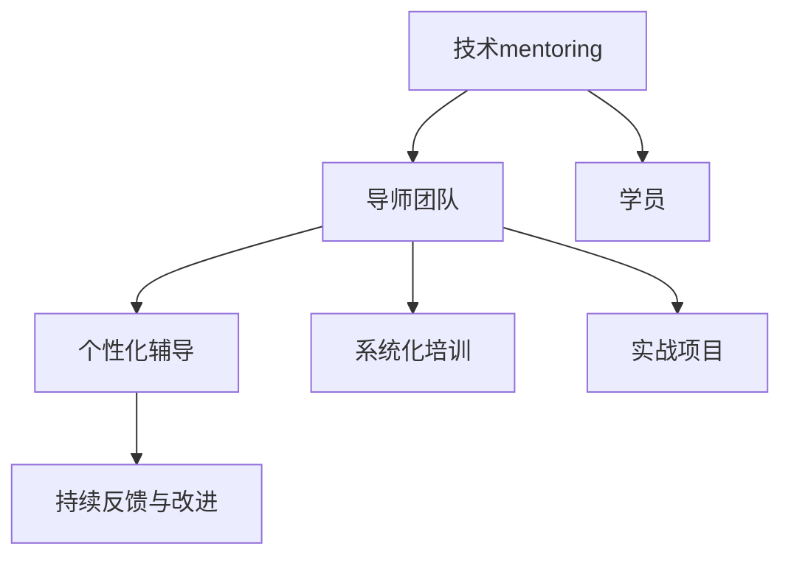

                 

# 技术mentoring：构建程序员成长加速器项目

## 1. 背景介绍

### 1.1 问题由来

随着技术的发展和应用领域的扩展，现代软件开发已经变得越来越复杂，团队协作和持续学习变得更加重要。然而，许多程序员尤其是新入行的新手在职业成长和发展上面临诸多挑战：

- **技术栈选择**：新技术层出不穷，如何快速掌握并应用到实际开发中？
- **项目管理和时间管理**：如何在短时间内高效完成复杂项目？
- **代码质量与维护**：如何编写高质量、易于维护的代码？
- **团队协作与沟通**：如何与其他团队成员高效协作，实现良好的沟通？
- **技术深度与广度**：如何平衡技术深度与广度，持续提升自我？

为了解决这些问题，技术mentoring项目应运而生，旨在通过系统的技术指导和导师的个性化辅导，帮助程序员快速提升技术能力，实现职业成长。

### 1.2 问题核心关键点

技术mentoring项目的关键点在于以下几个方面：

- **个性化辅导**：针对每位学员的技术水平、兴趣领域和职业目标，提供定制化的辅导方案。
- **系统化培训**：通过模块化、体系化的培训内容，帮助学员系统掌握技术和方法。
- **实战项目**：通过实际项目和任务，提升学员的实践能力和问题解决能力。
- **持续反馈与改进**：定期进行技术评估和反馈，持续改进和优化学习方案。
- **导师团队**：汇聚行业专家和资深工程师，提供权威和专业的指导。

## 2. 核心概念与联系

### 2.1 核心概念概述

为更好地理解技术mentoring项目，本节将介绍几个密切相关的核心概念：

- **技术mentoring**：通过经验丰富的导师指导和个性化辅导，帮助学员系统学习和实践新技术，提升技术能力。
- **导师团队**：由行业专家和资深工程师组成，提供权威的指导和支持。
- **个性化辅导**：根据学员的技术水平、兴趣和职业目标，定制个性化的学习方案。
- **系统化培训**：将技术内容模块化、体系化，便于系统学习和掌握。
- **实战项目**：通过实际项目和任务，提升学员的实践能力和问题解决能力。
- **持续反馈与改进**：定期评估和反馈，持续改进学习方案。

这些核心概念之间的逻辑关系可以通过以下Mermaid流程图来展示：



这个流程图展示了技术mentoring项目的主要流程：

1. 技术mentoring平台通过导师团队的指导，为学员提供个性化辅导。
2. 导师团队提供系统化培训，帮助学员掌握技术和方法。
3. 通过实战项目提升学员的实践能力。
4. 持续反馈与改进，不断优化学习方案。

这些概念共同构成了技术mentoring项目的基础框架，为提升程序员技术能力提供了有效途径。

## 3. 核心算法原理 & 具体操作步骤

### 3.1 算法原理概述

技术mentoring项目的设计原理可以概括为“授人以渔”，即通过系统的指导和实践，使学员能够自主学习和掌握技术。其核心思想是通过“知识+实践+反馈”的方式，提升学员的技术水平和解决问题的能力。

### 3.2 算法步骤详解

技术mentoring项目的具体实施步骤如下：

**Step 1: 需求分析与个性化定制**

1. 评估学员的技术水平、兴趣领域和职业目标。
2. 根据评估结果，制定个性化的学习方案。
3. 确定学习目标和里程碑，制定详细的学习计划。

**Step 2: 系统化培训与实践**

1. 将技术内容模块化、体系化，分为基础知识、进阶技术和实战项目。
2. 通过线上或线下的方式，逐步介绍和讲解模块内容。
3. 安排实践任务，如编码挑战、项目练习等，帮助学员巩固知识。

**Step 3: 实战项目与持续改进**

1. 根据学员的兴趣和目标，选择合适的实战项目。
2. 在项目实施过程中，定期进行技术评估和反馈。
3. 根据评估结果，调整学习方案，进行持续改进。

**Step 4: 持续反馈与改进**

1. 定期与学员进行技术交流和评估，了解学习效果。
2. 根据学员的反馈和评估结果，调整和优化学习方案。
3. 提供资源和工具，帮助学员自主学习和提升。

### 3.3 算法优缺点

技术mentoring项目的优点包括：

1. **系统性**：通过模块化、体系化的培训内容，帮助学员系统掌握技术。
2. **个性化**：根据学员的兴趣和目标，提供定制化的辅导方案。
3. **实战性**：通过实际项目和任务，提升学员的实践能力和问题解决能力。
4. **持续改进**：通过持续的反馈和改进，确保学习方案的有效性。

然而，该方法也存在一些局限性：

1. **资源投入高**：需要大量的导师团队和专业资源进行支持。
2. **学员自主性要求高**：需要学员具备较强的自主学习能力。
3. **学习周期较长**：系统化的培训和实战项目需要较长时间进行。
4. **效果因人而异**：不同学员的学习能力和兴趣不同，效果可能存在差异。

尽管如此，技术mentoring项目仍然是目前提升程序员技术能力最为有效的方法之一，尤其是在对新技术和新方法的掌握上。

### 3.4 算法应用领域

技术mentoring项目的应用领域非常广泛，涵盖了软件开发、数据分析、人工智能、网络安全等多个技术领域。以下是几个典型应用案例：

- **软件开发**：帮助新入行的开发人员掌握编程语言、框架和工具，提升代码质量和开发效率。
- **数据分析**：为数据分析师提供系统化的数据分析技能培训，掌握数据清洗、分析和可视化技术。
- **人工智能**：为人工智能工程师提供机器学习、深度学习和自然语言处理等技术指导，提升模型构建和优化能力。
- **网络安全**：为网络安全专家提供最新的安全技术和方法，提升安全防护和应急响应能力。

## 4. 数学模型和公式 & 详细讲解 & 举例说明

### 4.1 数学模型构建

技术mentoring项目的数学模型可以抽象为一个动态反馈系统，如图示：

$$
\begin{align*}
\text{学员技能} & \rightarrow \text{技术评估} \\
& \downarrow \text{个性化辅导} \\
\text{系统化培训} & \rightarrow \text{实战项目} \\
& \downarrow \text{持续反馈与改进} \\
\text{学员技能} & \rightarrow \text{技术评估}
\end{align*}
$$

其中，学员技能是系统的输入，通过技术评估得到学员的当前技术水平。然后根据评估结果，提供个性化辅导和系统化培训。通过实战项目和持续反馈，学员技能得到提升，再次进行技术评估，形成闭环。

### 4.2 公式推导过程

假设学员当前技能为 $S_0$，通过个性化辅导和系统化培训后，技能提升为 $S_1$。然后通过实战项目和持续反馈，技能进一步提升为 $S_2$。如此循环，直到达到设定的学习目标 $S_T$。

$$
S_{n+1} = f(S_n, \text{培训内容}, \text{实战项目}, \text{反馈与改进})
$$

其中 $f$ 为技术提升函数，表示在特定培训和实战下技能提升的速率。

### 4.3 案例分析与讲解

以软件开发领域的技术mentoring为例，我们可以分析其技术评估、个性化辅导、系统化培训和实战项目的关系。

1. **技术评估**：通过编程测验、代码评审等方式，评估学员的当前编程能力。
2. **个性化辅导**：根据评估结果，确定学员的技术短板，提供针对性的辅导。
3. **系统化培训**：将编程语言、框架和工具的知识分为基础知识、进阶技术和高级应用等模块，逐步介绍和讲解。
4. **实战项目**：安排具体项目，如开发一个小型应用、解决特定问题等，帮助学员应用所学知识。
5. **持续反馈与改进**：定期进行技术评估，了解学员的学习效果，根据反馈调整培训方案。

通过上述步骤，学员能够系统掌握编程技术，并在实际项目中不断提升和优化自己的编程能力。

## 5. 项目实践：代码实例和详细解释说明

### 5.1 开发环境搭建

在进行技术mentoring项目开发前，需要搭建开发环境。以下是使用Python和Django框架的开发环境配置流程：

1. 安装Python：从官网下载并安装最新版本的Python。
2. 安装虚拟环境：使用pip安装virtualenv，创建虚拟环境。
3. 安装Django：在虚拟环境中，使用pip安装Django。
4. 安装数据库：安装MySQL或PostgreSQL数据库。
5. 配置Django项目：创建Django项目，配置数据库连接和应用设置。

完成上述步骤后，即可在虚拟环境中进行技术mentoring项目的开发。

### 5.2 源代码详细实现

以下是一个基于Django框架的技术mentoring项目示例，详细介绍了导师团队、个性化辅导、系统化培训和实战项目的实现。

**导师团队模块**：

```python
# models.py
from django.db import models

class Instructor(models.Model):
    name = models.CharField(max_length=100)
    email = models.EmailField()
    subjects = models.ManyToManyField(Subject)

class Subject(models.Model):
    name = models.CharField(max_length=100)
    description = models.TextField()
```

**个性化辅导模块**：

```python
# views.py
from django.shortcuts import render
from .models import Instructor

def mentor(request):
    instructors = Instructor.objects.all()
    return render(request, 'mentor.html', {'instructors': instructors})
```

**系统化培训模块**：

```python
# models.py
from django.db import models

class Topic(models.Model):
    name = models.CharField(max_length=100)
    description = models.TextField()

class Module(models.Model):
    topic = models.ForeignKey(Topic, on_delete=models.CASCADE)
    name = models.CharField(max_length=100)
    content = models.TextField()

class Lesson(models.Model):
    module = models.ForeignKey(Module, on_delete=models.CASCADE)
    title = models.CharField(max_length=100)
    content = models.TextField()
```

**实战项目模块**：

```python
# models.py
from django.db import models

class Project(models.Model):
    name = models.CharField(max_length=100)
    description = models.TextField()
    instructor = models.ForeignKey(Instructor, on_delete=models.CASCADE)

class Task(models.Model):
    project = models.ForeignKey(Project, on_delete=models.CASCADE)
    title = models.CharField(max_length=100)
    content = models.TextField()
```

**持续反馈与改进模块**：

```python
# models.py
from django.db import models

class Feedback(models.Model):
    project = models.ForeignKey(Project, on_delete=models.CASCADE)
    feedback_text = models.TextField()
```

### 5.3 代码解读与分析

下面我们详细解读代码中的关键实现细节：

**导师团队模块**：

- 使用Django的Model类定义导师和学科模型，存储导师信息及其教授的学科。

**个性化辅导模块**：

- 在视图中展示所有导师信息，帮助学员选择导师。

**系统化培训模块**：

- 定义课程、章节和课时模型，存储课程结构信息。
- 提供课程和学习路径，帮助学员系统掌握技术。

**实战项目模块**：

- 定义项目和任务模型，存储项目和任务信息。
- 提供项目管理和任务分配，提升学员的实践能力。

**持续反馈与改进模块**：

- 定义反馈模型，记录学员对项目的反馈信息。
- 通过持续反馈，不断优化学习方案。

### 5.4 运行结果展示

运行上述代码，通过Django管理后台进行项目管理和任务分配，学员可以在线学习系统化培训，完成实战项目并提交反馈。系统会根据反馈不断优化学习方案，帮助学员提升技术水平。

## 6. 实际应用场景

### 6.1 软件开发团队培训

技术mentoring项目可以应用于软件开发团队的培训和技能提升。传统培训方式往往难以满足团队多样化的学习需求，通过技术mentoring项目，可以提供个性化的辅导和系统化的培训，提升团队的整体技术水平和协作效率。

**具体应用**：

- 技术评估：通过编程测验和代码评审，了解团队成员的编程能力和知识水平。
- 个性化辅导：根据评估结果，为每位成员提供个性化的辅导方案。
- 系统化培训：组织系统化的编程语言、框架和工具培训课程。
- 实战项目：安排实际开发项目，如开发应用、解决特定问题等。
- 持续反馈与改进：定期进行技术评估和反馈，持续改进学习方案。

### 6.2 企业新员工入职培训

技术mentoring项目也可以用于企业新员工的入职培训，帮助新员工快速适应企业文化和技术环境。

**具体应用**：

- 技术评估：通过编程测验和技能评估，了解新员工的技术水平和兴趣。
- 个性化辅导：根据评估结果，为新员工提供个性化的辅导和支持。
- 系统化培训：组织系统化的技术培训课程，帮助新员工掌握基本技术和方法。
- 实战项目：安排实际工作任务，帮助新员工应用所学知识。
- 持续反馈与改进：定期进行技术评估和反馈，持续改进培训方案。

### 6.3 高校计算机科学专业教育

技术mentoring项目还可以应用于高校计算机科学专业的教育，帮助学生系统掌握技术和方法，提升研究能力和实践能力。

**具体应用**：

- 技术评估：通过课程测验和项目评审，了解学生的技术水平和研究兴趣。
- 个性化辅导：根据评估结果，为每位学生提供个性化的辅导和支持。
- 系统化培训：组织系统化的课程和项目，帮助学生系统掌握技术和方法。
- 实战项目：安排科研和项目任务，帮助学生应用所学知识。
- 持续反馈与改进：定期进行技术评估和反馈，持续改进教学方案。

## 7. 工具和资源推荐

### 7.1 学习资源推荐

为帮助开发者系统掌握技术mentoring项目的理论基础和实践技巧，这里推荐一些优质的学习资源：

1. **《编程之道》系列书籍**：深入浅出地介绍了编程技术和方法，适合编程新手和进阶开发者阅读。
2. **《深度学习》课程**：斯坦福大学开设的深度学习课程，涵盖了深度学习的基础理论和实践技巧。
3. **《软件工程》课程**：麻省理工学院开设的软件工程课程，介绍了软件开发的最佳实践和方法。
4. **GitHub**：全球最大的开源社区，提供了大量的代码和项目资源，适合学习和实践新技术。
5. **Stack Overflow**：程序员问答社区，提供丰富的编程问题解答和经验分享，适合技术交流和学习。

通过这些资源的学习实践，相信你一定能够快速掌握技术mentoring项目的精髓，并用于解决实际的编程问题。

### 7.2 开发工具推荐

高效的开发离不开优秀的工具支持。以下是几款用于技术mentoring项目开发的常用工具：

1. **Jupyter Notebook**：开源的交互式编程环境，适合进行数据分析和实验。
2. **PyCharm**：功能强大的Python IDE，支持代码编写、调试和测试。
3. **Visual Studio Code**：轻量级代码编辑器，支持多种编程语言和框架。
4. **Git**：版本控制系统，适合代码管理和协作。
5. **Docker**：容器化技术，适合应用部署和扩展。

合理利用这些工具，可以显著提升技术mentoring项目的开发效率，加快创新迭代的步伐。

### 7.3 相关论文推荐

技术mentoring项目的研究涉及多个领域，包括教育技术、软件开发、人工智能等。以下是几篇奠基性的相关论文，推荐阅读：

1. **《技术引荐：提升程序员技术能力的方法》**：介绍了技术mentoring项目的基本概念和实施方法。
2. **《软件工程方法学》**：介绍了软件开发的最佳实践和方法，适合技术 mentoring项目的借鉴。
3. **《深度学习与教育技术》**：介绍了深度学习在教育中的应用，适合技术mentoring项目的参考。
4. **《人工智能辅助编程》**：介绍了人工智能在编程辅助中的应用，适合技术 mentoring项目的借鉴。

这些论文代表了大语言模型微调技术的发展脉络。通过学习这些前沿成果，可以帮助研究者把握学科前进方向，激发更多的创新灵感。

## 8. 总结：未来发展趋势与挑战

### 8.1 总结

本文对技术mentoring项目的实施方法和应用场景进行了全面系统的介绍。首先阐述了技术mentoring项目的设计原理和实施步骤，明确了其在提升程序员技术能力方面的独特价值。其次，通过数学模型和公式推导，对技术评估、个性化辅导、系统化培训和实战项目的流程进行了详细讲解，给出了完整的代码实现和运行结果展示。同时，本文还探讨了技术mentoring项目在软件开发、企业培训和高校教育中的应用前景，展示了其在技术培训领域的广泛适用性。最后，本文精选了技术 mentoring项目的各类学习资源，力求为读者提供全方位的技术指引。

通过本文的系统梳理，可以看到，技术mentoring项目为提升程序员技术能力提供了有效的途径，将在软件开发、企业培训、高校教育等多个领域发挥重要作用。未来，伴随技术的不断进步和应用场景的拓展，技术 mentoring项目必将迎来更广阔的发展空间。

### 8.2 未来发展趋势

展望未来，技术mentoring项目将呈现以下几个发展趋势：

1. **智能化技术应用**：引入人工智能和大数据分析技术，提供更加个性化和精准的辅导。
2. **多模态教学方式**：结合视觉、听觉和文本等多种教学方式，提升学员的学习效果和体验。
3. **在线学习平台**：构建在线学习平台，提供随时随地进行学习的机会，扩大覆盖面。
4. **混合学习模式**：结合在线和线下教学方式，提供灵活多样的学习选择。
5. **社交学习机制**：引入社交学习机制，促进学员之间的交流和协作。

这些趋势将进一步提升技术 mentoring项目的灵活性和实用性，满足不同学员的学习需求。

### 8.3 面临的挑战

尽管技术 mentoring项目已经取得了一定的成果，但在其推广和应用过程中，仍面临一些挑战：

1. **资源投入高**：需要大量的导师团队和专业资源进行支持，对企业和高校的资源投入要求较高。
2. **学员自主性要求高**：需要学员具备较强的自主学习能力和时间管理能力。
3. **学习效果因人而异**：不同学员的学习能力和兴趣不同，效果可能存在差异。
4. **反馈机制不完善**：需要建立完善的反馈机制，持续改进学习方案。

这些挑战需要通过优化教学方法和资源配置，提升学员的自主学习能力和反馈机制的完善性，逐步克服。

### 8.4 研究展望

面对技术 mentoring项目面临的挑战，未来的研究需要在以下几个方面寻求新的突破：

1. **智能化技术应用**：引入人工智能和大数据分析技术，提供更加个性化和精准的辅导。
2. **多模态教学方式**：结合视觉、听觉和文本等多种教学方式，提升学员的学习效果和体验。
3. **在线学习平台**：构建在线学习平台，提供随时随地进行学习的机会，扩大覆盖面。
4. **混合学习模式**：结合在线和线下教学方式，提供灵活多样的学习选择。
5. **社交学习机制**：引入社交学习机制，促进学员之间的交流和协作。

这些研究方向的探索发展，必将引领技术 mentoring项目迈向更高的台阶，为提升程序员技术能力提供更有效的途径。

## 9. 附录：常见问题与解答

**Q1: 技术mentoring项目能否适用于非技术岗位的员工？**

A: 技术 mentoring项目的设计理念不仅适用于技术岗位的员工，同样适用于需要提升技术能力的非技术岗位员工，如市场、产品、运营等岗位。通过系统化的培训和实战项目，帮助非技术岗位员工掌握相关技术，提升其技术能力和工作效率。

**Q2: 技术 mentoring项目是否需要投入大量的导师资源？**

A: 技术 mentoring项目确实需要投入大量的导师资源，但可以通过引入人工智能和大数据分析技术，降低对人力资源的依赖。此外，采用混合学习模式和在线学习平台，也可以减少线下培训的资源投入。

**Q3: 如何确保技术 mentoring项目的效果？**

A: 确保技术 mentoring项目的效果需要多方面的努力：
1. 选择合适的评估指标和评估方法，持续跟踪学员的学习效果。
2. 建立完善的反馈机制，及时获取学员的反馈和意见，不断改进学习方案。
3. 引入多样化的教学方法和工具，提升学员的学习体验和效果。
4. 定期组织知识分享和交流活动，促进学员之间的学习和合作。

**Q4: 技术 mentoring项目在实际应用中需要注意哪些问题？**

A: 技术 mentoring项目在实际应用中需要注意以下几个问题：
1. 明确学习目标和评估标准，确保项目有清晰的方向和标准。
2. 选择合适的教学方法和工具，提升学员的学习效果和体验。
3. 建立完善的反馈机制，及时获取学员的反馈和意见，不断改进学习方案。
4. 合理配置资源和人员，确保项目有足够的资源和支持。

通过这些措施，可以有效提升技术 mentoring项目的效果和可持续性。

通过本文的系统梳理，可以看到，技术 mentoring项目为提升程序员技术能力提供了有效的途径，将在软件开发、企业培训、高校教育等多个领域发挥重要作用。未来，伴随技术的不断进步和应用场景的拓展，技术 mentoring项目必将迎来更广阔的发展空间。只有不断探索和创新，才能使技术 mentoring项目在实际应用中发挥更大的价值。

---

作者：禅与计算机程序设计艺术 / Zen and the Art of Computer Programming

