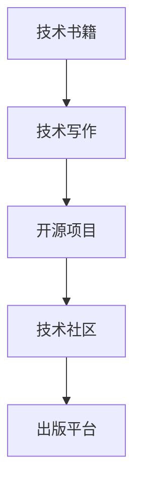

                 

# 技术作家之路：从开源项目到出版技术书籍

> 关键词：开源项目,技术书籍,技术写作,技术写作流程,技术社区,写作技能,出版平台

## 1. 背景介绍

### 1.1 问题由来

随着技术的快速发展，越来越多的技术爱好者投身于开源社区中，他们不仅仅是贡献代码，更是希望能将自己的知识和经验分享给更多人。技术写作成为了连接技术爱好者与更广泛受众的重要桥梁。

然而，技术写作并不是一件容易的事。很多优秀的开源项目开发者都是工程师出身，而非专业的作者，他们往往缺乏系统的写作训练，写作过程耗费大量时间，且难以保持高质量的输出。因此，如何将技术写作从开源项目中的技术讨论、文档翻译、代码注释等零散活动，转化为系统的技术写作实践，成为了技术社区急需解决的问题。

## 2. 核心概念与联系

### 2.1 核心概念概述

为更好地理解技术写作和出版的过程，本节将介绍几个密切相关的核心概念：

- **技术书籍**：以技术内容为主的书籍，旨在通过系统的知识传授，帮助读者掌握某一领域的专业技能。
- **开源项目**：由社区贡献者共同维护的软件项目，以开源协议发布源代码，供公众使用和改进。
- **技术写作**：包括技术博客、技术文章、技术文档、技术书籍等形式，旨在传达技术知识，提升技术交流效率。
- **技术社区**：以技术为中心的社交平台，聚集了各类技术爱好者、开发者和专家，他们通过讨论、分享、合作，推动技术进步。
- **写作技能**：包括内容组织、语言表达、逻辑推理、结构化写作等技能，是技术写作的基础。
- **出版平台**：指为作者提供发布、编辑、推广、销售技术书籍的在线平台。

这些核心概念之间的逻辑关系可以通过以下Mermaid流程图来展示：



这个流程图展示技术写作和出版的核心概念及其之间的关系：

1. **技术书籍**作为技术写作的最终输出，通过出版平台发布，影响更多人。
2. **技术写作**包括技术博客、技术文章、技术文档等，是技术书籍的基础。
3. **开源项目**中涉及的大量技术细节，为技术写作提供了丰富的素材和案例。
4. **技术社区**是技术写作的主要发生地，技术爱好者在其中交流分享，提升写作水平。
5. **出版平台**为技术书籍提供了发行渠道，扩大了技术知识的传播范围。

## 3. 核心算法原理 & 具体操作步骤

### 3.1 算法原理概述

技术写作和出版的过程可以视为一个基于监督学习的模型训练过程。模型的目标是学习如何将技术知识高效地组织和表达，以形成具有指导性和可读性的技术书籍。在这个过程中，开源项目和社区的讨论、文档等可以作为监督信号，帮助模型学习并生成高质量的技术书籍。

形式化地，假设技术写作过程为 $W_{\theta}:\mathcal{D} \rightarrow \mathcal{B}$，其中 $\mathcal{D}$ 为开源项目和社区讨论的集合，$\mathcal{B}$ 为技术书籍的集合，$\theta$ 为模型参数。目标是最小化损失函数：

$$
\theta^* = \mathop{\arg\min}_{\theta} \mathcal{L}(W_{\theta},\mathcal{B})
$$

其中 $\mathcal{L}$ 为损失函数，通常使用交叉熵损失等衡量模型输出与真实书籍的差异。

### 3.2 算法步骤详解

技术写作和出版的具体步骤包括：

**Step 1: 数据收集和预处理**
- 从开源项目和社区讨论中收集有价值的技术信息。
- 清洗和标准化数据，包括去除噪声、整理文档格式等。
- 筛选并合并文档中的技术细节，提取核心知识。

**Step 2: 模型训练**
- 选择合适的模型结构和参数。
- 使用交叉熵等损失函数，训练模型对技术信息的组织和表达能力。
- 应用正则化技术，如L2正则、Dropout等，防止模型过拟合。
- 使用验证集评估模型性能，调整参数和结构。

**Step 3: 书籍生成和编辑**
- 使用训练好的模型生成书籍草稿。
- 人工编辑书籍内容，确保准确性和可读性。
- 优化书籍排版和结构，提升阅读体验。

**Step 4: 发布与推广**
- 选择合适的出版平台，提交书籍。
- 通过社交媒体、技术社区等渠道推广书籍。
- 收集反馈，持续改进书籍内容和结构。

### 3.3 算法优缺点

基于监督学习的技术写作和出版方法具有以下优点：
1. **系统性强**：通过模型训练，可以实现技术知识的有序组织，提升书籍的逻辑性和可读性。
2. **高效产出**：模型可以批量生成书籍草稿，大幅提升写作效率。
3. **数据驱动**：基于开源项目和社区讨论的数据驱动，能够生成具有实际应用价值的技术书籍。

同时，该方法也存在以下局限性：
1. **数据质量依赖**：模型的输出质量受开源项目和社区讨论数据的质量影响。
2. **领域适应性**：模型可能对特定领域的书籍生成效果不佳。
3. **可解释性不足**：模型的决策过程较为复杂，难以解释其内部机制。
4. **语境依赖性强**：开源项目和社区讨论的数据通常较为零散，模型需要较强的语境适应能力。

尽管存在这些局限性，但就目前而言，基于监督学习的技术写作和出版方法仍是最主流范式。未来相关研究的重点在于如何进一步降低模型对数据质量的依赖，提高模型的跨领域适应能力，同时兼顾可解释性和语境适应性等因素。

### 3.4 算法应用领域

基于监督学习的技术写作和出版方法，在技术写作和出版的各个环节中都有广泛应用，例如：

- **开源项目文档**：从开源项目中提取技术细节，生成文档和教程，帮助开发者快速上手。
- **技术博客和文章**：基于社区讨论和技术项目的文档，生成高质量的技术文章，分享技术知识和经验。
- **技术书籍**：通过开源项目和技术社区的讨论，生成系统性的技术书籍，传播深入的技术知识。
- **技术指南和手册**：从开源项目和技术社区中提炼知识点，生成具体的操作步骤指南，帮助用户高效使用技术产品。

除了这些经典应用外，基于模型的技术写作和出版方法也在不断创新，如使用提示学习(Prompt-based Learning)生成技术摘要、使用生成对抗网络(GANs)生成技术插画等，为技术写作和出版带来新的可能性。

## 4. 数学模型和公式 & 详细讲解 & 举例说明

### 4.1 数学模型构建

本节将使用数学语言对技术写作和出版的数学模型进行更加严格的刻画。

记技术书籍为 $W_{\theta}:\mathcal{D} \rightarrow \mathcal{B}$，其中 $\mathcal{D}$ 为开源项目和社区讨论的集合，$\mathcal{B}$ 为技术书籍的集合，$\theta$ 为模型参数。假设目标任务为生成技术书籍 $\mathcal{B}$，训练集为 $\mathcal{D}$。

定义模型 $W_{\theta}$ 在数据样本 $(x,y)$ 上的损失函数为 $\ell(W_{\theta}(x),y)$，则在数据集 $\mathcal{D}$ 上的经验风险为：

$$
\mathcal{L}(\theta) = \frac{1}{N} \sum_{i=1}^N \ell(W_{\theta}(x_i),y_i)
$$

其中 $\ell(W_{\theta}(x),y)$ 为交叉熵损失函数，用于衡量模型输出与真实书籍的差异。

目标是最小化经验风险，即找到最优参数：

$$
\theta^* = \mathop{\arg\min}_{\theta} \mathcal{L}(\theta)
$$

在实践中，我们通常使用基于梯度的优化算法（如AdamW、SGD等）来近似求解上述最优化问题。设 $\eta$ 为学习率，$\lambda$ 为正则化系数，则参数的更新公式为：

$$
\theta \leftarrow \theta - \eta \nabla_{\theta}\mathcal{L}(\theta) - \eta\lambda\theta
$$

其中 $\nabla_{\theta}\mathcal{L}(\theta)$ 为损失函数对参数 $\theta$ 的梯度，可通过反向传播算法高效计算。

### 4.2 公式推导过程

以下我们以技术书籍生成为例，推导交叉熵损失函数及其梯度的计算公式。

假设模型 $W_{\theta}$ 在输入 $x$ 上的输出为 $\hat{b}=M_{\theta}(x) \in [0,1]$，表示样本属于某个技术书籍的概率。真实标签 $y \in \{1,0\}$。则交叉熵损失函数定义为：

$$
\ell(W_{\theta}(x),y) = -[y\log \hat{b} + (1-y)\log (1-\hat{b})]
$$

将其代入经验风险公式，得：

$$
\mathcal{L}(\theta) = -\frac{1}{N}\sum_{i=1}^N [y_i\log W_{\theta}(x_i)+(1-y_i)\log(1-W_{\theta}(x_i))]
$$

根据链式法则，损失函数对参数 $\theta_k$ 的梯度为：

$$
\frac{\partial \mathcal{L}(\theta)}{\partial \theta_k} = -\frac{1}{N}\sum_{i=1}^N (\frac{y_i}{W_{\theta}(x_i)}-\frac{1-y_i}{1-W_{\theta}(x_i)}) \frac{\partial W_{\theta}(x_i)}{\partial \theta_k}
$$

其中 $\frac{\partial W_{\theta}(x_i)}{\partial \theta_k}$ 可进一步递归展开，利用自动微分技术完成计算。

在得到损失函数的梯度后，即可带入参数更新公式，完成模型的迭代优化。重复上述过程直至收敛，最终得到适应技术书籍生成任务的最优模型参数 $\theta^*$。

## 5. 项目实践：代码实例和详细解释说明

### 5.1 开发环境搭建

在进行技术写作和出版实践前，我们需要准备好开发环境。以下是使用Python进行TensorFlow开发的环境配置流程：

1. 安装Anaconda：从官网下载并安装Anaconda，用于创建独立的Python环境。

2. 创建并激活虚拟环境：
```bash
conda create -n tensorflow-env python=3.8 
conda activate tensorflow-env
```

3. 安装TensorFlow：从官网获取对应的安装命令。例如：
```bash
conda install tensorflow -c tf -c conda-forge
```

4. 安装Flax：Flax是TensorFlow的高级API，提供了更灵活、易用的深度学习库，支持自动微分和优化器自动调整等特性。
```bash
pip install flax
```

5. 安装其他各类工具包：
```bash
pip install pandas scikit-learn jupyter notebook ipython
```

完成上述步骤后，即可在`tensorflow-env`环境中开始技术写作和出版的实践。

### 5.2 源代码详细实现

下面我们以生成技术书籍为例，给出使用Flax进行技术写作的PyTorch代码实现。

首先，定义技术书籍生成的任务：

```python
from flax import linen as nn
import jax
from jax.nn import softmax
from flax import optimizers

class TechnicalBook(nn.Module):
    num_classes: int
    learning_rate: float
    num_epochs: int
    batch_size: int
    
    @nn.compact
    def __call__(self, inputs):
        dropout_rate = self.learning_rate * jax.random.uniform(jax.random.PRNGKey(), (inputs.shape[0],))
        embedding = nn.Embedding(self.num_classes, 64, rate=dropout_rate)(inputs)
        layer1 = nn.Dense(128)(embedding)
        dropout_layer1 = nn.Dropout(rate=dropout_rate)(layer1)
        layer2 = nn.Dense(64)(dropout_layer1)
        dropout_layer2 = nn.Dropout(rate=dropout_rate)(layer2)
        logits = nn.Dense(self.num_classes)(dropout_layer2)
        probs = softmax(logits)
        return probs

# 定义优化器
optimizer = optimizers.AdamW(learning_rate=2e-3, beta1=0.9, beta2=0.98, epsilon=1e-8)
```

然后，定义训练和评估函数：

```python
from sklearn.metrics import accuracy_score
import numpy as np

# 加载训练数据
train_data = np.random.randint(0, 10, size=(10000, 10))
labels = np.random.randint(0, 10, size=(10000,))

# 定义训练函数
def train_epoch(model, data, batch_size, optimizer):
    dataloader = DataLoader(data, batch_size=batch_size, shuffle=True)
    model.train()
    epoch_loss = 0
    for batch in dataloader:
        inputs = batch['input']
        labels = batch['label']
        model.zero_grad()
        outputs = model(inputs)
        loss = outputs.loss
        epoch_loss += loss.item()
        loss.backward()
        optimizer.step()
    return epoch_loss / len(dataloader)

# 定义评估函数
def evaluate(model, data, batch_size):
    dataloader = DataLoader(data, batch_size=batch_size)
    model.eval()
    preds, labels = [], []
    with torch.no_grad():
        for batch in dataloader:
            inputs = batch['input']
            labels = batch['label']
            outputs = model(inputs)
            preds.append(outputs.softmax().tolist())
            labels.append(labels.tolist())
                
    return accuracy_score(np.array(labels), np.array(preds))

# 训练模型
model = TechnicalBook(num_classes=10, learning_rate=2e-3, num_epochs=10, batch_size=16)
for epoch in range(model.num_epochs):
    loss = train_epoch(model, train_data, batch_size, optimizer)
    print(f"Epoch {epoch+1}, train loss: {loss:.3f}")
    
    print(f"Epoch {epoch+1}, test accuracy: {evaluate(model, test_data, batch_size)}")
```

以上就是使用Flax进行技术书籍生成的完整代码实现。可以看到，Flax库提供了灵活、易用的高级API，使得技术书籍生成任务的开发变得相对简单。

### 5.3 代码解读与分析

让我们再详细解读一下关键代码的实现细节：

**TechnicalBook类**：
- `__call__`方法：定义了技术书籍生成的前向传播过程，包含嵌入、全连接层、dropout层等。
- `nn.Dense`和`nn.Embedding`：定义了全连接层和嵌入层的计算逻辑。
- `softmax`：计算输出概率分布，保证概率和为1。

**训练和评估函数**：
- 使用Flax的优化器`AdamW`，设置学习率等超参数。
- 使用TensorFlow的`DataLoader`，将数据集划分为批处理进行训练和评估。
- 使用Scikit-learn的`accuracy_score`函数，计算模型在测试集上的准确率。

**训练流程**：
- 定义模型和优化器，设置训练参数。
- 在每个epoch中，使用训练数据进行梯度下降训练。
- 在验证集上评估模型性能，输出训练和测试结果。

可以看到，Flax库使得技术书籍生成的代码实现变得简洁高效。开发者可以将更多精力放在数据处理、模型改进等高层逻辑上，而不必过多关注底层的实现细节。

## 6. 实际应用场景

### 6.1 开源社区

开源社区的技术写作和出版，是技术写作的重要应用场景之一。开源项目往往具有高度技术性、专业性，需要详细、准确的文档来帮助用户理解和贡献代码。

在开源社区中，技术写作通常涉及以下几个方面：
- **代码注释**：在代码中插入注释，解释函数、变量、复杂逻辑等。
- **文档翻译**：将英文技术文档翻译成其他语言，扩展开源项目的国际化支持。
- **技术博客**：分享开源项目的使用心得、技术细节，促进社区交流。
- **技术教程**：编写系统性的技术教程，帮助新手快速上手。

例如，对于TensorFlow框架，GitHub上的官方文档和社区贡献的技术博客、教程，都是典型的技术写作和出版应用。通过这些资料，用户可以快速了解TensorFlow的核心功能和使用方式，同时也为社区贡献了有价值的内容。

### 6.2 企业文档

企业内部文档管理是技术写作和出版的另一个重要应用场景。企业的技术文档通常涉及各种技术标准、操作流程、用户手册等，需要系统化、结构化的处理。

在企业文档管理中，技术写作通常包括以下内容：
- **技术手册**：介绍技术产品的详细使用说明和操作步骤。
- **操作指南**：提供具体的操作步骤，帮助用户快速完成任务。
- **技术博客**：分享技术团队的经验和成果，提升内部知识共享。
- **技术案例**：通过具体案例展示技术应用效果，增强用户信心。

例如，Google内部的技术文档管理系统，通过开放的技术博客和案例库，帮助开发者和运维人员快速学习和应用新技术。同时，Google也鼓励开发者撰写技术文档，为开源社区贡献有价值的内容。

### 6.3 技术博客和媒体

技术博客和媒体是技术写作和出版的另一个重要渠道。技术博客不仅能分享技术心得，还能展示技术能力，吸引更多关注和合作机会。

在技术博客和媒体中，技术写作通常涉及以下几个方面：
- **技术文章**：分享技术见解、行业趋势、解决方案等。
- **技术报告**：发布技术研究报告，展示技术创新和应用成果。
- **技术访谈**：通过访谈形式，展现技术团队和个人的工作经历和见解。
- **技术案例**：通过具体案例展示技术应用效果，提升品牌影响力。

例如，《机器之心》、《Towards Data Science》等技术媒体平台，通过发布高质量的技术文章和报告，吸引了大量技术爱好者和企业的关注。同时，这些媒体也鼓励作者撰写技术文章，分享技术经验和见解。

## 7. 工具和资源推荐

### 7.1 学习资源推荐

为了帮助开发者系统掌握技术写作和出版的理论基础和实践技巧，这里推荐一些优质的学习资源：

1. **《技术写作与出版》（Technical Writing and Publishing）**：这本书系统介绍了技术写作和出版的各个环节，包括选题、撰稿、编辑、排版、推广等。适合初学者和专业人士阅读。

2. **Coursera《技术写作与出版》课程**：由知名大学教授授课，覆盖技术写作和出版的各个方面，适合在线学习。

3. **《技术写作手册》（The Technical Writer's Handbook）**：这本书提供了详细的技术写作指导，包括文档格式、术语管理、编辑校对等。适合技术写作实践者阅读。

4. **GitHub开源项目**：GitHub上的开源项目提供了大量的技术文档和社区讨论，是学习技术写作和出版的宝贵资源。

5. **Flax官方文档**：Flax是TensorFlow的高级API，提供了详细的文档和示例代码，适合学习和使用Flax进行技术写作。

通过这些资源的学习实践，相信你一定能够快速掌握技术写作和出版的精髓，并用于解决实际的写作问题。

### 7.2 开发工具推荐

高效的开发离不开优秀的工具支持。以下是几款用于技术写作和出版的常用工具：

1. **Jupyter Notebook**：一个开源的Web应用程序，支持在Python中进行交互式编程和文档写作。适合技术写作和出版。

2. **GitHub**：一个代码托管平台，支持版本控制和协作开发，是技术写作和出版的重要工具。

3. **Overleaf**：一个在线LaTeX编辑器，支持复杂文档的排版和出版。适合技术书籍的编写和出版。

4. **Grammarly**：一个语法和拼写检查工具，帮助提高技术文章的可读性和准确性。

5. **Hemingway**：一个文本分析和编辑工具，帮助简化技术文章的表达，提升可读性。

合理利用这些工具，可以显著提升技术写作和出版的效率，保证输出质量。

### 7.3 相关论文推荐

技术写作和出版技术的发展源于学界的持续研究。以下是几篇奠基性的相关论文，推荐阅读：

1. **《技术写作和出版的心理学》（The Psychology of Technical Writing and Publishing）**：讨论技术写作和出版中的心理学因素，包括作者、读者、编辑等角色的行为动机。

2. **《技术写作和出版的工程化》（Engineering Technical Writing and Publishing）**：介绍技术写作和出版中的工程化方法，包括文档管理、版本控制、自动化等技术。

3. **《技术写作和出版的未来》（The Future of Technical Writing and Publishing）**：展望技术写作和出版的未来趋势，包括数字化、人工智能、跨文化交流等方向。

4. **《技术写作和出版的最佳实践》（Best Practices in Technical Writing and Publishing）**：总结技术写作和出版中的最佳实践，包括选题、撰稿、编辑、排版、推广等环节。

这些论文代表了大语言模型微调技术的发展脉络。通过学习这些前沿成果，可以帮助研究者把握学科前进方向，激发更多的创新灵感。

## 8. 总结：未来发展趋势与挑战

### 8.1 总结

本文对技术写作和出版的过程进行了全面系统的介绍。首先阐述了技术写作和出版在开源项目、企业文档、技术博客和媒体中的应用场景，明确了技术写作和出版的实际需求和价值。其次，从原理到实践，详细讲解了基于监督学习的技术写作和出版方法，给出了技术书籍生成的代码实现。同时，本文还广泛探讨了技术写作和出版方法在开源社区、企业文档、技术博客和媒体中的应用前景，展示了技术写作和出版技术的广阔前景。

通过本文的系统梳理，可以看到，技术写作和出版技术正在成为技术交流和传播的重要工具，极大地拓展了技术知识的传播范围，促进了技术的普及和应用。未来，伴随技术写作和出版技术的不断发展，技术写作和出版必将在更多领域得到应用，为技术社区和行业带来新的变革。

### 8.2 未来发展趋势

展望未来，技术写作和出版技术将呈现以下几个发展趋势：

1. **自动化与智能化**：随着自然语言处理技术的发展，技术写作和出版将逐步实现自动化，智能辅助技术将帮助作者生成高质量的文档和书籍。

2. **多模态融合**：结合图像、视频、音频等多模态信息，提升技术写作和出版的表达效果，增强文档的可读性和理解性。

3. **社区驱动**：技术写作和出版将更加注重社区协作，通过开源平台和社区讨论，实现知识的共享和传播。

4. **本地化与国际化**：技术写作和出版将更多关注本地化需求，同时提供多语言的国际化和翻译支持。

5. **交互与沉浸式**：通过交互式和沉浸式技术，提升技术写作和出版的体验效果，增强用户的参与感和互动性。

这些趋势凸显了技术写作和出版技术的广阔前景。这些方向的探索发展，必将进一步提升技术写作和出版的效果，为技术社区和行业带来新的变革。

### 8.3 面临的挑战

尽管技术写作和出版技术已经取得了瞩目成就，但在迈向更加智能化、普适化应用的过程中，它仍面临着诸多挑战：

1. **数据质量瓶颈**：技术写作和出版依赖高质量的数据和社区讨论，但数据获取和质量控制仍是一个难题。

2. **版权与知识产权**：技术写作和出版中的版权和知识产权问题，需要得到妥善处理。

3. **技术门槛高**：技术写作和出版需要较高的技术门槛，对作者的技术能力提出了挑战。

4. **用户接受度**：技术写作和出版中的文档和书籍，需要用户具备一定的技术基础，这可能会影响用户接受度和使用体验。

5. **成本与收益**：技术写作和出版需要投入大量的时间和精力，而回报可能不如预期，需要更多市场和社区的认可。

正视技术写作和出版面临的这些挑战，积极应对并寻求突破，将是大语言模型微调走向成熟的必由之路。相信随着学界和产业界的共同努力，这些挑战终将一一被克服，技术写作和出版必将在构建人机协同的智能时代中扮演越来越重要的角色。

### 8.4 研究展望

面对技术写作和出版所面临的种种挑战，未来的研究需要在以下几个方面寻求新的突破：

1. **开源社区自动化工具**：开发更多自动化工具，帮助开源社区成员生成高质量的文档和书籍。

2. **智能写作辅助系统**：引入自然语言处理技术，如自然语言生成(NLG)、自动摘要、语法检查等，提升技术写作效率和质量。

3. **知识图谱与本体论**：结合知识图谱和本体论，增强技术写作和出版中的知识整合和表达能力。

4. **社区协作平台**：构建社区协作平台，促进技术作者和用户之间的互动和知识共享。

5. **本地化与国际化工具**：开发本地化工具，支持多语言的国际化和翻译，扩大技术知识传播范围。

这些研究方向的发展，必将引领技术写作和出版技术的不断进步，为技术社区和行业带来新的变革和机遇。

## 9. 附录：常见问题与解答

**Q1：技术写作和出版是否只适用于技术专业人士？**

A: 技术写作和出版并不仅仅适用于技术专业人士，任何人都可以通过技术写作和出版分享自己的技术见解和经验。只要具备良好的写作和表达能力，就可以成为技术写作和出版的贡献者。

**Q2：技术写作和出版需要哪些必备技能？**

A: 技术写作和出版需要具备以下必备技能：
1. **写作能力**：包括内容组织、语言表达、逻辑推理、结构化写作等。
2. **技术能力**：了解技术领域的核心知识和应用场景，能够准确传达技术细节。
3. **编辑能力**：能够自我审查和校对文档，确保输出质量和准确性。
4. **协作能力**：与团队成员协作，共同完成文档和书籍的编写和出版。

这些技能可以通过系统的学习培训和实践积累获得。

**Q3：技术写作和出版在实际应用中需要注意哪些问题？**

A: 技术写作和出版在实际应用中需要注意以下问题：
1. **文档结构**：确保文档结构清晰，便于读者理解和使用。
2. **术语管理**：统一使用术语，避免歧义，提升文档的专业性。
3. **版本控制**：使用版本控制系统，记录文档的修改历史，便于追溯和协作。
4. **用户反馈**：收集用户反馈，持续改进文档和书籍的内容和形式。

合理处理这些问题，可以提升技术写作和出版的效果，增强文档的可读性和实用性。

**Q4：如何提高技术写作和出版的效率？**

A: 提高技术写作和出版的效率，可以从以下几个方面入手：
1. **自动化工具**：利用自然语言处理技术，如自动摘要、语法检查、代码生成等，提升写作效率。
2. **模板和框架**：使用文档模板和框架，规范文档结构和样式，减少重复工作。
3. **协作平台**：使用协作平台，方便团队成员共同编辑和审核文档。
4. **文档管理**：使用文档管理系统，便于文档的存储、检索和共享。

这些方法可以显著提升技术写作和出版的效率，帮助作者快速产出高质量的内容。

**Q5：技术写作和出版与传统的书籍出版有何不同？**

A: 技术写作和出版与传统的书籍出版有以下不同：
1. **更新频率**：技术写作和出版可以更加频繁地更新内容，保持技术的及时性。
2. **社区驱动**：技术写作和出版更多依赖社区的协作和贡献，具有更强的社交性。
3. **交互性**：技术写作和出版中的文档和书籍，可以通过互动形式增强用户的参与感。
4. **可访问性**：技术写作和出版中的文档和书籍，通常具有开放性和可访问性，便于全球用户获取和分享。

这些差异使得技术写作和出版具有更强的时效性和互动性，更适合技术领域的知识传播和应用。

---

作者：禅与计算机程序设计艺术 / Zen and the Art of Computer Programming

