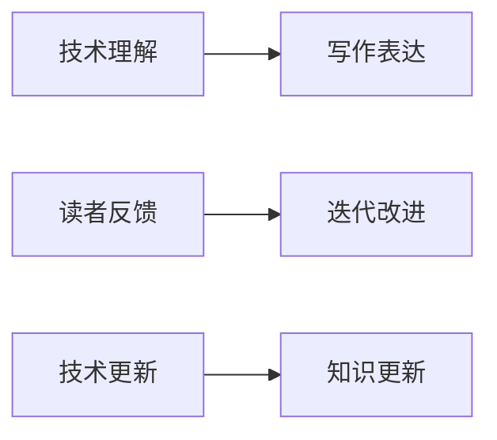

                 

# 技术写作：程序员的副业选择

> 关键词：技术写作, 程序员副业, 副业选择, 编程技能, 写作技巧, 职业发展, 兴趣驱动

## 1. 背景介绍

### 1.1 问题由来
在现代快节奏的互联网行业中，程序员常常面临着繁重的工作压力和持续的学习需求。随着技术的不断发展，单一技能树已经不再适应职业生涯的长远发展。同时，随着AI、大数据、云计算等领域的快速崛起，越来越多的机会开始涌现。

在这种背景下，很多程序员开始考虑通过副业来实现技能拓展和职业转型，其中技术写作成为了一个备受瞩目的选择。通过将编程技能和写作能力相结合，技术写作不仅能够增加收入来源，还能提升个人品牌和行业影响力。

### 1.2 问题核心关键点
选择技术写作作为程序员的副业，关键在于其能够将编程技能和写作能力相结合，产生1+1>2的效果。技术写作不仅要求写作者具备扎实的编程基础和丰富的行业经验，还需要良好的沟通能力、逻辑思维能力和语言表达能力。

技术写作的副业选择，既能发挥程序员的强项，又能创造有价值的输出。具体来说，其核心关键点包括：
- **技术深度与广度**：需要了解不同领域的核心技术和知识体系。
- **写作技巧与规范**：掌握高效的写作方法和行业标准。
- **沟通与表达**：能够清晰准确地传达技术知识。
- **市场需求与趋势**：了解不同类型技术写作的市场需求和未来发展趋势。

### 1.3 问题研究意义
技术写作不仅为程序员提供了一条扩展职业道路的新途径，还能通过不断学习和实践，提升自身的技术水平和写作能力。同时，技术写作的副业选择也符合当前互联网行业的发展趋势，通过创作有价值的内容，提升个人品牌价值和行业影响力，从而在竞争激烈的市场中脱颖而出。

## 2. 核心概念与联系

### 2.1 核心概念概述

技术写作是指将技术知识通过文字形式进行表达和传播的活动。其核心在于将复杂的、抽象的技术概念转化为易于理解和接受的内容，帮助读者快速掌握所需知识，促进技术知识的传播和应用。

技术写作要求写作者具备深厚的技术背景，能够理解技术的细节和应用场景，同时也需要出色的写作能力，能够清晰、准确地传达技术内容。

### 2.2 核心概念原理和架构的 Mermaid 流程图



这个流程图展示了技术写作的原理和架构：

1. **技术理解**：写作者需要深入理解技术的原理、实现和应用场景，这是技术写作的基础。
2. **写作表达**：将技术知识通过文字形式进行表达，使读者能够理解和接受。
3. **读者反馈**：通过读者反馈，评估技术写作的效果，进行改进。
4. **迭代改进**：根据反馈不断改进写作内容和表达方式。
5. **技术更新**：随着技术的发展，写作者需要不断更新自身的技术知识体系。

### 2.3 核心概念联系

技术写作与程序员的副业选择密切相关，具体体现在以下几个方面：

- **技能互补**：编程技能和写作技能的互补，使得程序员能够全面提升自身能力。
- **内容输出**：程序员可以输出技术文章、教程、博客等，建立个人品牌。
- **市场应用**：技术写作市场需求大，为程序员提供了多样化的副业选择。
- **职业发展**：技术写作不仅能增加收入，还能提升行业影响力，为职业发展提供新方向。

## 3. 核心算法原理 & 具体操作步骤
### 3.1 算法原理概述

技术写作的核心算法原理可以归结为信息传递和知识构建。其目标是将复杂的技术信息传递给读者，并通过不断的反馈和迭代，优化信息传递的效果，最终构建起对技术内容的系统性理解。

### 3.2 算法步骤详解

技术写作的具体操作步骤可以分为以下几个环节：

**Step 1: 主题选择与定位**
- 根据个人兴趣和市场需求，选择合适的技术主题。
- 了解目标读者的背景和需求，确定文章定位。

**Step 2: 信息收集与整理**
- 收集与主题相关的技术资料、文档、论文等。
- 整理和筛选资料，形成系统的知识体系。

**Step 3: 写作与表达**
- 根据目标读者的理解水平，选择合适的语言和表达方式。
- 采用清晰的结构、逻辑和示例，详细阐述技术原理和应用场景。

**Step 4: 读者反馈与迭代**
- 发布文章，收集读者的反馈和评论。
- 分析反馈，识别改进点，进行迭代优化。

**Step 5: 推广与扩展**
- 通过社交媒体、技术社区等渠道推广文章。
- 不断拓展写作领域，尝试不同类型和技术主题的文章。

### 3.3 算法优缺点

技术写作作为程序员的副业选择，其优点和缺点如下：

**优点**：
1. **技能提升**：通过写作和技术结合，提升自身的技术理解和表达能力。
2. **市场需求**：技术写作市场需求大，薪资待遇较为可观。
3. **职业发展**：通过写作建立个人品牌，提升行业影响力。
4. **自由度高**：写作时间灵活，适合有一定编程背景的自由职业者。

**缺点**：
1. **时间成本**：写作需要投入大量时间和精力，可能会影响主要工作。
2. **知识更新**：需要不断学习新技术，保持技术知识的最新性。
3. **市场竞争**：技术写作领域竞争激烈，需要不断提升写作和内容质量。
4. **反馈风险**：文章发布后可能会收到负面反馈，需要具备一定的心理承受能力。

### 3.4 算法应用领域

技术写作的应用领域非常广泛，涵盖以下几个主要方面：

1. **技术博客与文章**：撰写技术博客、技术文章、教程等，分享编程经验和技术知识。
2. **技术书籍**：编写技术书籍，深入讲解某个技术领域的核心知识和应用。
3. **技术文档与手册**：编写技术文档、API手册、用户手册等，帮助开发者快速上手。
4. **技术培训与讲座**：编写培训材料，进行线上线下技术讲座和培训。
5. **开源项目与社区**：参与开源项目，撰写文档和代码注释，推动社区发展。

## 4. 数学模型和公式 & 详细讲解 & 举例说明

### 4.1 数学模型构建

技术写作的数学模型主要涉及信息传递和知识构建。假设读者对某个技术的理解程度为 $x$，通过技术写作传递的知识为 $y$，则传递效果可以通过下面的函数模型来表示：

$$
y = f(x)
$$

其中 $f$ 为传递函数，$x$ 为读者的初始理解程度，$y$ 为写作传递的知识。

### 4.2 公式推导过程

为了简化问题，我们假设 $f$ 函数为一个线性函数，表示信息传递的线性关系。即：

$$
y = a \cdot x + b
$$

其中 $a$ 为传递系数，$b$ 为常数项。

通过分析读者的反馈和文章的受欢迎程度，我们可以对 $a$ 和 $b$ 进行估计。具体步骤如下：

1. 收集读者反馈数据，记录反馈评分和阅读次数。
2. 将反馈评分和阅读次数转化为传递效果 $y$。
3. 通过回归分析，估计传递系数 $a$ 和常数项 $b$。
4. 将估计的 $a$ 和 $b$ 值代入模型，评估未来的传递效果。

### 4.3 案例分析与讲解

假设我们撰写了一篇关于 Python 多线程编程的文章，发布在某个技术社区。我们可以通过以下步骤进行案例分析：

1. **数据收集**：记录文章发布后的阅读次数、评论数量、点赞数量等反馈数据。
2. **数据处理**：将反馈数据转化为传递效果 $y$，例如阅读次数作为 $y$，评论数量作为辅助数据。
3. **模型构建**：建立传递函数 $y = a \cdot x + b$，其中 $x$ 为阅读次数，$y$ 为传递效果。
4. **参数估计**：通过回归分析，估计传递系数 $a$ 和常数项 $b$。
5. **结果分析**：分析模型结果，优化文章的写作风格和内容，提升传递效果。

## 5. 项目实践：代码实例和详细解释说明

### 5.1 开发环境搭建

为了进行技术写作的实践，我们需要搭建一个适合技术写作的环境。以下是使用 Python 和 Markdown 的开发环境配置流程：

1. **安装 Python**：
   - 从官网下载并安装 Python，建议使用 Python 3.x 版本。
   - 配置环境变量，设置 Python 可执行路径。

2. **安装 Markdown 编辑器**：
   - 选择一款适合自己的 Markdown 编辑器，如 Visual Studio Code、Typora 等。
   - 安装对应的插件，支持代码高亮和公式渲染。

3. **安装 Git**：
   - 从官网下载并安装 Git，用于版本控制和代码协作。
   - 配置 Git 用户信息，进行代码仓库管理。

4. **配置 Git 协作平台**：
   - 选择 GitHub、Gitee 等协作平台，创建技术写作项目仓库。
   - 配置项目仓库的权限和协作工具。

### 5.2 源代码详细实现

下面以撰写一篇关于 Python 数据科学基础的文章为例，展示技术写作的代码实现。

首先，我们需要编写文章内容的 Markdown 格式文件，如 `data_science_basics.md`：

```markdown
# Python 数据科学基础

数据科学是当前最热门的领域之一，Python 在其中扮演了至关重要的角色。本文将介绍 Python 数据科学的基础知识，包括 NumPy、Pandas、Matplotlib 等核心库的使用方法。

## NumPy 基础

NumPy 是 Python 数据科学的核心库之一，提供了高效的多维数组操作和数学函数。以下是一个简单的 NumPy 数组示例：

```python
import numpy as np

# 创建数组
a = np.array([1, 2, 3])
b = np.array([[4, 5], [6, 7]])

# 数组运算
c = a + b
print(c)
```

输出：

```
[[5 7]
 [8 9]]
```

## Pandas 基础

Pandas 是 Python 数据处理的核心库，提供了 DataFrame 和 Series 两种数据结构，支持高效的数据操作和分析。以下是一个简单的 Pandas DataFrame 示例：

```python
import pandas as pd

# 创建 DataFrame
data = {'name': ['Alice', 'Bob', 'Charlie'], 'age': [25, 30, 35]}
df = pd.DataFrame(data)

# 数据操作
print(df)
```

输出：

```
   name  age
0  Alice   25
1    Bob   30
2  Charlie   35
```

## Matplotlib 基础

Matplotlib 是 Python 数据可视化的核心库，支持丰富的图表类型和自定义设置。以下是一个简单的 Matplotlib 折线图示例：

```python
import matplotlib.pyplot as plt

# 创建数据
x = [1, 2, 3, 4, 5]
y = [10, 8, 6, 4, 2]

# 绘制折线图
plt.plot(x, y)
plt.xlabel('X')
plt.ylabel('Y')
plt.title('Line Chart')
plt.show()
```

输出：


## 总结

本文介绍了 Python 数据科学的基础知识，包括 NumPy、Pandas、Matplotlib 等核心库的使用方法。希望读者能够通过本文，掌握 Python 数据科学的基础技能。

```

接下来，我们需要编写一个简单的 Python 脚本来生成 Markdown 文件和代码文件，并将其提交到 Git 仓库：

```python
# 生成 Markdown 文件
with open('data_science_basics.md', 'w') as f:
    f.write('...')  # 写入文章的 Markdown 内容

# 生成代码文件
with open('data_science_basics.py', 'w') as f:
    f.write('...')  # 写入文章的 Python 代码

# 提交到 Git 仓库
git add data_science_basics.md data_science_basics.py
git commit -m 'Add data science basics tutorial'
```

### 5.3 代码解读与分析

上述代码实现的主要功能是：

1. **生成 Markdown 文件**：使用 Python 代码块生成文章的 Markdown 内容。
2. **生成代码文件**：使用 Python 代码块生成文章的 Python 代码。
3. **提交到 Git 仓库**：将生成的 Markdown 文件和代码文件提交到 Git 仓库，进行版本控制。

这些代码的实现过程较为简单，但涉及了 Markdown 和 Python 代码的生成、版本控制等关键步骤，是技术写作实践的基础。

### 5.4 运行结果展示

运行上述代码，会生成一个 `data_science_basics.md` 和一个 `data_science_basics.py` 文件，并提交到 Git 仓库。读者可以在 Git 仓库中查看和编辑这些文件，进行进一步的修改和优化。

## 6. 实际应用场景

### 6.1 技术博客与文章

技术博客是程序员技术写作的主要形式之一。通过撰写技术博客，程序员可以分享自己的技术经验和心得，建立个人品牌。博客可以是独立的网站，也可以是平台上的专栏。

以下是一个技术博客的实际应用场景：

**场景**：李明是一位 Python 开发者，他在博客上撰写了一系列关于 Python Web 开发的教程。每篇文章详细讲解了一个具体的 Web 框架或技术点，包括使用方法、最佳实践和常见问题。

**效果**：通过撰写博客，李明不仅积累了丰富的技术内容，还吸引了大批 Python Web 开发者的关注和分享，提升了自己的行业影响力。

### 6.2 技术书籍与手册

技术书籍和手册是技术写作的高级形式，通常需要系统的规划和深入的研究。通过编写技术书籍或手册，程序员可以将复杂的技术内容系统化、结构化地呈现给读者，帮助他们深入理解和应用技术。

以下是一个技术书籍的实际应用场景：

**场景**：张华是一位机器学习工程师，他撰写了一本关于深度学习的技术书籍。书籍详细介绍了深度学习的基本原理、算法实现和应用案例，并附带大量的代码示例和实验数据。

**效果**：这本书成为深度学习领域的热销书籍，帮助许多初学者快速上手深度学习技术，提升他们的职业能力。

### 6.3 技术培训与讲座

技术培训和讲座是技术写作的实践形式之一，通过编写培训材料和进行技术讲座，程序员可以将自己的技术知识和经验分享给更多人，提升他们的技术水平。

以下是一个技术培训的实际应用场景：

**场景**：赵强是一位人工智能工程师，他受邀在某技术公司进行一次关于自然语言处理的讲座。讲座内容包括自然语言处理的基本概念、技术框架和应用案例，通过生动的实例演示和互动问答，吸引了众多技术人员的参与。

**效果**：通过讲座，赵强不仅展示了自己在自然语言处理领域的深入研究，还结识了许多同行，拓展了自己的技术人脉。

### 6.4 未来应用展望

随着技术写作领域的不断发展，未来技术写作将呈现以下几个趋势：

1. **内容多样化**：技术写作将涵盖更多类型的技术内容，如算法实现、架构设计、项目管理等。
2. **平台多样化**：技术写作将不仅仅局限于博客和书籍，还将拓展到视频、播客、直播等多种形式。
3. **协作化与社区化**：技术写作将更加注重社区协作和开源项目，通过集思广益，提升技术内容的质量和覆盖面。
4. **个性化与定制化**：技术写作将更加注重个性化和定制化，根据不同用户的需求，提供定制化的技术内容。
5. **国际化与本地化**：技术写作将更加注重国际化和技术内容的多语言支持，帮助不同语言和文化背景的读者理解和应用技术。

## 7. 工具和资源推荐

### 7.1 学习资源推荐

为了帮助程序员掌握技术写作的技能，以下是一些推荐的学习资源：

1. **博客与文章**：
   - [Towards Data Science](https://towardsdatascience.com)
   - [Medium](https://medium.com)
   - [掘金](https://juejin.cn)

2. **书籍与手册**：
   - 《Python数据科学手册》（Jake VanderPlas 著）
   - 《深度学习》（Ian Goodfellow 著）
   - 《算法图解》（Aditya Bhargava 著）

3. **在线课程与讲座**：
   - Coursera
   - Udemy
   - Bilibili

4. **技术社区与论坛**：
   - GitHub
   - Stack Overflow
   - Stack Exchange

### 7.2 开发工具推荐

为了提高技术写作的效率，以下是一些推荐的开发工具：

1. **Markdown 编辑器**：
   - Visual Studio Code
   - Typora
   - Atom

2. **版本控制工具**：
   - Git
   - GitHub
   - GitLab

3. **代码高亮与公式渲染**：
   - Pygments
   - MathJax

4. **协作工具**：
   - Slack
   - Trello
   - Asana

### 7.3 相关论文推荐

以下是一些推荐的技术写作相关论文，供读者深入学习和研究：

1. "How Not to Write Technical Blogs"（Michael Farthing）
2. "A Comparison of Technical Documentation Styles"（John Blockson）
3. "Technical Writing: A Foundation"（Elliot E. Fisher）

## 8. 总结：未来发展趋势与挑战

### 8.1 研究成果总结

本文详细介绍了技术写作作为程序员副业选择的重要意义和实现步骤。通过系统性的梳理和分析，帮助读者全面了解技术写作的原理和实践方法。

### 8.2 未来发展趋势

未来技术写作领域将呈现以下几个趋势：

1. **内容形式多样化**：技术写作将不再局限于传统的博客和书籍，而是涵盖更多形式，如视频、播客、直播等。
2. **平台多元化**：技术写作将通过更多平台进行传播，如社交媒体、技术社区、视频网站等。
3. **协作与社区化**：技术写作将更加注重社区协作和开源项目，形成更广泛的技术交流与分享。
4. **个性化与定制化**：技术写作将更加注重个性化和定制化，满足不同用户的需求。
5. **国际化与本地化**：技术写作将更加注重多语言支持，帮助不同语言和文化背景的读者理解技术内容。

### 8.3 面临的挑战

尽管技术写作作为程序员的副业选择前景广阔，但仍面临一些挑战：

1. **时间管理**：技术写作需要投入大量时间和精力，可能会影响主要工作。
2. **知识更新**：需要不断学习新技术，保持技术知识的最新性。
3. **市场竞争**：技术写作领域竞争激烈，需要不断提升写作和内容质量。
4. **反馈风险**：文章发布后可能会收到负面反馈，需要具备一定的心理承受能力。

### 8.4 研究展望

未来技术写作领域的研究方向将包括：

1. **自动化技术写作**：研究基于自然语言处理和机器学习的技术，自动生成高质量的技术文章。
2. **技术写作平台**：开发更加智能、高效的技术写作平台，帮助写作者进行内容创作和管理。
3. **技术写作社区**：建立技术写作社区，促进写作者之间的交流和协作。
4. **技术写作标准化**：制定技术写作的标准和规范，提升技术写作的质量和一致性。

## 9. 附录：常见问题与解答

### 附录 A: 技术写作如何提高编程技能？

**Q1: 技术写作对编程技能有提升吗？**

A: 技术写作能够促使写作者深入学习和理解技术内容，从而提高编程技能。通过撰写技术文章，写作者需要不断查阅资料、分析问题、解决问题，这本身就是一种锻炼编程能力的过程。

**Q2: 如何通过技术写作提升编程技能？**

A: 1. **学习新技术**：撰写关于新技术的文章，深入了解其原理和应用。
2. **解决实际问题**：撰写关于实际问题的文章，找到问题的解决方案。
3. **交流与讨论**：在技术社区中发布文章，与同行交流讨论，获取反馈。
4. **项目实践**：将文章中的技术内容应用到实际项目中，检验和优化。

### 附录 B: 如何选择合适的技术写作主题？

**Q1: 如何选择技术写作的主题？**

A: 选择技术写作的主题需要考虑以下几个因素：
1. **兴趣与热情**：选择自己感兴趣的技术领域，保持写作的动力和热情。
2. **市场需求**：选择市场需求大的技术主题，提高文章的阅读量和影响力。
3. **个人优势**：选择自己擅长的技术领域，发挥自身优势。
4. **创新与突破**：选择有创新性的技术主题，展示自己的独特见解。

**Q2: 如何不断拓展技术写作主题？**

A: 1. **关注技术趋势**：通过阅读技术博客、参加技术会议、订阅技术社区等方式，了解最新的技术趋势。
2. **扩展技术领域**：逐步拓展技术写作领域，尝试不同类型和技术主题的文章。
3. **参与开源项目**：参与开源项目，了解项目中的技术细节，获取写作素材。
4. **学习新技术**：通过学习新技术，不断丰富自己的技术知识库，拓展写作主题。

---

作者：禅与计算机程序设计艺术 / Zen and the Art of Computer Programming

