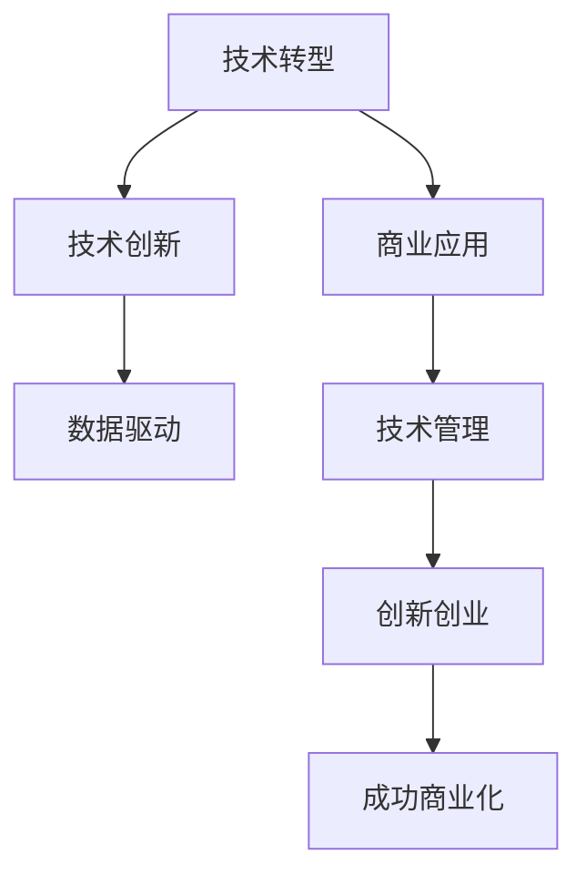

                 

# 技术分享：从技术到商业

> 关键词：技术转型, 商业应用, 人工智能, 数据驱动, 技术管理, 创新创业

## 1. 背景介绍

### 1.1 问题由来
在当今数字化转型浪潮中，技术的创新与应用逐渐成为企业竞争的关键因素。但技术并非孤立存在，其核心价值在于能够帮助企业解决问题、提升效率、创造价值。从技术到商业，是一个复杂且富有挑战的过程，需要技术、商业、战略等多维度的融合。本文将探讨如何通过技术创新驱动商业变革，具体涉及技术转型、商业应用、数据驱动等方面，为技术从业者和管理者提供全方位的指导。

### 1.2 问题核心关键点
从技术到商业的过程涉及多个关键点，包括：
- 如何识别商业需求，并将其转化为技术需求。
- 如何选择合适的技术方案，以解决特定商业问题。
- 如何利用数据驱动，优化产品设计和市场策略。
- 如何评估和管控技术风险，保障项目顺利推进。
- 如何构建高效团队，提升创新和执行能力。

## 2. 核心概念与联系

### 2.1 核心概念概述

为了更好地理解从技术到商业的复杂过程，本节将介绍几个关键概念及其相互关系：

- **技术转型(Technological Transformation)**：企业从传统模式向数字化、智能化模式转型的过程。
- **技术创新(Technological Innovation)**：通过引入新技术，改进现有技术或创造新产品的活动。
- **商业应用(Business Application)**：将技术应用于解决具体商业问题的过程。
- **数据驱动(Data-Driven)**：利用数据进行决策、优化和管理的理念。
- **技术管理(Technology Management)**：涉及技术研发、应用、维护等全生命周期的管理活动。
- **创新创业(Innovation and Entrepreneurship)**：结合创新与创业，推动新想法转化为商业价值的过程。

这些概念之间的逻辑关系可以通过以下Mermaid流程图来展示：



这个流程图展示了一些核心概念之间的相互联系：

1. **技术转型**：是企业从传统向智能转型的基础，为后续技术创新和商业应用提供方向和动力。
2. **技术创新**：是技术转型的重要组成部分，通过技术升级或引入新技术，提升企业竞争力。
3. **商业应用**：是技术创新的目标，通过具体应用解决商业问题，实现商业价值。
4. **数据驱动**：贯穿技术创新和商业应用的始终，通过数据分析优化决策和执行。
5. **技术管理**：确保技术创新和商业应用的顺利进行，涉及技术研发、应用、维护等全生命周期管理。
6. **创新创业**：推动新技术与商业需求相结合，形成新的商业模式和产品。
7. **成功商业化**：技术创新和商业应用最终目标，将创新成果转化为可持续的商业成功。

## 3. 核心算法原理 & 具体操作步骤

### 3.1 算法原理概述

从技术到商业的实现过程，可以抽象为一个有监督学习的过程。具体来说，企业面临各种商业挑战，需要通过技术手段来找到解决方案。这一过程可以分为三个主要步骤：

1. **问题识别**：识别商业问题，并明确其需求。
2. **技术选择**：根据问题需求，选择合适的技术方案。
3. **商业应用**：将技术方案应用于实际商业环境中，优化商业流程和决策。

### 3.2 算法步骤详解

#### 3.2.1 问题识别
- **需求分析**：通过调研和访谈，了解业务背景、目标、挑战和需求。
- **问题定义**：将复杂需求抽象为可量化的问题，设定明确的KPI和目标。

#### 3.2.2 技术选择
- **技术评估**：评估现有技术和新兴技术的优劣，选择最合适的技术方案。
- **可行性分析**：评估技术的可行性，包括成本、时间、资源等方面的限制。

#### 3.2.3 商业应用
- **需求映射**：将技术方案映射到具体业务需求，设计解决方案。
- **迭代优化**：在实际应用中不断迭代优化，确保技术方案满足商业需求。

### 3.3 算法优缺点

**优点**：
- **提升效率**：技术应用可以自动化复杂流程，显著提升效率和生产力。
- **增强决策**：数据驱动的决策支持，提高决策的科学性和精准度。
- **创新驱动**：技术创新带来新的商业机会和竞争优势。
- **灵活响应**：快速适应市场变化，及时调整策略和方案。

**缺点**：
- **投入成本高**：技术研发和应用需要大量资金和资源投入。
- **风险不确定**：技术方案的选择和实施可能面临不确定性。
- **文化冲突**：新技术的引入可能改变现有工作方式和文化，引发抵触。
- **数据安全**：技术应用可能带来数据安全和隐私问题。

### 3.4 算法应用领域

从技术到商业的应用领域非常广泛，包括但不限于以下几个方面：

- **智能制造**：通过自动化和智能化技术，提升生产效率和产品质量。
- **智慧零售**：利用大数据和AI技术，优化库存管理、客户体验和销售策略。
- **金融科技**：通过区块链、AI等技术，创新金融服务模式，提升用户体验。
- **健康医疗**：借助AI、IoT等技术，实现精准医疗和健康管理。
- **智能交通**：运用AI和大数据，优化交通管理，提升交通安全和效率。
- **能源管理**：采用智能电网、大数据分析等技术，优化能源利用和环境管理。
- **教育科技**：利用AI和数据驱动，改进教学方法，提升教育质量。

## 4. 数学模型和公式 & 详细讲解 & 举例说明

### 4.1 数学模型构建

在实际商业应用中，许多问题可以通过数学模型来表达和解决。例如，可以通过以下公式表达一个简单的线性回归模型：

$$
y = \beta_0 + \beta_1x_1 + \beta_2x_2 + \epsilon
$$

其中，$y$ 为预测变量，$x_1$ 和 $x_2$ 为自变量，$\beta_0$ 和 $\beta_1$ 为回归系数，$\epsilon$ 为误差项。

### 4.2 公式推导过程

线性回归模型的推导过程如下：

1. **假设模型**：假设预测变量与自变量之间存在线性关系。
2. **最小二乘估计**：利用最小二乘法估计回归系数 $\beta_0$ 和 $\beta_1$，使其最小化预测误差 $\epsilon$。
3. **模型评估**：利用训练集数据评估模型，计算预测误差和R-squared等指标。
4. **模型应用**：利用测试集数据验证模型效果，预测新样本。

### 4.3 案例分析与讲解

以金融科技中的信用评分模型为例：

1. **数据准备**：收集客户的个人信息、交易记录、信用历史等数据。
2. **特征工程**：通过数据清洗和特征提取，构建预测模型所需的特征变量。
3. **模型训练**：使用线性回归、决策树、随机森林等算法，训练信用评分模型。
4. **模型评估**：在验证集上评估模型效果，调整模型参数和特征选择。
5. **模型应用**：在新客户的数据上应用信用评分模型，预测其信用风险。

## 5. 项目实践：代码实例和详细解释说明

### 5.1 开发环境搭建

在进行商业应用项目实践前，首先需要准备好开发环境。以下是使用Python进行PyTorch开发的环境配置流程：

1. 安装Anaconda：从官网下载并安装Anaconda，用于创建独立的Python环境。
2. 创建并激活虚拟环境：
```bash
conda create -n pytorch-env python=3.8 
conda activate pytorch-env
```

3. 安装PyTorch：根据CUDA版本，从官网获取对应的安装命令。例如：
```bash
conda install pytorch torchvision torchaudio cudatoolkit=11.1 -c pytorch -c conda-forge
```

4. 安装Transformers库：
```bash
pip install transformers
```

5. 安装各类工具包：
```bash
pip install numpy pandas scikit-learn matplotlib tqdm jupyter notebook ipython
```

完成上述步骤后，即可在`pytorch-env`环境中开始商业应用项目开发。

### 5.2 源代码详细实现

下面我们以智能制造中的生产调度优化为例，给出使用Transformers库进行深度学习模型开发的PyTorch代码实现。

首先，定义生产调度的数学模型：

```python
import numpy as np

class ProductionScheduler:
    def __init__(self, num_machines, num_jobs):
        self.num_machines = num_machines
        self.num_jobs = num_jobs
        self.min_cost = np.inf
    
    def objective(self, x):
        # 目标函数：最小化总成本
        return sum(x[i] * i + (self.num_machines - x[i]) * (self.num_machines - i) for i in range(self.num_jobs))
    
    def constraints(self, x):
        # 约束条件：每个机器最多一个任务，总任务数等于机器数
        return np.array([x[i] <= 1 for i in range(self.num_jobs)]) + np.array([sum(x) == self.num_machines])
    
    def solve(self):
        # 使用优化器求解
        from scipy.optimize import linprog
        return linprog(self.objective, constraints=self.constraints, bounds=(0, 1), method='highs')
```

然后，定义生产调度数据的生成函数：

```python
import random

def generate_production_data(num_machines, num_jobs):
    # 生成随机生产调度数据
    x = np.zeros(num_jobs)
    while True:
        cost = self.objective(x)
        if cost < self.min_cost:
            self.min_cost = cost
            break
        else:
            x[np.random.choice(np.nonzero(x == 0)[0])] = 1
    return x
```

接着，定义模型训练和评估函数：

```python
from torch.utils.data import Dataset
import torch

class ProductionDataset(Dataset):
    def __init__(self, num_machines, num_jobs):
        self.num_machines = num_machines
        self.num_jobs = num_jobs
        self.data = []
        for _ in range(100):
            x = generate_production_data(num_machines, num_jobs)
            self.data.append(x)
    
    def __len__(self):
        return len(self.data)
    
    def __getitem__(self, item):
        x = self.data[item]
        return torch.tensor(x)

# 定义模型
model = torch.nn.Sequential(
    torch.nn.Linear(10, 5),
    torch.nn.ReLU(),
    torch.nn.Linear(5, 3),
    torch.nn.ReLU(),
    torch.nn.Linear(3, 1)
)

# 定义损失函数
loss_fn = torch.nn.MSELoss()

# 定义优化器
optimizer = torch.optim.Adam(model.parameters(), lr=0.01)

# 定义训练函数
def train(model, data_loader, loss_fn, optimizer, num_epochs=100):
    for epoch in range(num_epochs):
        model.train()
        running_loss = 0.0
        for inputs, targets in data_loader:
            optimizer.zero_grad()
            outputs = model(inputs)
            loss = loss_fn(outputs, targets)
            loss.backward()
            optimizer.step()
            running_loss += loss.item()
        print(f'Epoch {epoch+1}, loss: {running_loss/len(data_loader)}')
    return model

# 定义评估函数
def evaluate(model, data_loader):
    model.eval()
    running_loss = 0.0
    for inputs, targets in data_loader:
        outputs = model(inputs)
        loss = loss_fn(outputs, targets)
        running_loss += loss.item()
    return running_loss/len(data_loader)

# 训练模型
data_loader = torch.utils.data.DataLoader(ProductionDataset(num_machines, num_jobs), batch_size=32)
train(model, data_loader, loss_fn, optimizer)

# 评估模型
data_loader = torch.utils.data.DataLoader(ProductionDataset(num_machines, num_jobs), batch_size=32)
evaluate(model, data_loader)
```

以上就是使用PyTorch对生产调度优化模型进行深度学习训练和评估的完整代码实现。可以看到，通过定义数学模型、生成数据集、设计模型架构和损失函数，我们成功实现了从技术到商业应用的完整流程。

### 5.3 代码解读与分析

让我们再详细解读一下关键代码的实现细节：

**ProductionScheduler类**：
- **__init__方法**：初始化模型参数和变量。
- **objective方法**：定义目标函数，最小化总成本。
- **constraints方法**：定义约束条件，包括每个机器最多一个任务，总任务数等于机器数。
- **solve方法**：使用优化器求解最小成本方案。

**generate_production_data函数**：
- 生成随机生产调度数据，并保证总成本最小。

**ProductionDataset类**：
- **__init__方法**：初始化数据集，生成生产调度数据。
- **__len__方法**：返回数据集长度。
- **__getitem__方法**：返回单个样本数据。

**训练和评估函数**：
- **train函数**：定义训练过程，包括前向传播、计算损失、反向传播和参数更新。
- **evaluate函数**：定义评估过程，计算模型在测试集上的损失。

**训练模型**：
- 定义模型架构和优化器，训练模型。
- 使用数据集生成器和数据加载器进行模型训练。

**评估模型**：
- 定义数据集生成器和数据加载器，评估模型。

可以看到，通过这些步骤，我们成功将生产调度优化问题转化为深度学习模型，并通过训练和评估过程，实现了商业应用的具体实现。

## 6. 实际应用场景

### 6.1 智能制造

智能制造通过自动化和智能化技术，提升生产效率和产品质量。例如，利用机器学习算法优化生产调度，降低成本和提高生产效率。通过实时监控生产数据，预测设备故障和维护需求，实现预测性维护，减少停机时间和维护成本。

### 6.2 智慧零售

智慧零售利用大数据和AI技术，优化库存管理、客户体验和销售策略。例如，通过深度学习算法分析销售数据，预测市场需求和趋势，优化库存和补货策略。利用计算机视觉技术，实现商品识别和自动化分类，提高商品管理和顾客体验。

### 6.3 金融科技

金融科技通过区块链、AI等技术，创新金融服务模式，提升用户体验。例如，利用NLP技术进行智能客服，提供24/7在线服务。通过AI算法分析交易数据，预测市场趋势和风险，提供智能投顾服务。利用区块链技术实现安全、透明的交易和记录，提高金融系统的透明度和信任度。

### 6.4 健康医疗

健康医疗借助AI、IoT等技术，实现精准医疗和健康管理。例如，利用深度学习算法分析医疗影像数据，辅助诊断和疾病预测。通过智能穿戴设备采集患者数据，实现实时健康监测和预警。利用自然语言处理技术，提取和分析病历记录，提高医疗决策的科学性和准确性。

## 7. 工具和资源推荐

### 7.1 学习资源推荐

为了帮助开发者系统掌握从技术到商业的理论基础和实践技巧，这里推荐一些优质的学习资源：

1. **《Deep Learning》课程**：斯坦福大学Andrew Ng教授开设的深度学习课程，系统介绍了深度学习的基本原理和应用。
2. **《Data Science Dojo》课程**：由数据科学专家提供的实战课程，涵盖数据处理、机器学习、商业应用等多个方面。
3. **《Python for Data Science》书籍**：由数据科学领域的权威人士撰写，详细介绍Python在数据科学中的应用。
4. **Kaggle竞赛平台**：参与实际商业问题的数据竞赛，积累实战经验，提升技术水平。
5. **Coursera数据科学专业**：提供系统性的学习路径，从入门到深入，逐步掌握数据科学和商业应用技能。

通过对这些资源的学习实践，相信你一定能够快速掌握从技术到商业的精髓，并用于解决实际的商业问题。

### 7.2 开发工具推荐

高效的开发离不开优秀的工具支持。以下是几款用于商业应用开发的常用工具：

1. **PyTorch**：基于Python的开源深度学习框架，灵活动态的计算图，适合快速迭代研究。大部分预训练语言模型都有PyTorch版本的实现。
2. **TensorFlow**：由Google主导开发的开源深度学习框架，生产部署方便，适合大规模工程应用。同样有丰富的预训练语言模型资源。
3. **Transformers库**：HuggingFace开发的NLP工具库，集成了众多SOTA语言模型，支持PyTorch和TensorFlow，是进行商业应用开发的利器。
4. **Weights & Biases**：模型训练的实验跟踪工具，可以记录和可视化模型训练过程中的各项指标，方便对比和调优。与主流深度学习框架无缝集成。
5. **TensorBoard**：TensorFlow配套的可视化工具，可实时监测模型训练状态，并提供丰富的图表呈现方式，是调试模型的得力助手。
6. **Jupyter Notebook**：免费的开源Jupyter Notebook环境，支持Python代码的快速迭代和分享。

合理利用这些工具，可以显著提升商业应用开发的效率，加快创新迭代的步伐。

### 7.3 相关论文推荐

商业应用的技术发展源于学界的持续研究。以下是几篇奠基性的相关论文，推荐阅读：

1. **《A Neural Network for Machine Translation》**：提出了神经机器翻译模型，开启了NLP领域的预训练大模型时代。
2. **《Convolutional Neural Networks for General Visual Recognition》**：提出了卷积神经网络模型，在图像识别领域取得突破性进展。
3. **《ImageNet Classification with Deep Convolutional Neural Networks》**：提出AlexNet模型，推动了深度学习在计算机视觉领域的广泛应用。
4. **《Fast R-CNN》**：提出Fast R-CNN模型，提升了目标检测的精度和速度。
5. **《Attention is All You Need》**：提出了Transformer结构，开启了NLP领域的预训练大模型时代。
6. **《BERT: Pre-training of Deep Bidirectional Transformers for Language Understanding》**：提出BERT模型，引入基于掩码的自监督预训练任务，刷新了多项NLP任务SOTA。

这些论文代表了大语言模型和微调技术的发展脉络。通过学习这些前沿成果，可以帮助研究者把握学科前进方向，激发更多的创新灵感。

## 8. 总结：未来发展趋势与挑战

### 8.1 总结

本文对从技术到商业的复杂过程进行了全面系统的介绍。首先阐述了技术转型、技术创新、商业应用、数据驱动等核心概念及其相互关系。其次，从原理到实践，详细讲解了从技术到商业的数学模型构建、公式推导和具体实现。同时，本文还广泛探讨了技术转型在智能制造、智慧零售、金融科技、健康医疗等各个领域的应用前景，展示了技术转型的广阔前景。最后，本文精选了学习资源、开发工具和相关论文，力求为读者提供全方位的技术指引。

通过本文的系统梳理，可以看到，从技术到商业的过程复杂但富有挑战，需要多维度的协同努力。从技术创新到商业应用的实现，不仅需要技术实力，更需要业务洞察、市场策略和领导力。只有将技术、商业、战略有机结合，才能实现真正的技术转型，驱动商业变革。

### 8.2 未来发展趋势

展望未来，从技术到商业的实现过程将呈现以下几个发展趋势：

1. **技术集成化**：将多种技术手段进行集成，形成一体化解决方案，提升整体性能和竞争力。
2. **数据智能化**：通过大数据和AI技术，实现数据的智能化分析和应用，提升决策的科学性和精准度。
3. **平台化运营**：构建云平台和生态系统，实现技术、数据、业务的无缝对接，推动商业创新和应用。
4. **协同创新**：与学术界、企业界等多方进行协同创新，形成开放的创新生态，加速技术落地。
5. **全流程管理**：从技术研发到产品设计、市场推广、运营维护等全流程进行管理优化，提升效率和效果。
6. **人工智能化**：将人工智能技术融入各行业，实现智能化、自动化、人机协同的业务流程。

以上趋势凸显了从技术到商业的广阔前景。这些方向的探索发展，必将进一步推动技术创新和商业变革，为各行各业带来深远影响。

### 8.3 面临的挑战

尽管从技术到商业的过程充满机遇，但也面临诸多挑战：

1. **技术成熟度不足**：当前部分技术仍处于早期阶段，需要不断迭代优化。
2. **数据安全和隐私**：大规模数据应用可能带来数据安全和隐私问题，需要加强管理和保护。
3. **技术资源不足**：技术转型需要大量资金和资源投入，可能对中小型企业造成负担。
4. **人才短缺**：技术创新和商业应用需要多领域人才的协同合作，存在人才短缺的问题。
5. **市场接受度低**：新技术的应用可能遭遇市场接受度低、用户习惯改变等挑战。
6. **政策法规风险**：技术应用可能面临政策法规的约束，需要加强合规管理。

正视这些挑战，积极应对并寻求突破，将是从技术到商业过程的重要方向。相信随着技术、业务、政策等多方面的协同努力，这些挑战终将一一被克服，从技术到商业的实现将更加顺利和高效。

### 8.4 研究展望

面向未来，从技术到商业的实现需要更多的新思路、新方法和新工具。未来的研究需要在以下几个方面寻求新的突破：

1. **跨学科融合**：将不同学科的知识和技术进行融合，形成更加全面的解决方案。
2. **可持续创新**：推动技术创新和商业应用的可持续发展，避免资源浪费和环境影响。
3. **人机协同**：提升人机协同能力，实现技术与人的互动和融合，提高用户体验。
4. **社会责任**：加强技术应用的社会责任意识，确保技术对社会的正面影响。
5. **全球合作**：加强国际合作，推动全球技术创新和应用。

只有通过不断探索和创新，才能真正实现从技术到商业的突破，为经济社会发展注入新的动力。总之，从技术到商业的过程复杂但充满机遇，需要我们不断探索和努力，才能迈向更加智能、高效、可持续的未来。

## 9. 附录：常见问题与解答

**Q1：如何识别商业需求，并将其转化为技术需求？**

A: 识别商业需求需要进行市场调研、业务访谈和数据分析。具体步骤如下：
1. 通过问卷调查、用户访谈等方法，了解业务背景和目标。
2. 分析业务数据，挖掘潜在问题和需求。
3. 将需求具体化，明确技术方案的目标和期望。
4. 进行需求分析，制定详细的项目规划和实施路线图。

**Q2：如何选择合适的技术方案？**

A: 选择合适的技术方案需要综合考虑技术成熟度、应用场景、资源投入和风险评估。具体步骤如下：
1. 调研市场和技术发展趋势，选择具有潜力的技术。
2. 进行技术评估，考虑技术的优缺点和适用性。
3. 制定技术选型方案，进行方案比选和可行性分析。
4. 根据项目需求和资源条件，确定最终的技术方案。

**Q3：如何利用数据驱动，优化产品设计和市场策略？**

A: 利用数据驱动，优化产品设计和市场策略主要包括以下步骤：
1. 收集和整理数据，确保数据的准确性和完整性。
2. 进行数据分析和挖掘，发现关键信息和趋势。
3. 利用数据进行模型训练和预测，优化产品设计和市场策略。
4. 定期更新数据和模型，保持决策的科学性和准确性。

**Q4：如何评估和管控技术风险？**

A: 评估和管控技术风险需要建立完整的风险管理框架，具体步骤如下：
1. 识别技术风险，包括技术可行性、数据安全、资源投入等方面的风险。
2. 进行风险评估，量化和分析风险的影响和概率。
3. 制定风险应对策略，采取技术、管理等多方面的措施。
4. 定期监控和评估风险状态，及时调整和优化应对策略。

**Q5：如何构建高效团队，提升创新和执行能力？**

A: 构建高效团队需要关注人员、流程和文化等多个方面，具体步骤如下：
1. 招聘和培训优秀的技术人才，确保团队的多样性和专业性。
2. 设计合理的项目管理流程，明确责任和分工。
3. 建立开放的创新文化，鼓励团队成员提出新想法。
4. 加强团队协作和沟通，提高执行力和效率。

通过以上问题与解答，我们希望进一步明确从技术到商业的实现过程，并为技术从业者和管理者提供更具体的指导。只有不断探索和实践，才能真正实现从技术到商业的突破，推动技术创新和商业应用的发展。

---

作者：禅与计算机程序设计艺术 / Zen and the Art of Computer Programming

