                 

# 技术分享：从线下到线上的转变

> 关键词：数字化转型, 云计算, 人工智能, 大数据, 移动互联网, 自动化部署

## 1. 背景介绍

### 1.1 问题由来
在过去的几十年里，信息技术的发展极大地改变了各行各业的运作方式。从传统的线下业务到数字化转型，企业的经营模式经历了翻天覆地的变化。然而，随着技术的不断进步，传统的线下业务模式正面临着前所未有的挑战。尤其是在新冠疫情的冲击下，线上业务的重要性被进一步放大，数字化转型已经成为企业的必然选择。

数字化转型不仅改变了企业的内部运营，还极大地影响了企业的竞争力和市场份额。数字化转型使得企业能够更高效地利用资源，提升客户体验，加速产品和服务的迭代，从而在激烈的市场竞争中占据优势。因此，从线下到线上，不仅是业务模式的转变，更是企业战略的重大调整。

### 1.2 问题核心关键点
数字化转型的核心在于将传统业务在线化，利用数据和技术的力量，实现业务流程的自动化和优化。这涉及到以下几个关键点：

1. **云计算和基础设施**：云平台能够提供弹性的计算资源，支持大规模数据处理和存储，是数字化转型的基础设施。
2. **大数据与分析**：通过对海量数据的收集和分析，企业能够洞察业务趋势，做出更明智的决策。
3. **人工智能与机器学习**：利用AI技术，企业可以实现自动化决策、智能推荐、语音识别等，提升服务质量。
4. **移动互联网**：移动互联网技术使得企业能够触达更多用户，提供更加个性化和便捷的服务。
5. **自动化部署与运维**：通过DevOps和CI/CD，企业能够实现快速迭代和部署，保证系统稳定运行。

这些技术领域的突破和融合，共同推动了企业从线下到线上的转变，为企业带来了新的发展机遇。

## 2. 核心概念与联系

### 2.1 核心概念概述

数字化转型涉及多个技术概念，以下是对其中几个核心概念的概述：

- **云计算**：提供按需计算资源，支持弹性扩展，广泛应用于企业IT基础设施建设。
- **大数据**：收集、存储和分析海量数据，挖掘数据背后的价值，辅助决策。
- **人工智能与机器学习**：通过数据训练模型，实现自动化决策、预测和优化。
- **移动互联网**：基于移动设备的互联网服务，提供便捷、实时的信息交互。
- **自动化部署与运维**：通过DevOps实现持续集成和持续部署，保证系统快速稳定运行。

这些概念之间相互联系，共同构成了数字化转型的技术框架。

### 2.2 核心概念原理和架构的 Mermaid 流程图

```mermaid
graph TB
    C[云计算] --> A[基础设施] 
    C --> D[弹性和扩展]
    C --> E[按需计算]
    B[大数据] --> F[数据收集]
    B --> G[数据存储]
    B --> H[数据处理]
    B --> I[数据分析]
    A --> J[业务流程]
    A --> K[业务模型]
    A --> L[业务决策]
    A --> M[业务优化]
    A --> N[客户体验]
    A --> O[市场策略]
    N --> P[移动应用]
    L --> Q[自动化决策]
    L --> R[智能推荐]
    L --> S[预测分析]
    L --> T[优化策略]
    L --> U[个性化服务]
    K --> V[业务模型]
    K --> W[业务架构]
    K --> X[业务敏捷]
    K --> Y[业务创新]
    K --> Z[业务协同]
    K --> AA[业务治理]
    K --> BB[业务合规]
    L --> CC[数据驱动]
    L --> DD[实时响应]
    L --> EE[智能运营]
    L --> FF[客户洞察]
    A --> GG[自动化部署]
    A --> HH[持续集成]
    A --> II[持续部署]
    A --> JJ[DevOps]
    A --> KK[自动化运维]
    A --> LL[监控与告警]
    A --> MM[安全防护]
    A --> NN[备份与恢复]
    A --> OO[性能优化]
    A --> PP[成本控制]
    A --> QQ[风险管理]
    A --> RR[合规审计]
    A --> SS[数据安全]
    A --> TT[业务合规]
    A --> UU[法律合规]
    A --> VV[业务治理]
    A --> WW[业务智能]
    A --> XX[业务创新]
    A --> YY[业务协同]
    A --> ZZ[业务治理]
    A --> AAA[业务合规]
    A --> BBB[业务安全]
    A --> CCC[业务治理]
    A --> DDD[业务智能]
    A -->EEE[业务创新]
    A --> FFF[业务协同]
    A --> GGG[业务治理]
    A --> HHH[业务合规]
    A --> III[业务安全]
    A --> JJJ[业务治理]
    A --> KKK[业务智能]
    A --> LLL[业务创新]
    A --> MMM[业务协同]
    A --> NNN[业务治理]
    A --> OOO[业务合规]
    A --> PPP[业务安全]
    A --> QQQ[业务治理]
    A --> RRR[业务智能]
    A --> SSS[业务创新]
    A --> TTT[业务协同]
    A --> UUU[业务治理]
    A --> VVV[业务合规]
    A --> WWW[业务安全]
    A --> XXX[业务治理]
    A --> YYY[业务智能]
    A --> ZZZ[业务创新]
    A --> AAAA[业务协同]
    A --> BBBB[业务治理]
    A --> CCCC[业务合规]
    A --> DDDD[业务安全]
    A --> EEEEE[业务治理]
    A --> FFFFT[业务智能]
    A --> GGGG[业务创新]
    A --> HHHH[业务协同]
    A --> IIII[业务治理]
    A --> JJJJ[业务合规]
    A --> KKKK[业务安全]
    A --> LLLLL[业务治理]
    A --> MM[MNOP] --> NN[OQRS]
    A --> MM[OQRS] --> NN[MNOP]
```



通过上述流程图，可以清晰地看到云计算、大数据、人工智能等技术在数字化转型中的作用，以及它们如何相互协作，支持企业的数字化转型。

## 3. 核心算法原理 & 具体操作步骤
### 3.1 算法原理概述

从线下到线上转型的核心算法原理包括以下几个方面：

1. **云计算与基础设施**：采用云计算技术，企业能够按需获取计算资源，实现弹性和扩展。
2. **大数据与分析**：通过收集、存储和分析海量数据，企业可以洞察业务趋势，制定更精准的决策。
3. **人工智能与机器学习**：利用AI技术，企业可以实现自动化决策、预测和优化，提升业务效率。
4. **移动互联网**：移动互联网技术使得企业能够触达更多用户，提供个性化和便捷的服务。
5. **自动化部署与运维**：通过DevOps和CI/CD，企业可以实现快速迭代和部署，保证系统稳定运行。

### 3.2 算法步骤详解

数字化转型的具体操作步骤如下：

1. **评估现状**：对现有业务流程和IT系统进行全面评估，明确数字化转型的需求和目标。
2. **选择平台**：根据业务需求，选择合适的云计算平台和基础设施。
3. **数据整合**：整合企业内部和外部的数据，构建统一的数据平台。
4. **云计算部署**：将业务系统迁移到云计算平台，实现按需计算和弹性扩展。
5. **数据分析**：利用大数据技术，对数据进行收集、存储和分析，挖掘业务价值。
6. **人工智能应用**：引入AI技术，实现自动化决策、智能推荐等，提升服务质量。
7. **移动互联网**：基于移动互联网技术，提供便捷、实时的信息交互服务。
8. **自动化部署与运维**：通过DevOps和CI/CD，实现快速迭代和部署，保证系统稳定运行。
9. **安全防护**：采用安全防护措施，确保数据和系统的安全。
10. **持续优化**：根据业务反馈，持续优化系统和流程，提升业务效率和用户体验。

### 3.3 算法优缺点

数字化转型的主要优点包括：

1. **成本效益**：云计算和DevOps技术可以显著降低企业的IT成本，提升运营效率。
2. **灵活性**：云计算平台支持弹性扩展和按需计算，满足企业快速增长的业务需求。
3. **数据驱动**：大数据和AI技术可以挖掘数据价值，提供更精准的决策支持。
4. **用户体验**：移动互联网技术提供个性化和便捷的服务，提升用户体验。
5. **自动化**：DevOps和CI/CD技术可以实现自动化部署和运维，保证系统快速稳定运行。

数字化转型的主要缺点包括：

1. **技术复杂**：数字化转型涉及多个技术领域，需要综合技术能力。
2. **数据安全**：大量数据的收集和存储，带来数据安全和隐私保护的风险。
3. **文化和组织**：数字化转型需要组织和文化的变革，可能面临内部阻力。
4. **投资成本**：数字化转型需要大量的前期投资，可能对企业资金流造成压力。
5. **持续维护**：数字化系统需要持续维护和优化，保证系统稳定运行。

### 3.4 算法应用领域

数字化转型的应用领域非常广泛，涵盖多个行业和企业类型。以下是几个典型的应用场景：

1. **金融行业**：通过云计算和大数据技术，金融机构可以实现自动化风险管理、智能投资建议等，提升业务效率和客户体验。
2. **制造业**：通过AI和物联网技术，制造企业可以实现智能生产、预测维护等，提升生产效率和产品质量。
3. **零售业**：通过移动互联网和AI技术，零售企业可以实现个性化推荐、智能客服等，提升客户满意度和销售业绩。
4. **医疗健康**：通过大数据和AI技术，医疗机构可以实现精准医疗、智能诊断等，提升医疗服务水平。
5. **政府服务**：通过云计算和移动互联网技术，政府可以提供便捷、实时的公共服务，提升服务效率和公众满意度。

这些应用场景展示了数字化转型的广泛性和深度，为企业提供了大量的发展机会。

## 4. 数学模型和公式 & 详细讲解  
### 4.1 数学模型构建

数字化转型的数学模型构建包括以下几个方面：

1. **云计算成本模型**：基于云计算资源的消耗情况，构建计算成本模型，评估云计算的性价比。
2. **数据价值模型**：基于数据的质量和量级，构建数据价值模型，评估数据带来的商业价值。
3. **AI性能模型**：基于AI算法的性能和效率，构建AI性能模型，评估AI技术的效果。
4. **移动互联网用户模型**：基于用户的行为数据，构建移动互联网用户模型，预测用户需求和行为。
5. **自动化部署模型**：基于DevOps和CI/CD技术，构建自动化部署模型，优化部署效率和质量。

### 4.2 公式推导过程

以云计算成本模型为例，其公式推导过程如下：

设云计算成本为 $C$，单位计算时间为 $T$，每小时计算费用为 $P$，则有：

$$
C = P \times T
$$

其中 $T$ 为计算时间，可以通过业务系统的负载和并发情况来估算。

### 4.3 案例分析与讲解

假设某企业需要处理每天100万条数据记录，每条记录需要1秒的处理时间，每小时的计算费用为100元。则云计算成本为：

$$
C = 100 \times 1000000 \times 1 \times 0.01 = 10000元
$$

这仅为云计算成本的一个简单计算，实际的成本模型需要考虑更多的因素，如数据存储成本、网络传输成本等。

## 5. 项目实践：代码实例和详细解释说明
### 5.1 开发环境搭建

进行数字化转型的项目实践，需要搭建相应的开发环境。以下是Python开发的详细环境配置流程：

1. 安装Anaconda：从官网下载并安装Anaconda，用于创建独立的Python环境。

2. 创建并激活虚拟环境：
```bash
conda create -n pyenv python=3.8 
conda activate pyenv
```

3. 安装必要的Python库：
```bash
pip install pandas numpy matplotlib scikit-learn jupyter notebook
```

4. 安装云平台相关的库：
```bash
pip install boto3 awscli
```

5. 安装大数据和AI相关的库：
```bash
pip install pyspark dask apache-beam pytorch tensorflow
```

完成上述步骤后，即可在`pyenv`环境中开始项目开发。

### 5.2 源代码详细实现

下面以金融行业的风险管理系统为例，给出使用Python进行数字化转型的代码实现。

首先，定义数据处理函数：

```python
import pandas as pd
from datetime import datetime

def load_data(file_path):
    data = pd.read_csv(file_path)
    data['date'] = pd.to_datetime(data['date'])
    return data

def preprocess_data(data):
    data = data.dropna()
    data = data.sort_values(by='date')
    return data

def calculate_risk(data, threshold):
    risk = 0
    for i in range(len(data)-1):
        if data['value'][i+1] - data['value'][i] > threshold:
            risk += 1
    return risk / len(data)

def generate_report(data, risk):
    report = {'data': data.describe(), 'risk': risk}
    return report
```

然后，定义云计算和数据存储配置：

```python
import boto3

def configure云计算配置():
    ec2 = boto3.resource('ec2', region_name='us-west-2')
    instances = ec2.create_instances(
        ImageId='ami-0c55b159497dea8e8', 
        MinCount=1, 
        MaxCount=1, 
        InstanceType='t2.micro', 
        KeyName='my-key-pair'
    )
    return instances

def configure数据存储配置():
    s3 = boto3.client('s3', region_name='us-west-2')
    bucket_name = 'my-bucket'
    s3.create_bucket(Bucket=bucket_name)
    return bucket_name
```

接着，定义云计算资源使用和成本计算函数：

```python
def calculate云计算成本(instances):
    instance_type = instances[0].instance_type
    instance_count = len(instances)
    running_hours = 24 * 7 * 30 # 30天的运行时间
    cost_per_hour = 0.1 # 每小时计算费用
    total_cost = instance_count * running_hours * cost_per_hour
    return total_cost
```

最后，进行风险管理的数字化实践：

```python
data = load_data('financial_data.csv')
data = preprocess_data(data)
risk = calculate_risk(data, threshold=1000)
report = generate_report(data, risk)
print(report)

instances = configure云计算配置()
bucket_name = configure数据存储配置()
total_cost = calculate云计算成本(instances)
print(f'云计算成本为：{total_cost}元')

s3.upload_file('financial_data.csv', bucket_name, 'financial_data.csv')
```

以上就是使用Python进行金融行业风险管理数字化转型的完整代码实现。可以看到，云计算和数据存储技术极大地提升了数据处理和存储的效率，使得企业能够更快速地进行数据分析和决策。

### 5.3 代码解读与分析

让我们再详细解读一下关键代码的实现细节：

**load_data函数**：
- 从指定文件中加载数据，并转换为数据框。
- 将日期列转换为datetime类型，方便后续处理。

**preprocess_data函数**：
- 去除数据中的缺失值，并按照日期排序。

**calculate_risk函数**：
- 计算数据中连续两个数据点的价值变化是否超过设定的阈值，如果超过，则认为存在风险。
- 计算风险值，作为风险管理的依据。

**generate_report函数**：
- 生成数据统计和风险报告，供管理层决策参考。

**configure云计算配置函数**：
- 使用Boto3配置AWS EC2实例，实现弹性和扩展。

**configure数据存储配置函数**：
- 使用Boto3配置AWS S3存储桶，实现数据的高效存储和访问。

**calculate云计算成本函数**：
- 根据配置的实例数量、类型和运行时间，计算云计算成本。

这些函数共同构成了金融行业风险管理数字化转型的技术框架，展示了云计算和大数据技术的实际应用。

## 6. 实际应用场景
### 6.1 智能制造

智能化制造是数字化转型的重要应用领域之一。通过云计算和物联网技术，制造企业可以实现智能生产、预测维护等，提升生产效率和产品质量。

具体而言，可以通过IoT传感器实时采集设备状态和运行数据，利用大数据和AI技术进行数据分析和预测。例如，通过预测维护模型，可以预测设备故障，及时进行维护，减少停机时间。通过智能生产系统，可以根据订单需求，自动调整生产线和设备配置，提高生产效率。

### 6.2 智能零售

零售行业通过数字化转型，可以实现个性化推荐、智能客服、库存管理等，提升客户满意度和销售业绩。

具体而言，可以通过大数据分析客户行为和消费习惯，利用AI技术进行个性化推荐，提高客户购买率。通过智能客服系统，可以实现自然语言处理和智能对话，提升客户体验。通过库存管理系统，可以实现实时库存监控和需求预测，优化供应链管理。

### 6.3 智能医疗

医疗机构通过数字化转型，可以实现精准医疗、智能诊断等，提升医疗服务水平。

具体而言，可以通过大数据分析患者病历和医疗数据，利用AI技术进行疾病预测和智能诊断，提高诊断准确率和效率。通过智能医疗设备，可以实现远程监控和诊断，提高患者治疗效果。通过健康管理系统，可以实现患者健康数据管理和分析，提升健康水平。

### 6.4 未来应用展望

数字化转型将进一步深入各行各业，带来更多的创新应用。以下是几个未来的应用展望：

1. **智慧城市**：通过云计算和物联网技术，可以实现智能交通、智能安防、智慧环保等，提升城市管理水平和居民生活质量。
2. **智能金融**：通过大数据和AI技术，可以实现智能风控、智能投顾、智能客服等，提升金融服务质量和效率。
3. **智能农业**：通过物联网和AI技术，可以实现精准农业、智能灌溉、智能种植等，提升农业生产效率和产量。
4. **智能教育**：通过AI技术，可以实现智能辅导、智能评估、智能推荐等，提升教育质量和个性化学习体验。
5. **智能制造**：通过物联网和AI技术，可以实现智能生产、预测维护等，提升生产效率和产品质量。

这些应用展望展示了数字化转型的广阔前景，为各行各业带来了新的发展机遇。

## 7. 工具和资源推荐
### 7.1 学习资源推荐

为了帮助开发者系统掌握数字化转型的技术基础和实践技能，以下是一些优质的学习资源：

1. **《云计算基础》课程**：由知名大学开设的云计算入门课程，涵盖云计算基础概念、服务模型、部署架构等。
2. **《大数据技术与应用》书籍**：详细介绍了大数据的基本概念、技术和应用场景，适合初学者和中级开发者。
3. **《人工智能基础》课程**：介绍人工智能的基本概念、机器学习算法和深度学习技术，涵盖理论和实践。
4. **《移动互联网开发》课程**：讲解移动互联网的基本概念、开发工具和框架，适合Web开发工程师。
5. **《DevOps实践指南》书籍**：介绍了DevOps的基本概念、持续集成和持续部署工具，适合DevOps工程师。

通过学习这些资源，可以帮助开发者快速掌握数字化转型的关键技术，提高技术水平和实践能力。

### 7.2 开发工具推荐

高效的开发离不开优秀的工具支持。以下是几款常用的数字化转型开发工具：

1. **AWS云平台**：提供弹性计算、存储、数据库等服务，支持大规模数据处理和分析。
2. **Apache Spark**：分布式计算框架，支持大数据处理和分析，适合复杂数据集处理。
3. **TensorFlow**：开源机器学习框架，支持深度学习模型训练和部署，适合AI应用开发。
4. **Jupyter Notebook**：开源笔记本工具，支持Python、R等编程语言，适合数据科学和机器学习开发。
5. **Kubernetes**：容器编排工具，支持DevOps自动化部署和运维，适合微服务架构应用。

合理利用这些工具，可以显著提升数字化转型的开发效率，加速创新迭代的步伐。

### 7.3 相关论文推荐

数字化转型的核心技术涉及多个领域，以下是几篇奠基性的相关论文，推荐阅读：

1. **《云计算：分布式计算基础设施》论文**：介绍云计算的基本概念、技术架构和应用场景。
2. **《大数据技术》论文**：阐述大数据的基本概念、处理技术和应用场景。
3. **《人工智能与机器学习》论文**：介绍人工智能的基本概念、算法和应用场景。
4. **《移动互联网技术》论文**：介绍移动互联网的基本概念、开发技术和应用场景。
5. **《DevOps实践》论文**：介绍DevOps的基本概念、持续集成和持续部署技术。

这些论文代表了大数字化转型的技术发展脉络，为后续的研究和实践提供了理论基础。

## 8. 总结：未来发展趋势与挑战
### 8.1 研究成果总结

数字化转型是信息技术的必然趋势，其核心在于通过云计算、大数据、AI等技术手段，实现业务流程的自动化和优化。数字化转型不仅改变了企业的内部运营，还极大地影响了企业的竞争力和市场份额。

### 8.2 未来发展趋势

展望未来，数字化转型的主要趋势包括：

1. **云计算的普及和融合**：云计算将更加普及和深入，与其他技术如大数据、AI等融合，形成综合解决方案。
2. **数据驱动的决策**：大数据和AI技术将进一步提升数据的价值，成为企业决策的重要依据。
3. **智能自动化**：AI和自动化技术将进一步普及，实现更智能化的业务流程和管理。
4. **移动化和个性化**：移动互联网和个性化技术将进一步发展，提供更便捷、个性化的服务体验。
5. **生态系统的构建**：企业将更加重视生态系统的构建，通过开放平台和API，实现业务集成和协同。

### 8.3 面临的挑战

尽管数字化转型带来了诸多机遇，但也面临着诸多挑战：

1. **技术复杂性**：数字化转型涉及多个技术领域，需要综合技术能力。
2. **数据安全和隐私**：大量数据的收集和存储，带来数据安全和隐私保护的风险。
3. **文化和组织变革**：数字化转型需要组织和文化的变革，可能面临内部阻力。
4. **投资成本**：数字化转型需要大量的前期投资，可能对企业资金流造成压力。
5. **持续维护**：数字化系统需要持续维护和优化，保证系统稳定运行。

### 8.4 研究展望

面向未来，数字化转型研究需要在以下几个方面寻求新的突破：

1. **多技术融合**：探索云计算、大数据、AI等技术的深度融合，形成更加全面、高效的解决方案。
2. **数据驱动决策**：进一步提升大数据和AI技术的应用水平，提供更精准、实时的决策支持。
3. **智能自动化**：开发更加智能化的自动化系统，提高业务流程的效率和可靠性。
4. **数据安全与隐私**：研究数据安全和隐私保护的新技术和新方法，确保数据安全。
5. **组织变革**：探索数字化转型对组织文化的变革路径，推动企业内部的数字化转型。

这些研究方向的探索，将推动数字化转型的进一步发展，为各行各业带来更多的机遇和挑战。

## 9. 附录：常见问题与解答

**Q1：数字化转型的主要优势是什么？**

A: 数字化转型的主要优势包括：

1. **效率提升**：通过自动化和优化，提升业务效率和运营效益。
2. **成本降低**：降低IT成本，提升资源利用率。
3. **用户体验优化**：提供更加个性化和便捷的服务体验。
4. **决策支持**：通过大数据和AI技术，提供更精准、实时的决策支持。
5. **业务灵活性**：实现弹性和扩展，适应业务快速变化。

**Q2：如何进行云计算成本的评估？**

A: 云计算成本的评估可以通过以下几个步骤进行：

1. **配置云计算资源**：根据业务需求，配置云计算资源，如EC2实例、S3存储桶等。
2. **运行时间计算**：根据业务负载和并发情况，估算计算资源的运行时间。
3. **成本模型构建**：根据每小时计算费用，构建云计算成本模型。
4. **总成本计算**：根据配置的实例数量、类型和运行时间，计算云计算总成本。

**Q3：如何进行大数据价值的评估？**

A: 大数据价值的评估可以通过以下几个步骤进行：

1. **数据收集和处理**：从不同渠道收集和处理数据，形成完整的数据集。
2. **数据质量评估**：评估数据的完整性、准确性和可靠性。
3. **数据价值模型构建**：基于数据的量级和质量，构建数据价值模型。
4. **业务价值评估**：将数据价值转化为业务价值，评估数据带来的商业效益。

**Q4：如何进行AI技术的选型和应用？**

A: 进行AI技术的选型和应用可以通过以下几个步骤进行：

1. **需求分析**：明确业务需求和目标，选择适合的AI技术。
2. **模型构建**：根据业务需求，构建AI模型，选择合适的算法和框架。
3. **模型训练和优化**：使用业务数据进行模型训练和优化，提升模型效果。
4. **模型部署和监控**：将训练好的模型部署到生产环境，并进行实时监控和优化。

**Q5：如何进行DevOps的实践？**

A: 进行DevOps的实践可以通过以下几个步骤进行：

1. **持续集成和持续部署**：通过CI/CD工具，实现代码的自动化构建、测试和部署。
2. **自动化测试**：通过自动化测试工具，实现测试用例的自动化执行和验证。
3. **自动化运维**：通过自动化运维工具，实现系统的自动化部署、监控和故障排除。
4. **反馈和优化**：根据业务反馈，持续优化DevOps流程和工具，提高系统稳定性和效率。

这些问题的解答展示了数字化转型的关键技术和方法，为企业的数字化转型提供了参考和指导。

---

作者：禅与计算机程序设计艺术 / Zen and the Art of Computer Programming

