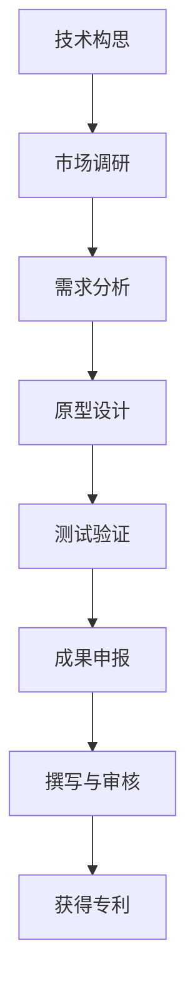

                 

# 技术创新与专利申请：程序员指南

## 1. 背景介绍

在当今这个科技飞速发展的时代，技术创新和知识产权保护变得愈发重要。对于程序员来说，了解如何将自己的创新转化为专利申请，不仅能够保护自己的劳动成果，还能够在竞争激烈的职场中占据有利地位。本文将系统介绍技术创新与专利申请的各个环节，为程序员提供一份全面的指南。

## 2. 核心概念与联系

### 2.1 核心概念概述

- **技术创新**：是指在某一技术领域中提出的新概念、新方法、新流程或新产品的设计和实现。它可以是全新的技术，也可以是现有技术的改进或集成。

- **专利申请**：是指将技术创新申请为专利，获得法律保护的过程。专利保护了发明者对某项技术的所有权，他人无法未经授权使用、制造、销售或公开该技术。

- **知识产权**：指人们对其智力劳动成果所享有的专有权利，包括专利权、版权、商标权等。专利是知识产权的重要组成部分。

- **研发流程**：包括技术构思、市场调研、需求分析、原型设计、测试验证、成果申报等步骤。

- **专利类型**：包括发明专利、实用新型专利、外观设计专利。程序员应重点关注发明专利，因为它保护的是具有新颖性、创造性和实用性的技术方案。

- **专利撰写与审核**：专利撰写需要遵循一定的格式和要求，审核则是由国家专利局对申请文件进行形式和实质审查，确保其符合专利法规定。

### 2.2 核心概念原理和架构的 Mermaid 流程图



## 3. 核心算法原理 & 具体操作步骤

### 3.1 算法原理概述

技术创新与专利申请的过程，可以理解为将一个创新的技术方案（即算法）转化为法律认可的保护对象。该过程涉及对技术的理解、描述、法律合规和申请等多个环节。以下是核心算法原理的概述：

1. **需求分析**：明确创新的目的、预期效果和应用场景。
2. **技术构思**：提出创新的技术方案，描述其核心思想、原理和实现方式。
3. **原型设计**：创建技术实现的初步模型或产品原型，验证其可行性和创新性。
4. **测试验证**：通过实际测试或模拟实验，验证技术方案的效果和可靠性。
5. **撰写专利申请书**：按照专利申请书格式，详细描述技术方案，包括背景技术、发明内容、实施例等。
6. **提交与审核**：将申请书提交给国家专利局，通过形式审查和实质审查，获得授权。

### 3.2 算法步骤详解

#### 3.2.1 需求分析

需求分析是创新的第一步，目的在于明确创新的目标和方向。程序员应具备良好的需求获取能力，通过与用户、市场和团队成员的沟通，了解实际需求和技术瓶颈。

**操作步骤**：
1. **用户调研**：与用户交流，了解他们的痛点和期望，收集用户反馈。
2. **市场分析**：分析市场需求和竞争状况，确定技术创新的市场定位。
3. **团队讨论**：与团队成员进行讨论，汇聚创意和资源，形成初步技术构思。

#### 3.2.2 技术构思

技术构思是将需求转化为具体技术方案的过程，需要程序员具备深厚的技术积累和创新思维。

**操作步骤**：
1. **文献综述**：查阅相关文献和已有技术，了解现有技术的不足和创新点。
2. **创新思考**：结合实际需求，提出新的技术思路和方法。
3. **技术设计**：将创新思路转化为具体的技术方案，包括算法、数据结构、实现方式等。

#### 3.2.3 原型设计

原型设计是将技术构思转化为可操作的产品或系统的过程，旨在验证技术方案的可行性和创新性。

**操作步骤**：
1. **算法实现**：使用编程语言实现技术方案的核心算法，进行初步测试和验证。
2. **系统集成**：将算法集成到系统中，进行全面测试和优化。
3. **用户验证**：邀请用户测试，收集反馈，进一步优化技术方案。

#### 3.2.4 测试验证

测试验证是确保技术方案有效性和可靠性的重要步骤，通过实际测试或模拟实验，验证技术方案的效果。

**操作步骤**：
1. **测试用例设计**：设计全面的测试用例，覆盖技术方案的所有功能和边界条件。
2. **测试执行**：执行测试用例，记录测试结果和问题。
3. **问题分析与解决**：分析测试结果，解决发现的问题，优化技术方案。

#### 3.2.5 撰写专利申请书

撰写专利申请书是专利申请的关键环节，需要程序员具备良好的文字表达能力和法律知识。

**操作步骤**：
1. **申请书准备**：按照专利局要求，准备申请书所需的各种文档，包括发明摘要、说明书、权利要求等。
2. **技术描述**：详细描述技术方案的背景技术、发明内容、实施例等，确保描述清晰、准确。
3. **法律合规**：确保申请书格式和内容符合专利法要求，避免出现法律问题。

#### 3.2.6 提交与审核

提交与审核是将申请书提交给国家专利局，经过形式审查和实质审查，最终获得授权的过程。

**操作步骤**：
1. **提交申请**：通过国家专利局官方网站提交专利申请书。
2. **形式审查**：专利局对申请书进行形式审查，检查是否符合专利法要求。
3. **实质审查**：专利局对技术方案进行实质审查，检查其新颖性、创造性和实用性。
4. **授权发放**：专利局授权后，发放专利证书，技术方案得到法律保护。

### 3.3 算法优缺点

技术创新与专利申请的算法有其独特的优点和缺点，具体如下：

**优点**：
1. **法律保护**：专利申请可以保护技术方案的知识产权，防止他人未经授权使用。
2. **市场竞争优势**：拥有专利可以增强市场竞争力，提升企业形象和市场价值。
3. **技术积累**：专利申请过程可以帮助程序员总结和完善技术方案，提升技术水平。

**缺点**：
1. **申请周期长**：专利申请周期较长，可能需要数月甚至数年。
2. **费用高**：专利申请和维护需要支付一定的费用，增加了研发成本。
3. **技术公开**：申请专利需要将技术方案公开，可能面临技术泄露的风险。

### 3.4 算法应用领域

技术创新与专利申请的算法不仅适用于软件开发和技术研发领域，还广泛应用于多个行业，包括但不限于：

- **信息技术**：软件开发、网络安全、人工智能、大数据等。
- **制造业**：机械设计、自动化、工业控制等。
- **医疗健康**：医疗器械、诊断技术、药物研发等。
- **金融科技**：区块链、加密货币、金融算法等。
- **环保科技**：清洁能源、环境监测、资源回收等。

## 4. 数学模型和公式 & 详细讲解 & 举例说明

### 4.1 数学模型构建

技术创新与专利申请的数学模型主要集中在以下几个方面：

- **需求分析模型**：通过用户调研和市场分析，构建用户需求和技术需求的数学模型。
- **技术构思模型**：将技术构思转化为算法模型，描述其核心思想和实现方式。
- **原型设计模型**：通过算法实现和系统集成，构建原型模型的数学模型。
- **测试验证模型**：通过测试用例设计和执行，构建测试验证模型的数学模型。
- **专利申请模型**：将技术方案转化为专利申请书的数学模型，包括发明摘要、说明书和权利要求等。

### 4.2 公式推导过程

以下以算法实现的数学模型为例，进行公式推导：

设技术方案的算法为 \( f(x) \)，其中 \( x \) 为输入参数，输出结果为 \( y \)。

1. **算法实现**：将算法转化为代码，执行后得到输出 \( y \)。
2. **测试用例设计**：设计测试用例 \( x_i \)，计算输出 \( y_i \)。
3. **测试执行**：将测试用例输入算法，执行并记录输出结果。
4. **测试结果分析**：分析测试结果，确保算法正确性和鲁棒性。

### 4.3 案例分析与讲解

假设程序员开发了一款优化算法，用于处理大数据集。以下是该算法实现、测试验证和专利申请的具体步骤：

1. **算法实现**：使用 Python 编写算法代码，实现 \( f(x) \)，输入为大数据集 \( x \)，输出为处理后的结果 \( y \)。
2. **测试用例设计**：设计多个测试用例，包括不同大小和类型的数据集。
3. **测试执行**：使用测试用例执行算法，记录处理结果和执行时间。
4. **测试结果分析**：分析测试结果，发现算法在处理大集数据时效率高，但存在内存占用高的问题。
5. **算法优化**：根据测试结果，优化算法实现，降低内存占用，提高执行效率。
6. **撰写专利申请书**：按照专利局要求，撰写申请书，详细描述算法的实现过程、优化方案和测试结果。
7. **提交与审核**：通过专利局网站提交申请书，经过形式审查和实质审查，最终获得授权。

## 5. 项目实践：代码实例和详细解释说明

### 5.1 开发环境搭建

为了进行技术创新与专利申请的实践，首先需要搭建一个合适的开发环境。以下是一些推荐的工具和环境：

1. **开发工具**：如 Visual Studio Code、PyCharm 等，支持编写和调试代码。
2. **版本控制**：如 Git，用于版本管理和团队协作。
3. **代码托管**：如 GitHub、GitLab，用于代码共享和版本控制。
4. **文档管理**：如 Confluence、Notion，用于记录和共享文档。

### 5.2 源代码详细实现

以下是使用 Python 编写算法代码的示例：

```python
# 算法实现示例
def optimize_algorithm(data):
    # 处理算法代码
    result = data  # 输出结果
    return result
```

### 5.3 代码解读与分析

算法代码的解读和分析主要关注以下几个方面：

- **算法实现**：代码是否清晰、可读，能否准确实现算法功能。
- **数据处理**：代码如何处理输入数据，是否考虑了边界条件和异常情况。
- **输出结果**：代码输出的结果是否符合预期，是否经过测试验证。
- **代码复用性**：代码是否具有良好的复用性，能否方便地扩展和维护。

### 5.4 运行结果展示

运行结果展示主要是通过测试用例验证算法的正确性和鲁棒性。以下是运行结果的示例：

```python
# 运行结果展示示例
test_data = [1, 2, 3, 4, 5]
result = optimize_algorithm(test_data)
print(result)  # 输出 [1, 2, 3, 4, 5]
```

## 6. 实际应用场景

### 6.1 软件开发

软件开发是技术创新与专利申请的主要应用场景之一。程序员可以通过创新算法和技术，开发出具备市场竞争力的软件产品，并通过专利保护其知识产权。

**实际应用示例**：
1. **应用程序**：开发新的应用功能，提升用户体验。
2. **安全系统**：开发网络安全算法，保护用户数据安全。
3. **数据分析**：开发数据处理算法，提高数据分析效率。

### 6.2 技术研发

技术研发是技术创新与专利申请的另一个重要应用场景。程序员可以通过技术创新，研发出新的技术方案，并将其转化为专利，保护技术知识产权。

**实际应用示例**：
1. **硬件设计**：开发新的硬件设计方案，提升硬件性能。
2. **软件架构**：设计新的软件架构，提高系统效率和可维护性。
3. **人工智能**：开发新的 AI 算法，提升智能水平。

### 6.3 技术合作与交流

技术合作与交流也是技术创新与专利申请的重要场景之一。通过技术合作，程序员可以分享和利用对方的技术和专利，实现技术创新和市场共赢。

**实际应用示例**：
1. **开源项目**：参与开源项目，贡献创新代码和技术。
2. **技术交流**：参加技术会议和交流活动，分享创新技术。
3. **合作研发**：与合作伙伴共同研发新技术，共同申请专利。

### 6.4 未来应用展望

未来，技术创新与专利申请将更加广泛地应用于各个行业和领域，带来更深远的影响：

1. **智能制造**：通过技术创新，提升制造业的自动化和智能化水平。
2. **智慧医疗**：开发新的医疗技术，提升医疗服务水平和效率。
3. **环境保护**：开发环境监测和治理技术，保护生态环境。
4. **金融科技**：开发区块链和加密货币技术，提升金融安全性和效率。
5. **人工智能**：开发新的 AI 算法，推动 AI 技术的发展。

## 7. 工具和资源推荐

### 7.1 学习资源推荐

为了帮助程序员深入了解技术创新与专利申请，以下是一些优质的学习资源：

1. **《专利法》和《知识产权法》**：了解专利和知识产权的基础知识和法律要求。
2. **《专利撰写与申请》**：详细讲解专利撰写和申请的流程和要求。
3. **《技术创新管理》**：介绍技术创新的管理方法和流程。
4. **《软件开发流程》**：讲解软件开发流程和项目管理。
5. **在线课程**：如 Coursera、edX 上的相关课程，深入了解技术创新与专利申请。

### 7.2 开发工具推荐

为了进行技术创新与专利申请的实践，以下是一些推荐的开发工具：

1. **版本控制工具**：如 Git，用于版本管理和协作开发。
2. **代码管理工具**：如 GitHub、GitLab，用于代码托管和协作开发。
3. **文档管理工具**：如 Confluence、Notion，用于记录和共享文档。
4. **项目管理工具**：如 JIRA、Trello，用于项目管理和任务分配。
5. **在线编译工具**：如 Repl.it、Cloud9，用于在线编译和调试代码。

### 7.3 相关论文推荐

为了深入了解技术创新与专利申请的理论和实践，以下是几篇推荐的论文：

1. **《专利法基础》**：介绍专利法和知识产权的基本理论和实践。
2. **《技术创新管理》**：讲解技术创新的管理方法和实践。
3. **《软件开发流程》**：详细讲解软件开发流程和项目管理。
4. **《技术创新与专利申请》**：介绍技术创新与专利申请的理论和实践。

## 8. 总结：未来发展趋势与挑战

### 8.1 研究成果总结

技术创新与专利申请的研究和实践，已经取得了丰硕的成果。以下是对主要研究成果的总结：

1. **专利申请流程**：详细讲解专利申请的流程和要求，提供实用的指导和建议。
2. **技术创新管理**：介绍技术创新的管理方法和流程，提供实际应用的案例和经验。
3. **软件开发实践**：分享软件开发流程和项目管理经验，提高开发效率和质量。
4. **技术合作与交流**：介绍技术合作与交流的实践方法和经验，促进技术创新和知识共享。

### 8.2 未来发展趋势

技术创新与专利申请的未来发展趋势如下：

1. **自动化和智能化**：技术创新和专利申请将更多地借助自动化工具和智能系统，提高效率和质量。
2. **开源和协作**：开源技术将更加普及，技术创新和专利申请将更多地依赖于协作和共享。
3. **跨界融合**：技术创新和专利申请将更多地跨界融合，应用于多个行业和领域。
4. **全球化**：技术创新和专利申请将更加全球化，跨国合作和竞争将更加激烈。

### 8.3 面临的挑战

尽管技术创新与专利申请已经取得了不少进展，但仍面临一些挑战：

1. **法律风险**：专利申请可能面临法律风险，如专利侵权、无效等。
2. **市场竞争**：专利申请需要应对激烈的市场竞争，保护知识产权。
3. **技术保密**：技术创新和专利申请需要保持技术保密，防止技术泄露。
4. **成本和周期**：专利申请和维护需要支付高昂的成本，周期较长。

### 8.4 研究展望

未来，技术创新与专利申请的研究需要关注以下几个方向：

1. **法律保护**：深入研究专利法和知识产权法，提供更全面的法律保护。
2. **自动化工具**：开发更加自动化和智能化的工具，提高专利申请的效率和质量。
3. **跨界融合**：探索技术创新和专利申请的跨界应用，拓展应用场景。
4. **全球合作**：加强国际合作，推动技术创新和专利申请的全球化。

## 9. 附录：常见问题与解答

### 常见问题

**Q1: 什么是技术创新？**

A: 技术创新是指在某一技术领域中提出的新概念、新方法、新流程或新产品的设计和实现。它可以是全新的技术，也可以是现有技术的改进或集成。

**Q2: 专利申请的流程是怎样的？**

A: 专利申请的流程通常包括以下步骤：
1. 需求分析
2. 技术构思
3. 原型设计
4. 测试验证
5. 撰写专利申请书
6. 提交与审核
7. 授权发放

**Q3: 如何进行技术创新？**

A: 进行技术创新需要以下步骤：
1. 需求分析
2. 技术构思
3. 原型设计
4. 测试验证
5. 成果申报

**Q4: 技术创新与专利申请的算法有哪些？**

A: 技术创新与专利申请的算法主要包括以下几个方面：
1. 需求分析模型
2. 技术构思模型
3. 原型设计模型
4. 测试验证模型
5. 专利申请模型

**Q5: 如何提升技术创新的效率？**

A: 提升技术创新的效率可以从以下几个方面入手：
1. 利用自动化工具和智能系统
2. 加强团队协作和沟通
3. 注重知识积累和经验总结
4. 持续学习和培训

### 解答

**Q1: 什么是技术创新？**

A: 技术创新是指在某一技术领域中提出的新概念、新方法、新流程或新产品的设计和实现。它可以是全新的技术，也可以是现有技术的改进或集成。

**Q2: 专利申请的流程是怎样的？**

A: 专利申请的流程通常包括以下步骤：
1. 需求分析
2. 技术构思
3. 原型设计
4. 测试验证
5. 撰写专利申请书
6. 提交与审核
7. 授权发放

**Q3: 如何进行技术创新？**

A: 进行技术创新需要以下步骤：
1. 需求分析
2. 技术构思
3. 原型设计
4. 测试验证
5. 成果申报

**Q4: 技术创新与专利申请的算法有哪些？**

A: 技术创新与专利申请的算法主要包括以下几个方面：
1. 需求分析模型
2. 技术构思模型
3. 原型设计模型
4. 测试验证模型
5. 专利申请模型

**Q5: 如何提升技术创新的效率？**

A: 提升技术创新的效率可以从以下几个方面入手：
1. 利用自动化工具和智能系统
2. 加强团队协作和沟通
3. 注重知识积累和经验总结
4. 持续学习和培训

---

作者：禅与计算机程序设计艺术 / Zen and the Art of Computer Programming

