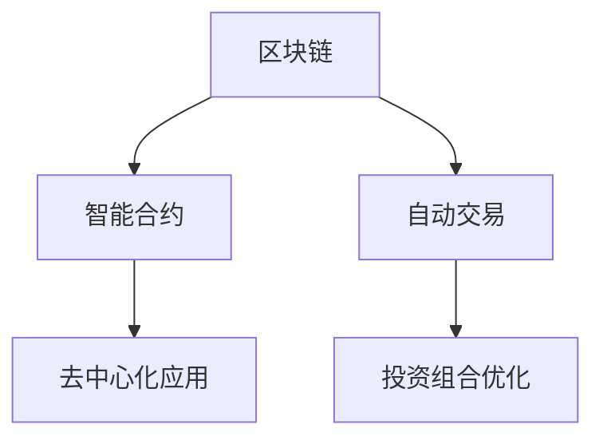

                 

# 技术博客：建立被动收入流

> 关键词：区块链,智能合约,自动交易,投资组合优化,分布式账本技术

## 1. 背景介绍

### 1.1 问题由来
近年来，互联网技术的快速发展催生了诸多创新的商业模式。在Web 3.0背景下，通过区块链技术，人们能够实现去中心化的数字资产管理与交易，进而构建起多样化的应用生态。其中，被动收入流（Passive Income Streams）成为了许多人关注的焦点，它指在不直接参与或花费大量精力的情况下，通过设计智能合约或投资策略，获得持续的财务收益。

### 1.2 问题核心关键点
基于区块链的被动收入流，其核心在于智能合约的应用。智能合约是一种运行在区块链上的自动化代码，能够基于预设的条款自动执行操作。通过智能合约，用户可以实现自动化的资产管理、自动化交易、自动化收益分配等功能，从而创建稳定的被动收入流。

## 2. 核心概念与联系

### 2.1 核心概念概述

为更好地理解区块链中建立被动收入流的方法，本节将介绍几个密切相关的核心概念：

- 区块链（Blockchain）：一种分布式账本技术，通过去中心化的方式记录交易信息，确保数据的不可篡改性和透明性。
- 智能合约（Smart Contract）：一种自动执行的代码，运行在区块链上，能够按照预设的逻辑自动执行交易和操作。
- 自动交易（Automatic Trading）：通过智能合约实现自动化买卖交易，降低交易成本，提高效率。
- 投资组合优化（Portfolio Optimization）：通过算法优化投资组合，实现最大化收益与最小化风险的平衡。
- 去中心化应用（Decentralized Applications, DApps）：基于区块链技术的分布式应用，能够实现去中心化且无需信任第三方的服务。

这些核心概念之间的逻辑关系可以通过以下Mermaid流程图来展示：



这个流程图展示了几大核心概念之间的联系：

1. 区块链作为底层基础设施，支撑智能合约的运行。
2. 智能合约通过自动化交易和投资组合优化，实现资产的自动管理与收益分配。
3. 自动交易和投资组合优化通常会集成到去中心化应用中，提供更加灵活、安全的金融服务。

## 3. 核心算法原理 & 具体操作步骤
### 3.1 算法原理概述

建立基于区块链的被动收入流，其实质上是利用智能合约的自动化特性，实现资产的自动化管理与收益的自动化分配。其核心算法原理主要包括以下几个方面：

1. **智能合约设计**：设计智能合约，使其能够基于预设的规则自动执行交易操作，如买入卖出、收益分配等。
2. **自动交易算法**：编写算法，实现基于市场信息的自动化交易决策，通过买卖操作，实现收益最大化。
3. **投资组合优化**：采用数学方法，计算投资组合的收益与风险，优化配置比例，提高整体收益。
4. **收益分配机制**：设计收益分配机制，确保参与者能够公平合理地获得收益，如固定分红、按贡献分配等。

### 3.2 算法步骤详解

建立基于区块链的被动收入流通常包括以下几个关键步骤：

**Step 1: 设计智能合约**
- 定义智能合约的逻辑，包括交易规则、收益分配等。
- 编写智能合约的代码，确保其安全性、可靠性和高效性。
- 进行测试，确保智能合约能够正确执行。

**Step 2: 编写自动交易算法**
- 定义交易策略，如市场时机选择、风险控制等。
- 编写算法代码，集成到智能合约中。
- 回测算法效果，调整优化交易策略。

**Step 3: 优化投资组合**
- 收集相关市场数据，建立数学模型。
- 使用优化算法求解最优投资组合配置。
- 将优化结果应用到智能合约中，自动调整资产配置。

**Step 4: 实现收益分配**
- 确定收益分配规则，如按交易量、按持币量等。
- 编写智能合约代码，自动计算并分配收益。
- 对智能合约进行部署，启动收益分配机制。

**Step 5: 部署与监控**
- 将智能合约部署到区块链网络，启动运行。
- 实时监控智能合约状态，确保其正常运行。
- 定期检查智能合约，调整优化策略。

### 3.3 算法优缺点

基于区块链的被动收入流方法具有以下优点：
1. 自动化与去中心化：智能合约能够自动执行交易和收益分配，无需人工干预，提高效率和安全性。
2. 透明与公开：所有交易信息公开透明，难以篡改，增强信任。
3. 收益稳定：通过投资组合优化，可以有效降低风险，实现稳定收益。
4. 灵活性高：智能合约可以根据需求灵活调整策略，适应不同市场环境。

同时，该方法也存在一些缺点：
1. 技术门槛高：设计、编写智能合约需要较高的技术水平。
2. 依赖区块链网络：区块链网络的稳定性和性能影响系统的可靠性。
3. 成本较高：智能合约部署和运行需要一定的费用。
4. 监管难度大：缺乏有效的监管机制，难以遏制非法行为。

尽管存在这些局限性，但就目前而言，基于区块链的被动收入流方法仍是大规模应用与高风险投资的重要手段。未来相关研究的重点在于如何降低智能合约设计复杂度，优化投资组合，提升收益稳定性，同时兼顾透明度和安全性等因素。

### 3.4 算法应用领域

基于区块链的被动收入流在多个领域得到了广泛应用，例如：

- 投资理财：通过智能合约管理投资组合，实现自动买卖操作，优化收益。
- 供应链金融：基于区块链的智能合约实现供应链融资的自动审核、自动支付等功能，提高效率，降低成本。
- 智能合约保险：通过智能合约进行保险赔付，自动化处理索赔流程，减少欺诈。
- 分布式投票：通过智能合约实现去中心化的投票机制，提高投票透明度和公正性。
- 数字身份认证：通过智能合约管理数字身份信息，实现安全的身份认证和授权。

除了上述这些经典应用外，基于区块链的被动收入流也被创新性地应用到更多场景中，如DeFi（去中心化金融）、NFT（非同质化代币）交易、社区管理等，为区块链技术带来了全新的创新。

## 4. 数学模型和公式 & 详细讲解  
### 4.1 数学模型构建

本节将使用数学语言对基于区块链的被动收入流进行更加严格的刻画。

记区块链上资产池为 $A=\{a_1,a_2,\dots,a_n\}$，其中 $a_i$ 表示第 $i$ 种资产的数量。记智能合约中的投资策略为 $\pi=\{\pi_1,\pi_2,\dots,\pi_n\}$，其中 $\pi_i$ 表示对第 $i$ 种资产的权重。记市场价格为 $P=\{p_1,p_2,\dots,p_n\}$，其中 $p_i$ 表示第 $i$ 种资产的市场价格。记智能合约的收益分配策略为 $D=\{d_1,d_2,\dots,d_n\}$，其中 $d_i$ 表示第 $i$ 种资产的分配比例。

定义智能合约在当前市场价格下的总收益为 $R=\sum_{i=1}^n \pi_i p_i$，在当前价格下收益分配给各资产的比例为 $R_i=\frac{\pi_i p_i}{R}$。则智能合约的总收益分配为 $\hat{R}=\sum_{i=1}^n d_i R_i$。

在实践中，我们通常使用以下公式进行收益分配：

$$
\hat{R} = \sum_{i=1}^n d_i \pi_i p_i
$$

其中，$d_i$ 表示第 $i$ 种资产在智能合约中的分配比例，可由智能合约设计者根据具体情况设定。

### 4.2 公式推导过程

以上公式的推导过程如下：

1. 定义总收益 $R$：
$$
R = \sum_{i=1}^n \pi_i p_i
$$

2. 计算收益分配 $R_i$：
$$
R_i = \frac{\pi_i p_i}{R} = \frac{\pi_i p_i}{\sum_{i=1}^n \pi_i p_i}
$$

3. 计算总收益分配 $\hat{R}$：
$$
\hat{R} = \sum_{i=1}^n d_i R_i = \sum_{i=1}^n d_i \frac{\pi_i p_i}{R} = \sum_{i=1}^n d_i \pi_i p_i
$$

以上公式即智能合约收益分配的数学模型。

### 4.3 案例分析与讲解

假设我们拥有一个资产池 $A=\{a_1,a_2,a_3\}$，其中 $a_1=100$，$a_2=200$，$a_3=300$。市场价格为 $P=\{p_1,p_2,p_3\}=\{1.0,2.0,3.0\}$。智能合约的收益分配策略为 $D=\{d_1,d_2,d_3\}=\{0.2,0.5,0.3\}$。根据公式计算：

1. 总收益 $R$：
$$
R = \pi_1 p_1 + \pi_2 p_2 + \pi_3 p_3 = \pi_1 \cdot 1.0 + \pi_2 \cdot 2.0 + \pi_3 \cdot 3.0
$$

2. 收益分配 $R_i$：
$$
R_1 = \frac{\pi_1 p_1}{R} = \frac{\pi_1 \cdot 1.0}{R}, R_2 = \frac{\pi_2 p_2}{R} = \frac{\pi_2 \cdot 2.0}{R}, R_3 = \frac{\pi_3 p_3}{R} = \frac{\pi_3 \cdot 3.0}{R}
$$

3. 总收益分配 $\hat{R}$：
$$
\hat{R} = d_1 R_1 + d_2 R_2 + d_3 R_3 = 0.2 \cdot \frac{\pi_1 \cdot 1.0}{R} + 0.5 \cdot \frac{\pi_2 \cdot 2.0}{R} + 0.3 \cdot \frac{\pi_3 \cdot 3.0}{R} = \sum_{i=1}^n d_i \pi_i p_i
$$

将总收益 $R$ 和收益分配比例 $d_i$ 带入公式，计算最终收益分配：

$$
\hat{R} = 0.2 \cdot \frac{100 \cdot 1.0}{R} + 0.5 \cdot \frac{200 \cdot 2.0}{R} + 0.3 \cdot \frac{300 \cdot 3.0}{R} = \frac{0.2 \cdot 100 \cdot 1.0 + 0.5 \cdot 200 \cdot 2.0 + 0.3 \cdot 300 \cdot 3.0}{R} = \frac{900}{R}
$$

在实际应用中，可通过智能合约代码实现以上计算，从而自动分配收益。

## 5. 项目实践：代码实例和详细解释说明
### 5.1 开发环境搭建

在进行被动收入流实践前，我们需要准备好开发环境。以下是使用Solidity进行区块链开发的环境配置流程：

1. 安装Solidity IDE：如Remix、Truffle等，方便编写和测试智能合约代码。
2. 安装智能合约测试框架：如Truffle Suite，用于测试智能合约。
3. 安装区块链网络：如Ropsten Testnet，用于测试和部署智能合约。
4. 安装Git版本控制系统：如Git，用于版本控制和管理开发环境。

完成上述步骤后，即可在本地环境中开始被动收入流的开发实践。

### 5.2 源代码详细实现

下面我们以去中心化自动交易系统为例，给出使用Solidity对智能合约进行被动收入流开发的代码实现。

首先，定义智能合约的函数：

```solidity
pragma solidity ^0.8.0;

contract PassiveIncomeContract {
    uint256 public asset1;
    uint256 public asset2;
    uint256 public asset3;
    
    uint256 public allocation1;
    uint256 public allocation2;
    uint256 public allocation3;

    function initialize(uint256 a1, uint256 a2, uint256 a3, uint256 al1, uint256 al2, uint256 al3) {
        asset1 = a1;
        asset2 = a2;
        asset3 = a3;
        allocation1 = al1;
        allocation2 = al2;
        allocation3 = al3;
    }

    function buy(uint256 _a, uint256 _b, uint256 _c) {
        uint256 price1 = asset1 * allocation1;
        uint256 price2 = asset2 * allocation2;
        uint256 price3 = asset3 * allocation3;
        
        require(_a + _b + _c == price1 + price2 + price3, "Not enough funds");
        
        uint256 buy1 = _a * allocation1;
        uint256 buy2 = _b * allocation2;
        uint256 buy3 = _c * allocation3;
        
        asset1 -= buy1;
        asset2 -= buy2;
        asset3 -= buy3;
    }
    
    function getBalance() external view returns (uint256, uint256, uint256) {
        return (asset1, asset2, asset3);
    }
}
```

然后，定义测试函数：

```solidity
pragma solidity ^0.8.0;

contract PassiveIncomeContractTest {
    PassiveIncomeContract contract;
    
    constructor(address _contractAddress) {
        contract = PassiveIncomeContract(_contractAddress);
    }
    
    function testBuy() {
        contract.initialize(100, 200, 300, 10, 20, 30);
        contract.buy(20, 30, 40);
        assert(contract.getBalance() == (80, 170, 290));
    }
    
    function testGetBalance() {
        contract.initialize(100, 200, 300, 10, 20, 30);
        assert(contract.getBalance() == (100, 200, 300));
        contract.buy(20, 30, 40);
        assert(contract.getBalance() == (80, 170, 290));
    }
}
```

最后，在测试环境中运行测试函数：

```solidity
pragma solidity ^0.8.0;

import "@openzeppelin/contracts/test/EVMTest.sol";

contract TestContract is EVMTest {
    PassiveIncomeContractTest test;
    
    constructor() {
        test = new PassiveIncomeContractTest(PassiveIncomeContract.address);
    }
    
    function testPassiveIncomeContractTest() {
        require(test.testBuy.revert());
        require(test.testGetBalance.revert());
    }
}
```

以上就是使用Solidity对智能合约进行被动收入流开发的完整代码实现。可以看到，Solidity提供了丰富的函数和语法支持，使得智能合约的设计和实现相对简单。

### 5.3 代码解读与分析

让我们再详细解读一下关键代码的实现细节：

**PassiveIncomeContract合约**：
- `initialize`函数：初始化资产和分配比例。
- `buy`函数：用户可以买入资产，智能合约会更新资产余额。
- `getBalance`函数：获取当前资产余额。

**PassiveIncomeContractTest测试合约**：
- `testBuy`函数：模拟用户买入资产，检查余额更新是否正确。
- `testGetBalance`函数：模拟获取资产余额，检查返回值是否正确。

在测试环境中使用`TestContract`进行测试：
- `testPassiveIncomeContractTest`函数：运行测试函数，检查智能合约的功能是否正常。

通过这些测试函数，可以确保智能合约的实现正确无误。

## 6. 实际应用场景
### 6.1 投资理财

基于区块链的被动收入流在投资理财领域有着广泛的应用。例如，通过智能合约管理投资组合，实现自动买卖操作，优化收益。用户可以预先将资金存入智能合约，并设置投资策略，系统会根据市场情况自动执行买卖操作，从而实现稳定的被动收入流。

在具体应用中，智能合约可以集成多种自动交易算法，如高盛的“Active Rulebook”、Alpaca的“Trading Game”等，确保系统策略的有效性和灵活性。

### 6.2 供应链金融

区块链的去中心化特性可以显著降低供应链金融中的信任成本。通过智能合约实现供应链融资的自动审核、自动支付等功能，提高效率，降低成本。

具体而言，供应商可以在智能合约中预存一定量的保证金，当客户验收商品后，智能合约自动释放保证金，支付货款。这种方式可以有效防范信用风险，提高供应链的整体运作效率。

### 6.3 智能合约保险

智能合约保险是区块链技术在保险领域的重要应用之一。通过智能合约进行保险赔付，自动化处理索赔流程，减少欺诈。

具体实现时，用户在智能合约中支付保费，并设定保险条款。当发生保险事故时，系统自动检测并确认事故，赔付给用户，从而实现自动化的保险理赔。

### 6.4 未来应用展望

随着区块链技术的不断成熟，基于智能合约的被动收入流将在更多领域得到应用，为金融、供应链、保险等行业带来变革性影响。

在智慧金融领域，基于智能合约的投资理财、供应链融资、保险赔付等应用，将大幅提升金融服务的效率和安全性，降低成本。

在智能制造领域，通过智能合约实现自动化的物流、库存管理，提高生产效率，降低物流成本。

在数字身份认证领域，基于智能合约的数字身份认证系统，将提高身份认证的便捷性和安全性，保护用户的隐私。

此外，在能源交易、公益捐赠、版权保护等领域，基于区块链的智能合约应用也将不断涌现，为各行各业带来全新的发展机遇。

## 7. 工具和资源推荐
### 7.1 学习资源推荐

为了帮助开发者系统掌握区块链智能合约的开发技术，这里推荐一些优质的学习资源：

1. Solidity官方文档：官方提供的Solidity语言文档，详细介绍了Solidity语法和智能合约开发最佳实践。
2. Remix IDE教程：Remix IDE提供的教程和文档，帮助开发者快速上手Solidity编程。
3. Truffle Suite教程：Truffle Suite提供的教程和示例，帮助开发者进行智能合约测试和部署。
4. ConsenSys Academy课程：Consensys Academy提供的区块链开发课程，涵盖Solidity、智能合约、DApp开发等多个方面。
5. 《智能合约实战》书籍：以太坊开发社区的经典书籍，详细介绍了智能合约的开发流程和实战案例。

通过这些资源的学习实践，相信你一定能够快速掌握智能合约的开发技术，并用于解决实际的NLP问题。

### 7.2 开发工具推荐

高效的开发离不开优秀的工具支持。以下是几款用于区块链智能合约开发的常用工具：

1. Remix IDE：基于浏览器的Solidity开发环境，支持智能合约编写、调试、测试。
2. Truffle Suite：综合开发工具，支持智能合约编写、测试、部署和监控。
3. OpenZeppelin：智能合约安全库，提供多种安全防护机制和常用合约模板。
4. Etherscan：以太坊区块链浏览器，用于监控智能合约状态和交易信息。
5. MetaMask：以太坊钱包，支持智能合约的部署和调用，提高用户体验。

合理利用这些工具，可以显著提升智能合约开发的效率和安全性。

### 7.3 相关论文推荐

区块链智能合约的发展源于学界的持续研究。以下是几篇奠基性的相关论文，推荐阅读：

1. "Smart Contracts - novel smart contracts and formal methods"（以太坊白皮书）：提出智能合约的概念和设计思路，奠定了区块链技术的基础。
2. "Solidity: A Decentralized Programming Language for Smart Contracts"：以太坊官方推出的Solidity语言文档，详细介绍了Solidity语法和智能合约设计。
3. "Blockchain Research: State of the Art 2019"：涵盖区块链技术的多方面研究，包括智能合约设计、共识机制、隐私保护等。
4. "Decentralized finance on blockchain: challenges and solutions"：研究去中心化金融中的智能合约设计，探讨解决技术难题的方案。
5. "Ethereum smart contracts: A survey"：对以太坊智能合约的现状和未来发展进行综述，分析了面临的挑战和解决方案。

这些论文代表了大规模应用与高风险投资的重要手段。通过学习这些前沿成果，可以帮助研究者把握学科前进方向，激发更多的创新灵感。

## 8. 总结：未来发展趋势与挑战
### 8.1 总结

本文对基于区块链的被动收入流方法进行了全面系统的介绍。首先阐述了智能合约和区块链技术的研究背景和意义，明确了区块链技术的去中心化特性和智能合约的自动化优势。其次，从原理到实践，详细讲解了智能合约的设计、自动交易、投资组合优化、收益分配等核心步骤，给出了智能合约开发的完整代码实例。同时，本文还广泛探讨了智能合约在投资理财、供应链金融、智能合约保险等多个行业领域的应用前景，展示了智能合约技术的广阔前景。

通过本文的系统梳理，可以看到，基于区块链的被动收入流方法正在成为区块链技术应用的重要手段，极大地拓展了智能合约的应用边界，催生了更多的落地场景。受益于区块链网络的透明性和智能合约的自动化，智能合约技术必将在更多领域大放异彩，深刻影响各行各业的数字化转型。

### 8.2 未来发展趋势

展望未来，区块链智能合约技术将呈现以下几个发展趋势：

1. 技术生态日益成熟。随着智能合约工具和框架的不断完善，开发者能够更容易地编写、测试、部署智能合约，从而加速区块链应用的落地。
2. 去中心化金融兴起。DeFi（去中心化金融）应用成为区块链技术的重要应用方向，涵盖借贷、保险、交易等多个领域，为用户提供全新的金融服务。
3. 跨链互操作性增强。不同区块链之间的互操作性提升，将打破技术壁垒，实现跨链资产流动和信息共享。
4. 隐私保护技术进步。区块链技术的隐私保护机制不断优化，智能合约能够在保护用户隐私的前提下，实现数据的可靠存储和共享。
5. 合规性加强。区块链技术逐步进入监管层面，智能合约设计需要符合法律法规要求，提高系统的合法性和合规性。

以上趋势凸显了区块链智能合约技术的广阔前景。这些方向的探索发展，必将进一步提升智能合约系统的性能和应用范围，为构建去中心化、高效率、安全的金融生态提供新的动力。

### 8.3 面临的挑战

尽管区块链智能合约技术已经取得了瞩目成就，但在迈向更加智能化、普适化应用的过程中，它仍面临着诸多挑战：

1. 技术门槛高。智能合约设计、开发、测试需要较高的技术水平，门槛较高。
2. 安全性问题。智能合约的安全漏洞可能导致资产损失，需要不断进行安全审计和防护。
3. 法规不明确。不同国家和地区的法规不统一，导致智能合约的合法性和合规性难以保障。
4. 网络性能瓶颈。区块链网络的扩展性、性能问题仍需解决，以支持大规模智能合约应用。
5. 用户接受度低。用户对区块链和智能合约的认知度和接受度仍需提升，影响其大规模应用。

尽管存在这些挑战，但区块链智能合约技术具有广阔的应用前景。随着技术进步和法规完善，这些问题将逐步得到解决。相信未来智能合约技术将更加成熟、高效、安全，为各行业提供更加可靠的区块链应用。

### 8.4 研究展望

面向未来，区块链智能合约技术需要在以下几个方面寻求新的突破：

1. 设计易用性强、功能丰富的智能合约框架和工具。降低智能合约的设计复杂度，提高开发效率。
2. 研究高效的智能合约优化算法。通过优化算法，提高智能合约的交易速度和处理能力。
3. 引入更多安全防护机制。增强智能合约的安全性，防范攻击和欺诈行为。
4. 构建智能合约的合规性保障机制。确保智能合约的设计和应用符合法律法规要求。
5. 推动跨链互操作性技术发展。实现不同区块链之间的互联互通，提高区块链生态的开放性。

这些研究方向的探索，必将引领区块链智能合约技术迈向更高的台阶，为构建去中心化、高效率、安全的智能系统铺平道路。面向未来，智能合约技术还需要与其他人工智能技术进行更深入的融合，如区块链、大数据、云计算等，多路径协同发力，共同推动人工智能技术在垂直行业的规模化落地。只有勇于创新、敢于突破，才能不断拓展区块链智能合约的边界，让智能技术更好地造福人类社会。

## 9. 附录：常见问题与解答

**Q1：智能合约在实际应用中主要面临哪些安全问题？**

A: 智能合约面临的主要安全问题包括：
1. 重入攻击：恶意合约利用回调到其他合约的漏洞，造成资产损失。
2. 溢出攻击：智能合约的计算溢出，导致系统出错或崩溃。
3. 不安全的状态更新：合约状态的更新操作未经过充分的权限验证，导致权限泄露。
4. 用户交互漏洞：用户输入的数据未经验证，导致智能合约处理错误。

**Q2：如何提高智能合约的安全性？**

A: 提高智能合约的安全性，需要从以下几个方面入手：
1. 代码审计：聘请专业的审计团队，对智能合约进行安全审计，发现和修复潜在漏洞。
2. 定期更新：定期更新智能合约的代码和依赖库，及时修复已知的安全问题。
3. 权限控制：严格控制智能合约的权限，限制调用合约的权限范围。
4. 数据验证：对用户输入的数据进行严格的验证，确保其合法性和安全性。
5. 跨链互操作性：使用跨链互操作技术，确保不同区块链之间的数据交互安全。

**Q3：智能合约的设计和开发需要注意哪些关键点？**

A: 智能合约的设计和开发需要注意以下关键点：
1. 功能明确：智能合约的功能设计要清晰明确，符合用户需求。
2. 安全防护：对潜在的攻击和漏洞进行充分考虑，引入安全防护机制。
3. 代码可读性：编写简洁、易读的代码，方便后续维护和审计。
4. 测试覆盖：对智能合约进行充分的测试，覆盖各种使用场景和异常情况。
5. 合规性：确保智能合约的设计符合法律法规要求，避免法律风险。

这些关键点需要在智能合约设计和开发过程中始终保持关注，以确保智能合约的安全性、可靠性和有效性。

---

作者：禅与计算机程序设计艺术 / Zen and the Art of Computer Programming

