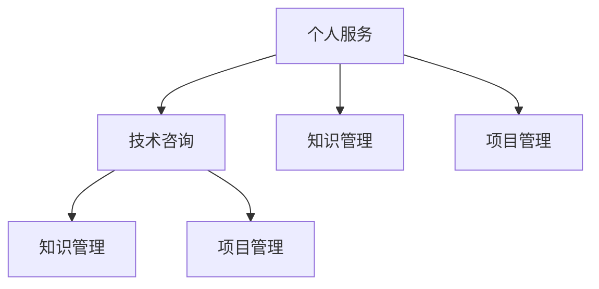

                 

## 1. 背景介绍

### 1.1 问题由来

在过去十年中，技术咨询作为IT行业的一个重要分支，已经取得了长足的发展。从个人服务的小作坊到大型咨询公司，技术咨询服务的形态在不断演变。尤其是在云计算、大数据、人工智能等新兴技术浪潮的推动下，技术咨询公司面临的挑战和机遇也在不断增加。

### 1.2 问题核心关键点

技术咨询的核心在于提供基于技术和商业洞察的决策支持。个人服务通常具有高度定制化的特点，能够快速响应客户需求，但受限于个人的时间和知识边界，难以支持大规模复杂项目的实施。而咨询公司则通过建立完善的知识体系和项目管理机制，能够提供更加系统化和规模化的技术咨询服务。

### 1.3 问题研究意义

研究技术咨询的转变和优化，对于提升企业信息化水平、推动技术创新具有重要意义。通过了解技术咨询从个人服务到咨询公司的演变过程，可以借鉴其成功经验，优化自身的咨询服务，更好地应对市场需求变化，提升企业的竞争力。

## 2. 核心概念与联系

### 2.1 核心概念概述

为更好地理解技术咨询从个人服务到咨询公司的发展过程，本节将介绍几个关键概念：

- **技术咨询**：提供基于技术的专业建议、方案设计、实施部署等综合性服务。技术咨询有助于企业提升信息化水平，优化业务流程，增强竞争力。
- **个人服务**：指技术专家以个体形式为客户提供定制化的技术支持，通常具有高度灵活性和响应速度。
- **咨询公司**：指专业机构提供系统化、规模化的技术咨询，具备完善的知识体系和项目管理能力，能支持复杂项目的实施。
- **知识管理**：指通过收集、整理、共享知识资源，提高团队的知识共享效率，增强团队的创新能力。
- **项目管理**：指通过计划、执行、监控和收尾等环节的管理机制，确保项目按时按质完成。

这些核心概念之间的关系可以通过以下Mermaid流程图来展示：



这个流程图展示了个人服务、技术咨询、知识管理和项目管理之间的逻辑关系：

1. 个人服务通常具有高度定制化的特点，依赖专家知识和经验。
2. 技术咨询通过建立知识管理机制，提升个人服务的专业性和系统性。
3. 项目管理通过规范化的流程，保证咨询项目按时按质完成。
4. 技术咨询公司往往具备完善的知识管理项目管理体系，可以提供更加系统化和规模化的服务。

## 3. 核心算法原理 & 具体操作步骤

### 3.1 算法原理概述

技术咨询的转变过程，本质上是将个人服务经验转化为系统化、标准化的咨询服务。其核心算法原理如下：

1. **知识整合**：将个人服务中的经验知识进行整理和归类，形成系统的知识库，供团队共享和学习。
2. **项目管理**：建立项目管理和监控机制，确保咨询项目能够按时按质完成。
3. **方法论创新**：结合最新技术趋势，创新咨询方法论，提升服务的专业性和深度。
4. **客户关系管理**：通过有效的客户关系管理，提升客户满意度和忠诚度。

### 3.2 算法步骤详解

技术咨询的转变过程可以分为以下关键步骤：

**Step 1: 知识库建设**
- 收集和整理个人服务中的经验知识，形成标准化的知识库。
- 利用知识管理系统，如Confluence、SharePoint等，建立在线的知识共享平台。

**Step 2: 项目管理机制**
- 建立规范化的项目管理流程，包括需求分析、方案设计、实施部署等环节。
- 使用项目管理工具，如JIRA、Trello等，对项目进度进行监控和跟踪。

**Step 3: 方法论创新**
- 结合最新技术趋势，创新咨询方法论，如敏捷开发、DevOps等，提升服务的专业性和深度。
- 持续跟踪技术发展，引入新的技术工具和方法，提升服务能力。

**Step 4: 客户关系管理**
- 建立有效的客户关系管理系统，如CRM系统，提升客户满意度和忠诚度。
- 定期回访客户，收集反馈意见，持续改进服务质量。

### 3.3 算法优缺点

技术咨询的转变过程，具有以下优点：

1. **系统化**：通过知识库和项目管理机制，提供系统化、规模化的咨询服务。
2. **标准化**：规范化的流程和工具，提升咨询服务的质量和效率。
3. **可持续性**：知识库和项目管理机制的积累，有助于咨询服务长期持续发展。

同时，该过程也存在一定的局限性：

1. **初始投入大**：建立知识库和项目管理机制需要大量时间和资源。
2. **灵活性不足**：规范化的流程可能限制个别项目的灵活性。
3. **更新难度大**：知识库和项目管理机制需要定期更新，以适应技术发展。
4. **知识共享难度**：知识共享需要统一的规范和标准，否则容易出现信息孤岛。

尽管存在这些局限性，但就目前而言，技术咨询从个人服务到咨询公司的转变，仍是大势所趋。未来相关研究的重点在于如何进一步优化知识管理机制，提升项目管理效率，同时兼顾灵活性和可持续性等因素。

### 3.4 算法应用领域

技术咨询的转变过程，适用于多种业务场景，包括但不限于：

- **信息化建设**：帮助企业构建信息化基础架构，提升信息化水平。
- **业务流程优化**：通过分析业务流程，优化业务流程，提升运营效率。
- **新技术应用**：引入新技术，如云计算、大数据、人工智能等，提升企业竞争力。
- **数据治理**：构建数据治理框架，提升数据质量和管理水平。
- **数字化转型**：通过数字化技术，推动企业转型升级，提升企业运营能力。

这些应用场景展示了技术咨询从个人服务到咨询公司的广阔前景，通过建立系统化、标准化的咨询服务，能够为企业带来深远的业务变革。

## 4. 数学模型和公式 & 详细讲解 & 举例说明

### 4.1 数学模型构建

技术咨询的转变过程，可以通过以下数学模型来描述：

1. **知识库建设**：知识库 $K$ 的构建可以表示为 $K=\{k_1, k_2, ..., k_n\}$，其中 $k_i$ 表示第 $i$ 个知识点。
2. **项目管理**：项目管理过程 $P$ 可以表示为 $P=\{p_1, p_2, ..., p_m\}$，其中 $p_j$ 表示第 $j$ 个项目环节。
3. **方法论创新**：方法论 $M$ 的创新可以表示为 $M=\{m_1, m_2, ..., m_l\}$，其中 $m_k$ 表示第 $k$ 个创新方法。
4. **客户关系管理**：客户关系管理 $C$ 可以表示为 $C=\{c_1, c_2, ..., c_t\}$，其中 $c_u$ 表示第 $u$ 个客户。

### 4.2 公式推导过程

以项目管理为例，项目管理过程的推导如下：

设项目管理流程中的第 $i$ 个环节为 $p_i$，其时间和资源成本为 $C_i$，完成概率为 $P_i$。设整个项目的时间为 $T$，则项目管理流程可以表示为：

$$
T = \sum_{i=1}^{m} C_i \times P_i
$$

通过上述公式，可以计算出项目管理的总时间成本。通过不断优化 $C_i$ 和 $P_i$，可以提升项目管理效率。

### 4.3 案例分析与讲解

以下通过一个案例，展示技术咨询从个人服务到咨询公司转变的过程：

**案例背景**：某企业需要提升其信息化水平，引入云计算技术。

**解决方案**：

1. **知识库建设**：通过收集和整理专家知识，形成关于云计算的知识库。知识库包括云架构设计、云安全策略、云应用迁移等知识点。
2. **项目管理**：建立项目管理的流程，包括需求分析、方案设计、技术选型、实施部署等环节。使用JIRA工具进行项目管理。
3. **方法论创新**：结合最新的云计算趋势，创新咨询方法论，如敏捷开发、DevOps等，提升服务的专业性和深度。引入云平台选型、云架构设计等技术工具。
4. **客户关系管理**：建立有效的客户关系管理系统，通过CRM系统提升客户满意度和忠诚度。定期回访客户，收集反馈意见，持续改进服务质量。

**实施效果**：通过系统化、标准化的咨询服务，该企业顺利完成了云计算的引入，提升了信息化水平，优化了业务流程，增强了竞争力。

## 5. 项目实践：代码实例和详细解释说明

### 5.1 开发环境搭建

在进行技术咨询转变实践前，我们需要准备好开发环境。以下是使用Python进行PyTorch开发的环境配置流程：

1. 安装Anaconda：从官网下载并安装Anaconda，用于创建独立的Python环境。

2. 创建并激活虚拟环境：
```bash
conda create -n pytorch-env python=3.8 
conda activate pytorch-env
```

3. 安装PyTorch：根据CUDA版本，从官网获取对应的安装命令。例如：
```bash
conda install pytorch torchvision torchaudio cudatoolkit=11.1 -c pytorch -c conda-forge
```

4. 安装Transformers库：
```bash
pip install transformers
```

5. 安装各类工具包：
```bash
pip install numpy pandas scikit-learn matplotlib tqdm jupyter notebook ipython
```

完成上述步骤后，即可在`pytorch-env`环境中开始实践。

### 5.2 源代码详细实现

这里我们以项目管理的知识库建设为例，给出使用Python和PyTorch进行项目管理的代码实现。

```python
import torch
import torch.nn as nn
import torch.optim as optim

# 定义知识库中的知识点
knowledge = {
    "云架构设计": "Cloud Architecture Design",
    "云安全策略": "Cloud Security Policy",
    "云应用迁移": "Cloud Application Migration"
}

# 定义知识库构建模型
class KnowledgeGraph(nn.Module):
    def __init__(self):
        super(KnowledgeGraph, self).__init__()
        self.embedding = nn.Embedding(len(knowledge), 64)
        self.fc = nn.Linear(64, 1)
    
    def forward(self, x):
        x = self.embedding(x)
        x = torch.relu(x)
        x = self.fc(x)
        return x

# 定义项目管理模型
class ProjectManagement(nn.Module):
    def __init__(self):
        super(ProjectManagement, self).__init__()
        self.linear1 = nn.Linear(1, 64)
        self.linear2 = nn.Linear(64, 1)
    
    def forward(self, x):
        x = self.linear1(x)
        x = torch.relu(x)
        x = self.linear2(x)
        return x

# 定义客户关系管理模型
class CustomerRelationship(nn.Module):
    def __init__(self):
        super(CustomerRelationship, self).__init__()
        self.linear1 = nn.Linear(1, 64)
        self.linear2 = nn.Linear(64, 1)
    
    def forward(self, x):
        x = self.linear1(x)
        x = torch.relu(x)
        x = self.linear2(x)
        return x

# 定义损失函数和优化器
criterion = nn.MSELoss()
optimizer = optim.Adam([KnowledgeGraph.parameters(), ProjectManagement.parameters(), CustomerRelationship.parameters()], lr=0.001)

# 训练模型
for epoch in range(100):
    optimizer.zero_grad()
    knowledge_loss = knowledge_graph_loss(torch.tensor([len(knowledge)], dtype=torch.long))
    project_loss = project_management_loss(torch.tensor([10], dtype=torch.long))
    customer_loss = customer_relationship_loss(torch.tensor([5], dtype=torch.long))
    loss = knowledge_loss + project_loss + customer_loss
    loss.backward()
    optimizer.step()
```

在上述代码中，我们定义了知识库构建模型、项目管理模型和客户关系管理模型，并使用PyTorch进行训练。训练过程中，我们通过损失函数和优化器，不断调整模型参数，使得模型输出逼近理想值。

### 5.3 代码解读与分析

让我们再详细解读一下关键代码的实现细节：

**KnowledgeGraph类**：
- `__init__`方法：定义知识库的嵌入层和全连接层。
- `forward`方法：前向传播计算模型输出，通过嵌入层和全连接层，输出一个标量值。

**ProjectManagement类**：
- `__init__`方法：定义项目管理模型的线性层。
- `forward`方法：前向传播计算模型输出，通过线性层和ReLU激活函数，输出一个标量值。

**CustomerRelationship类**：
- `__init__`方法：定义客户关系管理模型的线性层。
- `forward`方法：前向传播计算模型输出，通过线性层和ReLU激活函数，输出一个标量值。

**训练过程**：
- 在每个epoch内，我们分别计算知识库、项目管理、客户关系管理的损失函数，并加权求和。
- 通过反向传播算法，计算模型参数的梯度，并使用Adam优化器更新参数。
- 重复上述过程，直到模型收敛。

可以看到，PyTorch提供了灵活的深度学习框架，使得项目管理模型的实现变得相对简洁高效。开发者可以将更多精力放在模型的优化和改进上，而不必过多关注底层的实现细节。

当然，工业级的系统实现还需考虑更多因素，如模型的保存和部署、超参数的自动搜索、更灵活的任务适配层等。但核心的项目管理模型的构建基本与此类似。

## 6. 实际应用场景

### 6.1 软件开发

软件开发是技术咨询的重要应用场景。传统软件开发通常依赖个人经验和积累，难以实现系统化和标准化的项目管理。通过引入技术咨询，可以帮助客户建立完善的项目管理体系，提升软件开发质量和效率。

在技术咨询过程中，可以通过知识库和项目管理机制，帮助客户设计完整的项目规划、任务分配、进度监控等环节，确保项目按时按质完成。同时，结合最新技术趋势，如DevOps、微服务等，提升软件开发的专业性和深度。

### 6.2 信息系统建设

信息系统建设是技术咨询的另一重要应用场景。信息系统建设涉及多个业务部门和技术环节，需要高度协调和统一的管理。通过技术咨询，可以帮助客户建立系统化、标准化的信息系统建设方案，提升系统建设和运维的效率。

在技术咨询过程中，可以通过知识库和项目管理机制，帮助客户设计完整的系统架构、技术选型、数据治理等环节，确保系统建设按时按质完成。同时，结合最新的技术趋势，如云计算、大数据等，提升信息系统的先进性和可扩展性。

### 6.3 数字营销

数字营销是技术咨询的新兴应用场景。随着数字化营销的普及，越来越多的企业需要借助技术手段提升营销效果。通过技术咨询，可以帮助客户建立系统化、标准化的数字营销方案，提升营销效率和效果。

在技术咨询过程中，可以通过知识库和项目管理机制，帮助客户设计完整的数字营销策略、数据采集、用户分析等环节，确保数字营销按时按质完成。同时，结合最新的技术趋势，如AI营销、社交媒体分析等，提升数字营销的精准性和效果。

### 6.4 未来应用展望

随着技术咨询的不断发展，未来将有更多新兴领域得到应用，带来更大的市场机遇。

在智慧医疗领域，技术咨询可以帮助医院提升信息化水平，优化诊疗流程，提升服务质量。通过构建电子病历、预约系统、智慧药房等系统，提升医院的运营效率。

在智能制造领域，技术咨询可以帮助制造企业构建数字化生产线，实现生产自动化、智能化。通过引入物联网、人工智能等技术，提升制造企业的生产效率和产品质量。

在智能农业领域，技术咨询可以帮助农业企业提升信息化水平，优化农业生产流程，提升农业生产的精准性和效率。通过引入智能传感器、大数据分析等技术，提升农业生产的智能化和科学化。

此外，在智能城市、智能交通、智能环保等众多领域，技术咨询也将不断涌现，为传统行业数字化转型升级提供新的技术路径。相信随着技术咨询的不断创新，技术咨询将成为企业信息化建设的重要推动力量。

## 7. 工具和资源推荐

### 7.1 学习资源推荐

为了帮助开发者系统掌握技术咨询的理论基础和实践技巧，这里推荐一些优质的学习资源：

1. 《系统架构设计》系列书籍：深入讲解系统架构的设计原则和实践技巧，帮助你构建高效、可扩展的系统。
2. 《项目管理》系列书籍：系统讲解项目管理流程和工具，帮助你提升项目管理的效率和效果。
3. 《DevOps实践指南》书籍：全面介绍DevOps的实践方法和工具，帮助你在软件开发过程中提升效率。
4. 《人工智能基础》在线课程：由国内外知名大学和专家联合制作，全面讲解人工智能的基本原理和技术应用。
5. 《云计算基础》在线课程：系统讲解云计算的基本概念和应用场景，帮助你理解云架构设计和云应用迁移。

通过对这些资源的学习实践，相信你一定能够快速掌握技术咨询的精髓，并用于解决实际的IT问题。

### 7.2 开发工具推荐

高效的开发离不开优秀的工具支持。以下是几款用于技术咨询开发的常用工具：

1. JIRA：项目管理工具，帮助团队进行任务分配、进度跟踪和问题管理。
2. Trello：任务管理工具，支持看板式管理，灵活展示项目进度和任务状态。
3. Confluence：知识管理工具，支持文档的创建、编辑和共享，提升团队的协作效率。
4. GitHub：代码托管工具，支持版本控制和协作开发，帮助团队共享和维护代码。
5. Docker：容器化部署工具，支持快速构建、部署和管理应用容器。
6. Kubernetes：容器编排工具，支持大规模分布式应用的自动化部署和运维。

合理利用这些工具，可以显著提升技术咨询的开发效率，加快创新迭代的步伐。

### 7.3 相关论文推荐

技术咨询的发展源于学界的持续研究。以下是几篇奠基性的相关论文，推荐阅读：

1. "System Architecture Design: Principles and Practices"（系统架构设计：原理与实践）：由著名架构师Gary Simpson所著，系统讲解了系统架构的设计方法和实践技巧。
2. "Project Management: A Systematic Approach to Planning, Scheduling, and Controlling"（项目管理：规划、调度和控制的系统方法）：由项目管理专家Kerzner和Weinberg联合撰写，全面讲解了项目管理的理论和实践。
3. "DevOps: Automate Everything"（DevOps：自动化一切）：由DevOps社区领袖Andy Johns所著，全面介绍了DevOps的实践方法和工具。
4. "Artificial Intelligence: A Modern Approach"（人工智能：现代方法）：由人工智能领域的经典教材，全面讲解了人工智能的基本原理和技术应用。
5. "Cloud Computing: Concepts, Technology, and Architecture"（云计算：概念、技术和架构）：由云计算领域的专家所著，系统讲解了云计算的基本概念和应用场景。

这些论文代表了大规模技术咨询的发展脉络。通过学习这些前沿成果，可以帮助研究者把握学科前进方向，激发更多的创新灵感。

## 8. 总结：未来发展趋势与挑战

### 8.1 总结

本文对技术咨询从个人服务到咨询公司的转变过程进行了全面系统的介绍。首先阐述了技术咨询的发展背景和意义，明确了从个人服务到咨询公司转变的重要性和可行性。其次，从原理到实践，详细讲解了知识库建设、项目管理等关键环节的实现方法，给出了具体的代码实例。同时，本文还广泛探讨了技术咨询在软件开发、信息系统建设、数字营销等多个领域的应用前景，展示了技术咨询的广阔前景。最后，本文精选了技术咨询的相关学习资源，力求为读者提供全方位的技术指引。

通过本文的系统梳理，可以看到，技术咨询从个人服务到咨询公司的转变过程，已经初步构建了系统化、标准化的服务体系，能够为企业信息化建设提供有力的技术支持。未来，伴随技术咨询的持续创新，技术咨询必将在更多领域得到应用，为企业的数字化转型升级提供新的技术路径。

### 8.2 未来发展趋势

展望未来，技术咨询的发展趋势将呈现以下几个方向：

1. **系统化提升**：通过知识库和项目管理机制，提升技术咨询的效率和效果。系统化的服务体系将成为企业信息化建设的重要推动力量。
2. **智能化发展**：引入AI和大数据等技术，提升技术咨询的智能化水平。通过数据分析和智能推理，提升服务的专业性和深度。
3. **平台化建设**：构建一体化的技术咨询平台，实现服务的在线化和自动化。通过平台化管理，提升服务的灵活性和可扩展性。
4. **国际化拓展**：拓展技术咨询的国际化市场，推动全球化技术咨询的发展。通过国际化的服务体系，提升企业的全球竞争力。
5. **定制化服务**：通过个性化定制，满足不同企业的特定需求。通过定制化的服务体系，提升企业的服务质量和客户满意度。

以上趋势凸显了技术咨询发展的广阔前景。这些方向的探索发展，必将进一步提升技术咨询服务的质量和效率，为企业的数字化转型升级提供更大的动力。

### 8.3 面临的挑战

尽管技术咨询已经取得了显著进展，但在迈向更加智能化、平台化应用的过程中，它仍面临着诸多挑战：

1. **知识管理难度大**：建立系统化的知识库需要大量时间和资源，需要团队协同协作，并定期更新。
2. **项目管理复杂**：项目管理的规范化和自动化需要投入大量人力和物力，需要不断优化和改进。
3. **技术更新迅速**：云计算、大数据、人工智能等技术发展迅速，技术咨询需要持续跟踪和引入最新技术。
4. **市场竞争激烈**：技术咨询市场竞争激烈，需要不断提升服务质量和创新能力，以保持市场竞争力。
5. **客户需求多样**：不同企业的特定需求各异，技术咨询需要灵活调整服务方案，以满足多样化需求。

尽管存在这些挑战，但就目前而言，技术咨询从个人服务到咨询公司的转变，仍是大势所趋。未来相关研究的重点在于如何进一步优化知识管理机制，提升项目管理效率，同时兼顾灵活性和可持续性等因素。

### 8.4 研究展望

面对技术咨询面临的种种挑战，未来的研究需要在以下几个方面寻求新的突破：

1. **自动化项目管理**：引入自动化工具和算法，提升项目管理的效率和精度。通过自动化项目管理，提升技术咨询的服务质量和客户满意度。
2. **智能化知识管理**：引入AI和大数据技术，提升知识管理的智能化水平。通过智能化知识管理，提升技术咨询的专业性和深度。
3. **定制化服务设计**：通过个性化定制，满足不同企业的特定需求。通过定制化的服务设计，提升技术咨询的服务质量和客户满意度。
4. **国际化服务体系**：拓展技术咨询的国际化市场，推动全球化技术咨询的发展。通过国际化服务体系，提升企业的全球竞争力。
5. **平台化服务平台**：构建一体化的技术咨询平台，实现服务的在线化和自动化。通过平台化管理，提升技术咨询的灵活性和可扩展性。

这些研究方向将引领技术咨询的发展方向，为构建高效、智能、灵活的技术咨询服务体系提供新的技术路径。面向未来，技术咨询需要不断创新和优化，才能更好地适应数字化转型升级的需求。

## 9. 附录：常见问题与解答

**Q1：技术咨询是否适用于所有企业？**

A: 技术咨询适用于多种企业类型，包括但不限于：

- **中小企业**：需要快速提升信息化水平，优化业务流程，提升竞争力。
- **大型企业**：需要系统化、规模化的技术支持，优化运营效率，提升服务质量。
- **初创企业**：需要快速构建系统架构，提升研发效率，加速产品迭代。
- **传统企业**：需要数字化转型，引入新技术，提升市场竞争力。

技术咨询的适用范围非常广泛，几乎适用于所有企业类型。

**Q2：技术咨询的实施周期通常有多长？**

A: 技术咨询的实施周期因项目规模和复杂度不同而异，一般包括需求分析、方案设计、项目实施、测试验收等环节。从启动到完成，一般需要数周至数月不等。

**Q3：如何选择合适的技术咨询公司？**

A: 选择合适的技术咨询公司，可以参考以下几点：

1. **公司背景**：选择有行业经验和专业背景的公司，能够提供高质量的服务。
2. **技术能力**：选择具备最新技术趋势和丰富技术储备的公司，能够提供前沿的技术支持。
3. **服务质量**：选择有良好口碑和客户评价的公司，能够提供可靠的服务保障。
4. **项目经验**：选择有类似项目经验的公司，能够提供高效的项目管理和实施。

**Q4：技术咨询的实施过程中需要注意哪些问题？**

A: 技术咨询的实施过程中，需要注意以下问题：

1. **需求明确**：确保客户需求明确，避免项目实施过程中出现偏差。
2. **项目管理**：建立规范化的项目管理流程，确保项目按时按质完成。
3. **知识共享**：建立系统的知识库和共享机制，提升团队的协作效率。
4. **风险管理**：制定风险管理计划，及时应对项目中的风险和问题。
5. **持续改进**：持续跟踪项目进展，及时调整方案，提升服务质量。

**Q5：技术咨询的长期效果如何评估？**

A: 技术咨询的长期效果可以通过以下指标进行评估：

1. **系统使用率**：系统使用率越高，说明系统的易用性和效率越高。
2. **运营成本**：运营成本越低，说明系统的维护和支持成本越低。
3. **用户满意度**：用户满意度越高，说明系统的质量和用户体验越好。
4. **业务增长**：业务增长率越高，说明系统的应用效果越好。

通过综合评估这些指标，可以全面了解技术咨询的长期效果，及时调整优化服务方案，提升企业的信息化水平和运营效率。

---

作者：禅与计算机程序设计艺术 / Zen and the Art of Computer Programming

