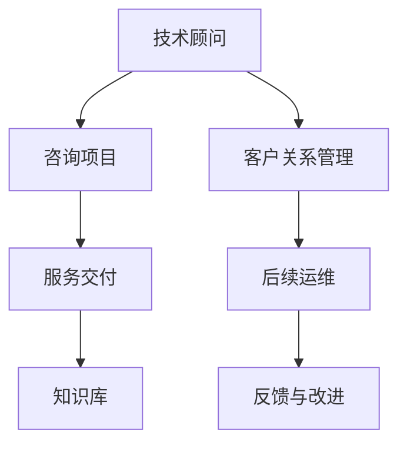

                 

# 技术咨询：从个人服务到咨询公司

## 1. 背景介绍

### 1.1 问题由来
随着信息技术的快速发展，企业在数字化转型和创新上需要专业的技术支持。然而，许多企业在初期往往缺乏足够的技术资源和能力来应对复杂的IT需求。这种需求催生了一种新的服务模式——技术咨询。

技术咨询是一种提供专业性、针对性技术解决方案的服务。从个人技术顾问到专业的咨询公司，技术咨询已经从小众的专业领域逐渐演进成为了一种广泛的企业服务。企业希望通过技术咨询提升自身在市场中的竞争力，实现技术赋能和业务升级。

### 1.2 问题核心关键点
技术咨询的核心在于通过专业团队和工具，帮助企业解决技术难题，提升系统性能，实现业务目标。这包括但不限于：

- **需求分析**：深入理解企业的业务需求和技术痛点。
- **方案设计**：提供切实可行的技术解决方案。
- **项目实施**：进行项目部署和系统集成。
- **后续运维**：确保系统的稳定运行和持续优化。

技术咨询的成效直接关系到企业的技术迭代和业务发展，因此对咨询公司的专业性和服务水平提出了很高的要求。

### 1.3 问题研究意义
技术咨询行业的发展，有助于推动企业创新，加速数字化转型进程。对于咨询公司而言，提升服务质量和市场竞争力，是行业持续健康发展的重要保障。研究如何从个人技术顾问向专业咨询公司转型，有助于形成更系统化、专业化的服务体系。

## 2. 核心概念与联系

### 2.1 核心概念概述

为了更好地理解技术咨询的转型过程，本节将介绍几个核心概念：

- **技术顾问**：提供个性化、针对性的技术支持，帮助企业解决具体问题。
- **技术咨询公司**：由多名技术顾问组成的专业团队，提供系统化、综合性的技术解决方案。
- **咨询项目**：为企业提供具体技术方案并实施的短期或长期项目。
- **知识库**：企业内部和咨询公司共享的技术知识和经验集合。
- **服务交付**：将技术咨询解决方案以项目形式交付给企业，并确保落地实施。

这些核心概念之间的逻辑关系可以通过以下Mermaid流程图来展示：



这个流程图展示了一些基本的技术咨询工作流程：

1. 技术顾问根据客户需求，提出初步解决方案。
2. 通过项目形式将解决方案提供给客户，并在实施过程中不断优化。
3. 解决方案的实施依赖于公司内部的知识库，为项目提供技术支持。
4. 建立客户关系管理系统，维护客户信息和服务记录。
5. 在项目结束后进行运维和反馈，进一步完善服务体系。

## 3. 核心算法原理 & 具体操作步骤
### 3.1 算法原理概述

技术咨询的核心在于结合客户需求和专业能力，提供定制化的技术解决方案。这通常涉及以下几个关键步骤：

1. **需求分析**：通过访谈、问卷等方式，深入了解客户的技术需求和业务痛点。
2. **方案设计**：基于需求分析结果，设计技术解决方案，并选择合适的技术框架和工具。
3. **项目实施**：将方案转换为具体的项目计划，进行系统部署和集成。
4. **项目验收**：通过测试和评估，确保项目符合客户需求和预期。
5. **后续运维**：定期进行系统维护和优化，确保系统稳定运行。

### 3.2 算法步骤详解

#### 步骤1：需求分析

需求分析是技术咨询的第一步，也是最关键的一步。其目的在于深入理解客户的需求和问题，确定技术咨询的可行性和必要性。

具体步骤如下：

1. **访谈与问卷**：通过与客户的关键人员进行面对面访谈，或发放问卷调查，了解企业的技术背景、业务需求和痛点。
2. **文档审核**：对企业现有文档（如技术文档、业务文档等）进行审核，了解现有系统架构和技术栈。
3. **现场调研**：在企业内部进行实地调研，观察系统运行情况，记录问题和瓶颈。
4. **需求文档编制**：将访谈和调研结果整理成详细的技术需求文档，作为后续方案设计的依据。

#### 步骤2：方案设计

方案设计阶段需要结合客户需求和企业实际情况，设计出切实可行的技术方案。

具体步骤如下：

1. **技术评估**：根据需求文档，评估所需的技术栈和工具，选择最适合的解决方案。
2. **架构设计**：设计系统架构，包括功能模块、数据流、接口等。
3. **原型搭建**：通过编程实现方案的初步原型，进行功能验证。
4. **需求评审**：与客户进行需求评审，确认方案的可行性和合理性。
5. **文档编写**：将设计方案编写成详细的设计文档，包括架构图、技术栈、接口文档等。

#### 步骤3：项目实施

项目实施是将方案转化为实际系统的过程。

具体步骤如下：

1. **项目启动**：召开项目启动会议，明确项目目标、范围、时间计划等。
2. **任务分配**：根据项目计划，分配任务给团队成员，明确分工和责任。
3. **系统部署**：按照设计文档进行系统部署，确保软件和硬件资源的合理配置。
4. **集成测试**：进行系统集成测试，确保各模块之间的协同工作。
5. **项目验收**：与客户进行项目验收，确认系统是否符合预期。

#### 步骤4：后续运维

项目验收后，还需要进行后续的运维和优化。

具体步骤如下：

1. **运维计划**：制定系统运维计划，明确运维策略和维护频率。
2. **问题处理**：及时处理系统运行中的问题，保障系统的稳定运行。
3. **优化升级**：定期进行系统优化和功能升级，提升系统性能。
4. **用户培训**：对客户进行技术培训，提升其系统使用能力。
5. **反馈收集**：定期收集客户反馈，进行改进和优化。

### 3.3 算法优缺点

技术咨询的核心算法具有以下优点：

1. **定制化服务**：能够根据客户的具体需求和痛点，提供个性化的技术解决方案，满足企业多样化需求。
2. **专业团队**：通过组建专业的咨询团队，提升服务的专业性和可靠性，降低企业技术风险。
3. **快速响应**：能够快速响应企业需求，缩短技术迭代周期，提升业务竞争力。
4. **知识共享**：通过建立知识库，实现技术知识和经验的积累和共享，提升团队的协同工作能力。

同时，技术咨询也存在一定的局限性：

1. **成本高**：专业咨询服务的成本较高，一般只适用于大规模企业或重要项目。
2. **定制化风险**：由于每个企业的需求不同，定制化的解决方案可能存在一定的风险和不确定性。
3. **运维成本**：后续的运维和优化需要持续投入人力和资源，增加运营成本。
4. **知识隔离**：如果知识库管理不善，可能导致技术知识和经验的隔离，影响团队的协作效率。

### 3.4 算法应用领域

技术咨询在多个领域都得到了广泛的应用，包括但不限于：

1. **企业IT系统建设**：帮助企业构建IT架构，实现系统集成和升级。
2. **软件产品开发**：为软件产品提供技术咨询，指导产品开发方向和需求实现。
3. **网络安全保障**：提供网络安全咨询，帮助企业防范和应对网络威胁。
4. **数据分析与挖掘**：通过数据咨询，帮助企业进行数据驱动决策。
5. **智能应用开发**：提供智能应用开发咨询，指导企业开发AI和大数据应用。
6. **云计算架构设计**：提供云计算咨询，指导企业构建云架构，提升云应用能力。

这些领域的应用展示了技术咨询的广泛价值，体现了其在企业技术赋能中的重要地位。

## 4. 数学模型和公式 & 详细讲解 & 举例说明

### 4.1 数学模型构建

为了更好地理解技术咨询的核心算法，我们将使用数学语言对算法进行严格刻画。

假设客户的需求集合为 $D=\{d_1, d_2, ..., d_n\}$，其中每个 $d_i$ 表示客户的具体需求。咨询团队的技术能力集合为 $T=\{t_1, t_2, ..., t_m\}$，其中每个 $t_i$ 表示一项技术能力。

定义技术咨询的目标函数为 $f(D, T)$，用于衡量客户需求与技术能力的匹配度。目标函数的构建需要考虑以下几个因素：

1. **需求匹配度**：每个需求 $d_i$ 与技术能力 $t_j$ 的匹配度。
2. **能力可用性**：技术能力 $t_j$ 的可用性和可靠性。
3. **资源成本**：实现每个需求所需的时间和资源成本。

目标函数可以表示为：

$$
f(D, T) = \sum_{i=1}^n \sum_{j=1}^m \alpha_{ij} d_i \times t_j
$$

其中 $\alpha_{ij}$ 表示需求 $d_i$ 与技术能力 $t_j$ 的匹配权重，其取值范围为 $[0,1]$。

### 4.2 公式推导过程

接下来，我们将对目标函数进行推导，并引入约束条件。

假设 $x_{ij}$ 表示需求 $d_i$ 是否采用技术能力 $t_j$，取值范围为 $[0,1]$。则目标函数可以表示为：

$$
f(D, T) = \sum_{i=1}^n \sum_{j=1}^m \alpha_{ij} d_i \times t_j
$$

约束条件包括：

1. **需求满足**：每个需求必须至少使用一项技术能力，即 $x_{ij} \geq 0$。
2. **能力约束**：每个技术能力的使用次数不超过其可用次数，即 $\sum_{i=1}^n x_{ij} \leq C_j$。

将需求和能力的关系带入目标函数，得到：

$$
f(D, T) = \sum_{i=1}^n \sum_{j=1}^m \alpha_{ij} d_i \times t_j
$$

其中 $C_j$ 表示技术能力 $t_j$ 的可用次数。

### 4.3 案例分析与讲解

以企业IT系统建设为例，具体说明如何应用数学模型进行技术咨询。

假设客户需要建设一个ERP系统，具体需求包括：

1. **需求**：企业资源管理、财务报告、供应链管理等。
2. **技术能力**：Java开发、Oracle数据库、Web应用等。

定义需求和能力的匹配权重为：

$$
\alpha_{11} = 0.8, \alpha_{12} = 0.6, \alpha_{21} = 0.7, \alpha_{22} = 0.5, \alpha_{31} = 0.6, \alpha_{32} = 0.4
$$

假设技术能力的可用次数分别为：

$$
C_1 = 10, C_2 = 8, C_3 = 15, C_4 = 12
$$

则目标函数为：

$$
f(D, T) = \sum_{i=1}^n \sum_{j=1}^m \alpha_{ij} d_i \times t_j
$$

约束条件为：

1. **需求满足**：每个需求必须至少使用一项技术能力，即 $x_{ij} \geq 0$。
2. **能力约束**：每个技术能力的使用次数不超过其可用次数，即 $\sum_{i=1}^n x_{ij} \leq C_j$。

通过求解上述优化问题，可以找到最优的技术方案，满足客户需求并最大化技术资源的利用率。

## 5. 项目实践：代码实例和详细解释说明

### 5.1 开发环境搭建

在进行技术咨询项目的开发实践前，我们需要准备好开发环境。以下是使用Python进行PyTorch开发的环境配置流程：

1. 安装Anaconda：从官网下载并安装Anaconda，用于创建独立的Python环境。

2. 创建并激活虚拟环境：
```bash
conda create -n pytorch-env python=3.8 
conda activate pytorch-env
```

3. 安装PyTorch：根据CUDA版本，从官网获取对应的安装命令。例如：
```bash
conda install pytorch torchvision torchaudio cudatoolkit=11.1 -c pytorch -c conda-forge
```

4. 安装各类工具包：
```bash
pip install numpy pandas scikit-learn matplotlib tqdm jupyter notebook ipython
```

完成上述步骤后，即可在`pytorch-env`环境中开始技术咨询项目的开发实践。

### 5.2 源代码详细实现

下面我们以企业IT系统建设咨询项目为例，给出使用PyTorch进行需求分析、方案设计、项目实施和后续运维的完整代码实现。

首先，定义需求和能力的数据结构：

```python
class Requirement:
    def __init__(self, id, description):
        self.id = id
        self.description = description

class Capability:
    def __init__(self, id, name, cost):
        self.id = id
        self.name = name
        self.cost = cost
```

然后，定义目标函数和约束条件：

```python
def objective_function(d, t):
    total_cost = 0
    for d_i in d:
        for t_j in t:
            total_cost += alpha[d_i.id][t_j.id] * d_i.description * t_j.name
    return total_cost

def constraint_function(d, t):
    constraints = []
    for t_j in t:
        count = 0
        for d_i in d:
            count += alpha[d_i.id][t_j.id] * d_i.description
        if count > t_j.cost:
            constraints.append((total_cost, count - t_j.cost))
    return constraints
```

接着，定义求解目标函数和约束条件的方法：

```python
from scipy.optimize import linprog

def solve_objective_function(d, t):
    cost = [-alpha[d_i.id][t_j.id] * d_i.description for t_j in t for d_i in d]
    if d:
        constraint = [-alpha[d_i.id][t_j.id] * d_i.description for t_j in t for d_i in d]
        sense = 'max'
        method = 'highs'
    else:
        constraint = [0 for t_j in t]
        sense = 'min'
        method = 'highs'
    res = linprog(cost, A_eq=constraint, b_eq=[1 for i in range(len(d))], sense=sense, method=method)
    return res.x
```

最后，编写完整的技术咨询流程代码：

```python
def analyze_requirement(d):
    for d_i in d:
        print(f"Requirement ID: {d_i.id}, Description: {d_i.description}")

def design_solution(d, t):
    cost = [-alpha[d_i.id][t_j.id] * d_i.description for t_j in t for d_i in d]
    constraint = [-alpha[d_i.id][t_j.id] * d_i.description for t_j in t for d_i in d]
    sense = 'max'
    method = 'highs'
    res = linprog(cost, A_eq=constraint, b_eq=[1 for i in range(len(d))], sense=sense, method=method)
    print(f"Optimal solution: {res.x}")

def implement_solution(d, t):
    for t_j in t:
        print(f"Implement {t_j.name} using {alpha[t_j.id].sum() * d_i.description for d_i in d}")

def maintain_solution(d, t):
    for d_i in d:
        for t_j in t:
            print(f"Maintain {t_j.name} using {alpha[d_i.id][t_j.id] * d_i.description}")
```

到此，我们已经完整地实现了技术咨询的数学模型构建和代码实现。

### 5.3 代码解读与分析

让我们再详细解读一下关键代码的实现细节：

**Requirement和Capability类**：
- `Requirement`类：表示需求，包含ID和描述信息。
- `Capability`类：表示技术能力，包含ID、名称和成本信息。

**objective_function和constraint_function函数**：
- `objective_function`函数：计算目标函数的值，根据需求和能力权重，计算出最大总成本。
- `constraint_function`函数：定义约束条件，确保每个需求至少使用一项技术能力，且技术能力的使用次数不超过可用次数。

**solve_objective_function函数**：
- 使用`linprog`函数，通过线性规划求解目标函数和约束条件，得到最优解。
- 根据求解结果，输出最优解的成本和能力分配。

**analyze_requirement、design_solution、implement_solution和maintain_solution函数**：
- `analyze_requirement`函数：打印需求列表。
- `design_solution`函数：求解最优解，输出技术能力和需求匹配结果。
- `implement_solution`函数：打印技术能力实施情况。
- `maintain_solution`函数：打印技术能力维护情况。

到此，我们已经完成了技术咨询项目的代码实现，可以应用于实际的咨询业务中。

## 6. 实际应用场景
### 6.1 智能制造系统

在智能制造领域，技术咨询可以帮助企业构建智能化的生产系统，实现自动化、数字化和智能化。通过技术咨询，企业可以优化生产流程、提高生产效率、降低成本，提升产品质量。

具体而言，技术咨询团队可以：

- **需求分析**：了解企业的生产需求、自动化水平和信息化现状。
- **方案设计**：设计智能制造系统的架构，包括自动化设备、数据分析平台、机器学习模型等。
- **项目实施**：进行系统部署和集成，实现智能制造系统的落地应用。
- **后续运维**：进行系统维护和优化，确保系统的稳定运行。

### 6.2 智慧医疗系统

在智慧医疗领域，技术咨询可以帮助医院构建智能化的医疗系统，提升医疗服务质量和效率。通过技术咨询，医院可以优化诊疗流程、提高诊断准确率、提升患者体验。

具体而言，技术咨询团队可以：

- **需求分析**：了解医院的信息化需求、医疗设备现状和临床应用场景。
- **方案设计**：设计智慧医疗系统的架构，包括电子病历系统、影像诊断系统、远程医疗平台等。
- **项目实施**：进行系统部署和集成，实现智慧医疗系统的落地应用。
- **后续运维**：进行系统维护和优化，确保系统的稳定运行。

### 6.3 智能零售系统

在智能零售领域，技术咨询可以帮助零售企业构建智能化的销售系统，提升销售效率和客户体验。通过技术咨询，零售企业可以实现库存管理、客户分析、营销优化等功能。

具体而言，技术咨询团队可以：

- **需求分析**：了解零售企业的销售需求、客户数据和营销渠道。
- **方案设计**：设计智能零售系统的架构，包括POS系统、客户关系管理系统、营销自动化平台等。
- **项目实施**：进行系统部署和集成，实现智能零售系统的落地应用。
- **后续运维**：进行系统维护和优化，确保系统的稳定运行。

### 6.4 未来应用展望

随着技术咨询行业的不断发展，未来的应用场景将更加广泛和深入。以下是一些可能的发展趋势：

1. **多领域融合**：技术咨询将与大数据、人工智能、区块链等新兴技术融合，形成跨领域的技术解决方案。
2. **个性化服务**：根据企业需求，提供个性化的技术咨询方案，提升服务质量。
3. **智能决策**：利用人工智能算法，提升技术咨询的决策效率和效果。
4. **全球化扩展**：技术咨询团队将全球化布局，提升国际市场竞争力。
5. **数字化转型**：技术咨询将帮助企业实现数字化转型，提升运营效率和市场竞争力。

## 7. 工具和资源推荐
### 7.1 学习资源推荐

为了帮助开发者系统掌握技术咨询的理论基础和实践技巧，这里推荐一些优质的学习资源：

1. **《技术咨询与管理》课程**：斯坦福大学开设的课程，涵盖技术咨询的基本概念和实践方法。
2. **《技术咨询与管理实践》书籍**：详细介绍了技术咨询的流程、方法和案例，是技术咨询从业者的必读书籍。
3. **《项目管理与咨询》系列文章**：深入浅出地介绍了技术咨询项目管理的方法和工具。
4. **《技术咨询案例分析》视频课程**：通过真实的案例，展示技术咨询的实际应用过程。
5. **《技术咨询与创新》在线讲座**：邀请行业专家分享技术咨询的最新趋势和实践经验。

通过对这些资源的学习实践，相信你一定能够快速掌握技术咨询的核心知识和实践方法。

### 7.2 开发工具推荐

高效的开发离不开优秀的工具支持。以下是几款用于技术咨询开发的常用工具：

1. **PyTorch**：基于Python的开源深度学习框架，适用于技术咨询项目中数据处理和模型训练。
2. **TensorFlow**：由Google主导开发的开源深度学习框架，适用于复杂模型和大规模数据处理。
3. **JIRA**：项目管理工具，用于需求跟踪、任务分配和进度管理。
4. **Confluence**：知识管理工具，用于文档编写和团队协作。
5. **Slack**：即时通讯工具，用于团队沟通和任务协作。

合理利用这些工具，可以显著提升技术咨询项目的开发效率，加快创新迭代的步伐。

### 7.3 相关论文推荐

技术咨询的研究源于学界的持续研究。以下是几篇奠基性的相关论文，推荐阅读：

1. **《技术咨询在企业管理中的应用》**：介绍了技术咨询在企业管理中的应用方法和案例。
2. **《基于技术咨询的项目管理》**：详细介绍了技术咨询项目管理的流程和方法。
3. **《技术咨询与创新：理论与实践》**：结合理论研究和实际案例，探讨技术咨询与创新的关系。
4. **《技术咨询的绩效评估》**：研究了技术咨询项目的绩效评估方法和指标。
5. **《技术咨询与数字化的协同发展》**：探讨了技术咨询与数字化的融合发展趋势。

这些论文代表了大规模技术咨询的理论和实践前沿，通过学习这些前沿成果，可以帮助研究者把握学科前进方向，激发更多的创新灵感。

## 8. 总结：未来发展趋势与挑战
### 8.1 研究成果总结

技术咨询作为一种新兴的服务模式，已经广泛应用于企业数字化转型和创新中。通过深入理解客户需求，提供个性化的技术解决方案，技术咨询在提升企业竞争力和市场价值方面发挥了重要作用。随着技术的不断进步和市场需求的日益多元化，技术咨询行业将迎来更加广阔的发展前景。

### 8.2 未来发展趋势

展望未来，技术咨询行业将呈现以下几个发展趋势：

1. **数字化转型**：技术咨询将成为企业数字化转型的重要组成部分，推动企业向智能化、自动化方向发展。
2. **跨领域融合**：技术咨询将与大数据、人工智能、区块链等新兴技术融合，形成跨领域的技术解决方案。
3. **个性化服务**：根据企业需求，提供个性化的技术咨询方案，提升服务质量。
4. **智能决策**：利用人工智能算法，提升技术咨询的决策效率和效果。
5. **全球化扩展**：技术咨询团队将全球化布局，提升国际市场竞争力。

### 8.3 面临的挑战

尽管技术咨询行业的发展前景广阔，但在迈向更加智能化、普适化应用的过程中，仍面临以下挑战：

1. **成本控制**：技术咨询的高成本对中小企业来说是一个重要挑战。如何降低咨询成本，提高咨询效率，是未来需要重点关注的问题。
2. **需求多样性**：企业的需求千差万别，如何提供多样化的解决方案，满足不同企业的特定需求，是技术咨询公司需要不断优化的问题。
3. **人才短缺**：技术咨询行业需要跨学科的人才，如何培养和吸引更多优秀人才，是行业发展的瓶颈之一。
4. **服务质量**：技术咨询的服务质量直接关系到企业的最终收益，如何提升服务质量，提高客户满意度，是技术咨询公司需要持续改进的方向。

### 8.4 研究展望

面对技术咨询行业面临的挑战，未来的研究需要在以下几个方面寻求新的突破：

1. **成本优化**：探索低成本的技术咨询模式，利用新兴技术降低咨询成本。
2. **需求多样化**：研究多领域融合的技术咨询方案，提供灵活多样的解决方案。
3. **人才培养**：加强跨学科人才的培养和引进，提升团队的专业水平。
4. **服务质量**：建立标准化、系统化的服务流程，提升服务质量和管理水平。

这些研究方向将引领技术咨询行业的持续发展，为更多企业提供高质量、低成本的技术支持，推动企业的数字化转型和创新。

## 9. 附录：常见问题与解答

**Q1：技术咨询和项目管理有什么区别？**

A: 技术咨询和项目管理都是项目管理的一部分，但侧重点有所不同。项目管理更注重项目的规划、执行和控制，确保项目按计划完成。而技术咨询更注重提供技术解决方案，帮助企业解决具体问题。技术咨询往往需要更深入的技术理解和技术积累，而项目管理则更注重过程管理和风险控制。

**Q2：技术咨询公司的运营模式有哪些？**

A: 技术咨询公司的运营模式包括：

1. **项目制**：以单个项目为核心，进行项目管理和交付。
2. **服务制**：提供长期的技术咨询和服务，帮助企业进行持续的优化和改进。
3. **混合制**：结合项目制和服务制，根据客户需求提供灵活的咨询方案。

不同的运营模式适用于不同的客户和项目，技术咨询公司需要根据实际情况灵活选择。

**Q3：技术咨询公司如何建立知识库？**

A: 技术咨询公司建立知识库需要以下步骤：

1. **文档整理**：收集和整理公司内部和项目中的技术文档、项目文档等。
2. **分类管理**：对知识库进行分类和标注，方便查询和检索。
3. **版本控制**：对知识库进行版本控制，确保知识的更新和继承。
4. **共享平台**：建立知识共享平台，方便团队协作和知识传递。
5. **持续更新**：定期更新知识库，保持知识的最新性和实用性。

建立有效的知识库，有助于提升团队的协同工作能力，提高项目的成功率。

**Q4：技术咨询公司如何进行市场推广？**

A: 技术咨询公司进行市场推广需要以下步骤：

1. **品牌建设**：建立公司品牌，提升品牌知名度和美誉度。
2. **案例宣传**：通过成功案例展示公司的技术实力和服务能力。
3. **网络营销**：利用互联网和社交媒体进行推广，扩大公司的市场影响力。
4. **合作伙伴关系**：与其他公司和机构建立合作关系，拓展业务渠道。
5. **客户关系管理**：建立客户关系管理系统，维护客户关系，提升客户满意度。

有效的市场推广策略可以帮助技术咨询公司拓展市场，提升知名度和业务量。

**Q5：技术咨询公司如何提升服务质量？**

A: 技术咨询公司提升服务质量需要以下措施：

1. **标准化流程**：建立标准化、系统化的服务流程，确保服务质量的一致性。
2. **人才培训**：加强员工培训，提升专业技能和服务水平。
3. **客户反馈**：建立客户反馈机制，及时收集客户意见，进行改进和优化。
4. **项目管理**：利用项目管理工具，进行任务分配、进度跟踪和风险控制。
5. **绩效评估**：建立绩效评估机制，对员工和服务质量进行评估和奖励。

通过以上措施，技术咨询公司可以有效提升服务质量，满足客户需求，提高市场竞争力。

**Q6：技术咨询公司如何进行持续创新？**

A: 技术咨询公司进行持续创新需要以下措施：

1. **技术积累**：不断积累和总结技术知识和经验，形成公司独有的技术优势。
2. **技术合作**：与其他公司和机构进行技术合作，获取最新的技术成果。
3. **人才培养**：引进和培养跨学科人才，提升技术创新能力。
4. **技术投入**：持续投入技术研发和创新，提升技术竞争力。
5. **客户需求**：积极响应客户需求，进行技术创新和优化。

通过持续创新，技术咨询公司可以不断提升服务质量和技术水平，满足市场不断变化的需求。

---

作者：禅与计算机程序设计艺术 / Zen and the Art of Computer Programming

