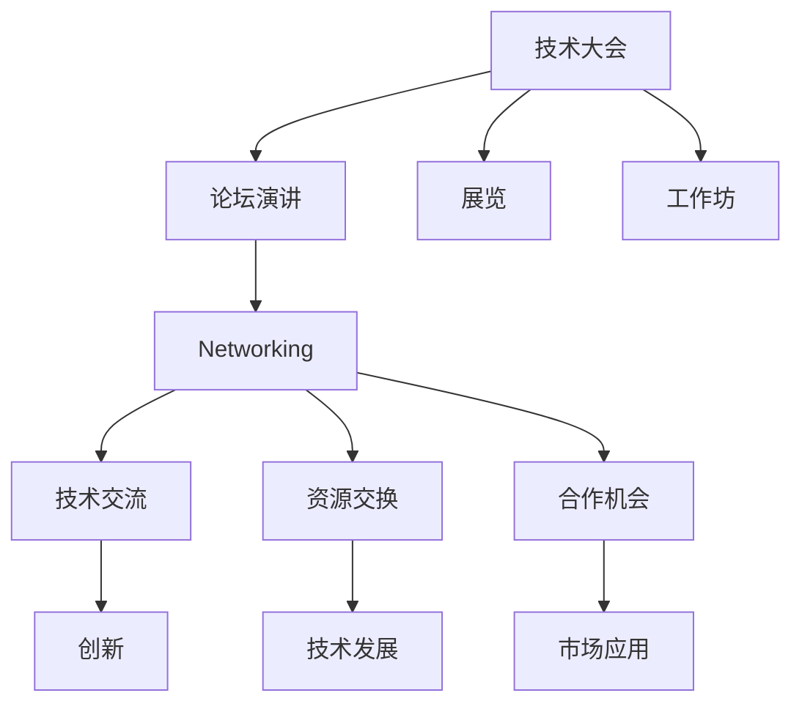

                 

# 技术大会：networking与机遇

> 关键词：技术大会, networking, 机遇, 交流, 协作, 创新, 社区建设, 职业发展

## 1. 背景介绍

### 1.1 问题由来

随着信息技术的快速发展，全球技术大会已成为创新和思想交流的重要平台。技术大会不仅展示了最新的技术成果，也是企业、研究机构和技术人员结识、交流与合作的重要场所。

近年来，由于网络通信技术的进步，线上线下结合的技术大会在全球范围内普遍开展。虽然技术大会在提供交流与合作机会方面具有重大作用，但如何最大化这些机会，使其成为推动技术进步和职业发展的有效手段，却是一个值得深入探讨的问题。

### 1.2 问题核心关键点

技术大会的成功，不仅依赖于高质量的演讲和技术分享，更需要与会者间的有效网络交流。因此，本文将聚焦于技术大会上的 networking（社交网络）与机遇，探讨如何利用技术大会促进技术交流和职业发展。

### 1.3 问题研究意义

本文旨在为技术人员提供实用策略，帮助他们在技术大会上建立有效的网络，并从中获取职业发展机会。通过了解 networking 的重要性，学习有效的沟通技巧，将有助于参与者在技术大会上获得更深层次的体验和收益。

## 2. 核心概念与联系

### 2.1 核心概念概述

为更好地理解 networking 与机遇的关联，本文将介绍几个关键概念：

- **技术大会**：聚焦技术进步、产品发布、市场趋势的盛大集会，通常包括论坛演讲、展览、工作坊等环节。

- **Networking**：建立和维护个人或组织间的联系，旨在信息共享、资源交换、合作机会等。

- **机遇**：在特定环境或条件下出现的有利时机或可能性，往往与 networking 紧密相关。

- **技术社区**：围绕特定技术或领域形成的社群，成员间通过交流、协作来推动技术进步。

- **合作与创新**：通过有效的 networking，促进技术项目、新产品或新解决方案的开发。

这些概念之间的联系可以通过以下 Mermaid 流程图来展示：



这个流程图展示了技术大会上 networking 的主要场景：

1. 通过论坛演讲、展览、工作坊等环节建立联系。
2. 进行技术交流，分享知识和技术。
3. 交换资源，获取所需信息。
4. 发现和把握合作机会，促进创新和市场应用。

## 3. 核心算法原理 & 具体操作步骤

### 3.1 算法原理概述

在技术大会上进行 effective networking，其实是一种社交算法，旨在最大化信息的获取和交流。核心算法原理可以概括为以下几个步骤：

1. **信息获取**：在技术大会上，通过多种渠道获取演讲、展览、工作坊等信息。
2. **人脉建立**：与演讲者、参展商、同行等建立联系，进行信息交流和资源共享。
3. **关系维护**：持续维护这些关系，通过跟进、分享、合作等方式保持联系。
4. **机会识别**：在获取信息和建立人脉的基础上，识别潜在的合作、技术交流、职业发展等机会。

### 3.2 算法步骤详解

#### 3.2.1 信息获取

在技术大会上，信息获取是 networking 的第一步。为确保获取全面有效的信息，可采用以下策略：

1. **注册会前**：提前了解大会的议程、演讲嘉宾、展览厂商等相关信息。
2. **会议期间**：现场浏览展台、查看公告板、关注实时通讯。
3. **会后跟进**：通过大会网站、邮件列表等方式，获取后续更新和资源。

#### 3.2.2 人脉建立

人脉建立是 networking 的核心环节，通过有效沟通和互动，能够为后续的合作和交流打下基础。具体步骤包括：

1. **主动接触**：在演讲结束后、展览期间和工作坊休息时间，主动接近演讲者、参展商等。
2. **介绍自己**：简要介绍自己的职业背景和兴趣领域，表达对对方工作的敬意和兴趣。
3. **交换信息**：主动索取对方的名片、社交媒体账号、联系方式等信息。
4. **后续跟进**：会后通过邮件、社交媒体等渠道，与新结识的联系人保持联系，关注其发布的更新。

#### 3.2.3 关系维护

在大会后，持续维护与联系人的关系是 networking 的长期目标。主要方法包括：

1. **定期联系**：不定期通过邮件、社交媒体等形式，与联系人保持联系，分享工作动态和最新成果。
2. **定期见面**：安排定期的会议、社交活动，进一步加强联系和互动。
3. **共同参与**：邀请联系人参与到相关项目或研究中，建立更紧密的工作关系。

#### 3.2.4 机会识别

在有效 networking 的基础上，识别潜在的机会是 networking 的最终目的。关键方法包括：

1. **识别需求**：通过与联系人的交流，识别对方可能的需求和兴趣。
2. **提出建议**：在了解需求的基础上，提出具体的合作建议或合作机会。
3. **谈判合作**：在提出建议后，通过谈判确定合作的细节和方式。

### 3.3 算法优缺点

有效 networking 的算法具有以下优点：

1. **信息获取全面**：通过多渠道获取信息，确保覆盖大会的各个环节。
2. **人脉建立有效**：主动接触和后续跟进，能够有效建立联系，为后续交流打下基础。
3. **关系维护持久**：通过定期联系和共同参与，维护长期关系，提升合作机会。
4. **机会识别明确**：通过识别需求和提出建议，明确潜在的合作机会。

同时，该算法也存在一定的局限性：

1. **依赖个人主动性**：成功 networking 依赖于个人的主动性和沟通能力。
2. **时间和精力投入**：有效 networking 需要投入大量时间和精力，并非总是容易实现。
3. **信息真实性**：在获取信息时，需要确保信息来源的真实性，避免误导。

尽管存在这些局限性，有效 networking 仍是技术大会上获取职业发展和合作机会的重要手段。

### 3.4 算法应用领域

有效 networking 在多个领域具有广泛的应用，主要包括：

- **技术交流**：通过大会上的技术演讲和展览，获取最新的技术进展和市场动态。
- **资源交换**：通过与参展商的互动，获取所需的技术资料、软件工具和硬件设备。
- **职业发展**：通过与其他技术人员建立联系，获取就业机会、招聘信息和职业建议。
- **合作与创新**：通过大会上的多方互动，识别合作机会，推动技术创新和项目合作。
- **社区建设**：通过参与技术社区的建设，扩大影响力，推动技术社区的发展。

## 4. 数学模型和公式 & 详细讲解 & 举例说明

### 4.1 数学模型构建

在描述 effective networking 的数学模型时，可以采用图论模型来表示人与人之间的关系。假设大会上有 $N$ 名参与者，每个人有 $d$ 个联系人，则可构建如下模型：

1. **节点**：大会上每个参与者为一个节点。
2. **边**：参与者之间的联系（包括通过邮件、社交媒体等形式）为边。
3. **权重**：边上的权重表示联系的强度，可通过交流频率、合作次数等指标衡量。

使用 $G(N, E, W)$ 表示该图论模型，其中 $N$ 为节点数，$E$ 为边数，$W$ 为边上的权重。

### 4.2 公式推导过程

在推导有效 networking 的公式时，通常采用以下方法：

1. **节点强度**：节点强度表示一个参与者在大会上的影响力，可通过计算该节点连接的边权重之和来衡量。
2. **社区划分**：使用聚类算法（如K-means、Louvain算法等）对节点进行社区划分，识别影响力较大的核心节点。
3. **中心性指标**：计算节点之间的中心性指标（如度中心性、接近中心性等），评估节点在网络中的重要性。

设 $G(N, E, W)$ 为大会的社交网络图，$A$ 为邻接矩阵，则节点 $i$ 的节点强度 $S_i$ 可表示为：

$$ S_i = \sum_{j=1}^{N} A_{ij}W_{ij} $$

其中 $A_{ij}$ 为邻接矩阵中的元素，$W_{ij}$ 为边上的权重。

### 4.3 案例分析与讲解

假设某次技术大会上有 $M$ 名演讲者和 $N$ 名参展商，通过互动形成了一个社交网络。使用上述公式计算每个参与者的节点强度，发现：

1. 演讲者通常拥有较高的节点强度，因为他们在大会上演讲的次数较多，接触面广。
2. 参展商的节点强度与展览的受欢迎程度相关，受关注度高的展台接触频率更高。
3. 通过中心性指标，识别出在社交网络中影响力较大的核心节点，包括演讲者、重要参展商等。

## 5. 项目实践：代码实例和详细解释说明

### 5.1 开发环境搭建

在进行有效 networking 实践前，我们需要准备好开发环境。以下是使用 Python 和 NetworkX 库进行网络建模的环境配置流程：

1. 安装 Anaconda：从官网下载并安装 Anaconda，用于创建独立的 Python 环境。
2. 创建并激活虚拟环境：
```bash
conda create -n networking-env python=3.8 
conda activate networking-env
```

3. 安装 Python 和 NetworkX 库：
```bash
conda install networkx matplotlib 
pip install networkx matplotlib
```

4. 安装所需的其他工具包：
```bash
pip install pandas numpy scipy seaborn
```

完成上述步骤后，即可在 `networking-env` 环境中开始 networking 实践。

### 5.2 源代码详细实现

以下是使用 Python 和 NetworkX 库进行社交网络分析的代码实现：

```python
import networkx as nx
import pandas as pd
import matplotlib.pyplot as plt

# 读取社交网络数据
data = pd.read_csv('network_data.csv')

# 构建社交网络图
G = nx.Graph()
for i in range(len(data)):
    node1 = data.iloc[i]['node_id']
    node2 = data.iloc[i]['contact_id']
    G.add_edge(node1, node2, weight=data.iloc[i]['weight'])

# 计算节点强度
node_strength = nx.degree_centrality(G)
for node in node_strength:
    print(f"{node}: {node_strength[node]}")

# 划分社区
communities = nx.community.kmeans_graph_clustering(G, k=3)
for community in communities:
    print(f"Community {community}: {communities[community]}")

# 绘制社交网络图
nx.draw(G, with_labels=True, node_color='lightblue', node_size=50, edge_color='gray')
plt.show()
```

这段代码实现了以下功能：

1. 从 CSV 文件中读取社交网络数据。
2. 使用 NetworkX 库构建社交网络图。
3. 计算每个节点的节点强度。
4. 使用 K-means 聚类算法划分社区。
5. 绘制社交网络图并显示结果。

### 5.3 代码解读与分析

让我们再详细解读一下关键代码的实现细节：

**代码第 1-2 行**：
```python
import networkx as nx
import pandas as pd
import matplotlib.pyplot as plt
```

导入了 NetworkX、Pandas 和 Matplotlib 库，用于数据处理和图形绘制。

**代码第 3-6 行**：
```python
# 读取社交网络数据
data = pd.read_csv('network_data.csv')
```

使用 Pandas 的 `read_csv` 函数读取 CSV 文件中的社交网络数据，假设每条记录包含节点 ID、联系人 ID 和关系强度等字段。

**代码第 7-9 行**：
```python
# 构建社交网络图
G = nx.Graph()
for i in range(len(data)):
    node1 = data.iloc[i]['node_id']
    node2 = data.iloc[i]['contact_id']
    G.add_edge(node1, node2, weight=data.iloc[i]['weight'])
```

通过循环遍历数据集中的每条记录，使用 NetworkX 的 `add_edge` 方法构建社交网络图，其中 `node1` 和 `node2` 为节点 ID，`weight` 为边上的权重。

**代码第 10-12 行**：
```python
# 计算节点强度
node_strength = nx.degree_centrality(G)
for node in node_strength:
    print(f"{node}: {node_strength[node]}")
```

使用 NetworkX 的 `degree_centrality` 方法计算每个节点的节点强度，并打印输出。

**代码第 13-14 行**：
```python
# 划分社区
communities = nx.community.kmeans_graph_clustering(G, k=3)
for community in communities:
    print(f"Community {community}: {communities[community]}")
```

使用 NetworkX 的 `kmeans_graph_clustering` 方法对社交网络图进行社区划分，划分出的社区通过打印输出。

**代码第 15-16 行**：
```python
# 绘制社交网络图
nx.draw(G, with_labels=True, node_color='lightblue', node_size=50, edge_color='gray')
plt.show()
```

使用 NetworkX 的 `draw` 方法绘制社交网络图，并使用 Matplotlib 显示图形。

## 6. 实际应用场景

### 6.1 技术公司内部的社交网络

技术公司在内部分布多样化的专业人才，通过有效 networking 能够促进跨部门协作，推动技术创新和项目开发。具体应用场景包括：

1. **项目合作**：通过在公司内部的社交网络中建立联系，识别有技术专长或经验的项目合作伙伴，提升项目开发效率。
2. **技术交流**：通过公司内部的技术分享活动、技术沙龙等，促进不同部门的技术交流和知识共享。
3. **人才招聘**：在招聘过程中，利用内部社交网络推荐候选人，获取更多优秀的技术人才。

### 6.2 行业技术大会的社交网络

在行业技术大会上，通过有效 networking，能够获得最新的技术动态和行业信息。具体应用场景包括：

1. **技术趋势**：通过与演讲者和参展商的交流，获取最新的技术趋势和市场需求。
2. **技术合作**：识别潜在的合作伙伴，推动技术合作项目和联合研发。
3. **职业发展**：通过大会上的互动，获取职业发展的机会和建议，拓展职业网络。

### 6.3 全球技术社区的社交网络

在全球技术社区中，通过有效 networking 能够推动技术创新和社区发展。具体应用场景包括：

1. **技术开源**：通过社区内的互动，推动技术开源项目的发展，获取更多社区成员的支持和贡献。
2. **技术标准**：通过社区内的讨论和投票，制定和推广技术标准，推动技术进步。
3. **技术竞赛**：通过社区内的技术竞赛，推动技术创新的发展，提升社区成员的技术水平。

### 6.4 未来应用展望

随着信息技术的进一步发展，未来的有效 networking 将呈现出以下几个趋势：

1. **自动化网络构建**：使用 AI 技术自动分析社交网络数据，推荐潜在联系人，提升 networking 的效率。
2. **实时社交网络分析**：通过实时数据分析技术，及时把握社交网络中的变化，识别新出现的合作机会。
3. **多模态社交网络**：结合文本、语音、图像等多种信息，构建更全面、多维度的社交网络，提升 networking 的深度和广度。

## 7. 工具和资源推荐

### 7.1 学习资源推荐

为了帮助技术人员系统掌握有效 networking 的理论与实践，这里推荐一些优质的学习资源：

1. **Networking in the 21st Century**：由美国加州大学圣地亚哥分校（UCSD）开设的在线课程，讲解现代社交网络和职业发展的最佳实践。
2. **LinkedIn Learning**：提供大量有关职业发展和有效 networking 的在线课程，适合各类技术从业者。
3. **Coursera**：提供由斯坦福大学等名校教授讲授的有关职业发展和技术社交的课程，系统性介绍 networking 技巧。
4. **《网络社交的艺术》**：知名社交网络专家 Andrew Keen 所著，系统讲解社交网络的理论和方法。

通过对这些资源的学习实践，相信你一定能够快速掌握有效 networking 的精髓，并用于解决实际的职业发展问题。

### 7.2 开发工具推荐

高效的开发离不开优秀的工具支持。以下是几款用于有效 networking 开发的常用工具：

1. **Slack**：在线即时通讯工具，便于组织和维护技术社区的交流。
2. **Zoom**：在线视频会议工具，适合进行远程技术分享和交流。
3. **GitHub**：代码托管平台，适合协作开发和分享技术开源项目。
4. **Trello**：项目管理工具，便于组织和跟踪技术合作项目。
5. **Google Meet**：视频会议工具，适合进行跨地域的技术交流和协作。

合理利用这些工具，可以显著提升有效 networking 的开发效率，加快创新迭代的步伐。

### 7.3 相关论文推荐

有效 networking 的研究源于学界的持续研究。以下是几篇奠基性的相关论文，推荐阅读：

1. **"Connecting Experts: The Networking Role of the NIPS Conference"**：通过对 NIPS 会议的研究，分析技术大会上有效 networking 对职业发展和合作的影响。
2. **"Cross-Network Pathways: Modeling and Analyzing Professional Networking Structures"**：使用图论方法分析职业网络中的联系路径和合作机会。
3. **"The Role of Networking in Academic Research: A Survey"**：通过对学术界的调研，评估 networking 在学术研究中的应用和效果。

这些论文代表了大语言模型微调技术的发展脉络。通过学习这些前沿成果，可以帮助研究者把握学科前进方向，激发更多的创新灵感。

## 8. 总结：未来发展趋势与挑战

### 8.1 总结

本文对有效 networking 与技术大会的机遇进行了全面系统的介绍。首先阐述了有效 networking 的重要性，明确了技术大会上 networking 的各个环节。其次，从原理到实践，详细讲解了有效 networking 的数学模型和操作步骤，给出了有效 networking 任务开发的完整代码实例。同时，本文还广泛探讨了有效 networking 在技术公司内部、行业技术大会和全球技术社区等多个场景的应用前景，展示了 networking 的巨大潜力。

通过本文的系统梳理，可以看到，有效 networking 在技术大会上发挥着至关重要的作用，极大地促进了技术交流和职业发展。未来，伴随技术大会的持续举办，有效 networking 将成为推动技术创新和产业发展的重要手段。

### 8.2 未来发展趋势

展望未来，有效 networking 将呈现以下几个发展趋势：

1. **智能化**：使用 AI 技术优化 networking 过程，自动推荐潜在联系人，提升 networking 的效率。
2. **实时化**：利用实时数据分析技术，及时把握社交网络的变化，实时识别合作机会。
3. **多模态**：结合多种信息，构建更全面、多维度的社交网络，提升 networking 的深度和广度。
4. **全球化**：通过技术大会等国际平台，促进全球技术社区的交流和合作，提升技术的影响力和传播速度。

### 8.3 面临的挑战

尽管有效 networking 已经取得了显著成效，但在迈向更加智能化、全球化应用的过程中，仍面临诸多挑战：

1. **数据隐私和安全**：在数据分析和处理过程中，需要确保数据隐私和安全，避免信息泄露。
2. **跨文化差异**：在国际化技术社区中，需要考虑不同文化背景下的沟通方式和习惯，提升跨文化交流的效率。
3. **语言障碍**：在跨国技术社区中，需要克服语言障碍，提升多语言交流的顺畅性。
4. **技术与人的匹配**：需要提高技术与人之间的匹配效率，避免误配和错配，提升合作效果。

尽管存在这些挑战，未来通过不断改进和创新，有效 networking 必将成为技术大会上不可缺少的重要环节，为技术交流和职业发展提供更高效、更广泛的平台。

### 8.4 研究展望

面向未来，有效 networking 的研究需要在以下几个方面寻求新的突破：

1. **AI 辅助 networking**：利用 AI 技术自动推荐和匹配潜在联系人，提升 networking 的效率和质量。
2. **多语言支持**：开发多语言分析工具，提升国际化技术社区的交流效果。
3. **社交网络分析**：利用图论和网络分析方法，挖掘社交网络中的潜力和机会，优化 networking 策略。
4. **技术社区建设**：通过技术大会等平台，推动全球技术社区的建设和发展，提升技术交流和合作水平。

这些研究方向的探索，必将引领 effective networking 技术迈向更高的台阶，为技术大会和职业发展带来新的机遇。总之，通过不断创新和改进，有效 networking 必将在技术交流和职业发展中发挥更大的作用，推动技术进步和产业升级。

## 9. 附录：常见问题与解答

**Q1：如何在技术大会上进行有效 networking？**

A: 有效 networking 的关键在于主动接触和后续跟进。具体方法包括：

1. **提前准备**：在大会前了解演讲嘉宾、参展商等关键人物的信息。
2. **主动接近**：在演讲结束后、展览期间和工作坊休息时间，主动接近演讲者、参展商等。
3. **介绍自己**：简要介绍自己的职业背景和兴趣领域，表达对对方工作的敬意和兴趣。
4. **交换信息**：主动索取对方的名片、社交媒体账号、联系方式等信息。
5. **后续跟进**：会后通过邮件、社交媒体等渠道，与新结识的联系人保持联系，关注其发布的更新。

**Q2：如何利用技术大会促进职业发展？**

A: 利用技术大会促进职业发展需要多方面策略：

1. **技术学习**：通过大会上的技术分享活动、技术沙龙等，学习最新的技术动态和知识。
2. **职业交流**：通过与演讲者、参展商等的互动，获取职业发展的机会和建议。
3. **人脉扩展**：建立和维护与新结识的人脉，为未来的合作和职业发展奠定基础。
4. **项目合作**：识别潜在的合作伙伴，推动技术合作项目和联合研发。
5. **技术交流**：通过社区内的讨论和分享，提升技术水平和影响力。

**Q3：在技术社区中如何进行有效 networking？**

A: 在技术社区中进行有效 networking 需要以下方法：

1. **积极参与**：积极参与社区的讨论、活动和项目，提升自己在社区中的活跃度和影响力。
2. **建立信任**：通过持续的交流和合作，建立与社区成员之间的信任关系。
3. **知识共享**：分享自己的技术见解和经验，帮助社区成员解决问题。
4. **寻求合作**：识别社区中的潜在合作伙伴，推动技术项目和合作项目的开发。
5. **保持联系**：通过定期跟进和互动，维护与社区成员的关系，提升社区的凝聚力。

通过本文的系统梳理，可以看到，有效 networking 在技术大会和社区中具有重要的应用价值，能够极大地促进技术交流和职业发展。未来，伴随技术社区的不断发展和壮大，有效 networking 必将成为技术社区中的重要环节，推动技术创新和产业发展。

---

作者：禅与计算机程序设计艺术 / Zen and the Art of Computer Programming

