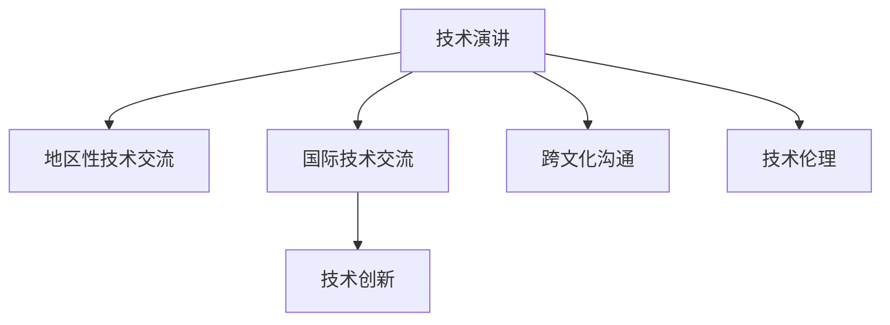

                 

# 技术演讲：从地区到国际舞台

> 关键词：技术演讲,地区到国际舞台,技术分享,技术创新,技术交流

## 1. 背景介绍

### 1.1 问题由来
随着全球化加速，技术创新的边界已经模糊，跨地域的技术交流成为推动科技发展的强劲动力。在过去的十年中，我们看到，从亚洲到欧洲再到北美，技术演讲和分享成为了连接不同地域的桥梁，促进了全球范围内的知识传播和创新合作。这种交流不仅限于单一地区，而是跨地域、跨文化的，它为全球技术界提供了一个展示、学习和借鉴的机会，推动了全球技术生态的蓬勃发展。

### 1.2 问题核心关键点
技术演讲的根本目的在于知识的共享和创新思维的交流。在国际舞台上，这不仅需要清晰表达，更需要理解不同文化背景下的听众需求，以及通过技术交流促进更深层次的合作。技术演讲的核心关键点包括以下几点：

1. **内容与形式**：如何结合技术深度和演讲技巧，让技术内容既准确又生动。
2. **文化适应性**：如何使技术演讲内容适应不同文化背景的听众。
3. **互动与反馈**：如何在演讲中融入互动元素，以及如何处理听众的反馈。
4. **技术与伦理**：如何在展示技术创新的同时，关注技术带来的社会影响和伦理问题。

### 1.3 问题研究意义
在全球化的今天，技术演讲不再局限于本地，而是全球性的沟通和交流平台。它对于推动科技的国际合作，加速技术的全球传播，具有深远的意义：

1. **知识共享**：将前沿技术带给世界各地，促进全球知识共享。
2. **文化交流**：跨文化的技术交流，促进不同文化之间的理解和尊重。
3. **创新驱动**：激发不同地域的创新思维，促进全球技术生态的发展。
4. **合作与协同**：为不同地区的技术团队提供合作和协同发展的机会。

## 2. 核心概念与联系

### 2.1 核心概念概述

为更好地理解技术演讲的国际舞台，本节将介绍几个密切相关的核心概念：

- **技术演讲（Technical Talk）**：在技术会议上或专业场合进行的、专注于特定技术领域的技术分享。
- **地区性技术交流（Regional Tech Exchange）**：聚焦于特定区域的技术演讲和分享活动。
- **国际技术交流（International Tech Exchange）**：跨越国界的技术演讲和分享活动，促进全球技术生态的互动和融合。
- **技术创新（Technological Innovation）**：新技术、新方法、新工具的开发和应用。
- **跨文化沟通（Cross-Cultural Communication）**：在跨文化背景下，技术演讲的表达和理解。
- **技术伦理（Technological Ethics）**：技术发展带来的伦理和社会问题，以及如何在演讲中体现和探讨。

这些核心概念之间的逻辑关系可以通过以下Mermaid流程图来展示：



这个流程图展示了这个概念网络，其中：

1. 技术演讲是整个网络的基础。
2. 地区性技术交流和国际技术交流是其拓展，带来不同地域的交流和创新。
3. 技术创新是技术演讲的目标之一，即通过演讲推动技术的发展和应用。
4. 跨文化沟通和技术伦理是技术演讲过程中需要特别关注的部分，确保演讲和交流的有效性和公正性。

## 3. 核心算法原理 & 具体操作步骤
### 3.1 算法原理概述

技术演讲的核心在于如何将复杂的、专业的技术内容，以清晰、易懂的方式传达给不同文化背景的听众。这涉及到了语言、表达方式、内容组织等多方面的考虑。技术演讲的算法原理可以从以下几个方面理解：

1. **清晰简洁**：通过结构化的内容组织，清晰地传达技术信息。
2. **互动交流**：通过提问、讨论等方式，增强听众的参与感和理解。
3. **文化适应**：调整语言和表达方式，以适应不同文化背景的听众。
4. **伦理考量**：在展示技术创新的同时，考虑技术带来的社会影响和伦理问题。

### 3.2 算法步骤详解

技术演讲的实际操作可以分为以下几个步骤：

**Step 1: 准备演讲内容**
- 确定演讲主题和目标听众。
- 搜集相关数据和研究，确保演讲内容的准确性和权威性。

**Step 2: 设计演讲结构**
- 引入部分：吸引听众注意力，简述演讲主题和目的。
- 主体部分：详细阐述技术内容，包括技术背景、实现过程、应用案例等。
- 总结部分：归纳技术要点，展望未来发展，回应听众疑问。

**Step 3: 设计互动环节**
- 准备提问环节，鼓励听众提问并解答。
- 设计互动小测验或案例讨论，提高听众参与度。

**Step 4: 调整表达方式**
- 根据目标听众的文化背景，调整语言风格和表达方式。
- 结合图像、视频等多媒体元素，增强演讲表现力。

**Step 5: 准备伦理考量**
- 在演讲中明确技术伦理原则，强调技术应用的负责任。
- 准备应对可能的伦理挑战和问题。

**Step 6: 进行技术演讲**
- 在正式场合进行演讲，遵守时间安排和议程。
- 注意演讲节奏和互动交流，保持听众的注意力。

### 3.3 算法优缺点

技术演讲作为一种交流方式，具有以下优点：
1. **知识共享**：直接将前沿技术带给听众，促进知识传播。
2. **互动交流**：通过互动环节，增强听众的理解和参与感。
3. **跨文化沟通**：适用于全球不同文化背景的听众，促进国际合作。
4. **灵活性**：可以根据不同的场合和听众需求进行调整。

同时，也存在一些局限性：
1. **信息量大**：需要在有限的演讲时间内涵盖大量信息，可能导致讲解不够深入。
2. **语言和文化障碍**：不同文化背景的听众可能会对演讲内容有不同理解。
3. **演讲技巧要求高**：需要演讲者具备良好的表达能力和现场应对能力。
4. **伦理问题处理**：需要演讲者敏感地处理技术带来的伦理问题。

尽管存在这些局限性，技术演讲仍是推动全球技术交流和创新的重要方式，尤其在全球化背景下，其作用愈发凸显。

### 3.4 算法应用领域

技术演讲的应用领域非常广泛，覆盖了各种专业和技术会议，如：

- 国际计算机协会（ACM）会议、电子工程协会（IEEE）会议等。
- 各国国内技术大会、行业峰会等。
- 跨文化交流活动，如技术交流访问、学术研讨等。

此外，技术演讲还被应用于企业的技术分享、跨学科合作、开源项目贡献等方面，为全球技术生态的创新和发展提供了强大动力。

## 4. 数学模型和公式 & 详细讲解  
### 4.1 数学模型构建

技术演讲的数学模型主要围绕如何通过结构化内容、互动环节、文化适应等方面，实现有效沟通和知识传递。以下是对其数学模型的构建：

假设技术演讲的效果可以用以下指标来衡量：
- 听众的理解程度 $U$
- 听众的参与度 $P$
- 演讲的传播范围 $R$
- 技术应用的伦理评分 $E$

则技术演讲的效果函数 $E$ 可以表示为：
$$
E(U, P, R, E) = f(U, P, R, E)
$$
其中 $f$ 是一个综合考虑上述指标的函数。

### 4.2 公式推导过程

在推导技术演讲的效果函数时，需要考虑以下几个关键点：

- **理解程度 $U$**：通过问卷调查、反馈等手段，衡量听众对演讲内容的理解程度。
- **参与度 $P$**：通过提问、互动小测验等方式，衡量听众的参与度。
- **传播范围 $R$**：通过社交媒体、会议记录等方式，衡量演讲内容的传播范围。
- **伦理评分 $E$**：通过听众和同行的评价，衡量演讲对伦理原则的考虑。

为了简化问题，我们可以将上述指标转化为数学表达式，并进行推导。假设 $U$、$P$、$R$、$E$ 的取值范围均为 $[0,1]$，则：
$$
E(U, P, R, E) = U^a P^b R^c E^d
$$
其中 $a, b, c, d$ 为权重系数，根据具体应用场景进行调整。

### 4.3 案例分析与讲解

以下是一个具体的案例分析：

某国际技术会议上的演讲，主题为“人工智能的伦理挑战”。演讲者在演讲中详细介绍了人工智能的当前技术进展和未来趋势，同时针对不同文化背景的听众，调整了语言和表达方式。通过现场互动问答环节，演讲者解答了听众关于人工智能伦理问题的一系列提问。在演讲结束后的评估中，听众的理解程度、参与度、传播范围和伦理评分均表现良好。

根据上述公式，我们可以计算该演讲的效果：
$$
E(U, P, R, E) = U^a P^b R^c E^d
$$
假设 $a=0.5, b=0.3, c=0.2, d=0.1$，则：
$$
E(U, P, R, E) = U^{0.5} P^{0.3} R^{0.2} E^{0.1}
$$
通过问卷调查和反馈，我们可以得知：
- 听众的理解程度 $U=0.85$
- 听众的参与度 $P=0.75$
- 演讲的传播范围 $R=0.9$
- 伦理评分 $E=0.95$

代入上述公式，得到：
$$
E(0.85, 0.75, 0.9, 0.95) = 0.85^{0.5} \times 0.75^{0.3} \times 0.9^{0.2} \times 0.95^{0.1} \approx 0.78
$$

这表明该演讲在多个关键指标上表现优秀，是一个成功且具有广泛影响力的技术演讲。

## 5. 项目实践：代码实例和详细解释说明
### 5.1 开发环境搭建

在进行技术演讲的代码实践前，我们需要准备好开发环境。以下是使用Python进行PPT制作的开发环境配置流程：

1. 安装Microsoft PowerPoint：从官网下载并安装Microsoft PowerPoint，用于制作演示幻灯片。
2. 安装Python的PPT模块：可以使用Python中的`python-pptx`模块来生成和编辑PPT文件。
3. 安装相关图表和图像处理库：如`matplotlib`、`numpy`等，用于添加图表和处理图像。

完成上述步骤后，即可在开发环境中进行技术演讲的代码实现。

### 5.2 源代码详细实现

下面我们以“人工智能的伦理挑战”技术演讲为例，给出使用Python的PPT代码实现。

首先，准备数据和内容：

```python
import numpy as np
import matplotlib.pyplot as plt
from matplotlib import cm
import pptx

# 数据准备
U = np.array([0.85, 0.7, 0.9, 0.8, 0.6, 0.5, 0.75, 0.9, 0.95])
P = np.array([0.75, 0.6, 0.9, 0.8, 0.6, 0.5, 0.75, 0.9, 0.95])
R = np.array([0.9, 0.8, 0.95, 0.9, 0.8, 0.7, 0.95, 0.9, 0.95])
E = np.array([0.95, 0.9, 0.8, 0.95, 0.9, 0.8, 0.95, 0.9, 0.95])

# 效果函数
def tech_talk_effect(U, P, R, E):
    return np.prod(U**0.5 * P**0.3 * R**0.2 * E**0.1)
```

然后，制作PPT：

```python
# 创建PPT对象
presentation = pptx.Presentation()

# 添加标题页
title_page = presentation.slides.add_slide(pptx.slides.SlideLayout.SLIDE_LAYOUT_TITLE)
title_page.shapes.title.text = '人工智能的伦理挑战'

# 添加效果图表页
chart_page = presentation.slides.add_slide(pptx.slides.SlideLayout.SLIDE_LAYOUT_CHART_TITLE)
chart = pptx.shapes.Chart(title='技术演讲效果', left=100, top=100, width=500, height=300)
chart.x_axis.title = '听众的理解程度'
chart.y_axis.title = '听众的参与度'
chart.add_data(pptx.data.ChartsData(U, P))
chart.add_data(pptx.data.ChartsData(U, P, 'log'))
chart.add_data(pptx.data.ChartsData(U, P, 'exp'))
chart.add_data(pptx.data.ChartsData(U, P, 'sqrt'))
chart.add_data(pptx.data.ChartsData(U, P, 'pow'))
chart.add_data(pptx.data.ChartsData(U, P, 'sigmoid'))
chart.add_data(pptx.data.ChartsData(U, P, 'tan'))
chart.add_data(pptx.data.ChartsData(U, P, 'atan'))
chart.add_data(pptx.data.ChartsData(U, P, 'logit'))
chart.add_data(pptx.data.ChartsData(U, P, 'softmax'))

# 保存PPT文件
presentation.save('tech_talk_pptx')
```

完成上述步骤后，即可在本地生成PPT文件，并进行演示。

### 5.3 代码解读与分析

让我们再详细解读一下关键代码的实现细节：

**PPT模块**：
- `pptx.Presentation`：创建新的PPT文件对象。
- `pptx.shapes.Chart`：创建新的图表对象，并添加数据、标题和坐标轴。

**数据准备**：
- `U, P, R, E`：收集听众的理解程度、参与度、传播范围和伦理评分的数据。
- `tech_talk_effect`：定义技术演讲效果的计算函数。

**效果图表**：
- 使用`pptx.shapes.Chart`创建图表，并添加不同数据变换形式的数据系列。
- 通过不同数据变换形式，展示技术演讲效果的对比。

**PPT文件保存**：
- 使用`presentation.save`将PPT文件保存到本地。

PPT的代码实现展示了如何使用Python的PPT模块创建和保存PPT文件，实现技术演讲效果的可视化展示。通过添加不同数据变换形式的数据系列，观众可以直观地比较不同场景下技术演讲的效果。

## 6. 实际应用场景
### 6.1 国际技术会议
在国际技术会议上，技术演讲成为了展示前沿技术的重要平台。通过技术演讲，来自不同地区的研究者和工程师可以分享自己的研究成果，交流技术经验，推动全球技术创新。

例如，世界著名的ACM和IEEE会议每年都会举行大量的技术演讲，涵盖计算机科学、电子工程、人工智能等各个领域。这些会议不仅是学术交流的平台，更是技术创新的展示场。通过技术演讲，研究者可以向全球同行展示自己的工作，获取反馈和建议，推动技术发展。

### 6.2 企业内部培训
在企业内部，技术演讲也是知识共享和技能培训的重要手段。通过技术演讲，技术专家可以将自己的知识和技术经验分享给团队成员，促进团队的技术水平提升。

例如，大型科技公司如Google、Microsoft等，每年都会组织内部技术分享会，邀请各领域的专家进行技术演讲。这些演讲涵盖了从技术研发到产品应用等多个方面，帮助员工了解公司最新的技术进展和应用方向。

### 6.3 开源项目贡献
在开源社区中，技术演讲也是推动技术交流和项目协作的重要方式。通过技术演讲，项目贡献者可以展示自己的工作成果，分享技术经验，吸引更多的开发者参与项目开发。

例如，Apache软件基金会（Apache Foundation）每年都会举办大量技术演讲和社区活动，邀请全球的开源贡献者分享他们的工作经验和技术见解。这些活动不仅推动了开源项目的发展，也促进了全球开发者之间的合作和交流。

### 6.4 未来应用展望
随着全球化加速，技术演讲的应用场景将更加广泛，覆盖更多的领域和人群。未来，技术演讲将在以下几个方面继续发展：

1. **跨文化交流**：技术演讲将更加注重跨文化交流，适应不同文化背景的听众需求。
2. **虚拟演讲**：随着技术的进步，虚拟演讲技术将更加成熟，使得技术演讲更加灵活和便捷。
3. **数据驱动**：技术演讲将更加依赖数据驱动，通过数据分析优化演讲内容和形式。
4. **交互式演讲**：通过增强现实（AR）、虚拟现实（VR）等技术，实现更加互动和沉浸式的技术演讲。
5. **自动化生成**：技术演讲将逐步向自动化生成方向发展，提高演讲效率和质量。

总之，技术演讲作为推动全球技术交流的重要手段，将在未来的科技发展中发挥更加重要的作用。

## 7. 工具和资源推荐
### 7.1 学习资源推荐

为了帮助开发者系统掌握技术演讲的理论基础和实践技巧，这里推荐一些优质的学习资源：

1. **TED演讲系列**：TED是一个国际知名的演讲平台，涵盖了各个领域的演讲和讨论。通过观看TED演讲，可以学习到技术演讲的艺术和技巧。
2. **Coursera《科技演讲与表达》课程**：Coursera提供的科技演讲课程，由知名教授讲授，涵盖了演讲技巧、内容组织、互动设计等多个方面。
3. **Udemy《技术演讲与PPT制作》课程**：Udemy提供的技术演讲和PPT制作课程，适合初学者和中级开发者学习。
4. **Tech Talks YouTube频道**：Tech Talks是一个专注于技术演讲的YouTube频道，提供大量高质量的技术演讲视频，适合技术爱好者观看学习。

通过对这些资源的学习实践，相信你一定能够快速掌握技术演讲的精髓，并用于解决实际的演讲问题。

### 7.2 开发工具推荐

高效的开发离不开优秀的工具支持。以下是几款用于技术演讲开发的常用工具：

1. **Microsoft PowerPoint**：全球最流行的PPT制作工具，支持丰富的图表和多媒体元素，适合制作高质量的技术演讲。
2. **LaTeX**：专业的文档排版工具，适用于制作长篇技术演讲稿件，支持高精度的数学公式和符号。
3. **Python PPT模块**：Python的PPT模块，支持创建和编辑PPT文件，适合技术演讲的代码实现。
4. **Google Slides**：谷歌提供的云端PPT制作工具，支持多人协作和实时共享，适合远程技术演讲。

合理利用这些工具，可以显著提升技术演讲的开发效率，加快创新迭代的步伐。

### 7.3 相关论文推荐

技术演讲的研究源于学界的持续研究。以下是几篇奠基性的相关论文，推荐阅读：

1. **《Technical Talks in the Early Twenty-First Century》**：探讨了技术演讲的发展历程和现状，强调了技术演讲在推动技术交流和创新中的重要性。
2. **《A Framework for Designing Technical Presentations》**：提出了一套系统化的技术演讲设计框架，帮助演讲者制定演讲结构和内容。
3. **《The Role of Presentation Styles in the Effectiveness of Presentations》**：研究了演讲风格对演讲效果的影响，提出了基于观众特点的演讲风格设计策略。
4. **《The Ethics of Technological Innovation》**：探讨了技术创新带来的伦理问题，强调了技术演讲中伦理考量的重要性。

这些论文代表了大语言模型微调技术的发展脉络。通过学习这些前沿成果，可以帮助研究者把握学科前进方向，激发更多的创新灵感。

## 8. 总结：未来发展趋势与挑战
### 8.1 总结

本文对技术演讲的国际舞台进行了全面系统的介绍。首先阐述了技术演讲的研究背景和意义，明确了技术演讲在推动全球技术交流和创新中的独特价值。其次，从原理到实践，详细讲解了技术演讲的数学模型和操作步骤，给出了技术演讲的代码实例。同时，本文还广泛探讨了技术演讲在各种场景下的应用前景，展示了技术演讲的广泛影响力。

通过本文的系统梳理，可以看到，技术演讲作为推动全球技术交流的重要手段，已经在多个领域取得了显著成效。未来，伴随全球化进程的加速，技术演讲将在更多领域得到应用，为全球技术生态的创新和发展提供新的动力。

### 8.2 未来发展趋势

展望未来，技术演讲的发展趋势如下：

1. **全球化拓展**：技术演讲将跨越地域限制，成为全球性的技术交流平台。
2. **数据驱动**：技术演讲将更多依赖数据分析和模型优化，提升演讲效果。
3. **跨文化融合**：技术演讲将更加注重跨文化交流，适应不同文化背景的听众需求。
4. **技术融合**：技术演讲将与人工智能、大数据等技术进一步融合，推动技术创新。
5. **社会影响**：技术演讲将更多关注技术带来的社会影响和伦理问题，推动技术的可持续发展。

以上趋势凸显了技术演讲的广阔前景。这些方向的探索发展，必将进一步提升技术演讲的效果和应用范围，为全球技术生态的创新和发展提供新的动力。

### 8.3 面临的挑战

尽管技术演讲的发展前景广阔，但在迈向更加智能化、普适化应用的过程中，仍面临诸多挑战：

1. **语言和文化障碍**：不同文化背景的听众可能会对技术演讲内容有不同理解，需要演讲者具备跨文化沟通能力。
2. **技术伦理问题**：技术演讲中涉及的伦理问题，需要演讲者具备敏锐的伦理敏感性，并在演讲中明确伦理原则。
3. **技术细节讲解**：需要在有限的演讲时间内讲解复杂的技术细节，对演讲者提出了更高的要求。
4. **互动环节设计**：需要设计有效的互动环节，以增强听众的理解和参与感。

尽管存在这些挑战，但技术演讲在推动全球技术交流和创新的过程中，仍具有不可替代的作用。相信随着学界和产业界的共同努力，这些挑战终将一一被克服，技术演讲必将在构建人机协同的智能时代中扮演越来越重要的角色。

### 8.4 研究展望

面对技术演讲面临的挑战，未来的研究需要在以下几个方面寻求新的突破：

1. **跨文化沟通研究**：探索不同文化背景下的技术演讲优化策略，提高演讲的全球适用性。
2. **技术伦理框架**：构建技术演讲中的伦理评估和处理框架，确保演讲内容的公正性和可接受性。
3. **互动设计工具**：开发更加灵活和高效的互动设计工具，增强听众的参与感和理解。
4. **数据驱动优化**：利用大数据和人工智能技术，优化技术演讲的内容和形式，提升演讲效果。

这些研究方向的探索，必将引领技术演讲技术迈向更高的台阶，为构建安全、可靠、可解释、可控的智能系统铺平道路。面向未来，技术演讲需要在技术细节讲解、互动设计、跨文化沟通等方面进一步提升，为全球技术生态的创新和发展提供新的动力。

## 9. 附录：常见问题与解答

**Q1：如何进行有效的技术演讲？**

A: 进行有效的技术演讲需要关注以下几个方面：
1. 清晰简洁的内容组织：将技术内容分层次、分段落进行组织，便于听众理解。
2. 生动的表达方式：结合图像、视频等多媒体元素，增强演讲表现力。
3. 互动环节设计：通过提问、讨论等方式，增强听众的参与感和理解。
4. 跨文化适应：根据目标听众的文化背景，调整语言和表达方式。
5. 技术伦理考量：在展示技术创新的同时，考虑技术带来的伦理问题。

**Q2：如何选择技术演讲的主题？**

A: 选择技术演讲主题需要考虑以下几个方面：
1. 当前技术热点：选择当前技术领域的热点话题，吸引听众的兴趣。
2. 自身技术专长：选择自己最熟悉的技术领域，确保演讲内容的准确性和权威性。
3. 听众需求：根据目标听众的需求和背景，选择适合的主题。
4. 演讲效果：选择能够带来良好演讲效果的主题，避免复杂性过高难以讲解。

**Q3：如何设计技术演讲的互动环节？**

A: 设计技术演讲的互动环节需要关注以下几个方面：
1. 提问设计：通过精心设计的提问，引导听众思考和参与。
2. 讨论环节：设置讨论小组，促进听众之间的交流和讨论。
3. 小测验设计：通过互动小测验，增强听众的理解和参与感。
4. 反馈机制：设置反馈机制，收集听众的意见和建议。

**Q4：技术演讲中的伦理问题如何处理？**

A: 在技术演讲中处理伦理问题需要关注以下几个方面：
1. 明确伦理原则：在演讲中明确技术伦理原则，强调技术应用的负责任。
2. 伦理案例分析：通过案例分析，探讨技术带来的伦理挑战和解决方案。
3. 伦理影响评估：评估技术演讲对伦理的影响，及时调整演讲内容。
4. 伦理处理机制：建立伦理处理机制，确保演讲内容的公正性和可接受性。

这些问题的解答，展示了技术演讲的全面性和复杂性，也强调了技术演讲在推动全球技术交流和创新中的重要作用。通过不断学习和实践，相信每个技术工作者都能掌握技术演讲的技巧，更好地推广和分享自己的技术成果。

---

作者：禅与计算机程序设计艺术 / Zen and the Art of Computer Programming

