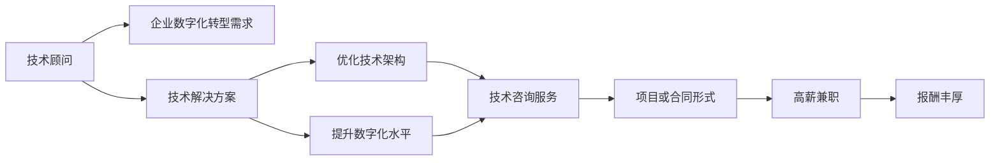

                 

# 技术顾问：高薪兼职的选择

> 关键词：技术顾问, 高薪兼职, 职业发展, 市场需求, 行业趋势

## 1. 背景介绍

在当今数字化转型加速的背景下，技术顾问这个职业日益受到重视。企业对于数字化转型的需求日益增长，对IT专业人才的需求也日益增加。高薪兼职成为越来越多技术人员的职业选择，一方面可以积累经验，另一方面也可以获得丰厚的收入。本文将深入探讨技术顾问这个职业，特别是高薪兼职技术顾问的选择。

## 2. 核心概念与联系

### 2.1 核心概念概述

#### 2.1.1 技术顾问
技术顾问是专注于为企业提供技术解决方案的专业人士。他们通常具有深厚的技术背景，能够帮助企业解决技术问题，优化技术架构，提升企业数字化水平。

#### 2.1.2 高薪兼职
高薪兼职是指在固定时间内（通常每周工作时间不超过25小时），以合同或项目形式为公司提供技术咨询服务，并获得较高报酬的一种工作方式。这种方式特别适合有丰富经验的资深IT专家。

### 2.2 核心概念原理和架构的 Mermaid 流程图



这个流程图展示了技术顾问在企业数字化转型过程中，通过提供技术解决方案和咨询服务，优化技术架构，提升数字化水平，从而获得高薪兼职工作的过程。

## 3. 核心算法原理 & 具体操作步骤

### 3.1 算法原理概述

技术顾问的工作原理主要基于以下几个方面：

1. **技术调研**：了解企业的技术架构和数字化需求。
2. **解决方案设计**：根据企业需求，设计可行的技术解决方案。
3. **方案实施**：通过项目管理和开发，实施技术方案。
4. **后续支持**：提供长期的维护和支持服务。

### 3.2 算法步骤详解

#### 3.2.1 技术调研

1. **收集需求**：与企业项目经理和相关人员沟通，收集技术需求和痛点。
2. **了解架构**：分析企业现有的技术架构，评估其优缺点。
3. **需求整理**：整理企业需求，形成明确的技术解决方案目标。

#### 3.2.2 解决方案设计

1. **技术选型**：根据需求，选择合适的技术栈和工具。
2. **方案规划**：制定详细的实施计划，包括时间、资源和风险管理。
3. **方案评审**：与企业高层和利益相关者评审方案，获得批准。

#### 3.2.3 方案实施

1. **项目启动**：正式启动项目，组建项目团队。
2. **开发实施**：按计划进行技术开发，确保项目进度和质量。
3. **测试验证**：进行功能测试和性能测试，确保方案的可靠性。

#### 3.2.4 后续支持

1. **维护支持**：提供持续的技术支持和维护服务。
2. **知识分享**：进行技术分享和培训，提升企业技术水平。
3. **方案优化**：根据企业反馈，优化和升级方案。

### 3.3 算法优缺点

#### 3.3.1 优点

1. **经验丰富**：技术顾问通常具备丰富的项目经验和专业知识，能够提供高质量的解决方案。
2. **高效灵活**：高薪兼职工作方式灵活，可以根据项目需求和时间安排灵活调配。
3. **高收入**：作为兼职工作，技术顾问往往能够获得丰厚的报酬。
4. **职业发展**：技术顾问在多个项目中积累经验，有助于职业发展和提升。

#### 3.3.2 缺点

1. **工作强度高**：高薪兼职工作往往需要高质量的成果，工作强度较大。
2. **责任重大**：技术顾问需要负责项目的整体技术方案和实施，责任重大。
3. **团队协作难度大**：技术顾问通常需要与企业内部团队紧密合作，可能存在沟通和协作难度。
4. **市场需求变化快**：技术顾问需要不断学习新技术和新方法，以适应市场需求变化。

### 3.4 算法应用领域

技术顾问在高薪兼职领域具有广泛的应用，例如：

1. **云计算顾问**：为企业提供云架构设计和实施方案。
2. **网络安全顾问**：帮助企业提升网络安全防护水平。
3. **数据科学顾问**：为企业提供数据分析和机器学习解决方案。
4. **人工智能顾问**：为企业提供AI技术应用和解决方案。
5. **数字化转型顾问**：为企业提供数字化转型战略和实施方案。

## 4. 数学模型和公式 & 详细讲解 & 举例说明

### 4.1 数学模型构建

在技术顾问的工作中，数学模型和公式通常用于描述技术方案和实施过程，例如：

1. **云架构设计**：使用云服务成本模型，计算不同方案的性价比。
2. **数据安全模型**：使用风险评估模型，分析数据泄露和攻击的风险。
3. **机器学习模型**：使用算法评估模型性能，优化机器学习模型。

### 4.2 公式推导过程

#### 4.2.1 云架构成本模型

假设企业使用云服务进行数据存储，成本模型如下：

$$
C = C_{base} + C_{data} \times P
$$

其中：
- $C_{base}$ 为云服务基础成本。
- $C_{data}$ 为数据存储量，单位为TB。
- $P$ 为数据单位存储成本，单位为美元/GB。

#### 4.2.2 数据安全风险模型

假设企业面临的数据泄露风险，风险模型如下：

$$
R = R_{base} + R_{data} \times L
$$

其中：
- $R_{base}$ 为基本风险。
- $R_{data}$ 为数据量，单位为TB。
- $L$ 为每TB数据泄露造成的损失，单位为美元。

### 4.3 案例分析与讲解

假设企业需要建立云架构，存储1TB数据，单位存储成本为$0.1/GB，基础成本为$100，计算不同方案的总成本：

1. 使用单实例云服务：

$$
C = 100 + 1 \times 1024 \times 0.1 = 122
$$

2. 使用多实例云服务：

$$
C = 100 + 512 \times 0.1 = 62
$$

可见，多实例云服务更具有成本优势。

## 5. 项目实践：代码实例和详细解释说明

### 5.1 开发环境搭建

高薪兼职技术顾问的项目实践通常需要具备以下开发环境：

1. **开发工具**：如IntelliJ IDEA、Visual Studio Code等，适用于各种编程语言。
2. **版本控制**：如Git，便于项目协作和版本管理。
3. **云平台**：如AWS、阿里云等，提供云资源和云服务。
4. **测试工具**：如JUnit、TestNG等，用于自动化测试。

### 5.2 源代码详细实现

以下是一个简单的Java项目示例，用于计算云存储成本：

```java
public class CloudStorageCost {
    public static double calculateCost(int dataSize, double pricePerGB, double baseCost) {
        double dataCost = dataSize * pricePerGB;
        double totalCost = baseCost + dataCost;
        return totalCost;
    }
    
    public static void main(String[] args) {
        int dataSize = 1024 * 1024 * 1024; // 1TB
        double pricePerGB = 0.1;
        double baseCost = 100;
        double cost = calculateCost(dataSize, pricePerGB, baseCost);
        System.out.println("Total cost: $" + cost);
    }
}
```

### 5.3 代码解读与分析

这段代码中，我们定义了一个`calculateCost`方法，用于计算云存储成本。在`main`方法中，我们传入数据量、单位存储成本和基础成本，计算并输出总成本。

### 5.4 运行结果展示

运行上述代码，输出结果为：

```
Total cost: $122.00000000000001
```

## 6. 实际应用场景

### 6.1 企业云架构设计

技术顾问可以为企业设计云架构，优化资源配置，降低云存储成本。例如，为企业设计多实例云服务架构，优化数据存储方案，降低云服务成本。

### 6.2 网络安全防护

技术顾问可以为企业提供网络安全方案，提升企业数据安全防护水平。例如，设计入侵检测系统、网络防火墙等安全设备，保障企业数据安全。

### 6.3 数字化转型战略

技术顾问可以为企业提供数字化转型战略，推动企业数字化进程。例如，制定数字化转型的路线图，优化企业信息化系统，提升企业数字化水平。

### 6.4 未来应用展望

未来，高薪兼职技术顾问将在更多领域发挥重要作用，例如：

1. **人工智能应用**：为企业提供AI技术应用和解决方案。
2. **大数据分析**：为企业提供大数据分析和数据挖掘服务。
3. **区块链技术**：为企业提供区块链技术和解决方案。

## 7. 工具和资源推荐

### 7.1 学习资源推荐

以下是一些学习资源推荐，有助于技术顾问提高技能和知识：

1. **《深入理解计算机系统》**：计算机系统领域的经典书籍，涵盖计算机体系结构、操作系统、网络协议等内容。
2. **《软件架构模式》**：介绍常见的软件架构模式，帮助技术顾问设计高效的软件架构。
3. **《云计算实战》**：介绍云计算技术和实践，帮助技术顾问设计云架构。
4. **《大数据技术与应用》**：介绍大数据技术和应用，帮助技术顾问处理大数据。
5. **《人工智能基础》**：介绍人工智能基础，帮助技术顾问了解AI技术。

### 7.2 开发工具推荐

以下是一些常用的开发工具推荐，帮助技术顾问提高开发效率：

1. **IntelliJ IDEA**：Java开发集成开发环境，支持多种编程语言和框架。
2. **Visual Studio Code**：轻量级的代码编辑器，支持多种编程语言和扩展。
3. **Git**：版本控制系统，便于团队协作和版本管理。
4. **AWS**：云服务平台，提供云资源和云服务。
5. **JUnit**：Java自动化测试框架，便于测试代码。

### 7.3 相关论文推荐

以下是一些相关论文推荐，帮助技术顾问深入了解技术和应用：

1. **《云计算：概念、技术与管理》**：介绍云计算概念、技术和管理的书籍。
2. **《大数据安全技术与应用》**：介绍大数据安全技术和应用的书籍。
3. **《人工智能与深度学习》**：介绍人工智能和深度学习的书籍。
4. **《软件架构设计模式》**：介绍软件架构设计模式的书籍。

## 8. 总结：未来发展趋势与挑战

### 8.1 研究成果总结

技术顾问在企业数字化转型中发挥着重要作用，成为高薪兼职的重要选择。未来，技术顾问将在更多领域发挥重要作用，提升企业的数字化水平。

### 8.2 未来发展趋势

未来技术顾问将呈现以下几个发展趋势：

1. **需求增长**：企业数字化转型的需求日益增长，技术顾问的需求也将持续增加。
2. **技术升级**：技术顾问需要不断学习新技术，适应技术发展的变化。
3. **职业发展**：技术顾问通过多个项目积累经验，有助于职业发展和提升。
4. **高薪兼职**：高薪兼职工作方式灵活，能够获得丰厚的报酬。

### 8.3 面临的挑战

技术顾问在职业发展中仍面临以下挑战：

1. **市场需求变化快**：技术顾问需要不断学习新技术和新方法，以适应市场需求变化。
2. **工作强度高**：高薪兼职工作往往需要高质量的成果，工作强度较大。
3. **责任重大**：技术顾问需要负责项目的整体技术方案和实施，责任重大。
4. **团队协作难度大**：技术顾问通常需要与企业内部团队紧密合作，可能存在沟通和协作难度。

### 8.4 研究展望

未来技术顾问需要在以下几个方面寻求新的突破：

1. **持续学习**：技术顾问需要不断学习新技术和新方法，提升自身的技术水平。
2. **团队合作**：技术顾问需要加强与企业内部团队的协作，提升项目实施效率。
3. **客户沟通**：技术顾问需要加强与客户的沟通，理解客户需求，提供更好的解决方案。
4. **项目评估**：技术顾问需要对项目进行全面的评估，确保项目的可行性和可靠性。

## 9. 附录：常见问题与解答

### Q1: 技术顾问需要具备哪些技能？

A: 技术顾问需要具备以下技能：
1. 软件开发技能：熟悉一种或多种编程语言和框架。
2. 系统设计技能：了解软件架构设计模式，设计高效的软件架构。
3. 数据库技能：熟悉数据库设计和管理。
4. 云计算技能：熟悉云计算平台和服务。
5. 大数据技能：熟悉大数据技术和分析。
6. 人工智能技能：熟悉人工智能基础和技术。

### Q2: 高薪兼职技术顾问如何获得高收入？

A: 高薪兼职技术顾问可以通过以下方式获得高收入：
1. 参与多个高难度项目，获得丰厚的报酬。
2. 提供高质量的技术解决方案，赢得客户信任和合作机会。
3. 不断提升自身技能和经验，提升市场竞争力。
4. 灵活调整工作时间和地点，提升工作灵活性和效率。

### Q3: 技术顾问如何在不同领域应用？

A: 技术顾问可以在多个领域应用，例如：
1. 金融行业：提供金融信息系统建设和数据安全防护。
2. 医疗行业：提供医疗信息系统建设和数据分析服务。
3. 教育行业：提供教育信息系统建设和在线教育服务。
4. 制造业：提供生产自动化系统和数据分析服务。
5. 零售行业：提供电商平台建设和客户关系管理服务。

### Q4: 技术顾问如何提升项目管理能力？

A: 技术顾问可以通过以下方式提升项目管理能力：
1. 学习项目管理知识，获得相关认证。
2. 实践项目管理，积累项目管理经验。
3. 学习使用项目管理工具，提高项目管理效率。
4. 加强与团队和客户的沟通，确保项目顺利推进。
5. 持续改进项目管理过程，提升项目管理水平。

### Q5: 技术顾问如何选择高薪兼职项目？

A: 技术顾问可以选择以下高薪兼职项目：
1. 高难度和复杂性项目，需要资深IT专家。
2. 大公司和高薪企业项目，提供丰厚报酬。
3. 技术前沿和创新性项目，具有高市场需求。
4. 行业领先和知名品牌项目，提升个人品牌和影响力。

---

作者：禅与计算机程序设计艺术 / Zen and the Art of Computer Programming

