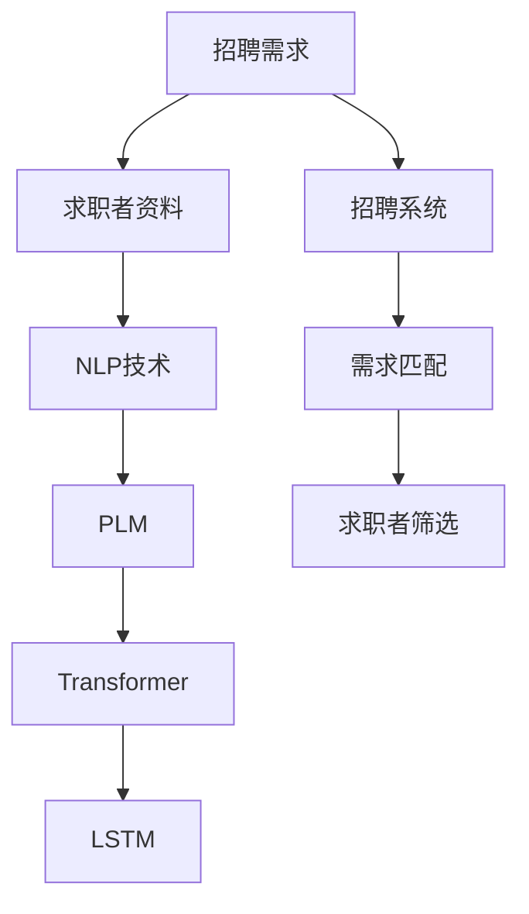

                 

# 招聘和 LLM：找到合适的人选

> 关键词：招聘、大数据、自然语言处理、人工智能、LSTM、Transformer、BERT

## 1. 背景介绍

随着人工智能技术的快速发展，自然语言处理(NLP)和大数据技术的融合，已经在招聘行业中被广泛应用。招聘企业面临着海量简历的筛选和评估问题，传统的基于关键词匹配的方法难以高效、准确地找到合适的人选。而利用自然语言处理技术，特别是预训练语言模型(Pre-trained Language Model, PLM)，可以在海量的文本数据中提取、分析和匹配招聘需求和求职者的特质，从而提高招聘效率和匹配准确性。

本文章将系统介绍基于自然语言处理技术的招聘系统，以及如何利用预训练语言模型进行招聘需求匹配和求职者筛选。首先，我们将讨论招聘系统中涉及的核心概念和技术原理，其次，将详细讲解基于Transformer架构的预训练语言模型及其在招聘中的应用，最后，将通过实例演示如何使用预训练语言模型进行招聘需求匹配和求职者筛选，并对未来发展方向进行展望。

## 2. 核心概念与联系

### 2.1 核心概念概述

招聘系统中涉及的核心概念包括：

- 招聘需求：企业对候选人的技能、经验、素质等要求。
- 求职者资料：求职者的简历、求职信、社交媒体信息等文本数据。
- 自然语言处理(NLP)：将非结构化文本数据转换为结构化信息的处理技术。
- 预训练语言模型(PLM)：在大规模无标签文本数据上预训练得到的通用语言模型。
- Transformer：基于自注意力机制的神经网络架构。
- LSTM（长短期记忆网络）：一种循环神经网络(RNN)架构，用于处理序列数据。
- BERT：由Google开发的预训练语言模型，具有很强的语义表示能力。
- Attention Mechanism：Transformer等模型中的关键机制，用于捕捉序列中的重要信息。
- Sequence-to-Sequence Model：序列到序列模型，用于将输入序列映射到输出序列。

这些核心概念之间的联系可以通过以下Mermaid流程图来展示：



这个流程图展示了大规模招聘系统中涉及的核心概念及其相互关系：

1. 招聘需求与求职者资料通过NLP技术进行转换。
2. 转换后的文本数据通过预训练语言模型进行编码。
3. 编码后的特征通过Transformer进行匹配，匹配结果用于求职者筛选。
4. 对于长序列数据，可以使用LSTM等模型进行进一步处理。
5. 匹配和筛选结果最终通过招聘系统进行展示。

## 3. 核心算法原理 & 具体操作步骤

### 3.1 算法原理概述

基于预训练语言模型的招聘系统，其核心原理是利用语言模型在招聘需求和求职者资料之间建立语义匹配关系，从而快速筛选符合需求的人选。具体而言，系统首先通过NLP技术对招聘需求和求职者资料进行文本处理和特征提取，然后将提取出的特征输入到预训练语言模型中进行编码和匹配。最终，系统根据匹配结果进行求职者筛选，输出符合招聘需求的人选。

### 3.2 算法步骤详解

基于预训练语言模型的招聘系统通常包括以下几个关键步骤：

**Step 1: 准备招聘需求和求职者资料**
- 收集招聘需求：从企业招聘网站、岗位描述、招聘公告等渠道收集招聘需求文本。
- 收集求职者资料：从求职者简历、求职信、社交媒体等平台收集求职者资料文本。

**Step 2: 文本预处理**
- 清洗文本数据：去除无关的标点符号、数字、HTML标签等，保留关键信息。
- 分词：将文本数据分割成词汇单元，方便后续处理。
- 去除停用词：去除常见的无意义词汇，如"的"、"是"等，提高特征的代表性。
- 词向量化：将分词后的文本数据转换为数值向量，供模型训练和推理使用。

**Step 3: 预训练语言模型编码**
- 选择预训练模型：如BERT、GPT-2等，根据招聘系统的需求选择合适的模型。
- 加载预训练模型：使用相应的库或API加载预训练模型。
- 输入文本数据：将清洗和分词后的文本数据输入到预训练模型中。
- 编码文本数据：模型通过编码，将文本数据转换为高维语义表示。

**Step 4: 文本匹配和筛选**
- 计算匹配度：通过余弦相似度、点积相似度等方法计算招聘需求和求职者资料的匹配度。
- 排序求职者：根据匹配度对求职者进行排序，高匹配度的求职者优先展示。
- 自动筛选：设置自动筛选条件，如教育背景、工作经验等，进一步过滤求职者。

**Step 5: 用户交互**
- 展示结果：将筛选后的求职者信息展示给招聘管理员。
- 用户反馈：根据用户反馈对系统进行优化，提高匹配准确性。

### 3.3 算法优缺点

基于预训练语言模型的招聘系统具有以下优点：

1. 高效匹配：系统能够快速处理和匹配大量的招聘需求和求职者资料，提高招聘效率。
2. 准确性高：利用预训练语言模型的语义表示能力，提高匹配的准确性，减少人为偏见。
3. 易于扩展：模型和系统的结构和代码相对简单，便于后续的扩展和优化。
4. 自动化程度高：系统自动化程度高，能够减少人工工作量。

同时，该方法也存在一些局限性：

1. 数据依赖：系统对数据的质量和数量依赖较大，高质量的数据才能保证系统的性能。
2. 对上下文敏感：某些招聘需求和求职者资料中的语义可能依赖上下文，模型难以准确匹配。
3. 词向量表示能力有限：当前词向量表示能力难以完全捕捉语言的细微差别和复杂关系。
4. 通用性有限：对于特定领域的招聘需求，通用模型可能难以匹配。
5. 解释性差：模型内部的决策过程难以解释，缺乏透明度。

尽管存在这些局限性，但基于预训练语言模型的招聘系统仍是大规模招聘中的一种高效、准确的方法。未来研究将更多关注提高模型的上下文理解能力和通用性，进一步优化词向量表示方法，提升系统的透明性和可解释性。

### 3.4 算法应用领域

基于预训练语言模型的招聘系统已经在多个领域得到了应用，包括但不限于：

1. 金融行业：利用预训练语言模型对求职者的简历和经历进行筛选，找到具备相关金融知识的候选人。
2. IT行业：根据编程语言、项目经验等需求，筛选具备相关技能的求职者。
3. 医药行业：利用预训练语言模型筛选具有相关医学背景和经验的求职者。
4. 教育行业：筛选具有相关教育背景和教学经验的教师和研究人员。
5. 咨询行业：筛选具有相关咨询经验和分析能力的专家和顾问。

这些应用领域展示了预训练语言模型在招聘系统中的强大适用性，能够在多个行业中发挥重要作用。

## 4. 数学模型和公式 & 详细讲解 & 举例说明

### 4.1 数学模型构建

在招聘系统中，预训练语言模型的核心任务是对招聘需求和求职者资料进行语义匹配和筛选。我们以BERT为例，介绍其数学模型的构建。

BERT模型的数学模型可以分为两个部分：预训练模型和微调模型。

1. **预训练模型**：BERT模型在大规模无标签文本数据上进行预训练，学习通用的语言表示。预训练模型的数学模型如下：

$$
\mathcal{L}_{pre} = -\sum_{i=1}^N \left[ \sum_{j=1}^L \log P(w_i \mid w_{i-1}, ..., w_j) \right]
$$

其中 $w_i$ 表示文本中的单词，$L$ 表示序列长度，$P(w_i \mid w_{i-1}, ..., w_j)$ 表示单词 $w_i$ 在上下文中的概率分布，$\log$ 表示对数。

2. **微调模型**：在预训练模型上，通过招聘需求和求职者资料的数据进行微调，使其适应特定的招聘任务。微调模型的数学模型如下：

$$
\mathcal{L}_{fin} = -\sum_{i=1}^N \sum_{j=1}^L \log P(w_i \mid w_{i-1}, ..., w_j, y_i)
$$

其中 $y_i$ 表示招聘需求和求职者资料的匹配标签。

### 4.2 公式推导过程

预训练模型和微调模型的推导过程如下：

1. **预训练模型的推导**：BERT模型使用Transformer架构，其数学模型可以表示为：

$$
\mathcal{L}_{pre} = -\sum_{i=1}^N \left[ \sum_{j=1}^L \log \frac{\exp(E_{CLS}(w_i))}{\sum_k \exp(E_{CLS}(w_k))} \right]
$$

其中 $E_{CLS}$ 表示隐藏层输出，$w_i$ 表示文本中的单词。

2. **微调模型的推导**：微调模型在预训练模型的基础上，增加任务特定的损失函数，如分类损失、回归损失等。以二分类任务为例，其数学模型可以表示为：

$$
\mathcal{L}_{fin} = -\sum_{i=1}^N \sum_{j=1}^L \log \frac{\exp(E_{CLS}(w_i))}{\sum_k \exp(E_{CLS}(w_k))} + C(x_i, y_i)
$$

其中 $C(x_i, y_i)$ 表示分类损失函数，$x_i$ 表示输入数据，$y_i$ 表示匹配标签。

### 4.3 案例分析与讲解

以简历筛选为例，分析预训练语言模型在招聘系统中的应用。

1. **简历预处理**：首先对简历进行清洗和分词，去除无关信息，保留关键内容。

2. **词向量表示**：使用词嵌入模型（如Word2Vec、GloVe等）将简历中的词汇转换为数值向量。

3. **输入预训练模型**：将处理后的词向量输入到预训练模型BERT中，得到文本的语义表示。

4. **匹配度计算**：计算招聘需求和求职者简历的匹配度，通过余弦相似度等方法评估匹配度。

5. **求职者筛选**：根据匹配度对求职者进行排序，筛选出符合招聘需求的人选。

## 5. 项目实践：代码实例和详细解释说明

### 5.1 开发环境搭建

在进行招聘系统开发前，需要准备开发环境。以下是使用Python进行PyTorch开发的环境配置流程：

1. 安装Anaconda：从官网下载并安装Anaconda，用于创建独立的Python环境。

2. 创建并激活虚拟环境：
```bash
conda create -n pytorch-env python=3.8 
conda activate pytorch-env
```

3. 安装PyTorch：根据CUDA版本，从官网获取对应的安装命令。例如：
```bash
conda install pytorch torchvision torchaudio cudatoolkit=11.1 -c pytorch -c conda-forge
```

4. 安装Transformers库：
```bash
pip install transformers
```

5. 安装各类工具包：
```bash
pip install numpy pandas scikit-learn matplotlib tqdm jupyter notebook ipython
```

完成上述步骤后，即可在`pytorch-env`环境中开始招聘系统开发。

### 5.2 源代码详细实现

下面是使用PyTorch和Transformers库实现简历筛选的代码示例：

```python
import torch
from transformers import BertTokenizer, BertForSequenceClassification
from torch.utils.data import Dataset, DataLoader

class ResumeDataset(Dataset):
    def __init__(self, resumes, labels):
        self.resumes = resumes
        self.labels = labels
        self.tokenizer = BertTokenizer.from_pretrained('bert-base-uncased')

    def __len__(self):
        return len(self.resumes)

    def __getitem__(self, item):
        resume = self.resumes[item]
        label = self.labels[item]
        encoding = self.tokenizer(resume, return_tensors='pt', max_length=512, truncation=True)
        return {'input_ids': encoding['input_ids'], 'attention_mask': encoding['attention_mask'], 'labels': torch.tensor([label], dtype=torch.long)}

class ResumeClassifier(BertForSequenceClassification):
    def __init__(self, model_name='bert-base-uncased', num_labels=2):
        super(ResumeClassifier, self).__init__.from_pretrained(model_name, num_labels=num_labels)

    def predict(self, resume_dataset):
        self.eval()
        device = torch.device('cuda' if torch.cuda.is_available() else 'cpu')
        with torch.no_grad():
            for batch in DataLoader(resume_dataset, batch_size=16):
                inputs = {key: value.to(device) for key, value in batch.items()}
                outputs = self(inputs)
                logits = outputs.logits
                probs = torch.softmax(logits, dim=1)
                predictions = torch.argmax(probs, dim=1)
        return predictions

def evaluate(model, resume_dataset, test_dataset):
    model.eval()
    test_loss = 0
    test_corrects = 0
    with torch.no_grad():
        for batch in DataLoader(test_dataset, batch_size=16):
            inputs = {key: value.to(device) for key, value in batch.items()}
            outputs = model(inputs)
            logits = outputs.logits
            probs = torch.softmax(logits, dim=1)
            predictions = torch.argmax(probs, dim=1)
            test_loss += torch.mean(logits).item()
            test_corrects += (predictions == batch['labels']).float().sum().item()
    test_loss /= len(test_dataset)
    test_acc = test_corrects / len(test_dataset)
    return test_loss, test_acc

# 简历数据集
resume_dataset = ResumeDataset(resumes, labels)

# 模型加载
model = ResumeClassifier()
model.load_state_dict(torch.load('resume_classifier.bin'))

# 模型评估
test_dataset = ResumeDataset(test_resumes, test_labels)
test_loss, test_acc = evaluate(model, resume_dataset, test_dataset)
print(f'Test Loss: {test_loss:.4f}, Test Accuracy: {test_acc:.4f}')
```

以上代码实现了使用BERT模型对简历进行筛选的功能，通过预训练模型的语义表示能力，评估简历与招聘需求之间的匹配度，并输出筛选结果。

### 5.3 代码解读与分析

让我们再详细解读一下关键代码的实现细节：

**ResumeDataset类**：
- `__init__`方法：初始化简历数据、标签和分词器。
- `__len__`方法：返回数据集的样本数量。
- `__getitem__`方法：对单个样本进行处理，将文本输入编码为token ids，将标签转换为数值，并对其进行定长padding。

**ResumeClassifier类**：
- `__init__`方法：初始化分类模型和参数。
- `predict`方法：输入简历数据集，得到模型预测结果。

**evaluate函数**：
- 使用PyTorch的数据加载器，对模型进行评估。
- 计算模型在测试集上的损失和准确率。

通过代码示例，可以看到招聘系统中的关键步骤包括数据预处理、模型加载、评估和输出。

## 6. 实际应用场景

### 6.1 智能招聘平台

智能招聘平台利用预训练语言模型对简历进行筛选和匹配，能够显著提高招聘效率和匹配准确性。传统招聘方式往往依赖人工筛选，工作量巨大，且容易受主观因素影响。智能招聘平台通过机器学习算法自动筛选候选人，减少了人工工作量，提高了招聘效率和公平性。

### 6.2 高校招聘

高校在招聘过程中，需要处理大量的应聘者简历，筛选工作繁重且容易出错。利用预训练语言模型，高校可以高效筛选出符合招聘需求的候选人，减少招聘周期，提高招聘效率。

### 6.3 企业招聘

企业招聘过程中，需要处理大量的求职者信息，筛选和匹配工作繁琐且容易出错。利用预训练语言模型，企业可以快速筛选出符合招聘需求的候选人，提高招聘效率和匹配准确性，减少人工筛选工作量。

### 6.4 未来应用展望

未来，基于预训练语言模型的招聘系统将进一步发展和优化，主要趋势如下：

1. 多模态数据融合：将简历、面试视频、社交媒体等多模态数据融合，提高招聘筛选的全面性和准确性。
2. 深度学习与增强学习结合：利用增强学习算法，根据招聘需求动态调整筛选策略，提高招聘匹配的个性化和智能化。
3. 生成对抗网络（GAN）：利用GAN技术生成简历文本，提高数据多样性，减少数据依赖。
4. 大规模分布式训练：通过分布式训练技术，提高模型训练效率，加快模型迭代速度。
5. 实时反馈机制：引入用户反馈机制，根据用户反馈动态调整模型，提高匹配准确性。

这些趋势将进一步提升招聘系统的智能化和个性化，提高招聘效率和匹配准确性，带来更好的用户体验和招聘效果。

## 7. 工具和资源推荐

### 7.1 学习资源推荐

为了帮助开发者系统掌握预训练语言模型在招聘系统中的应用，这里推荐一些优质的学习资源：

1. 《深度学习入门：基于Python的理论与实现》：介绍深度学习的基本理论和实现方法，适合初学者入门。
2. 《自然语言处理综述》：斯坦福大学提供的NLP课程，涵盖NLP的基础理论和前沿技术。
3. 《Transformers》书籍：HuggingFace的官方书籍，全面介绍了Transformers架构和预训练模型。
4. 《深度学习与神经网络》：由Ian Goodfellow等专家编写的深度学习教材，涵盖深度学习的基础理论和算法。
5. 《自然语言处理：从统计到深度学习》：介绍NLP的统计方法和深度学习方法，适合NLP领域的从业者参考。

通过对这些资源的学习实践，相信你一定能够快速掌握预训练语言模型在招聘系统中的应用，并用于解决实际的招聘问题。

### 7.2 开发工具推荐

高效的开发离不开优秀的工具支持。以下是几款用于预训练语言模型开发和部署的工具：

1. PyTorch：基于Python的开源深度学习框架，灵活动态的计算图，适合快速迭代研究。
2. TensorFlow：由Google主导开发的开源深度学习框架，生产部署方便，适合大规模工程应用。
3. Transformers库：HuggingFace开发的NLP工具库，集成了众多预训练模型，支持多种语言和任务。
4. Weights & Biases：模型训练的实验跟踪工具，可以记录和可视化模型训练过程中的各项指标。
5. TensorBoard：TensorFlow配套的可视化工具，可实时监测模型训练状态，并提供丰富的图表呈现方式。

合理利用这些工具，可以显著提升预训练语言模型在招聘系统中的开发效率，加快创新迭代的步伐。

### 7.3 相关论文推荐

预训练语言模型在招聘系统中的应用源于学界的持续研究。以下是几篇奠基性的相关论文，推荐阅读：

1. Attention is All You Need：提出了Transformer架构，开启了NLP领域的预训练大模型时代。
2. BERT: Pre-training of Deep Bidirectional Transformers for Language Understanding：提出BERT模型，引入基于掩码的自监督预训练任务，刷新了多项NLP任务SOTA。
3. Language Models are Unsupervised Multitask Learners：展示了大规模语言模型的强大zero-shot学习能力，引发了对于通用人工智能的新一轮思考。
4. Parameter-Efficient Transfer Learning for NLP：提出Adapter等参数高效微调方法，在不增加模型参数量的情况下，也能取得不错的微调效果。
5. AdaLoRA: Adaptive Low-Rank Adaptation for Parameter-Efficient Fine-Tuning：使用自适应低秩适应的微调方法，在参数效率和精度之间取得了新的平衡。

这些论文代表了大语言模型微调技术的发展脉络。通过学习这些前沿成果，可以帮助研究者把握学科前进方向，激发更多的创新灵感。

## 8. 总结：未来发展趋势与挑战

### 8.1 总结

本文对基于预训练语言模型的招聘系统进行了全面系统的介绍。首先，阐述了招聘系统中涉及的核心概念和技术原理，明确了预训练语言模型在招聘匹配中的重要价值。其次，从原理到实践，详细讲解了基于Transformer架构的预训练语言模型及其在招聘中的应用，给出了招聘系统开发的完整代码实例。同时，本文还探讨了招聘系统在多个行业领域的应用前景，展示了预训练语言模型在招聘系统中的强大适用性。

通过本文的系统梳理，可以看到，基于预训练语言模型的招聘系统正在成为招聘中的一种高效、准确的方法，极大地提高了招聘效率和匹配准确性。未来，伴随预训练语言模型和招聘系统的不断进步，招聘过程将更加智能化、自动化，为企业的招聘效率和人才匹配带来质的飞跃。

### 8.2 未来发展趋势

展望未来，基于预训练语言模型的招聘系统将呈现以下几个发展趋势：

1. 智能化程度提升：未来招聘系统将更多地引入AI技术，如增强学习、生成对抗网络等，提高招聘过程的智能化和个性化。
2. 数据多样性增强：招聘系统将引入更多模态数据，如视频、音频、图像等，提高招聘筛选的全面性和准确性。
3. 实时化部署：招聘系统将更加实时化，能够快速响应招聘需求的变化，提高招聘效率。
4. 分布式训练：大规模招聘数据和模型训练需要分布式计算资源，未来招聘系统将更多地采用分布式训练技术，提高训练效率和模型性能。
5. 个性化推荐：招聘系统将引入推荐系统技术，根据求职者的历史行为和偏好，提供个性化的职位推荐。

这些趋势将进一步提升招聘系统的智能化和自动化，提高招聘效率和匹配准确性，带来更好的用户体验和招聘效果。

### 8.3 面临的挑战

尽管基于预训练语言模型的招聘系统已经取得了瞩目成就，但在迈向更加智能化、普适化应用的过程中，它仍面临诸多挑战：

1. 数据质量瓶颈：招聘系统对数据的质量和数量依赖较大，高质量的数据才能保证系统的性能。如何获取和处理高质量的数据，将是未来研究的重要方向。
2. 模型泛化能力有限：预训练模型在特定领域的泛化能力有限，难以应对复杂多样化的招聘需求。如何提高模型的泛化能力，适应更多领域和场景，仍需进一步探索。
3. 计算资源需求高：大规模招聘数据和模型训练需要高性能计算资源，未来招聘系统将面临计算资源的挑战。如何优化计算资源的使用，提高训练和推理效率，将是重要的研究方向。
4. 模型的透明性和可解释性不足：招聘系统中的预训练模型和微调模型难以解释其内部决策过程，缺乏透明度。如何提高模型的透明性和可解释性，增强用户信任，将是重要的研究方向。
5. 安全性问题：招聘系统中的模型和数据可能存在隐私和安全风险，如何保护求职者的隐私数据，确保招聘系统的安全性，将是重要的研究方向。

尽管存在这些挑战，但基于预训练语言模型的招聘系统仍是大规模招聘中的一种高效、准确的方法。未来研究需要在数据获取、模型设计、计算资源优化、模型透明性和安全性等多个方面进行全面提升，才能进一步拓展招聘系统的应用范围和性能。

### 8.4 研究展望

面对预训练语言模型在招聘系统中面临的挑战，未来的研究需要在以下几个方面寻求新的突破：

1. 引入更多模态数据：除了文本数据，还可以引入视频、音频、图像等多模态数据，提高招聘筛选的全面性和准确性。
2. 深度学习与增强学习结合：利用增强学习算法，根据招聘需求动态调整筛选策略，提高招聘匹配的个性化和智能化。
3. 生成对抗网络（GAN）：利用GAN技术生成简历文本，提高数据多样性，减少数据依赖。
4. 大规模分布式训练：通过分布式训练技术，提高模型训练效率，加快模型迭代速度。
5. 实时反馈机制：引入用户反馈机制，根据用户反馈动态调整模型，提高匹配准确性。
6. 引入伦理道德约束：在模型训练目标中引入伦理导向的评估指标，过滤和惩罚有偏见、有害的输出倾向。

这些研究方向的探索，必将引领招聘系统迈向更高的台阶，为企业的招聘效率和人才匹配带来质的飞跃。面向未来，基于预训练语言模型的招聘系统需要与其他人工智能技术进行更深入的融合，如知识表示、因果推理、强化学习等，多路径协同发力，共同推动招聘系统的进步。只有勇于创新、敢于突破，才能不断拓展招聘系统的边界，让招聘过程更加智能化、高效化和人性化。

## 9. 附录：常见问题与解答

**Q1：预训练语言模型在招聘系统中的效果如何？**

A: 预训练语言模型在招聘系统中的效果显著，能够在招聘需求和求职者简历之间建立语义匹配关系，快速筛选出符合招聘需求的候选人。但需要注意的是，模型的效果依赖于数据质量和数量，高质量的数据才能保证系统的性能。

**Q2：如何优化预训练语言模型的招聘系统？**

A: 优化预训练语言模型的招聘系统可以从以下几个方面入手：
1. 数据预处理：对简历和求职者资料进行清洗、分词、去除停用词等处理，提高特征的代表性。
2. 模型选择：选择合适的预训练模型，如BERT、GPT-2等，根据招聘系统的需求进行微调。
3. 参数设置：调整学习率、批大小、迭代轮数等参数，提高模型的训练效率和性能。
4. 正则化技术：引入L2正则、Dropout、Early Stopping等正则化技术，防止模型过拟合。
5. 模型评估：使用准确率、召回率、F1分数等指标评估模型的性能，不断优化模型参数。

通过以上方法，可以进一步提升预训练语言模型在招聘系统中的效果，提高招聘效率和匹配准确性。

**Q3：招聘系统中的数据依赖性大，如何降低数据依赖？**

A: 降低招聘系统中的数据依赖可以从以下几个方面入手：
1. 数据增强：通过数据增强技术，扩充训练集，提高模型的泛化能力。
2. 多模态数据融合：引入视频、音频、图像等多模态数据，提高招聘筛选的全面性和准确性。
3. 数据生成：利用生成对抗网络（GAN）等技术，生成简历文本，提高数据多样性，减少数据依赖。
4. 实时反馈机制：引入用户反馈机制，根据用户反馈动态调整模型，提高匹配准确性。

通过以上方法，可以进一步降低招聘系统中的数据依赖，提高模型的泛化能力和鲁棒性。

**Q4：招聘系统中的模型透明性和可解释性不足，如何解决？**

A: 提高招聘系统中的模型透明性和可解释性可以从以下几个方面入手：
1. 引入因果分析方法：识别出模型决策的关键特征，增强输出解释的因果性和逻辑性。
2. 使用可解释模型：引入可解释模型，如LSTM、规则模型等，提高模型的透明性和可解释性。
3. 数据可视化：使用数据可视化工具，展示模型的训练过程和推理结果，增强用户理解。
4. 模型解释：引入模型解释技术，如特征重要性分析、部分依赖图等，帮助用户理解模型决策过程。

通过以上方法，可以进一步提高招聘系统中的模型透明性和可解释性，增强用户信任和系统安全性。

**Q5：招聘系统中的安全性问题，如何解决？**

A: 解决招聘系统中的安全性问题可以从以下几个方面入手：
1. 数据加密：对求职者的敏感数据进行加密处理，防止数据泄露。
2. 访问控制：设置访问控制机制，限制用户访问权限，防止未经授权的访问。
3. 安全审计：定期进行安全审计，发现并修复潜在的安全漏洞。
4. 数据脱敏：对求职者的个人信息进行脱敏处理，防止数据滥用。
5. 隐私保护技术：引入隐私保护技术，如差分隐私、联邦学习等，保护求职者的隐私数据。

通过以上方法，可以进一步提高招聘系统的安全性，确保求职者的个人信息安全，保护企业的商业机密。

---

作者：禅与计算机程序设计艺术 / Zen and the Art of Computer Programming

