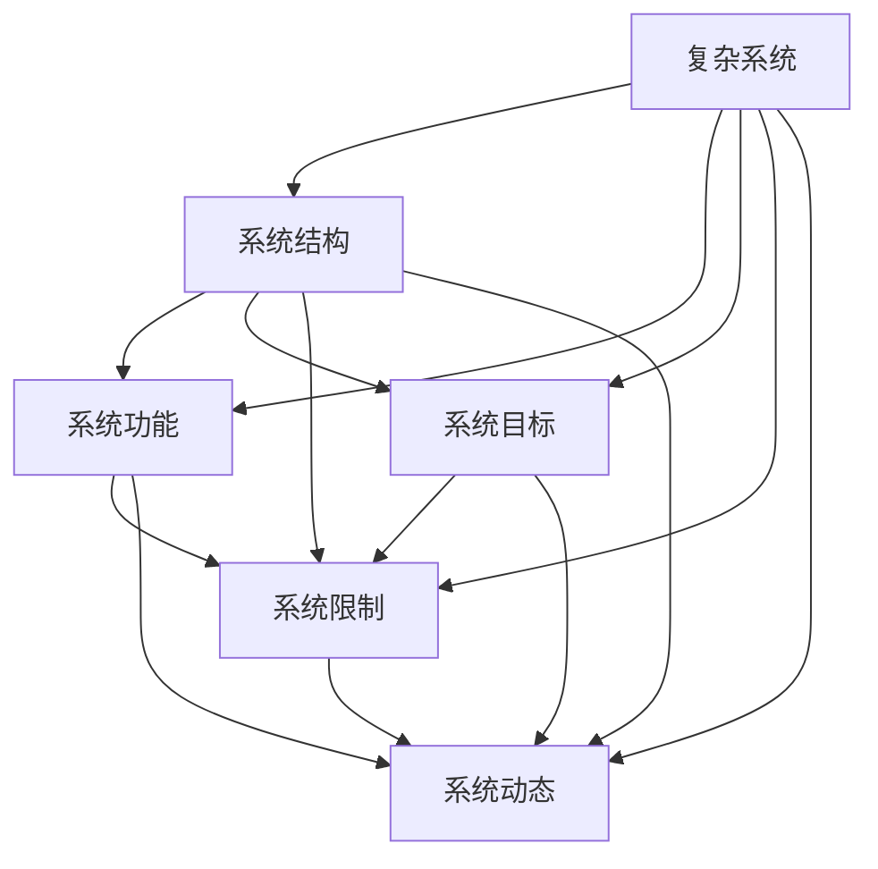

                 

# 拥有体系思维是管理者的必备能力

## 1. 背景介绍

### 1.1 问题由来
在快速变化和复杂化的商业环境中，管理者面临的挑战日益严峻。如何有效管理组织资源，实现战略目标，提升企业竞争力？系统化思维（Systems Thinking）提供了一种全新的视角和方法，帮助管理者以整体视角分析问题，把握事物之间的内在联系，从而制定出更为科学、高效的决策方案。

### 1.2 问题核心关键点
系统化思维的核心在于理解和管理复杂系统。它强调“整体大于部分之和”，主张从系统整体的角度出发，分析系统内部各组成部分之间的关系和互动，识别系统中的关键要素和瓶颈，通过调整系统结构或引入外部干预，实现系统整体的优化和改进。

### 1.3 问题研究意义
系统化思维在商业管理中的应用，对于提升组织绩效、优化运营流程、增强决策能力等方面具有重要意义。掌握系统化思维，有助于管理者更好地识别和解决企业面临的多维度、多层次问题，推动企业向更高层次的创新和变革迈进。

## 2. 核心概念与联系

### 2.1 核心概念概述

要深入理解系统化思维在管理中的应用，首先需要明确几个关键概念：

- **复杂系统（Complex System）**：由众多相互依赖、相互作用的组成部分构成的整体。例如，一个企业的运营管理，涉及人、财、物、信息等多个维度，是一个典型的复杂系统。
- **系统结构（System Structure）**：系统各部分之间的相互关系和联系。系统结构不同，系统的行为和表现也会不同。
- **系统功能（System Function）**：系统在特定条件下的行为和表现，即系统能够做什么、如何运作。
- **系统目标（System Objective）**：系统设计和服务的目标，即系统为什么存在、服务于哪些用户。
- **系统限制（System Constraints）**：系统在运行中受到的各种制约和限制，如资源、成本、技术、环境等。
- **系统动态（System Dynamics）**：系统随时间变化的规律和趋势，包括稳定性、增长性、周期性等。

这些概念构成了系统化思维的基本框架，帮助管理者从整体角度理解和分析复杂的商业系统。

### 2.2 核心概念原理和架构的 Mermaid 流程图



这个流程图展示了系统各组成部分之间的相互关系。复杂系统由系统结构、功能、目标、限制和动态五个要素组成，这些要素之间相互作用、相互影响，共同决定了系统的整体行为和表现。

## 3. 核心算法原理 & 具体操作步骤

### 3.1 算法原理概述

系统化思维在管理中的应用，主要依赖于系统建模、分析和优化三个步骤。系统建模是对系统进行结构和功能的抽象表示，系统分析是对系统进行整体和局部的诊断和评估，系统优化是根据分析结果制定改进方案。

### 3.2 算法步骤详解

#### 3.2.1 系统建模

**Step 1: 识别系统要素**
- 确定系统的主要组成部分，如人员、设备、流程、信息等。
- 分析各部分之间的交互关系，建立系统结构模型。

**Step 2: 构建系统模型**
- 采用系统动力学（System Dynamics）、因果图（Causal Loop Diagram）等方法，建立系统的动态模型。
- 通过仿真工具，验证和调整模型参数，确保模型的准确性和可靠性。

#### 3.2.2 系统分析

**Step 1: 数据收集与分析**
- 收集系统运行中的各种数据，如绩效指标、成本数据、用户反馈等。
- 使用统计分析、趋势分析等方法，识别系统的关键表现和异常情况。

**Step 2: 识别系统瓶颈**
- 利用系统结构模型，分析系统各部分之间的交互关系和影响，识别系统的瓶颈和薄弱环节。
- 通过因果图分析，明确系统中的因果关系，理解各因素之间的相互作用。

#### 3.2.3 系统优化

**Step 1: 制定优化策略**
- 根据系统分析结果，制定优化方案，如流程改进、资源重新分配、技术升级等。
- 明确优化目标和步骤，制定详细实施计划。

**Step 2: 实施优化方案**
- 按照计划，逐步实施优化方案，监测系统表现，及时调整。
- 确保优化过程可控，避免系统波动和风险。

**Step 3: 评估优化效果**
- 使用系统模型和仿真工具，评估优化方案的效果。
- 对比优化前后的系统表现，确认是否达到预期目标。

### 3.3 算法优缺点

系统化思维在管理中的应用具有以下优点：
1. **全局视角**：系统化思维强调从整体角度分析问题，避免了局部优化带来的系统性风险。
2. **系统优化**：通过系统建模和分析，可以识别系统瓶颈和改进方向，实现系统整体的优化。
3. **科学决策**：系统化思维基于数据和模型分析，提升了决策的科学性和准确性。

同时，系统化思维也存在以下局限性：
1. **模型复杂性**：系统建模和分析需要较高的专业知识和技能，模型构建和调试复杂。
2. **数据依赖性**：系统分析依赖于高质量的数据，数据缺失或偏差会影响分析结果。
3. **实施难度**：优化方案的制定和实施需要跨部门协作，协调复杂，难度较大。

尽管存在这些局限，但系统化思维仍然是一种非常有力的管理工具，特别是在处理复杂、高风险的管理问题时，其优势尤为明显。

### 3.4 算法应用领域

系统化思维在企业管理中的应用领域非常广泛，以下是几个典型案例：

**1. 运营管理**
在运营管理中，系统化思维可以用于流程优化、生产调度、库存管理等方面。通过系统建模和分析，识别运营中的瓶颈和优化点，提升运营效率和绩效。

**2. 人力资源管理**
人力资源管理中，系统化思维可以用于员工培训、绩效评估、招聘策略等。通过系统建模，分析人力资源各部分之间的相互作用，优化人力资源配置，提升组织绩效。

**3. 供应链管理**
供应链管理涉及众多节点和流程，系统化思维可以帮助企业优化供应链结构，提升供应链的稳定性和响应速度。通过系统建模和分析，识别供应链中的瓶颈和风险点，制定改进方案。

**4. 财务与会计管理**
财务与会计管理中，系统化思维可以用于预算编制、成本控制、风险管理等方面。通过系统建模和分析，识别财务管理的瓶颈和优化点，提升财务管理的科学性和效率。

## 4. 数学模型和公式 & 详细讲解 & 举例说明

### 4.1 数学模型构建

系统化思维在管理中的应用，可以抽象为以下数学模型：

$$
S = f(S_{str}, S_{fun}, S_{obj}, S_{con}, S_{dyn})
$$

其中：
- $S$ 为复杂系统，由结构 $S_{str}$、功能 $S_{fun}$、目标 $S_{obj}$、限制 $S_{con}$ 和动态 $S_{dyn}$ 五个要素组成。
- $f$ 为系统函数，表示系统各要素之间的相互作用关系。

### 4.2 公式推导过程

以一个简单的供应链管理案例为例，推导系统化思维的应用：

假设一个企业拥有三个工厂 $A, B, C$，分别生产三种产品 $P_1, P_2, P_3$，产品需求量分别为 $D_1, D_2, D_3$。工厂生产能力分别为 $C_A, C_B, C_C$，产品运输时间为 $T_{A1}, T_{A2}, T_{A3}$，需求和供给关系为 $d_1(t), d_2(t), d_3(t), s_1(t), s_2(t), s_3(t)$。

建立系统的因果图：

```
d1(t)       d2(t)       d3(t)
     |               |               |
     |    A          B            C
     |      t       |      t        |      t
     |               |               |
     d1(t-1)        d2(t-1)       d3(t-1)
```

其中，箭头表示因果关系，节点表示状态变量。通过因果图分析，可以明确系统的因果关系，识别瓶颈和优化点。

### 4.3 案例分析与讲解

假设系统存在以下问题：

1. 工厂 $A$ 的生产效率低下，导致部分产品无法按时交付。
2. 工厂 $B$ 的库存积压，导致生产成本增加。
3. 供应链中存在信息不对称，导致需求预测不准确。

针对这些问题，可以采用以下优化策略：

1. 对工厂 $A$ 进行技术改造，提升生产效率。
2. 调整工厂 $B$ 的生产计划，减少库存积压。
3. 加强供应链信息化建设，提高信息共享和协同能力。

通过系统化思维，可以全面、系统地分析和解决问题，提升供应链管理效率和绩效。

## 5. 项目实践：代码实例和详细解释说明

### 5.1 开发环境搭建

系统化思维在管理中的应用，通常需要借助一些工具和平台进行建模和分析。以下是一些常用的开发环境：

1. **Matlab/Simulink**：用于建立系统动力学模型，进行仿真和分析。
2. **Python + Scikit-learn**：用于数据收集、统计分析和建模。
3. **R + Gephi**：用于数据可视化和网络分析，帮助理解系统结构。
4. **Jenkins**：用于自动化系统优化方案的实施和监控。

### 5.2 源代码详细实现

以一个简单的供应链管理优化为例，使用Python进行建模和仿真：

```python
import numpy as np
import matplotlib.pyplot as plt

# 定义系统参数
C_A, C_B, C_C = 1000, 800, 1200  # 工厂生产能力
T_A1, T_A2, T_A3 = 2, 3, 4       # 产品运输时间
d1, d2, d3 = 500, 600, 800      # 产品需求量
s1, s2, s3 = 1000, 1500, 1200   # 产品供给量

# 定义系统动力学模型
def update_state(t, state, parameters):
    d1_nxt, d2_nxt, d3_nxt, s1_nxt, s2_nxt, s3_nxt = state
    d1_nxt = d1 + (d1 - s1) / T_A1
    d2_nxt = d2 + (d2 - s2) / T_A2
    d3_nxt = d3 + (d3 - s3) / T_A3
    s1_nxt = s1 + (C_A - d1_nxt)
    s2_nxt = s2 + (C_B - d2_nxt)
    s3_nxt = s3 + (C_C - d3_nxt)
    return d1_nxt, d2_nxt, d3_nxt, s1_nxt, s2_nxt, s3_nxt

# 进行系统仿真
t = np.arange(0, 100, 1)
state = np.zeros((len(t), 6))
state[0] = d1, d2, d3, s1, s2, s3

for i in range(1, len(t)):
    state[i] = update_state(t[i], state[i-1], parameters)

# 可视化仿真结果
plt.plot(t, state[:, 0], label='d1')
plt.plot(t, state[:, 1], label='d2')
plt.plot(t, state[:, 2], label='d3')
plt.plot(t, state[:, 3], label='s1')
plt.plot(t, state[:, 4], label='s2')
plt.plot(t, state[:, 5], label='s3')
plt.legend()
plt.xlabel('Time')
plt.ylabel('Value')
plt.title('Supply Chain Dynamics')
plt.show()
```

这段代码使用Python模拟了一个简单的供应链系统，通过系统动力学模型进行仿真和分析。可以看到，系统动力学模型可以直观地展示系统动态变化，帮助管理者识别和优化系统表现。

### 5.3 代码解读与分析

- **系统参数定义**：定义了系统的主要参数，包括工厂生产能力、产品运输时间、需求量和供给量等。
- **系统动力学模型实现**：定义了系统的更新函数，根据当前状态和参数，计算下一时刻的状态。
- **系统仿真与可视化**：使用Matplotlib进行仿真结果的可视化，直观展示了系统动态变化。

通过上述代码实例，可以看到系统动力学模型在管理中的应用，可以帮助管理者更好地理解系统行为和优化方案。

### 5.4 运行结果展示

仿真结果展示了供应链系统在一定时间范围内的动态变化。通过可视化结果，管理者可以直观地观察到系统中的瓶颈和优化点，进一步制定改进方案。

## 6. 实际应用场景

### 6.1 智能制造

在智能制造领域，系统化思维可以用于生产线的优化、设备维护、质量控制等方面。通过系统建模和分析，识别生产线中的瓶颈和优化点，提升生产效率和产品质量。

**案例**：某制造企业生产线效率低下，通过系统化思维进行优化，发现瓶颈在于设备维护和物料管理。通过引入自动化设备维护计划和优化物料管理流程，显著提升了生产效率和产品质量。

### 6.2 金融风险管理

在金融风险管理中，系统化思维可以用于风险评估、风险控制、危机应对等方面。通过系统建模和分析，识别风险来源和优化方案，提升金融系统的稳定性和抗风险能力。

**案例**：某银行在金融危机期间面临巨大风险，通过系统化思维进行风险评估和应对，发现风险主要来源于信贷和市场波动。通过调整信贷政策和管理策略，成功渡过了金融危机。

### 6.3 医疗管理

在医疗管理中，系统化思维可以用于患者管理、资源分配、医疗服务优化等方面。通过系统建模和分析，优化医疗资源的配置，提升医疗服务质量和效率。

**案例**：某医院面临患者排队时间长、资源浪费等问题，通过系统化思维进行优化，发现瓶颈在于患者分诊和资源分配。通过优化患者分诊流程和资源分配策略，显著缩短了患者等待时间，提高了医疗服务效率。

### 6.4 未来应用展望

未来，系统化思维将在更多领域得到广泛应用，为复杂系统的优化和改进提供有力支持：

1. **智慧城市管理**：通过系统化思维优化城市交通、公共安全、环境保护等方面的管理，提升城市运行效率和居民生活质量。
2. **能源管理**：优化能源生产和分配，提升能源利用效率和稳定性。
3. **环境管理**：优化环境监测和治理，提升环境保护效果和治理效率。
4. **公共健康管理**：优化公共健康服务资源配置，提升公共健康服务质量。

## 7. 工具和资源推荐

### 7.1 学习资源推荐

要深入理解系统化思维，推荐以下学习资源：

1. **《系统思维：解决复杂问题的艺术》（System Thinking: The Art of Solving the Intractable）**：由Peter Senge等作者编写，全面介绍了系统化思维的基本原理和应用方法。
2. **《系统动力学基础》（Systems Dynamics: Foundations and Applications）**：由Dennis Meadows等作者编写，介绍了系统动力学的基本原理和建模方法。
3. **Coursera系统动力学课程**：由MIT开设，系统讲解系统动力学理论和方法，适合初学者。
4. **Holistic Management系统化思维培训**：提供系统化思维的实践培训，帮助管理者掌握系统化思维的实用技巧。

### 7.2 开发工具推荐

系统化思维在管理中的应用，需要借助一些工具和平台进行建模和分析。以下是一些常用的开发工具：

1. **Matlab/Simulink**：用于建立系统动力学模型，进行仿真和分析。
2. **Python + Scikit-learn**：用于数据收集、统计分析和建模。
3. **R + Gephi**：用于数据可视化和网络分析，帮助理解系统结构。
4. **Jenkins**：用于自动化系统优化方案的实施和监控。

### 7.3 相关论文推荐

系统化思维在管理中的应用，是管理学领域的研究热点。以下是几篇经典论文，推荐阅读：

1. **"Systems Thinking: The Role of the Systems Scientist in Systems Engineering"**：由Peter Senge等作者发表，介绍了系统化思维在工程系统中的应用。
2. **"The Concept of Systems Thinking in Data Management"**：由Gilmore等作者发表，探讨了系统化思维在数据管理中的应用。
3. **"Optimizing Supply Chain Performance Using Systems Thinking"**：由Dunne等作者发表，介绍了系统化思维在供应链优化中的应用。

## 8. 总结：未来发展趋势与挑战

### 8.1 研究成果总结

系统化思维在管理中的应用，已经成为管理学的一个重要研究方向。通过系统化思维，管理者能够从整体角度分析问题，提升决策的科学性和系统性。系统化思维的应用，已经取得了显著的管理效果，推动了企业向更高层次的创新和变革迈进。

### 8.2 未来发展趋势

未来，系统化思维将在更多领域得到广泛应用，推动系统优化和改进：

1. **智能化**：借助人工智能和机器学习技术，提升系统建模和分析的效率和准确性。
2. **数字化**：通过数据驱动的决策和分析，提升系统管理的智能化水平。
3. **协同化**：利用协同工具和技术，提升系统各部分之间的协作效率。
4. **可视化**：通过数据可视化技术，直观展示系统状态和优化结果。

### 8.3 面临的挑战

尽管系统化思维在管理中的应用具有广泛的应用前景，但在实践中也面临一些挑战：

1. **系统复杂性**：大型复杂系统的建模和分析，需要较高的专业知识和技能。
2. **数据质量**：系统分析依赖于高质量的数据，数据缺失或偏差会影响分析结果。
3. **跨部门协作**：系统优化需要跨部门协作，协调复杂，难度较大。

### 8.4 研究展望

未来，系统化思维的研究需要在以下几个方面进行突破：

1. **技术融合**：将系统化思维与其他新兴技术（如人工智能、大数据等）进行深度融合，提升系统优化效果。
2. **方法创新**：开发更加高效、可靠的系统建模和分析方法，提升系统化思维的实用性和普适性。
3. **跨领域应用**：推广系统化思维在更多领域的应用，拓展其应用范围和影响力。

总之，系统化思维在管理中的应用前景广阔，但也需要不断创新和优化，才能更好地服务于管理实践，提升组织绩效和竞争力。

## 9. 附录：常见问题与解答

### Q1: 什么是系统化思维？

A: 系统化思维是一种整体性、结构性的思考方式，强调从整体角度分析问题，识别系统各部分之间的相互作用，通过优化系统结构，实现系统整体的优化和改进。

### Q2: 系统化思维在管理中的应用有哪些？

A: 系统化思维在运营管理、人力资源管理、供应链管理、财务与会计管理等多个领域都有广泛应用，通过系统建模和分析，优化系统结构，提升系统绩效。

### Q3: 如何学习系统化思维？

A: 学习系统化思维，需要掌握系统动力学、因果图等基本方法，同时结合实际管理问题进行实践。推荐的资源包括《系统思维：解决复杂问题的艺术》、Coursera系统动力学课程等。

### Q4: 系统化思维在实际应用中需要注意哪些问题？

A: 系统化思维在应用中需要注意系统复杂性、数据质量、跨部门协作等问题。需要具备较高的专业知识和技能，同时注重数据的准确性和质量，加强跨部门协作和沟通。

### Q5: 系统化思维在未来有哪些发展趋势？

A: 未来，系统化思维将借助人工智能、大数据等新兴技术进行深度融合，提升系统建模和分析的效率和准确性。同时，系统化思维将拓展应用范围，提升系统管理的智能化水平。

---

作者：禅与计算机程序设计艺术 / Zen and the Art of Computer Programming

