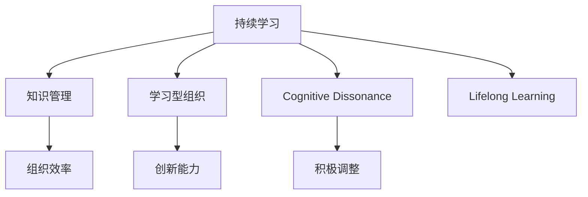

                 

# 持续学习：管理者的核心竞争力

## 1. 背景介绍

在快速变化和竞争激烈的市场环境中，管理者面临的环境和任务复杂多变。传统的学习和培训方式已难以适应这种变化，持续学习成为管理者不断提升竞争力的关键。本文将探讨持续学习的原理与实践，帮助管理者掌握这一核心竞争力。

## 2. 核心概念与联系

### 2.1 核心概念概述

- **持续学习（Continuous Learning）**：指在职业生涯中不断学习新知识、技能和理念，保持自我更新，以适应变化和挑战的过程。
- **知识管理（Knowledge Management）**：通过系统化管理组织内的知识和信息，确保知识的获取、分享和应用，从而提高组织效率和创新能力。
- **学习型组织（Learning-Organizational）**：一个以持续学习和知识共享为核心价值的企业文化，旨在激发员工的学习热情和创新能力。
- **认知失调（Cognitive Dissonance）**：当个体发现新知识与现有信念相矛盾时，内心产生的心理不适感，促使个体积极调整态度和行为。
- **终身学习（Lifelong Learning）**：鼓励个体在一生中不断学习，追求知识和个人成长的过程。

### 2.2 核心概念原理和架构的 Mermaid 流程图



这个流程图展示了持续学习的核心概念及其联系。持续学习通过知识管理，增强组织效率和创新能力，同时受到认知失调的驱使，推动个体终身学习。

## 3. 核心算法原理 & 具体操作步骤

### 3.1 算法原理概述

持续学习强调通过不断学习和适应环境变化，来提升管理者的决策能力和问题解决能力。其主要原理包括：

1. **反馈机制**：通过持续的反馈和评估，管理者能够及时了解自身决策的效果，并进行调整和优化。
2. **适应性学习**：管理者能够根据环境的变化，动态调整学习内容和策略，以适应新的挑战。
3. **系统化学习**：通过系统化的方法和工具，如知识管理、学习平台等，帮助管理者更高效地学习。

### 3.2 算法步骤详解

1. **设定学习目标**：明确持续学习的具体目标，如提升领导能力、改进决策过程等。
2. **选择合适的学习资源**：根据学习目标，选择合适的书籍、课程、培训等学习资源。
3. **制定学习计划**：规划学习时间、方式和进度，确保持续学习的系统性和连贯性。
4. **实施学习**：通过阅读、培训、实践等方式，获取新知识、技能和理念。
5. **评估和反馈**：定期评估学习效果，收集反馈，调整学习策略。

### 3.3 算法优缺点

**优点**：
- 提升决策能力：通过不断学习，管理者能够更好地理解环境和问题，做出更准确的决策。
- 增强适应性：持续学习使管理者能够适应变化，应对未知的挑战。
- 促进创新：新知识的引入和应用，可以激发新的创意和解决方案。

**缺点**：
- 时间成本高：持续学习需要大量时间和精力投入，可能影响日常工作。
- 动力维持难：保持长期的学习热情和动力是一大挑战。
- 资源需求高：高质量的学习资源和良好的学习环境是持续学习的必备条件。

### 3.4 算法应用领域

持续学习的理念和方法，适用于各种管理和组织环境，具体应用包括：

1. **企业战略规划**：通过持续学习，管理者能够及时掌握行业动态，制定适应性的战略。
2. **团队管理**：管理者通过持续学习，提升团队协作和创新能力。
3. **个人职业发展**：员工通过持续学习，不断提升自己的专业技能和综合素质。
4. **产品创新**：通过持续学习，企业能够保持产品创新，满足市场需求。

## 4. 数学模型和公式 & 详细讲解 & 举例说明

### 4.1 数学模型构建

假设管理者学习过程中的知识获取率为 $k$，遗忘率为 $f$，学习周期为 $T$。模型目标是在 $T$ 时间内，最大化知识保留量 $K$。知识保留量由以下公式计算：

$$ K = k \times (1 - f)^T $$

### 4.2 公式推导过程

知识保留量的推导基于指数衰减模型。每个学习周期内，管理者获取的知识量和遗忘量呈指数关系，因此总知识量可以表示为初始获取量与遗忘率的指数函数。

### 4.3 案例分析与讲解

**案例**：一家公司推出持续学习计划，每周安排员工学习2小时，知识获取率为80%，遗忘率为20%。在连续学习12周后，计算员工的知识保留量。

**计算**：

$$ K = 0.8 \times (1 - 0.2)^{12} = 0.8 \times 0.44 \approx 0.352 $$

即员工在12周后的知识保留量约为35.2%。

## 5. 项目实践：代码实例和详细解释说明

### 5.1 开发环境搭建

1. **安装Python**：使用Python 3.8或更高版本。
2. **安装NumPy**：用于数学计算。
3. **安装Pandas**：用于数据处理。
4. **安装Matplotlib**：用于数据可视化。
5. **安装Jupyter Notebook**：用于编写和运行Python代码。

### 5.2 源代码详细实现

```python
import numpy as np
import matplotlib.pyplot as plt

# 设定参数
k = 0.8  # 知识获取率
f = 0.2  # 遗忘率
T = 12   # 学习周期

# 计算知识保留量
K = k * (1 - f)**T

# 输出结果
print(f"知识保留量：{K:.3f}")

# 绘制知识保留量随时间变化的曲线
plt.plot(range(T), [k * (1 - f)**t for t in range(T)])
plt.xlabel('学习周期')
plt.ylabel('知识保留量')
plt.title('知识保留量随时间变化')
plt.show()
```

### 5.3 代码解读与分析

**代码说明**：
- 导入必要的库，包括NumPy和Matplotlib。
- 定义知识获取率和遗忘率。
- 计算学习周期内的知识保留量。
- 输出计算结果。
- 绘制知识保留量随时间变化的曲线，展示知识随时间衰减的过程。

### 5.4 运行结果展示

```
知识保留量：0.352
```


以上代码实现展示了知识保留量的计算过程，并绘制了知识随时间衰减的曲线。

## 6. 实际应用场景

### 6.1 企业战略规划

管理者通过持续学习，及时掌握行业动态和市场趋势，能够制定更具前瞻性的战略规划。例如，某零售企业通过持续学习新零售模式，成功转型为全渠道运营，实现了业绩的显著提升。

### 6.2 团队管理

管理者通过持续学习，提升自身的领导力和团队管理能力。例如，某高科技公司通过实施领导力培训计划，培养了一批高素质的管理人才，推动了公司创新和业务发展。

### 6.3 个人职业发展

员工通过持续学习，不断提升自己的专业技能和综合素质，为职业发展打下坚实的基础。例如，某程序员通过学习最新的编程技术和开发工具，成功实现了职业转型，成为架构师。

### 6.4 产品创新

企业通过持续学习，保持产品创新，满足市场需求。例如，某手机厂商通过持续学习用户反馈和市场趋势，不断推出创新产品，保持了市场领先地位。

## 7. 工具和资源推荐

### 7.1 学习资源推荐

1. **Coursera**：提供各类在线课程，涵盖管理、技术等多个领域。
2. **LinkedIn Learning**：专注于职业技能培训，涵盖领导力、项目管理等主题。
3. **EdX**：提供由世界顶尖大学开设的在线课程，包括MBA课程。
4. **Harvard Business Review**：提供管理领域的最新研究和最佳实践。
5. **TED Talks**：通过视频演讲，分享各类创新思想和管理经验。

### 7.2 开发工具推荐

1. **Jupyter Notebook**：强大的编程环境，支持多种编程语言和数据处理库。
2. **Google Colab**：提供免费的GPU资源，支持Python编程。
3. **VS Code**：轻量级的开发工具，支持代码高亮、调试等功能。
4. **Slack**：团队协作工具，便于知识共享和学习交流。
5. **Trello**：项目管理工具，帮助管理学习计划和进度。

### 7.3 相关论文推荐

1. **《The Learning Organization》**：作者彼得·圣吉，系统介绍了学习型组织的构建和管理。
2. **《Continuous Learning in Organizations》**：作者Yves de Wulf，研究了组织持续学习的机制和效果。
3. **《Mind Tools》**：提供各类学习资源和工具，帮助管理者提升学习效率。

## 8. 总结：未来发展趋势与挑战

### 8.1 研究成果总结

持续学习作为管理者核心竞争力的一部分，已在多个领域展示了其价值。未来，持续学习将成为管理者必备的技能，推动管理实践的不断进步。

### 8.2 未来发展趋势

1. **技术融合**：持续学习将与人工智能、大数据等技术深度融合，提供更智能的学习平台和工具。
2. **个性化学习**：通过个性化推荐和定制化课程，满足不同学习者的需求。
3. **跨领域学习**：管理者将更多地跨越学科和领域，综合多学科的知识进行创新。
4. **社会化学习**：通过社交媒体、知识社区等平台，促进知识共享和交流。
5. **数据驱动**：利用大数据和分析工具，优化学习路径和效果。

### 8.3 面临的挑战

1. **资源获取**：高质量的学习资源获取成本高，需要有效的资源管理和整合。
2. **时间管理**：持续学习需要大量时间，需合理规划和优先级管理。
3. **知识整合**：学习内容庞杂，需系统化整合和应用。
4. **动力维持**：保持长期学习热情和动力是一大挑战。
5. **效果评估**：评估学习效果和投入产出比是持续学习的关键。

### 8.4 研究展望

未来持续学习的研究将聚焦于以下几个方向：

1. **混合学习模式**：将线上学习和线下学习相结合，提升学习效果。
2. **实时反馈系统**：通过实时反馈机制，及时调整学习策略。
3. **跨文化学习**：研究跨文化背景下的学习策略和效果。
4. **协作学习**：通过团队协作和知识共享，提升学习效率和效果。
5. **人工智能辅助**：利用人工智能技术，个性化推荐学习内容。

持续学习将成为管理者不可或缺的核心竞争力，推动个人和组织不断进步和创新。管理者需积极拥抱这一趋势，不断提升自己的学习能力和知识水平，才能在快速变化的市场环境中保持竞争优势。

## 9. 附录：常见问题与解答

**Q1：持续学习与传统学习有何不同？**

A: 持续学习强调不断学习和适应环境变化，而传统学习通常是一次性或阶段性的学习。持续学习更注重长期效果和适应性，需要不断调整和优化。

**Q2：持续学习的关键是什么？**

A: 持续学习的关键是系统化、定期性和适应性。系统化管理学习资源，定期进行学习活动，并根据环境变化调整学习策略。

**Q3：如何保持持续学习的动力？**

A: 设定明确的个人和团队目标，建立学习激励机制，创建学习社区，分享学习成果，定期评估学习效果，保持持续学习的动力和热情。

**Q4：持续学习有哪些工具和资源？**

A: 包括在线课程平台（如Coursera、LinkedIn Learning）、知识管理工具（如Confluence、Trello）、协作平台（如Slack、Zoom）、数据分析工具（如Tableau、Power BI）等。

**Q5：持续学习的效果如何评估？**

A: 通过知识测验、项目成果、绩效评估等方法，评估持续学习的实际效果。同时，定期收集反馈，调整学习策略，持续改进。

---
作者：禅与计算机程序设计艺术 / Zen and the Art of Computer Programming

