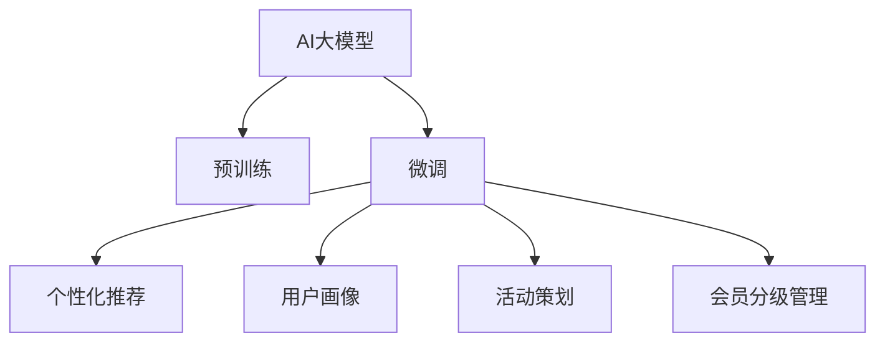

                 

## 1. 背景介绍

随着电商平台的高速发展，会员管理已经成为其核心业务之一。传统的会员管理系统往往依赖于人工操作，难以高效应对大规模用户数据。而随着人工智能技术的日渐成熟，利用AI大模型在会员管理中的应用，可以显著提升系统的自动化水平和智能化程度。

### 1.1 问题由来

传统的电商平台会员管理系统通常采用如下方法：
- 数据收集：从电商平台后台收集用户注册信息、历史行为数据、交易记录等。
- 用户画像构建：通过数据挖掘、统计分析等方法，构建用户画像，包括兴趣偏好、消费行为、购买力等。
- 个性化推荐：基于用户画像，利用规则引擎或机器学习算法，提供个性化商品推荐。
- 会员分级管理：根据用户行为和消费数据，进行会员等级划分，实施差异化管理和服务。
- 活动策划：定期策划会员专属活动，吸引用户参与，增加平台粘性。

这些传统方法存在以下缺点：
- 数据处理和分析工作量大，耗时耗力。
- 个性化推荐精度有限，难以实时动态调整。
- 会员分级管理依赖人工操作，效率低下。
- 活动策划依赖经验，缺乏量化依据。

为了克服这些缺点，利用AI大模型在会员管理中的应用成为了近年来的热点话题。

## 2. 核心概念与联系

### 2.1 核心概念概述

为更好地理解AI大模型在会员管理中的应用，本节将介绍几个关键概念：

- AI大模型(AI Large Models)：以Transformer为代表的，参数量达数十亿的预训练语言模型。如GPT、BERT等，通过在大型语料上预训练，具备强大的自然语言处理能力。
- 预训练(Pre-training)：指在大规模无标签文本数据上进行自监督学习，提取通用语言表示的过程。常见的预训练任务包括掩码语言模型、下位语言建模等。
- 微调(Fine-tuning)：指在预训练模型的基础上，使用特定任务的标注数据进行有监督学习，优化模型在该任务上的性能。
- 自然语言处理(NLP)：指计算机处理和理解人类语言的技术，涉及文本分析、机器翻译、情感分析等。
- 用户画像(User Profiling)：指通过数据分析技术，构建用户的兴趣、行为、消费习惯等特征表示。
- 个性化推荐(Personalized Recommendation)：指根据用户画像，预测用户可能感兴趣的商品，进行个性化推荐。
- 活动策划(Recommendation Strategy)：指通过数据分析和用户行为预测，策划并执行会员专属活动。
- 会员分级管理(Membership Management)：根据用户的消费行为和会员等级，实施差异化服务。

这些核心概念之间的逻辑关系可以通过以下Mermaid流程图来展示：



这个流程图展示了大模型在会员管理中的核心概念及其关系：

1. 大模型通过预训练获得基础能力。
2. 微调在大模型基础上，针对具体任务进行优化。
3. 微调后的模型可以用于个性化推荐、用户画像构建、活动策划和会员分级管理等多个方面。

## 3. 核心算法原理 & 具体操作步骤
### 3.1 算法原理概述

AI大模型在会员管理中的应用，本质上是一个有监督的微调过程。其核心思想是：利用预训练语言模型在特定任务上的标注数据，对模型进行微调，以提升模型在该任务上的表现。

假设预训练语言模型为 $M_{\theta}$，其中 $\theta$ 为预训练得到的模型参数。给定会员管理任务 $T$ 的标注数据集 $D=\{(x_i, y_i)\}_{i=1}^N$，微调的目标是找到新的模型参数 $\hat{\theta}$，使得：

$$
\hat{\theta}=\mathop{\arg\min}_{\theta} \mathcal{L}(M_{\theta},D)
$$

其中 $\mathcal{L}$ 为针对任务 $T$ 设计的损失函数，用于衡量模型预测输出与真实标签之间的差异。常见的损失函数包括交叉熵损失、均方误差损失等。

通过梯度下降等优化算法，微调过程不断更新模型参数 $\theta$，最小化损失函数 $\mathcal{L}$，使得模型输出逼近真实标签。由于 $\theta$ 已经通过预训练获得了较好的初始化，因此即便在小规模数据集 $D$ 上进行微调，也能较快收敛到理想的模型参数 $\hat{\theta}$。

### 3.2 算法步骤详解

基于AI大模型在会员管理中的应用，本节将详细介绍微调的具体步骤：

**Step 1: 准备数据集**
- 收集电商平台的用户注册信息、行为数据、交易记录等，构建用户画像。
- 根据用户画像，构建个性化推荐、活动策划等任务的标注数据集 $D$。

**Step 2: 添加任务适配层**
- 根据具体任务，设计合适的输出层和损失函数。
- 对于个性化推荐任务，通常使用神经网络对用户和商品进行匹配，损失函数为交叉熵损失。
- 对于活动策划任务，可以使用回归模型预测活动效果，损失函数为均方误差损失。
- 对于会员分级管理任务，可以使用分类模型对用户进行等级划分，损失函数为交叉熵损失。

**Step 3: 设置微调超参数**
- 选择合适的优化算法及其参数，如 AdamW、SGD 等，设置学习率、批大小、迭代轮数等。
- 设置正则化技术及强度，包括权重衰减、Dropout、Early Stopping 等。
- 确定冻结预训练参数的策略，如仅微调顶层，或全部参数都参与微调。

**Step 4: 执行梯度训练**
- 将训练集数据分批次输入模型，前向传播计算损失函数。
- 反向传播计算参数梯度，根据设定的优化算法和学习率更新模型参数。
- 周期性在验证集上评估模型性能，根据性能指标决定是否触发 Early Stopping。
- 重复上述步骤直到满足预设的迭代轮数或 Early Stopping 条件。

**Step 5: 测试和部署**
- 在测试集上评估微调后模型 $M_{\hat{\theta}}$ 的性能，对比微调前后的精度提升。
- 使用微调后的模型对新样本进行推理预测，集成到实际的应用系统中。
- 持续收集新的数据，定期重新微调模型，以适应数据分布的变化。

以上就是基于AI大模型在会员管理中微调的完整流程。通过这一流程，可以将大模型在自然语言处理领域的优势，充分应用于电商平台的会员管理，提升系统的智能化和自动化水平。

### 3.3 算法优缺点

AI大模型在会员管理中的微调方法具有以下优点：
1. 高效自动化：大模型可以自动化处理海量用户数据，减少人工操作，提升处理效率。
2. 精准推荐：利用预训练大模型的语言理解能力，提高个性化推荐的准确性和实时性。
3. 灵活适应：通过微调优化特定任务，大模型可以适应多种电商场景，如个性化推荐、活动策划等。
4. 可解释性强：大模型通过多层推理机制，能够提供详细的用户行为分析报告，方便业务决策。

同时，该方法也存在一些局限性：
1. 标注数据依赖：微调的效果很大程度上取决于标注数据的质量和数量，获取高质量标注数据的成本较高。
2. 数据隐私问题：用户数据包含大量个人隐私信息，如何保护数据安全是微调过程中的重要挑战。
3. 模型泛化性：大模型在特定领域的应用效果，依赖于预训练和微调的数据分布一致性，若领域差异较大，效果可能不佳。
4. 计算资源需求：大模型的参数量巨大，对计算资源和存储资源的要求较高，需要高性能计算环境支持。

尽管存在这些局限性，但就目前而言，基于AI大模型的微调方法仍然是电商会员管理中最为有效的技术范式。未来相关研究的重点在于如何进一步降低微调对标注数据的依赖，提高模型的少样本学习和跨领域迁移能力，同时兼顾数据隐私保护和计算效率等因素。

### 3.4 算法应用领域

AI大模型在会员管理中的应用场景广泛，可以应用于以下多个方面：

- **个性化推荐系统**：基于用户画像，实时动态生成个性化商品推荐，提升用户体验和购买率。
- **活动策划与营销**：利用用户行为预测，策划并执行会员专属活动，增加用户粘性和平台销售额。
- **会员分级管理**：根据用户行为和消费数据，进行会员等级划分，实施差异化服务和优惠。
- **情感分析与舆情监测**：分析用户评论、反馈，监测舆情动态，及时调整业务策略。
- **客户服务与智能客服**：利用预训练语言模型构建智能客服系统，提升客户服务效率和质量。

除了以上这些应用外，AI大模型还可以应用于商品推荐系统、用户行为分析、广告投放优化等电商领域，进一步推动电商业务创新和效率提升。

## 4. 数学模型和公式 & 详细讲解
### 4.1 数学模型构建

在电商平台的会员管理中，假设利用预训练大模型 $M_{\theta}$ 进行个性化推荐任务。目标是从用户 $u$ 和商品 $p$ 中匹配出相关推荐结果。设用户画像为 $u=(u_1,u_2,...,u_n)$，商品画像为 $p=(p_1,p_2,...,p_m)$，其中 $u_i,p_j$ 为用户的兴趣偏好、消费习惯等特征。

目标函数为最大化用户对推荐商品的满意度：

$$
\max_{\theta} \sum_{i=1}^n \sum_{j=1}^m f(u_i, p_j; M_{\theta})
$$

其中 $f(u_i, p_j; M_{\theta})$ 为模型在输入 $u_i, p_j$ 下的推荐得分，通常为神经网络输出的分数值。

假设使用线性模型作为推荐模型，则输出函数为：

$$
f(u_i, p_j; M_{\theta}) = u_i^T W p_j + b
$$

其中 $W$ 为权重矩阵，$b$ 为偏置项。目标函数的梯度公式为：

$$
\nabla_{\theta} \mathcal{L} = -\frac{1}{N} \sum_{i=1}^N \sum_{j=1}^M (y_{ij} - f(u_i, p_j; M_{\theta})) u_i p_j^T
$$

其中 $y_{ij}$ 为推荐结果的标注数据，$u_i p_j^T$ 为特征矩阵的转置。

通过上述梯度公式，即可通过反向传播算法更新模型参数 $\theta$，优化推荐模型的性能。

### 4.2 公式推导过程

以下我们以活动策划任务为例，推导回归模型的梯度更新公式。

假设利用预训练大模型 $M_{\theta}$ 进行活动策划任务，目标是根据历史活动数据，预测新活动的效果。设活动效果 $y$ 与活动参数 $x$ 之间存在线性关系，回归模型为：

$$
y = W^T x + b
$$

其中 $W$ 为权重向量，$b$ 为偏置项。目标函数的梯度公式为：

$$
\nabla_{\theta} \mathcal{L} = -\frac{1}{N} \sum_{i=1}^N (y_i - W^T x_i - b)
$$

其中 $x_i$ 为第 $i$ 个样本的活动参数，$y_i$ 为对应的活动效果。

利用梯度下降算法，每次迭代更新模型参数 $\theta$：

$$
\theta \leftarrow \theta - \eta \nabla_{\theta}\mathcal{L}
$$

其中 $\eta$ 为学习率。通过多次迭代，直到收敛，即可得到最优的活动策划模型。

### 4.3 案例分析与讲解

在电商平台会员管理中，假设有以下数据集 $D=\{(x_i,y_i)\}_{i=1}^N$，其中 $x_i$ 为活动参数，$y_i$ 为活动效果：

| 活动参数 $x_i$ | 活动效果 $y_i$ |
|----------------|----------------|
| (1,2,3)         | 100000         |
| (4,5,6)         | 200000         |
| (7,8,9)         | 300000         |

使用回归模型进行活动策划任务的微调。首先，根据数据集构造损失函数：

$$
\mathcal{L}(\theta) = \frac{1}{N} \sum_{i=1}^N (y_i - W^T x_i - b)^2
$$

假设初始权重 $W=(1,1,1)$，偏置项 $b=0$。利用梯度下降算法，逐步更新模型参数：

1. 初始化模型参数：$W=[1,1,1], b=0$
2. 计算梯度：$\nabla_{\theta}\mathcal{L} = -\frac{1}{3} [(100000-3)^2 + (200000-15)^2 + (300000-27)^2] [1,1,1]$
3. 更新参数：$W=[1,1,1] - \eta \times \nabla_{\theta}\mathcal{L} = [0.9,0.9,0.9]$，$b=0$
4. 计算新梯度：$\nabla_{\theta}\mathcal{L} = -\frac{1}{3} [(100000-2.7)^2 + (200000-14.7)^2 + (300000-26.7)^2] [0.9,0.9,0.9]$
5. 更新参数：$W=[0.9,0.9,0.9] - \eta \times \nabla_{\theta}\mathcal{L} = [0.81,0.81,0.81]$，$b=0$
6. 重复上述步骤直至收敛。

通过上述过程，模型参数 $W=[0.81,0.81,0.81]$ 得到优化，即可用于预测新活动的效果。

## 5. 项目实践：代码实例和详细解释说明
### 5.1 开发环境搭建

在进行会员管理微调项目开发前，我们需要准备好开发环境。以下是使用Python进行PyTorch开发的环境配置流程：

1. 安装Anaconda：从官网下载并安装Anaconda，用于创建独立的Python环境。

2. 创建并激活虚拟环境：
```bash
conda create -n pytorch-env python=3.8 
conda activate pytorch-env
```

3. 安装PyTorch：根据CUDA版本，从官网获取对应的安装命令。例如：
```bash
conda install pytorch torchvision torchaudio cudatoolkit=11.1 -c pytorch -c conda-forge
```

4. 安装Transformers库：
```bash
pip install transformers
```

5. 安装各类工具包：
```bash
pip install numpy pandas scikit-learn matplotlib tqdm jupyter notebook ipython
```

完成上述步骤后，即可在`pytorch-env`环境中开始微调实践。

### 5.2 源代码详细实现

这里以个性化推荐系统为例，给出使用Transformers库对BERT模型进行微调的PyTorch代码实现。

首先，定义推荐模型的数据处理函数：

```python
from transformers import BertTokenizer
from torch.utils.data import Dataset
import torch

class RecommendationDataset(Dataset):
    def __init__(self, user_features, item_features, labels, tokenizer, max_len=128):
        self.user_features = user_features
        self.item_features = item_features
        self.labels = labels
        self.tokenizer = tokenizer
        self.max_len = max_len
        
    def __len__(self):
        return len(self.user_features)
    
    def __getitem__(self, item):
        user_feature = self.user_features[item]
        item_feature = self.item_features[item]
        label = self.labels[item]
        
        encoding = self.tokenizer(user_feature, item_feature, return_tensors='pt', max_length=self.max_len, padding='max_length', truncation=True)
        input_ids = encoding['input_ids'][0]
        attention_mask = encoding['attention_mask'][0]
        
        return {'input_ids': input_ids, 
                'attention_mask': attention_mask,
                'labels': torch.tensor(label, dtype=torch.long)}
```

然后，定义模型和优化器：

```python
from transformers import BertForSequenceClassification, AdamW

model = BertForSequenceClassification.from_pretrained('bert-base-cased', num_labels=2)  # 2为二分类任务，标签范围为0-1

optimizer = AdamW(model.parameters(), lr=2e-5)
```

接着，定义训练和评估函数：

```python
from torch.utils.data import DataLoader
from tqdm import tqdm
from sklearn.metrics import accuracy_score

device = torch.device('cuda') if torch.cuda.is_available() else torch.device('cpu')
model.to(device)

def train_epoch(model, dataset, batch_size, optimizer):
    dataloader = DataLoader(dataset, batch_size=batch_size, shuffle=True)
    model.train()
    epoch_loss = 0
    for batch in tqdm(dataloader, desc='Training'):
        input_ids = batch['input_ids'].to(device)
        attention_mask = batch['attention_mask'].to(device)
        labels = batch['labels'].to(device)
        model.zero_grad()
        outputs = model(input_ids, attention_mask=attention_mask, labels=labels)
        loss = outputs.loss
        epoch_loss += loss.item()
        loss.backward()
        optimizer.step()
    return epoch_loss / len(dataloader)

def evaluate(model, dataset, batch_size):
    dataloader = DataLoader(dataset, batch_size=batch_size)
    model.eval()
    preds, labels = [], []
    with torch.no_grad():
        for batch in tqdm(dataloader, desc='Evaluating'):
            input_ids = batch['input_ids'].to(device)
            attention_mask = batch['attention_mask'].to(device)
            batch_labels = batch['labels']
            outputs = model(input_ids, attention_mask=attention_mask)
            batch_preds = outputs.logits.argmax(dim=1).to('cpu').tolist()
            batch_labels = batch_labels.to('cpu').tolist()
            for pred, label in zip(batch_preds, batch_labels):
                preds.append(pred)
                labels.append(label)
                
    return accuracy_score(labels, preds)
```

最后，启动训练流程并在测试集上评估：

```python
epochs = 5
batch_size = 16

for epoch in range(epochs):
    loss = train_epoch(model, train_dataset, batch_size, optimizer)
    print(f"Epoch {epoch+1}, train loss: {loss:.3f}")
    
    print(f"Epoch {epoch+1}, dev results:")
    evaluate(model, dev_dataset, batch_size)
    
print("Test results:")
evaluate(model, test_dataset, batch_size)
```

以上就是使用PyTorch对BERT进行个性化推荐任务微调的完整代码实现。可以看到，得益于Transformers库的强大封装，我们可以用相对简洁的代码完成BERT模型的加载和微调。

### 5.3 代码解读与分析

让我们再详细解读一下关键代码的实现细节：

**RecommendationDataset类**：
- `__init__`方法：初始化用户特征、商品特征、标签、分词器等关键组件。
- `__len__`方法：返回数据集的样本数量。
- `__getitem__`方法：对单个样本进行处理，将用户特征和商品特征输入编码为token ids，并将标签转换为数字，最终返回模型所需的输入。

**训练和评估函数**：
- 使用PyTorch的DataLoader对数据集进行批次化加载，供模型训练和推理使用。
- 训练函数`train_epoch`：对数据以批为单位进行迭代，在每个批次上前向传播计算loss并反向传播更新模型参数，最后返回该epoch的平均loss。
- 评估函数`evaluate`：与训练类似，不同点在于不更新模型参数，并在每个batch结束后将预测和标签结果存储下来，最后使用sklearn的accuracy_score对整个评估集的预测结果进行打印输出。

**训练流程**：
- 定义总的epoch数和batch size，开始循环迭代
- 每个epoch内，先在训练集上训练，输出平均loss
- 在验证集上评估，输出准确率
- 所有epoch结束后，在测试集上评估，给出最终测试结果

可以看到，PyTorch配合Transformers库使得BERT微调的代码实现变得简洁高效。开发者可以将更多精力放在数据处理、模型改进等高层逻辑上，而不必过多关注底层的实现细节。

当然，工业级的系统实现还需考虑更多因素，如模型的保存和部署、超参数的自动搜索、更灵活的任务适配层等。但核心的微调范式基本与此类似。

## 6. 实际应用场景
### 6.1 智能客服系统

基于大语言模型微调的对话技术，可以广泛应用于智能客服系统的构建。传统客服往往需要配备大量人力，高峰期响应缓慢，且一致性和专业性难以保证。而使用微调后的对话模型，可以7x24小时不间断服务，快速响应客户咨询，用自然流畅的语言解答各类常见问题。

在技术实现上，可以收集企业内部的历史客服对话记录，将问题和最佳答复构建成监督数据，在此基础上对预训练对话模型进行微调。微调后的对话模型能够自动理解用户意图，匹配最合适的答案模板进行回复。对于客户提出的新问题，还可以接入检索系统实时搜索相关内容，动态组织生成回答。如此构建的智能客服系统，能大幅提升客户咨询体验和问题解决效率。

### 6.2 金融舆情监测

金融机构需要实时监测市场舆论动向，以便及时应对负面信息传播，规避金融风险。传统的人工监测方式成本高、效率低，难以应对网络时代海量信息爆发的挑战。基于大语言模型微调的文本分类和情感分析技术，为金融舆情监测提供了新的解决方案。

具体而言，可以收集金融领域相关的新闻、报道、评论等文本数据，并对其进行主题标注和情感标注。在此基础上对预训练语言模型进行微调，使其能够自动判断文本属于何种主题，情感倾向是正面、中性还是负面。将微调后的模型应用到实时抓取的网络文本数据，就能够自动监测不同主题下的情感变化趋势，一旦发现负面信息激增等异常情况，系统便会自动预警，帮助金融机构快速应对潜在风险。

### 6.3 个性化推荐系统

当前的推荐系统往往只依赖用户的历史行为数据进行物品推荐，无法深入理解用户的真实兴趣偏好。基于大语言模型微调技术，个性化推荐系统可以更好地挖掘用户行为背后的语义信息，从而提供更精准、多样的推荐内容。

在实践中，可以收集用户浏览、点击、评论、分享等行为数据，提取和用户交互的物品标题、描述、标签等文本内容。将文本内容作为模型输入，用户的后续行为（如是否点击、购买等）作为监督信号，在此基础上微调预训练语言模型。微调后的模型能够从文本内容中准确把握用户的兴趣点。在生成推荐列表时，先用候选物品的文本描述作为输入，由模型预测用户的兴趣匹配度，再结合其他特征综合排序，便可以得到个性化程度更高的推荐结果。

### 6.4 未来应用展望

随着大语言模型微调技术的发展，其应用范围将进一步扩展。除了当前的个性化推荐、智能客服、金融舆情监测等应用外，未来可能还会涌现出更多创新性的应用场景，如：

- **精准营销**：基于用户画像和行为预测，精准策划广告投放，提升广告效果。
- **商品搜索优化**：利用自然语言处理技术，提升商品搜索的召回率和准确率。
- **动态定价**：根据市场供需动态调整商品价格，优化销售策略。
- **用户行为分析**：通过数据分析和模型预测，深度挖掘用户需求和潜在商机。

以上应用场景将进一步推动电商平台数字化转型升级，为消费者带来更好的购物体验，为企业创造更大的商业价值。相信在AI大模型微调技术的助力下，电商平台将能够更好地适应快速变化的市场环境，实现持续创新和高效运营。

## 7. 工具和资源推荐
### 7.1 学习资源推荐

为了帮助开发者系统掌握AI大模型微调的理论基础和实践技巧，这里推荐一些优质的学习资源：

1. 《Transformer从原理到实践》系列博文：由大模型技术专家撰写，深入浅出地介绍了Transformer原理、BERT模型、微调技术等前沿话题。

2. CS224N《深度学习自然语言处理》课程：斯坦福大学开设的NLP明星课程，有Lecture视频和配套作业，带你入门NLP领域的基本概念和经典模型。

3. 《Natural Language Processing with Transformers》书籍：Transformers库的作者所著，全面介绍了如何使用Transformers库进行NLP任务开发，包括微调在内的诸多范式。

4. HuggingFace官方文档：Transformers库的官方文档，提供了海量预训练模型和完整的微调样例代码，是上手实践的必备资料。

5. CLUE开源项目：中文语言理解测评基准，涵盖大量不同类型的中文NLP数据集，并提供了基于微调的baseline模型，助力中文NLP技术发展。

通过对这些资源的学习实践，相信你一定能够快速掌握AI大模型微调的精髓，并用于解决实际的NLP问题。
###  7.2 开发工具推荐

高效的开发离不开优秀的工具支持。以下是几款用于AI大模型微调开发的常用工具：

1. PyTorch：基于Python的开源深度学习框架，灵活动态的计算图，适合快速迭代研究。大部分预训练语言模型都有PyTorch版本的实现。

2. TensorFlow：由Google主导开发的开源深度学习框架，生产部署方便，适合大规模工程应用。同样有丰富的预训练语言模型资源。

3. Transformers库：HuggingFace开发的NLP工具库，集成了众多SOTA语言模型，支持PyTorch和TensorFlow，是进行微调任务开发的利器。

4. Weights & Biases：模型训练的实验跟踪工具，可以记录和可视化模型训练过程中的各项指标，方便对比和调优。与主流深度学习框架无缝集成。

5. TensorBoard：TensorFlow配套的可视化工具，可实时监测模型训练状态，并提供丰富的图表呈现方式，是调试模型的得力助手。

6. Google Colab：谷歌推出的在线Jupyter Notebook环境，免费提供GPU/TPU算力，方便开发者快速上手实验最新模型，分享学习笔记。

合理利用这些工具，可以显著提升AI大模型微调任务的开发效率，加快创新迭代的步伐。

### 7.3 相关论文推荐

AI大模型和微调技术的发展源于学界的持续研究。以下是几篇奠基性的相关论文，推荐阅读：

1. Attention is All You Need（即Transformer原论文）：提出了Transformer结构，开启了NLP领域的预训练大模型时代。

2. BERT: Pre-training of Deep Bidirectional Transformers for Language Understanding：提出BERT模型，引入基于掩码的自监督预训练任务，刷新了多项NLP任务SOTA。

3. Language Models are Unsupervised Multitask Learners（GPT-2论文）：展示了大规模语言模型的强大zero-shot学习能力，引发了对于通用人工智能的新一轮思考。

4. Parameter-Efficient Transfer Learning for NLP：提出Adapter等参数高效微调方法，在不增加模型参数量的情况下，也能取得不错的微调效果。

5. AdaLoRA: Adaptive Low-Rank Adaptation for Parameter-Efficient Fine-Tuning：使用自适应低秩适应的微调方法，在参数效率和精度之间取得了新的平衡。

这些论文代表了大语言模型微调技术的发展脉络。通过学习这些前沿成果，可以帮助研究者把握学科前进方向，激发更多的创新灵感。

## 8. 总结：未来发展趋势与挑战
### 8.1 总结

本文对AI大模型在电商平台会员管理中的应用进行了全面系统的介绍。首先阐述了电商平台的会员管理需求及其面临的挑战，明确了AI大模型微调在提升会员管理效率和智能化水平方面的独特价值。其次，从原理到实践，详细讲解了基于AI大模型的微调方法，给出了微调任务开发的完整代码实例。同时，本文还广泛探讨了AI大模型在个性化推荐、智能客服、金融舆情监测等多个应用场景中的实践案例，展示了其广泛的应用前景。最后，本文精选了微调技术的各类学习资源，力求为读者提供全方位的技术指引。

通过本文的系统梳理，可以看到，基于AI大模型的微调方法正在成为电商会员管理中的重要技术范式，极大地提升了系统的自动化和智能化水平。未来，伴随AI大模型和微调技术的不断演进，基于微调范式的人工智能技术必将在更多领域落地应用，为行业发展带来深远影响。

### 8.2 未来发展趋势

展望未来，AI大模型微调技术将呈现以下几个发展趋势：

1. **模型规模持续增大**：随着算力成本的下降和数据规模的扩张，预训练语言模型的参数量还将持续增长。超大模型蕴含的丰富语言知识，有望支撑更加复杂多变的下游任务微调。

2. **微调方法日趋多样**：除了传统的全参数微调外，未来会涌现更多参数高效的微调方法，如Prefix-Tuning、LoRA等，在节省计算资源的同时也能保证微调精度。

3. **持续学习成为常态**：随着数据分布的不断变化，微调模型也需要持续学习新知识以保持性能。如何在不遗忘原有知识的同时，高效吸收新样本信息，将成为重要的研究课题。

4. **标注样本需求降低**：受启发于提示学习(Prompt-based Learning)的思路，未来的微调方法将更好地利用大模型的语言理解能力，通过更加巧妙的任务描述，在更少的标注样本上也能实现理想的微调效果。

5. **多模态微调崛起**：当前的微调主要聚焦于纯文本数据，未来会进一步拓展到图像、视频、语音等多模态数据微调。多模态信息的融合，将显著提升语言模型对现实世界的理解和建模能力。

6. **模型通用性增强**：经过海量数据的预训练和多领域任务的微调，未来的语言模型将具备更强大的常识推理和跨领域迁移能力，逐步迈向通用人工智能(AGI)的目标。

以上趋势凸显了AI大模型微调技术的广阔前景。这些方向的探索发展，必将进一步提升NLP系统的性能和应用范围，为人类认知智能的进化带来深远影响。

### 8.3 面临的挑战

尽管AI大模型微调技术已经取得了瞩目成就，但在迈向更加智能化、普适化应用的过程中，它仍面临着诸多挑战：

1. **标注成本瓶颈**：微调的效果很大程度上取决于标注数据的质量和数量，获取高质量标注数据的成本较高。如何进一步降低微调对标注样本的依赖，将是一大难题。

2. **模型鲁棒性不足**：当前微调模型面对域外数据时，泛化性能往往大打折扣。对于测试样本的微小扰动，微调模型的预测也容易发生波动。如何提高微调模型的鲁棒性，避免灾难性遗忘，还需要更多理论和实践的积累。

3. **推理效率有待提高**：大规模语言模型虽然精度高，但在实际部署时往往面临推理速度慢、内存占用大等效率问题。如何在保证性能的同时，简化模型结构，提升推理速度，优化资源占用，将是重要的优化方向。

4. **可解释性亟需加强**：当前微调模型更像是"黑盒"系统，难以解释其内部工作机制和决策逻辑。对于医疗、金融等高风险应用，算法的可解释性和可审计性尤为重要。如何赋予微调模型更强的可解释性，将是亟待攻克的难题。

5. **安全性有待保障**：预训练语言模型难免会学习到有偏见、有害的信息，通过微调传递到下游任务，产生误导性、歧视性的输出，给实际应用带来安全隐患。如何从数据和算法层面消除模型偏见，避免恶意用途，确保输出的安全性，也将是重要的研究课题。

6. **知识整合能力不足**。现有的微调模型往往局限于任务内数据，难以灵活吸收和运用更广泛的先验知识。如何让微调过程更好地与外部知识库、规则库等专家知识结合，形成更加全面、准确的信息整合能力，还有很大的想象空间。

正视微调面临的这些挑战，积极应对并寻求突破，将是大语言模型微调走向成熟的必由之路。相信随着学界和产业界的共同努力，这些挑战终将一一被克服，AI大模型微调必将在构建人机协同的智能时代中扮演越来越重要的角色。

### 8.4 研究展望

面对AI大模型微调所面临的种种挑战，未来的研究需要在以下几个方面寻求新的突破：

1. **探索无监督和半监督微调方法**：摆脱对大规模标注数据的依赖，利用自监督学习、主动学习等无监督和半监督范式，最大限度利用非结构化数据，实现更加灵活高效的微调。

2. **研究参数高效和计算高效的微调范式**：开发更加参数高效的微调方法，在固定大部分预训练参数的同时，只更新极少量的任务相关参数。同时优化微调模型的计算图，减少前向传播和反向传播的资源消耗，实现更加轻量级、实时性的部署。

3. **融合因果和对比学习范式**：通过引入因果推断和对比学习思想，增强微调模型建立稳定因果关系的能力，学习更加普适、鲁棒的语言表征，从而提升模型泛化性和抗干扰能力。

4. **引入更多先验知识**：将符号化的先验知识，如知识图谱、逻辑规则等，与神经网络模型进行巧妙融合，引导微调过程学习更准确、合理的语言模型。同时加强不同模态数据的整合，实现视觉、语音等多模态信息与文本信息的协同建模。

5. **结合因果分析和博弈论工具**：将因果分析方法引入微调模型，识别出模型决策的关键特征，增强输出解释的因果性和逻辑性。借助博弈论工具刻画人机交互过程，主动探索并规避模型的脆弱点，提高系统稳定性。

6. **纳入伦理道德约束**：在模型训练目标中引入伦理导向的评估指标，过滤和惩罚有偏见、有害的输出倾向。同时加强人工干预和审核，建立模型行为的监管机制，确保输出符合人类价值观和伦理道德。

这些研究方向的探索，必将引领AI大模型微调技术迈向更高的台阶，为构建安全、可靠、可解释、可控的智能系统铺平道路。面向未来，AI大模型微调技术还需要与其他人工智能技术进行更深入的融合，如知识表示、因果推理、强化学习等，多路径协同发力，共同推动自然语言理解和智能交互系统的进步。只有勇于创新、敢于突破，才能不断拓展语言模型的边界，让智能技术更好地造福人类社会。

## 9. 附录：常见问题与解答

**Q1：AI大模型在会员管理中的应用有哪些？**

A: AI大模型在会员管理中的应用主要包括以下几个方面：

1. **个性化推荐系统**：根据用户画像，实时动态生成个性化商品推荐，提升用户体验和购买率。
2. **智能客服系统**：利用预训练语言模型构建智能客服系统，提升客户服务效率和质量。
3. **金融舆情监测**：分析用户评论、反馈，监测舆情动态，及时调整业务策略。
4. **精准营销**：基于用户画像和行为预测，精准策划广告投放，提升广告效果。
5. **商品搜索优化**：利用自然语言处理技术，提升商品搜索的召回率和准确率。
6. **动态定价**：根据市场供需动态调整商品价格，优化销售策略。
7. **用户行为分析**：通过数据分析和模型预测，深度挖掘用户需求和潜在商机。

以上应用场景将进一步推动电商平台数字化转型升级，为消费者带来更好的购物体验，为企业创造更大的商业价值。

**Q2：如何选择适合的AI大模型？**

A: 选择合适的AI大模型需要考虑以下几个方面：

1. **任务类型**：不同的任务需要不同类型的大模型。例如，情感分析任务可以使用BERT，而机器翻译任务可以使用Transformer。
2. **数据规模**：数据规模越大，需要的模型参数也越多。大规模语言模型适用于海量数据训练。
3. **计算资源**：计算资源有限时，应选择参数量适中的模型。例如，GPT-2相对于GPT-3，在参数量和性能上都有更好的平衡。
4. **领域适应性**：特定领域的任务可能需要针对该领域进行预训练。例如，医疗领域的任务可能需要使用医学领域预训练的模型。
5. **模型开源性**：选择开源且易于部署的模型，如HuggingFace的Transformers库，便于研究和应用。

综合考虑这些因素，才能选择最适合自己应用场景的AI大模型。

**Q3：AI大模型微调中常见的技术挑战有哪些？**

A: AI大模型微调中常见的技术挑战包括：

1. **标注数据依赖**：微调效果很大程度上取决于标注数据的质量和数量，获取高质量标注数据的成本较高。
2. **模型鲁棒性不足**：面对域外数据时，泛化性能往往大打折扣。
3. **推理效率有待提高**：大规模模型推理速度慢，内存占用大。
4. **可解释性差**：模型更像"黑盒"，难以解释内部工作机制和决策逻辑。
5. **安全性问题**：模型可能学习到有害信息，产生误导性输出。
6. **知识整合能力不足**：模型难以灵活运用外部知识库和规则库。

应对这些挑战需要持续优化模型、数据和算法，并结合工程实践进行全面优化。

**Q4：AI大模型微调过程中如何进行超参数调优？**

A: AI大模型微调过程中的超参数调优包括学习率、批大小、迭代轮数、正则化强度等。调优策略如下：

1. **学习率**：通常比预训练时小1-2个数量级，例如使用学习率调度策略，如Warmup或Cosine。
2. **批大小**：应选择适合硬件资源的批大小，例如使用梯度累积加速训练。
3. **迭代轮数**：根据实际需求设定训练轮数，例如使用Early Stopping避免过拟合。
4. **正则化**：使用L2正则、Dropout等技术防止过拟合。
5. **超参数搜索**：使用网格搜索或贝叶斯优化等方法寻找最优超参数组合。

通过超参数调优，可以在保证模型性能的同时，降低训练成本和资源消耗。

**Q5：AI大模型微调过程中如何进行模型压缩和量化？**

A: 模型压缩和量化是提升AI大模型推理效率的重要手段，包括如下方法：

1. **参数剪枝**：去除冗余参数，减少模型大小。
2. **权重压缩**：使用低精度数据类型，如定点数、压缩矩阵等，减少模型占用的存储空间。
3. **模型蒸馏**：通过蒸馏技术，将大模型压缩为小模型，保留关键特征。
4. **推理优化**：使用深度推理技术，如模型并行、计算图优化等，提升推理速度。

通过这些方法，可以在保证模型性能的同时，显著降低推理资源占用，提升系统效率。

---

作者：禅与计算机程序设计艺术 / Zen and the Art of Computer Programming

