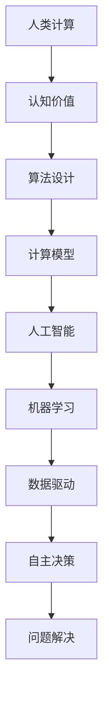

                 

# 探索人类思维的奥秘：人类计算的认知价值

> 关键词：人类计算,认知价值,算法设计,计算模型,人工智能,机器学习,人机协作

## 1. 背景介绍

### 1.1 问题由来

人类思维自古以来一直被认为是独特的认知能力，它使我们能够理解世界、解决问题和创造新事物。然而，随着计算机技术的发展，我们逐渐发现，计算机也可以通过复杂的算法来模拟人类的思维过程。这种计算机模拟思维的过程被称作“人类计算”。

人类计算不仅在理论上有重要的研究价值，还在实际应用中展现了巨大的潜力。例如，Deep Blue能够在国际象棋中击败人类冠军，AlphaGo在围棋领域取得了突破性的胜利。这些成就显示出，通过适当的算法设计，计算机能够在某些领域超越人类。

本文将探讨人类计算的认知价值，分析其算法原理，并讨论其在不同领域的应用和未来展望。

## 2. 核心概念与联系

### 2.1 核心概念概述

在探索人类计算的认知价值时，我们首先需要明确几个核心概念：

- **人类计算（Human Computation）**：指通过计算机算法模拟人类思维过程，解决复杂问题或进行创造性思维的计算模式。

- **认知价值（Cognitive Value）**：指算法在模拟人类思维过程中所展现的智能水平和创造力，包括理解、推理、预测、决策等能力。

- **算法设计（Algorithm Design）**：指为了实现特定目标，通过一系列步骤和规则来构建计算模型的过程。

- **计算模型（Computational Model）**：指在算法设计过程中，用于抽象和表示计算过程的数学模型或物理模型。

- **人工智能（Artificial Intelligence, AI）**：指利用计算机算法模拟人类智能的行为和思维，实现自主决策和问题解决的能力。

- **机器学习（Machine Learning, ML）**：指通过数据驱动的方法，使计算机算法自动从经验中学习，以提高智能水平的过程。

### 2.2 核心概念原理和架构的 Mermaid 流程图



这个流程图展示了人类计算从认知价值到算法设计，再到计算模型的全过程，最终通过人工智能和机器学习实现自主决策和问题解决。

## 3. 核心算法原理 & 具体操作步骤

### 3.1 算法原理概述

人类计算的核心算法原理主要包括以下几个方面：

- **符号推理（Symbolic Reasoning）**：通过逻辑和数学符号来表达和推理人类思维的过程，广泛应用于知识图谱和自动推理系统中。

- **神经网络（Neural Networks）**：模拟人脑神经元之间的连接和传递机制，通过反向传播算法进行训练，用于图像识别、语音识别、自然语言处理等任务。

- **进化算法（Evolutionary Algorithms）**：模拟自然界进化过程，通过遗传算法、粒子群算法等方法进行优化，适用于复杂问题的求解和优化。

- **博弈论（Game Theory）**：研究多智能体之间的策略互动和利益博弈，应用于决策支持系统和自动谈判系统。

- **强化学习（Reinforcement Learning, RL）**：通过奖励机制指导算法在特定环境中学习最优策略，广泛应用于机器人控制、自动驾驶等领域。

### 3.2 算法步骤详解

一个典型的人类计算算法执行步骤如下：

1. **问题抽象**：将实际问题抽象为计算模型。例如，将图像识别问题抽象为图像-标签映射的分类问题。

2. **算法设计**：选择合适的算法框架和模型结构。例如，使用卷积神经网络进行图像分类。

3. **数据准备**：收集和处理用于训练和验证的样本数据。例如，收集大量带有标注的图像和对应的标签。

4. **模型训练**：在训练数据上应用算法进行模型训练。例如，使用反向传播算法训练卷积神经网络。

5. **模型评估**：在验证数据上评估模型性能。例如，使用准确率和召回率等指标评估分类器性能。

6. **模型部署**：将训练好的模型部署到实际应用场景中。例如，将图像分类器部署到手机相机中。

### 3.3 算法优缺点

人类计算算法具有以下优点：

- **高效性**：通过计算机算法可以迅速处理大量数据，解决复杂问题。

- **可扩展性**：算法可以通过并行计算和分布式处理，适应大规模和高并发的应用场景。

- **准确性**：现代算法和数据处理技术能够提供高度精确的计算结果。

- **自动化**：算法可以在数据和计算资源的支撑下，自动完成复杂的计算任务。

然而，人类计算算法也存在一些缺点：

- **数据依赖**：算法的性能很大程度上取决于数据的质量和数量。

- **解释性不足**：复杂的算法和模型通常缺乏可解释性，难以理解其内部工作机制。

- **计算资源消耗**：大规模和高并发的计算任务需要大量的计算资源，可能导致资源浪费和成本高昂。

- **伦理问题**：算法在处理敏感数据时可能侵犯隐私，存在伦理风险。

### 3.4 算法应用领域

人类计算算法在多个领域得到了广泛应用：

- **金融**：应用于量化交易、风险评估、欺诈检测等。

- **医疗**：应用于疾病预测、影像分析、个性化治疗等。

- **智能制造**：应用于工艺优化、设备维护、质量控制等。

- **自动驾驶**：应用于路径规划、环境感知、安全保障等。

- **游戏开发**：应用于游戏AI、角色控制、虚拟现实等。

## 4. 数学模型和公式 & 详细讲解 & 举例说明

### 4.1 数学模型构建

人类计算的数学模型构建主要基于以下几个方面：

- **符号逻辑**：使用逻辑代数和布尔代数来表达和推理人类思维的过程。例如，一阶谓词逻辑可以表示自然语言中的命题和推理。

- **线性代数**：用于矩阵运算和向量空间，广泛用于机器学习中的矩阵分解和特征提取。

- **微积分**：用于优化问题的求解，例如，梯度下降算法用于神经网络的训练。

### 4.2 公式推导过程

以神经网络为例，其数学模型和公式推导过程如下：

1. **输入层**：将输入数据表示为向量 $x \in \mathbb{R}^n$。

2. **隐藏层**：通过非线性激活函数 $f$ 进行计算，得到隐藏层输出 $h \in \mathbb{R}^m$。

3. **输出层**：通过线性变换和激活函数，得到输出结果 $y \in \mathbb{R}^k$。

4. **损失函数**：定义损失函数 $L(y, \hat{y})$ 来衡量模型输出与真实标签的差异。

5. **梯度下降**：使用梯度下降算法更新模型参数 $\theta$，使得损失函数最小化。

### 4.3 案例分析与讲解

以图像分类为例，使用卷积神经网络（CNN）进行分类：

1. **卷积层**：通过卷积核提取图像特征，得到特征图。

2. **池化层**：通过池化操作降低特征图维度，减少计算量。

3. **全连接层**：将特征图展开成一维向量，通过全连接层进行分类。

4. **softmax层**：将分类结果转换为概率分布，进行多分类预测。

5. **交叉熵损失**：定义交叉熵损失函数，衡量预测结果与真实标签的差异。

通过上述步骤，CNN能够在图像分类任务上取得优异的表现。

## 5. 项目实践：代码实例和详细解释说明

### 5.1 开发环境搭建

开发人类计算项目，需要搭建以下开发环境：

1. **编程语言**：Python、C++、Java等。

2. **深度学习框架**：TensorFlow、PyTorch、Keras等。

3. **数据库系统**：MySQL、MongoDB等。

4. **数据处理工具**：Pandas、NumPy等。

5. **可视化工具**：Matplotlib、Seaborn等。

6. **版本控制工具**：Git、SVN等。

### 5.2 源代码详细实现

以下是一个简单的Python代码示例，用于图像分类的CNN模型实现：

```python
import tensorflow as tf
from tensorflow.keras import layers

# 定义CNN模型
model = tf.keras.Sequential([
    layers.Conv2D(32, (3, 3), activation='relu', input_shape=(28, 28, 1)),
    layers.MaxPooling2D((2, 2)),
    layers.Conv2D(64, (3, 3), activation='relu'),
    layers.MaxPooling2D((2, 2)),
    layers.Conv2D(64, (3, 3), activation='relu'),
    layers.Flatten(),
    layers.Dense(64, activation='relu'),
    layers.Dense(10, activation='softmax')
])

# 编译模型
model.compile(optimizer='adam', loss='sparse_categorical_crossentropy', metrics=['accuracy'])

# 训练模型
model.fit(train_images, train_labels, epochs=5, validation_data=(test_images, test_labels))
```

### 5.3 代码解读与分析

上述代码实现了一个简单的CNN模型，用于手写数字的分类。模型包含卷积层、池化层、全连接层和softmax输出层。通过编译和训练模型，可以实现较高的分类准确率。

## 6. 实际应用场景

### 6.1 智能医疗

在智能医疗领域，人类计算算法可以用于疾病预测、影像分析和个性化治疗等方面。例如，通过深度学习算法对医疗影像进行分析和诊断，能够辅助医生提高诊断准确率。

### 6.2 智能制造

在智能制造领域，人类计算算法可以用于工艺优化、设备维护和质量控制等方面。例如，通过机器学习算法分析生产数据，优化生产流程和提高产品质量。

### 6.3 自动驾驶

在自动驾驶领域，人类计算算法可以用于路径规划、环境感知和决策保障等方面。例如，通过强化学习算法实现自适应驾驶和避障。

### 6.4 未来应用展望

未来，人类计算将在更多领域得到应用，为社会带来深刻变革：

- **智能交通**：应用于交通流量优化、自动驾驶和智能导航。

- **智能家居**：应用于家庭自动化、智能监控和能源管理。

- **智能金融**：应用于量化交易、风险评估和欺诈检测。

- **智慧城市**：应用于城市管理、公共安全和环境保护。

## 7. 工具和资源推荐

### 7.1 学习资源推荐

为了帮助开发者系统掌握人类计算的算法和应用，这里推荐一些优质的学习资源：

1. **《深度学习》（Deep Learning）**：由Ian Goodfellow、Yoshua Bengio和Aaron Courville合著，是深度学习领域的经典教材，涵盖了深度学习的基本概念和算法。

2. **《机器学习》（Machine Learning Yearning）**：由Andrew Ng撰写，是一本实用的机器学习指南，涵盖算法设计、模型训练和工程实践等。

3. **《算法竞赛入门经典》（Algorithm Design Manual）**：由Steven S. Skiena撰写，是一本介绍算法设计和数据结构实现的经典书籍。

4. **Kaggle竞赛平台**：一个全球最大的数据科学竞赛平台，提供丰富的数据集和挑战，促进数据驱动的算法学习和应用。

5. **Coursera课程**：由斯坦福大学、MIT、Berkeley等名校开设的在线课程，涵盖机器学习、深度学习、数据科学等领域。

通过对这些资源的学习实践，相信你一定能够快速掌握人类计算的精髓，并用于解决实际的计算问题。

### 7.2 开发工具推荐

高效的开发离不开优秀的工具支持。以下是几款用于人类计算开发的常用工具：

1. **TensorFlow**：由Google开发的深度学习框架，灵活易用，支持分布式计算和模型优化。

2. **PyTorch**：由Facebook开发的深度学习框架，易于扩展和部署，支持动态计算图。

3. **Scikit-learn**：Python的机器学习库，提供了丰富的算法和工具，适用于数据预处理和模型评估。

4. **NumPy**：Python的科学计算库，提供了高效的数值计算和矩阵运算功能。

5. **OpenCV**：计算机视觉库，提供了丰富的图像处理和分析工具，适用于图像识别和模式识别任务。

合理利用这些工具，可以显著提升人类计算任务的开发效率，加快创新迭代的步伐。

### 7.3 相关论文推荐

人类计算技术的发展源于学界的持续研究。以下是几篇奠基性的相关论文，推荐阅读：

1. **《神经网络与深度学习》（Neural Networks and Deep Learning）**：Michael Nielsen撰写的在线教材，详细介绍了神经网络和深度学习的原理和应用。

2. **《强化学习》（Reinforcement Learning）**：Richard S. Sutton和Andrew G. Barto撰写的经典教材，涵盖了强化学习的基本概念和算法。

3. **《符号逻辑与计算》（Symbolic Logic and Computation）**：Christopher C. Chickering撰写的教材，介绍了符号逻辑和计算的基本概念和应用。

4. **《进化计算：一个进化算法教程》（Evolutionary Computation: A Tutorial on Search-Based Methods for Constrained Real-Parameter Optimization and Machine Learning）**：Guzdial、Dean、Chankong等撰写的论文，介绍了进化计算的基本概念和算法。

这些论文代表了大规模计算技术的发展脉络。通过学习这些前沿成果，可以帮助研究者把握学科前进方向，激发更多的创新灵感。

## 8. 总结：未来发展趋势与挑战

### 8.1 总结

本文对人类计算的算法原理和应用进行了全面系统的介绍。首先阐述了人类计算的认知价值，明确了算法在模拟人类思维过程中所展现的智能水平和创造力。其次，从原理到实践，详细讲解了人类计算的数学模型和操作步骤，给出了人类计算任务开发的完整代码实例。同时，本文还广泛探讨了人类计算在各个领域的应用前景，展示了人类计算范式的巨大潜力。

通过本文的系统梳理，可以看到，人类计算算法在理论上有重要的研究价值，在实际应用中展现了巨大的潜力。未来，伴随深度学习、进化计算、符号逻辑等技术的持续演进，人类计算将进一步拓展其应用边界，为人类认知智能的进化带来深远影响。

### 8.2 未来发展趋势

展望未来，人类计算技术将呈现以下几个发展趋势：

1. **跨领域融合**：人类计算将与其他AI技术进行更深入的融合，如自然语言处理、计算机视觉、知识图谱等，形成更加全面、准确的信息整合能力。

2. **多模态计算**：人类计算将拓展到多模态数据处理，如图像、视频、语音等，提升对现实世界的理解和建模能力。

3. **持续学习**：人类计算模型需要持续学习新知识，以保持性能和适应数据分布的变化。

4. **可解释性**：未来需要赋予人类计算模型更强的可解释性，增强算法的透明度和可信度。

5. **伦理和安全性**：人类计算模型需要考虑伦理和安全性问题，避免模型偏见和滥用。

以上趋势凸显了人类计算技术的广阔前景。这些方向的探索发展，必将进一步提升人类计算的智能化水平，为人类认知智能的进化带来深远影响。

### 8.3 面临的挑战

尽管人类计算技术已经取得了瞩目成就，但在迈向更加智能化、普适化应用的过程中，它仍面临着诸多挑战：

1. **数据瓶颈**：人类计算算法依赖高质量、大规模的数据，但在某些领域获取数据可能困难重重。

2. **计算资源消耗**：大规模计算任务需要大量计算资源，可能导致资源浪费和成本高昂。

3. **模型复杂性**：复杂计算模型难以理解和解释，可能存在伦理和安全性风险。

4. **可解释性不足**：复杂的算法和模型通常缺乏可解释性，难以理解其内部工作机制。

5. **隐私保护**：人类计算算法处理敏感数据时，需要考虑隐私保护和数据安全问题。

6. **伦理问题**：算法在处理敏感数据时可能侵犯隐私，存在伦理风险。

正视人类计算面临的这些挑战，积极应对并寻求突破，将是人类计算技术走向成熟的必由之路。相信随着学界和产业界的共同努力，这些挑战终将一一被克服，人类计算必将在构建人机协同的智能时代中扮演越来越重要的角色。

### 8.4 研究展望

面对人类计算所面临的种种挑战，未来的研究需要在以下几个方面寻求新的突破：

1. **数据增强**：开发更多数据增强技术，解决数据瓶颈问题。

2. **计算优化**：优化计算模型，降低计算资源消耗，提高计算效率。

3. **模型简化**：简化复杂计算模型，增强可解释性，避免伦理和安全问题。

4. **多模态融合**：拓展多模态数据处理能力，提升对现实世界的理解和建模能力。

5. **伦理约束**：在算法设计中引入伦理导向的评估指标，避免模型偏见和滥用。

6. **隐私保护**：采用数据脱敏和加密技术，保障数据安全。

这些研究方向的探索，必将引领人类计算技术迈向更高的台阶，为构建安全、可靠、可解释、可控的智能系统铺平道路。面向未来，人类计算技术还需要与其他人工智能技术进行更深入的融合，如自然语言处理、计算机视觉、知识图谱等，多路径协同发力，共同推动自然语言理解和智能交互系统的进步。只有勇于创新、敢于突破，才能不断拓展计算模型的边界，让智能技术更好地造福人类社会。

## 9. 附录：常见问题与解答

**Q1：人类计算是否适用于所有计算问题？**

A: 人类计算适用于大多数计算问题，特别是那些需要大量数据处理和复杂推理的任务。但对于某些问题，如密码破解、逻辑推理等，可能需要其他类型的算法和模型。

**Q2：如何评估人类计算算法的性能？**

A: 人类计算算法的性能评估通常使用准确率、召回率、F1值等指标。对于分类问题，可以通过混淆矩阵和ROC曲线进行评估。对于回归问题，可以使用均方误差（MSE）、平均绝对误差（MAE）等指标进行评估。

**Q3：人类计算算法是否存在理论上的限制？**

A: 人类计算算法在理论上存在一些限制，如计算复杂度、模型复杂度、数据依赖等。例如，深度学习算法在大规模数据和复杂模型的前提下，才能取得较好的效果。

**Q4：人类计算算法在实际应用中需要注意哪些问题？**

A: 人类计算算法在实际应用中需要注意以下几点：

1. 数据质量：确保输入数据的准确性和完整性。

2. 模型训练：选择合适的算法和模型结构，并进行充分训练。

3. 模型评估：使用合适的评估指标，进行模型性能评估。

4. 模型部署：将训练好的模型部署到实际应用场景中，并进行性能优化。

5. 模型监控：实时监控模型性能，及时发现和解决问题。

**Q5：人类计算算法是否容易解释和理解？**

A: 人类计算算法往往比较复杂，难以解释和理解。例如，深度学习模型的黑盒性质使得其内部工作机制难以理解。然而，随着研究的发展，越来越多的可解释性算法和工具被开发出来，如LIME、SHAP等，帮助解释复杂模型的决策过程。

---

作者：禅与计算机程序设计艺术 / Zen and the Art of Computer Programming

