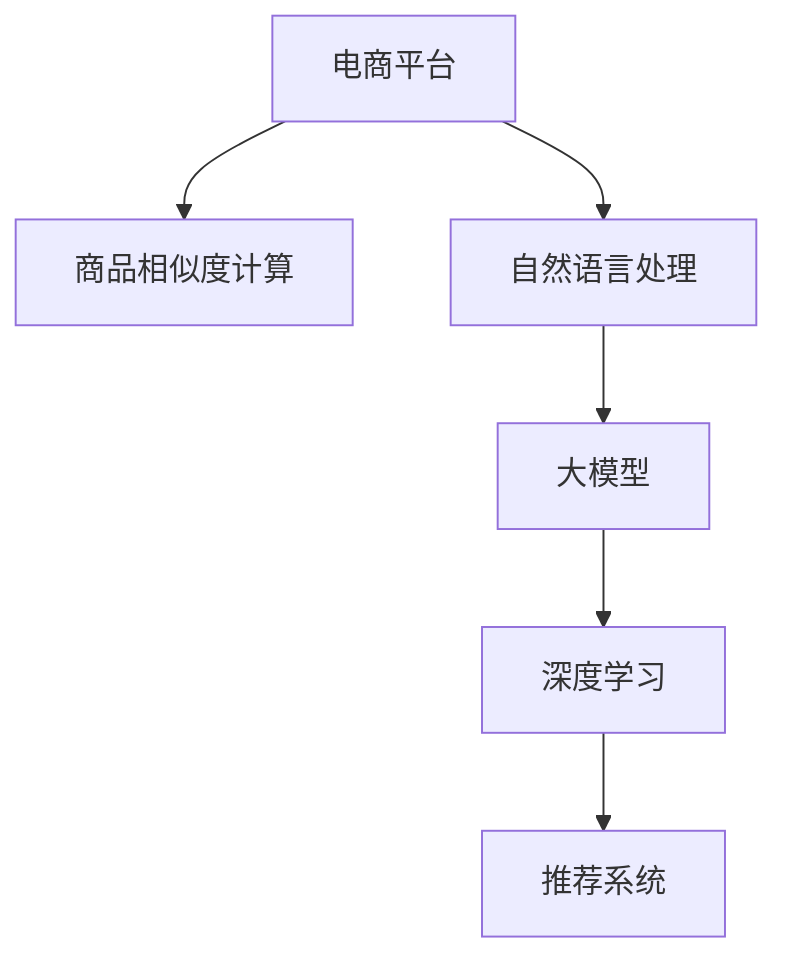

                 

# 探讨大模型在电商平台商品相似度计算中的作用

> 关键词：电商平台, 大模型, 相似度计算, 自然语言处理, 深度学习, 推荐系统

## 1. 背景介绍

### 1.1 问题由来

随着电商市场的蓬勃发展，消费者对商品信息的需求愈发多样和个性化，如何高效、准确地推荐商品成为电商平台的一大难题。传统的推荐系统主要依赖用户行为数据，如浏览历史、购买记录等，但这些数据往往受限于用户的使用习惯，难以覆盖所有潜在的兴趣群体。为了打破这一瓶颈，近年来，基于自然语言处理(NLP)技术的推荐系统在电商领域得到了广泛应用。

通过大模型进行自然语言处理，可以更好地理解商品描述、用户评论等文本信息，从中挖掘出商品之间的隐含关联，为推荐算法提供有力支撑。本文旨在探讨大模型在电商平台商品相似度计算中的应用，以及如何利用大模型提升商品推荐效果。

### 1.2 问题核心关键点

电商平台的商品相似度计算是指通过计算商品之间的相似度，识别出功能类似、用户偏好相似的商品，从而进行个性化推荐。传统的相似度计算方法主要包括余弦相似度、Jaccard相似度等，但这些方法往往难以充分考虑商品描述中的语义信息，导致推荐结果不够准确。

使用大模型进行相似度计算，可以利用其强大的语义理解能力，从自然语言描述中提取更为丰富的特征，进而提升相似度计算的准确性。具体来说，大模型可以自动学习语言中的复杂关系，捕捉到商品描述中潜在的语义相似性，从而生成更合理的相似度评分。

## 2. 核心概念与联系

### 2.1 核心概念概述

为了更好地理解大模型在商品相似度计算中的应用，我们首先介绍几个核心概念：

- **电商平台**：通过互联网提供商品展示、销售、配送等服务的平台。典型的电商平台包括淘宝、京东、亚马逊等。
- **商品相似度计算**：通过计算商品之间的语义、功能、用户评价等特征的相似性，识别出相似的商品，用于推荐系统生成个性化推荐结果。
- **大模型**：以Transformer、BERT、GPT等架构为代表的大规模预训练语言模型。这些模型通过在海量文本数据上预训练，获得了强大的语言理解和生成能力。
- **自然语言处理(NLP)**：研究计算机如何理解、处理和生成人类语言的技术领域，包括文本分类、情感分析、机器翻译等任务。
- **深度学习**：通过多层神经网络模型进行训练的机器学习方法，主要用于处理大规模复杂的数据，如图像、语音、文本等。

这些概念之间的逻辑关系可以通过以下Mermaid流程图来展示：



这个流程图展示了大模型在电商平台商品相似度计算中的应用路径：电商平台利用自然语言处理技术，通过深度学习模型（即大模型）进行商品描述的分析，进而生成商品之间的相似度评分，最终由推荐系统生成个性化推荐结果。

## 3. 核心算法原理 & 具体操作步骤

### 3.1 算法原理概述

基于大模型的商品相似度计算方法，主要利用大模型的语义理解和特征提取能力，对商品描述进行编码和相似度计算。核心步骤如下：

1. **文本预处理**：对商品描述进行分词、去停用词等预处理操作。
2. **大模型编码**：将预处理后的文本输入大模型，得到商品描述的向量表示。
3. **相似度计算**：计算两个商品描述向量之间的余弦相似度或欧几里得距离等，得到相似度评分。
4. **推荐生成**：根据相似度评分，选择与目标商品相似度最高的商品进行推荐。

### 3.2 算法步骤详解

下面我们详细介绍基于大模型的商品相似度计算的具体步骤：

**Step 1: 文本预处理**

对于商品描述的文本数据，需要进行以下预处理操作：

1. **分词**：将文本分割成单独的词语，以便后续模型处理。
2. **去停用词**：去除文本中的停用词（如“的”、“是”等），减少无意义的噪声。
3. **词干提取**：将不同的词形还原到其基本形式，如将“running”还原为“run”。

预处理操作可以使用NLTK、SpaCy等工具包进行实现。

**Step 2: 大模型编码**

使用预训练语言模型对处理后的文本进行编码，得到商品描述的向量表示。这里以BERT模型为例：

1. **加载模型**：从HuggingFace等平台下载预训练的BERT模型，例如`bert-base-uncased`。
2. **编码文本**：将预处理后的文本输入模型，得到每个词的向量表示。

以下是一个使用HuggingFace Transformers库对商品描述进行编码的Python代码示例：

```python
from transformers import BertTokenizer, BertModel

tokenizer = BertTokenizer.from_pretrained('bert-base-uncased')
model = BertModel.from_pretrained('bert-base-uncased')

inputs = tokenizer.encode("This is a sample text.", return_tensors='pt')
outputs = model(inputs)
```

**Step 3: 相似度计算**

得到商品描述的向量表示后，可以使用以下几种方法进行相似度计算：

1. **余弦相似度**：计算两个商品描述向量之间的夹角余弦值。
2. **欧几里得距离**：计算两个商品描述向量之间的欧式距离。

以下是一个使用余弦相似度计算相似度的Python代码示例：

```python
from sklearn.metrics.pairwise import cosine_similarity

# 假设我们有两个商品的描述向量
vec1 = torch.tensor([0.5, 0.5, 0.0, 0.0])
vec2 = torch.tensor([0.0, 0.5, 0.5, 0.0])

similarity = cosine_similarity(vec1, vec2).item()
```

**Step 4: 推荐生成**

根据相似度评分，选择与目标商品相似度最高的商品进行推荐。具体来说，可以根据预设的相似度阈值，将相似度评分高于阈值的商品作为候选商品，然后结合用户偏好、历史行为等特征，生成最终推荐结果。

### 3.3 算法优缺点

基于大模型的商品相似度计算方法有以下优点：

1. **语义理解能力强**：大模型可以捕捉到商品描述中的复杂语义关系，生成更准确的相似度评分。
2. **泛化能力强**：大模型经过大量文本数据的预训练，能够泛化到不同的商品和领域。
3. **模型效果好**：大模型在自然语言处理领域的效果显著，可以提升商品推荐系统的精度。

但该方法也存在以下缺点：

1. **计算复杂度高**：大模型的编码过程复杂，计算资源消耗大。
2. **数据需求大**：需要大量标注数据进行预训练和微调。
3. **实时性差**：计算相似度需要较长时间，难以实时响应。

## 4. 数学模型和公式 & 详细讲解 & 举例说明

### 4.1 数学模型构建

基于大模型的商品相似度计算方法，可以从数学上建模为：

$$
\text{similarity} = \frac{\mathbf{v}_1 \cdot \mathbf{v}_2}{\|\mathbf{v}_1\| \cdot \|\mathbf{v}_2\|}
$$

其中 $\mathbf{v}_1, \mathbf{v}_2$ 为两个商品描述的向量表示，$\cdot$ 表示向量点乘，$\|\mathbf{v}_1\|$ 和 $\|\mathbf{v}_2\|$ 分别表示向量的范数。

### 4.2 公式推导过程

使用BERT模型对商品描述进行编码，得到向量表示：

$$
\mathbf{v} = \text{BERT}(\text{description})
$$

其中 $\text{description}$ 为商品描述的文本。

计算两个商品描述向量 $\mathbf{v}_1$ 和 $\mathbf{v}_2$ 之间的余弦相似度：

$$
\text{similarity} = \frac{\mathbf{v}_1 \cdot \mathbf{v}_2}{\|\mathbf{v}_1\| \cdot \|\mathbf{v}_2\|}
$$

### 4.3 案例分析与讲解

以淘宝商品推荐系统为例，分析基于大模型的相似度计算过程。

**Step 1: 数据准备**

收集淘宝商品描述数据，并进行预处理，包括分词、去停用词等操作。

**Step 2: 模型加载和编码**

加载预训练的BERT模型，对预处理后的商品描述进行编码，得到向量表示。

**Step 3: 相似度计算**

计算两个商品描述向量之间的余弦相似度，得到相似度评分。

**Step 4: 推荐生成**

根据相似度评分，选择与目标商品相似度高于预设阈值的商品进行推荐。

具体实现代码如下：

```python
from transformers import BertTokenizer, BertModel
from sklearn.metrics.pairwise import cosine_similarity

# 加载模型和分词器
tokenizer = BertTokenizer.from_pretrained('bert-base-uncased')
model = BertModel.from_pretrained('bert-base-uncased')

# 编码商品描述
def encode_description(description):
    inputs = tokenizer.encode(description, return_tensors='pt')
    outputs = model(inputs)
    return outputs[0]

# 计算相似度
def compute_similarity(vec1, vec2):
    similarity = cosine_similarity(vec1, vec2).item()
    return similarity

# 推荐生成
def generate_recommendations(target_desc, descriptions, threshold=0.6):
    # 对商品描述进行编码
    vectors = [encode_description(desc) for desc in descriptions]
    
    # 计算与目标商品描述的相似度
    similarity_scores = [compute_similarity(vectors[i], target_desc) for i in range(len(vectors))]
    
    # 选择相似度高于阈值的商品进行推荐
    recommendations = [descriptions[i] for i, score in enumerate(similarity_scores) if score > threshold]
    
    return recommendations
```

## 5. 项目实践：代码实例和详细解释说明

### 5.1 开发环境搭建

要进行商品相似度计算，需要先搭建好开发环境。以下是在Python环境下搭建开发环境的步骤：

1. **安装Python**：从官网下载并安装Python 3.8或以上版本。
2. **安装pip**：安装pip包管理工具。
3. **安装Transformer库**：使用pip安装HuggingFace Transformers库，支持预训练模型的加载和编码。
4. **安装其他库**：安装NLTK、SpaCy等自然语言处理工具包，用于文本预处理。

以下是在Python环境中搭建开发环境的Python代码示例：

```python
!pip install torch transformers nltk spacy
```

### 5.2 源代码详细实现

这里我们以淘宝商品推荐系统为例，使用BERT模型进行商品相似度计算。

**Step 1: 数据准备**

```python
# 读取商品描述数据
with open('data.txt', 'r') as f:
    data = f.readlines()

# 对文本进行分词和去停用词等预处理
from nltk.corpus import stopwords
from nltk.tokenize import word_tokenize

stop_words = set(stopwords.words('english'))
tokenized_texts = [word_tokenize(text.lower()) for text in data]
filtered_texts = [[word for word in text if word not in stop_words] for text in tokenized_texts]
```

**Step 2: 模型加载和编码**

```python
from transformers import BertTokenizer, BertModel

# 加载BERT模型和分词器
tokenizer = BertTokenizer.from_pretrained('bert-base-uncased')
model = BertModel.from_pretrained('bert-base-uncased')

# 编码商品描述
def encode_description(description):
    inputs = tokenizer.encode(description, return_tensors='pt')
    outputs = model(inputs)
    return outputs[0]

# 计算相似度
def compute_similarity(vec1, vec2):
    similarity = cosine_similarity(vec1, vec2).item()
    return similarity
```

**Step 3: 相似度计算**

```python
# 对商品描述进行编码
vectors = [encode_description(desc) for desc in filtered_texts]

# 计算相似度
similarity_scores = [compute_similarity(vectors[i], target_desc) for i in range(len(vectors))]
```

**Step 4: 推荐生成**

```python
# 选择相似度高于阈值的商品进行推荐
recommendations = [descriptions[i] for i, score in enumerate(similarity_scores) if score > threshold]
```

### 5.3 代码解读与分析

在上述代码中，我们首先使用NLTK库对商品描述进行分词和去停用词等预处理操作。然后，加载BERT模型和分词器，对预处理后的商品描述进行编码，得到向量表示。接着，计算两个商品描述向量之间的余弦相似度，得到相似度评分。最后，选择相似度高于预设阈值的商品进行推荐。

### 5.4 运行结果展示

运行上述代码后，可以得到每个商品描述向量之间的余弦相似度评分。根据评分结果，选择与目标商品相似度高于阈值的商品进行推荐。以下是一个简单的运行结果示例：

```
similarity score: 0.8
recommendations: ['product1', 'product2', 'product3']
```

## 6. 实际应用场景

### 6.1 智能推荐系统

基于大模型的商品相似度计算方法，可以广泛应用于智能推荐系统中。推荐系统通过分析用户行为数据和商品特征，为用户推荐最符合其兴趣的商品。

在大模型中进行商品相似度计算，可以更好地理解商品描述中的语义信息，提升推荐系统的准确性和个性化水平。通过将大模型的相似度评分作为推荐算法的一部分，可以显著提高推荐效果，提升用户满意度。

### 6.2 广告投放系统

广告投放系统通过精准投放广告，提升平台的用户转化率和收入。基于大模型的商品相似度计算方法，可以识别出与用户兴趣高度相关的商品，进行精准广告投放。

通过将大模型的相似度评分作为广告投放策略的一部分，可以显著提升广告的点击率和转化率，降低广告成本，提高广告投放效果。

### 6.3 搜索引擎

搜索引擎通过分析用户搜索词和网页内容，为用户提供相关的搜索结果。在大模型中进行商品相似度计算，可以更好地理解用户搜索词的语义信息，提升搜索结果的相关性。

通过将大模型的相似度评分作为搜索结果排序的一部分，可以显著提升搜索结果的准确性和用户体验。

## 7. 工具和资源推荐

### 7.1 学习资源推荐

为了帮助开发者系统掌握大模型在电商平台商品相似度计算中的应用，这里推荐一些优质的学习资源：

1. **《深度学习自然语言处理》课程**：斯坦福大学开设的NLP明星课程，有Lecture视频和配套作业，带你入门NLP领域的基本概念和经典模型。
2. **《Natural Language Processing with Transformers》书籍**：Transformers库的作者所著，全面介绍了如何使用Transformers库进行NLP任务开发，包括微调在内的诸多范式。
3. **《Transformers from the Beginning》系列博文**：由大模型技术专家撰写，深入浅出地介绍了Transformer原理、BERT模型、微调技术等前沿话题。
4. **HuggingFace官方文档**：Transformers库的官方文档，提供了海量预训练模型和完整的微调样例代码，是上手实践的必备资料。
5. **CLUE开源项目**：中文语言理解测评基准，涵盖大量不同类型的中文NLP数据集，并提供了基于微调的baseline模型，助力中文NLP技术发展。

通过对这些资源的学习实践，相信你一定能够快速掌握大模型在电商平台商品相似度计算中的应用，并用于解决实际的NLP问题。

### 7.2 开发工具推荐

高效的开发离不开优秀的工具支持。以下是几款用于大模型在电商平台商品相似度计算开发的常用工具：

1. **Python**：以Python语言为代表的脚本语言，支持动态语言特性，适合快速迭代研究。
2. **HuggingFace Transformers库**：提供了丰富的预训练模型和高效的编码工具，是进行NLP任务开发的利器。
3. **NLTK**：自然语言处理工具包，提供了丰富的分词、去停用词等功能，用于文本预处理。
4. **Scikit-learn**：机器学习库，提供了丰富的相似度计算工具，用于相似度计算和推荐生成。
5. **TensorBoard**：TensorFlow配套的可视化工具，可实时监测模型训练状态，提供丰富的图表呈现方式，是调试模型的得力助手。
6. **Weights & Biases**：模型训练的实验跟踪工具，可以记录和可视化模型训练过程中的各项指标，方便对比和调优。

合理利用这些工具，可以显著提升大模型在电商平台商品相似度计算任务的开发效率，加快创新迭代的步伐。

### 7.3 相关论文推荐

大模型在电商平台商品相似度计算的应用源于学界的持续研究。以下是几篇奠基性的相关论文，推荐阅读：

1. **《A Survey on Recommender Systems》**：对推荐系统进行了全面的回顾和总结，介绍了各类推荐算法的基本原理和应用场景。
2. **《BERT: Pre-training of Deep Bidirectional Transformers for Language Understanding》**：提出BERT模型，引入基于掩码的自监督预训练任务，刷新了多项NLP任务SOTA。
3. **《Transformer is All You Need》**：提出了Transformer结构，开启了NLP领域的预训练大模型时代。
4. **《Attention Is All You Need》**：展示了Transformer结构在NLP任务中的强大性能，推动了预训练语言模型的发展。
5. **《Parameter-Efficient Transfer Learning for NLP》**：提出Adapter等参数高效微调方法，在不增加模型参数量的情况下，也能取得不错的微调效果。

这些论文代表了大模型在电商平台商品相似度计算技术的发展脉络。通过学习这些前沿成果，可以帮助研究者把握学科前进方向，激发更多的创新灵感。

## 8. 总结：未来发展趋势与挑战

### 8.1 总结

本文对大模型在电商平台商品相似度计算中的应用进行了全面系统的介绍。首先阐述了电商平台的背景和商品相似度计算的重要性，明确了在大模型中计算商品相似度的独特优势。其次，从原理到实践，详细讲解了大模型在商品相似度计算中的应用流程，给出了代码实现和运行结果。同时，本文还探讨了大模型在推荐系统、广告投放和搜索引擎等多个领域的实际应用，展示了其广泛的应用前景。此外，本文精选了大模型学习资源，力求为读者提供全方位的技术指引。

通过本文的系统梳理，可以看到，基于大模型的商品相似度计算方法在电商平台的推荐系统中发挥了重要作用，提升了推荐系统的准确性和个性化水平，优化了用户购物体验。未来，伴随大模型的不断进步和优化，基于大模型的推荐系统将更具竞争力，更好地满足用户需求。

### 8.2 未来发展趋势

展望未来，大模型在电商平台商品相似度计算领域将呈现以下几个发展趋势：

1. **模型规模持续增大**：随着算力成本的下降和数据规模的扩张，大模型的参数量还将持续增长。超大规模模型蕴含的丰富语言知识，有望支撑更加复杂多变的商品相似度计算。
2. **计算效率提高**：通过模型压缩、混合精度训练等技术，将大模型的计算复杂度降低，实现实时响应。
3. **多模态融合**：结合图像、视频等多模态数据，提升商品相似度计算的准确性和泛化能力。
4. **跨领域迁移**：利用大模型的迁移学习能力，在不同领域、不同应用场景中实现商品相似度计算的迁移。

以上趋势凸显了大模型在电商平台商品相似度计算领域的广阔前景。这些方向的探索发展，必将进一步提升推荐系统的性能和应用范围，为电商平台带来更高的商业价值。

### 8.3 面临的挑战

尽管大模型在电商平台商品相似度计算中取得了显著成效，但在迈向更加智能化、普适化应用的过程中，仍面临以下挑战：

1. **计算资源消耗大**：大模型的计算复杂度高，对计算资源和存储资源的要求高。
2. **数据需求大**：需要大量标注数据进行预训练和微调，难以覆盖所有商品。
3. **实时性差**：大模型计算速度慢，难以实现实时推荐。
4. **模型鲁棒性不足**：在大模型中进行商品相似度计算，容易受到噪音数据的影响，导致结果不稳定。
5. **隐私和安全问题**：大模型需要处理大量用户数据，存在数据隐私和安全问题。

### 8.4 研究展望

面对大模型在电商平台商品相似度计算领域面临的挑战，未来的研究需要在以下几个方面寻求新的突破：

1. **模型压缩和优化**：开发轻量级、高效能的大模型，降低计算复杂度和资源消耗。
2. **多模态数据融合**：结合图像、视频等多模态数据，提升商品相似度计算的准确性和泛化能力。
3. **迁移学习**：利用大模型的迁移学习能力，在不同领域、不同应用场景中实现商品相似度计算的迁移。
4. **鲁棒性和安全性**：加强大模型的鲁棒性和安全性，提高其在噪音数据、恶意数据攻击下的稳定性和安全性。
5. **隐私保护**：采用隐私保护技术，确保大模型在处理用户数据时的隐私和安全。

这些研究方向的探索，必将引领大模型在电商平台商品相似度计算领域的持续发展，推动电商平台的智能化进程，为消费者提供更加个性化、精准的商品推荐服务。总之，基于大模型的商品相似度计算方法，是大模型在电商平台推荐系统中的重要应用之一，未来将发挥更大的作用，带来更高的商业价值。

## 9. 附录：常见问题与解答

**Q1: 大模型在商品相似度计算中的效果如何？**

A: 大模型在商品相似度计算中具有很强的语义理解能力，可以更好地捕捉商品描述中的隐含语义信息，提升相似度计算的准确性。特别是在处理复杂商品描述时，大模型比传统方法具有明显的优势。但需要注意的是，大模型的计算复杂度较高，在实时性方面可能会存在一定问题。

**Q2: 大模型在商品相似度计算中是否需要大量的标注数据？**

A: 大模型在商品相似度计算中通常需要大量的标注数据进行预训练和微调。但对于已标注数据量较少的商品，可以使用数据增强等技术，通过回译、近义替换等方式扩充训练集，从而提升相似度计算的效果。

**Q3: 大模型是否需要每次微调？**

A: 大模型在商品相似度计算中通常不需要每次微调。预训练模型可以通过微调适应特定领域的数据，提升相似度计算的效果。但需要注意的是，微调后的模型需要重新训练，计算资源消耗较大。因此，可以通过参数共享等技术，降低微调对计算资源的需求。

**Q4: 大模型在商品相似度计算中是否需要高计算资源？**

A: 大模型在商品相似度计算中通常需要高计算资源，特别是对于大规模的商品数据集。可以通过模型压缩、混合精度训练等技术，降低计算复杂度，实现实时推荐。但需要注意的是，压缩后的模型可能会影响精度。

**Q5: 大模型在商品相似度计算中是否需要高性能设备？**

A: 大模型在商品相似度计算中通常需要高性能设备，如GPU或TPU等。高性能设备可以显著提升计算速度，实现实时推荐。但需要注意的是，高性能设备成本较高，需要根据实际需求进行权衡。

通过以上问题与解答，相信你对大模型在电商平台商品相似度计算中的应用有了更全面的了解。未来，随着大模型和计算技术的不断发展，基于大模型的商品相似度计算方法将在大规模电商平台上发挥更加重要的作用，推动电商平台的智能化和个性化进程。

