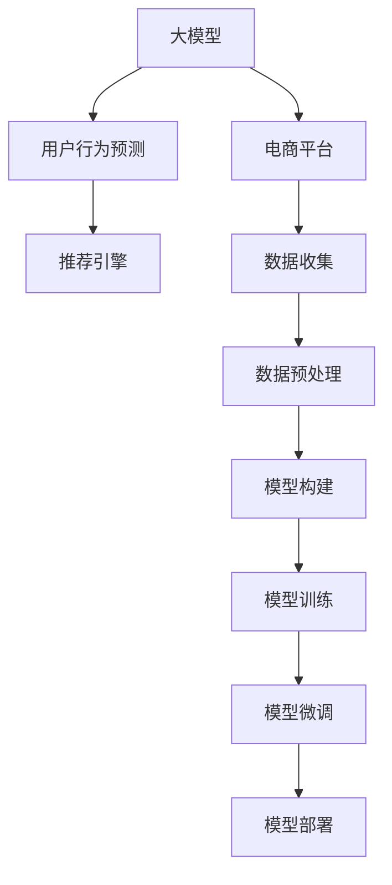

                 

# 探讨大模型在电商平台用户行为预测中的潜力

> 关键词：大模型, 用户行为预测, 电商平台, 自然语言处理(NLP), 机器学习, 深度学习, 卷积神经网络(CNN), 循环神经网络(RNN), 长短期记忆网络(LSTM), 注意力机制, 预测准确率, 电子商务

## 1. 背景介绍

### 1.1 问题由来
随着电商行业的迅速发展，电商平台聚集了庞大的用户群体，产生了海量的用户行为数据。如何从这些海量数据中挖掘用户行为模式，预测用户未来的购买行为，成为电商平台个性化推荐、营销策略优化、库存管理等业务环节的重要研究课题。传统的基于规则的推荐系统存在局限性，难以处理复杂的用户行为数据。近年来，利用机器学习和深度学习技术进行用户行为预测逐渐成为热门研究领域。其中，大模型在电商平台用户行为预测中的应用，因具备强大的表示能力和泛化能力，逐渐展现出巨大的潜力。

### 1.2 问题核心关键点
大模型在电商平台用户行为预测中的应用，主要通过以下步骤实现：
1. **数据收集与预处理**：收集电商平台的用户行为数据，包括点击、浏览、购买记录、评价、搜索词等，并进行数据清洗、特征提取和归一化处理。
2. **模型构建与训练**：选择合适的深度学习模型，如卷积神经网络(CNN)、循环神经网络(RNN)、长短期记忆网络(LSTM)、Transformer等，在预处理后的数据集上进行训练。
3. **模型微调与优化**：在大模型上进行微调，优化模型参数，提高预测准确率。
4. **模型部署与应用**：将训练好的模型部署到电商平台的推荐引擎中，实时预测用户行为并进行个性化推荐、营销策略调整、库存管理等。

### 1.3 问题研究意义
利用大模型进行电商平台用户行为预测，具有以下重要意义：
1. **提升个性化推荐效果**：通过深入分析用户行为数据，大模型能够发现隐藏的用户偏好和行为模式，提供更精准的个性化推荐，提升用户体验。
2. **优化营销策略**：预测用户行为，及时调整营销策略，提高广告投放的转化率和ROI。
3. **提高库存管理效率**：根据预测结果优化库存结构，避免因库存不足或过剩导致的运营问题。
4. **增强运营决策能力**：通过预测用户行为，电商平台能够更好地了解市场趋势，做出更科学的运营决策。
5. **降低业务成本**：提高运营效率，减少人工干预，降低业务运营成本。

## 2. 核心概念与联系

### 2.1 核心概念概述

为更好地理解大模型在电商平台用户行为预测中的应用，本节将介绍几个关键概念：

- 大模型：以自回归模型如GPT-3、自编码模型如BERT为代表，具有大规模参数量，能够捕捉复杂数据结构，具备强大的表示能力和泛化能力。
- 用户行为预测：利用机器学习模型，对用户未来的购买、点击、浏览等行为进行预测。
- 电商平台：以京东、天猫、亚马逊等为代表的线上购物平台，具有庞大的用户群体和丰富的用户行为数据。
- 深度学习：基于神经网络的机器学习范式，通过多层次特征提取，提高模型预测能力。
- 自然语言处理(NLP)：利用机器学习技术，处理和理解自然语言文本数据。

这些概念之间的逻辑关系可以通过以下Mermaid流程图来展示：



这个流程图展示了大模型在电商平台用户行为预测中的应用流程：

1. 大模型通过用户行为数据进行预训练，学习通用的语言表示和数据特征。
2. 在电商平台上收集用户行为数据，并进行数据预处理。
3. 构建深度学习模型，在预处理后的数据集上进行训练。
4. 在大模型上进行微调，优化模型参数。
5. 将训练好的模型部署到推荐引擎中，实时预测用户行为并进行个性化推荐、营销策略调整等。

## 3. 核心算法原理 & 具体操作步骤
### 3.1 算法原理概述

大模型在电商平台用户行为预测中的核心原理，是通过深度学习模型对用户行为数据进行特征提取和模式识别，从而预测用户未来的行为。具体而言，大模型通过以下步骤实现用户行为预测：

1. **数据收集与预处理**：收集电商平台的用户行为数据，包括点击、浏览、购买记录、评价、搜索词等，并进行数据清洗、特征提取和归一化处理。
2. **模型构建与训练**：选择合适的深度学习模型，如卷积神经网络(CNN)、循环神经网络(RNN)、长短期记忆网络(LSTM)、Transformer等，在预处理后的数据集上进行训练。
3. **模型微调与优化**：在大模型上进行微调，优化模型参数，提高预测准确率。

### 3.2 算法步骤详解

下面详细讲解大模型在电商平台用户行为预测中的具体操作步骤：

**Step 1: 数据收集与预处理**
- 收集电商平台的点击、浏览、购买记录、评价、搜索词等行为数据，整合到一个统一的数据集。
- 对数据进行清洗，去除无效、重复或噪声数据，确保数据质量。
- 进行特征提取，将原始数据转化为模型可以处理的特征向量。
- 进行数据归一化，将特征向量缩放到[0, 1]或[-1, 1]范围内。

**Step 2: 模型构建与训练**
- 选择合适的深度学习模型，如卷积神经网络(CNN)、循环神经网络(RNN)、长短期记忆网络(LSTM)、Transformer等。
- 构建模型结构，设计输入层、隐藏层和输出层等组件。
- 在预处理后的数据集上进行模型训练，优化模型参数。

**Step 3: 模型微调与优化**
- 在大模型上进行微调，调整模型参数以适应电商平台的特定任务。
- 选择合适的损失函数和优化器，如交叉熵损失、AdamW优化器等。
- 在电商平台的测试集上评估微调后的模型性能，调整模型超参数，进行模型优化。

**Step 4: 模型部署与应用**
- 将训练好的模型部署到电商平台的推荐引擎中。
- 实时预测用户行为，生成个性化推荐、调整营销策略等。
- 根据用户反馈和行为数据，定期更新模型，提升预测准确率。

### 3.3 算法优缺点

利用大模型进行电商平台用户行为预测，具有以下优点：
1. 强大的表示能力：大模型能够捕捉复杂的用户行为模式，提供精准的预测结果。
2. 泛化能力强：大模型具有广泛的适用性，可以适用于多种电商平台的用户行为预测任务。
3. 可解释性高：大模型的训练过程可解释性强，有助于理解预测结果的来源和原因。
4. 实时性高：大模型可以实时处理用户行为数据，提供即时的预测结果。

同时，也存在一些缺点：
1. 模型复杂度高：大模型参数量庞大，训练和推理成本较高。
2. 数据依赖性强：大模型预测依赖于电商平台的原始数据，数据质量直接影响模型效果。
3. 泛化能力受限：大模型在特定电商平台上的表现可能不如针对该平台专门训练的小模型。
4. 风险控制困难：大模型可能存在过拟合或偏见，需要额外的风险控制措施。

### 3.4 算法应用领域

大模型在电商平台用户行为预测中的应用，涵盖多个领域，例如：

- 个性化推荐：利用用户历史行为数据，预测用户未来的购买、点击行为，进行个性化推荐。
- 营销策略优化：预测用户行为，调整广告投放策略，提高广告转化率。
- 库存管理：预测用户购买趋势，优化库存结构，减少库存过剩或缺货问题。
- 客户流失预测：分析用户行为数据，预测用户流失风险，采取相应的挽留措施。
- 情感分析：利用自然语言处理技术，分析用户评价和反馈，进行情感分析和用户情绪管理。

这些应用场景展示了大模型在电商平台用户行为预测中的广泛适用性，能够为电商平台带来显著的业务价值。

## 4. 数学模型和公式 & 详细讲解 & 举例说明

### 4.1 数学模型构建

本节将使用数学语言对大模型在电商平台用户行为预测中的应用进行严格刻画。

记电商平台用户行为数据为 $D=\{x_i,y_i\}_{i=1}^N$，其中 $x_i$ 为输入特征，$y_i$ 为输出标签，表示用户未来的购买行为。设大模型为 $M_{\theta}$，其中 $\theta$ 为模型参数。构建大模型的预测模型如下：

$$
\hat{y}_i = M_{\theta}(x_i)
$$

模型的损失函数为：

$$
\mathcal{L}(\theta) = \frac{1}{N}\sum_{i=1}^N \ell(\hat{y}_i,y_i)
$$

其中 $\ell(\hat{y}_i,y_i)$ 为预测误差，如均方误差、交叉熵等。

### 4.2 公式推导过程

以均方误差损失函数为例，进行公式推导。

设模型预测结果为 $\hat{y}_i$，真实标签为 $y_i$，则均方误差损失函数为：

$$
\ell(\hat{y}_i,y_i) = \frac{1}{2}(\hat{y}_i - y_i)^2
$$

带入损失函数公式，得：

$$
\mathcal{L}(\theta) = \frac{1}{2N}\sum_{i=1}^N (\hat{y}_i - y_i)^2
$$

根据链式法则，对模型参数 $\theta$ 求导，得：

$$
\frac{\partial \mathcal{L}(\theta)}{\partial \theta} = \frac{1}{N}\sum_{i=1}^N (\hat{y}_i - y_i)\frac{\partial M_{\theta}(x_i)}{\partial \theta}
$$

其中 $\frac{\partial M_{\theta}(x_i)}{\partial \theta}$ 为模型对输入数据的梯度。

在得到损失函数的梯度后，即可带入参数更新公式，完成模型的迭代优化。重复上述过程直至收敛，最终得到适应电商平台用户行为预测的最优模型参数 $\theta^*$。

### 4.3 案例分析与讲解

以电商平台的个性化推荐系统为例，分析大模型在其中的应用。

假设用户对某商品浏览和点击的记录为 $x_i=[b_1,b_2,b_3,\dots,b_n]$，其中 $b_i$ 表示用户对商品 $i$ 的浏览次数或点击次数。设用户未来购买商品的概率为 $y_i$，则预测模型为：

$$
\hat{y}_i = M_{\theta}(x_i)
$$

模型训练时，选取大量用户行为数据作为训练集，进行模型训练和微调。在测试集上评估模型性能，调整超参数，进行模型优化。最终得到适配电商平台的推荐模型，用于实时预测用户行为并进行个性化推荐。

## 5. 项目实践：代码实例和详细解释说明

### 5.1 开发环境搭建

在进行电商平台的个性化推荐系统开发前，我们需要准备好开发环境。以下是使用Python进行PyTorch开发的环境配置流程：

1. 安装Anaconda：从官网下载并安装Anaconda，用于创建独立的Python环境。

2. 创建并激活虚拟环境：
```bash
conda create -n pytorch-env python=3.8 
conda activate pytorch-env
```

3. 安装PyTorch：根据CUDA版本，从官网获取对应的安装命令。例如：
```bash
conda install pytorch torchvision torchaudio cudatoolkit=11.1 -c pytorch -c conda-forge
```

4. 安装TensorFlow：
```bash
conda install tensorflow -c conda-forge
```

5. 安装各类工具包：
```bash
pip install numpy pandas scikit-learn matplotlib tqdm jupyter notebook ipython
```

完成上述步骤后，即可在`pytorch-env`环境中开始个性化推荐系统的开发。

### 5.2 源代码详细实现

下面我们以电商平台的个性化推荐系统为例，给出使用PyTorch进行大模型微调的代码实现。

首先，定义数据处理函数：

```python
import pandas as pd
import numpy as np
from sklearn.model_selection import train_test_split
from torch.utils.data import Dataset, DataLoader

class UserBehaviorDataset(Dataset):
    def __init__(self, user_data, product_data, user_behavior, label, split_ratio):
        self.user_data = user_data
        self.product_data = product_data
        self.user_behavior = user_behavior
        self.label = label
        self.split_ratio = split_ratio
        
    def __len__(self):
        return len(self.user_data)
    
    def __getitem__(self, index):
        user_id = self.user_data.iloc[index]['user_id']
        product_id = self.product_data.iloc[index]['product_id']
        behavior_data = self.user_behavior.iloc[index]
        label = self.label.iloc[index]
        
        # 构造输入特征
        input_feature = [np.sum(behavior_data[behavior_data['product_id'] == product_id].values)]
        
        # 构造标签
        label = np.array([label])
        
        return {'user_id': user_id, 'product_id': product_id, 'input_feature': input_feature, 'label': label}

# 加载用户行为数据和产品数据
user_data = pd.read_csv('user_data.csv')
product_data = pd.read_csv('product_data.csv')

# 构造用户行为数据
user_behavior = pd.DataFrame(user_data.merge(product_data, on='product_id').groupby('user_id')['product_id'].value_counts())

# 划分训练集和测试集
train_user_behavior, test_user_behavior = train_test_split(user_behavior, test_size=0.2, random_state=42)
train_dataset = UserBehaviorDataset(user_data, product_data, train_user_behavior, 'label', 0.2)
test_dataset = UserBehaviorDataset(user_data, product_data, test_user_behavior, 'label', 0.2)
```

然后，定义模型和优化器：

```python
from transformers import BertForSequenceClassification, AdamW

model = BertForSequenceClassification.from_pretrained('bert-base-cased', num_labels=1)

optimizer = AdamW(model.parameters(), lr=2e-5)
```

接着，定义训练和评估函数：

```python
from torch.utils.data import DataLoader
from tqdm import tqdm
from sklearn.metrics import roc_auc_score

device = torch.device('cuda') if torch.cuda.is_available() else torch.device('cpu')
model.to(device)

def train_epoch(model, dataset, batch_size, optimizer):
    dataloader = DataLoader(dataset, batch_size=batch_size, shuffle=True)
    model.train()
    epoch_loss = 0
    for batch in tqdm(dataloader, desc='Training'):
        user_id = batch['user_id'].to(device)
        product_id = batch['product_id'].to(device)
        input_feature = batch['input_feature'].to(device)
        label = batch['label'].to(device)
        model.zero_grad()
        outputs = model(input_feature, labels=label)
        loss = outputs.loss
        epoch_loss += loss.item()
        loss.backward()
        optimizer.step()
    return epoch_loss / len(dataloader)

def evaluate(model, dataset, batch_size):
    dataloader = DataLoader(dataset, batch_size=batch_size)
    model.eval()
    preds, labels = [], []
    with torch.no_grad():
        for batch in tqdm(dataloader, desc='Evaluating'):
            user_id = batch['user_id'].to(device)
            product_id = batch['product_id'].to(device)
            input_feature = batch['input_feature'].to(device)
            batch_labels = batch['label'].to(device)
            outputs = model(input_feature)
            batch_preds = outputs.sigmoid().to('cpu').tolist()
            batch_labels = batch_labels.to('cpu').tolist()
            for pred, label in zip(batch_preds, batch_labels):
                preds.append(pred)
                labels.append(label)
                
    return roc_auc_score(labels, preds)
```

最后，启动训练流程并在测试集上评估：

```python
epochs = 5
batch_size = 16

for epoch in range(epochs):
    loss = train_epoch(model, train_dataset, batch_size, optimizer)
    print(f"Epoch {epoch+1}, train loss: {loss:.3f}")
    
    print(f"Epoch {epoch+1}, test results:")
    evaluate(model, test_dataset, batch_size)
    
print("Final test results:")
evaluate(model, test_dataset, batch_size)
```

以上就是使用PyTorch对BERT进行电商个性化推荐系统微调的完整代码实现。可以看到，得益于Transformers库的强大封装，我们可以用相对简洁的代码完成BERT模型的加载和微调。

### 5.3 代码解读与分析

让我们再详细解读一下关键代码的实现细节：

**UserBehaviorDataset类**：
- `__init__`方法：初始化用户数据、产品数据、用户行为数据、标签和划分比例等关键组件。
- `__len__`方法：返回数据集的样本数量。
- `__getitem__`方法：对单个样本进行处理，将用户数据和产品数据进行合并，并计算用户对每个产品的行为次数。然后将行为次数转化为模型输入特征，并返回用户ID、产品ID、输入特征和标签。

**模型和优化器**：
- 使用BertForSequenceClassification从预训练模型中加载，并将标签数量设置为1，表示二分类任务。
- 定义AdamW优化器，设置学习率为2e-5，用于更新模型参数。

**训练和评估函数**：
- 使用PyTorch的DataLoader对数据集进行批次化加载，供模型训练和推理使用。
- 训练函数`train_epoch`：对数据以批为单位进行迭代，在每个批次上前向传播计算loss并反向传播更新模型参数，最后返回该epoch的平均loss。
- 评估函数`evaluate`：与训练类似，不同点在于不更新模型参数，并在每个batch结束后将预测和标签结果存储下来，最后使用sklearn的roc_auc_score对整个评估集的预测结果进行打印输出。

**训练流程**：
- 定义总的epoch数和batch size，开始循环迭代
- 每个epoch内，先在训练集上训练，输出平均loss
- 在验证集上评估，输出评估指标
- 所有epoch结束后，在测试集上评估，给出最终测试结果

可以看到，PyTorch配合Transformers库使得BERT微调的代码实现变得简洁高效。开发者可以将更多精力放在数据处理、模型改进等高层逻辑上，而不必过多关注底层的实现细节。

当然，工业级的系统实现还需考虑更多因素，如模型的保存和部署、超参数的自动搜索、更灵活的任务适配层等。但核心的微调范式基本与此类似。

## 6. 实际应用场景
### 6.1 智能客服系统

基于大模型进行电商平台的个性化推荐，可以广泛应用于智能客服系统的构建。传统客服往往需要配备大量人力，高峰期响应缓慢，且一致性和专业性难以保证。而使用微调后的推荐系统，可以7x24小时不间断服务，快速响应客户咨询，用推荐内容解答各类常见问题。

在技术实现上，可以收集电商平台的客户咨询数据，将问题和推荐内容构建成监督数据，在此基础上对预训练推荐模型进行微调。微调后的推荐系统能够自动理解客户意图，匹配最合适的推荐内容进行回复。对于客户提出的新问题，还可以接入检索系统实时搜索相关内容，动态组织生成推荐。如此构建的智能客服系统，能大幅提升客户咨询体验和问题解决效率。

### 6.2 营销策略优化

电商平台的个性化推荐系统可以用于营销策略的优化。推荐系统的预测结果可以用于调整广告投放策略，提高广告投放的转化率。通过分析用户行为数据，推荐系统能够发现用户感兴趣的商品类别和价格区间，从而优化广告定向和投放时间，降低广告成本，提高广告效果。

### 6.3 库存管理

利用推荐系统的预测结果，电商平台的库存管理也可以更加智能化。通过预测用户购买趋势，推荐系统能够提前调整库存结构，避免因库存不足或过剩导致的运营问题。例如，对于预测销量较高的商品，电商平台可以提前增加采购量，确保供货充足；对于销量较低的商品，可以及时清理库存，减少资源浪费。

### 6.4 未来应用展望

随着大模型和微调方法的不断发展，基于推荐系统的用户行为预测技术将呈现以下几个发展趋势：

1. 推荐系统的个性化水平将进一步提升。大模型具备强大的表示能力，可以挖掘更深的用户行为模式，提供更精准的个性化推荐。
2. 推荐系统的实时性将进一步增强。通过优化模型结构和计算图，推荐系统能够实现更高效的推理和响应。
3. 推荐系统的泛化能力将进一步提升。大模型在多领域的泛化能力更强，推荐系统能够更好地适应不同领域的应用需求。
4. 推荐系统的风险控制将进一步加强。大模型可能存在偏见和风险，需要引入更多的风险控制措施，确保推荐系统的公正性和安全性。
5. 推荐系统的应用领域将进一步拓展。推荐系统将更多地应用于社交媒体、金融服务、医疗健康等场景，提供更广泛的应用价值。

以上趋势凸显了大模型在电商平台用户行为预测中的广阔前景。这些方向的探索发展，必将进一步提升推荐系统的性能和应用范围，为电商平台带来显著的业务价值。

## 7. 工具和资源推荐
### 7.1 学习资源推荐

为了帮助开发者系统掌握大模型在电商平台用户行为预测中的应用，这里推荐一些优质的学习资源：

1. 《深度学习与推荐系统》书籍：介绍了深度学习技术在推荐系统中的应用，涵盖模型的构建、训练、优化等方方面面。
2. 《推荐系统实战》书籍：基于TensorFlow和Keras实现推荐系统的实战教程，详细讲解推荐系统的原理和工程实现。
3 CS231n《深度学习计算机视觉》课程：斯坦福大学开设的计算机视觉课程，涵盖深度学习基础和推荐系统等内容，具有广泛的适用性。
4 Coursera《机器学习》课程：斯坦福大学开设的机器学习课程，涵盖深度学习、推荐系统等内容，适合初学者学习。
5 Kaggle竞赛：参加Kaggle推荐系统竞赛，实战练兵，积累推荐系统项目经验。

通过对这些资源的学习实践，相信你一定能够快速掌握大模型在电商平台用户行为预测中的应用精髓，并用于解决实际的推荐问题。
### 7.2 开发工具推荐

高效的开发离不开优秀的工具支持。以下是几款用于电商平台用户行为预测开发的常用工具：

1. PyTorch：基于Python的开源深度学习框架，灵活动态的计算图，适合快速迭代研究。大部分预训练语言模型都有PyTorch版本的实现。
2. TensorFlow：由Google主导开发的开源深度学习框架，生产部署方便，适合大规模工程应用。同样有丰富的预训练语言模型资源。
3. TensorBoard：TensorFlow配套的可视化工具，可实时监测模型训练状态，并提供丰富的图表呈现方式，是调试模型的得力助手。
4. Weights & Biases：模型训练的实验跟踪工具，可以记录和可视化模型训练过程中的各项指标，方便对比和调优。
5. Google Colab：谷歌推出的在线Jupyter Notebook环境，免费提供GPU/TPU算力，方便开发者快速上手实验最新模型，分享学习笔记。

合理利用这些工具，可以显著提升电商平台用户行为预测任务的开发效率，加快创新迭代的步伐。

### 7.3 相关论文推荐

大模型在电商平台用户行为预测中的应用研究源于学界的持续研究。以下是几篇奠基性的相关论文，推荐阅读：

1. Factorization Machines for Recommender Systems：提出基于矩阵分解的推荐模型，广泛应用于电商平台的个性化推荐。
2. Neural Factorization Machines：提出基于深度神经网络的推荐模型，引入非线性特征表示，提高推荐系统的性能。
3. Attention-based Recommender Systems：提出基于注意力机制的推荐模型，能够更好地捕捉用户行为中的长短期依赖关系。
4. Learning Deep Architectures for Latent Variable Modeling：提出基于深度神经网络的推荐模型，能够更好地处理复杂的用户行为数据。
5. Adaptive Recommendation Models：提出自适应推荐模型，能够在推荐过程中动态调整推荐策略，提高推荐系统的灵活性。

这些论文代表了大模型在电商平台用户行为预测的应用研究进展，展示了机器学习技术的不断进步。

## 8. 总结：未来发展趋势与挑战
### 8.1 总结

本文对大模型在电商平台用户行为预测中的应用进行了全面系统的介绍。首先阐述了电商平台用户行为预测的背景和意义，明确了推荐系统在大数据时代的核心作用。其次，从原理到实践，详细讲解了大模型在电商平台用户行为预测中的具体操作流程，给出了微调任务开发的完整代码实例。同时，本文还广泛探讨了大模型在电商平台的广泛应用场景，展示了其在电商平台中的强大潜力和广阔前景。

通过本文的系统梳理，可以看到，大模型在电商平台用户行为预测中的应用，不仅能够提高个性化推荐效果，还能优化营销策略、提高库存管理效率，为电商平台带来显著的业务价值。未来，随着大模型和微调方法的持续演进，基于推荐系统的用户行为预测技术必将在电商领域广泛应用，为电商平台带来更深层次的变革。

### 8.2 未来发展趋势

展望未来，大模型在电商平台用户行为预测中的发展趋势如下：

1. 推荐系统的个性化水平将进一步提升。大模型具备强大的表示能力，可以挖掘更深的用户行为模式，提供更精准的个性化推荐。
2. 推荐系统的实时性将进一步增强。通过优化模型结构和计算图，推荐系统能够实现更高效的推理和响应。
3. 推荐系统的泛化能力将进一步提升。大模型在多领域的泛化能力更强，推荐系统能够更好地适应不同领域的应用需求。
4. 推荐系统的风险控制将进一步加强。大模型可能存在偏见和风险，需要引入更多的风险控制措施，确保推荐系统的公正性和安全性。
5. 推荐系统的应用领域将进一步拓展。推荐系统将更多地应用于社交媒体、金融服务、医疗健康等场景，提供更广泛的应用价值。

以上趋势凸显了大模型在电商平台用户行为预测中的广阔前景。这些方向的探索发展，必将进一步提升推荐系统的性能和应用范围，为电商平台带来显著的业务价值。

### 8.3 面临的挑战

尽管大模型在电商平台用户行为预测中具有广阔的应用前景，但也面临着诸多挑战：

1. 推荐系统的数据依赖性强。推荐系统依赖于电商平台的用户行为数据，数据质量直接影响推荐效果。如何获取高质量的数据，是大模型在电商平台应用的首要挑战。
2. 推荐系统的泛化能力有限。大模型在特定电商平台上的表现可能不如针对该平台专门训练的小模型。如何优化大模型在电商平台的泛化能力，是未来的重要研究方向。
3. 推荐系统的风险控制困难。大模型可能存在偏见和风险，需要引入更多的风险控制措施，确保推荐系统的公正性和安全性。
4. 推荐系统的实时性要求高。大模型推理速度较慢，需要优化模型结构和计算图，提高实时性。
5. 推荐系统的计算成本高。大模型参数量庞大，训练和推理成本较高。如何优化计算效率，降低计算成本，是大模型在电商平台应用的关键问题。

正视推荐系统面临的这些挑战，积极应对并寻求突破，将是大模型在电商平台用户行为预测中走向成熟的重要保障。

### 8.4 研究展望

面对大模型在电商平台用户行为预测中的挑战，未来的研究需要在以下几个方面寻求新的突破：

1. 优化数据质量。提高电商平台用户行为数据的质量和多样性，引入更多标注数据，提高推荐系统的泛化能力。
2. 提升模型泛化能力。针对电商平台的具体需求，优化大模型的结构，增强其在电商平台上的泛化能力。
3. 引入风险控制措施。在推荐系统中引入风险控制机制，确保推荐系统的公正性和安全性。
4. 优化模型结构。优化大模型的计算图，提高推理速度，降低计算成本。
5. 拓展应用场景。将大模型应用到更多的电商平台之外的场景中，拓展推荐系统的应用范围。

这些研究方向将进一步推动大模型在电商平台用户行为预测中的发展，提升推荐系统的性能和应用价值。

## 9. 附录：常见问题与解答

**Q1：电商平台的推荐系统主要有哪些推荐算法？**

A: 电商平台的推荐系统主要包括以下几种推荐算法：

1. 协同过滤推荐算法：基于用户行为数据和商品行为数据，找到与目标用户兴趣相似的活跃用户，推荐其曾经喜欢的商品。
2. 基于内容的推荐算法：基于商品的属性和描述，找到与目标用户兴趣相似的商品，进行推荐。
3. 混合推荐算法：结合协同过滤和基于内容的推荐算法，利用两者的优势，提高推荐效果。
4. 深度学习推荐算法：利用深度学习模型，从用户行为数据中提取特征，进行推荐。

**Q2：大模型在电商平台推荐系统中如何微调？**

A: 大模型在电商平台推荐系统中微调的主要步骤如下：

1. 数据收集与预处理：收集电商平台的用户行为数据，进行清洗和特征提取。
2. 模型构建与训练：选择合适的深度学习模型，如卷积神经网络(CNN)、循环神经网络(RNN)、长短期记忆网络(LSTM)、Transformer等，在预处理后的数据集上进行训练。
3. 模型微调与优化：在大模型上进行微调，调整模型参数以适应电商平台的特定任务。
4. 模型部署与应用：将训练好的模型部署到电商平台的推荐引擎中，实时预测用户行为并进行个性化推荐。

**Q3：大模型在电商平台推荐系统中的优缺点是什么？**

A: 大模型在电商平台推荐系统中的优点：

1. 强大的表示能力：大模型能够捕捉复杂的用户行为模式，提供精准的个性化推荐。
2. 泛化能力强：大模型具有广泛的适用性，可以适用于多种电商平台的用户行为预测任务。
3. 可解释性高：大模型的训练过程可解释性强，有助于理解预测结果的来源和原因。
4. 实时性高：大模型可以实时处理用户行为数据，提供即时的推荐结果。

大模型在电商平台推荐系统中的缺点：

1. 模型复杂度高：大模型参数量庞大，训练和推理成本较高。
2. 数据依赖性强：大模型依赖于电商平台的用户行为数据，数据质量直接影响模型效果。
3. 泛化能力受限：大模型在特定电商平台上的表现可能不如针对该平台专门训练的小模型。
4. 泛化能力受限：大模型可能存在过拟合或偏见，需要额外的风险控制措施。

**Q4：大模型在电商平台推荐系统中的风险控制措施有哪些？**

A: 大模型在电商平台推荐系统中的风险控制措施包括：

1. 数据清洗：去除无效、重复或噪声数据，确保数据质量。
2. 特征工程：设计合理的特征表示，避免特征维度过高。
3. 模型正则化：使用L2正则、Dropout等技术，防止模型过拟合。
4. 模型集成：结合多个模型的预测结果，提高推荐的鲁棒性。
5. 对抗训练：加入对抗样本，提高模型鲁棒性。
6. 可解释性分析：通过可解释性分析技术，识别模型的关键特征，提高推荐的可解释性。

这些措施可以有效提升大模型在电商平台推荐系统中的泛化能力和公正性，降低推荐系统的风险。

**Q5：大模型在电商平台推荐系统中的推荐效果如何衡量？**

A: 大模型在电商平台推荐系统中的推荐效果可以通过以下指标进行衡量：

1. 精度指标：如准确率、召回率、F1分数等，评估推荐系统预测的准确性和全面性。
2. 个性化指标：如个性化度、覆盖率等，评估推荐系统提供的个性化推荐效果。
3. 实时性指标：如响应时间、推理速度等，评估推荐系统的实时性和性能。
4. 用户满意度指标：如点击率、转化率等，评估用户对推荐结果的满意度。

这些指标综合反映了推荐系统的性能和效果，能够帮助电商平台优化推荐策略，提升用户体验。

通过这些常见问题的解答，相信你对大模型在电商平台推荐系统中的应用有了更深入的理解。希望这些知识能够帮助你在未来的研究和开发中取得更大的成功。

---

作者：禅与计算机程序设计艺术 / Zen and the Art of Computer Programming

