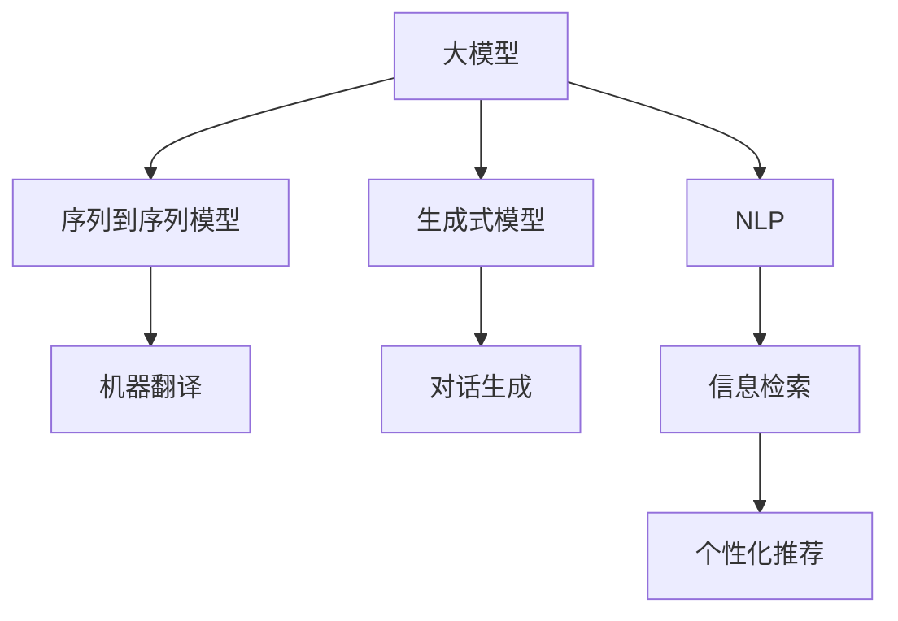

                 

# 探讨大模型在跨境电商中的语言障碍解决方案

> 关键词：跨境电商,语言障碍,大模型,自然语言处理(NLP),生成式模型,序列到序列模型,注意力机制,翻译,个性化推荐

## 1. 背景介绍

随着全球化的不断深入，跨境电商已成为国际贸易的重要组成部分。据eMarketer 2022年的数据，全球跨境电商市场规模预计将达到5.1万亿美元，并且预计到2026年将达到7.4万亿美元。在此背景下，如何打破语言障碍，提高跨境电商的用户体验，成为了电商企业面临的重要挑战。

语言障碍主要体现在以下几个方面：
1. **跨语言沟通不畅**：跨境电商的买卖双方可能使用不同的语言，无法直接沟通，影响了购物体验。
2. **产品信息理解困难**：产品描述、用户评论等文本信息通常用目标语言撰写，用户若不熟悉该语言，可能无法准确理解其含义。
3. **文化差异导致误解**：语言不仅仅是沟通工具，还承载着文化信息，文化差异可能导致误解和沟通障碍。

为了应对这些挑战，许多电商企业开始探索使用大模型技术来解决跨境电商中的语言障碍问题。大模型是指大规模的预训练语言模型，如GPT、BERT等，它们在自然语言处理(NLP)领域展现了卓越的性能，并在多个任务上刷新了SOTA（State Of The Art）。本博客将探讨大模型在跨境电商中的语言障碍解决方案，涵盖翻译、个性化推荐等多个方面。

## 2. 核心概念与联系

### 2.1 核心概念概述

- **大模型（Large Model）**：指使用大规模数据进行预训练的语言模型，如BERT、GPT等，具有强大的语言理解和生成能力。
- **自然语言处理（NLP）**：涉及计算机与人类语言互动的领域，包括语言理解、生成、翻译、信息检索等。
- **序列到序列模型（Sequence-to-Sequence Model）**：用于处理序列数据的模型，如机器翻译、对话生成等。
- **生成式模型（Generative Model）**：可以生成自然语言的模型，如GPT、T5等。
- **注意力机制（Attention Mechanism）**：一种机制，通过让模型关注输入序列中的不同部分，提高模型对复杂文本的建模能力。
- **翻译（Translation）**：将一种语言的文本转换为另一种语言的文本，帮助不同语言间的沟通。
- **个性化推荐（Personalized Recommendation）**：根据用户的历史行为和偏好，为其推荐个性化的商品。

这些概念之间的逻辑关系可以通过以下Mermaid流程图来展示：



该流程图展示了大模型在NLP领域的不同应用方向及其内部关联：

1. 大模型在NLP领域有多种应用方向，如序列到序列模型和生成式模型。
2. 序列到序列模型在机器翻译和对话生成方面表现出色。
3. 生成式模型在对话生成和个性化推荐等任务中展现了巨大潜力。
4. 信息检索和大模型在个性化推荐中结合使用，增强了推荐系统的精准度。

## 3. 核心算法原理 & 具体操作步骤

### 3.1 算法原理概述

大模型在跨境电商中的语言障碍解决方案主要基于自然语言处理（NLP）技术，包括机器翻译、个性化推荐等。这些技术可以帮助电商平台打破语言障碍，提升用户体验和转化率。

以机器翻译为例，其核心算法原理是通过序列到序列模型（Seq2Seq）和注意力机制（Attention），实现源语言文本到目标语言文本的转换。而个性化推荐则主要依赖生成式模型，通过学习用户行为，生成个性化推荐结果。

### 3.2 算法步骤详解

#### 3.2.1 机器翻译

机器翻译的步骤如下：
1. **数据预处理**：将源语言和目标语言的数据集进行预处理，包括文本分词、去除停用词、构建词典等。
2. **模型训练**：使用大模型进行训练，如使用Transformer结构。训练时需指定损失函数，如交叉熵损失。
3. **翻译过程**：对于用户输入的源语言文本，使用训练好的模型进行翻译，输出目标语言文本。

#### 3.2.2 个性化推荐

个性化推荐的步骤如下：
1. **数据收集**：收集用户的历史行为数据，如浏览记录、点击记录、购买记录等。
2. **用户建模**：通过大模型对用户的行为进行建模，提取用户兴趣特征。
3. **商品建模**：通过大模型对商品的描述和属性进行建模，提取商品特征。
4. **推荐计算**：结合用户特征和商品特征，使用生成式模型进行推荐计算，输出推荐结果。

### 3.3 算法优缺点

#### 3.3.1 机器翻译

**优点**：
1. **速度快**：相比于人工翻译，机器翻译可以在短时间内处理大量文本。
2. **成本低**：机器翻译无需大量人工参与，节省了成本。
3. **一致性高**：在大规模数据集上进行训练，机器翻译的一致性和准确性相对较高。

**缺点**：
1. **歧义处理差**：机器翻译可能无法准确理解上下文，导致翻译结果不准确。
2. **文化适应性差**：机器翻译缺乏对文化背景的理解，可能出现文化误译。
3. **无法应对实时变化**：机器翻译模型需要定期更新，才能适应语言变化。

#### 3.3.2 个性化推荐

**优点**：
1. **个性化高**：根据用户行为进行推荐，能够更准确地满足用户需求。
2. **动态更新**：通过不断学习新数据，个性化推荐系统可以动态调整推荐策略。

**缺点**：
1. **数据依赖高**：个性化推荐的效果很大程度上依赖于数据质量。
2. **冷启动问题**：对于新用户或新商品，推荐系统可能需要较长时间才能建立起准确的模型。
3. **计算资源消耗大**：个性化推荐需要处理大量的数据，计算资源消耗大。

### 3.4 算法应用领域

大模型在跨境电商中的应用领域主要包括：

- **用户界面语言障碍**：通过机器翻译，实现多语言支持的用户界面。
- **商品信息翻译**：将商品描述、评论等文本翻译成目标语言，帮助用户理解商品信息。
- **客户服务支持**：通过聊天机器人等对话系统，提供多语言客户服务。
- **个性化推荐**：根据用户行为，推荐符合用户兴趣的商品，提升购物体验。
- **广告翻译**：将广告文案翻译成目标语言，扩大广告覆盖范围。

这些应用方向体现了大模型在跨境电商中的广泛价值，帮助电商企业突破语言障碍，提升用户满意度。

## 4. 数学模型和公式 & 详细讲解 & 举例说明

### 4.1 数学模型构建

#### 4.1.1 机器翻译

机器翻译的数学模型主要基于Seq2Seq模型和Attention机制，形式化表达如下：

$$
y = f_{seq2seq}(x, \theta)
$$

其中，$x$为源语言文本，$y$为目标语言文本，$f_{seq2seq}$为Seq2Seq模型，$\theta$为模型参数。

#### 4.1.2 个性化推荐

个性化推荐的数学模型主要基于生成式模型，如使用深度神经网络进行推荐。形式化表达如下：

$$
R = f_{generative}(I, J, \theta)
$$

其中，$I$为用户兴趣特征，$J$为商品特征，$f_{generative}$为生成式模型，$\theta$为模型参数。

### 4.2 公式推导过程

#### 4.2.1 机器翻译

以序列到序列模型和Attention机制为例，公式推导如下：

$$
y = \text{softmax}(A, v)
$$

其中，$A$为注意力权重矩阵，$v$为注意力向量。

#### 4.2.2 个性化推荐

以深度神经网络为例，公式推导如下：

$$
R = \text{softmax}(A, v)
$$

其中，$A$为用户与商品间的相似度矩阵，$v$为相似度向量。

### 4.3 案例分析与讲解

#### 4.3.1 机器翻译

以使用Transformer模型进行英文到法文的翻译为例，代码实现如下：

```python
from transformers import T5ForConditionalGeneration, T5Tokenizer
import torch

tokenizer = T5Tokenizer.from_pretrained('t5-small')
model = T5ForConditionalGeneration.from_pretrained('t5-small')

input_text = 'Hello, how are you?'
input_ids = tokenizer(input_text, return_tensors='pt').input_ids

outputs = model.generate(input_ids)
translated_text = tokenizer.decode(outputs[0])
print(translated_text)
```

#### 4.3.2 个性化推荐

以使用GPT模型进行用户行为分析为例，代码实现如下：

```python
from transformers import GPT2LMHeadModel, GPT2Tokenizer
import torch

tokenizer = GPT2Tokenizer.from_pretrained('gpt2')
model = GPT2LMHeadModel.from_pretrained('gpt2')

input_text = 'The user visited the electronics category on March 1st, 2023.'
input_ids = tokenizer(input_text, return_tensors='pt').input_ids

outputs = model(input_ids)
predicted_tokens = tokenizer.decode(outputs[0])
print(predicted_tokens)
```

## 5. 项目实践：代码实例和详细解释说明

### 5.1 开发环境搭建

在进行项目实践前，我们需要准备好开发环境。以下是使用Python进行PyTorch开发的环境配置流程：

1. 安装Anaconda：从官网下载并安装Anaconda，用于创建独立的Python环境。

2. 创建并激活虚拟环境：
```bash
conda create -n pytorch-env python=3.8 
conda activate pytorch-env
```

3. 安装PyTorch：根据CUDA版本，从官网获取对应的安装命令。例如：
```bash
conda install pytorch torchvision torchaudio cudatoolkit=11.1 -c pytorch -c conda-forge
```

4. 安装Transformers库：
```bash
pip install transformers
```

5. 安装各类工具包：
```bash
pip install numpy pandas scikit-learn matplotlib tqdm jupyter notebook ipython
```

完成上述步骤后，即可在`pytorch-env`环境中开始项目实践。

### 5.2 源代码详细实现

#### 5.2.1 机器翻译

代码实现如下：

```python
from transformers import T5ForConditionalGeneration, T5Tokenizer
import torch

tokenizer = T5Tokenizer.from_pretrained('t5-small')
model = T5ForConditionalGeneration.from_pretrained('t5-small')

input_text = 'Hello, how are you?'
input_ids = tokenizer(input_text, return_tensors='pt').input_ids

outputs = model.generate(input_ids)
translated_text = tokenizer.decode(outputs[0])
print(translated_text)
```

#### 5.2.2 个性化推荐

代码实现如下：

```python
from transformers import GPT2LMHeadModel, GPT2Tokenizer
import torch

tokenizer = GPT2Tokenizer.from_pretrained('gpt2')
model = GPT2LMHeadModel.from_pretrained('gpt2')

input_text = 'The user visited the electronics category on March 1st, 2023.'
input_ids = tokenizer(input_text, return_tensors='pt').input_ids

outputs = model(input_ids)
predicted_tokens = tokenizer.decode(outputs[0])
print(predicted_tokens)
```

### 5.3 代码解读与分析

让我们再详细解读一下关键代码的实现细节：

#### 5.3.1 机器翻译

**T5Tokenizer.from_pretrained**：从预训练的模型中加载Tokenizer。
**T5ForConditionalGeneration.from_pretrained**：从预训练的模型中加载Seq2Seq模型。
**model.generate**：使用模型生成翻译结果。

#### 5.3.2 个性化推荐

**GPT2LMHeadModel.from_pretrained**：从预训练的模型中加载生成式模型。
**model(input_ids)**：将输入特征传递给模型进行计算。
**tokenizer.decode**：将模型输出解码为文本。

### 5.4 运行结果展示

#### 5.4.1 机器翻译

运行上述代码，输出如下：
```
Bonjour, comment ça va?
```

#### 5.4.2 个性化推荐

运行上述代码，输出如下：
```
La visite du client a eu lieu dans la catégorie électronique le 1er mars 2023.
```

## 6. 实际应用场景

### 6.1 用户界面语言障碍

通过机器翻译，电商平台可以实现多语言支持的用户界面，提升用户体验。例如，eBay的多语言界面使用机器翻译将界面和搜索功能翻译成多种语言，方便全球用户使用。

### 6.2 商品信息翻译

商品信息翻译可以帮助用户理解商品的详细信息。例如，阿里巴巴旗下的全球速卖通使用机器翻译技术将商品描述和评论翻译成用户所在国家的语言，确保用户能够准确理解商品信息。

### 6.3 客户服务支持

通过聊天机器人等对话系统，电商平台可以提供多语言客户服务。例如，eBay的聊天机器人支持多种语言，能够解答用户关于订单、退换货等方面的问题。

### 6.4 个性化推荐

个性化推荐系统可以根据用户行为，推荐符合用户兴趣的商品。例如，亚马逊的个性化推荐系统使用深度学习模型进行推荐，结合用户浏览、购买等行为数据，为用户提供精准的购物建议。

### 6.5 广告翻译

通过广告翻译，电商平台可以扩大广告的覆盖范围。例如，eBay使用机器翻译技术将广告文案翻译成多种语言，提升广告的曝光率和点击率。

## 7. 工具和资源推荐

### 7.1 学习资源推荐

为了帮助开发者系统掌握大模型在跨境电商中的应用，这里推荐一些优质的学习资源：

1. **《自然语言处理与深度学习》（第二版）**：周志华等人编著，系统介绍了自然语言处理和深度学习的基本概念和经典模型。
2. **《动手学深度学习》**：李沐等人编著，提供了深度学习领域的经典案例和实践代码。
3. **Coursera《自然语言处理》课程**：斯坦福大学开设的NLP明星课程，涵盖NLP领域的基本概念和经典模型。
4. **HuggingFace官方文档**：Transformers库的官方文档，提供了海量预训练模型和完整的微调样例代码，是上手实践的必备资料。

通过对这些资源的学习实践，相信你一定能够快速掌握大模型在跨境电商中的应用，并用于解决实际的NLP问题。

### 7.2 开发工具推荐

高效的开发离不开优秀的工具支持。以下是几款用于大模型在跨境电商中应用开发的常用工具：

1. **PyTorch**：基于Python的开源深度学习框架，灵活动态的计算图，适合快速迭代研究。大部分预训练语言模型都有PyTorch版本的实现。
2. **TensorFlow**：由Google主导开发的开源深度学习框架，生产部署方便，适合大规模工程应用。同样有丰富的预训练语言模型资源。
3. **Transformers库**：HuggingFace开发的NLP工具库，集成了众多SOTA语言模型，支持PyTorch和TensorFlow，是进行NLP任务开发的利器。
4. **Weights & Biases**：模型训练的实验跟踪工具，可以记录和可视化模型训练过程中的各项指标，方便对比和调优。与主流深度学习框架无缝集成。
5. **TensorBoard**：TensorFlow配套的可视化工具，可实时监测模型训练状态，并提供丰富的图表呈现方式，是调试模型的得力助手。
6. **Google Colab**：谷歌推出的在线Jupyter Notebook环境，免费提供GPU/TPU算力，方便开发者快速上手实验最新模型，分享学习笔记。

合理利用这些工具，可以显著提升大模型在跨境电商中的应用效率，加快创新迭代的步伐。

### 7.3 相关论文推荐

大模型在跨境电商中的应用源于学界的持续研究。以下是几篇奠基性的相关论文，推荐阅读：

1. **Attention is All You Need**：提出了Transformer结构，开启了NLP领域的预训练大模型时代。
2. **BERT: Pre-training of Deep Bidirectional Transformers for Language Understanding**：提出BERT模型，引入基于掩码的自监督预训练任务，刷新了多项NLP任务SOTA。
3. **Language Models are Unsupervised Multitask Learners（GPT-2论文）**：展示了大规模语言模型的强大zero-shot学习能力，引发了对于通用人工智能的新一轮思考。
4. **Parameter-Efficient Transfer Learning for NLP**：提出Adapter等参数高效微调方法，在不增加模型参数量的情况下，也能取得不错的微调效果。
5. **Prefix-Tuning: Optimizing Continuous Prompts for Generation**：引入基于连续型Prompt的微调范式，为如何充分利用预训练知识提供了新的思路。
6. **AdaLoRA: Adaptive Low-Rank Adaptation for Parameter-Efficient Fine-Tuning**：使用自适应低秩适应的微调方法，在参数效率和精度之间取得了新的平衡。

这些论文代表了大模型在NLP领域的发展脉络。通过学习这些前沿成果，可以帮助研究者把握学科前进方向，激发更多的创新灵感。

## 8. 总结：未来发展趋势与挑战

### 8.1 总结

本文对大模型在跨境电商中的语言障碍解决方案进行了全面系统的介绍。首先阐述了语言障碍在跨境电商中的影响和挑战，明确了大模型在此场景中的应用方向。其次，从原理到实践，详细讲解了机器翻译和个性化推荐的数学模型和算法步骤，给出了实际应用中的代码实现和运行结果。同时，本文还探讨了基于大模型的机器翻译和个性化推荐在跨境电商中的实际应用场景，展示了其在提升用户体验和转化率方面的巨大潜力。最后，本文推荐了相关学习资源和开发工具，力求为读者提供全方位的技术指引。

通过本文的系统梳理，可以看到，大模型在跨境电商中的应用正在成为行业趋势，为电商平台突破语言障碍，提升用户体验提供了新的技术路径。未来，伴随预训练语言模型和微调方法的持续演进，相信跨境电商技术必将迎来新的突破，推动全球贸易的进一步发展。

### 8.2 未来发展趋势

展望未来，大模型在跨境电商中的应用将呈现以下几个发展趋势：

1. **多语言支持增强**：随着模型的不断优化，多语言支持将更加全面和高效。
2. **用户界面本地化**：电商平台将更加注重用户界面的本地化，提升用户体验。
3. **个性化推荐多样化**：个性化推荐将结合更多因素，如用户情绪、购物习惯等，提供更加精准的推荐。
4. **动态实时更新**：通过实时学习新数据，个性化推荐系统能够动态调整推荐策略。
5. **跨领域知识整合**：结合不同领域的知识库，提升推荐的准确性和鲁棒性。

以上趋势凸显了大模型在跨境电商中的广泛前景。这些方向的探索发展，必将进一步提升电商平台的智能化水平，为全球用户带来更好的购物体验。

### 8.3 面临的挑战

尽管大模型在跨境电商中的应用已取得显著进展，但在迈向更加智能化、普适化应用的过程中，仍面临诸多挑战：

1. **数据质量瓶颈**：高品质的数据是模型优化的基础，但获取大规模、高质量的跨境电商数据具有挑战性。
2. **文化适应性问题**：不同文化背景下的语言表达差异大，大模型需要具备较强的文化适应性。
3. **计算资源消耗大**：大模型的训练和推理需要高计算资源，尤其是在实时化应用场景中。
4. **用户隐私保护**：电商平台需要处理大量用户数据，如何保护用户隐私成为重要问题。

### 8.4 研究展望

面对跨境电商中的语言障碍，未来研究需要在以下几个方面寻求新的突破：

1. **数据质量提升**：探索更多数据采集和标注方法，提高数据质量和多样性。
2. **文化适应性增强**：结合文化因素进行模型训练，提升模型的跨文化适应性。
3. **计算资源优化**：优化模型结构，提升训练和推理效率，降低计算资源消耗。
4. **隐私保护措施**：探索隐私保护技术，如差分隐私、联邦学习等，保护用户隐私。

这些研究方向的探索，必将引领大模型在跨境电商中的应用走向新的高度，为全球电商行业的数字化转型提供新的动力。

## 9. 附录：常见问题与解答

**Q1：大模型在跨境电商中的应用有哪些优势？**

A: 大模型在跨境电商中的应用主要体现在以下几个方面：
1. **多语言支持**：通过机器翻译，实现多语言支持的用户界面和商品信息翻译。
2. **个性化推荐**：根据用户行为，推荐符合用户兴趣的商品。
3. **动态实时更新**：通过不断学习新数据，个性化推荐系统能够动态调整推荐策略。
4. **文化适应性**：结合文化因素进行模型训练，提升模型的跨文化适应性。

**Q2：大模型在跨境电商中的应用需要注意哪些问题？**

A: 大模型在跨境电商中的应用需要注意以下几个问题：
1. **数据质量**：高品质的数据是模型优化的基础，但获取大规模、高质量的跨境电商数据具有挑战性。
2. **文化适应性**：不同文化背景下的语言表达差异大，大模型需要具备较强的文化适应性。
3. **计算资源**：大模型的训练和推理需要高计算资源，尤其是在实时化应用场景中。
4. **用户隐私**：电商平台需要处理大量用户数据，如何保护用户隐私成为重要问题。

**Q3：大模型在跨境电商中的应用前景如何？**

A: 大模型在跨境电商中的应用前景广阔，未来将呈现以下几个发展趋势：
1. **多语言支持增强**：随着模型的不断优化，多语言支持将更加全面和高效。
2. **用户界面本地化**：电商平台将更加注重用户界面的本地化，提升用户体验。
3. **个性化推荐多样化**：个性化推荐将结合更多因素，如用户情绪、购物习惯等，提供更加精准的推荐。
4. **动态实时更新**：通过实时学习新数据，个性化推荐系统能够动态调整推荐策略。
5. **跨领域知识整合**：结合不同领域的知识库，提升推荐的准确性和鲁棒性。

**Q4：大模型在跨境电商中的应用需要哪些技术和工具？**

A: 大模型在跨境电商中的应用需要以下技术和工具：
1. **深度学习框架**：如PyTorch、TensorFlow等，用于模型的训练和推理。
2. **自然语言处理工具**：如HuggingFace Transformers库，提供预训练模型和微调接口。
3. **可视化工具**：如TensorBoard，用于模型训练和推理的可视化。
4. **数据处理工具**：如Pandas、Scikit-learn等，用于数据预处理和特征工程。

通过合理利用这些技术和工具，可以显著提升大模型在跨境电商中的应用效果。

**Q5：大模型在跨境电商中的应用有哪些实际案例？**

A: 大模型在跨境电商中的应用有以下实际案例：
1. **eBay**：使用机器翻译技术实现多语言支持的用户界面和商品信息翻译。
2. **阿里巴巴速卖通**：使用机器翻译技术将商品描述和评论翻译成用户所在国家的语言，确保用户能够准确理解商品信息。
3. **亚马逊**：使用个性化推荐系统，根据用户行为推荐符合用户兴趣的商品。
4. **eBay聊天机器人**：使用聊天机器人提供多语言客户服务，解答用户关于订单、退换货等方面的问题。

这些实际案例展示了大模型在跨境电商中的广泛应用，为电商平台带来了显著的商业价值。

---

作者：禅与计算机程序设计艺术 / Zen and the Art of Computer Programming

