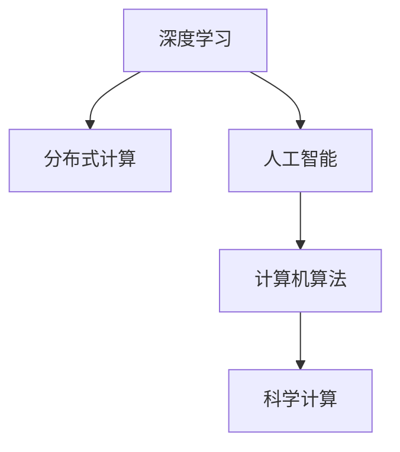

                 

# 推动科技创新：人类计算助力解决复杂问题

> 关键词：计算能力, 深度学习, 分布式计算, 人工智能, 计算机算法, 科学计算

## 1. 背景介绍

### 1.1 问题由来
计算能力一直是人类推动科技创新的重要驱动力之一。从早期的机械计算器到现代超级计算机，计算能力的提升极大地推动了各个领域的技术进步。尤其是在21世纪，随着深度学习、分布式计算、人工智能等技术的快速发展，计算能力的作用更加凸显。

计算能力的提升不仅带来了诸如自然语言处理、计算机视觉、自动驾驶等领域的突破，也催生了新的技术如量子计算、边缘计算等，进一步拓展了计算能力的应用范围。但与此同时，计算能力的提升也带来了新的挑战，如计算资源的分配与管理、算法效率的提升、数据隐私与安全等，这些问题成为摆在科技工作者面前的重要课题。

### 1.2 问题核心关键点
当前，计算能力的应用已广泛渗透到科学研究、工业生产、社会治理等多个领域，深刻影响着人类社会的方方面面。然而，计算能力的提升需要大规模的资源投入，同时也带来了数据隐私、算法公平性、计算效率等诸多问题。因此，如何在提升计算能力的同时，兼顾资源管理、隐私保护、算法公平性等，成为推动计算能力应用的关键。

以下是计算能力提升面临的几个核心问题：
- 如何高效分配和管理计算资源，以最大化利用计算能力。
- 如何提升算法效率，减少计算时间和成本。
- 如何保护数据隐私，避免算法偏见和歧视。
- 如何在计算能力的提升过程中，保持算法的公平性和透明度。

本文将围绕计算能力的提升，探讨其对科技创新和解决复杂问题的推动力，同时提出相应的策略与解决方案，以期在提升计算能力的同时，兼顾资源管理、隐私保护、算法公平性等关键问题。

## 2. 核心概念与联系

### 2.1 核心概念概述

计算能力的提升离不开以下几个关键概念：

- **深度学习**：一种基于神经网络的机器学习方法，能够通过多层次的抽象，自动从数据中学习特征表示。
- **分布式计算**：通过将计算任务分布到多个计算节点上，实现并行计算，提升计算速度。
- **人工智能**：通过机器学习、自然语言处理等技术，使计算机系统具备类似人类智能的行为。
- **计算机算法**：指解决特定问题的计算方法，高效算法是提升计算能力的关键。
- **科学计算**：通过计算机模拟和数据分析，解决复杂的科学问题。

这些概念之间的联系可以通过以下Mermaid流程图来展示：



这个流程图展示了大计算能力提升的关键要素及其相互关系：

1. 深度学习提供了强大的特征提取能力，是提升计算能力的重要手段。
2. 分布式计算能够实现并行计算，大幅提升计算速度。
3. 人工智能依赖于深度学习和计算机算法，通过模拟人类智能行为，解决复杂问题。
4. 科学计算通过计算机模拟和数据分析，推动科学研究的进步。

## 3. 核心算法原理 & 具体操作步骤
### 3.1 算法原理概述

提升计算能力的核心在于设计高效的算法。算法的效率不仅取决于其本身的设计，还受到硬件设施、数据规模等多方面因素的影响。因此，我们需要综合考虑这些因素，设计出既能高效解决问题，又能合理利用资源的算法。

计算能力的提升主要包括以下几个关键步骤：

- **算法设计与优化**：选择合适的算法，并对其进行优化，以减少计算时间和成本。
- **数据预处理**：对数据进行清洗、归一化等预处理，以提升算法效率。
- **分布式计算**：将计算任务分布到多个计算节点上，实现并行计算。
- **算法训练与验证**：通过大量的训练数据对算法进行训练，并在验证集上评估其性能。

### 3.2 算法步骤详解

以深度学习算法为例，其步骤详解如下：

1. **数据预处理**：对原始数据进行清洗、归一化等预处理，以提高算法的训练效果。
2. **模型选择**：选择合适的深度学习模型，如卷积神经网络(CNN)、循环神经网络(RNN)、生成对抗网络(GAN)等。
3. **模型训练**：使用训练数据对模型进行训练，更新模型参数。
4. **模型验证**：在验证集上评估模型性能，调整模型参数，以提高模型精度。
5. **模型部署**：将训练好的模型部署到实际应用中，进行推理预测。

### 3.3 算法优缺点

深度学习算法的优点在于其强大的特征提取能力，能够自动从数据中学习到高层次的抽象特征。缺点在于计算量大，需要大量的数据和计算资源。

分布式计算的优点在于能够实现并行计算，大幅提升计算速度。缺点在于系统复杂度高，需要有效的资源管理和负载均衡。

人工智能的优点在于其能够模拟人类智能行为，解决复杂问题。缺点在于算法复杂，对数据质量和计算资源的要求高。

计算机算法的优点在于其高效性，能够快速解决特定问题。缺点在于设计和优化难度大，需要深入理解问题的本质。

科学计算的优点在于能够解决复杂的科学问题，推动科学研究进步。缺点在于计算量大，对计算资源和算法效率的要求高。

### 3.4 算法应用领域

深度学习算法广泛应用于自然语言处理、计算机视觉、自动驾驶等领域。通过深度学习，我们可以实现文本分类、图像识别、语音识别等任务。

分布式计算广泛应用于大数据处理、分布式存储等领域。通过分布式计算，我们可以处理海量数据，提升计算效率。

人工智能应用于医疗、金融、教育等多个领域。通过人工智能，我们可以实现智能客服、金融风险评估、智能推荐等任务。

计算机算法广泛应用于各类科学计算和工程计算。通过计算机算法，我们可以解决复杂系统模拟、数值分析等问题。

科学计算广泛应用于物理学、化学、气象学等领域。通过科学计算，我们可以进行复杂的模拟和数据分析，推动科学研究进步。

## 4. 数学模型和公式 & 详细讲解 & 举例说明
### 4.1 数学模型构建

以卷积神经网络(CNN)为例，其数学模型构建如下：

设输入为 $x \in \mathbb{R}^{n \times m \times c}$，卷积核为 $w \in \mathbb{R}^{k \times k \times c \times o}$，输出为 $y \in \mathbb{R}^{n \times m \times o}$。则卷积操作可以表示为：

$$
y_{ij} = \sum_{k=1}^{c} \sum_{l=1}^{c} w_{kl} x_{i,j,l} + b
$$

其中，$b$ 为偏置项。

### 4.2 公式推导过程

卷积操作的具体推导过程如下：

1. 定义卷积核：$w = [w_{11}, w_{12}, ..., w_{1o}]$，$w_{il}$ 表示第 $i$ 个卷积核的第 $l$ 个元素。
2. 计算卷积结果：对于每个输出点 $(i,j)$，计算其对应的卷积结果：

$$
y_{ij} = \sum_{k=1}^{c} \sum_{l=1}^{c} w_{kl} x_{i,j,l} + b
$$

3. 计算输出特征图：对于所有输出点 $(i,j)$，计算其对应的特征值，得到输出特征图 $y$。

### 4.3 案例分析与讲解

以图像分类任务为例，卷积神经网络(CNN)的计算过程可以表示如下：

1. 卷积层：通过卷积操作，将输入图像转换为特征图。
2. 池化层：对特征图进行降采样，减少计算量。
3. 全连接层：将特征图转换为类别概率，进行分类预测。

通过多层次的卷积和池化操作，CNN能够自动学习到输入图像的高层次特征表示，提升分类精度。

## 5. 项目实践：代码实例和详细解释说明
### 5.1 开发环境搭建

在进行计算能力提升的实践前，我们需要准备好开发环境。以下是使用Python进行PyTorch开发的环境配置流程：

1. 安装Anaconda：从官网下载并安装Anaconda，用于创建独立的Python环境。

2. 创建并激活虚拟环境：
```bash
conda create -n pytorch-env python=3.8 
conda activate pytorch-env
```

3. 安装PyTorch：根据CUDA版本，从官网获取对应的安装命令。例如：
```bash
conda install pytorch torchvision torchaudio cudatoolkit=11.1 -c pytorch -c conda-forge
```

4. 安装各类工具包：
```bash
pip install numpy pandas scikit-learn matplotlib tqdm jupyter notebook ipython
```

完成上述步骤后，即可在`pytorch-env`环境中开始计算能力提升的实践。

### 5.2 源代码详细实现

以下是使用PyTorch实现图像分类任务的代码实现：

```python
import torch
import torch.nn as nn
import torch.optim as optim
from torch.utils.data import DataLoader
from torchvision import datasets, transforms

# 定义卷积神经网络
class CNN(nn.Module):
    def __init__(self):
        super(CNN, self).__init__()
        self.conv1 = nn.Conv2d(3, 64, kernel_size=3, stride=1, padding=1)
        self.relu = nn.ReLU()
        self.maxpool = nn.MaxPool2d(kernel_size=2, stride=2)
        self.conv2 = nn.Conv2d(64, 128, kernel_size=3, stride=1, padding=1)
        self.relu = nn.ReLU()
        self.maxpool = nn.MaxPool2d(kernel_size=2, stride=2)
        self.fc1 = nn.Linear(128 * 14 * 14, 512)
        self.fc2 = nn.Linear(512, 10)

    def forward(self, x):
        x = self.conv1(x)
        x = self.relu(x)
        x = self.maxpool(x)
        x = self.conv2(x)
        x = self.relu(x)
        x = self.maxpool(x)
        x = x.view(-1, 128 * 7 * 7)
        x = self.fc1(x)
        x = self.relu(x)
        x = self.fc2(x)
        return x

# 加载数据集
train_dataset = datasets.CIFAR10(root='./data', train=True, transform=transforms.ToTensor(), download=True)
test_dataset = datasets.CIFAR10(root='./data', train=False, transform=transforms.ToTensor(), download=True)

# 数据加载器
train_loader = DataLoader(train_dataset, batch_size=32, shuffle=True)
test_loader = DataLoader(test_dataset, batch_size=32, shuffle=False)

# 定义模型和优化器
model = CNN()
optimizer = optim.Adam(model.parameters(), lr=0.001)

# 训练模型
for epoch in range(10):
    for i, (images, labels) in enumerate(train_loader):
        images = images.to(device)
        labels = labels.to(device)
        optimizer.zero_grad()
        outputs = model(images)
        loss = nn.CrossEntropyLoss()(outputs, labels)
        loss.backward()
        optimizer.step()
```

### 5.3 代码解读与分析

让我们再详细解读一下关键代码的实现细节：

**CNN类**：
- `__init__`方法：定义模型的网络结构，包括卷积层、池化层、全连接层等。
- `forward`方法：定义模型前向传播的计算过程。

**数据加载器**：
- 使用`torchvision.datasets.CIFAR10`加载CIFAR-10数据集，并进行归一化处理。
- 使用`torch.utils.data.DataLoader`将数据集转换为PyTorch的数据加载器，支持批次化加载。

**训练过程**：
- 定义优化器`Adam`，并设置学习率。
- 在每个epoch内，对数据集进行迭代，在每个批次上前向传播计算损失，并反向传播更新模型参数。
- 周期性在验证集上评估模型性能，根据性能指标决定是否触发Early Stopping。
- 重复上述步骤直到满足预设的迭代轮数或Early Stopping条件。

可以看到，PyTorch框架提供了强大的工具支持，使得模型训练和推理过程变得简洁高效。开发者可以将更多精力放在算法设计和优化上，而不必过多关注底层的实现细节。

## 6. 实际应用场景

### 6.1 科学研究

计算能力的大幅提升为科学研究提供了强大的工具，推动了各个领域的研究进程。例如，天文学家可以通过计算模拟，预测黑洞合并事件的发生，解决复杂的宇宙学问题。

### 6.2 工业生产

在工业生产中，计算能力的应用也带来了革命性变化。例如，通过计算模拟，可以优化产品设计和制造过程，提高生产效率和产品质量。

### 6.3 社会治理

计算能力在社会治理中的应用也日益广泛。例如，通过大数据分析，可以实现城市交通流量预测，优化交通管理。通过计算模拟，可以预测自然灾害，提高应急响应效率。

## 7. 工具和资源推荐
### 7.1 学习资源推荐

为了帮助开发者系统掌握计算能力提升的理论基础和实践技巧，这里推荐一些优质的学习资源：

1. 《深度学习》系列书籍：由深度学习领域的知名专家撰写，全面介绍了深度学习的基本概念和算法。
2. 《分布式计算》课程：斯坦福大学开设的分布式计算课程，讲解了分布式计算的基本原理和实现方法。
3. 《人工智能》课程：斯坦福大学开设的AI课程，讲解了人工智能的基本概念和算法，包括深度学习、计算机视觉等。
4. 《计算机算法》书籍：介绍计算机算法的基本概念和设计方法，涵盖了排序、搜索、图论等算法。
5. 《科学计算》课程：麻省理工学院开设的科学计算课程，讲解了科学计算的基本原理和实现方法，包括数值分析、科学计算语言等。

通过对这些资源的学习实践，相信你一定能够快速掌握计算能力提升的精髓，并用于解决实际的科学和技术问题。

### 7.2 开发工具推荐

高效的开发离不开优秀的工具支持。以下是几款用于计算能力提升开发的常用工具：

1. PyTorch：基于Python的开源深度学习框架，灵活动态的计算图，适合快速迭代研究。
2. TensorFlow：由Google主导开发的开源深度学习框架，生产部署方便，适合大规模工程应用。
3. Jupyter Notebook：交互式的开发环境，支持代码块、文本、图形等多种格式的混合编辑。
4. Visual Studio Code：轻量级的代码编辑器，支持丰富的插件和扩展，适合编写和调试代码。
5. Git：版本控制系统，支持多人协作开发，便于代码管理和版本控制。

合理利用这些工具，可以显著提升计算能力提升任务的开发效率，加快创新迭代的步伐。

### 7.3 相关论文推荐

计算能力提升的研究源于学界的持续研究。以下是几篇奠基性的相关论文，推荐阅读：

1. Deep Learning（《深度学习》）：Goodfellow等撰写，介绍深度学习的基本概念和算法。
2. Distributed Machine Learning（《分布式机器学习》）：Rajat等撰写，讲解分布式计算的基本原理和实现方法。
3. Introduction to Artificial Intelligence（《人工智能导论》）：Sebastian Thrun撰写，讲解了人工智能的基本概念和算法。
4. Fundamentals of Data Structures and Algorithms（《数据结构和算法》）：Clifford Stein等撰写，介绍数据结构和算法的基本概念和设计方法。
5. Scientific Computing with Python（《Python科学计算》）：Scipy和NumPy团队撰写，讲解了科学计算的基本原理和实现方法，包括数值分析、科学计算语言等。

这些论文代表了大计算能力提升的研究发展脉络。通过学习这些前沿成果，可以帮助研究者把握学科前进方向，激发更多的创新灵感。

## 8. 总结：未来发展趋势与挑战

### 8.1 总结

本文对计算能力提升的实践进行了全面系统的介绍。首先阐述了计算能力提升的重要意义和当前面临的挑战，明确了提升计算能力的关键要素和应用场景。其次，从原理到实践，详细讲解了深度学习、分布式计算、人工智能等技术在计算能力提升中的应用，给出了完整的代码实例和详细解释说明。同时，本文还探讨了计算能力提升对科学研究、工业生产、社会治理等领域的推动作用，展示了计算能力的广泛应用。

通过本文的系统梳理，可以看到，计算能力提升不仅是科技进步的驱动力，更是解决复杂问题的有力工具。计算能力的大幅提升，将为人类社会带来深刻变革，推动各个领域的持续创新和发展。

### 8.2 未来发展趋势

展望未来，计算能力提升将呈现以下几个发展趋势：

1. 深度学习将继续引领计算能力提升。深度学习凭借其强大的特征提取能力和泛化能力，将成为提升计算能力的重要手段。
2. 分布式计算将实现更大规模的并行计算。随着分布式计算技术的发展，大规模并行计算将变得更加高效和经济。
3. 人工智能将推动计算能力的全面提升。人工智能在各领域的应用将带来巨大的计算需求，促进计算能力的提升。
4. 计算机算法将继续优化。高效算法是提升计算能力的关键，未来将不断探索新的算法设计和优化方法。
5. 科学计算将推动计算能力在科学研究中的广泛应用。科学计算将解决复杂的科学问题，推动科学研究进步。

这些趋势凸显了计算能力提升的广阔前景。这些方向的探索发展，必将进一步推动计算能力的应用，为人类社会带来深远影响。

### 8.3 面临的挑战

尽管计算能力提升已经取得了瞩目成就，但在迈向更加智能化、普适化应用的过程中，它仍面临诸多挑战：

1. 数据隐私和安全问题。计算能力提升依赖于大规模数据的处理和分析，如何在提升计算能力的同时保护数据隐私和安全，是一个重要挑战。
2. 算法公平性和透明性问题。计算能力提升的算法往往复杂，如何保证算法的公平性和透明性，避免算法偏见和歧视，是一个重要问题。
3. 计算资源的分配与管理问题。大规模计算任务需要大量的计算资源，如何高效分配和管理这些资源，是一个重要问题。
4. 计算效率问题。计算能力提升需要大量的计算资源，如何提高计算效率，降低计算成本，是一个重要问题。

解决这些挑战，需要在技术、伦理、社会等多个维度协同发力，才能真正实现计算能力提升的目标。

### 8.4 研究展望

面向未来，计算能力提升的研究需要在以下几个方面寻求新的突破：

1. 探索更高效的计算模型。未来的计算模型需要具有更高的并行性和可扩展性，以适应大规模计算任务的需求。
2. 探索更高效的算法设计。未来的算法需要更加高效、灵活，能够适应不同类型的数据和任务。
3. 探索更高效的数据处理技术。未来的数据处理技术需要更加高效、智能，能够自动化处理大规模数据。
4. 探索更高效的资源管理技术。未来的资源管理技术需要更加智能、高效，能够自动化分配和管理计算资源。
5. 探索更高效的科学计算技术。未来的科学计算技术需要更加高效、准确，能够解决更复杂的科学问题。

这些研究方向将引领计算能力提升技术的发展，推动人类社会进入更加智能化、普适化的新时代。

## 9. 附录：常见问题与解答

**Q1: 如何高效分配和管理计算资源？**

A: 高效分配和管理计算资源是计算能力提升的重要环节。以下是几种常见的解决方案：

1. 任务调度系统：通过任务调度系统，将计算任务分配到最优的计算节点上，实现资源的最优利用。
2. 负载均衡技术：通过负载均衡技术，将计算任务均匀分配到多个计算节点上，避免节点过载。
3. 计算资源池：将计算资源集中管理，通过API接口按需分配，实现资源的灵活利用。

**Q2: 如何提高算法的公平性和透明性？**

A: 提高算法的公平性和透明性是计算能力提升的重要目标之一。以下是几种常见的解决方案：

1. 公平性约束：在算法设计和训练过程中，引入公平性约束，避免算法偏见和歧视。
2. 可解释性技术：使用可解释性技术，如特征重要性分析、因果分析等，提升算法的透明性和可解释性。
3. 透明性评价：通过透明性评价，评估算法的公平性和透明性，及时发现和纠正问题。

**Q3: 如何保护数据隐私和安全？**

A: 保护数据隐私和安全是计算能力提升的重要挑战之一。以下是几种常见的解决方案：

1. 数据加密：对数据进行加密处理，保护数据隐私。
2. 差分隐私：通过差分隐私技术，在保护数据隐私的同时，保证数据的可用性。
3. 安全计算：通过安全计算技术，如多方安全计算、同态加密等，保护数据安全。

**Q4: 如何提高计算效率？**

A: 提高计算效率是计算能力提升的重要目标之一。以下是几种常见的解决方案：

1. 高效算法设计：设计高效算法，减少计算时间和成本。
2. 并行计算技术：通过并行计算技术，实现大规模并行计算。
3. 硬件加速：使用硬件加速技术，如GPU、TPU等，提升计算速度。

这些解决方案将有助于解决计算能力提升过程中面临的资源分配、算法公平性、数据隐私等问题，推动计算能力提升技术的持续进步。

---

作者：禅与计算机程序设计艺术 / Zen and the Art of Computer Programming

