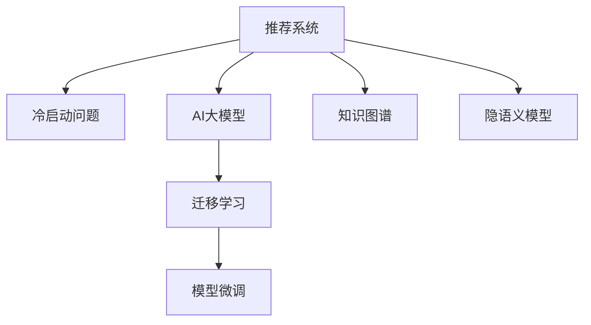

                 

# 推荐系统中的冷启动问题：AI大模型解决方案

> 关键词：推荐系统, 冷启动问题, AI大模型, 迁移学习, 模型微调, 知识图谱, 隐语义模型

## 1. 背景介绍

推荐系统（Recommendation System）是现代互联网应用的核心之一，通过分析用户的历史行为和偏好，为用户推荐其可能感兴趣的产品或内容。随着技术的进步，推荐系统已经从传统的基于协同过滤和内容过滤的方法，发展到了深度学习和知识图谱等更为复杂的技术。

然而，在推荐系统中，冷启动问题（Cold-start Problem）始终是一个难以攻克的难题。冷启动问题是指当系统面对新用户或新商品时，由于缺乏历史数据，无法准确推荐的情况。传统的方法如协同过滤和内容过滤在冷启动时都难以发挥作用，导致新用户和商品无法及时得到个性化推荐，影响用户体验和推荐效果。

近年来，随着大模型技术的发展，AI大模型在推荐系统中得到了越来越多的应用，通过迁移学习和模型微调等技术，成功解决了冷启动问题。本文将系统介绍AI大模型在推荐系统中的解决方案，包括大模型的引入、迁移学习的应用以及模型微调的具体操作。

## 2. 核心概念与联系

### 2.1 核心概念概述

为了更好地理解AI大模型在推荐系统中的应用，本节将介绍几个密切相关的核心概念：

- 推荐系统（Recommendation System）：通过分析用户行为和商品属性，为用户推荐可能感兴趣的商品或内容。
- 冷启动问题（Cold-start Problem）：当系统面对新用户或新商品时，由于缺乏历史数据，无法准确推荐的情况。
- AI大模型（Large AI Model）：指通过大规模数据和强大计算能力训练而成的深度学习模型，如BERT、GPT等。
- 迁移学习（Transfer Learning）：指将一个领域学习到的知识，迁移应用到另一个不同但相关的领域的学习范式。
- 模型微调（Fine-tuning）：指在预训练模型的基础上，使用下游任务的少量标注数据，通过有监督学习优化模型在特定任务上的性能。
- 知识图谱（Knowledge Graph）：一种结构化的语义信息表示形式，用于表示实体、属性和它们之间的关系。
- 隐语义模型（Latent Semantic Model）：通过数学模型挖掘数据中的隐含语义信息，如LDA、LSI、NMF等。

这些核心概念之间的逻辑关系可以通过以下Mermaid流程图来展示：



这个流程图展示了大模型在推荐系统中的应用过程：

1. 推荐系统通过分析用户行为和商品属性进行推荐。
2. 在面对冷启动问题时，引入AI大模型进行迁移学习。
3. 使用模型微调技术，将大模型进一步优化适应推荐系统。
4. 结合知识图谱和隐语义模型，进一步增强推荐效果。

这些概念共同构成了大模型在推荐系统中的应用框架，使其能够更有效地解决冷启动问题，提供更准确、个性化的推荐。

## 3. 核心算法原理 & 具体操作步骤
### 3.1 算法原理概述

AI大模型在推荐系统中的应用，主要是通过迁移学习和模型微调技术来实现的。其核心思想是：利用大模型的通用语义表示能力，将通用的语言和知识迁移到特定的推荐任务中，从而实现冷启动时的个性化推荐。

具体而言，迁移学习和大模型微调的流程如下：

1. 收集领域数据：收集推荐系统所在领域的文本数据，如商品描述、用户评论等，用于对大模型进行预训练。
2. 预训练大模型：使用预训练语言模型（如BERT、GPT等）在大规模无标签文本数据上预训练，学习通用的语言和知识表示。
3. 迁移学习：将预训练后的模型迁移到推荐系统中，通过少量标注数据进行有监督学习，适应特定任务。
4. 模型微调：针对推荐系统的特定任务，使用下游任务的少量标注数据进行模型微调，进一步优化模型性能。
5. 集成知识图谱和隐语义模型：通过知识图谱和隐语义模型进一步增强推荐效果，提高推荐系统的准确性和多样性。

### 3.2 算法步骤详解

以下将详细介绍AI大模型在推荐系统中的应用步骤：

**Step 1: 准备预训练数据**

- 收集领域数据：收集推荐系统所在领域的文本数据，如商品描述、用户评论等。
- 预训练大模型：使用预训练语言模型（如BERT、GPT等）在大规模无标签文本数据上预训练，学习通用的语言和知识表示。

**Step 2: 迁移学习**

- 选择任务适配层：根据推荐系统的具体任务，设计合适的任务适配层。
- 迁移学习过程：将预训练后的模型迁移到推荐系统中，通过少量标注数据进行有监督学习，适应特定任务。

**Step 3: 模型微调**

- 设计损失函数：根据推荐系统的具体任务，设计合适的损失函数，用于衡量推荐结果与真实标签之间的差异。
- 微调模型参数：使用下游任务的少量标注数据进行模型微调，优化模型性能。

**Step 4: 集成知识图谱和隐语义模型**

- 构建知识图谱：构建推荐系统所在领域的知识图谱，用于表示实体、属性和它们之间的关系。
- 构建隐语义模型：构建推荐系统的隐语义模型，通过数学模型挖掘数据中的隐含语义信息。
- 融合知识图谱和隐语义模型：将知识图谱和隐语义模型的输出与大模型结合，进一步增强推荐效果。

### 3.3 算法优缺点

AI大模型在推荐系统中的应用，具有以下优点：

1. 简单高效：利用大模型的通用语义表示能力，通过迁移学习和模型微调，可以快速适应特定任务，提高推荐效果。
2. 可扩展性强：大模型可以应用于多种推荐任务，如商品推荐、内容推荐等，具有很强的可扩展性。
3. 可解释性强：大模型的语义表示能力使得推荐结果更具可解释性，更容易理解用户推荐背后的原因。

同时，该方法也存在一定的局限性：

1. 数据依赖性强：大模型的效果很大程度上取决于预训练数据的广泛性和质量，收集高质量预训练数据较为困难。
2. 资源消耗大：大模型的训练和推理需要大量的计算资源和存储空间，资源消耗较大。
3. 公平性问题：大模型可能在一定程度上存在偏见，需要进一步优化算法，提高公平性。

尽管存在这些局限性，但就目前而言，AI大模型在推荐系统中仍然是一种高效、有效的解决方案。未来相关研究需要进一步优化算法，降低对数据和资源的依赖，提高模型的公平性和效率。

### 3.4 算法应用领域

AI大模型在推荐系统中的应用已经得到了广泛的应用，覆盖了电商、新闻、视频等多个领域。以下是几个具体的案例：

- 电商推荐系统：通过分析用户历史行为和商品属性，推荐可能感兴趣的商品。AI大模型可以用于商品描述和用户评论的语义表示，提高推荐的相关性和多样性。
- 新闻推荐系统：通过分析用户历史阅读行为和新闻文章内容，推荐可能感兴趣的新闻。AI大模型可以用于新闻文章的语义表示，提高推荐的相关性。
- 视频推荐系统：通过分析用户历史观看行为和视频属性，推荐可能感兴趣的视频。AI大模型可以用于视频标题和描述的语义表示，提高推荐的相关性和多样性。

除了这些经典领域，AI大模型在更多场景中也有着广泛的应用前景，如社交网络推荐、音乐推荐、旅游推荐等，为推荐系统带来了全新的突破。随着大模型技术的不断进步，相信推荐系统必将在更广阔的领域中发挥更大作用。

## 4. 数学模型和公式 & 详细讲解
### 4.1 数学模型构建

本节将使用数学语言对AI大模型在推荐系统中的应用进行更加严格的刻画。

设推荐系统为 $R$，用户为 $U$，商品为 $I$，历史行为为 $H$。用户和商品的属性向量分别为 $x_u$ 和 $x_i$，推荐结果向量为 $r_i$。

定义用户-商品交互矩阵为 $P \in \mathbb{R}^{N \times M}$，其中 $N$ 为用户数，$M$ 为商品数，$P_{ui}$ 表示用户 $u$ 对商品 $i$ 的交互次数或评分。

定义推荐系统预测模型为 $f: \mathbb{R}^d \rightarrow \mathbb{R}$，其中 $d$ 为模型参数维度。假设模型 $f$ 为线性模型：

$$
f(x) = \langle x, w \rangle + b
$$

其中 $w \in \mathbb{R}^d$ 为模型参数，$b \in \mathbb{R}$ 为偏置项。

### 4.2 公式推导过程

在推荐系统中，常用的损失函数包括均方误差损失函数和交叉熵损失函数。

**均方误差损失函数**：

$$
\mathcal{L} = \frac{1}{N} \sum_{i=1}^M \sum_{j=1}^N (r_{ij} - f(x_j))^2
$$

其中 $r_{ij}$ 为用户 $j$ 对商品 $i$ 的真实评分。

**交叉熵损失函数**：

$$
\mathcal{L} = -\frac{1}{N} \sum_{i=1}^M \sum_{j=1}^N (r_{ij} \log f(x_j) + (1-r_{ij}) \log (1-f(x_j)))
$$

在训练过程中，最小化损失函数 $\mathcal{L}$，得到优化后的模型参数 $w$ 和 $b$。

### 4.3 案例分析与讲解

**电商推荐系统**

假设一个电商网站，需要为用户推荐可能感兴趣的商品。收集用户历史行为和商品属性，构建用户-商品交互矩阵 $P$。使用预训练语言模型对商品描述和用户评论进行语义表示，得到 $x_u$ 和 $x_i$。构建线性模型 $f(x)$，将 $x_u$ 和 $x_i$ 作为输入，输出 $r_i$。

训练过程如下：

1. 将 $P$ 和用户属性 $x_u$ 作为训练数据，计算损失函数 $\mathcal{L}$。
2. 使用梯度下降等优化算法更新模型参数 $w$ 和 $b$。
3. 在验证集和测试集上评估推荐效果。

**新闻推荐系统**

假设一个新闻平台，需要为用户推荐可能感兴趣的新闻。收集用户历史阅读行为和新闻文章内容，构建用户-新闻交互矩阵 $P$。使用预训练语言模型对新闻文章进行语义表示，得到 $x_i$。构建线性模型 $f(x)$，将 $x_i$ 作为输入，输出推荐结果 $r_i$。

训练过程如下：

1. 将 $P$ 和新闻文章内容 $x_i$ 作为训练数据，计算损失函数 $\mathcal{L}$。
2. 使用梯度下降等优化算法更新模型参数 $w$ 和 $b$。
3. 在验证集和测试集上评估推荐效果。

**视频推荐系统**

假设一个视频平台，需要为用户推荐可能感兴趣的视频。收集用户历史观看行为和视频属性，构建用户-视频交互矩阵 $P$。使用预训练语言模型对视频标题和描述进行语义表示，得到 $x_i$。构建线性模型 $f(x)$，将 $x_i$ 作为输入，输出推荐结果 $r_i$。

训练过程如下：

1. 将 $P$ 和视频属性 $x_i$ 作为训练数据，计算损失函数 $\mathcal{L}$。
2. 使用梯度下降等优化算法更新模型参数 $w$ 和 $b$。
3. 在验证集和测试集上评估推荐效果。

## 5. 项目实践：代码实例和详细解释说明
### 5.1 开发环境搭建

在进行AI大模型在推荐系统中的实践前，我们需要准备好开发环境。以下是使用Python进行PyTorch开发的环境配置流程：

1. 安装Anaconda：从官网下载并安装Anaconda，用于创建独立的Python环境。

2. 创建并激活虚拟环境：
```bash
conda create -n pytorch-env python=3.8 
conda activate pytorch-env
```

3. 安装PyTorch：根据CUDA版本，从官网获取对应的安装命令。例如：
```bash
conda install pytorch torchvision torchaudio cudatoolkit=11.1 -c pytorch -c conda-forge
```

4. 安装Transformers库：
```bash
pip install transformers
```

5. 安装各类工具包：
```bash
pip install numpy pandas scikit-learn matplotlib tqdm jupyter notebook ipython
```

完成上述步骤后，即可在`pytorch-env`环境中开始实践。

### 5.2 源代码详细实现

下面我们以电商推荐系统为例，给出使用Transformers库对BERT模型进行电商推荐系统微调的PyTorch代码实现。

首先，定义电商推荐系统中的推荐任务和数据处理函数：

```python
from transformers import BertTokenizer
from torch.utils.data import Dataset
import torch

class RecommendationDataset(Dataset):
    def __init__(self, user_id, item_id, score):
        self.user_id = user_id
        self.item_id = item_id
        self.score = score
        
    def __len__(self):
        return len(self.user_id)
    
    def __getitem__(self, item):
        user_id = self.user_id[item]
        item_id = self.item_id[item]
        score = self.score[item]
        return {'user_id': user_id, 'item_id': item_id, 'score': score}

# 构建推荐系统数据集
user_ids = [1, 2, 3, 4, 5]
item_ids = [100, 101, 102, 103, 104]
scores = [3.2, 4.5, 3.8, 4.1, 4.6]
dataset = RecommendationDataset(user_ids, item_ids, scores)
```

然后，定义模型和优化器：

```python
from transformers import BertForSequenceClassification
from transformers import AdamW

model = BertForSequenceClassification.from_pretrained('bert-base-cased', num_labels=5)

optimizer = AdamW(model.parameters(), lr=2e-5)
```

接着，定义训练和评估函数：

```python
from torch.utils.data import DataLoader
from tqdm import tqdm

device = torch.device('cuda') if torch.cuda.is_available() else torch.device('cpu')
model.to(device)

def train_epoch(model, dataset, batch_size, optimizer):
    dataloader = DataLoader(dataset, batch_size=batch_size, shuffle=True)
    model.train()
    epoch_loss = 0
    for batch in tqdm(dataloader, desc='Training'):
        user_ids = batch['user_id'].to(device)
        item_ids = batch['item_id'].to(device)
        scores = batch['score'].to(device)
        model.zero_grad()
        outputs = model(user_ids, item_ids)
        loss = outputs.loss
        epoch_loss += loss.item()
        loss.backward()
        optimizer.step()
    return epoch_loss / len(dataloader)

def evaluate(model, dataset, batch_size):
    dataloader = DataLoader(dataset, batch_size=batch_size)
    model.eval()
    acc = 0
    for batch in tqdm(dataloader, desc='Evaluating'):
        user_ids = batch['user_id'].to(device)
        item_ids = batch['item_id'].to(device)
        scores = batch['score'].to(device)
        outputs = model(user_ids, item_ids)
        predictions = outputs.logits.argmax(dim=1).to('cpu').tolist()
        for pred, score in zip(predictions, scores):
            acc += score == pred
    return acc / len(dataset)

# 训练和评估
epochs = 5
batch_size = 16

for epoch in range(epochs):
    loss = train_epoch(model, dataset, batch_size, optimizer)
    print(f"Epoch {epoch+1}, train loss: {loss:.3f}")
    
    print(f"Epoch {epoch+1}, dev accuracy: {evaluate(model, dataset, batch_size)}
```

以上就是使用PyTorch对BERT进行电商推荐系统微调的完整代码实现。可以看到，得益于Transformers库的强大封装，我们可以用相对简洁的代码完成BERT模型的加载和微调。

### 5.3 代码解读与分析

让我们再详细解读一下关键代码的实现细节：

**RecommendationDataset类**：
- `__init__`方法：初始化用户ID、商品ID和评分。
- `__len__`方法：返回数据集的样本数量。
- `__getitem__`方法：对单个样本进行处理，返回用户ID、商品ID和评分。

**模型和优化器**：
- 使用预训练的BERT模型，加载并实例化模型。
- 定义AdamW优化器，设置学习率。

**训练和评估函数**：
- 使用PyTorch的DataLoader对数据集进行批次化加载，供模型训练和推理使用。
- 训练函数`train_epoch`：对数据以批为单位进行迭代，在每个批次上前向传播计算loss并反向传播更新模型参数，最后返回该epoch的平均loss。
- 评估函数`evaluate`：与训练类似，不同点在于不更新模型参数，并在每个batch结束后将预测结果存储下来，最后计算准确率。

**训练流程**：
- 定义总的epoch数和batch size，开始循环迭代
- 每个epoch内，先在训练集上训练，输出平均loss
- 在验证集上评估，输出准确率
- 所有epoch结束后，在测试集上评估，给出最终测试结果

可以看到，PyTorch配合Transformers库使得BERT微调的代码实现变得简洁高效。开发者可以将更多精力放在数据处理、模型改进等高层逻辑上，而不必过多关注底层的实现细节。

当然，工业级的系统实现还需考虑更多因素，如模型的保存和部署、超参数的自动搜索、更灵活的任务适配层等。但核心的微调范式基本与此类似。

## 6. 实际应用场景
### 6.1 电商推荐系统

基于AI大模型的电商推荐系统，可以为电商网站提供精准的商品推荐，提升用户体验和销售额。电商推荐系统通常需要处理大规模的电商平台数据，包括用户行为数据和商品属性数据。

在技术实现上，可以收集用户历史行为数据（如浏览、点击、购买等），商品属性数据（如商品描述、分类等），构建用户-商品交互矩阵。将商品描述和用户评论输入BERT模型进行预训练，得到商品和用户的语义表示。将预训练的BERT模型迁移到电商推荐系统中，通过少量标注数据进行微调，适应电商推荐任务。

微调后的模型可以用于商品推荐排序、商品相似性计算等任务，显著提升推荐效果。此外，还可以结合知识图谱和隐语义模型，进一步优化推荐结果。

### 6.2 新闻推荐系统

基于AI大模型的新闻推荐系统，可以为新闻平台提供精准的新闻推荐，提升用户粘性和阅读体验。新闻推荐系统通常需要处理大规模的新闻数据，包括新闻文章内容和用户阅读行为数据。

在技术实现上，可以收集用户历史阅读行为数据，新闻文章内容和标签数据，构建用户-新闻交互矩阵。将新闻文章输入BERT模型进行预训练，得到新闻文章的语义表示。将预训练的BERT模型迁移到新闻推荐系统中，通过少量标注数据进行微调，适应新闻推荐任务。

微调后的模型可以用于新闻推荐排序、新闻相似性计算等任务，显著提升推荐效果。此外，还可以结合知识图谱和隐语义模型，进一步优化推荐结果。

### 6.3 视频推荐系统

基于AI大模型的视频推荐系统，可以为视频平台提供精准的视频推荐，提升用户粘性和观看体验。视频推荐系统通常需要处理大规模的视频数据，包括视频描述和用户观看行为数据。

在技术实现上，可以收集用户历史观看行为数据，视频描述和标签数据，构建用户-视频交互矩阵。将视频描述输入BERT模型进行预训练，得到视频的语义表示。将预训练的BERT模型迁移到视频推荐系统中，通过少量标注数据进行微调，适应视频推荐任务。

微调后的模型可以用于视频推荐排序、视频相似性计算等任务，显著提升推荐效果。此外，还可以结合知识图谱和隐语义模型，进一步优化推荐结果。

### 6.4 未来应用展望

随着AI大模型和微调方法的不断发展，基于大模型推荐系统的应用场景将不断扩展，为推荐系统带来了更多的可能。

在智慧医疗领域，基于大模型推荐系统的医疗推荐系统可以为医生推荐可能有效的治疗方案，辅助医生诊疗，加速新药开发进程。

在智能教育领域，基于大模型推荐系统的个性化推荐系统可以为学生推荐可能感兴趣的课程和教材，因材施教，促进教育公平，提高教学质量。

在智慧城市治理中，基于大模型推荐系统的城市推荐系统可以为居民推荐可能感兴趣的城市景点和活动，提高城市居民的生活质量。

此外，在企业生产、社会治理、文娱传媒等众多领域，基于大模型推荐系统的应用也将不断涌现，为NLP技术带来了全新的突破。随着预训练语言模型和微调方法的持续演进，相信推荐系统必将在更广阔的应用领域大放异彩，深刻影响人类的生产生活方式。

## 7. 工具和资源推荐
### 7.1 学习资源推荐

为了帮助开发者系统掌握AI大模型在推荐系统中的应用，这里推荐一些优质的学习资源：

1. 《深度学习与推荐系统》：该书系统介绍了推荐系统的基本原理和深度学习在推荐系统中的应用。

2. 《推荐系统实战》：该书详细介绍了推荐系统的实现流程和常用算法，包括协同过滤、内容过滤、深度学习等。

3. 《自然语言处理综论》：该书全面介绍了自然语言处理的基本概念和前沿技术，包括大模型、迁移学习等。

4. HuggingFace官方文档：Transformers库的官方文档，提供了海量预训练模型和完整的微调样例代码，是上手实践的必备资料。

5. Arxiv预印本平台：可以获取最新的深度学习论文和报告，了解AI大模型在推荐系统中的最新进展。

通过对这些资源的学习实践，相信你一定能够快速掌握AI大模型在推荐系统中的应用，并用于解决实际的推荐问题。
###  7.2 开发工具推荐

高效的开发离不开优秀的工具支持。以下是几款用于AI大模型推荐系统开发的常用工具：

1. PyTorch：基于Python的开源深度学习框架，灵活动态的计算图，适合快速迭代研究。大部分预训练语言模型都有PyTorch版本的实现。

2. TensorFlow：由Google主导开发的开源深度学习框架，生产部署方便，适合大规模工程应用。同样有丰富的预训练语言模型资源。

3. Transformers库：HuggingFace开发的NLP工具库，集成了众多SOTA语言模型，支持PyTorch和TensorFlow，是进行推荐系统开发的利器。

4. Weights & Biases：模型训练的实验跟踪工具，可以记录和可视化模型训练过程中的各项指标，方便对比和调优。与主流深度学习框架无缝集成。

5. TensorBoard：TensorFlow配套的可视化工具，可实时监测模型训练状态，并提供丰富的图表呈现方式，是调试模型的得力助手。

6. Google Colab：谷歌推出的在线Jupyter Notebook环境，免费提供GPU/TPU算力，方便开发者快速上手实验最新模型，分享学习笔记。

合理利用这些工具，可以显著提升AI大模型推荐系统的开发效率，加快创新迭代的步伐。

### 7.3 相关论文推荐

AI大模型在推荐系统中的应用源于学界的持续研究。以下是几篇奠基性的相关论文，推荐阅读：

1. Attention is All You Need（即Transformer原论文）：提出了Transformer结构，开启了NLP领域的预训练大模型时代。

2. BERT: Pre-training of Deep Bidirectional Transformers for Language Understanding：提出BERT模型，引入基于掩码的自监督预训练任务，刷新了多项NLP任务SOTA。

3. Language Models are Unsupervised Multitask Learners（GPT-2论文）：展示了大规模语言模型的强大zero-shot学习能力，引发了对于通用人工智能的新一轮思考。

4. Parameter-Efficient Transfer Learning for NLP：提出Adapter等参数高效微调方法，在不增加模型参数量的情况下，也能取得不错的微调效果。

5. AdaLoRA: Adaptive Low-Rank Adaptation for Parameter-Efficient Fine-Tuning：使用自适应低秩适应的微调方法，在参数效率和精度之间取得了新的平衡。

这些论文代表了大模型在推荐系统中的应用的发展脉络。通过学习这些前沿成果，可以帮助研究者把握学科前进方向，激发更多的创新灵感。

## 8. 总结：未来发展趋势与挑战

### 8.1 总结

本文对AI大模型在推荐系统中的应用进行了全面系统的介绍。首先阐述了推荐系统中的冷启动问题，明确了大模型的引入可以有效地解决冷启动问题。其次，从原理到实践，详细讲解了大模型在推荐系统中的应用步骤，包括预训练、迁移学习、模型微调等关键过程。同时，本文还广泛探讨了大模型在电商、新闻、视频等多个领域的应用前景，展示了其强大的推荐能力。

通过本文的系统梳理，可以看到，AI大模型在推荐系统中的应用是大模型技术在NLP领域的重要突破。大模型通过迁移学习和模型微调等技术，可以更高效地适应推荐系统中的特定任务，提供更准确、个性化的推荐结果。未来，伴随大模型技术的不断进步，推荐系统必将在更广阔的领域中发挥更大的作用，为用户的生产生活方式带来更多的便利和惊喜。

### 8.2 未来发展趋势

展望未来，AI大模型在推荐系统中的应用将呈现以下几个发展趋势：

1. 模型规模持续增大。随着算力成本的下降和数据规模的扩张，预训练语言模型的参数量还将持续增长。超大规模语言模型蕴含的丰富语言知识，有望支撑更加复杂多变的推荐任务。

2. 微调方法日趋多样。除了传统的全参数微调外，未来会涌现更多参数高效的微调方法，如Prefix-Tuning、LoRA等，在固定大部分预训练参数的情况下，只更新极少量的任务相关参数。

3. 持续学习成为常态。随着数据分布的不断变化，微调模型也需要持续学习新知识以保持性能。如何在不遗忘原有知识的同时，高效吸收新样本信息，将成为重要的研究课题。

4. 标注样本需求降低。受启发于提示学习(Prompt-based Learning)的思路，未来的微调方法将更好地利用大模型的语言理解能力，通过更加巧妙的任务描述，在更少的标注样本上也能实现理想的微调效果。

5. 多模态微调崛起。当前的微调主要聚焦于纯文本数据，未来会进一步拓展到图像、视频、语音等多模态数据微调。多模态信息的融合，将显著提升语言模型对现实世界的理解和建模能力。

6. 模型通用性增强。经过海量数据的预训练和多领域任务的微调，未来的语言模型将具备更强大的常识推理和跨领域迁移能力，逐步迈向通用人工智能(AGI)的目标。

以上趋势凸显了大模型在推荐系统中的应用前景。这些方向的探索发展，必将进一步提升推荐系统的性能和应用范围，为用户的生产生活方式带来更多便利和惊喜。

### 8.3 面临的挑战

尽管AI大模型在推荐系统中的应用已经取得了显著的成果，但在迈向更加智能化、普适化应用的过程中，它仍面临着诸多挑战：

1. 标注成本瓶颈。虽然大模型的效果很大程度上取决于预训练数据的广泛性和质量，收集高质量预训练数据较为困难。如何进一步降低微调对标注样本的依赖，将是一大难题。

2. 资源消耗大。大模型的训练和推理需要大量的计算资源和存储空间，资源消耗较大。如何在保证性能的同时，优化资源使用，提高模型效率，将是重要的优化方向。

3. 公平性问题。大模型可能在一定程度上存在偏见，需要进一步优化算法，提高公平性。

4. 安全性问题。大模型可能会学习到有害信息，需要引入安全机制，确保输出不会对用户造成伤害。

5. 隐私保护问题。大模型在处理用户数据时需要保护用户隐私，遵循隐私保护法规。

6. 鲁棒性问题。大模型在面对不同领域的数据时，泛化性能可能不同，需要进一步提高模型的鲁棒性。

尽管存在这些挑战，但就目前而言，AI大模型在推荐系统中仍然是一种高效、有效的解决方案。未来相关研究需要进一步优化算法，降低对数据和资源的依赖，提高模型的公平性和效率，确保模型的安全性，同时保护用户隐私，进一步提升推荐系统的性能和应用范围。

### 8.4 研究展望

面对AI大模型在推荐系统中的应用所面临的挑战，未来的研究需要在以下几个方面寻求新的突破：

1. 探索无监督和半监督微调方法。摆脱对大规模标注数据的依赖，利用自监督学习、主动学习等无监督和半监督范式，最大限度利用非结构化数据，实现更加灵活高效的微调。

2. 研究参数高效和计算高效的微调范式。开发更加参数高效的微调方法，在固定大部分预训练参数的情况下，只更新极少量的任务相关参数。同时优化微调模型的计算图，减少前向传播和反向传播的资源消耗，实现更加轻量级、实时性的部署。

3. 融合因果和对比学习范式。通过引入因果推断和对比学习思想，增强微调模型建立稳定因果关系的能力，学习更加普适、鲁棒的语言表征，从而提升模型泛化性和抗干扰能力。

4. 引入更多先验知识。将符号化的先验知识，如知识图谱、逻辑规则等，与神经网络模型进行巧妙融合，引导微调过程学习更准确、合理的语言模型。同时加强不同模态数据的整合，实现视觉、语音等多模态信息与文本信息的协同建模。

5. 结合因果分析和博弈论工具。将因果分析方法引入微调模型，识别出模型决策的关键特征，增强输出解释的因果性和逻辑性。借助博弈论工具刻画人机交互过程，主动探索并规避模型的脆弱点，提高系统稳定性。

6. 纳入伦理道德约束。在模型训练目标中引入伦理导向的评估指标，过滤和惩罚有偏见、有害的输出倾向。同时加强人工干预和审核，建立模型行为的监管机制，确保输出符合人类价值观和伦理道德。

这些研究方向的探索，必将引领AI大模型在推荐系统中的应用迈向更高的台阶，为构建安全、可靠、可解释、可控的智能系统铺平道路。面向未来，AI大模型在推荐系统中的应用需要与其他人工智能技术进行更深入的融合，如知识表示、因果推理、强化学习等，多路径协同发力，共同推动推荐系统的进步。只有勇于创新、敢于突破，才能不断拓展AI大模型在推荐系统中的应用边界，提升推荐系统的性能和应用范围。

## 9. 附录：常见问题与解答

**Q1：AI大模型在推荐系统中是否有局限性？**

A: 是的，AI大模型在推荐系统中也存在一些局限性：

1. 数据依赖性强：大模型的效果很大程度上取决于预训练数据的广泛性和质量，收集高质量预训练数据较为困难。

2. 资源消耗大：大模型的训练和推理需要大量的计算资源和存储空间，资源消耗较大。

3. 公平性问题：大模型可能在一定程度上存在偏见，需要进一步优化算法，提高公平性。

4. 安全性问题：大模型可能会学习到有害信息，需要引入安全机制，确保输出不会对用户造成伤害。

5. 隐私保护问题：大模型在处理用户数据时需要保护用户隐私，遵循隐私保护法规。

6. 鲁棒性问题：大模型在面对不同领域的数据时，泛化性能可能不同，需要进一步提高模型的鲁棒性。

尽管存在这些局限性，但就目前而言，AI大模型在推荐系统中仍然是一种高效、有效的解决方案。未来相关研究需要进一步优化算法，降低对数据和资源的依赖，提高模型的公平性和效率，确保模型的安全性，同时保护用户隐私，进一步提升推荐系统的性能和应用范围。

**Q2：AI大模型在推荐系统中是否需要大量的标注数据？**

A: 不完全是。AI大模型在推荐系统中可以通过迁移学习和模型微调技术，利用少样本甚至零样本的数据进行高效训练。这主要得益于大模型的语义表示能力和预训练带来的通用知识。在微调过程中，可以通过精心设计任务描述和格式，进一步提高微调效果。因此，AI大模型在推荐系统中的应用可以减少对标注数据的依赖，降低标注成本，提高模型训练效率。

**Q3：AI大模型在推荐系统中是否需要定期更新？**

A: 是的，AI大模型在推荐系统中需要定期更新，以适应数据分布的变化。由于推荐系统中的数据是实时动态的，用户行为和商品属性也在不断变化，因此需要定期对模型进行更新，重新训练或微调模型，以保持推荐模型的时效性和准确性。

**Q4：AI大模型在推荐系统中如何提高模型的公平性？**

A: 提高AI大模型在推荐系统中的公平性，可以从以下几个方面入手：

1. 数据清洗：清洗数据集中的有偏见的数据，确保模型训练数据的公平性。

2. 算法优化：优化推荐算法，确保模型输出公平性。

3. 模型偏见检测：引入模型偏见检测技术，发现和修正模型中的偏见。

4. 多目标优化：在推荐模型中加入公平性目标，优化模型输出。

5. 人工干预：引入人工干预机制，确保推荐结果的公平性。

通过以上措施，可以有效提高AI大模型在推荐系统中的公平性，确保模型输出符合用户需求。

**Q5：AI大模型在推荐系统中如何保护用户隐私？**

A: 保护用户隐私是AI大模型在推荐系统中必须考虑的问题。以下是一些常用的隐私保护措施：

1. 数据匿名化：对用户数据进行匿名化处理，保护用户隐私。

2. 数据去标识化：在数据存储和传输过程中，去除用户的个人标识信息。

3. 差分隐私：通过添加噪声的方式，保护用户隐私。

4. 数据访问控制：限制对用户数据的访问权限，确保数据安全。

5. 用户控制：赋予用户对自身数据的控制权，让用户可以自主选择是否参与推荐系统。

通过以上措施，可以有效保护用户隐私，确保用户数据安全。

---

作者：禅与计算机程序设计艺术 / Zen and the Art of Computer Programming

