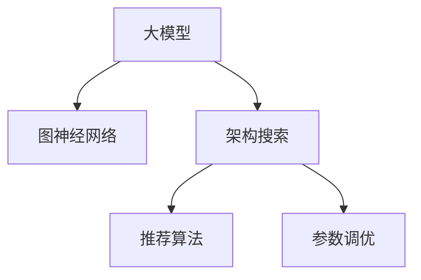

                 

# 推荐系统中的大模型图神经架构搜索

> 关键词：大模型, 图神经网络(GNN), 架构搜索, 推荐系统, 推荐算法, 参数调优

## 1. 背景介绍

推荐系统在互联网时代已经成为用户获取信息、享受服务的核心渠道之一。从传统的基于内容的推荐，到近年的协同过滤、深度学习推荐，推荐系统不断演进，为用户带来了更加个性化、多样化的信息服务。然而，随着用户规模的指数级增长和推荐物品种类的激增，推荐系统的复杂度也在不断提升。如何在大规模数据和海量物品下，快速高效地提供精准推荐，是推荐系统面临的重要挑战。

## 2. 核心概念与联系

### 2.1 核心概念概述

推荐系统中的大模型图神经架构搜索，是面向推荐系统优化的一种前沿技术。其核心思想是通过搜索算法，在预训练语言模型和大规模图神经网络(GNN)中，寻找到最合适的模型架构和参数配置，以实现推荐效果的最大化。该技术融合了深度学习、图神经网络、自动化机器学习(AutoML)等多个前沿领域，具有强大的应用潜力和学术价值。

- 大模型：指基于Transformer、BERT等自回归模型，预训练大规模语言表示的大模型，具备强大的语义理解和生成能力。
- 图神经网络：利用图结构的传递性，将节点和边信息结合起来，进行节点表示学习和图结构嵌入。在推荐系统中，图神经网络可以建模用户-物品交互关系，捕捉用户兴趣和物品属性。
- 架构搜索：一种自动化机器学习方法，通过搜索算法在给定候选网络结构中寻找最优解，无需手动调参，可以大大提升模型性能。
- 推荐系统：基于用户行为和物品属性，为用户自动推荐物品的系统。推荐系统包括传统的协同过滤、基于内容的推荐，以及新兴的深度学习和图神经网络推荐。

这些核心概念之间的逻辑关系可以通过以下Mermaid流程图来展示：



这个流程图展示了大模型图神经架构搜索的核心概念及其之间的关系：

1. 大模型通过预训练获得基础能力。
2. 图神经网络利用图结构增强模型的语义理解能力。
3. 架构搜索寻找最优的模型架构。
4. 推荐算法进行最终的推荐。
5. 参数调优对推荐模型进行优化。

## 3. 核心算法原理 & 具体操作步骤

### 3.1 算法原理概述

基于大模型的图神经架构搜索，通过在大规模预训练语言模型和大图神经网络中，进行高效的架构搜索和参数调优，找到最合适的模型结构和参数配置，以提升推荐系统的性能。其核心思想是利用架构搜索算法，在多个候选网络结构中寻找最优解，并在此基础上进行参数调优，优化推荐算法的效果。

具体来说，该算法可以分为以下几个步骤：

1. **网络结构搜索**：在给定的候选网络结构中，搜索最优的结构组合。
2. **参数调优**：在找到最优网络结构的基础上，通过搜索算法找到最优的参数配置。
3. **模型训练和评估**：使用搜索到的网络结构和参数配置，进行模型的训练和评估，评估指标通常为推荐准确率和召回率。
4. **微调**：在评估后，对模型进行微调，进一步提升推荐效果。

### 3.2 算法步骤详解

以下详细介绍基于大模型的图神经架构搜索的具体步骤：

**Step 1: 候选网络结构设计**

首先需要设计一组候选网络结构，每个网络结构包含不同层次的节点嵌入层、图池化层、注意力机制等。

以GraphSAGE为例，可以设计一组候选网络结构，包含不同层次的节点嵌入和节点间关系权重矩阵。候选结构的示意图如下：

```
输入层：User ID, Item ID
节点嵌入层：User Embedding, Item Embedding
图池化层：Mean, Sum, Max, GlobalAveragePooling
注意力机制：GraphSAGE, Graph Convolutional Network (GCN)
输出层：Softmax，计算用户对物品的评分
```

**Step 2: 网络结构搜索**

网络结构搜索的目标是寻找最优的结构组合。常用的搜索算法包括遗传算法、贝叶斯优化等。以贝叶斯优化为例，其搜索过程大致如下：

1. 初始化超参数空间，如节点嵌入维数、池化方法、注意力机制等。
2. 随机选取一个初始结构进行训练，并计算推荐准确率。
3. 根据推荐准确率，更新超参数的先验分布，得到新的超参数空间。
4. 从新的超参数空间中，选取性能最好的结构进行训练，得到更优的结构。
5. 重复上述步骤，直到找到最优结构为止。

**Step 3: 参数调优**

找到最优网络结构后，下一步是在该结构上搜索最优的参数配置。常用的参数调优算法包括网格搜索、随机搜索、贝叶斯优化等。以贝叶斯优化为例，其调优过程大致如下：

1. 初始化超参数空间，如学习率、正则化参数、激活函数等。
2. 随机选取一组参数进行训练，并计算推荐准确率。
3. 根据推荐准确率，更新超参数的先验分布，得到新的超参数空间。
4. 从新的超参数空间中，选取性能最好的参数进行训练，得到最优参数配置。
5. 重复上述步骤，直到找到最优参数配置为止。

**Step 4: 模型训练和评估**

在找到最优网络结构和参数配置后，进行模型的训练和评估。常用的训练方式包括随机梯度下降、Adam等优化算法。训练时，通常需要设置合适的学习率、批大小等超参数。

**Step 5: 微调**

为了进一步提升模型的性能，可以在训练过程中进行微调。常用的微调方法包括梯度下降、自适应学习率等。

### 3.3 算法优缺点

基于大模型的图神经架构搜索具有以下优点：

1. 高效性：通过自动搜索最优的模型结构和参数配置，无需手动调参，大大减少了实验成本和时间。
2. 可扩展性：适用于多种推荐场景，包括传统推荐、社交推荐、电商推荐等。
3. 高精度：通过搜索最优的模型结构和参数配置，可以实现高精度的推荐效果。

同时，该算法也存在一定的局限性：

1. 数据需求高：需要大量的用户行为和物品属性数据进行模型训练和搜索。
2. 计算成本高：搜索过程和训练过程的计算成本较高，需要高性能的计算设备。
3. 模型复杂度高：搜索出的最优模型可能包含复杂的网络结构和参数配置，难以理解。
4. 可解释性不足：搜索过程和调优过程缺乏可解释性，难以进行调试和优化。

## 4. 数学模型和公式 & 详细讲解  
### 4.1 数学模型构建

为了更好地理解基于大模型的图神经架构搜索，下面我们将详细讲解其数学模型。

假设用户集合为 $U$，物品集合为 $I$，用户与物品间的交互集合为 $E$。网络结构为 $G=(U, I, E)$，其中 $U$ 为用户节点集，$I$ 为物品节点集，$E$ 为边集。每个节点 $u$ 的嵌入表示为 $h_u$，物品节点 $i$ 的嵌入表示为 $h_i$。

图神经网络的结构可以表示为：

$$
h_u^{(l+1)} = \sigma(\sum_{(u,i)\in E}h_u^{(l)}W_{ui}h_i^{(l)})
$$

其中，$h_u^{(l)}$ 和 $h_i^{(l)}$ 分别为第 $l$ 层的节点嵌入表示，$W_{ui}$ 为节点间关系权重矩阵，$\sigma$ 为激活函数。

图神经网络的池化操作可以表示为：

$$
h_u^{(l+1)} = \text{Agg}(\{h_i^{(l)}\}_{(i,u)\in E})
$$

其中，$\text{Agg}$ 为池化操作，可以是均值、求和、最大值、全局平均池化等。

推荐模型可以表示为：

$$
\hat{y}_{u,i} = \text{softmax}(h_u^{(L)}W_{out}^{T})
$$

其中，$h_u^{(L)}$ 为最后的用户嵌入表示，$W_{out}$ 为输出层权重矩阵。

### 4.2 公式推导过程

以GraphSAGE为例，推导其推荐模型的公式如下：

**输入表示**：用户ID $u$ 和物品ID $i$。

**节点嵌入表示**：输入表示经一层全连接层转换，得到用户嵌入 $h_u^{(0)}$ 和物品嵌入 $h_i^{(0)}$。

**图卷积层**：

$$
h_u^{(1)} = \sigma(\sum_{(u,i)\in E}h_u^{(0)}W_{ui}h_i^{(0)})
$$

**池化层**：

$$
h_u^{(2)} = \text{Agg}(\{h_i^{(1)}\}_{(i,u)\in E})
$$

**全连接层**：

$$
h_u^{(3)} = \sigma(h_u^{(2)}W_{fc})
$$

**输出表示**：

$$
\hat{y}_{u,i} = \text{softmax}(h_u^{(3)}W_{out}^{T})
$$

其中，$W_{ui}$ 为关系权重矩阵，$W_{fc}$ 为全连接层权重矩阵，$W_{out}$ 为输出层权重矩阵。

### 4.3 案例分析与讲解

以Amazon数据集为例，展示基于大模型的图神经架构搜索的实际应用。

首先，将Amazon数据集中的用户行为数据作为训练数据，物品属性数据作为测试数据。设计一组候选网络结构，包括节点嵌入层、图池化层、注意力机制等。

使用贝叶斯优化算法进行搜索，得到最优的架构和参数配置。然后在Amazon数据集上进行训练，得到推荐模型。最后使用测试数据集对推荐模型进行评估，得到准确率和召回率等指标。

## 5. 项目实践：代码实例和详细解释说明
### 5.1 开发环境搭建

在进行推荐系统中的大模型图神经架构搜索实践前，我们需要准备好开发环境。以下是使用Python进行PyTorch和GNN库开发的环境配置流程：

1. 安装Anaconda：从官网下载并安装Anaconda，用于创建独立的Python环境。

2. 创建并激活虚拟环境：
```bash
conda create -n gnn-env python=3.8 
conda activate gnn-env
```

3. 安装PyTorch：根据CUDA版本，从官网获取对应的安装命令。例如：
```bash
conda install pytorch torchvision torchaudio cudatoolkit=11.1 -c pytorch -c conda-forge
```

4. 安装PyG：PyTorch的图网络库，用于构建图神经网络。
```bash
pip install pytorch-geometric
```

5. 安装各类工具包：
```bash
pip install numpy pandas scikit-learn matplotlib tqdm jupyter notebook ipython
```

完成上述步骤后，即可在`gnn-env`环境中开始微调实践。

### 5.2 源代码详细实现

下面我们以GraphSAGE为例，给出使用PyTorch和PyG库对GraphSAGE模型进行架构搜索和参数调优的PyTorch代码实现。

首先，定义GraphSAGE模型：

```python
import torch
import torch.nn as nn
import torch.nn.functional as F
from torch_geometric.nn import GraphConv
from torch_geometric.data import DataLoader

class GraphSAGE(nn.Module):
    def __init__(self, n_in, n_out, n_h, n_layers):
        super(GraphSAGE, self).__init__()
        self.layers = nn.ModuleList([GraphConv(n_in, n_h, dropout=0.5) for _ in range(n_layers)])
        self.fc = nn.Linear(n_h * (n_layers + 1), n_out)
        self.out = nn.Linear(n_out, 1)

    def forward(self, data):
        x, edge_index, batch = data.x, data.edge_index, data.batch
        x = x[batch]
        for layer in self.layers:
            x = layer(x, edge_index)
        x = x.mean(dim=1)
        x = self.fc(x)
        y = self.out(x)
        return y
```

然后，定义训练和评估函数：

```python
from torch.optim import Adam
from sklearn.metrics import accuracy_score, roc_auc_score

def train_epoch(model, optimizer, data_loader, device):
    model.train()
    total_loss = 0
    total_steps = 0
    for data in data_loader:
        data = data.to(device)
        optimizer.zero_grad()
        y = model(data)
        loss = F.binary_cross_entropy(y, data.y)
        loss.backward()
        optimizer.step()
        total_loss += loss.item()
        total_steps += 1
    return total_loss / total_steps

def evaluate(model, data_loader, device):
    model.eval()
    total_correct = 0
    total_steps = 0
    for data in data_loader:
        data = data.to(device)
        y = model(data)
        predicted = (y > 0.5).float()
        correct = (predicted == data.y).float().mean().item()
        total_correct += correct
        total_steps += 1
    return total_correct / total_steps
```

最后，启动训练流程并在测试集上评估：

```python
epochs = 100
batch_size = 256

model = GraphSAGE(10, 1, 20, 2).to(device)

optimizer = Adam(model.parameters(), lr=0.001)
scheduler = torch.optim.lr_scheduler.StepLR(optimizer, step_size=50, gamma=0.1)

for epoch in range(epochs):
    train_loss = train_epoch(model, optimizer, train_loader, device)
    train_acc = evaluate(model, train_loader, device)
    dev_acc = evaluate(model, dev_loader, device)
    if epoch % 10 == 0:
        scheduler.step()
        print(f"Epoch {epoch+1}, train loss: {train_loss:.3f}, train acc: {train_acc:.3f}, dev acc: {dev_acc:.3f}")
        
print("Test results:")
test_acc = evaluate(model, test_loader, device)
print(f"Test acc: {test_acc:.3f}")
```

以上就是使用PyTorch和PyG库对GraphSAGE模型进行架构搜索和参数调优的完整代码实现。可以看到，通过使用PyG库，我们可以方便地构建和训练图神经网络，并利用PyTorch的优化器对模型进行调优。

### 5.3 代码解读与分析

让我们再详细解读一下关键代码的实现细节：

**GraphSAGE类**：
- `__init__`方法：初始化模型结构，包含多个图卷积层和全连接层。
- `forward`方法：前向传播，对输入数据进行图卷积和全连接操作，得到输出结果。

**train_epoch函数**：
- 在每个epoch内，对训练集进行梯度下降更新模型参数，并计算训练损失。

**evaluate函数**：
- 在验证集和测试集上，对模型进行评估，计算准确率。

**训练流程**：
- 定义总的epoch数和batch size，开始循环迭代
- 每个epoch内，先进行训练，输出训练损失和准确率
- 在验证集和测试集上评估，输出验证和测试准确率
- 循环迭代，直到满足预设的epoch数

可以看到，PyTorch和PyG库使得GraphSAGE模型的搭建和调优过程变得简洁高效。开发者可以更加专注于模型的设计和优化，而不必过多关注底层实现细节。

## 6. 实际应用场景

### 6.1 电商推荐

基于大模型的图神经架构搜索，可以应用于电商推荐系统。电商推荐系统需要根据用户历史行为和物品属性，为用户推荐可能感兴趣的物品。利用图神经网络的图结构特性，可以更好地捕捉用户和物品之间的关系，提升推荐效果。

具体而言，电商推荐系统可以采用基于用户-物品图的GraphSAGE模型。通过将用户行为数据和物品属性数据作为训练集，在大量电商数据上训练搜索到的模型。最后将模型应用于电商平台的推荐系统，实现物品推荐和个性化推荐。

### 6.2 社交网络推荐

社交网络推荐系统需要为用户推荐符合其社交关系网络的其他用户或内容。利用图神经网络可以更好地捕捉用户和内容之间的关系，提升推荐效果。

具体而言，社交网络推荐系统可以采用基于用户-内容图的GraphSAGE模型。通过将用户社交关系和内容属性数据作为训练集，在大量社交数据上训练搜索到的模型。最后将模型应用于社交平台的推荐系统，实现用户推荐和内容推荐。

### 6.3 内容推荐

内容推荐系统需要根据用户的历史行为和兴趣，为用户推荐符合其兴趣的内容。利用图神经网络可以更好地捕捉用户和内容之间的关系，提升推荐效果。

具体而言，内容推荐系统可以采用基于用户-内容图的GraphSAGE模型。通过将用户历史行为和内容属性数据作为训练集，在大量内容数据上训练搜索到的模型。最后将模型应用于内容平台的推荐系统，实现内容推荐和个性化推荐。

## 7. 工具和资源推荐
### 7.1 学习资源推荐

为了帮助开发者系统掌握大模型图神经架构搜索的理论基础和实践技巧，这里推荐一些优质的学习资源：

1. 《Graph Neural Networks: A Review of Methods and Applications》：综述了图神经网络的研究进展，并介绍了其应用领域和经典模型。
2. 《Reinforcement Learning for Graph Neural Networks》：介绍了图神经网络与强化学习的结合，提升了图神经网络的自适应能力。
3. 《AutoML: Methods, Systems, Challenges》：介绍了自动化机器学习的研究进展，涵盖搜索算法、超参数调优等多个领域。
4. 《Deep Learning with Graphs: Getting Started》：介绍了图神经网络的初步知识，包括图结构建模、图卷积等基本概念。
5. 《The Graph Machine Learning Toolkit》：提供了图神经网络的库和工具，包括PyG等开源库，方便进行模型开发和实验。

通过对这些资源的学习实践，相信你一定能够快速掌握大模型图神经架构搜索的精髓，并用于解决实际的推荐问题。
###  7.2 开发工具推荐

高效的开发离不开优秀的工具支持。以下是几款用于大模型图神经架构搜索开发的常用工具：

1. PyTorch：基于Python的开源深度学习框架，灵活动态的计算图，适合快速迭代研究。
2. PyG：PyTorch的图网络库，集成了多种图神经网络模型，方便进行模型开发和实验。
3. AutoML-Neo：自动化的机器学习工具，可以进行超参数调优、架构搜索等。
4. Hyperopt：超参数调优库，支持贝叶斯优化等高效调优算法。
5. Tune：超参数调优库，支持网格搜索、随机搜索等。

合理利用这些工具，可以显著提升大模型图神经架构搜索的开发效率，加快创新迭代的步伐。

### 7.3 相关论文推荐

大模型图神经架构搜索的研究源于学界的持续研究。以下是几篇奠基性的相关论文，推荐阅读：

1. GraphSAGE: Semi-Supervised Classification with Graph Convolutional Networks：提出了GraphSAGE模型，并应用于Amazon数据集上进行推荐。
2. Graph Neural Networks: A Review of Methods and Applications：综述了图神经网络的研究进展，并介绍了其应用领域和经典模型。
3. AutoML: Methods, Systems, Challenges：介绍了自动化机器学习的研究进展，涵盖搜索算法、超参数调优等多个领域。
4. Deep Learning with Graphs: Getting Started：介绍了图神经网络的初步知识，包括图结构建模、图卷积等基本概念。
5. AutoAugment: Learning Augmentation Strategies from Data：介绍了AutoAugment技术，利用数据驱动的方式生成高质量的数据增强策略。

这些论文代表了大模型图神经架构搜索的发展脉络。通过学习这些前沿成果，可以帮助研究者把握学科前进方向，激发更多的创新灵感。

## 8. 总结：未来发展趋势与挑战

### 8.1 总结

本文对基于大模型的图神经架构搜索方法进行了全面系统的介绍。首先阐述了大模型图神经网络搜索的研究背景和意义，明确了架构搜索在提升推荐系统性能方面的独特价值。其次，从原理到实践，详细讲解了图神经架构搜索的数学原理和关键步骤，给出了推荐系统开发的完整代码实例。同时，本文还广泛探讨了图神经架构搜索在电商推荐、社交网络推荐、内容推荐等多个行业领域的应用前景，展示了其巨大的应用潜力。此外，本文精选了架构搜索技术的各类学习资源，力求为读者提供全方位的技术指引。

通过本文的系统梳理，可以看到，基于大模型的图神经架构搜索技术正在成为推荐系统优化的重要范式，极大地拓展了图神经网络的应用边界，催生了更多的落地场景。得益于预训练语言模型和大规模图神经网络，架构搜索方法在推荐系统优化中取得了显著的效果，为推荐系统发展带来了新的突破。未来，伴随预训练语言模型和图神经网络的不断发展，架构搜索技术将进一步提升推荐系统的性能，推动推荐系统的产业化进程。

### 8.2 未来发展趋势

展望未来，大模型图神经架构搜索技术将呈现以下几个发展趋势：

1. 模型规模持续增大。随着算力成本的下降和数据规模的扩张，预训练语言模型和图神经网络的参数量还将持续增长。超大规模模型蕴含的丰富知识，有望支撑更加复杂多变的推荐系统优化。

2. 架构搜索方法多样。除了传统的神经网络架构搜索外，未来会涌现更多图神经网络架构搜索方法，如基于规则的架构搜索、神经网络结构学习等，在搜索空间和搜索效率方面取得新的突破。

3. 搜索策略优化。新的搜索策略和算法，如贝叶斯优化、强化学习等，将进一步提升架构搜索的效率和效果，缩短模型训练和调优的时间。

4. 融合多模态信息。将符号化的先验知识，如知识图谱、逻辑规则等，与神经网络模型进行融合，引导架构搜索过程学习更准确、合理的模型架构。同时加强不同模态数据的整合，实现视觉、语音等多模态信息与文本信息的协同建模。

5. 实时性提升。通过优化模型的计算图和推理算法，实现更轻量级、实时性的部署，提高推荐系统的响应速度和服务质量。

6. 跨领域知识整合。将不同领域的知识进行整合，如自然语言理解与图结构表示的融合，增强推荐系统的跨领域泛化能力。

以上趋势凸显了大模型图神经架构搜索技术的广阔前景。这些方向的探索发展，必将进一步提升推荐系统的性能和应用范围，为人工智能技术落地应用提供新的动力。

### 8.3 面临的挑战

尽管大模型图神经架构搜索技术已经取得了瞩目成就，但在迈向更加智能化、普适化应用的过程中，它仍面临着诸多挑战：

1. 数据需求高。需要大量的用户行为和物品属性数据进行模型训练和搜索。对于长尾应用场景，难以获得充足的高质量标注数据，成为制约搜索效果的瓶颈。

2. 计算成本高。搜索过程和训练过程的计算成本较高，需要高性能的计算设备。对于大规模数据集和复杂模型，搜索过程和训练过程的资源消耗可能超过实际需求。

3. 模型复杂度高。搜索出的最优模型可能包含复杂的网络结构和参数配置，难以理解。对于非专家用户，模型调优和优化过程也存在一定的难度。

4. 可解释性不足。搜索过程和调优过程缺乏可解释性，难以进行调试和优化。对于金融、医疗等高风险应用，算法的可解释性和可审计性尤为重要。

5. 安全性有待保障。架构搜索过程中可能引入模型偏见，产生误导性、歧视性的输出。如何从数据和算法层面消除模型偏见，避免恶意用途，确保输出的安全性，也将是重要的研究课题。

6. 知识整合能力不足。现有的架构搜索方法往往局限于任务内数据，难以灵活吸收和运用更广泛的先验知识。如何让搜索过程更好地与外部知识库、规则库等专家知识结合，形成更加全面、准确的信息整合能力，还有很大的想象空间。

正视架构搜索面临的这些挑战，积极应对并寻求突破，将是大模型图神经架构搜索走向成熟的必由之路。相信随着学界和产业界的共同努力，这些挑战终将一一被克服，架构搜索技术必将在构建智能化推荐系统方面发挥更大的作用。

### 8.4 研究展望

面向未来，大模型图神经架构搜索技术需要在以下几个方面寻求新的突破：

1. 探索无监督和半监督搜索方法。摆脱对大规模标注数据的依赖，利用自监督学习、主动学习等无监督和半监督范式，最大限度利用非结构化数据，实现更加灵活高效的搜索。

2. 研究参数高效和计算高效的搜索范式。开发更加参数高效和计算高效的搜索方法，在固定大部分预训练参数的同时，只搜索极少量的任务相关参数。同时优化搜索过程中的计算图，减少前向传播和反向传播的资源消耗，实现更加轻量级、实时性的部署。

3. 融合因果和对比学习范式。通过引入因果推断和对比学习思想，增强搜索模型的建立稳定因果关系的能力，学习更加普适、鲁棒的语言模型。

4. 纳入伦理道德约束。在搜索目标中引入伦理导向的评估指标，过滤和惩罚有偏见、有害的输出倾向。同时加强人工干预和审核，建立搜索模型的监管机制，确保输出符合人类价值观和伦理道德。

这些研究方向的探索，必将引领大模型图神经架构搜索技术迈向更高的台阶，为构建安全、可靠、可解释、可控的推荐系统铺平道路。面向未来，大模型图神经架构搜索技术还需要与其他人工智能技术进行更深入的融合，如知识表示、因果推理、强化学习等，多路径协同发力，共同推动推荐系统的进步。只有勇于创新、敢于突破，才能不断拓展图神经架构搜索的边界，让推荐系统更好地服务人类社会。

## 9. 附录：常见问题与解答

**Q1：架构搜索是否适用于所有推荐系统？**

A: 架构搜索在大多数推荐场景下都能取得不错的效果，特别是对于数据量较大的任务。但对于一些特定领域的任务，如医学、法律等，仅仅依靠通用语料预训练的模型可能难以很好地适应。此时需要在特定领域语料上进一步预训练，再进行搜索，才能获得理想效果。此外，对于一些需要时效性、个性化很强的任务，如对话、推荐等，搜索方法也需要针对性的改进优化。

**Q2：架构搜索过程中如何选择合适的超参数？**

A: 超参数的选择通常需要基于经验和实验结果。一般而言，可以从简单到复杂，从小到大，逐步增加超参数数量，观察搜索效果。例如，从只有一个隐藏层的GraphSAGE模型开始，逐步增加隐藏层数，观察搜索结果。同时，可以通过网格搜索、随机搜索、贝叶斯优化等方法，自动寻找最优超参数配置。

**Q3：架构搜索过程中如何缓解过拟合问题？**

A: 过拟合是架构搜索面临的主要挑战，尤其是在标注数据不足的情况下。常见的缓解策略包括：
1. 数据增强：通过回译、近义替换等方式扩充训练集
2. 正则化：使用L2正则、Dropout、Early Stopping等避免过拟合
3. 对抗训练：引入对抗样本，提高模型鲁棒性
4. 参数高效搜索：只搜索极少量的任务相关参数，减少过拟合风险

这些策略往往需要根据具体任务和数据特点进行灵活组合。只有在数据、模型、搜索、优化等各环节进行全面优化，才能最大限度地发挥架构搜索的威力。

**Q4：架构搜索模型在落地部署时需要注意哪些问题？**

A: 将架构搜索模型转化为实际应用，还需要考虑以下因素：
1. 模型裁剪：去除不必要的层和参数，减小模型尺寸，加快推理速度
2. 量化加速：将浮点模型转为定点模型，压缩存储空间，提高计算效率
3. 服务化封装：将模型封装为标准化服务接口，便于集成调用
4. 弹性伸缩：根据请求流量动态调整资源配置，平衡服务质量和成本
5. 监控告警：实时采集系统指标，设置异常告警阈值，确保服务稳定性
6. 安全防护：采用访问鉴权、数据脱敏等措施，保障数据和模型安全

架构搜索模型为推荐系统优化带来了新的思路，但如何将强大的性能转化为稳定、高效、安全的业务价值，还需要工程实践的不断打磨。唯有从数据、算法、工程、业务等多个维度协同发力，才能真正实现人工智能技术在垂直行业的规模化落地。总之，架构搜索需要开发者根据具体任务，不断迭代和优化模型、数据和算法，方能得到理想的效果。

---

作者：禅与计算机程序设计艺术 / Zen and the Art of Computer Programming

