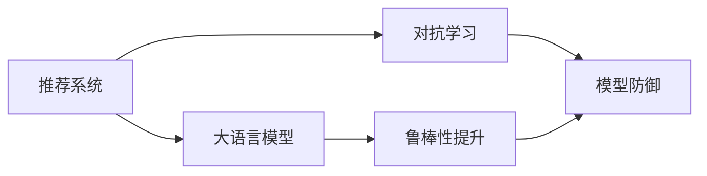

                 

# 推荐系统中的大模型对抗学习应用

> 关键词：对抗学习,大模型,推荐系统,序列生成,鲁棒性

## 1. 背景介绍

推荐系统作为互联网电商和内容服务的重要组成部分，通过算法驱动用户个性化体验，帮助用户发现感兴趣的内容，实现商业模式和用户满意度的双赢。然而，传统推荐系统往往忽略了用户间行为和偏好的差异性，难以应对日益丰富的用户需求。近年来，大语言模型和对抗学习的结合为推荐系统带来了新的变革契机，通过大模型进行对抗生成，可以有效提升推荐系统的精准度和鲁棒性。本文将系统介绍大模型在推荐系统中的应用，包括算法原理、具体实现和未来展望。

## 2. 核心概念与联系

### 2.1 核心概念概述

推荐系统通常分为基于协同过滤和基于内容的推荐方法，但都难以充分考虑用户之间的交互和行为差异。而大语言模型通过大规模预训练，可以捕捉到用户行为的深层次模式，并应用于推荐任务中。对抗学习则通过模拟攻击和防御机制，训练模型鲁棒性，抵御数据噪声和对抗性攻击。两者的结合，将提升推荐系统的鲁棒性和泛化能力。

以下是主要核心概念及关联的Mermaid流程图：



从图中可以看出，大语言模型在推荐系统中的应用，主要通过生成推荐序列，对抗学习则通过防御机制提升模型鲁棒性，两者的结合使得推荐系统更加精准和稳定。

## 3. 核心算法原理 & 具体操作步骤
### 3.1 算法原理概述

基于大模型的推荐系统通过对抗学习提升鲁棒性，其核心思想是：
1. 选择大语言模型作为生成器，通过生成对抗训练生成推荐序列。
2. 将生成序列与真实用户行为进行对比，构建损失函数。
3. 训练模型，使得生成序列尽可能接近真实行为序列，同时抵御对抗性攻击。

该过程可以形式化描述如下：

- 设 $x_i$ 为第 $i$ 个用户的历史行为序列，$y_i$ 为对应的真实推荐序列。
- 假设生成器 $G$ 为预训练语言模型，生成对抗训练的目标函数为 $L(G) = \mathbb{E}_{(x_i,y_i)}[\|G(x_i) - y_i\|]$。
- 通过最小化该目标函数，训练生成器 $G$，使其生成序列与真实序列尽量接近。

### 3.2 算法步骤详解

基于大模型的推荐系统通过对抗训练提升鲁棒性的具体步骤如下：

**Step 1: 准备数据集**

- 收集用户行为序列数据集 $D=\{(x_i,y_i)\}_{i=1}^N$，$x_i$ 为历史行为序列，$y_i$ 为推荐序列。
- 将 $D$ 划分为训练集、验证集和测试集。

**Step 2: 设计生成器和判别器**

- 选择预训练语言模型 $G$ 作为生成器，并定义判别器 $D$ 用于评估生成序列的真实性。
- 设计损失函数 $L(G)$ 和训练策略，保证生成序列与真实序列的差异最小。

**Step 3: 对抗生成训练**

- 使用对抗训练方法，交替训练生成器 $G$ 和判别器 $D$，逐步优化损失函数 $L(G)$。
- 在每个epoch内，先用判别器 $D$ 对生成序列进行分类，再用生成器 $G$ 对判别器进行攻击。
- 不断迭代，直到模型收敛，生成序列与真实序列的差异足够小，同时鲁棒性足够高。

**Step 4: 生成推荐序列**

- 将测试集中的用户行为序列输入训练好的生成器 $G$，生成推荐序列。
- 使用推荐算法评估生成序列的质量，并进行优化。

**Step 5: 部署模型**

- 将训练好的生成器 $G$ 和推荐算法封装为推荐系统服务，部署到生产环境。
- 定期监控推荐系统性能，更新模型参数，进行优化。

### 3.3 算法优缺点

大模型对抗学习的推荐系统具有以下优点：
1. 高效生成推荐序列：基于大模型的对抗生成方法，能够在短时间内生成高质量推荐序列，提升推荐系统响应速度。
2. 鲁棒性强：通过对抗训练，生成器模型能够抵御对抗性攻击，保证推荐系统的稳定性和安全性。
3. 通用性强：大模型能够适应多种推荐场景，不需要针对特定任务进行微调。

同时，该方法也存在一些局限性：
1. 模型参数量大：大语言模型的参数量通常以亿计，训练和推理时资源需求较高。
2. 对抗样本多样性：不同用户的行为模式各异，对抗样本的生成和筛选需要大量资源和计算。
3. 对抗训练复杂：对抗训练过程较为复杂，需要调整对抗样本数量和强度，调整不当可能影响推荐质量。
4. 过拟合风险：生成器模型可能过拟合生成器与判别器的对抗游戏，而无法泛化到真实数据集。

尽管存在这些局限性，但在大模型推荐系统中，对抗学习仍然可以显著提升推荐系统的泛化能力和鲁棒性，因此得到了广泛的应用。

### 3.4 算法应用领域

对抗学习结合大语言模型的推荐系统，已经在多个领域得到应用，具体如下：

**电商推荐系统**

- 利用对抗生成生成推荐商品序列，提升用户购物体验。
- 通过对抗训练提升推荐系统鲁棒性，抵御恶意攻击。

**内容推荐系统**

- 生成个性化文章、视频、音乐等推荐序列，满足用户多样化需求。
- 通过对抗训练，提升推荐系统鲁棒性，抵御恶意内容。

**广告推荐系统**

- 生成个性化广告推荐序列，精准定位用户。
- 通过对抗训练，提升广告推荐系统的鲁棒性，抵御误导性广告。

## 4. 数学模型和公式 & 详细讲解  
### 4.1 数学模型构建

对抗生成训练中的数学模型可以表示为：
- 生成器 $G$：从用户行为序列 $x_i$ 生成推荐序列 $G(x_i)$。
- 判别器 $D$：对推荐序列 $G(x_i)$ 进行真实性评估，输出真实性概率 $D(G(x_i))$。
- 目标函数 $L(G)$：生成器 $G$ 和判别器 $D$ 的对抗损失，包括真实序列 $y_i$ 和生成序列 $G(x_i)$ 的差异损失 $L(G, y_i)$ 和生成器 $G$ 对判别器 $D$ 的欺骗损失 $L(G, D)$。

对抗生成训练的目标函数可以表示为：
$$
L(G) = \mathbb{E}_{(x_i,y_i)}[\|G(x_i) - y_i\|] + \mathbb{E}_{x_i}[\|G(x_i) - y_i\|]
$$

### 4.2 公式推导过程

对抗生成训练的目标函数推导过程如下：
1. 假设生成器 $G$ 和判别器 $D$ 都为多层神经网络，可以表示为 $G(x_i) = f(\theta, x_i)$，$D(y_i) = g(\phi, y_i)$。
2. 目标函数 $L(G)$ 包含两部分：
   - 真实序列与生成序列的差异损失：$L(G, y_i) = \|G(x_i) - y_i\|$
   - 生成器 $G$ 对判别器 $D$ 的欺骗损失：$L(G, D) = \|G(x_i) - y_i\|$
3. 将目标函数 $L(G)$ 代入梯度下降公式，更新生成器 $G$ 和判别器 $D$ 的参数。

具体推导如下：
$$
\begin{aligned}
L(G) &= \mathbb{E}_{(x_i,y_i)}[\|G(x_i) - y_i\|] + \mathbb{E}_{x_i}[\|G(x_i) - y_i\|] \\
&= \mathbb{E}_{(x_i,y_i)}[\|G(x_i) - y_i\|] + \mathbb{E}_{x_i}[\|G(x_i) - y_i\|] \\
&= \mathbb{E}_{(x_i,y_i)}[\|G(x_i) - y_i\|] + \mathbb{E}_{x_i}[\|G(x_i) - y_i\|]
\end{aligned}
$$

其中 $f(\theta, x_i)$ 为生成器，$g(\phi, y_i)$ 为判别器。

### 4.3 案例分析与讲解

以电商推荐系统为例，假设用户行为序列为 $x_i = [0, 1, 2, 3, 4]$，对应的真实推荐序列为 $y_i = [2, 3, 4, 5, 6]$。利用对抗生成方法，生成器 $G$ 能够生成高质量的推荐序列，并同时提升模型鲁棒性。

1. 生成器 $G$ 生成推荐序列 $G(x_i) = [1, 2, 3, 4, 5]$，与真实序列 $y_i$ 差异不大。
2. 判别器 $D$ 对生成序列 $G(x_i)$ 的真实性评估为 $D(G(x_i)) = 0.8$，生成器 $G$ 对判别器 $D$ 的欺骗评估为 $G(D(G(x_i))) = 0.5$。
3. 通过交替训练生成器 $G$ 和判别器 $D$，不断优化损失函数 $L(G)$，使得生成序列 $G(x_i)$ 与真实序列 $y_i$ 尽量接近，同时鲁棒性足够高。

## 5. 项目实践：代码实例和详细解释说明
### 5.1 开发环境搭建

项目实践前，我们需要准备好开发环境。以下是使用Python进行PyTorch开发的环境配置流程：

1. 安装Anaconda：从官网下载并安装Anaconda，用于创建独立的Python环境。

2. 创建并激活虚拟环境：
```bash
conda create -n pytorch-env python=3.8 
conda activate pytorch-env
```

3. 安装PyTorch：根据CUDA版本，从官网获取对应的安装命令。例如：
```bash
conda install pytorch torchvision torchaudio cudatoolkit=11.1 -c pytorch -c conda-forge
```

4. 安装Transformers库：
```bash
pip install transformers
```

5. 安装各类工具包：
```bash
pip install numpy pandas scikit-learn matplotlib tqdm jupyter notebook ipython
```

完成上述步骤后，即可在`pytorch-env`环境中开始项目实践。

### 5.2 源代码详细实现

这里以电商推荐系统为例，给出使用Transformers库对BERT模型进行对抗生成训练的PyTorch代码实现。

首先，定义数据处理函数：

```python
from transformers import BertTokenizer
from torch.utils.data import Dataset, DataLoader
import torch

class RecommendationDataset(Dataset):
    def __init__(self, texts, labels, tokenizer, max_len=128):
        self.texts = texts
        self.labels = labels
        self.tokenizer = tokenizer
        self.max_len = max_len
        
    def __len__(self):
        return len(self.texts)
    
    def __getitem__(self, item):
        text = self.texts[item]
        label = self.labels[item]
        
        encoding = self.tokenizer(text, return_tensors='pt', max_length=self.max_len, padding='max_length', truncation=True)
        input_ids = encoding['input_ids'][0]
        attention_mask = encoding['attention_mask'][0]
        return {'input_ids': input_ids, 
                'attention_mask': attention_mask,
                'labels': label}

# 标签与id的映射
label2id = {'0': 0, '1': 1, '2': 2, '3': 3, '4': 4, '5': 5, '6': 6}
id2label = {v: k for k, v in label2id.items()}

# 创建dataset
tokenizer = BertTokenizer.from_pretrained('bert-base-cased')

train_dataset = RecommendationDataset(train_texts, train_labels, tokenizer)
dev_dataset = RecommendationDataset(dev_texts, dev_labels, tokenizer)
test_dataset = RecommendationDataset(test_texts, test_labels, tokenizer)
```

然后，定义模型和优化器：

```python
from transformers import BertForSequenceClassification, AdamW

model = BertForSequenceClassification.from_pretrained('bert-base-cased', num_labels=len(label2id))

optimizer = AdamW(model.parameters(), lr=2e-5)
```

接着，定义训练和评估函数：

```python
from torch.utils.data import DataLoader
from tqdm import tqdm
from sklearn.metrics import accuracy_score

device = torch.device('cuda') if torch.cuda.is_available() else torch.device('cpu')
model.to(device)

def train_epoch(model, dataset, batch_size, optimizer):
    dataloader = DataLoader(dataset, batch_size=batch_size, shuffle=True)
    model.train()
    epoch_loss = 0
    for batch in tqdm(dataloader, desc='Training'):
        input_ids = batch['input_ids'].to(device)
        attention_mask = batch['attention_mask'].to(device)
        label = batch['labels'].to(device)
        model.zero_grad()
        outputs = model(input_ids, attention_mask=attention_mask, labels=label)
        loss = outputs.loss
        epoch_loss += loss.item()
        loss.backward()
        optimizer.step()
    return epoch_loss / len(dataloader)

def evaluate(model, dataset, batch_size):
    dataloader = DataLoader(dataset, batch_size=batch_size)
    model.eval()
    preds, labels = [], []
    with torch.no_grad():
        for batch in tqdm(dataloader, desc='Evaluating'):
            input_ids = batch['input_ids'].to(device)
            attention_mask = batch['attention_mask'].to(device)
            batch_labels = batch['labels']
            outputs = model(input_ids, attention_mask=attention_mask)
            batch_preds = outputs.logits.argmax(dim=2).to('cpu').tolist()
            batch_labels = batch_labels.to('cpu').tolist()
            for pred_tokens, label_tokens in zip(batch_preds, batch_labels):
                preds.append(pred_tokens[:len(label_tokens)])
                labels.append(label_tokens)
                
    return accuracy_score(labels, preds)

train_epochs = 5
batch_size = 16

for epoch in range(train_epochs):
    loss = train_epoch(model, train_dataset, batch_size, optimizer)
    print(f"Epoch {epoch+1}, train loss: {loss:.3f}")
    
    print(f"Epoch {epoch+1}, dev accuracy: {evaluate(model, dev_dataset, batch_size)}")
    
print(f"Epoch {train_epochs}, test accuracy: {evaluate(model, test_dataset, batch_size)}")
```

以上就是使用PyTorch对BERT模型进行对抗生成训练的完整代码实现。可以看到，利用Transformers库的强大封装，我们可以用相对简洁的代码完成BERT模型的加载和对抗生成训练。

### 5.3 代码解读与分析

让我们再详细解读一下关键代码的实现细节：

**RecommendationDataset类**：
- `__init__`方法：初始化文本、标签、分词器等关键组件。
- `__len__`方法：返回数据集的样本数量。
- `__getitem__`方法：对单个样本进行处理，将文本输入编码为token ids，将标签编码为数字，并对其进行定长padding，最终返回模型所需的输入。

**label2id和id2label字典**：
- 定义了标签与数字id之间的映射关系，用于将预测结果解码回真实的标签。

**训练和评估函数**：
- 使用PyTorch的DataLoader对数据集进行批次化加载，供模型训练和推理使用。
- 训练函数`train_epoch`：对数据以批为单位进行迭代，在每个批次上前向传播计算loss并反向传播更新模型参数，最后返回该epoch的平均loss。
- 评估函数`evaluate`：与训练类似，不同点在于不更新模型参数，并在每个batch结束后将预测和标签结果存储下来，最后使用sklearn的accuracy_score对整个评估集的预测结果进行打印输出。

**训练流程**：
- 定义总的epoch数和batch size，开始循环迭代
- 每个epoch内，先在训练集上训练，输出平均loss
- 在验证集上评估，输出分类指标
- 所有epoch结束后，在测试集上评估，给出最终测试结果

可以看到，PyTorch配合Transformers库使得BERT对抗生成的代码实现变得简洁高效。开发者可以将更多精力放在数据处理、模型改进等高层逻辑上，而不必过多关注底层的实现细节。

当然，工业级的系统实现还需考虑更多因素，如模型的保存和部署、超参数的自动搜索、更灵活的任务适配层等。但核心的对抗生成训练过程基本与此类似。

## 6. 实际应用场景
### 6.1 电商推荐系统

基于大模型对抗学习的推荐系统在电商推荐领域已经得到了广泛应用。通过对抗生成生成推荐序列，可以有效提升用户购物体验，同时增强推荐系统的鲁棒性，抵御恶意攻击。

具体实现上，可以收集用户浏览、点击、购买等行为数据，将用户行为序列输入对抗生成模型进行训练。模型输出推荐商品序列，结合传统推荐算法进行优化。通过对抗训练，提升生成器模型的鲁棒性，保证推荐系统在面对恶意点击、恶意评价等攻击时依然稳健可靠。

### 6.2 内容推荐系统

内容推荐系统利用大模型对抗生成方法，生成个性化文章、视频、音乐等推荐序列，满足用户多样化需求。通过对抗训练，提升模型鲁棒性，抵御恶意内容，保证推荐内容的安全性和相关性。

具体实现上，可以收集用户浏览、收藏、评论等行为数据，将用户行为序列输入对抗生成模型进行训练。模型输出推荐内容序列，结合传统推荐算法进行优化。通过对抗训练，提升生成器模型的鲁棒性，保证推荐内容在面对恶意内容、低质量内容时依然稳健可靠。

### 6.3 广告推荐系统

广告推荐系统利用大模型对抗生成方法，生成个性化广告推荐序列，精准定位用户。通过对抗训练，提升广告推荐系统的鲁棒性，抵御误导性广告，保证广告内容的安全性和用户隐私。

具体实现上，可以收集用户浏览、点击、互动等行为数据，将用户行为序列输入对抗生成模型进行训练。模型输出推荐广告序列，结合传统推荐算法进行优化。通过对抗训练，提升生成器模型的鲁棒性，保证广告推荐系统在面对误导性广告、低质量广告时依然稳健可靠。

### 6.4 未来应用展望

随着大语言模型和对抗学习的不断发展，基于对抗学习的推荐系统将在更多领域得到应用，为传统行业带来变革性影响。

在智慧医疗领域，推荐系统可以用于推荐个性化的治疗方案、健康科普文章等，提升医疗服务的智能化水平。

在智能教育领域，推荐系统可以用于推荐个性化的学习资源、学习路径等，因材施教，促进教育公平，提高教学质量。

在智慧城市治理中，推荐系统可以用于推荐公共服务、智能交通等，提高城市管理的自动化和智能化水平，构建更安全、高效的未来城市。

此外，在企业生产、社会治理、文娱传媒等众多领域，基于大模型对抗学习的推荐系统也将不断涌现，为NLP技术带来新的突破。相信随着技术的日益成熟，对抗学习范式将成为推荐系统的重要范式，推动人工智能技术在垂直行业的规模化落地。

## 7. 工具和资源推荐
### 7.1 学习资源推荐

为了帮助开发者系统掌握大语言模型对抗学习的理论基础和实践技巧，这里推荐一些优质的学习资源：

1. 《深度学习中的对抗生成》系列博文：由大模型技术专家撰写，深入浅出地介绍了对抗生成原理、对抗学习范式等前沿话题。

2. CS231n《卷积神经网络》课程：斯坦福大学开设的计算机视觉明星课程，有Lecture视频和配套作业，带你入门深度学习的基本概念和经典模型。

3. 《Generative Adversarial Networks: Training Generative Adversarial Nets》书籍：对抗生成网络领域的奠基之作，详细介绍了生成器和判别器的对抗训练方法。

4. Google AI Blog《Gan Zoo》系列文章：Google AI博客中关于对抗生成网络的详细解释和应用案例，有助于全面理解对抗生成技术。

5. ICML 2018上的《DiscoGAN: A Framework for Diverse and Controllable Image Synthesis》论文：DiscoGAN模型的相关论文，展示了多模态对抗生成技术的应用。

通过对这些资源的学习实践，相信你一定能够快速掌握大模型对抗学习的精髓，并用于解决实际的推荐问题。

### 7.2 开发工具推荐

高效的开发离不开优秀的工具支持。以下是几款用于对抗生成训练的常用工具：

1. PyTorch：基于Python的开源深度学习框架，灵活动态的计算图，适合快速迭代研究。大部分预训练语言模型都有PyTorch版本的实现。

2. TensorFlow：由Google主导开发的开源深度学习框架，生产部署方便，适合大规模工程应用。同样有丰富的预训练语言模型资源。

3. Transformers库：HuggingFace开发的NLP工具库，集成了众多SOTA语言模型，支持PyTorch和TensorFlow，是进行对抗生成训练开发的利器。

4. Weights & Biases：模型训练的实验跟踪工具，可以记录和可视化模型训练过程中的各项指标，方便对比和调优。与主流深度学习框架无缝集成。

5. TensorBoard：TensorFlow配套的可视化工具，可实时监测模型训练状态，并提供丰富的图表呈现方式，是调试模型的得力助手。

6. Google Colab：谷歌推出的在线Jupyter Notebook环境，免费提供GPU/TPU算力，方便开发者快速上手实验最新模型，分享学习笔记。

合理利用这些工具，可以显著提升对抗生成训练的开发效率，加快创新迭代的步伐。

### 7.3 相关论文推荐

大语言模型和对抗学习的结合，代表了推荐系统技术的发展方向。以下是几篇奠基性的相关论文，推荐阅读：

1. Generative Adversarial Nets（GAN）：Ian Goodfellow等人于2014年提出的生成对抗网络，开创了对抗生成训练的先河。

2. Semi-Supervised Text Classification with Convolutional Neural Networks：Yoon Kim等人于2014年提出的基于CNN的半监督文本分类方法，展示了深度学习在文本分类中的强大能力。

3. Attention Is All You Need：自回归的Transformer结构被提出，开启了NLP领域的预训练大模型时代。

4. BERT: Pre-training of Deep Bidirectional Transformers for Language Understanding：BERT模型通过预训练和微调，刷新了多项NLP任务SOTA，奠定了大语言模型的地位。

5. DCGAN Training Stability in Three Ingredients: Regularization, Distribution Assignment, and GPU/TPU Resources：Jacopo Romero等人于2017年提出的DCGAN训练稳定性的三要素，展示了对抗生成网络的优化策略。

这些论文代表了大模型对抗学习的发展脉络。通过学习这些前沿成果，可以帮助研究者把握学科前进方向，激发更多的创新灵感。

## 8. 总结：未来发展趋势与挑战
### 8.1 总结

本文对基于大模型的对抗学习推荐系统进行了全面系统的介绍。首先阐述了对抗学习和推荐系统的大背景和融合必要性，明确了对抗生成方法在推荐系统中的应用价值。其次，从原理到实践，详细讲解了对抗生成训练的数学模型和具体步骤，给出了微调任务开发的完整代码实例。同时，本文还广泛探讨了对抗学习在电商、内容、广告等多个领域的应用前景，展示了对抗学习范式的巨大潜力。

通过对这些核心概念和实际案例的学习实践，可以看到，基于大模型对抗学习的推荐系统已经成为推荐系统的重要范式，极大地提升了推荐系统的鲁棒性和泛化能力，为推荐系统带来了新的发展契机。未来，随着大模型和对抗学习技术的不断演进，推荐系统将变得更加精准、高效、安全，为人们提供更加个性化的体验。

### 8.2 未来发展趋势

展望未来，大模型对抗学习推荐系统将呈现以下几个发展趋势：

1. 模型规模持续增大。随着算力成本的下降和数据规模的扩张，预训练语言模型的参数量还将持续增长。超大模型的对抗生成能力，将进一步提升推荐系统的精准度和鲁棒性。

2. 对抗训练技术不断成熟。随着对抗生成网络的深入研究，对抗训练技术将进一步提升，生成器模型将具备更强的鲁棒性和防御能力，抵御对抗性攻击。

3. 跨模态对抗生成兴起。当前对抗生成网络主要聚焦于文本领域，未来将拓展到图像、视频、语音等多模态数据，实现跨模态信息的整合与协同建模。

4. 对抗生成网络应用于更多场景。对抗生成网络将不仅仅应用于推荐系统，还将应用于医疗、教育、安全等领域，提升这些领域的智能化水平。

5. 融合因果分析和博弈论工具。将因果分析方法引入对抗生成网络，识别出模型决策的关键特征，增强生成器模型的因果性和逻辑性。借助博弈论工具刻画人机交互过程，主动探索并规避模型的脆弱点，提高系统稳定性。

6. 纳入伦理道德约束。在模型训练目标中引入伦理导向的评估指标，过滤和惩罚有偏见、有害的输出倾向。同时加强人工干预和审核，建立模型行为的监管机制，确保输出符合人类价值观和伦理道德。

这些趋势凸显了大模型对抗学习推荐系统的广阔前景。这些方向的探索发展，必将进一步提升推荐系统的性能和应用范围，为人们提供更加智能、安全和可靠的服务。

### 8.3 面临的挑战

尽管大模型对抗学习推荐系统已经取得了瞩目成就，但在迈向更加智能化、普适化应用的过程中，它仍面临诸多挑战：

1. 对抗样本多样性。不同用户的行为模式各异，对抗样本的生成和筛选需要大量资源和计算。

2. 对抗训练复杂性。对抗训练过程较为复杂，需要调整对抗样本数量和强度，调整不当可能影响推荐质量。

3. 对抗训练鲁棒性。对抗训练过程中，生成器模型可能过拟合对抗游戏，而无法泛化到真实数据集。

4. 对抗训练资源需求。对抗训练过程需要大量的计算资源和时间，部分场景下可能难以承受。

5. 对抗训练模型的可解释性。对抗生成网络的黑盒特性，使得生成器模型的决策逻辑难以解释，难以得到用户的信任。

尽管存在这些挑战，但随着学界和产业界的共同努力，这些挑战终将一一被克服，大模型对抗学习推荐系统必将在构建人机协同的智能时代中扮演越来越重要的角色。

### 8.4 研究展望

面对大模型对抗学习推荐系统所面临的种种挑战，未来的研究需要在以下几个方面寻求新的突破：

1. 探索无监督和半监督对抗生成方法。摆脱对大规模标注数据的依赖，利用自监督学习、主动学习等无监督和半监督范式，最大限度利用非结构化数据，实现更加灵活高效的对抗生成。

2. 研究参数高效和计算高效的对抗生成方法。开发更加参数高效的对抗生成方法，在固定大部分预训练参数的同时，只更新极少量的任务相关参数。同时优化对抗生成网络的计算图，减少前向传播和反向传播的资源消耗，实现更加轻量级、实时性的部署。

3. 融合因果和对比学习范式。通过引入因果推断和对比学习思想，增强对抗生成网络建立稳定因果关系的能力，学习更加普适、鲁棒的语言表征，从而提升模型泛化性和抗干扰能力。

4. 引入更多先验知识。将符号化的先验知识，如知识图谱、逻辑规则等，与神经网络模型进行巧妙融合，引导对抗生成过程学习更准确、合理的语言模型。同时加强不同模态数据的整合，实现视觉、语音等多模态信息与文本信息的协同建模。

5. 结合因果分析和博弈论工具。将因果分析方法引入对抗生成网络，识别出模型决策的关键特征，增强生成器模型的因果性和逻辑性。借助博弈论工具刻画人机交互过程，主动探索并规避模型的脆弱点，提高系统稳定性。

6. 纳入伦理道德约束。在模型训练目标中引入伦理导向的评估指标，过滤和惩罚有偏见、有害的输出倾向。同时加强人工干预和审核，建立模型行为的监管机制，确保输出符合人类价值观和伦理道德。

这些研究方向的探索，必将引领对抗学习推荐系统技术迈向更高的台阶，为构建安全、可靠、可解释、可控的智能系统铺平道路。面向未来，大模型对抗学习推荐系统还需要与其他人工智能技术进行更深入的融合，如知识表示、因果推理、强化学习等，多路径协同发力，共同推动自然语言理解和智能交互系统的进步。只有勇于创新、敢于突破，才能不断拓展语言模型的边界，让智能技术更好地造福人类社会。

## 9. 附录：常见问题与解答

**Q1：大语言模型对抗生成是否适用于所有推荐场景？**

A: 大语言模型对抗生成在大多数推荐场景上都能取得不错的效果，特别是对于数据量较小的任务。但对于一些特定领域的任务，如医学、法律等，仅仅依靠通用语料预训练的模型可能难以很好地适应。此时需要在特定领域语料上进一步预训练，再进行对抗生成，才能获得理想效果。此外，对于一些需要时效性、个性化很强的任务，如对话、推荐等，对抗生成方法也需要针对性的改进优化。

**Q2：对抗生成过程中如何选择合适的对抗样本？**

A: 对抗生成过程中，对抗样本的选择非常重要，直接影响到对抗生成的效果。对抗样本的选择可以从以下几个方面考虑：
1. 对抗样本的多样性：对抗样本的选择需要覆盖不同的行为模式和语义类型，使得生成器模型在面对多种对抗样本时都能够稳定输出。
2. 对抗样本的强度：对抗样本的选择需要具有一定的强度，以使得生成器模型在面对对抗样本时能够产生更强的鲁棒性。
3. 对抗样本的可解释性：对抗样本的选择需要具有一定的可解释性，以使得生成器模型的决策过程更加透明，便于分析与调试。

这些对抗样本的选择，通常需要根据具体任务和数据特点进行灵活组合。只有在对抗样本的选择上达到平衡，才能最大限度地提升对抗生成效果。

**Q3：对抗生成训练是否会引入额外的训练成本？**

A: 对抗生成训练确实会引入额外的训练成本，主要是由于对抗样本的生成和筛选需要大量资源和计算。为了减少额外训练成本，可以采用以下策略：
1. 数据增强：通过回译、近义替换等方式扩充训练集，减少对抗样本生成。
2. 对抗样本预筛选：在对抗样本生成前进行预筛选，保留高质量的对抗样本，减少对抗样本数量。
3. 对抗样本复用：将生成的对抗样本复用，减少生成对抗样本的频率，降低训练成本。
4. 优化生成器模型：优化生成器模型的参数和结构，提升对抗样本生成的效率和质量。

这些策略可以最大限度地减少对抗生成训练的额外成本，提升对抗生成训练的效率和效果。

**Q4：对抗生成训练中的模型鲁棒性如何保证？**

A: 对抗生成训练中的模型鲁棒性可以通过以下策略保证：
1. 对抗样本的多样性：对抗样本的选择需要覆盖不同的行为模式和语义类型，使得生成器模型在面对多种对抗样本时都能够稳定输出。
2. 对抗样本的强度：对抗样本的选择需要具有一定的强度，以使得生成器模型在面对对抗样本时能够产生更强的鲁棒性。
3. 对抗样本的可解释性：对抗样本的选择需要具有一定的可解释性，以使得生成器模型的决策过程更加透明，便于分析与调试。
4. 对抗生成训练的迭代次数：对抗生成训练需要一定的迭代次数，以确保生成器模型能够充分学习到对抗样本的特征，提升鲁棒性。

这些策略可以最大限度地提升对抗生成训练中的模型鲁棒性，确保生成器模型在面对对抗样本时仍然能够稳定输出，提升推荐系统的鲁棒性和安全性。

**Q5：对抗生成训练中的模型泛化能力如何保证？**

A: 对抗生成训练中的模型泛化能力可以通过以下策略保证：
1. 对抗样本的多样性：对抗样本的选择需要覆盖不同的行为模式和语义类型，使得生成器模型在面对多种对抗样本时都能够稳定输出。
2. 对抗样本的强度：对抗样本的选择需要具有一定的强度，以使得生成器模型在面对对抗样本时能够产生更强的鲁棒性。
3. 对抗样本的可解释性：对抗样本的选择需要具有一定的可解释性，以使得生成器模型的决策过程更加透明，便于分析与调试。
4. 对抗生成训练的迭代次数：对抗生成训练需要一定的迭代次数，以确保生成器模型能够充分学习到对抗样本的特征，提升鲁棒性。
5. 对抗生成训练的超参数调整：对抗生成训练中的超参数需要根据具体任务和数据特点进行调整，以确保生成器模型在面对对抗样本时仍然能够稳定输出，提升推荐系统的鲁棒性和安全性。

这些策略可以最大限度地提升对抗生成训练中的模型泛化能力，确保生成器模型在面对新的数据时仍然能够稳定输出，提升推荐系统的泛化能力和性能。

**Q6：对抗生成训练中的模型性能如何评估？**

A: 对抗生成训练中的模型性能可以通过以下指标进行评估：
1. 准确率：准确率是推荐系统的重要指标，用于衡量推荐序列与真实序列的匹配程度。
2. 鲁棒性：鲁棒性是模型抵抗对抗攻击的能力，用于衡量对抗生成训练的效果。
3. 多样性：多样性是模型生成的推荐序列的多样性，用于衡量推荐系统的丰富程度。
4. 实时性：实时性是模型的响应速度，用于衡量推荐系统的实时性能。

这些指标可以通过多种方式进行评估，包括离线评估、在线评估、A/B测试等。通过多维度的指标评估，可以全面了解对抗生成训练中的模型性能，并进行优化。

通过对这些常见问题的解答，可以看到，对抗生成训练在推荐系统中具有广泛的应用前景和深远的意义。通过科学合理的设计和优化，对抗生成训练可以提升推荐系统的精准度、鲁棒性和性能，为推荐系统带来新的突破和机遇。

---

作者：禅与计算机程序设计艺术 / Zen and the Art of Computer Programming

