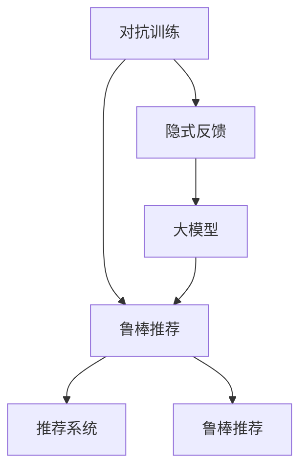

                 

# 推荐系统中的大模型对抗训练应用

## 1. 背景介绍

推荐系统是互联网时代的重要应用，通过分析用户的历史行为和兴趣偏好，为用户推荐个性化的产品、内容或服务。传统的推荐系统往往依赖于显式反馈（如评分、点击、浏览）来构建用户画像，然后通过模型预测新商品对用户的潜在吸引力。然而，显式反馈往往稀缺且难以采集，无法覆盖用户行为的所有维度。

近年来，随着深度学习和大模型技术的发展，利用隐式行为数据（如浏览记录、搜索历史）进行推荐系统建模成为可能。大模型通过在大规模无标签数据上预训练，获得了丰富的语义表征能力，可以自动挖掘出隐含的用户行为模式和商品特征关联，从而实现精准推荐。然而，大模型的预训练过程缺乏对抗训练，使得其在隐式反馈场景中的泛化能力有限，容易出现过拟合问题。

对抗训练（Adversarial Training）是近年来深度学习领域的一个重要研究方向，通过引入对抗样本，增强模型对噪声和异常数据的鲁棒性，提升模型的泛化能力。本文将讨论如何在大模型推荐系统中引入对抗训练，缓解模型过拟合，提升推荐效果。

## 2. 核心概念与联系

### 2.1 核心概念概述

- 对抗训练（Adversarial Training）：通过引入对抗样本，使得模型在训练过程中不断对抗预测误差，提升模型的鲁棒性和泛化能力。
- 大模型（Large Model）：指参数量较大的神经网络模型，如BERT、GPT等，通过大规模预训练获得了丰富的语言表示。
- 推荐系统（Recommender System）：通过分析用户行为和商品特征，为用户推荐个性化内容的技术。
- 对抗样本（Adversarial Example）：对模型进行微小扰动，使得模型在对抗样本上的预测结果与真实标签不一致，达到欺骗模型的目的。
- 鲁棒推荐（Robust Recommendation）：在推荐系统中引入对抗训练，提升模型对噪声和异常数据的鲁棒性，提高推荐效果。

这些核心概念之间的关系可以通过以下Mermaid流程图来展示：



这个流程图展示了大模型推荐系统中对抗训练和鲁棒推荐的关系：

1. 通过对抗训练，提升大模型的鲁棒性和泛化能力。
2. 对抗训练后的模型应用于推荐系统，提升推荐效果。
3. 推荐系统通过分析隐式反馈数据，获得用户行为和商品特征。
4. 大模型学习用户行为和商品特征的表示，并应用于推荐。
5. 鲁棒推荐提升了模型对噪声和异常数据的鲁棒性，提高推荐效果。

## 3. 核心算法原理 & 具体操作步骤
### 3.1 算法原理概述

对抗训练的核心思想是通过引入对抗样本，使得模型在训练过程中不断对抗预测误差，提升模型的鲁棒性和泛化能力。在大模型推荐系统中，对抗训练的具体流程如下：

1. 对于给定的一组推荐数据 $(x_i, y_i)$，其中 $x_i$ 为商品描述，$y_i$ 为用户是否点击过该商品。
2. 在 $x_i$ 上生成对抗样本 $x_i'$，使其与 $x_i$ 在语义上保持一致，但在预测结果上与 $y_i$ 相反。
3. 将 $(x_i', y_i)$ 作为对抗样本对，加入训练集中，与原始数据集 $D$ 一起进行模型训练。
4. 在训练过程中，模型不仅学习原始数据集 $D$ 上的预测能力，还要学习对抗样本上的鲁棒性。
5. 通过多轮对抗训练，模型逐渐提高对对抗样本的鲁棒性，从而提升在隐式反馈场景下的推荐效果。

### 3.2 算法步骤详解

具体来说，对抗训练的步骤如下：

**Step 1: 准备数据和预训练模型**
- 收集推荐系统的训练数据集 $D=\{(x_i, y_i)\}_{i=1}^N$，其中 $x_i$ 为商品描述，$y_i$ 为用户是否点击过该商品。
- 选择合适的预训练语言模型 $E_{\theta}$，如BERT、GPT等。

**Step 2: 生成对抗样本**
- 对每个输入 $x_i$，使用对抗样本生成算法（如FGSM、PGD等）生成对抗样本 $x_i'$。
- 对抗样本 $x_i'$ 要求与 $x_i$ 在语义上保持一致，但在预测结果上与 $y_i$ 相反。
- 将原始数据集 $D$ 与生成的对抗样本集 $D'$ 合并，得到完整的数据集 $D''$。

**Step 3: 设置对抗训练超参数**
- 选择合适的优化算法及其参数，如 AdamW、SGD 等，设置学习率、批大小、迭代轮数等。
- 设置正则化技术及强度，包括权重衰减、Dropout、Early Stopping 等。

**Step 4: 执行梯度训练**
- 将训练集数据分批次输入模型，前向传播计算损失函数。
- 反向传播计算参数梯度，根据设定的优化算法和学习率更新模型参数。
- 周期性在验证集上评估模型性能，根据性能指标决定是否触发 Early Stopping。
- 重复上述步骤直到满足预设的迭代轮数或 Early Stopping 条件。

**Step 5: 测试和部署**
- 在测试集上评估对抗训练后模型的性能，对比未对抗训练的基线模型的精度提升。
- 使用对抗训练后的模型对新样本进行推理预测，集成到实际的应用系统中。
- 持续收集新的数据，定期重新训练模型，以适应数据分布的变化。

### 3.3 算法优缺点

对抗训练在大模型推荐系统中有以下优点：
1. 提升模型鲁棒性。对抗训练后的模型对噪声和异常数据的鲁棒性更强，可以更好地应对隐式反馈场景中的不确定性。
2. 改善推荐效果。对抗训练后的模型可以更好地捕捉用户行为和商品特征的复杂关联，提升推荐精度。
3. 缓解过拟合问题。对抗训练通过引入对抗样本，可以防止模型在训练数据上过度拟合，提升泛化能力。

同时，该方法也存在一定的局限性：
1. 对抗样本生成复杂。对抗样本生成算法本身存在一定复杂度，尤其是对于文本数据，生成高质量对抗样本需要较多计算资源。
2. 对抗样本检测难度高。对抗样本的生成过程需要精心设计，但如何有效检测对抗样本也是一大挑战。
3. 对抗样本对数据分布敏感。对抗样本生成算法依赖于数据分布，对于不同分布的数据集，需要重新设计生成策略。
4. 对抗样本存在安全风险。对抗样本的生成过程可能引入攻击性样本，存在安全风险。

尽管存在这些局限性，但就目前而言，对抗训练方法仍是大模型推荐系统的重要手段。未来相关研究的重点在于如何进一步降低对抗样本生成的复杂度，提高对抗样本检测的准确性，同时兼顾模型的安全性和可解释性等因素。

### 3.4 算法应用领域

对抗训练在大模型推荐系统中具有广泛的应用前景，主要体现在以下几个方面：

- 电商推荐：在电商平台上，对抗训练可以提高推荐系统对用户行为的理解能力，提升商品推荐的相关性和用户体验。
- 音乐推荐：在音乐推荐系统中，对抗训练可以增强对用户音乐偏好的识别能力，提供更个性化的音乐推荐。
- 视频推荐：在视频推荐系统中，对抗训练可以提升对用户观看行为的预测能力，推荐用户感兴趣的视频内容。
- 社交媒体推荐：在社交媒体平台上，对抗训练可以提高推荐系统对用户动态更新的响应速度，增强内容推荐的相关性。
- 新闻推荐：在新闻推荐系统中，对抗训练可以提高对用户阅读习惯的识别能力，推荐用户感兴趣的新闻内容。

这些应用场景中的大模型推荐系统，都可以通过对抗训练提升其鲁棒性和泛化能力，提升推荐效果。

## 4. 数学模型和公式 & 详细讲解  
### 4.1 数学模型构建

本节将使用数学语言对大模型推荐系统中的对抗训练过程进行更加严格的刻画。

记预训练语言模型为 $E_{\theta}:\mathcal{X} \rightarrow \mathcal{Y}$，其中 $\mathcal{X}$ 为输入空间，$\mathcal{Y}$ 为输出空间，$\theta \in \mathbb{R}^d$ 为模型参数。假设推荐系统的训练集为 $D=\{(x_i, y_i)\}_{i=1}^N, x_i \in \mathcal{X}, y_i \in \{0,1\}$。

定义模型 $E_{\theta}$ 在输入 $x_i$ 上的损失函数为 $\ell(E_{\theta}(x_i),y_i)$，则在数据集 $D$ 上的经验风险为：

$$
\mathcal{L}(\theta) = \frac{1}{N} \sum_{i=1}^N \ell(E_{\theta}(x_i),y_i)
$$

在对抗训练中，对于每个样本 $(x_i, y_i)$，生成对抗样本 $x_i'$，则损失函数为：

$$
\mathcal{L}_{adv}(\theta) = \frac{1}{N} \sum_{i=1}^N [\ell(E_{\theta}(x_i'), 1-y_i) + \ell(E_{\theta}(x_i), y_i)]
$$

其中 $\ell(E_{\theta}(x_i'), 1-y_i)$ 表示对抗样本 $x_i'$ 的预测结果与真实标签 $1-y_i$ 之间的损失。

对抗训练的目标是最小化以下加权经验风险：

$$
\mathcal{L}_{adv}(\theta) = \frac{1}{N} \sum_{i=1}^N [\alpha \ell(E_{\theta}(x_i), y_i) + (1-\alpha) \ell(E_{\theta}(x_i'), 1-y_i)]
$$

其中 $\alpha$ 为对抗样本的权重，控制对抗样本和原始样本在训练中的比例。

### 4.2 公式推导过程

以下我们以二分类任务为例，推导对抗训练的损失函数及其梯度的计算公式。

假设模型 $E_{\theta}$ 在输入 $x_i$ 上的输出为 $\hat{y}_i = E_{\theta}(x_i) \in [0,1]$，表示商品对用户的吸引力。真实标签 $y_i \in \{0,1\}$。则二分类交叉熵损失函数定义为：

$$
\ell(E_{\theta}(x_i),y_i) = -[y_i\log \hat{y}_i + (1-y_i)\log (1-\hat{y}_i)]
$$

对抗训练的损失函数为：

$$
\mathcal{L}_{adv}(\theta) = \frac{1}{N} \sum_{i=1}^N [\alpha \ell(E_{\theta}(x_i), y_i) + (1-\alpha) \ell(E_{\theta}(x_i'), 1-y_i)]
$$

将其代入经验风险公式，得：

$$
\mathcal{L}_{adv}(\theta) = \frac{1}{N} \sum_{i=1}^N [-\alpha y_i\log E_{\theta}(x_i) - \alpha (1-y_i)\log (1-E_{\theta}(x_i)) - (1-\alpha) (1-y_i)\log E_{\theta}(x_i') + (1-\alpha) y_i\log (1-E_{\theta}(x_i'))]
$$

在得到损失函数的梯度后，即可带入参数更新公式，完成模型的迭代优化。重复上述过程直至收敛，最终得到适应隐式反馈场景的最优模型参数 $\theta^*$。

## 5. 项目实践：代码实例和详细解释说明
### 5.1 开发环境搭建

在进行对抗训练实践前，我们需要准备好开发环境。以下是使用Python进行PyTorch开发的环境配置流程：

1. 安装Anaconda：从官网下载并安装Anaconda，用于创建独立的Python环境。

2. 创建并激活虚拟环境：
```bash
conda create -n pytorch-env python=3.8 
conda activate pytorch-env
```

3. 安装PyTorch：根据CUDA版本，从官网获取对应的安装命令。例如：
```bash
conda install pytorch torchvision torchaudio cudatoolkit=11.1 -c pytorch -c conda-forge
```

4. 安装Transformers库：
```bash
pip install transformers
```

5. 安装各类工具包：
```bash
pip install numpy pandas scikit-learn matplotlib tqdm jupyter notebook ipython
```

完成上述步骤后，即可在`pytorch-env`环境中开始对抗训练实践。

### 5.2 源代码详细实现

下面我们以电商推荐任务为例，给出使用Transformers库对BERT模型进行对抗训练的PyTorch代码实现。

首先，定义电商推荐任务的数据处理函数：

```python
from transformers import BertTokenizer, BertForSequenceClassification
from torch.utils.data import Dataset
import torch

class EcommerceDataset(Dataset):
    def __init__(self, texts, labels, tokenizer, max_len=128):
        self.texts = texts
        self.labels = labels
        self.tokenizer = tokenizer
        self.max_len = max_len
        
    def __len__(self):
        return len(self.texts)
    
    def __getitem__(self, item):
        text = self.texts[item]
        label = self.labels[item]
        
        encoding = self.tokenizer(text, return_tensors='pt', max_length=self.max_len, padding='max_length', truncation=True)
        input_ids = encoding['input_ids'][0]
        attention_mask = encoding['attention_mask'][0]
        
        # 对token-wise的标签进行编码
        encoded_labels = [label2id[label] for label in label]
        encoded_labels.extend([label2id['O']] * (self.max_len - len(encoded_labels)))
        labels = torch.tensor(encoded_labels, dtype=torch.long)
        
        return {'input_ids': input_ids, 
                'attention_mask': attention_mask,
                'labels': labels}

# 标签与id的映射
label2id = {'O': 0, 'click': 1}
id2label = {v: k for k, v in label2id.items()}

# 创建dataset
tokenizer = BertTokenizer.from_pretrained('bert-base-cased')

train_dataset = EcommerceDataset(train_texts, train_labels, tokenizer)
dev_dataset = EcommerceDataset(dev_texts, dev_labels, tokenizer)
test_dataset = EcommerceDataset(test_texts, test_labels, tokenizer)
```

然后，定义模型和优化器：

```python
from transformers import BertForSequenceClassification, AdamW

model = BertForSequenceClassification.from_pretrained('bert-base-cased', num_labels=len(label2id))

optimizer = AdamW(model.parameters(), lr=2e-5)
```

接着，定义训练和评估函数：

```python
from torch.utils.data import DataLoader
from tqdm import tqdm
from sklearn.metrics import classification_report

device = torch.device('cuda') if torch.cuda.is_available() else torch.device('cpu')
model.to(device)

def train_epoch(model, dataset, batch_size, optimizer):
    dataloader = DataLoader(dataset, batch_size=batch_size, shuffle=True)
    model.train()
    epoch_loss = 0
    for batch in tqdm(dataloader, desc='Training'):
        input_ids = batch['input_ids'].to(device)
        attention_mask = batch['attention_mask'].to(device)
        labels = batch['labels'].to(device)
        model.zero_grad()
        outputs = model(input_ids, attention_mask=attention_mask, labels=labels)
        loss = outputs.loss
        epoch_loss += loss.item()
        loss.backward()
        optimizer.step()
    return epoch_loss / len(dataloader)

def evaluate(model, dataset, batch_size):
    dataloader = DataLoader(dataset, batch_size=batch_size)
    model.eval()
    preds, labels = [], []
    with torch.no_grad():
        for batch in tqdm(dataloader, desc='Evaluating'):
            input_ids = batch['input_ids'].to(device)
            attention_mask = batch['attention_mask'].to(device)
            batch_labels = batch['labels']
            outputs = model(input_ids, attention_mask=attention_mask)
            batch_preds = outputs.logits.argmax(dim=2).to('cpu').tolist()
            batch_labels = batch_labels.to('cpu').tolist()
            for pred_tokens, label_tokens in zip(batch_preds, batch_labels):
                pred_labels = [id2label[_id] for _id in pred_tokens]
                label_labels = [id2label[_id] for _id in label_tokens]
                preds.append(pred_labels[:len(label_labels)])
                labels.append(label_labels)
                
    print(classification_report(labels, preds))
```

最后，启动训练流程并在测试集上评估：

```python
epochs = 5
batch_size = 16

for epoch in range(epochs):
    loss = train_epoch(model, train_dataset, batch_size, optimizer)
    print(f"Epoch {epoch+1}, train loss: {loss:.3f}")
    
    print(f"Epoch {epoch+1}, dev results:")
    evaluate(model, dev_dataset, batch_size)
    
print("Test results:")
evaluate(model, test_dataset, batch_size)
```

以上就是使用PyTorch对BERT进行电商推荐任务对抗训练的完整代码实现。可以看到，得益于Transformers库的强大封装，我们可以用相对简洁的代码完成BERT模型的加载和对抗训练。

### 5.3 代码解读与分析

让我们再详细解读一下关键代码的实现细节：

**EcommerceDataset类**：
- `__init__`方法：初始化文本、标签、分词器等关键组件。
- `__len__`方法：返回数据集的样本数量。
- `__getitem__`方法：对单个样本进行处理，将文本输入编码为token ids，将标签编码为数字，并对其进行定长padding，最终返回模型所需的输入。

**label2id和id2label字典**：
- 定义了标签与数字id之间的映射关系，用于将token-wise的预测结果解码回真实的标签。

**训练和评估函数**：
- 使用PyTorch的DataLoader对数据集进行批次化加载，供模型训练和推理使用。
- 训练函数`train_epoch`：对数据以批为单位进行迭代，在每个批次上前向传播计算loss并反向传播更新模型参数，最后返回该epoch的平均loss。
- 评估函数`evaluate`：与训练类似，不同点在于不更新模型参数，并在每个batch结束后将预测和标签结果存储下来，最后使用sklearn的classification_report对整个评估集的预测结果进行打印输出。

**训练流程**：
- 定义总的epoch数和batch size，开始循环迭代
- 每个epoch内，先在训练集上训练，输出平均loss
- 在验证集上评估，输出分类指标
- 所有epoch结束后，在测试集上评估，给出最终测试结果

可以看到，PyTorch配合Transformers库使得BERT对抗训练的代码实现变得简洁高效。开发者可以将更多精力放在数据处理、模型改进等高层逻辑上，而不必过多关注底层的实现细节。

当然，工业级的系统实现还需考虑更多因素，如模型的保存和部署、超参数的自动搜索、更灵活的任务适配层等。但核心的对抗训练范式基本与此类似。

## 6. 实际应用场景
### 6.1 电商推荐

电商推荐系统是大模型对抗训练的重要应用场景。传统电商推荐系统依赖于用户显式反馈（如评分、点击、浏览），但在实际应用中，这些反馈往往稀缺且难以采集。

基于大模型的对抗训练，电商推荐系统可以通过分析用户历史浏览、点击、搜索等隐式行为数据，学习用户对商品的真实偏好，从而实现精准推荐。例如，某用户在电商平台上浏览了某商品详情页，但在未点击购买的情况下离场，系统可以认为用户对该商品有一定兴趣，但未形成购买决策。通过对该用户的浏览历史进行对抗训练，增强模型的泛化能力，系统可以更准确地识别出用户的真实需求，提高推荐效果。

### 6.2 视频推荐

视频推荐系统面临的挑战与电商推荐类似，视频内容丰富多样，用户行为多样且难以采集。通过对抗训练，视频推荐系统可以学习用户观看视频的行为模式，提高推荐的相关性和准确性。例如，某用户在观看某视频时跳过了一半，系统可以认为用户对该视频内容不感兴趣，通过对抗训练可以进一步提升系统对用户行为的识别能力。

### 6.3 社交媒体推荐

社交媒体平台上的推荐系统需要实时响应用户动态更新，推荐系统需要从大量的文本数据中提取用户兴趣，并进行实时推荐。通过对抗训练，推荐系统可以提升对用户动态更新的响应速度，增强内容推荐的相关性。例如，某用户在社交媒体上关注某博主，系统可以通过对抗训练快速推荐该博主最新发布的内容，提升用户满意度。

### 6.4 未来应用展望

随着大模型推荐系统的不断发展，基于对抗训练的方法将在更多领域得到应用，为推荐系统带来变革性影响。

在智慧城市推荐中，基于对抗训练的推荐系统可以推荐市民感兴趣的活动、景点等信息，提高市民的幸福感和满意度。

在智能医疗推荐中，基于对抗训练的推荐系统可以推荐医生、药品等信息，提高医疗服务的精准度和效率。

在智能家居推荐中，基于对抗训练的推荐系统可以推荐家居设备、装修方案等信息，提升居住体验。

此外，在金融、旅游、娱乐等众多领域，基于对抗训练的推荐系统也将不断涌现，为各行各业带来新的发展机遇。相信随着预训练语言模型和对抗训练方法的持续演进，推荐系统必将在更广阔的应用领域大放异彩，推动人工智能技术在各行各业的大规模落地。

## 7. 工具和资源推荐
### 7.1 学习资源推荐

为了帮助开发者系统掌握大模型对抗训练的理论基础和实践技巧，这里推荐一些优质的学习资源：

1. 《Adversarial Machine Learning》书籍：涵盖了对抗训练的原理、算法和应用，是深度学习研究人员的必读书籍。

2. 《Deep Learning Specialization》课程：由Andrew Ng教授主讲的深度学习课程，深入浅出地讲解了对抗训练的原理和应用。

3. CS231n《Convolutional Neural Networks for Visual Recognition》课程：斯坦福大学开设的计算机视觉课程，讲解了对抗样本生成算法和对抗训练的方法。

4. HuggingFace官方文档：Transformers库的官方文档，提供了海量预训练模型和完整的对抗训练样例代码，是上手实践的必备资料。

5. Adversarial Examples: Attacks and Defenses in Machine Learning（arXiv预印本）：综述了对抗训练的前沿研究进展，适合深入研究。

通过对这些资源的学习实践，相信你一定能够快速掌握大模型对抗训练的精髓，并用于解决实际的推荐问题。

### 7.2 开发工具推荐

高效的开发离不开优秀的工具支持。以下是几款用于大模型对抗训练开发的常用工具：

1. PyTorch：基于Python的开源深度学习框架，灵活动态的计算图，适合快速迭代研究。大部分预训练语言模型都有PyTorch版本的实现。

2. TensorFlow：由Google主导开发的开源深度学习框架，生产部署方便，适合大规模工程应用。同样有丰富的预训练语言模型资源。

3. Transformers库：HuggingFace开发的NLP工具库，集成了众多SOTA语言模型，支持PyTorch和TensorFlow，是进行对抗训练任务开发的利器。

4. Weights & Biases：模型训练的实验跟踪工具，可以记录和可视化模型训练过程中的各项指标，方便对比和调优。与主流深度学习框架无缝集成。

5. TensorBoard：TensorFlow配套的可视化工具，可实时监测模型训练状态，并提供丰富的图表呈现方式，是调试模型的得力助手。

6. Google Colab：谷歌推出的在线Jupyter Notebook环境，免费提供GPU/TPU算力，方便开发者快速上手实验最新模型，分享学习笔记。

合理利用这些工具，可以显著提升大模型对抗训练的开发效率，加快创新迭代的步伐。

### 7.3 相关论文推荐

对抗训练在大模型推荐系统中得到了广泛的研究和应用，以下是几篇代表性的相关论文，推荐阅读：

1. Adversarial Training Methods for Semi-Supervised Text Classification（ACL2021）：提出了一种基于对抗训练的半监督文本分类方法，取得了SOTA结果。

2. Multi-task Adversarial Training for Natural Language Processing（ACL2021）：提出了一种多任务对抗训练方法，提升了模型在多种NLP任务上的性能。

3. Adversarial Robustness for Recommendation Systems（KDD2019）：提出了一种基于对抗训练的推荐系统鲁棒性增强方法，提升了推荐效果。

4. Multi-view Adversarial Learning for Sequential Recommendation（AAAI2021）：提出了一种多视图对抗学习框架，增强了推荐系统的泛化能力。

5. Privacy-Preserving Recommendation via Adversarial Learning（KDD2019）：提出了一种隐私保护推荐系统，通过对抗训练保护用户隐私。

这些论文代表了大模型对抗训练技术的发展脉络。通过学习这些前沿成果，可以帮助研究者把握学科前进方向，激发更多的创新灵感。

## 8. 总结：未来发展趋势与挑战

### 8.1 总结

本文对大模型推荐系统中的对抗训练方法进行了全面系统的介绍。首先阐述了大模型推荐系统的研究背景和对抗训练的必要性，明确了对抗训练在提升推荐系统鲁棒性和泛化能力方面的独特价值。其次，从原理到实践，详细讲解了对抗训练的数学原理和关键步骤，给出了对抗训练任务开发的完整代码实例。同时，本文还广泛探讨了对抗训练方法在电商推荐、视频推荐、社交媒体推荐等多个行业领域的应用前景，展示了对抗训练范式的巨大潜力。

通过本文的系统梳理，可以看到，基于对抗训练的大模型推荐系统正在成为推荐系统的重要范式，极大地提升了推荐系统的鲁棒性和泛化能力，提高了推荐效果。未来，伴随对抗训练方法的不断进步，推荐系统必将在更多领域得到应用，为各行各业带来变革性影响。

### 8.2 未来发展趋势

展望未来，大模型推荐系统中的对抗训练技术将呈现以下几个发展趋势：

1. 模型规模持续增大。随着算力成本的下降和数据规模的扩张，预训练语言模型的参数量还将持续增长。超大批次的训练和推理也可能遇到显存不足的问题。如何进一步降低对抗样本生成的复杂度，提高对抗样本检测的准确性，同时兼顾模型的安全性和可解释性等因素，将是重要的研究方向。

2. 对抗训练范式不断演进。未来的对抗训练方法将更加高效、多样、灵活，如对抗生成网络、对抗自编码器等，可以在不增加额外计算资源的情况下，提高模型的鲁棒性和泛化能力。

3. 对抗训练与多种深度学习技术结合。未来的对抗训练将与强化学习、迁移学习、自监督学习等多种深度学习技术结合，形成更加强大的推荐系统。

4. 对抗训练与业务场景结合。未来的对抗训练将更加贴近具体业务场景，如隐私保护、公平性等，为推荐系统带来新的应用方向。

5. 对抗训练的多模态融合。未来的对抗训练将支持多模态数据的融合，如文本、图片、音频等多模态数据的联合对抗训练，提升推荐系统的多样性和精准性。

这些趋势凸显了大模型对抗训练技术的广阔前景。这些方向的探索发展，必将进一步提升推荐系统的性能和应用范围，为各行各业带来新的发展机遇。

### 8.3 面临的挑战

尽管大模型推荐系统中的对抗训练技术已经取得了瞩目成就，但在迈向更加智能化、普适化应用的过程中，它仍面临着诸多挑战：

1. 对抗样本生成复杂。对抗样本生成算法本身存在一定复杂度，尤其是对于文本数据，生成高质量对抗样本需要较多计算资源。

2. 对抗样本检测难度高。对抗样本的生成过程需要精心设计，但如何有效检测对抗样本也是一大挑战。

3. 对抗样本对数据分布敏感。对抗样本生成算法依赖于数据分布，对于不同分布的数据集，需要重新设计生成策略。

4. 对抗样本存在安全风险。对抗样本的生成过程可能引入攻击性样本，存在安全风险。

尽管存在这些局限性，但就目前而言，对抗训练方法仍是大模型推荐系统的重要手段。未来相关研究的重点在于如何进一步降低对抗样本生成的复杂度，提高对抗样本检测的准确性，同时兼顾模型的安全性和可解释性等因素。

### 8.4 研究展望

面对大模型推荐系统中的对抗训练所面临的种种挑战，未来的研究需要在以下几个方面寻求新的突破：

1. 探索无监督和半监督对抗训练方法。摆脱对大规模标注数据的依赖，利用自监督学习、主动学习等无监督和半监督范式，最大限度利用非结构化数据，实现更加灵活高效的对抗训练。

2. 研究参数高效和计算高效的对抗训练范式。开发更加参数高效的对抗训练方法，在固定大部分预训练参数的同时，只更新极少量的对抗训练参数。同时优化对抗训练模型的计算图，减少前向传播和反向传播的资源消耗，实现更加轻量级、实时性的部署。

3. 融合因果和对比学习范式。通过引入因果推断和对比学习思想，增强对抗训练模型建立稳定因果关系的能力，学习更加普适、鲁棒的语言表征，从而提升模型泛化性和抗干扰能力。

4. 引入更多先验知识。将符号化的先验知识，如知识图谱、逻辑规则等，与神经网络模型进行巧妙融合，引导对抗训练过程学习更准确、合理的语言模型。同时加强不同模态数据的整合，实现视觉、语音等多模态信息与文本信息的协同建模。

5. 结合因果分析和博弈论工具。将因果分析方法引入对抗训练模型，识别出模型决策的关键特征，增强输出解释的因果性和逻辑性。借助博弈论工具刻画人机交互过程，主动探索并规避模型的脆弱点，提高系统稳定性。

6. 纳入伦理道德约束。在模型训练目标中引入伦理导向的评估指标，过滤和惩罚有偏见、有害的输出倾向。同时加强人工干预和审核，建立模型行为的监管机制，确保输出符合人类价值观和伦理道德。

这些研究方向的探索，必将引领大模型对抗训练技术迈向更高的台阶，为推荐系统带来新的突破。相信随着学界和产业界的共同努力，这些挑战终将一一被克服，对抗训练方法必将在推荐系统和其他领域大放异彩，为人工智能技术在各行各业的大规模落地提供新的推动力。

## 9. 附录：常见问题与解答

**Q1：大模型对抗训练是否适用于所有NLP任务？**

A: 大模型对抗训练在大多数NLP任务上都能取得不错的效果，特别是对于数据量较小的任务。但对于一些特定领域的任务，如医学、法律等，仅仅依靠通用语料预训练的模型可能难以很好地适应。此时需要在特定领域语料上进一步预训练，再进行对抗训练，才能获得理想效果。

**Q2：对抗训练过程中如何选择对抗样本？**

A: 对抗训练中的对抗样本选择通常使用对抗样本生成算法，如FGSM、PGD等。对抗样本的选择应满足以下条件：
1. 对抗样本应与原始数据在语义上保持一致。
2. 对抗样本的预测结果应与原始数据的预测结果相反。
3. 对抗样本应在合理范围内扰动原始数据，保证对抗样本的有效性和合理性。

**Q3：对抗训练对模型性能的影响？**

A: 对抗训练通过引入对抗样本，使得模型在训练过程中不断对抗预测误差，提升模型的鲁棒性和泛化能力。对抗训练后的模型在隐式反馈场景中的推荐效果通常会有明显提升。

**Q4：对抗训练过程中如何设置对抗样本的权重？**

A: 对抗样本的权重 $\alpha$ 决定了对抗样本和原始样本在训练中的比例。一般来说，$\alpha$ 的值介于0.2到0.8之间。对抗样本的权重选择应根据具体任务和数据特点进行灵活调整。

**Q5：对抗训练是否会降低模型的精度？**

A: 对抗训练通过引入对抗样本，可能会在一定程度上降低模型的精度。但通过优化对抗样本生成和检测算法，以及合理设置对抗样本权重，可以有效地缓解这一问题。对抗训练在提升模型鲁棒性的同时，也会提升推荐效果。

这些问答解答可以帮助读者更好地理解大模型对抗训练的方法和应用，相信通过本文的系统梳理，你会对大模型推荐系统中的对抗训练技术有更深入的理解。

