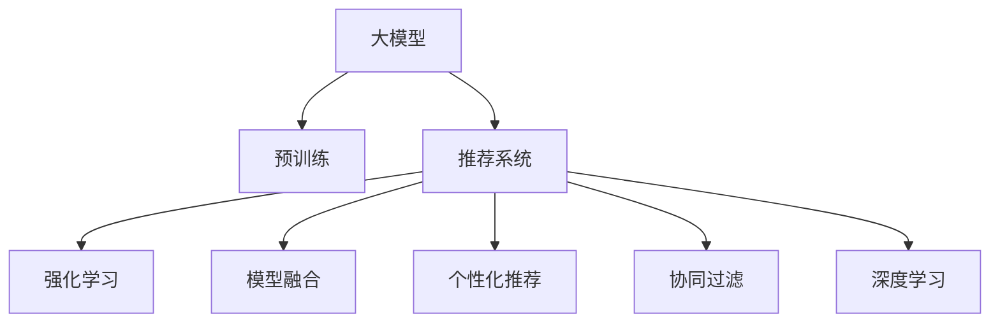

                 

# 推荐系统中的大模型对比强化学习应用

> 关键词：大模型对比,推荐系统,强化学习,模型融合,个性化推荐,协同过滤,深度学习

## 1. 背景介绍

推荐系统（Recommender Systems）是互联网时代的重要应用，通过分析用户行为和物品属性，为用户推荐感兴趣的内容，提升用户体验，增加业务收益。随着数据量的急剧增长和计算能力的提升，推荐系统的技术也在不断演进，从基于协同过滤、内容过滤的早期推荐算法，到基于深度学习的个性化推荐模型，再到融合多种算法的多模态推荐系统，推荐系统正在迈向更加智能、精准、高效的方向。

在大数据和深度学习技术的大背景下，近年来大模型在推荐系统中的应用日益增多，通过在大规模数据上预训练模型，在实际推荐任务上微调优化，可以显著提升推荐模型的性能。此外，强化学习（Reinforcement Learning, RL）技术的引入，使得推荐系统能够更加动态地调整策略，提升用户体验和转化率。因此，结合大模型和强化学习的推荐系统，成为目前的研究热点。本文将深入探讨在大模型基础上，对比强化学习在推荐系统中的应用，从原理、实现到实际案例，全面解读这一前沿技术。

## 2. 核心概念与联系

### 2.1 核心概念概述

为更好地理解大模型在推荐系统中的应用，本节将介绍几个关键概念：

- **大模型（Large Models）**：指在大规模数据集上训练的深度神经网络模型，如BERT、GPT-3等，具备强大的特征表示和推理能力。
- **推荐系统（Recommender Systems）**：通过分析用户行为和物品属性，为用户推荐感兴趣的内容。推荐系统可以分为协同过滤、内容过滤、混合推荐等多种类型。
- **强化学习（Reinforcement Learning）**：通过与环境的互动，学习最优策略以最大化奖励的一种机器学习方法。
- **模型融合（Model Fusion）**：将多个模型的预测结果进行加权融合，提升推荐效果。
- **个性化推荐（Personalized Recommendation）**：根据用户历史行为和兴趣，为其推荐定制化内容。
- **协同过滤（Collaborative Filtering）**：通过分析用户之间的相似性，推荐其他用户喜欢的物品。
- **深度学习（Deep Learning）**：利用深度神经网络进行推荐，能够处理非线性和复杂模式，提高推荐精度。

这些概念之间的逻辑关系可以通过以下Mermaid流程图来展示：



这个流程图展示了大模型在推荐系统中的应用范式，以及与推荐系统相关的重要技术概念：

1. 大模型通过预训练获得基础能力。
2. 推荐系统通过大模型进行特征表示和推荐决策。
3. 强化学习动态调整推荐策略，提升用户体验。
4. 模型融合提升推荐效果，提高系统鲁棒性。
5. 个性化推荐满足用户需求，提高用户满意度。
6. 协同过滤分析用户行为，发现关联物品。
7. 深度学习利用复杂模型，提高推荐精度。

这些概念共同构成了推荐系统的应用框架，使得基于大模型的推荐系统能够更好地适应复杂、动态的推荐场景。通过理解这些核心概念，我们可以更好地把握大模型和强化学习在推荐系统中的应用范式。

## 3. 核心算法原理 & 具体操作步骤
### 3.1 算法原理概述

基于大模型的推荐系统，本质上是一个通过大规模数据预训练，在实际推荐任务上微调优化的大模型应用。其核心思想是：将大模型视作一个强大的特征提取器和推理器，通过在大规模数据上进行预训练，学习到丰富的特征表示和推理能力，然后在推荐任务上微调优化，提升推荐模型的表现。

强化学习在推荐系统中的应用，则是一种更加动态、自适应的推荐策略，通过与用户的互动，不断调整推荐策略，以最大化用户的满意度和转化率。强化学习的目标是通过最大化长期奖励，学习最优的推荐策略。

### 3.2 算法步骤详解

基于大模型的推荐系统，通常包括以下几个关键步骤：

**Step 1: 准备预训练模型和数据集**
- 选择合适的预训练语言模型 $M_{\theta}$ 作为初始化参数，如 BERT、GPT 等。
- 准备推荐系统的数据集 $D=\{(x_i,y_i)\}_{i=1}^N$，其中 $x_i$ 为用户行为记录，$y_i$ 为用户推荐结果。

**Step 2: 添加任务适配层**
- 根据推荐任务类型，在预训练模型顶层设计合适的输出层和损失函数。
- 对于二分类推荐任务，通常在顶层添加线性分类器和交叉熵损失函数。
- 对于多分类推荐任务，通常使用softmax函数输出概率分布，并以负对数似然为损失函数。

**Step 3: 设置微调超参数**
- 选择合适的优化算法及其参数，如 Adam、SGD 等，设置学习率、批大小、迭代轮数等。
- 设置正则化技术及强度，包括权重衰减、Dropout、Early Stopping等。
- 确定冻结预训练参数的策略，如仅微调顶层，或全部参数都参与微调。

**Step 4: 执行梯度训练**
- 将推荐数据集以批为单位输入模型，前向传播计算损失函数。
- 反向传播计算参数梯度，根据设定的优化算法和学习率更新模型参数。
- 周期性在验证集上评估模型性能，根据性能指标决定是否触发 Early Stopping。
- 重复上述步骤直至满足预设的迭代轮数或 Early Stopping 条件。

**Step 5: 测试和部署**
- 在测试集上评估微调后模型 $M_{\hat{\theta}}$ 的性能，对比微调前后的推荐精度提升。
- 使用微调后的模型对新用户进行推荐，集成到实际的应用系统中。
- 持续收集新数据，定期重新微调模型，以适应数据分布的变化。

对于结合强化学习的推荐系统，除了上述步骤外，还需要额外添加以下步骤：

**Step 6: 定义奖励函数**
- 根据推荐系统的业务目标，定义奖励函数 $R$，例如点击率、购买率、停留时间等。

**Step 7: 构建推荐策略**
- 使用强化学习算法（如Q-learning、SARSA、DQN等），在模拟环境中进行策略优化。
- 训练过程中使用探索策略（如$\epsilon$-greedy）和利用策略（如Q-learning update）交替更新策略。

**Step 8: 实际部署**
- 将优化后的推荐策略应用到实际推荐系统中，实时调整推荐策略。
- 持续监控推荐效果和用户反馈，不断优化策略。

### 3.3 算法优缺点

基于大模型的推荐系统具有以下优点：
1. 简单高效。只需准备少量推荐数据，即可对预训练模型进行快速适配，获得较大的性能提升。
2. 通用适用。适用于各种推荐任务，包括二分类、多分类、排序等，设计简单的任务适配层即可实现微调。
3. 性能提升显著。微调使得通用大模型更好地适应特定推荐任务，在实际应用中取得更优表现。
4. 参数高效。利用参数高效微调技术，在固定大部分预训练权重不变的情况下，仍可取得不错的提升。

同时，该方法也存在一定的局限性：
1. 依赖推荐数据。推荐系统的微调效果很大程度上取决于推荐数据的数量和质量，获取高质量推荐数据的成本较高。
2. 迁移能力有限。当目标任务与预训练数据的分布差异较大时，微调的性能提升有限。
3. 可解释性不足。微调模型的决策过程通常缺乏可解释性，难以对其推理逻辑进行分析和调试。

对于结合强化学习的推荐系统，其优点和缺点与基于监督学习的推荐系统类似，但强化学习可以动态调整策略，适应更复杂多变的推荐场景，但也面临着学习效率低、策略不稳定等问题。

### 3.4 算法应用领域

结合大模型和强化学习的推荐系统，已经广泛应用于电商、音乐、视频、新闻等多个领域，具体应用包括：

- **电商推荐**：通过分析用户浏览、购买记录，为用户推荐商品。
- **视频推荐**：根据用户观影历史，推荐相似视频或热门视频。
- **新闻推荐**：根据用户阅读历史，推荐相关新闻或热门新闻。
- **音乐推荐**：根据用户听歌历史，推荐相似歌曲或热门歌曲。
- **商品推荐**：在电商网站或APP中，推荐用户可能感兴趣的商品。

此外，结合大模型和强化学习的推荐系统，还可以应用于广告推荐、内容创作推荐、用户画像生成等场景，为推荐系统带来更多的创新和应用可能。

## 4. 数学模型和公式 & 详细讲解  
### 4.1 数学模型构建

基于大模型的推荐系统，通常采用监督学习范式进行微调。数学模型构建如下：

记预训练语言模型为 $M_{\theta}:\mathcal{X} \rightarrow \mathcal{Y}$，其中 $\mathcal{X}$ 为用户行为记录，$\mathcal{Y}$ 为用户推荐结果。假设推荐系统的训练集为 $D=\{(x_i,y_i)\}_{i=1}^N$。

定义模型 $M_{\theta}$ 在数据样本 $(x,y)$ 上的损失函数为 $\ell(M_{\theta}(x),y)$，则在数据集 $D$ 上的经验风险为：

$$
\mathcal{L}(\theta) = \frac{1}{N} \sum_{i=1}^N \ell(M_{\theta}(x_i),y_i)
$$

其中 $\ell$ 为针对推荐任务设计的损失函数，用于衡量模型预测结果与真实标签之间的差异。常见的损失函数包括交叉熵损失、均方误差损失等。

对于结合强化学习的推荐系统，则需要在监督学习的基础上，引入强化学习的框架。假设推荐系统以最大化长期奖励为目标，奖励函数为 $R$，则强化学习的目标是最小化累计奖励的负值：

$$
\max_{\theta} \mathbb{E} \left[ \sum_{t=1}^T R_t \right]
$$

其中 $T$ 为时间步，$R_t$ 为时间步 $t$ 的奖励。

### 4.2 公式推导过程

以下我们以推荐系统的二分类任务为例，推导交叉熵损失函数及其梯度的计算公式。

假设模型 $M_{\theta}$ 在用户行为记录 $x$ 上的推荐结果为 $\hat{y}=M_{\theta}(x) \in [0,1]$，表示用户行为 $x$ 被推荐为正类的概率。真实标签 $y \in \{0,1\}$。则二分类交叉熵损失函数定义为：

$$
\ell(M_{\theta}(x),y) = -[y\log \hat{y} + (1-y)\log (1-\hat{y})]
$$

将其代入经验风险公式，得：

$$
\mathcal{L}(\theta) = -\frac{1}{N}\sum_{i=1}^N [y_i\log M_{\theta}(x_i)+(1-y_i)\log(1-M_{\theta}(x_i))]
$$

根据链式法则，损失函数对参数 $\theta_k$ 的梯度为：

$$
\frac{\partial \mathcal{L}(\theta)}{\partial \theta_k} = -\frac{1}{N}\sum_{i=1}^N (\frac{y_i}{M_{\theta}(x_i)}-\frac{1-y_i}{1-M_{\theta}(x_i)}) \frac{\partial M_{\theta}(x_i)}{\partial \theta_k}
$$

其中 $\frac{\partial M_{\theta}(x_i)}{\partial \theta_k}$ 可进一步递归展开，利用自动微分技术完成计算。

对于结合强化学习的推荐系统，其目标函数为：

$$
\max_{\theta} \mathbb{E} \left[ \sum_{t=1}^T R_t \right]
$$

其中 $R_t$ 为时间步 $t$ 的奖励。通过强化学习算法，如Q-learning，可以在模拟环境中学习最优策略，然后在实际应用中动态调整推荐策略。

### 4.3 案例分析与讲解

我们以一个简单的电商推荐系统为例，说明基于大模型和强化学习的推荐流程。

假设我们有一个电商网站，需要为用户推荐商品。首先，收集用户的浏览记录 $x$ 和购买记录 $y$，作为训练集 $D$。然后，选择一个预训练的大模型 $M_{\theta}$，作为推荐模型的初始化参数。

在用户行为 $x$ 上，前向传播计算推荐结果 $\hat{y}=M_{\theta}(x)$。然后，根据实际购买行为 $y$，计算损失函数 $\ell(\hat{y},y)$。使用梯度下降等优化算法，不断更新模型参数 $\theta$，使得模型输出逼近真实标签。

在推荐系统中，我们可以引入强化学习，动态调整推荐策略。假设奖励函数 $R$ 为用户点击率 $CTR$，则强化学习算法需要在模拟环境中学习如何最大化 $CTR$。在实际应用中，每次推荐时，使用学习到的策略，计算推荐结果 $\hat{y}$，并根据用户的点击行为 $y$，更新策略参数。

## 5. 项目实践：代码实例和详细解释说明
### 5.1 开发环境搭建

在进行推荐系统项目实践前，我们需要准备好开发环境。以下是使用Python进行PyTorch开发的环境配置流程：

1. 安装Anaconda：从官网下载并安装Anaconda，用于创建独立的Python环境。

2. 创建并激活虚拟环境：
```bash
conda create -n recommendation-env python=3.8 
conda activate recommendation-env
```

3. 安装PyTorch：根据CUDA版本，从官网获取对应的安装命令。例如：
```bash
conda install pytorch torchvision torchaudio cudatoolkit=11.1 -c pytorch -c conda-forge
```

4. 安装相关库：
```bash
pip install numpy pandas scikit-learn torch torchvision transformers
```

5. 安装各类工具包：
```bash
pip install jupyter notebook ipython
```

完成上述步骤后，即可在`recommendation-env`环境中开始推荐系统实践。

### 5.2 源代码详细实现

这里我们以电商推荐系统为例，给出使用Transformers库对BERT模型进行微调的PyTorch代码实现。

首先，定义推荐系统的数据处理函数：

```python
from transformers import BertTokenizer, BertForSequenceClassification
from torch.utils.data import Dataset, DataLoader
import torch

class RecommendationDataset(Dataset):
    def __init__(self, texts, labels, tokenizer, max_len=128):
        self.texts = texts
        self.labels = labels
        self.tokenizer = tokenizer
        self.max_len = max_len
        
    def __len__(self):
        return len(self.texts)
    
    def __getitem__(self, item):
        text = self.texts[item]
        label = self.labels[item]
        
        encoding = self.tokenizer(text, return_tensors='pt', max_length=self.max_len, padding='max_length', truncation=True)
        input_ids = encoding['input_ids'][0]
        attention_mask = encoding['attention_mask'][0]
        
        # 对label进行编码
        label = label2id[label] 
        label = torch.tensor(label, dtype=torch.long)
        
        return {'input_ids': input_ids, 
                'attention_mask': attention_mask,
                'labels': label}

# 标签与id的映射
label2id = {'buy': 1, 'not_buy': 0}
id2label = {v: k for k, v in label2id.items()}

# 创建dataset
tokenizer = BertTokenizer.from_pretrained('bert-base-cased')

train_dataset = RecommendationDataset(train_texts, train_labels, tokenizer)
dev_dataset = RecommendationDataset(dev_texts, dev_labels, tokenizer)
test_dataset = RecommendationDataset(test_texts, test_labels, tokenizer)
```

然后，定义模型和优化器：

```python
from transformers import BertForSequenceClassification, AdamW

model = BertForSequenceClassification.from_pretrained('bert-base-cased', num_labels=len(label2id))

optimizer = AdamW(model.parameters(), lr=2e-5)
```

接着，定义训练和评估函数：

```python
from tqdm import tqdm
from sklearn.metrics import accuracy_score

device = torch.device('cuda') if torch.cuda.is_available() else torch.device('cpu')
model.to(device)

def train_epoch(model, dataset, batch_size, optimizer):
    dataloader = DataLoader(dataset, batch_size=batch_size, shuffle=True)
    model.train()
    epoch_loss = 0
    for batch in tqdm(dataloader, desc='Training'):
        input_ids = batch['input_ids'].to(device)
        attention_mask = batch['attention_mask'].to(device)
        labels = batch['labels'].to(device)
        model.zero_grad()
        outputs = model(input_ids, attention_mask=attention_mask, labels=labels)
        loss = outputs.loss
        epoch_loss += loss.item()
        loss.backward()
        optimizer.step()
    return epoch_loss / len(dataloader)

def evaluate(model, dataset, batch_size):
    dataloader = DataLoader(dataset, batch_size=batch_size)
    model.eval()
    preds, labels = [], []
    with torch.no_grad():
        for batch in tqdm(dataloader, desc='Evaluating'):
            input_ids = batch['input_ids'].to(device)
            attention_mask = batch['attention_mask'].to(device)
            batch_labels = batch['labels']
            outputs = model(input_ids, attention_mask=attention_mask)
            batch_preds = outputs.logits.argmax(dim=1).to('cpu').tolist()
            batch_labels = batch_labels.to('cpu').tolist()
            for pred, label in zip(batch_preds, batch_labels):
                preds.append(pred)
                labels.append(label)
                
    print(f"Accuracy: {accuracy_score(labels, preds):.2f}")
```

最后，启动训练流程并在测试集上评估：

```python
epochs = 5
batch_size = 16

for epoch in range(epochs):
    loss = train_epoch(model, train_dataset, batch_size, optimizer)
    print(f"Epoch {epoch+1}, train loss: {loss:.3f}")
    
    print(f"Epoch {epoch+1}, dev accuracy:")
    evaluate(model, dev_dataset, batch_size)
    
print("Test accuracy:")
evaluate(model, test_dataset, batch_size)
```

以上就是使用PyTorch对BERT进行电商推荐任务微调的完整代码实现。可以看到，得益于Transformers库的强大封装，我们可以用相对简洁的代码完成BERT模型的加载和微调。

### 5.3 代码解读与分析

让我们再详细解读一下关键代码的实现细节：

**RecommendationDataset类**：
- `__init__`方法：初始化文本、标签、分词器等关键组件。
- `__len__`方法：返回数据集的样本数量。
- `__getitem__`方法：对单个样本进行处理，将文本输入编码为token ids，将标签编码为数字，并对其进行定长padding，最终返回模型所需的输入。

**label2id和id2label字典**：
- 定义了标签与数字id之间的映射关系，用于将标签进行编码和解码。

**训练和评估函数**：
- 使用PyTorch的DataLoader对数据集进行批次化加载，供模型训练和推理使用。
- 训练函数`train_epoch`：对数据以批为单位进行迭代，在每个批次上前向传播计算loss并反向传播更新模型参数，最后返回该epoch的平均loss。
- 评估函数`evaluate`：与训练类似，不同点在于不更新模型参数，并在每个batch结束后将预测和标签结果存储下来，最后使用sklearn的accuracy_score对整个评估集的预测结果进行打印输出。

**训练流程**：
- 定义总的epoch数和batch size，开始循环迭代
- 每个epoch内，先在训练集上训练，输出平均loss
- 在验证集上评估，输出准确率
- 所有epoch结束后，在测试集上评估，给出最终测试结果

可以看到，PyTorch配合Transformers库使得BERT微调的代码实现变得简洁高效。开发者可以将更多精力放在数据处理、模型改进等高层逻辑上，而不必过多关注底层的实现细节。

当然，工业级的系统实现还需考虑更多因素，如模型的保存和部署、超参数的自动搜索、更灵活的任务适配层等。但核心的微调范式基本与此类似。

## 6. 实际应用场景
### 6.1 电商推荐系统

结合大模型和强化学习的电商推荐系统，可以显著提升用户购物体验和转化率。传统推荐系统往往仅基于用户历史行为进行推荐，无法考虑用户兴趣的变化和实时反馈。而通过大模型的预训练和微调，结合强化学习的实时策略调整，推荐系统能够更加精准地预测用户需求，动态调整推荐策略，提高用户满意度和转化率。

在技术实现上，可以收集用户浏览、点击、购买等行为数据，构建推荐模型的训练集。微调预训练模型，使其能够根据用户行为预测点击率和购买率。在推荐时，使用强化学习算法，根据用户实时反馈，动态调整推荐策略，使推荐结果更符合用户需求。

### 6.2 视频推荐系统

视频推荐系统面临用户兴趣动态变化和视频内容丰富多样的挑战。结合大模型和强化学习的推荐系统，可以更好地应对这些挑战，提升推荐效果。

具体而言，可以收集用户观看历史和点击行为，构建推荐模型的训练集。微调预训练模型，使其能够预测用户对视频内容的兴趣程度。在推荐时，使用强化学习算法，根据用户反馈，动态调整推荐策略，使推荐结果更符合用户兴趣变化。

### 6.3 金融产品推荐

金融产品推荐系统需要对用户行为和产品属性进行深度分析，推荐最优投资组合。结合大模型和强化学习的推荐系统，可以更全面地考虑用户偏好和市场动态，提升推荐效果。

在实现上，可以收集用户投资历史和行为数据，构建推荐模型的训练集。微调预训练模型，使其能够预测用户对不同金融产品的兴趣程度。在推荐时，使用强化学习算法，根据市场动态和用户反馈，动态调整推荐策略，使推荐结果更符合用户需求和市场变化。

### 6.4 未来应用展望

随着大模型和强化学习技术的不断发展，结合大模型和强化学习的推荐系统将有更广阔的应用前景。

在智慧医疗领域，推荐系统可以根据患者历史数据和实时反馈，推荐最优治疗方案，提高诊疗效率。

在智能教育领域，推荐系统可以根据学生学习行为和反馈，推荐个性化学习内容，提高学习效果。

在智慧城市治理中，推荐系统可以根据用户行为和城市事件，推荐最优出行路线和应急措施，提升城市管理效率。

此外，在企业生产、社会治理、文娱传媒等众多领域，结合大模型和强化学习的推荐系统也将不断涌现，为各行各业带来更多创新和应用可能。相信随着技术的日益成熟，结合大模型和强化学习的推荐系统必将在更广阔的领域大放异彩，为人类生产生活方式带来深刻变革。

## 7. 工具和资源推荐
### 7.1 学习资源推荐

为了帮助开发者系统掌握大模型和强化学习在推荐系统中的应用，这里推荐一些优质的学习资源：

1. 《Deep Learning for Recommender Systems》书籍：由深度学习与推荐系统领域的专家撰写，系统讲解了深度学习在推荐系统中的应用，包括模型构建、微调、优化等方面。

2. CS453《Recommender Systems》课程：斯坦福大学开设的推荐系统经典课程，有Lecture视频和配套作业，带你深入理解推荐系统的原理和实践。

3. 《Reinforcement Learning for Recommender Systems》书籍：系统介绍了强化学习在推荐系统中的应用，包括算法设计、模型优化等方面。

4. Reinforcement Learning for Deep Learning by G. Battaglia：介绍了强化学习在深度学习中的应用，涵盖强化学习基础、推荐系统等内容。

5. Google Research Blog：谷歌研究博客，定期发布深度学习、强化学习等前沿技术的最新进展，内容权威且实用。

通过对这些资源的学习实践，相信你一定能够快速掌握大模型和强化学习在推荐系统中的应用精髓，并用于解决实际的推荐问题。
###  7.2 开发工具推荐

高效的开发离不开优秀的工具支持。以下是几款用于推荐系统微调和大模型优化的常用工具：

1. PyTorch：基于Python的开源深度学习框架，灵活动态的计算图，适合快速迭代研究。大部分预训练语言模型都有PyTorch版本的实现。

2. TensorFlow：由Google主导开发的开源深度学习框架，生产部署方便，适合大规模工程应用。同样有丰富的预训练语言模型资源。

3. Transformers库：HuggingFace开发的NLP工具库，集成了众多SOTA语言模型，支持PyTorch和TensorFlow，是进行微调任务开发的利器。

4. Weights & Biases：模型训练的实验跟踪工具，可以记录和可视化模型训练过程中的各项指标，方便对比和调优。与主流深度学习框架无缝集成。

5. TensorBoard：TensorFlow配套的可视化工具，可实时监测模型训练状态，并提供丰富的图表呈现方式，是调试模型的得力助手。

6. Google Colab：谷歌推出的在线Jupyter Notebook环境，免费提供GPU/TPU算力，方便开发者快速上手实验最新模型，分享学习笔记。

合理利用这些工具，可以显著提升推荐系统微调和大模型优化的开发效率，加快创新迭代的步伐。

### 7.3 相关论文推荐

结合大模型和强化学习的推荐系统，已经涌现出大量优秀的研究论文。以下是几篇代表性的论文，推荐阅读：

1. **Deep and Differentiable Reinforcement Learning for Recommender Systems**：提出了一种基于深度强化学习的推荐系统，在大型推荐数据集上取得了显著效果。

2. **Combining Deep Learning and Reinforcement Learning for Personalized Recommendation**：结合深度学习和强化学习，提出了一种混合推荐模型，显著提升了推荐效果。

3. **Adversarial Imitation Learning for Personalized Recommendation**：提出了一种基于对抗模仿学习的推荐模型，通过对抗性训练，提升了推荐系统的鲁棒性。

4. **FedRec: A Distributed Deep Recommendation System with Incremental Learning**：提出了一种分布式深度推荐系统，通过增量学习，提高了推荐模型的效率和性能。

5. **Attention-Based Deep Reinforcement Learning for Personalized Recommendation**：结合注意力机制和强化学习，提出了一种深度推荐模型，提高了推荐系统的个性化和多样性。

这些论文代表了大模型和强化学习在推荐系统中的应用方向，通过学习这些前沿成果，可以帮助研究者把握学科前进方向，激发更多的创新灵感。

## 8. 总结：未来发展趋势与挑战
### 8.1 研究成果总结

本文对结合大模型和强化学习的推荐系统进行了全面系统的介绍。首先阐述了结合大模型和强化学习的推荐系统在实际应用中的意义和价值，明确了推荐系统优化和改进的必要性。其次，从原理到实践，详细讲解了大模型和强化学习在推荐系统中的数学模型和关键步骤，给出了微调任务开发的完整代码实例。同时，本文还广泛探讨了结合大模型和强化学习的推荐系统在电商、视频、金融等诸多领域的应用前景，展示了该技术的前景和潜力。此外，本文精选了推荐系统的各类学习资源，力求为读者提供全方位的技术指引。

通过本文的系统梳理，可以看到，结合大模型和强化学习的推荐系统正在成为推荐系统的重要范式，极大地拓展了推荐系统的应用边界，催生了更多的落地场景。得益于大规模语料的预训练，结合大模型和强化学习的推荐系统在微调过程中能够更好地利用先验知识，提升推荐效果和系统性能。未来，伴随预训练语言模型和强化学习技术的不断演进，相信结合大模型和强化学习的推荐系统必将在更广阔的领域大放异彩，深刻影响人类的生产生活方式。

### 8.2 未来发展趋势

展望未来，结合大模型和强化学习的推荐系统将呈现以下几个发展趋势：

1. 模型规模持续增大。随着算力成本的下降和数据规模的扩张，预训练语言模型的参数量还将持续增长。超大规模语言模型蕴含的丰富语言知识，有望支撑更加复杂多变的推荐场景。

2. 推荐模型更加个性化。结合大模型和强化学习的推荐系统，能够更好地捕捉用户兴趣变化和实时反馈，推荐更加个性化、精准的内容。

3. 推荐系统更加动态。强化学习动态调整推荐策略，能够更好地适应用户行为变化和市场动态，提升推荐效果。

4. 推荐系统更加稳定。结合大模型和强化学习的推荐系统，能够更好地应对数据分布变化和推荐策略波动，提升推荐系统的稳定性和可靠性。

5. 推荐系统更加高效。通过模型压缩、稀疏化等技术，结合大模型和强化学习的推荐系统能够更加高效地部署和运行。

6. 推荐系统更加安全。结合大模型和强化学习的推荐系统，能够更好地防范恶意推荐、信息泄露等安全风险，确保推荐内容的安全性。

以上趋势凸显了结合大模型和强化学习的推荐系统的广阔前景。这些方向的探索发展，必将进一步提升推荐系统的性能和应用范围，为人类生产生活方式带来深刻变革。

### 8.3 面临的挑战

尽管结合大模型和强化学习的推荐系统已经取得了瞩目成就，但在迈向更加智能化、普适化应用的过程中，它仍面临着诸多挑战：

1. 数据依赖问题。推荐系统微调效果很大程度上取决于推荐数据的质量和数量，获取高质量推荐数据的成本较高。如何进一步降低微调对标注样本的依赖，将是一大难题。

2. 鲁棒性问题。当前推荐系统面对域外数据时，泛化性能往往大打折扣。对于测试样本的微小扰动，推荐模型的预测也容易发生波动。如何提高推荐系统的鲁棒性，避免灾难性遗忘，还需要更多理论和实践的积累。

3. 效率问题。在推荐系统的实际部署中，如何平衡模型精度和计算效率，降低推理时间和内存占用，是一个重要的问题。

4. 可解释性问题。当前推荐系统的决策过程通常缺乏可解释性，难以对其推理逻辑进行分析和调试。对于医疗、金融等高风险应用，算法的可解释性和可审计性尤为重要。

5. 安全性问题。结合大模型和强化学习的推荐系统，难免会学习到有偏见、有害的信息，通过推荐传递到用户端，产生误导性、歧视性的输出，给实际应用带来安全隐患。如何从数据和算法层面消除模型偏见，避免恶意用途，确保推荐内容的安全性，也将是重要的研究课题。

6. 融合问题。在推荐系统和其他技术融合时，如何合理集成深度学习、强化学习等不同模型的输出，形成协同优化，提升推荐效果，还需要深入研究。

正视推荐系统面临的这些挑战，积极应对并寻求突破，将是推荐系统迈向成熟的必由之路。相信随着学界和产业界的共同努力，这些挑战终将一一被克服，结合大模型和强化学习的推荐系统必将在构建人机协同的智能推荐系统中扮演越来越重要的角色。

### 8.4 研究展望

面对结合大模型和强化学习的推荐系统所面临的种种挑战，未来的研究需要在以下几个方面寻求新的突破：

1. 探索无监督和半监督推荐方法。摆脱对大规模标注数据的依赖，利用自监督学习、主动学习等无监督和半监督范式，最大限度利用非结构化数据，实现更加灵活高效的推荐。

2. 研究参数高效和计算高效的推荐范式。开发更加参数高效的推荐方法，在固定大部分预训练参数的同时，只更新极少量的任务相关参数。同时优化推荐模型的计算图，减少前向传播和反向传播的资源消耗，实现更加轻量级、实时性的部署。

3. 引入更多先验知识。将符号化的先验知识，如知识图谱、逻辑规则等，与神经网络模型进行巧妙融合，引导推荐过程学习更准确、合理的语言模型。同时加强不同模态数据的整合，实现视觉、语音等多模态信息与文本信息的协同建模。

4. 引入因果分析工具。将因果分析方法引入推荐模型，识别出推荐决策的关键特征，增强输出解释的因果性和逻辑性。借助博弈论工具刻画人机交互过程，主动探索并规避推荐模型的脆弱点，提高系统稳定性。

5. 纳入伦理道德约束。在推荐模型训练目标中引入伦理导向的评估指标，过滤和惩罚有偏见、有害的输出倾向。同时加强人工干预和审核，建立推荐行为的监管机制，确保推荐内容符合人类价值观和伦理道德。

这些研究方向的探索，必将引领结合大模型和强化学习的推荐系统走向更高的台阶，为构建安全、可靠、可解释、可控的智能推荐系统铺平道路。面向未来，结合大模型和强化学习的推荐系统还需要与其他人工智能技术进行更深入的融合，如知识表示、因果推理、强化学习等，多路径协同发力，共同推动推荐系统技术的发展。只有勇于创新、敢于突破，才能不断拓展推荐系统的边界，让智能技术更好地造福人类社会。

## 9. 附录：常见问题与解答

**Q1：结合大模型和强化学习的推荐系统是否适用于所有推荐任务？**

A: 结合大模型和强化学习的推荐系统，在大多数推荐任务上都能取得不错的效果，特别是对于数据量较小的任务。但对于一些特定领域的任务，如医学、法律等，仅仅依靠通用语料预训练的模型可能难以很好地适应。此时需要在特定领域语料上进一步预训练，再进行微调，才能获得理想效果。此外，对于一些需要时效性、个性化很强的任务，如对话、推荐等，推荐模型也需要针对性的改进优化。

**Q2：结合大模型和强化学习的推荐系统如何解决推荐数据依赖问题？**

A: 推荐系统微调效果很大程度上取决于推荐数据的数量和质量，获取高质量推荐数据的成本较高。为了降低对推荐数据的依赖，可以考虑以下方法：
1. 数据增强：通过回译、近义替换等方式扩充训练集。
2. 少样本学习：使用少样本学习技术，利用小样本数据进行推荐。
3. 预训练-微调范式：在大规模无标签数据上进行预训练，然后通过微调学习特定推荐任务，减少对推荐数据的依赖。

**Q3：结合大模型和强化学习的推荐系统如何解决推荐系统鲁棒性问题？**

A: 当前推荐系统面对域外数据时，泛化性能往往大打折扣。为了提高推荐系统的鲁棒性，可以考虑以下方法：
1. 数据增强：通过数据扩充和增强，提高模型的泛化能力。
2. 正则化技术：使用L2正则、Dropout等技术，防止模型过拟合。
3. 对抗训练：加入对抗样本，提高模型的鲁棒性。
4. 参数高效微调：只更新极少量的任务相关参数，减少对整个模型的微调。

**Q4：结合大模型和强化学习的推荐系统如何解决推荐系统效率问题？**

A: 在推荐系统的实际部署中，如何平衡模型精度和计算效率，降低推理时间和内存占用，是一个重要的问题。为了解决效率问题，可以考虑以下方法：
1. 模型压缩：通过剪枝、量化等技术，减小模型的尺寸，提升推理速度。
2. 稀疏化存储：使用稀疏矩阵等技术，减小存储需求，优化内存占用。
3. 分布式计算：利用分布式计算技术，并行化推荐过程，提高计算效率。

**Q5：结合大模型和强化学习的推荐系统如何解决推荐系统可解释性问题？**

A: 当前推荐系统的决策过程通常缺乏可解释性，难以对其推理逻辑进行分析和调试。为了解决可解释性问题，可以考虑以下方法：
1. 可解释模型：使用可解释模型，提高推荐系统的透明性。
2. 因果分析：引入因果分析方法，增强推荐系统的可解释性。
3. 规则约束：在推荐模型中加入规则约束，引导推荐决策过程的透明性。

这些方法需要在实际应用中根据具体任务和数据特点进行灵活选择，只有全面优化数据、模型、训练、推理等各环节，才能最大限度地发挥推荐系统的潜力。

---

作者：禅与计算机程序设计艺术 / Zen and the Art of Computer Programming

