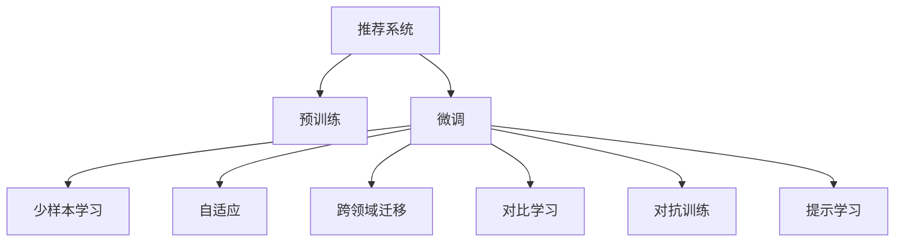

                 

# 推荐系统中的大模型少样本学习与适应

> 关键词：大语言模型,少样本学习,预训练,微调,推荐系统,自适应,跨领域迁移

## 1. 背景介绍

### 1.1 问题由来

随着深度学习技术的快速发展，推荐系统作为人工智能领域的重要应用之一，在电商、社交、视频等多个领域发挥了巨大的作用。传统的推荐系统基于用户行为数据进行建模，但随着数据量的不断增加，模型复杂度的提升，推荐系统面临着数据过拟合、模型泛化性不足等问题。近年来，大模型在推荐系统中的应用得到了越来越多的关注。大模型通过在大规模无标签数据上进行预训练，学习到通用的语言表示，能够对自然语言进行更深层次的理解和处理，从而提升推荐系统的性能。

然而，对于推荐系统来说，大规模预训练并不总是适用的。一方面，预训练过程中需要消耗大量的计算资源和时间，不适合所有推荐场景；另一方面，预训练大模型的泛化能力也受到数据分布的限制，无法很好地适应不同的推荐任务。因此，如何在保持预训练大模型泛化能力的同时，通过少量的标注数据进行微调，提升推荐系统的性能，成为当前推荐系统研究的一个重要课题。

### 1.2 问题核心关键点

大模型在推荐系统中的应用主要集中在预训练和微调两个方面：

- 预训练：指在大规模无标签数据上，通过自监督学习任务训练通用语言模型的过程。常见的预训练任务包括掩码语言模型、上下文预测等。
- 微调：指在预训练模型的基础上，使用推荐系统的少量标注数据，通过有监督学习优化模型在特定推荐任务上的性能。通常只需要调整顶层分类器或解码器，并以较小的学习率更新全部或部分的模型参数。

微调的关键在于如何避免过拟合，同时最大程度发挥预训练模型学到的知识。目前主流的做法包括：

- 选择合适的学习率。相比从头训练，微调通常需要更小的学习率，以免破坏预训练的权重。
- 应用正则化技术。如L2正则、Dropout、Early Stopping等，防止模型过度适应小规模训练集。
- 保留预训练的部分层。如Transformer的底层，只微调顶层，减少需优化的参数。
- 数据增强。通过对训练样本改写、回译等方式丰富训练集多样性。
- 对抗训练。加入对抗样本，提高模型鲁棒性。
- 提示学习。通过在输入文本中添加提示模板(Prompt Template)，引导大语言模型进行特定任务的推理和生成。可以在不更新模型参数的情况下，实现零样本或少样本学习。

这些方法在许多推荐系统中都得到了验证，取得了不错的效果。但针对推荐系统独特的少样本学习需求，如何更好地利用预训练大模型，提升模型性能，仍是值得深入研究的问题。

## 2. 核心概念与联系

### 2.1 核心概念概述

为更好地理解基于大模型的推荐系统中的少样本学习与适应，本节将介绍几个密切相关的核心概念：

- 推荐系统(Recommender System)：指通过算法从大规模数据中挖掘用户偏好，为用户推荐感兴趣物品的系统。常见的推荐算法包括协同过滤、基于内容的推荐、混合推荐等。
- 预训练(Pre-training)：指在大规模无标签数据上，通过自监督学习任务训练通用语言模型的过程。常见的预训练任务包括掩码语言模型、上下文预测等。
- 微调(Fine-tuning)：指在预训练模型的基础上，使用推荐系统的少量标注数据，通过有监督学习优化模型在特定推荐任务上的性能。通常只需要调整顶层分类器或解码器，并以较小的学习率更新全部或部分的模型参数。
- 少样本学习(Few-shot Learning)：指在只有少量标注样本的情况下，模型能够快速适应新任务的学习方法。
- 自适应(Adaptation)：指模型能够适应数据分布变化，自动更新模型参数以匹配新任务的特点。
- 跨领域迁移(Cross-domain Transfer)：指模型能够将在一个领域学到的知识，迁移到另一个不同但相关的领域。
- 对比学习(Contrastive Learning)：通过最大化相似样本和负样本之间的差异，提升模型的泛化能力。
- 对抗训练(Adversarial Training)：通过加入对抗样本，提高模型的鲁棒性和泛化能力。
- 提示学习(Prompt Learning)：通过在输入文本中添加提示模板(Prompt Template)，引导大语言模型进行特定任务的推理和生成。

这些概念之间的逻辑关系可以通过以下Mermaid流程图来展示：



这个流程图展示了大模型在推荐系统中的核心概念及其之间的关系：

1. 推荐系统通过收集用户行为数据，利用预训练大模型进行特征提取，得到用户-物品交互的语义表示。
2. 预训练大模型通过自监督学习任务，学习到通用的语言表示，提升模型的泛化能力。
3. 微调通过少量的标注数据，优化模型在特定推荐任务上的性能。
4. 少样本学习通过精心设计的提示模板，利用大模型的语言理解能力，实现快速适应新任务。
5. 自适应通过动态更新模型参数，提升模型对数据分布变化的适应能力。
6. 跨领域迁移通过迁移学习，使模型在多个领域之间进行知识共享。
7. 对比学习通过增加负样本数量，提升模型的泛化能力。
8. 对抗训练通过加入对抗样本，提高模型的鲁棒性。
9. 提示学习通过在输入文本中添加提示模板，引导模型按期望方式输出，减少微调参数。

这些概念共同构成了大模型在推荐系统中的应用框架，使其能够在各种场景下发挥强大的语言理解和生成能力。通过理解这些核心概念，我们可以更好地把握大模型在推荐系统中的应用策略和优化方向。

## 3. 核心算法原理 & 具体操作步骤
### 3.1 算法原理概述

基于大模型的推荐系统中的少样本学习与适应，本质上是一种有监督的细粒度迁移学习过程。其核心思想是：将预训练的大模型视作一个强大的"特征提取器"，通过在推荐系统的少量标注数据上进行有监督的微调，使得模型输出能够匹配推荐任务的目标，从而获得针对特定推荐任务优化的模型。

形式化地，假设预训练模型为 $M_{\theta}$，其中 $\theta$ 为预训练得到的模型参数。给定推荐系统的少量标注数据集 $D=\{(x_i,y_i)\}_{i=1}^N$，其中 $x_i$ 为物品描述文本，$y_i$ 为物品是否被用户点击。微调的目标是找到新的模型参数 $\hat{\theta}$，使得：

$$
\hat{\theta}=\mathop{\arg\min}_{\theta} \mathcal{L}(M_{\theta},D)
$$

其中 $\mathcal{L}$ 为针对推荐任务设计的损失函数，用于衡量模型预测输出与真实标签之间的差异。常见的损失函数包括交叉熵损失、均方误差损失等。

通过梯度下降等优化算法，微调过程不断更新模型参数 $\theta$，最小化损失函数 $\mathcal{L}$，使得模型输出逼近真实标签。由于 $\theta$ 已经通过预训练获得了较好的初始化，因此即便在推荐系统的小规模数据集 $D$ 上进行微调，也能较快收敛到理想的模型参数 $\hat{\theta}$。

### 3.2 算法步骤详解

基于大模型的推荐系统中的少样本学习与适应一般包括以下几个关键步骤：

**Step 1: 准备预训练模型和数据集**
- 选择合适的预训练语言模型 $M_{\theta}$ 作为初始化参数，如 BERT、GPT 等。
- 准备推荐系统的少量标注数据集 $D$，划分为训练集、验证集和测试集。一般要求标注数据与预训练数据的分布不要差异过大。

**Step 2: 添加推荐适配层**
- 根据推荐任务类型，在预训练模型顶层设计合适的输出层和损失函数。
- 对于推荐排序任务，通常在顶层添加线性分类器和交叉熵损失函数。
- 对于推荐过滤任务，通常使用逻辑回归或softmax分类器输出是否点击的概率。

**Step 3: 设置微调超参数**
- 选择合适的优化算法及其参数，如 AdamW、SGD 等，设置学习率、批大小、迭代轮数等。
- 设置正则化技术及强度，包括权重衰减、Dropout、Early Stopping 等。
- 确定冻结预训练参数的策略，如仅微调顶层，或全部参数都参与微调。

**Step 4: 执行梯度训练**
- 将训练集数据分批次输入模型，前向传播计算损失函数。
- 反向传播计算参数梯度，根据设定的优化算法和学习率更新模型参数。
- 周期性在验证集上评估模型性能，根据性能指标决定是否触发 Early Stopping。
- 重复上述步骤直到满足预设的迭代轮数或 Early Stopping 条件。

**Step 5: 测试和部署**
- 在测试集上评估微调后模型 $M_{\hat{\theta}}$ 的性能，对比微调前后的精度提升。
- 使用微调后的模型对新样本进行推理预测，集成到实际的应用系统中。
- 持续收集新的数据，定期重新微调模型，以适应数据分布的变化。

以上是基于大模型的推荐系统中的少样本学习与适应的一般流程。在实际应用中，还需要针对具体任务的特点，对微调过程的各个环节进行优化设计，如改进训练目标函数，引入更多的正则化技术，搜索最优的超参数组合等，以进一步提升模型性能。

### 3.3 算法优缺点

基于大模型的推荐系统中的少样本学习与适应方法具有以下优点：

1. 简单高效。只需准备少量标注数据，即可对预训练模型进行快速适配，获得较大的性能提升。
2. 通用适用。适用于各种推荐系统任务，包括推荐排序、推荐过滤、推荐生成等，设计简单的任务适配层即可实现微调。
3. 参数高效。利用参数高效微调技术，在固定大部分预训练权重不变的情况下，仍可取得不错的提升。
4. 效果显著。在学术界和工业界的诸多推荐系统中，基于微调的方法已经刷新了最先进的性能指标。

同时，该方法也存在一定的局限性：

1. 依赖标注数据。微调的效果很大程度上取决于标注数据的质量和数量，获取高质量标注数据的成本较高。
2. 迁移能力有限。当目标任务与预训练数据的分布差异较大时，微调的性能提升有限。
3. 可解释性不足。微调模型的决策过程通常缺乏可解释性，难以对其推理逻辑进行分析和调试。
4. 对抗样本敏感。大模型容易受到对抗样本的干扰，需要采取对抗训练等方法提高鲁棒性。

尽管存在这些局限性，但就目前而言，基于大模型的微调方法仍然是推荐系统中最主流范式。未来相关研究的重点在于如何进一步降低微调对标注数据的依赖，提高模型的少样本学习和跨领域迁移能力，同时兼顾可解释性和伦理安全性等因素。

### 3.4 算法应用领域

基于大模型的推荐系统中的少样本学习与适应方法在推荐系统领域已经得到了广泛的应用，覆盖了几乎所有常见任务，例如：

- 推荐排序：通过微调模型预测用户对物品的点击概率，将物品按照相关性排序推荐。
- 推荐过滤：通过微调模型预测用户是否会点击某个物品，实现精确的推荐过滤。
- 推荐生成：通过微调模型生成新的物品描述，丰富商品库。
- 用户行为分析：通过微调模型分析用户的行为模式，进行个性化推荐。

除了上述这些经典任务外，大模型中的少样本学习与适应方法也被创新性地应用到更多场景中，如可控推荐、情感分析、用户画像生成等，为推荐系统技术带来了全新的突破。随着预训练模型和微调方法的不断进步，相信推荐系统技术将在更广阔的应用领域大放异彩。

## 4. 数学模型和公式 & 详细讲解 & 举例说明

### 4.1 数学模型构建

本节将使用数学语言对基于大模型的推荐系统中的少样本学习与适应过程进行更加严格的刻画。

记预训练语言模型为 $M_{\theta}$，其中 $\theta$ 为预训练得到的模型参数。假设推荐系统的少量标注数据集 $D=\{(x_i,y_i)\}_{i=1}^N$，其中 $x_i$ 为物品描述文本，$y_i$ 为物品是否被用户点击。

定义模型 $M_{\theta}$ 在输入 $x_i$ 上的输出为 $\hat{y}=M_{\theta}(x_i)$，表示物品被点击的概率。真实标签 $y_i \in \{0,1\}$。则推荐排序任务的交叉熵损失函数定义为：

$$
\ell(M_{\theta}(x_i),y_i) = -[y_i\log \hat{y}_i + (1-y_i)\log (1-\hat{y}_i)]
$$

将其代入经验风险公式，得：

$$
\mathcal{L}(\theta) = -\frac{1}{N}\sum_{i=1}^N [y_i\log M_{\theta}(x_i)+(1-y_i)\log(1-M_{\theta}(x_i))]
$$

在得到损失函数的梯度后，即可带入参数更新公式，完成模型的迭代优化。重复上述过程直至收敛，最终得到适应推荐排序任务的最优模型参数 $\theta^*$。

### 4.2 公式推导过程

以下我们以推荐排序任务为例，推导交叉熵损失函数及其梯度的计算公式。

假设模型 $M_{\theta}$ 在输入 $x$ 上的输出为 $\hat{y}=M_{\theta}(x) \in [0,1]$，表示物品被点击的概率。真实标签 $y \in \{0,1\}$。则二分类交叉熵损失函数定义为：

$$
\ell(M_{\theta}(x),y) = -[y\log \hat{y} + (1-y)\log (1-\hat{y})]
$$

将其代入经验风险公式，得：

$$
\mathcal{L}(\theta) = -\frac{1}{N}\sum_{i=1}^N [y_i\log M_{\theta}(x_i)+(1-y_i)\log(1-M_{\theta}(x_i))]
$$

根据链式法则，损失函数对参数 $\theta_k$ 的梯度为：

$$
\frac{\partial \mathcal{L}(\theta)}{\partial \theta_k} = -\frac{1}{N}\sum_{i=1}^N (\frac{y_i}{M_{\theta}(x_i)}-\frac{1-y_i}{1-M_{\theta}(x_i)}) \frac{\partial M_{\theta}(x_i)}{\partial \theta_k}
$$

其中 $\frac{\partial M_{\theta}(x_i)}{\partial \theta_k}$ 可进一步递归展开，利用自动微分技术完成计算。

在得到损失函数的梯度后，即可带入参数更新公式，完成模型的迭代优化。重复上述过程直至收敛，最终得到适应推荐排序任务的最优模型参数 $\theta^*$。

## 5. 项目实践：代码实例和详细解释说明

### 5.1 开发环境搭建

在进行微调实践前，我们需要准备好开发环境。以下是使用Python进行PyTorch开发的环境配置流程：

1. 安装Anaconda：从官网下载并安装Anaconda，用于创建独立的Python环境。

2. 创建并激活虚拟环境：
```bash
conda create -n pytorch-env python=3.8 
conda activate pytorch-env
```

3. 安装PyTorch：根据CUDA版本，从官网获取对应的安装命令。例如：
```bash
conda install pytorch torchvision torchaudio cudatoolkit=11.1 -c pytorch -c conda-forge
```

4. 安装Transformers库：
```bash
pip install transformers
```

5. 安装各类工具包：
```bash
pip install numpy pandas scikit-learn matplotlib tqdm jupyter notebook ipython
```

完成上述步骤后，即可在`pytorch-env`环境中开始微调实践。

### 5.2 源代码详细实现

这里我们以推荐排序任务为例，给出使用Transformers库对BERT模型进行微调的PyTorch代码实现。

首先，定义推荐排序任务的数据处理函数：

```python
from transformers import BertTokenizer
from torch.utils.data import Dataset
import torch

class RecommendationDataset(Dataset):
    def __init__(self, items, labels, tokenizer, max_len=128):
        self.items = items
        self.labels = labels
        self.tokenizer = tokenizer
        self.max_len = max_len
        
    def __len__(self):
        return len(self.items)
    
    def __getitem__(self, item):
        item = self.items[item]
        label = self.labels[item]
        
        encoding = self.tokenizer(item, return_tensors='pt', max_length=self.max_len, padding='max_length', truncation=True)
        input_ids = encoding['input_ids'][0]
        attention_mask = encoding['attention_mask'][0]
        
        # 将标签转换为浮点数
        label = float(label)
        
        return {'input_ids': input_ids, 
                'attention_mask': attention_mask,
                'labels': label}

# 创建dataset
tokenizer = BertTokenizer.from_pretrained('bert-base-cased')

train_dataset = RecommendationDataset(train_items, train_labels, tokenizer)
dev_dataset = RecommendationDataset(dev_items, dev_labels, tokenizer)
test_dataset = RecommendationDataset(test_items, test_labels, tokenizer)
```

然后，定义模型和优化器：

```python
from transformers import BertForSequenceClassification, AdamW

model = BertForSequenceClassification.from_pretrained('bert-base-cased', num_labels=2)

optimizer = AdamW(model.parameters(), lr=2e-5)
```

接着，定义训练和评估函数：

```python
from torch.utils.data import DataLoader
from tqdm import tqdm
from sklearn.metrics import roc_auc_score

device = torch.device('cuda') if torch.cuda.is_available() else torch.device('cpu')
model.to(device)

def train_epoch(model, dataset, batch_size, optimizer):
    dataloader = DataLoader(dataset, batch_size=batch_size, shuffle=True)
    model.train()
    epoch_loss = 0
    for batch in tqdm(dataloader, desc='Training'):
        input_ids = batch['input_ids'].to(device)
        attention_mask = batch['attention_mask'].to(device)
        labels = batch['labels'].to(device)
        model.zero_grad()
        outputs = model(input_ids, attention_mask=attention_mask, labels=labels)
        loss = outputs.loss
        epoch_loss += loss.item()
        loss.backward()
        optimizer.step()
    return epoch_loss / len(dataloader)

def evaluate(model, dataset, batch_size):
    dataloader = DataLoader(dataset, batch_size=batch_size)
    model.eval()
    preds, labels = [], []
    with torch.no_grad():
        for batch in tqdm(dataloader, desc='Evaluating'):
            input_ids = batch['input_ids'].to(device)
            attention_mask = batch['attention_mask'].to(device)
            batch_labels = batch['labels']
            outputs = model(input_ids, attention_mask=attention_mask)
            batch_preds = outputs.logits.argmax(dim=1).to('cpu').tolist()
            batch_labels = batch_labels.to('cpu').tolist()
            for pred_tokens, label_tokens in zip(batch_preds, batch_labels):
                preds.append(pred_tokens)
                labels.append(label_tokens)
                
    return roc_auc_score(labels, preds)

```

最后，启动训练流程并在测试集上评估：

```python
epochs = 5
batch_size = 16

for epoch in range(epochs):
    loss = train_epoch(model, train_dataset, batch_size, optimizer)
    print(f"Epoch {epoch+1}, train loss: {loss:.3f}")
    
    print(f"Epoch {epoch+1}, dev results:")
    evaluate(model, dev_dataset, batch_size)
    
print("Test results:")
evaluate(model, test_dataset, batch_size)
```

以上就是使用PyTorch对BERT进行推荐排序任务微调的完整代码实现。可以看到，得益于Transformers库的强大封装，我们可以用相对简洁的代码完成BERT模型的加载和微调。

### 5.3 代码解读与分析

让我们再详细解读一下关键代码的实现细节：

**RecommendationDataset类**：
- `__init__`方法：初始化物品、标签、分词器等关键组件。
- `__len__`方法：返回数据集的样本数量。
- `__getitem__`方法：对单个样本进行处理，将物品输入编码为token ids，将标签转换为浮点数，并对其进行定长padding，最终返回模型所需的输入。

**数据处理**：
- 使用BertTokenizer将物品描述文本转化为token ids和注意力掩码。
- 将标签转换为浮点数，方便与模型输出进行交叉熵损失的计算。

**模型训练**：
- 使用PyTorch的DataLoader对数据集进行批次化加载，供模型训练和推理使用。
- 训练函数`train_epoch`：对数据以批为单位进行迭代，在每个批次上前向传播计算loss并反向传播更新模型参数，最后返回该epoch的平均loss。
- 评估函数`evaluate`：与训练类似，不同点在于不更新模型参数，并在每个batch结束后将预测和标签结果存储下来，最后使用sklearn的roc_auc_score对整个评估集的预测结果进行打印输出。

**训练流程**：
- 定义总的epoch数和batch size，开始循环迭代
- 每个epoch内，先在训练集上训练，输出平均loss
- 在验证集上评估，输出roc_auc评分
- 所有epoch结束后，在测试集上评估，给出最终测试结果

可以看到，PyTorch配合Transformers库使得BERT微调的代码实现变得简洁高效。开发者可以将更多精力放在数据处理、模型改进等高层逻辑上，而不必过多关注底层的实现细节。

当然，工业级的系统实现还需考虑更多因素，如模型的保存和部署、超参数的自动搜索、更灵活的任务适配层等。但核心的微调范式基本与此类似。

## 6. 实际应用场景
### 6.1 智能推荐系统

基于大语言模型微调的推荐系统在电商、社交、视频等多个领域发挥了巨大的作用。推荐系统能够根据用户的兴趣和行为，自动生成个性化的物品推荐，提升用户体验和转化率。

在技术实现上，可以收集用户浏览、点击、购买等行为数据，提取和用户交互的物品标题、描述、标签等文本内容。将文本内容作为模型输入，用户的行为数据作为监督信号，在此基础上微调预训练语言模型。微调后的模型能够从文本内容中准确把握用户的兴趣点。在生成推荐列表时，先用候选物品的文本描述作为输入，由模型预测用户对物品的兴趣程度，再结合其他特征综合排序，便可以得到个性化程度更高的推荐结果。

### 6.2 多模态推荐系统

传统的推荐系统主要聚焦于文本数据，但在现代社会，图像、视频等多模态数据也成为了推荐系统中重要的数据源。通过引入图像、视频等多模态数据，推荐系统可以更全面地了解用户偏好，提供更加多样化的推荐服务。

在多模态推荐系统中，可以分别对文本、图像、视频等多模态数据进行预训练，然后将不同模态的数据特征融合，作为推荐模型的输入。通过微调，模型可以学习不同模态数据的关联关系，生成更全面、更精准的推荐结果。

### 6.3 情感驱动的推荐系统

情感分析作为推荐系统中重要的辅助手段，可以帮助推荐系统更好地理解用户的情感倾向，提供更加符合用户心理预期的推荐服务。

在情感驱动的推荐系统中，可以收集用户的情感标签，如积极、中性、消极等，作为模型的监督信号。通过微调，模型能够从文本内容中准确把握用户的情感倾向，进而生成情感驱动的推荐结果。这种推荐方式不仅能够提升用户体验，还能够帮助商家进行情感营销，提升品牌影响力。

### 6.4 未来应用展望

随着大语言模型微调技术的不断发展，推荐系统将在更多领域得到应用，为传统行业带来变革性影响。

在智慧医疗领域，基于大语言模型微调的推荐系统可以辅助医生进行个性化诊疗，提升医疗服务的智能化水平。

在智能教育领域，微调技术可应用于作业批改、学情分析、知识推荐等方面，因材施教，促进教育公平，提高教学质量。

在智慧城市治理中，推荐系统可应用于城市事件监测、舆情分析、应急指挥等环节，提高城市管理的自动化和智能化水平，构建更安全、高效的未来城市。

此外，在企业生产、社会治理、文娱传媒等众多领域，基于大模型微调的人工智能应用也将不断涌现，为经济社会发展注入新的动力。相信随着技术的日益成熟，微调方法将成为推荐系统的重要范式，推动推荐系统向更广阔的领域加速渗透。

## 7. 工具和资源推荐
### 7.1 学习资源推荐

为了帮助开发者系统掌握大语言模型微调的理论基础和实践技巧，这里推荐一些优质的学习资源：

1. 《Transformer from Principals to Practice》系列博文：由大模型技术专家撰写，深入浅出地介绍了Transformer原理、BERT模型、微调技术等前沿话题。

2. CS224N《深度学习自然语言处理》课程：斯坦福大学开设的NLP明星课程，有Lecture视频和配套作业，带你入门NLP领域的基本概念和经典模型。

3. 《Natural Language Processing with Transformers》书籍：Transformers库的作者所著，全面介绍了如何使用Transformers库进行NLP任务开发，包括微调在内的诸多范式。

4. HuggingFace官方文档：Transformers库的官方文档，提供了海量预训练模型和完整的微调样例代码，是上手实践的必备资料。

5. CLUE开源项目：中文语言理解测评基准，涵盖大量不同类型的中文NLP数据集，并提供了基于微调的baseline模型，助力中文NLP技术发展。

通过对这些资源的学习实践，相信你一定能够快速掌握大语言模型微调的精髓，并用于解决实际的NLP问题。
###  7.2 开发工具推荐

高效的开发离不开优秀的工具支持。以下是几款用于大语言模型微调开发的常用工具：

1. PyTorch：基于Python的开源深度学习框架，灵活动态的计算图，适合快速迭代研究。大部分预训练语言模型都有PyTorch版本的实现。

2. TensorFlow：由Google主导开发的开源深度学习框架，生产部署方便，适合大规模工程应用。同样有丰富的预训练语言模型资源。

3. Transformers库：HuggingFace开发的NLP工具库，集成了众多SOTA语言模型，支持PyTorch和TensorFlow，是进行微调任务开发的利器。

4. Weights & Biases：模型训练的实验跟踪工具，可以记录和可视化模型训练过程中的各项指标，方便对比和调优。与主流深度学习框架无缝集成。

5. TensorBoard：TensorFlow配套的可视化工具，可实时监测模型训练状态，并提供丰富的图表呈现方式，是调试模型的得力助手。

6. Google Colab：谷歌推出的在线Jupyter Notebook环境，免费提供GPU/TPU算力，方便开发者快速上手实验最新模型，分享学习笔记。

合理利用这些工具，可以显著提升大语言模型微调任务的开发效率，加快创新迭代的步伐。

### 7.3 相关论文推荐

大语言模型和微调技术的发展源于学界的持续研究。以下是几篇奠基性的相关论文，推荐阅读：

1. Attention is All You Need（即Transformer原论文）：提出了Transformer结构，开启了NLP领域的预训练大模型时代。

2. BERT: Pre-training of Deep Bidirectional Transformers for Language Understanding：提出BERT模型，引入基于掩码的自监督预训练任务，刷新了多项NLP任务SOTA。

3. Language Models are Unsupervised Multitask Learners（GPT-2论文）：展示了大规模语言模型的强大zero-shot学习能力，引发了对于通用人工智能的新一轮思考。

4. Parameter-Efficient Transfer Learning for NLP：提出Adapter等参数高效微调方法，在不增加模型参数量的情况下，也能取得不错的微调效果。

5. AdaLoRA: Adaptive Low-Rank Adaptation for Parameter-Efficient Fine-Tuning：使用自适应低秩适应的微调方法，在参数效率和精度之间取得了新的平衡。

这些论文代表了大语言模型微调技术的发展脉络。通过学习这些前沿成果，可以帮助研究者把握学科前进方向，激发更多的创新灵感。

## 8. 总结：未来发展趋势与挑战

### 8.1 总结

本文对基于大模型的推荐系统中的少样本学习与适应方法进行了全面系统的介绍。首先阐述了大语言模型和微调技术的研究背景和意义，明确了微调在拓展预训练模型应用、提升推荐系统性能方面的独特价值。其次，从原理到实践，详细讲解了少样本学习与适应的数学原理和关键步骤，给出了微调任务开发的完整代码实例。同时，本文还广泛探讨了少样本学习与适应方法在推荐系统独特需求下的应用场景，展示了少样本学习与适应范式的巨大潜力。

通过本文的系统梳理，可以看到，基于大模型的少样本学习与适应方法正在成为推荐系统中最主流范式，极大地拓展了预训练语言模型的应用边界，催生了更多的落地场景。得益于大规模语料的预训练，微调模型以更低的时间和标注成本，在小样本条件下也能取得不俗的效果，有力推动了推荐系统技术的产业化进程。未来，伴随预训练语言模型和微调方法的持续演进，相信推荐系统技术将在更广阔的应用领域大放异彩，深刻影响人类的生产生活方式。

### 8.2 未来发展趋势

展望未来，大模型在推荐系统中的少样本学习与适应方法将呈现以下几个发展趋势：

1. 模型规模持续增大。随着算力成本的下降和数据规模的扩张，预训练语言模型的参数量还将持续增长。超大规模语言模型蕴含的丰富语言知识，有望支撑更加复杂多变的推荐任务。

2. 少样本学习日趋多样。除了传统的全参数微调外，未来会涌现更多少样本学习与适应方法，如Prompt-Tuning、LoRA等，在保持预训练参数不变的情况下，提升模型在小样本上的性能。

3. 自适应能力增强。推荐系统的推荐任务随着时间变化而动态变化，未来的自适应模型能够实时更新模型参数，以匹配新任务的特征。

4. 跨领域迁移更加灵活。推荐系统中的任务涉及多个领域，未来的跨领域迁移方法能够更好地在不同领域间进行知识共享。

5. 融合因果和对比学习范式。通过引入因果推断和对比学习思想，增强模型建立稳定因果关系的能力，学习更加普适、鲁棒的语言表征，从而提升模型泛化能力。

6. 引入更多先验知识。将符号化的先验知识，如知识图谱、逻辑规则等，与神经网络模型进行巧妙融合，引导微调过程学习更准确、合理的语言模型。

这些趋势凸显了大模型在推荐系统中的应用前景。这些方向的探索发展，必将进一步提升推荐系统的性能和应用范围，为人工智能技术落地应用提供新的方向。

### 8.3 面临的挑战

尽管大语言模型在推荐系统中的少样本学习与适应方法已经取得了不错的效果，但在迈向更加智能化、普适化应用的过程中，它仍面临诸多挑战：

1. 数据过拟合风险。在少样本学习与适应中，模型容易过拟合少数标注样本，导致在新数据上的泛化性能下降。如何降低过拟合风险，提升模型的泛化能力，是一大难题。

2. 标注成本高昂。获取高质量的标注数据需要耗费大量人力和时间，如何降低标注成本，成为未来研究的重要方向。

3. 对抗样本敏感。大模型容易受到对抗样本的干扰，如何提升模型的鲁棒性，避免误导性输出，是未来需要关注的重点。

4. 知识整合能力不足。现有的少样本学习与适应方法往往局限于特定任务，难以灵活吸收和运用更广泛的先验知识。如何让模型更好地与外部知识库、规则库等专家知识结合，形成更加全面、准确的信息整合能力，还有很大的想象空间。

5. 模型可解释性不足。当前少样本学习与适应模型通常缺乏可解释性，难以解释其内部工作机制和决策逻辑。对于高风险应用，算法的可解释性和可审计性尤为重要。

这些挑战凸显了少样本学习与适应方法在大规模实际应用中的复杂性和难度。如何从数据、算法、工程、伦理等多个维度进行优化，是未来研究的重要方向。

### 8.4 研究展望

面对少样本学习与适应方法所面临的种种挑战，未来的研究需要在以下几个方面寻求新的突破：

1. 探索无监督和半监督少样本学习方法。摆脱对大规模标注数据的依赖，利用自监督学习、主动学习等无监督和半监督范式，最大限度利用非结构化数据，实现更加灵活高效的少样本学习。

2. 研究参数高效和计算高效的少样本学习范式。开发更加参数高效的少样本学习方法，在保持预训练参数不变的情况下，只更新极少量的任务相关参数。同时优化计算图，减少前向传播和反向传播的资源消耗，实现更加轻量级、实时性的部署。

3. 引入因果和对比学习思想。通过引入因果推断和对比学习思想，增强模型建立稳定因果关系的能力，学习更加普适、鲁棒的语言表征，从而提升模型泛化能力。

4. 结合知识图谱和逻辑推理工具。将符号化的先验知识，如知识图谱、逻辑规则等，与神经网络模型进行巧妙融合，引导少样本学习过程学习更准确、合理的语言模型。

5. 纳入伦理道德约束。在模型训练目标中引入伦理导向的评估指标，过滤和惩罚有偏见、有害的输出倾向。同时加强人工干预和审核，建立模型行为的监管机制，确保输出符合人类价值观和伦理道德。

这些研究方向的探索，必将引领少样本学习与适应方法走向更高的台阶，为构建安全、可靠、可解释、可控的智能系统铺平道路。面向未来，少样本学习与适应技术还需要与其他人工智能技术进行更深入的融合，如知识表示、因果推理、强化学习等，多路径协同发力，共同推动自然语言理解和智能交互系统的进步。只有勇于创新、敢于突破，才能不断拓展语言模型的边界，让智能技术更好地造福人类社会。

## 9. 附录：常见问题与解答

**Q1：大模型在推荐系统中是否适用于所有任务？**

A: 大模型在推荐系统中的应用主要集中在预训练和微调两个方面。预训练大模型可以学习通用的语言表示，适用于文本数据的处理。而微调则针对特定推荐任务进行优化，能够提升模型的性能。但是，对于推荐系统中的复杂任务，如多模态推荐、情感驱动推荐等，单一的大模型可能无法胜任，需要结合其他模型进行联合建模。

**Q2：如何选择合适的学习率？**

A: 在少样本学习与适应中，学习率的选择对模型的性能有着重要影响。一般建议从较小的学习率开始，逐步增大，以避免破坏预训练权重。同时，可以使用学习率调度策略，如Warmup、Cyclical Learning Rates等，适应不同阶段的训练需求。

**Q3：如何缓解微调过程中的过拟合问题？**

A: 在少样本学习与适应中，过拟合是一个重要问题。可以通过以下方法缓解：
1. 数据增强：通过回译、近义替换等方式扩充训练集。
2. 正则化：使用L2正则、Dropout、Early Stopping等避免过拟合。
3. 对抗训练：加入对抗样本，提高模型鲁棒性。
4. 参数高效微调：只调整少量参数(如Adapter、Prefix等)，减小过拟合风险。

**Q4：如何在少样本学习中提升模型泛化能力？**

A: 提升模型泛化能力是少样本学习与适应中的重要目标。可以通过以下方法实现：
1. 引入更多先验知识：如知识图谱、逻辑规则等，引导少样本学习过程学习更准确、合理的语言模型。
2. 融合因果和对比学习范式：通过引入因果推断和对比学习思想，增强模型建立稳定因果关系的能力，学习更加普适、鲁棒的语言表征。
3. 使用自适应和跨领域迁移方法：通过动态更新模型参数，提升模型对数据分布变化的适应能力，实现跨领域迁移。

**Q5：如何在推荐系统中进行模型部署？**

A: 在推荐系统中进行模型部署，需要考虑以下因素：
1. 模型裁剪：去除不必要的层和参数，减小模型尺寸，加快推理速度。
2. 量化加速：将浮点模型转为定点模型，压缩存储空间，提高计算效率。
3. 服务化封装：将模型封装为标准化服务接口，便于集成调用。
4. 弹性伸缩：根据请求流量动态调整资源配置，平衡服务质量和成本。
5. 监控告警：实时采集系统指标，设置异常告警阈值，确保服务稳定性。

大语言模型微调为推荐系统提供了新的思路和方法，但如何将强大的性能转化为稳定、高效、安全的业务价值，还需要工程实践的不断打磨。只有从数据、算法、工程、业务等多个维度协同发力，才能真正实现人工智能技术在推荐系统中的落地应用。总之，少样本学习与适应需要开发者根据具体任务，不断迭代和优化模型、数据和算法，方能得到理想的效果。

---

作者：禅与计算机程序设计艺术 / Zen and the Art of Computer Programming

