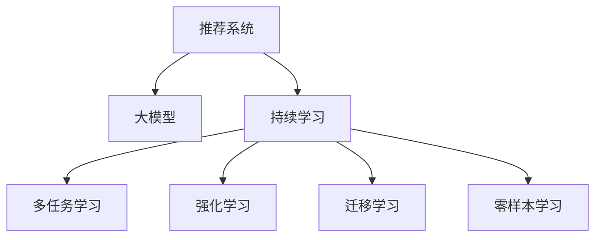

                 

# 推荐系统中的大模型持续学习应用

> 关键词：推荐系统,大模型,持续学习,多任务学习,强化学习,深度学习,神经网络,应用实例

## 1. 背景介绍

### 1.1 问题由来
推荐系统是互联网时代的核心应用之一，通过分析用户的历史行为和偏好，为用户推荐个性化的商品或内容。随着用户规模的爆炸性增长和数据的多样化，传统推荐系统面临着数据冷启动、用户兴趣动态变化等挑战。

传统的推荐系统主要基于协同过滤、内容推荐、基于知识图谱推荐等方法。这些方法在数据量大、用户行为多样化的场景下，往往表现不佳。以协同过滤为例，它依赖于用户行为数据进行用户和商品间的相似度计算，当新商品或新用户加入时，难以有效建模。基于知识图谱的推荐方法，往往需要结构化数据进行训练，难以灵活应对复杂非结构化数据。

近年来，随着深度学习在推荐系统领域的广泛应用，基于深度神经网络的推荐模型取得了显著进展。其中，基于大模型的推荐方法，如Transformer和BERT等，以其强大的表征能力和泛化能力，成为推荐系统研究的热点。通过大模型预训练，推荐模型能够从大规模数据中学习到更丰富的语义和特征信息，提升推荐效果。

然而，现实世界的推荐场景是动态变化的。用户行为和商品属性是时变的，如何在大模型中保持持续学习，及时更新推荐策略，是推荐系统领域的重要挑战。基于持续学习的大模型推荐方法，正是应运而生的技术范式，通过实时数据流驱动模型不断更新，适应不断变化的推荐任务，提升推荐系统的性能和鲁棒性。

### 1.2 问题核心关键点
大模型持续学习在推荐系统中的应用，主要体现在以下几个关键点：

- 实时更新模型：通过不断加入新的用户行为和商品数据，实时更新模型参数，保持模型对当前推荐场景的适应性。
- 多任务学习：利用多任务学习的思想，在用户行为预测、商品属性挖掘等不同任务间进行知识共享，提升模型泛化能力。
- 强化学习：引入强化学习，通过用户反馈进行模型优化，提升推荐系统的人机交互效果和用户体验。
- 迁移学习：利用大模型的预训练知识，在新任务上进行微调，提升推荐系统在不同领域的适用性。
- 零样本学习：通过精心设计的任务描述，利用大模型的语言理解能力，实现零样本或少样本推荐，降低对训练数据的依赖。

本文将系统介绍大模型持续学习在推荐系统中的应用，包括算法原理、具体操作步骤、实际应用场景等，为推荐系统开发者提供全面的技术参考。

## 2. 核心概念与联系

### 2.1 核心概念概述

为更好地理解基于大模型的推荐系统持续学习，本节将介绍几个密切相关的核心概念：

- 推荐系统(Recommender System)：通过分析用户的历史行为和偏好，为用户推荐个性化的商品或内容。推荐系统是互联网时代的核心应用之一，广泛应用于电商、社交媒体、视频流媒体等领域。

- 大模型(Large Model)：以自回归(如Transformer)或自编码(如BERT)模型为代表的大规模预训练语言模型。通过在大规模无标签文本语料上进行预训练，学习通用的语言表示，具备强大的语言理解和生成能力。

- 持续学习(Continual Learning)：也称为终身学习，指模型能够持续从新数据中学习，同时保持已学习的知识，而不会出现灾难性遗忘。这对于保持大模型推荐系统的时效性和适应性至关重要。

- 多任务学习(Multi-task Learning)：指在多个相关任务上进行联合学习，实现知识共享和迁移，提升模型泛化能力。推荐系统中的多任务学习，通常包括用户行为预测、商品属性挖掘等任务。

- 强化学习(Reinforcement Learning, RL)：通过与环境交互，最大化累积奖励信号，实现模型优化。在推荐系统中，强化学习通常用于优化用户点击率、停留时间等行为指标。

- 迁移学习(Transfer Learning)：指将一个领域学习到的知识，迁移应用到另一个不同但相关的领域的学习范式。推荐系统中的迁移学习，通常指在已有用户行为数据上，进一步微调预训练大模型，提升推荐效果。

- 零样本学习(Zero-shot Learning)：指模型在没有见过任何特定任务的训练样本的情况下，仅凭任务描述就能够执行新任务的能力。推荐系统中的零样本学习，通常指利用大模型的语言理解能力，根据任务描述推荐相关商品或内容。

这些核心概念之间的逻辑关系可以通过以下Mermaid流程图来展示：



这个流程图展示了大模型推荐系统中的核心概念及其之间的关系：

1. 推荐系统通过大模型进行个性化推荐。
2. 持续学习使得模型能够实时更新，适应不断变化的推荐场景。
3. 多任务学习通过联合不同任务学习，提升模型的泛化能力。
4. 强化学习通过用户反馈进行模型优化，提升用户体验。
5. 迁移学习利用预训练知识在新任务上进行微调，提升推荐效果。
6. 零样本学习利用大模型的语言理解能力，实现少样本推荐。

这些概念共同构成了大模型推荐系统持续学习的框架，使其能够在各种推荐场景中发挥强大的推荐能力。

## 3. 核心算法原理 & 具体操作步骤
### 3.1 算法原理概述

基于大模型的推荐系统持续学习，本质上是一个多任务的持续学习过程。其核心思想是：将推荐系统看作多个子任务，每个子任务对应一个或多个推荐目标，通过在多个子任务上进行联合学习，实时更新模型参数，提升推荐效果。

形式化地，假设推荐系统中有 $K$ 个推荐子任务，每个子任务的目标是最大化推荐指标 $\textit{metric}_k$，目标函数为：

$$
\min_{\theta} \sum_{k=1}^K \textit{cost}_k(\theta_k)
$$

其中 $\theta_k$ 为第 $k$ 个子任务对应的模型参数，$\textit{cost}_k$ 为子任务的目标函数。

在实际应用中，通常将用户行为预测、商品属性挖掘等作为不同的子任务，联合进行训练，实时更新模型参数。这种多任务学习的范式，通过知识共享和迁移，提升了模型的泛化能力和鲁棒性。

### 3.2 算法步骤详解

基于大模型的推荐系统持续学习，一般包括以下几个关键步骤：

**Step 1: 准备数据集和模型**

- 收集推荐系统的实时数据流，包括用户行为、商品信息等。
- 选择合适的预训练语言模型 $M_{\theta}$ 作为初始化参数，如 BERT、GPT 等。
- 设计合适的多任务损失函数，如交叉熵损失、均方误差损失等。

**Step 2: 定义推荐目标**

- 根据推荐任务的特点，定义多个子任务目标，如用户行为预测、商品属性挖掘等。
- 每个子任务对应一个或多个推荐指标，如点击率、停留时间等。
- 定义每个子任务的模型参数 $\theta_k$。

**Step 3: 选择优化算法和参数**

- 选择合适的优化算法及其参数，如 AdamW、SGD 等，设置学习率、批大小、迭代轮数等。
- 设置正则化技术及强度，包括权重衰减、Dropout、Early Stopping 等。
- 确定冻结预训练参数的策略，如仅微调顶层，或全部参数都参与微调。

**Step 4: 执行梯度训练**

- 将实时数据流进行分批次处理，前向传播计算损失函数。
- 反向传播计算参数梯度，根据设定的优化算法和学习率更新模型参数。
- 周期性在验证集上评估模型性能，根据性能指标决定是否触发 Early Stopping。
- 重复上述步骤直至满足预设的迭代轮数或 Early Stopping 条件。

**Step 5: 测试和部署**

- 在测试集上评估持续学习后模型 $M_{\theta}$ 的性能，对比持续学习前后的推荐效果。
- 使用持续学习后的模型对新用户进行推荐，集成到实际的应用系统中。
- 持续收集新的数据，定期重新持续学习模型，以适应数据分布的变化。

以上是基于大模型的推荐系统持续学习的通用流程。在实际应用中，还需要针对具体任务的特点，对持续学习过程的各个环节进行优化设计，如改进训练目标函数，引入更多的正则化技术，搜索最优的超参数组合等，以进一步提升模型性能。

### 3.3 算法优缺点

基于大模型的推荐系统持续学习具有以下优点：

1. 实时更新模型：通过实时数据流驱动模型持续学习，能够快速适应新用户的动态变化，提升推荐效果。
2. 多任务学习：通过联合多个子任务学习，实现知识共享和迁移，提升模型泛化能力。
3. 提升推荐效果：实时更新模型，不断吸收新数据，提升推荐系统的人机交互效果和用户体验。
4. 鲁棒性强：多任务学习的知识共享机制，能够增强模型的鲁棒性，提升模型对异常数据的抗干扰能力。
5. 应用广泛：推荐系统中的用户行为预测、商品属性挖掘等任务，均可以通过持续学习进行优化。

同时，该方法也存在一定的局限性：

1. 计算成本高：实时更新模型需要频繁的梯度计算和参数更新，计算资源消耗较大。
2. 数据分布变化：在推荐数据分布发生较大变化时，模型难以及时调整，可能影响推荐效果。
3. 模型复杂度高：多任务学习的知识共享机制，增加了模型的复杂度和训练难度。
4. 数据隐私问题：实时数据流中包含大量用户隐私信息，需要设计合适的隐私保护机制，防止数据泄露。

尽管存在这些局限性，但就目前而言，基于大模型的推荐系统持续学习仍是推荐系统研究的重要方向。未来相关研究的重点在于如何进一步降低持续学习对计算资源的依赖，提高模型的实时性，同时兼顾数据隐私和鲁棒性等因素。

### 3.4 算法应用领域

基于大模型的推荐系统持续学习，在推荐系统领域已经得到了广泛的应用，覆盖了几乎所有常见任务，例如：

- 用户行为预测：如用户点击率预测、停留时间预测等。通过持续学习更新用户行为模型，实时预测用户行为，提升推荐效果。
- 商品属性挖掘：通过多任务学习，挖掘商品的属性信息，提升商品推荐的个性化程度。
- 动态商品推荐：根据用户的即时反馈，实时调整商品推荐策略，提升用户的满意度和点击率。
- 实时内容推荐：通过实时数据流驱动内容推荐模型，动态生成个性化的内容推荐结果。
- 搜索推荐结合：将搜索和推荐系统结合起来，实时推荐与用户查询相关的内容，提升搜索体验。

除了上述这些经典任务外，基于大模型的推荐系统持续学习也被创新性地应用到更多场景中，如可控推荐、个性化广告、社交网络分析等，为推荐系统带来了全新的突破。随着预训练模型和持续学习方法的不断进步，相信推荐系统技术将在更广阔的应用领域大放异彩。

## 4. 数学模型和公式 & 详细讲解
### 4.1 数学模型构建

本节将使用数学语言对基于大模型的推荐系统持续学习过程进行更加严格的刻画。

记推荐系统中的实时数据流为 $\{(x_t, y_t)\}_{t=1}^T$，其中 $x_t$ 为用户的实时行为数据，$y_t$ 为推荐结果。假设推荐系统中有 $K$ 个子任务，每个子任务对应的模型参数为 $\theta_k$，则多任务损失函数为：

$$
\mathcal{L}(\theta) = \frac{1}{T}\sum_{t=1}^T \sum_{k=1}^K \textit{cost}_k(\theta_k, y_t)
$$

其中 $\textit{cost}_k(\theta_k, y_t)$ 为第 $k$ 个子任务在时间 $t$ 上的损失函数。

在实际应用中，通常使用交叉熵损失、均方误差损失等作为多任务损失函数。例如，对于点击率预测任务，可以定义损失函数为：

$$
\textit{cost}_{click}(\theta, y) = -y \log \sigma(\theta \cdot x) - (1-y) \log (1-\sigma(\theta \cdot x))
$$

其中 $\sigma(\cdot)$ 为 sigmoid 函数，$\theta \cdot x$ 为模型的预测概率。

### 4.2 公式推导过程

以下我们以点击率预测任务为例，推导交叉熵损失函数及其梯度的计算公式。

假设模型 $M_{\theta}$ 在输入 $x$ 上的输出为 $\hat{y}=M_{\theta}(x) \in [0,1]$，表示用户点击的概率。真实标签 $y \in \{0,1\}$。则点击率预测任务的交叉熵损失函数定义为：

$$
\textit{cost}_{click}(\theta, y) = -y \log \sigma(\theta \cdot x) - (1-y) \log (1-\sigma(\theta \cdot x))
$$

将其代入多任务损失函数公式，得：

$$
\mathcal{L}(\theta) = -\frac{1}{T}\sum_{t=1}^T \sum_{k=1}^K \textit{cost}_k(\theta_k, y_t)
$$

根据链式法则，损失函数对参数 $\theta_k$ 的梯度为：

$$
\frac{\partial \mathcal{L}(\theta)}{\partial \theta_k} = -\frac{1}{T}\sum_{t=1}^T \frac{\partial \textit{cost}_k(\theta_k, y_t)}{\partial \theta_k}
$$

其中：

$$
\frac{\partial \textit{cost}_k(\theta_k, y_t)}{\partial \theta_k} = y_t \frac{1-\sigma(\theta_k \cdot x_t)}{1+\sigma(\theta_k \cdot x_t)} - (1-y_t) \frac{\sigma(\theta_k \cdot x_t)}{1-\sigma(\theta_k \cdot x_t)}
$$

在得到损失函数的梯度后，即可带入参数更新公式，完成模型的迭代优化。重复上述过程直至收敛，最终得到适应实时数据流的推荐模型参数 $\theta^*$。

## 5. 项目实践：代码实例和详细解释说明
### 5.1 开发环境搭建

在进行持续学习实践前，我们需要准备好开发环境。以下是使用Python进行PyTorch开发的环境配置流程：

1. 安装Anaconda：从官网下载并安装Anaconda，用于创建独立的Python环境。

2. 创建并激活虚拟环境：
```bash
conda create -n pytorch-env python=3.8 
conda activate pytorch-env
```

3. 安装PyTorch：根据CUDA版本，从官网获取对应的安装命令。例如：
```bash
conda install pytorch torchvision torchaudio cudatoolkit=11.1 -c pytorch -c conda-forge
```

4. 安装Transformers库：
```bash
pip install transformers
```

5. 安装各类工具包：
```bash
pip install numpy pandas scikit-learn matplotlib tqdm jupyter notebook ipython
```

完成上述步骤后，即可在`pytorch-env`环境中开始持续学习实践。

### 5.2 源代码详细实现

这里我们以点击率预测任务为例，给出使用Transformers库对BERT模型进行持续学习的PyTorch代码实现。

首先，定义点击率预测任务的数据处理函数：

```python
from transformers import BertTokenizer
from torch.utils.data import Dataset
import torch

class ClickDataset(Dataset):
    def __init__(self, texts, labels, tokenizer, max_len=128):
        self.texts = texts
        self.labels = labels
        self.tokenizer = tokenizer
        self.max_len = max_len
        
    def __len__(self):
        return len(self.texts)
    
    def __getitem__(self, item):
        text = self.texts[item]
        label = self.labels[item]
        
        encoding = self.tokenizer(text, return_tensors='pt', max_length=self.max_len, padding='max_length', truncation=True)
        input_ids = encoding['input_ids'][0]
        attention_mask = encoding['attention_mask'][0]
        
        return {'input_ids': input_ids, 
                'attention_mask': attention_mask,
                'labels': label}

# 标签与id的映射
label2id = {'not_click': 0, 'click': 1}
id2label = {v: k for k, v in label2id.items()}

# 创建dataset
tokenizer = BertTokenizer.from_pretrained('bert-base-cased')

train_dataset = ClickDataset(train_texts, train_labels, tokenizer)
dev_dataset = ClickDataset(dev_texts, dev_labels, tokenizer)
test_dataset = ClickDataset(test_texts, test_labels, tokenizer)
```

然后，定义模型和优化器：

```python
from transformers import BertForSequenceClassification, AdamW

model = BertForSequenceClassification.from_pretrained('bert-base-cased', num_labels=2)

optimizer = AdamW(model.parameters(), lr=2e-5)
```

接着，定义训练和评估函数：

```python
from torch.utils.data import DataLoader
from tqdm import tqdm
from sklearn.metrics import accuracy_score

device = torch.device('cuda') if torch.cuda.is_available() else torch.device('cpu')
model.to(device)

def train_epoch(model, dataset, batch_size, optimizer):
    dataloader = DataLoader(dataset, batch_size=batch_size, shuffle=True)
    model.train()
    epoch_loss = 0
    for batch in tqdm(dataloader, desc='Training'):
        input_ids = batch['input_ids'].to(device)
        attention_mask = batch['attention_mask'].to(device)
        labels = batch['labels'].to(device)
        model.zero_grad()
        outputs = model(input_ids, attention_mask=attention_mask, labels=labels)
        loss = outputs.loss
        epoch_loss += loss.item()
        loss.backward()
        optimizer.step()
    return epoch_loss / len(dataloader)

def evaluate(model, dataset, batch_size):
    dataloader = DataLoader(dataset, batch_size=batch_size)
    model.eval()
    preds, labels = [], []
    with torch.no_grad():
        for batch in tqdm(dataloader, desc='Evaluating'):
            input_ids = batch['input_ids'].to(device)
            attention_mask = batch['attention_mask'].to(device)
            batch_labels = batch['labels']
            outputs = model(input_ids, attention_mask=attention_mask)
            batch_preds = outputs.logits.argmax(dim=2).to('cpu').tolist()
            batch_labels = batch_labels.to('cpu').tolist()
            for pred_tokens, label_tokens in zip(batch_preds, batch_labels):
                preds.append(pred_tokens[:len(label_tokens)])
                labels.append(label_tokens)
                
    print('Accuracy:', accuracy_score(labels, preds))
```

最后，启动持续学习流程并在测试集上评估：

```python
epochs = 5
batch_size = 16

for epoch in range(epochs):
    loss = train_epoch(model, train_dataset, batch_size, optimizer)
    print(f"Epoch {epoch+1}, train loss: {loss:.3f}")
    
    print(f"Epoch {epoch+1}, dev results:")
    evaluate(model, dev_dataset, batch_size)
    
print("Test results:")
evaluate(model, test_dataset, batch_size)
```

以上就是使用PyTorch对BERT进行点击率预测任务持续学习的完整代码实现。可以看到，得益于Transformers库的强大封装，我们可以用相对简洁的代码完成BERT模型的加载和持续学习。

### 5.3 代码解读与分析

让我们再详细解读一下关键代码的实现细节：

**ClickDataset类**：
- `__init__`方法：初始化文本、标签、分词器等关键组件。
- `__len__`方法：返回数据集的样本数量。
- `__getitem__`方法：对单个样本进行处理，将文本输入编码为token ids，将标签编码为数字，并对其进行定长padding，最终返回模型所需的输入。

**label2id和id2label字典**：
- 定义了标签与数字id之间的映射关系，用于将预测结果解码回真实的标签。

**训练和评估函数**：
- 使用PyTorch的DataLoader对数据集进行批次化加载，供模型训练和推理使用。
- 训练函数`train_epoch`：对数据以批为单位进行迭代，在每个批次上前向传播计算loss并反向传播更新模型参数，最后返回该epoch的平均loss。
- 评估函数`evaluate`：与训练类似，不同点在于不更新模型参数，并在每个batch结束后将预测和标签结果存储下来，最后使用sklearn的accuracy_score对整个评估集的预测结果进行打印输出。

**持续学习流程**：
- 定义总的epoch数和batch size，开始循环迭代
- 每个epoch内，先在训练集上训练，输出平均loss
- 在验证集上评估，输出准确率
- 所有epoch结束后，在测试集上评估，给出最终测试结果

可以看到，PyTorch配合Transformers库使得BERT持续学习的代码实现变得简洁高效。开发者可以将更多精力放在数据处理、模型改进等高层逻辑上，而不必过多关注底层的实现细节。

当然，工业级的系统实现还需考虑更多因素，如模型的保存和部署、超参数的自动搜索、更灵活的任务适配层等。但核心的持续学习范式基本与此类似。

## 6. 实际应用场景
### 6.1 智能推荐系统

基于大模型持续学习的推荐系统，可以广泛应用于智能推荐系统的构建。传统推荐系统往往只依赖用户的历史行为数据进行推荐，难以处理长尾场景和实时变化的需求。而使用持续学习的推荐模型，能够不断吸收新数据，实时更新推荐策略，提升推荐效果。

在技术实现上，可以收集用户的实时行为数据，将用户历史行为和实时行为进行联合建模。利用多任务学习机制，联合用户行为预测、商品属性挖掘等任务进行联合优化，提升模型的泛化能力和鲁棒性。在用户行为预测任务上，通过多任务学习的知识共享机制，能够在实时数据流上持续学习，快速适应新用户和新行为，提升推荐效果。

### 6.2 广告投放优化

广告投放是互联网公司重要的营收来源，但如何精准定位目标用户，提高广告投放效果，是广告投放优化的重要问题。基于大模型持续学习的推荐系统，能够实时监控广告投放的效果，及时调整投放策略，提高广告点击率和转化率。

在广告投放优化中，可以引入用户行为预测任务，预测广告点击率，实时调整投放策略。通过多任务学习机制，联合广告点击率预测、广告转化率预测等任务，进行联合优化，提升广告投放效果。

### 6.3 个性化内容推荐

内容推荐系统广泛应用在视频流媒体、社交媒体等领域。传统的内容推荐系统往往依赖用户历史行为数据进行推荐，难以处理新用户和实时内容变化。基于大模型持续学习的推荐系统，能够实时吸收新内容和用户行为数据，动态调整推荐策略，提升推荐效果。

在内容推荐系统中，可以通过多任务学习机制，联合内容属性挖掘、内容推荐等任务，进行联合优化。利用持续学习机制，实时吸收新内容和用户行为数据，动态调整推荐策略，提升推荐效果。

### 6.4 未来应用展望

随着大模型持续学习方法的不断发展，基于持续学习的推荐系统将在更多领域得到应用，为推荐系统带来新的突破。

在智慧医疗领域，基于持续学习的推荐系统可以为用户推荐最合适的医疗服务，提升用户的健康水平。

在智能教育领域，基于持续学习的推荐系统可以为用户推荐最合适的学习资源，提高学习效率。

在智慧城市治理中，基于持续学习的推荐系统可以为用户推荐最合适的城市服务，提升城市治理水平。

此外，在企业生产、社会治理、文娱传媒等众多领域，基于持续学习的推荐系统也将不断涌现，为推荐系统带来新的创新。相信随着技术的日益成熟，持续学习范式将成为推荐系统应用的重要方向，推动推荐系统技术的发展。

## 7. 工具和资源推荐
### 7.1 学习资源推荐

为了帮助开发者系统掌握大模型持续学习理论基础和实践技巧，这里推荐一些优质的学习资源：

1. 《Recommender Systems: Advanced Practices and Algorithms》书籍：提供全面深入的推荐系统理论和算法介绍，涵盖协同过滤、基于深度学习的推荐系统、持续学习等前沿话题。

2. Coursera《Recommender Systems》课程：斯坦福大学开设的推荐系统课程，涵盖推荐系统的基本概念、协同过滤、深度学习等核心内容。

3. CS229《Machine Learning》课程：斯坦福大学开设的机器学习课程，深入介绍机器学习的基本概念和算法，包括推荐系统中的多任务学习和持续学习等内容。

4. arXiv上的推荐系统相关论文：推荐系统领域前沿研究的聚集地，涵盖推荐系统中的各种新技术和新方法，为研究者提供最新的研究方向和成果。

通过对这些资源的学习实践，相信你一定能够快速掌握大模型持续学习的精髓，并用于解决实际的推荐系统问题。
###  7.2 开发工具推荐

高效的开发离不开优秀的工具支持。以下是几款用于大模型持续学习开发的常用工具：

1. PyTorch：基于Python的开源深度学习框架，灵活动态的计算图，适合快速迭代研究。大部分预训练语言模型都有PyTorch版本的实现。

2. TensorFlow：由Google主导开发的开源深度学习框架，生产部署方便，适合大规模工程应用。同样有丰富的预训练语言模型资源。

3. Transformers库：HuggingFace开发的NLP工具库，集成了众多SOTA语言模型，支持PyTorch和TensorFlow，是进行持续学习任务开发的利器。

4. Weights & Biases：模型训练的实验跟踪工具，可以记录和可视化模型训练过程中的各项指标，方便对比和调优。与主流深度学习框架无缝集成。

5. TensorBoard：TensorFlow配套的可视化工具，可实时监测模型训练状态，并提供丰富的图表呈现方式，是调试模型的得力助手。

6. Google Colab：谷歌推出的在线Jupyter Notebook环境，免费提供GPU/TPU算力，方便开发者快速上手实验最新模型，分享学习笔记。

合理利用这些工具，可以显著提升大模型持续学习任务的开发效率，加快创新迭代的步伐。

### 7.3 相关论文推荐

大模型持续学习在推荐系统中的应用源于学界的持续研究。以下是几篇奠基性的相关论文，推荐阅读：

1. "Continual Learning for Recommender Systems"：介绍了基于持续学习的推荐系统方法，涵盖了多任务学习和跨领域迁移等内容。

2. "A Survey on Deep Learning-Based Recommender Systems"：综述了深度学习在推荐系统中的应用，包括基于深度神经网络的推荐模型和持续学习等内容。

3. "Reinforcement Learning in Recommender Systems"：介绍了基于强化学习的推荐系统方法，通过用户反馈进行模型优化，提升推荐效果。

4. "An Overview of the Recommender Systems: Architecture, Datasets, Evaluation and Recommendation"：综述了推荐系统的架构、数据集、评价指标和推荐方法等内容，是推荐系统研究的重要参考资料。

5. "A Survey on Continual Learning in Deep Learning"：综述了持续学习在深度学习中的应用，包括多任务学习和跨领域迁移等内容。

这些论文代表了大模型持续学习在推荐系统中的应用方向，为推荐系统开发者提供了全面的理论基础。通过学习这些前沿成果，可以帮助研究者把握学科前进方向，激发更多的创新灵感。

## 8. 总结：未来发展趋势与挑战

### 8.1 总结

本文对基于大模型的推荐系统持续学习方法进行了全面系统的介绍。首先阐述了大模型持续学习在推荐系统中的应用背景和意义，明确了持续学习在保持模型时效性和适应性方面的独特价值。其次，从原理到实践，详细讲解了持续学习的数学原理和关键步骤，给出了持续学习任务开发的完整代码实例。同时，本文还广泛探讨了持续学习方法在智能推荐、广告投放、个性化内容推荐等多个领域的应用前景，展示了持续学习范式的巨大潜力。此外，本文精选了持续学习技术的各类学习资源，力求为读者提供全方位的技术指引。

通过本文的系统梳理，可以看到，基于大模型的推荐系统持续学习方法，通过实时数据流驱动模型不断更新，能够快速适应新用户的动态变化，提升推荐效果。基于多任务学习机制，通过联合不同任务学习，实现知识共享和迁移，提升了模型的泛化能力和鲁棒性。基于强化学习机制，通过用户反馈进行模型优化，提升推荐系统的人机交互效果和用户体验。通过持续学习，推荐系统能够不断吸收新数据，适应不断变化的推荐场景，提升推荐系统的性能和鲁棒性。

### 8.2 未来发展趋势

展望未来，大模型持续学习在推荐系统中的应用将呈现以下几个发展趋势：

1. 实时更新模型：随着数据采集技术的发展，实时数据流的采集和处理能力将进一步提升，持续学习推荐系统将能够更快、更精准地适应新用户的动态变化。

2. 多任务学习：基于多任务学习的推荐系统，将能够更好地利用多领域数据，提升推荐系统的泛化能力和鲁棒性。

3. 强化学习：强化学习在推荐系统中的应用将更加广泛，通过用户反馈进行模型优化，提升推荐系统的人机交互效果和用户体验。

4. 迁移学习：基于迁移学习的推荐系统，将能够更好地利用跨领域数据，提升推荐系统在不同领域的应用效果。

5. 零样本学习：利用大模型的语言理解能力，通过任务描述实现零样本或少样本推荐，降低对标注数据的依赖。

6. 多模态学习：融合视觉、音频等多模态数据，提升推荐系统对复杂多变的现实世界的理解和建模能力。

以上趋势凸显了大模型持续学习在推荐系统中的广阔前景。这些方向的探索发展，必将进一步提升推荐系统的性能和应用范围，为推荐系统带来新的突破。

### 8.3 面临的挑战

尽管大模型持续学习在推荐系统中的应用已经取得了显著进展，但在迈向更加智能化、普适化应用的过程中，它仍面临诸多挑战：

1. 计算成本高：实时更新模型需要频繁的梯度计算和参数更新，计算资源消耗较大。如何在保持实时性的同时，优化计算效率，是一个重要的问题。

2. 数据分布变化：在推荐数据分布发生较大变化时，模型难以及时调整，可能影响推荐效果。如何更好地适应数据分布的变化，是一个重要的研究方向。

3. 模型复杂度高：多任务学习的知识共享机制，增加了模型的复杂度和训练难度。如何降低模型复杂度，提升训练效率，是一个重要的研究方向。

4. 数据隐私问题：实时数据流中包含大量用户隐私信息，需要设计合适的隐私保护机制，防止数据泄露。如何在保护用户隐私的同时，实现实时推荐，是一个重要的研究方向。

5. 系统稳定性问题：多任务学习的知识共享机制，可能引入不稳定的知识，影响推荐系统的稳定性。如何在多任务学习中保持模型的稳定性，是一个重要的研究方向。

尽管存在这些挑战，但就目前而言，基于大模型的推荐系统持续学习仍是推荐系统研究的重要方向。未来相关研究的重点在于如何进一步降低持续学习对计算资源的依赖，提高模型的实时性，同时兼顾数据隐私和系统稳定性等因素。

### 8.4 研究展望

面对大模型持续学习在推荐系统中的挑战，未来的研究需要在以下几个方面寻求新的突破：

1. 探索无监督和半监督持续学习方法。摆脱对大规模标注数据的依赖，利用自监督学习、主动学习等无监督和半监督范式，最大限度利用非结构化数据，实现更加灵活高效的持续学习。

2. 研究参数高效和计算高效的持续学习范式。开发更加参数高效的持续学习方法，在固定大部分预训练参数的同时，只更新极少量的任务相关参数。同时优化持续学习模型的计算图，减少前向传播和反向传播的资源消耗，实现更加轻量级、实时性的部署。

3. 引入更多先验知识。将符号化的先验知识，如知识图谱、逻辑规则等，与神经网络模型进行巧妙融合，引导持续学习过程学习更准确、合理的推荐模型。同时加强不同模态数据的整合，实现视觉、音频等多模态信息与文本信息的协同建模。

4. 结合因果分析和博弈论工具。将因果分析方法引入持续学习模型，识别出模型决策的关键特征，增强推荐系统的可解释性和稳定性。借助博弈论工具刻画人机交互过程，主动探索并规避推荐系统的脆弱点，提高系统稳定性。

5. 纳入伦理道德约束。在推荐系统推荐策略中引入伦理导向的评估指标，过滤和惩罚有偏见、有害的推荐结果。同时加强人工干预和审核，建立推荐系统的监管机制，确保推荐内容的公平性和合法性。

这些研究方向的探索，必将引领大模型持续学习在推荐系统中的进一步发展，为推荐系统带来新的突破。面向未来，大模型持续学习技术还需要与其他人工智能技术进行更深入的融合，如知识表示、因果推理、强化学习等，多路径协同发力，共同推动推荐系统的进步。只有勇于创新、敢于突破，才能不断拓展推荐系统的边界，让推荐系统更好地服务人类社会。

## 9. 附录：常见问题与解答

**Q1：推荐系统中的持续学习如何避免灾难性遗忘？**

A: 灾难性遗忘是推荐系统持续学习中常见的问题，需要通过一些策略进行缓解。常用的方法包括：
1. 知识蒸馏：将旧模型的知识蒸馏到新模型中，保持旧模型的知识在新模型中的存留。
2. 冻结部分参数：在持续学习过程中，只更新模型的部分参数，而冻结其他预训练参数。
3. 多任务学习：通过联合不同任务学习，实现知识共享和迁移，提升模型的泛化能力和鲁棒性。

**Q2：推荐系统中的持续学习需要多少数据？**

A: 推荐系统中的持续学习需要的数据量取决于具体的推荐任务和推荐模型的复杂度。一般来说，数据量越大，推荐效果越好。但在实际应用中，数据采集和处理的成本往往很高，需要根据实际需求进行权衡。通过多任务学习和迁移学习等技术，可以在小规模数据上进行有效的持续学习。

**Q3：推荐系统中的持续学习如何处理长尾数据？**

A: 长尾数据是推荐系统中常见的问题，需要通过一些策略进行缓解。常用的方法包括：
1. 数据增强：通过数据增强技术，扩充长尾数据的样本数量，提升模型对长尾数据的适应能力。
2. 模型结构优化：通过优化模型结构，减少对少数类别的依赖，提升模型的泛化能力。
3. 多任务学习：通过联合不同任务学习，实现知识共享和迁移，提升模型的泛化能力和鲁棒性。

**Q4：推荐系统中的持续学习如何处理动态数据？**

A: 推荐系统中的持续学习需要实时处理动态数据，可以通过以下策略进行优化：
1. 流式学习：将数据流划分为多个批次进行迭代学习，不断吸收新数据。
2. 滑动窗口：使用滑动窗口技术，在一定时间范围内不断更新模型，保持对动态数据的适应能力。
3. 小批量学习：使用小批量学习技术，降低对计算资源的消耗，提升模型的实时性。

这些策略可以协同使用，在保持推荐系统时效性的同时，提升模型的泛化能力和鲁棒性。

**Q5：推荐系统中的持续学习如何优化计算效率？**

A: 推荐系统中的持续学习需要频繁的梯度计算和参数更新，计算资源消耗较大。可以通过以下策略进行优化：
1. 模型压缩：通过模型压缩技术，减少模型的计算量和存储量，提升模型的计算效率。
2. 并行计算：通过并行计算技术，加速模型的训练和推理过程，提升系统的实时性。
3. 分布式计算：通过分布式计算技术，将模型训练和推理任务分布到多个计算节点上进行处理，提升系统的并行计算能力。

这些策略可以协同使用，在保持推荐系统时效性的同时，提升模型的计算效率和实时性。

通过这些方法，可以显著降低推荐系统持续学习的计算成本，提高推荐系统的实时性和可扩展性，提升用户体验。

---

作者：禅与计算机程序设计艺术 / Zen and the Art of Computer Programming

