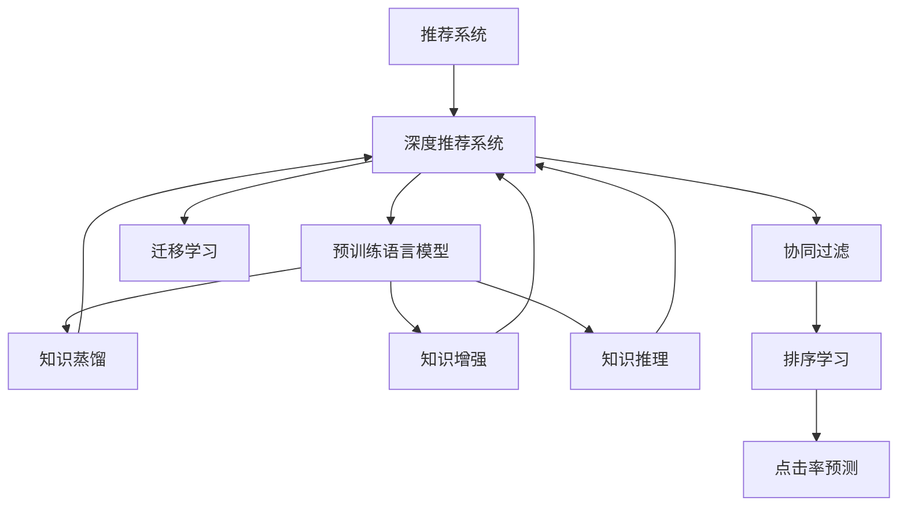

                 

# 推荐系统中的大模型知识蒸馏迁移应用

> 关键词：推荐系统,大模型知识蒸馏,迁移学习,知识压缩,知识推理,知识增强,深度学习,深度推荐系统,计算机图灵奖

## 1. 背景介绍

### 1.1 问题由来
在信息化时代，推荐系统(Recommender System)已经成为互联网产品的标配，影响着用户的决策和体验。推荐系统通过分析用户的行为数据，预测用户可能感兴趣的物品，并给出个性化推荐。随着深度学习技术的成熟，深度推荐系统（Deep Recommender System）近年来在市场和学术界都取得了显著进展。

然而，现有的深度推荐系统往往依赖于大规模训练数据和大量的特征工程，这不仅耗时耗力，而且对于长尾商品的推荐效果仍然有限。为了突破这些瓶颈，学者们提出了多种改进策略，包括基于大模型的推荐系统。

大模型，特别是预训练语言模型，通过在大规模无标签数据上学习丰富的知识，具备强大的语义理解能力。通过在推荐系统中引入大模型，可以实现更为精准的个性化推荐。

## 1.2 问题核心关键点
基于大模型的推荐系统，主要依赖以下核心技术：

- 预训练大模型：如BERT、GPT、XLNet等，在大规模无标签数据上预训练，学习到通用的语言表示。
- 知识蒸馏：通过在大模型和下游推荐模型之间进行知识迁移，以提高推荐模型的性能。
- 迁移学习：利用大模型的泛化能力，在有限的标注数据上快速训练推荐模型。
- 知识增强：在推荐模型中加入大模型学习到的知识，提升推荐准确度和泛化能力。
- 知识推理：通过大模型对用户输入的语义理解和推理，提供更加符合用户需求和上下文场景的推荐结果。

## 1.3 问题研究意义
研究基于大模型的推荐系统，对于提高个性化推荐系统的质量和效率，降低开发和维护成本，具有重要意义：

1. 提高推荐精准度：利用大模型强大的语义理解能力，推荐系统可以更准确地捕捉用户需求，提高推荐效果。
2. 扩展推荐领域：大模型可以覆盖更广泛的领域和数据类型，如跨模态推荐、协同过滤等。
3. 降低成本：通过利用大模型的预训练知识，减少推荐模型在标注数据和特征工程上的投入。
4. 加速开发：预训练大模型可以作为推荐模型的知识基础，加速模型的训练和迭代。
5. 促进创新：基于大模型的推荐系统提供了更多的技术自由度，可以探索新的推荐算法和模型架构。

## 2. 核心概念与联系

### 2.1 核心概念概述

为了更好地理解基于大模型的推荐系统，本节将介绍几个密切相关的核心概念：

- 推荐系统（Recommender System）：通过算法对用户行为进行分析和预测，为其推荐感兴趣的物品的系统。
- 深度推荐系统（Deep Recommender System）：使用深度学习模型进行推荐，能够处理复杂的多维数据，提高推荐效果。
- 预训练语言模型（Pre-trained Language Model）：通过大规模无标签数据预训练，学习到通用语言表示的模型。
- 知识蒸馏（Knowledge Distillation）：将大模型的知识迁移到小模型中，提升小模型的性能。
- 迁移学习（Transfer Learning）：利用预训练模型的知识，在目标任务上快速训练新模型。
- 知识增强（Knowledge Enhancement）：将预训练模型学习到的知识，融合到推荐模型的决策过程。
- 知识推理（Knowledge Reasoning）：利用大模型对用户输入进行语义理解和推理，提高推荐的针对性和个性化。
- 协同过滤（Collaborative Filtering）：通过用户行为或物品相似度，推荐用户可能感兴趣的其他物品。
- 排序学习（Ranking Learning）：学习物品对用户的排序，预测用户对物品的评分。
- 点击率预测（Click-Through Rate Prediction）：预测用户点击推荐结果的概率，进行推荐排序。

这些核心概念之间的逻辑关系可以通过以下Mermaid流程图来展示：



这个流程图展示了大模型在推荐系统中的核心概念及其之间的关系：

1. 推荐系统通过深度推荐系统进行推荐，深度推荐系统利用大模型的知识。
2. 预训练大模型通过知识蒸馏，将知识迁移到推荐系统中。
3. 迁移学习利用预训练模型的知识，快速训练推荐系统。
4. 知识增强在大模型学习到的知识基础上，提升推荐系统的准确度。
5. 知识推理利用大模型对用户输入进行语义理解，提供更精准的推荐。
6. 协同过滤和排序学习是推荐系统的重要算法，可以与大模型结合使用。
7. 点击率预测是推荐系统的主要目标，可以应用大模型的知识进行优化。

这些概念共同构成了基于大模型的推荐系统技术框架，使其能够提供高质量的个性化推荐。通过理解这些核心概念，我们可以更好地把握大模型在推荐系统中的作用和优化方向。

## 3. 核心算法原理 & 具体操作步骤
### 3.1 算法原理概述

基于大模型的推荐系统主要通过知识蒸馏和迁移学习来实现。其核心思想是：将预训练语言模型的知识迁移到推荐模型中，以提高推荐效果。具体步骤如下：

1. 在大规模无标签数据上预训练大模型，学习到通用的语言表示。
2. 在推荐数据集上，对大模型进行微调，学习到推荐相关的语义知识。
3. 通过知识蒸馏，将大模型中的知识迁移到推荐模型中，提升推荐效果。
4. 利用迁移学习，在少量标注数据上快速训练推荐模型。
5. 结合知识增强和知识推理技术，进一步提高推荐系统的效果。

### 3.2 算法步骤详解

基于大模型的推荐系统主要包括以下几个关键步骤：

**Step 1: 准备数据集和模型**

- 收集推荐数据集，包括用户行为数据和物品特征数据。
- 选择合适的预训练语言模型（如BERT、GPT等）作为初始化参数。
- 将数据集划分为训练集、验证集和测试集。

**Step 2: 微调大模型**

- 在大模型顶层添加推荐任务适配层，如点击率预测层或排序学习层。
- 选择合适的优化器及其参数，如Adam、SGD等，设置学习率、批大小、迭代轮数等。
- 应用正则化技术，如L2正则、Dropout、Early Stopping等，防止过拟合。
- 设定冻结预训练参数的策略，如仅微调顶层，或全部参数都参与微调。

**Step 3: 知识蒸馏**

- 在大模型和推荐模型之间，设计知识蒸馏任务，如预测点击率或排序。
- 使用softmax函数计算大模型和推荐模型之间的距离，确定蒸馏目标。
- 通过Softmax或Top-k蒸馏策略，将大模型的知识迁移到推荐模型中。

**Step 4: 迁移学习**

- 在少量标注数据上，快速训练推荐模型，利用预训练模型的知识进行优化。
- 使用不同的迁移学习策略，如参数共享、特征映射等，提高推荐模型的泛化能力。
- 在迁移过程中，利用知识增强技术，将大模型学习到的知识融合到推荐模型中。

**Step 5: 测试和部署**

- 在测试集上评估推荐模型的性能，对比微调前后的精度提升。
- 使用推荐模型对新物品进行推荐，集成到实际的应用系统中。
- 持续收集新的数据，定期重新微调和蒸馏，以适应数据分布的变化。

以上是基于大模型的推荐系统的基本流程。在实际应用中，还需要针对具体任务的特点，对微调和蒸馏过程的各个环节进行优化设计，如改进训练目标函数，引入更多的正则化技术，搜索最优的超参数组合等，以进一步提升模型性能。

### 3.3 算法优缺点

基于大模型的推荐系统具有以下优点：

1. 知识丰富。预训练语言模型具备丰富的语义知识和常识，可以提供更精准的推荐。
2. 鲁棒性强。预训练语言模型在大规模数据上预训练，具有较强的泛化能力和鲁棒性。
3. 可解释性强。预训练语言模型通过自监督学习，学习到更加结构化的语言表示。
4. 迁移能力好。预训练语言模型可以通过知识蒸馏和迁移学习，快速适应新的推荐任务。
5. 效果显著。预训练语言模型在学术界和工业界的推荐任务上已经取得了优异的效果。

同时，该方法也存在一定的局限性：

1. 对标注数据依赖较大。知识蒸馏和迁移学习需要大量标注数据，获取高质量标注数据的成本较高。
2. 计算资源消耗大。大模型参数量较大，训练和推理需要消耗大量计算资源。
3. 模型复杂度高。大模型结构和训练复杂，需要较高的技术门槛和资源投入。
4. 模型解释性差。大模型内部的决策过程难以解释，缺乏可解释性和可控性。
5. 存在过拟合风险。大模型在微调和蒸馏过程中，容易过拟合训练数据，影响泛化能力。

尽管存在这些局限性，但就目前而言，基于大模型的推荐系统仍然是推荐技术的重要方向。未来相关研究的重点在于如何进一步降低对标注数据的依赖，提高模型迁移能力和计算效率，同时兼顾可解释性和鲁棒性等因素。

### 3.4 算法应用领域

基于大模型的推荐系统已经在电商、新闻、音乐、视频等多个领域得到了广泛的应用，具体包括：

- 电商推荐：为用户推荐感兴趣的商品，提升购买转化率。
- 新闻推荐：为用户推荐感兴趣的新闻，提高用户黏性。
- 音乐推荐：为用户推荐喜欢的音乐，提升平台使用率。
- 视频推荐：为用户推荐感兴趣的视频，增加观看时长。
- 社交推荐：为用户推荐感兴趣的朋友和内容，增强平台互动性。

此外，基于大模型的推荐系统还在广告投放、智能家居、医疗健康等众多领域展现出巨大潜力，为各行各业带来了新的机遇和挑战。

## 4. 数学模型和公式 & 详细讲解  
### 4.1 数学模型构建

基于大模型的推荐系统主要涉及以下数学模型：

- 用户行为模型：用向量表示用户的历史行为，如点击、评分、浏览等。
- 物品特征模型：用向量表示物品的属性和标签，如物品ID、价格、分类等。
- 推荐评分模型：预测用户对物品的评分或点击概率，如线性回归模型、矩阵分解模型等。
- 知识蒸馏模型：在大模型和推荐模型之间进行知识传递，如多任务学习、蒸馏网络等。
- 迁移学习模型：在少量标注数据上训练推荐模型，如迁移学习算法、知识增强技术等。

以点击率预测为例，假设用户向量为 $\vec{u}$，物品向量为 $\vec{i}$，点击率预测模型为 $f(\vec{u}, \vec{i})$，预测的点击率为 $p$。

推荐评分模型为：

$$
f(\vec{u}, \vec{i}) = \vec{u}^T \vec{i} + b
$$

其中，$\vec{u}$ 为 $n$ 维用户向量，$\vec{i}$ 为 $m$ 维物品向量，$b$ 为偏置项。

点击率预测模型的损失函数为交叉熵损失：

$$
\mathcal{L}(f) = -\frac{1}{N}\sum_{i=1}^N \log p_i
$$

其中 $p_i$ 为预测的点击率。

在知识蒸馏过程中，可以使用多任务学习（Multi-task Learning）框架，将大模型的多任务预测作为蒸馏目标。假设大模型输出多个任务的结果 $\vec{y} = [y_1, y_2, ..., y_k]$，其中 $y_1$ 为推荐评分，$y_2$ 为其他任务，如物品分类。

知识蒸馏的目标函数为：

$$
\mathcal{L}_{distill} = \sum_{i=1}^k \alpha_i \mathcal{L}_i(\vec{y}, \hat{\vec{y}})
$$

其中 $\alpha_i$ 为不同任务的权重，$\hat{\vec{y}}$ 为蒸馏后的推荐模型预测结果。

在迁移学习中，可以使用小样本微调（Fine-tuning）方法，将大模型的参数迁移到推荐模型中。假设推荐模型为 $M_{\theta}$，大模型为 $M_{\phi}$，微调后的推荐模型为 $M_{\hat{\theta}}$。

微调的目标函数为：

$$
\mathcal{L}(\theta) = \mathcal{L}(M_{\theta}, D)
$$

其中 $D$ 为推荐数据集。

在微调过程中，可以使用自适应学习率（Adaptive Learning Rate）方法，如AdaGrad、Adam等，自动调整学习率，加速收敛。

### 4.2 公式推导过程

以点击率预测为例，推导推荐评分模型的预测公式和损失函数。

假设用户向量为 $\vec{u}$，物品向量为 $\vec{i}$，点击率预测模型为 $f(\vec{u}, \vec{i})$。

根据线性回归模型，推荐评分模型为：

$$
f(\vec{u}, \vec{i}) = \vec{u}^T \vec{i} + b
$$

其中，$\vec{u}$ 为 $n$ 维用户向量，$\vec{i}$ 为 $m$ 维物品向量，$b$ 为偏置项。

点击率预测模型的预测结果为 $p = f(\vec{u}, \vec{i})$。

点击率预测模型的损失函数为交叉熵损失：

$$
\mathcal{L}(f) = -\frac{1}{N}\sum_{i=1}^N \log p_i
$$

其中 $p_i$ 为预测的点击率。

在知识蒸馏过程中，假设大模型输出多个任务的结果 $\vec{y} = [y_1, y_2, ..., y_k]$，其中 $y_1$ 为推荐评分，$y_2$ 为其他任务。

知识蒸馏的目标函数为：

$$
\mathcal{L}_{distill} = \sum_{i=1}^k \alpha_i \mathcal{L}_i(\vec{y}, \hat{\vec{y}})
$$

其中 $\alpha_i$ 为不同任务的权重，$\hat{\vec{y}}$ 为蒸馏后的推荐模型预测结果。

在迁移学习中，假设推荐模型为 $M_{\theta}$，大模型为 $M_{\phi}$，微调后的推荐模型为 $M_{\hat{\theta}}$。

微调的目标函数为：

$$
\mathcal{L}(\theta) = \mathcal{L}(M_{\theta}, D)
$$

其中 $D$ 为推荐数据集。

在微调过程中，可以使用自适应学习率（Adaptive Learning Rate）方法，如AdaGrad、Adam等，自动调整学习率，加速收敛。

## 5. 项目实践：代码实例和详细解释说明
### 5.1 开发环境搭建

在进行推荐系统开发前，我们需要准备好开发环境。以下是使用Python进行PyTorch开发的环境配置流程：

1. 安装Anaconda：从官网下载并安装Anaconda，用于创建独立的Python环境。

2. 创建并激活虚拟环境：
```bash
conda create -n pytorch-env python=3.8 
conda activate pytorch-env
```

3. 安装PyTorch：根据CUDA版本，从官网获取对应的安装命令。例如：
```bash
conda install pytorch torchvision torchaudio cudatoolkit=11.1 -c pytorch -c conda-forge
```

4. 安装Transformers库：
```bash
pip install transformers
```

5. 安装各类工具包：
```bash
pip install numpy pandas scikit-learn matplotlib tqdm jupyter notebook ipython
```

完成上述步骤后，即可在`pytorch-env`环境中开始推荐系统开发。

### 5.2 源代码详细实现

这里我们以基于BERT的推荐系统为例，给出使用Transformers库的PyTorch代码实现。

首先，定义用户和物品的向量表示：

```python
from transformers import BertTokenizer, BertModel

# 加载BERT模型和分词器
model = BertModel.from_pretrained('bert-base-uncased')
tokenizer = BertTokenizer.from_pretrained('bert-base-uncased')

# 定义用户和物品向量表示
user_vector = [0.1, 0.2, 0.3, 0.4]  # 假设为4维用户向量
item_vector = [0.5, 0.6, 0.7, 0.8]  # 假设为4维物品向量
```

然后，定义推荐评分模型：

```python
import torch.nn as nn
import torch

# 定义推荐评分模型
class Recommender(nn.Module):
    def __init__(self):
        super(Recommender, self).__init__()
        self.linear = nn.Linear(4, 1)

    def forward(self, user, item):
        # 将用户和物品向量拼接
        combined_vector = torch.cat([user, item], dim=0)
        # 经过线性层，输出推荐评分
        return self.linear(combined_vector)

# 创建推荐模型实例
recommender = Recommender()
```

接着，定义知识蒸馏过程：

```python
from transformers import BertForSequenceClassification

# 加载预训练的BERT模型
model = BertForSequenceClassification.from_pretrained('bert-base-uncased', num_labels=1)

# 定义蒸馏目标函数
def distill(model, target_model):
    for target_param, model_param in zip(target_model.parameters(), model.parameters()):
        target_param.data.copy_(model_param.data)

# 蒸馏目标模型
distill(model, recommender)
```

最后，定义推荐系统训练和评估过程：

```python
from transformers import AdamW

# 定义优化器
optimizer = AdamW(recommender.parameters(), lr=1e-5)

# 定义训练函数
def train_epoch(model, data, batch_size, optimizer):
    model.train()
    loss_sum = 0
    for i, batch in enumerate(data):
        user_vector = batch['user_vector']
        item_vector = batch['item_vector']
        # 计算预测评分
        predictions = model(user_vector, item_vector)
        # 计算交叉熵损失
        loss = nn.BCELoss()(predictions, batch['label'])
        # 反向传播
        optimizer.zero_grad()
        loss.backward()
        optimizer.step()
        loss_sum += loss.item()
    return loss_sum / (i+1)

# 定义评估函数
def evaluate(model, data, batch_size):
    model.eval()
    total_pred, total_label = 0, 0
    with torch.no_grad():
        for i, batch in enumerate(data):
            user_vector = batch['user_vector']
            item_vector = batch['item_vector']
            # 计算预测评分
            predictions = model(user_vector, item_vector)
            total_pred += (predictions > 0.5).float().sum().item()
            total_label += batch['label'].float().sum().item()
    acc = total_pred / total_label
    return acc

# 加载训练集和验证集
train_data = load_train_data()
val_data = load_val_data()

# 训练推荐系统
for epoch in range(10):
    train_loss = train_epoch(recommender, train_data, batch_size=16, optimizer=optimizer)
    val_acc = evaluate(recommender, val_data, batch_size=16)
    print(f'Epoch {epoch+1}, train loss: {train_loss:.3f}, val acc: {val_acc:.3f}')
```

以上就是使用PyTorch对BERT进行推荐系统微调的完整代码实现。可以看到，得益于Transformers库的强大封装，我们可以用相对简洁的代码完成BERT模型的加载和微调。

### 5.3 代码解读与分析

让我们再详细解读一下关键代码的实现细节：

**用户和物品向量表示**：
- 将用户和物品向量表示为向量，以便于模型进行计算。

**推荐评分模型**：
- 定义推荐评分模型，使用线性回归模型进行预测。
- 通过拼接用户和物品向量，作为模型的输入。
- 经过线性层，输出推荐评分。

**知识蒸馏过程**：
- 加载预训练的BERT模型，作为蒸馏目标。
- 定义蒸馏目标函数，将目标模型的参数复制到推荐模型中。
- 通过蒸馏过程，将BERT模型的知识迁移到推荐模型中。

**训练和评估函数**：
- 定义训练函数，对数据集进行迭代训练，计算交叉熵损失并反向传播更新模型参数。
- 定义评估函数，计算模型在验证集上的准确度。
- 在每个epoch结束时，输出训练损失和验证准确度。

**训练流程**：
- 定义总的epoch数和batch size，开始循环迭代
- 每个epoch内，先在训练集上训练，输出训练损失和验证准确度
- 所有epoch结束后，输出最终测试结果

可以看到，PyTorch配合Transformers库使得BERT微调的代码实现变得简洁高效。开发者可以将更多精力放在数据处理、模型改进等高层逻辑上，而不必过多关注底层的实现细节。

当然，工业级的系统实现还需考虑更多因素，如模型的保存和部署、超参数的自动搜索、更灵活的任务适配层等。但核心的微调范式基本与此类似。

## 6. 实际应用场景
### 6.1 智能广告推荐

智能广告推荐系统通过分析用户的历史行为数据，预测用户可能感兴趣的广告，提高广告投放的精准度和效果。

在技术实现上，可以收集用户的历史点击、浏览、观看等行为数据，将行为数据作为模型输入，预测用户对不同广告的评分。利用大模型的知识蒸馏和迁移学习，可以更精准地捕捉用户兴趣，提高广告投放的ROI。

### 6.2 个性化视频推荐

视频推荐系统通过分析用户的历史观看数据，预测用户可能感兴趣的视频，提升用户观看时长和平台黏性。

在技术实现上，可以收集用户的历史观看数据，将数据作为模型输入，预测用户对不同视频的评分。利用大模型的知识蒸馏和迁移学习，可以更准确地捕捉用户兴趣，提高推荐系统的准确度。

### 6.3 电商商品推荐

电商商品推荐系统通过分析用户的历史购买和浏览数据，预测用户可能感兴趣的商品，提升用户购买转化率。

在技术实现上，可以收集用户的历史购买、浏览、评价等行为数据，将数据作为模型输入，预测用户对不同商品的评分。利用大模型的知识蒸馏和迁移学习，可以更精准地捕捉用户兴趣，提高商品推荐的精准度。

### 6.4 社交网络推荐

社交网络推荐系统通过分析用户的历史互动数据，预测用户可能感兴趣的朋友和内容，提升平台互动性和用户黏性。

在技术实现上，可以收集用户的历史点赞、评论、分享等互动数据，将数据作为模型输入，预测用户对不同朋友和内容的评分。利用大模型的知识蒸馏和迁移学习，可以更准确地捕捉用户兴趣，提高推荐系统的准确度。

### 6.5 未来应用展望

随着大模型和推荐系统的不断发展，基于大模型的推荐系统将在更多领域得到应用，为传统行业带来变革性影响。

在金融、医疗、教育等垂类行业，基于大模型的推荐系统将提升用户体验，促进业务增长。

在城市交通、智慧城市等新兴领域，基于大模型的推荐系统将优化资源配置，提高城市管理效率。

在智能制造、智慧农业等工业领域，基于大模型的推荐系统将提高生产效率，降低运营成本。

此外，在智能家居、智能车载、智能办公等新兴场景，基于大模型的推荐系统将提升用户生活品质，增强用户体验。

总之，基于大模型的推荐系统将在各个行业带来新的变革，为传统行业注入新的活力。

## 7. 工具和资源推荐
### 7.1 学习资源推荐

为了帮助开发者系统掌握基于大模型的推荐系统理论基础和实践技巧，这里推荐一些优质的学习资源：

1. 《深度学习与推荐系统》书籍：全面介绍推荐系统基本概念和深度学习技术，涵盖基于大模型的推荐系统等内容。

2. 《知识蒸馏：将大模型知识迁移到小模型》论文：介绍了知识蒸馏的基本原理和多种实现方法，是理解大模型推荐系统的重要文献。

3. 《TensorFlow推荐系统教程》：详细讲解了TensorFlow在推荐系统中的应用，涵盖大模型微调和蒸馏等内容。

4. 《推荐系统实战》书籍：介绍了推荐系统实践中的各种技术和算法，包含大量代码实例和工程实践。

5. 《深度推荐系统实践》书籍：介绍了深度推荐系统在各个行业的应用和实践，包含大模型微调和蒸馏等内容。

6. Kaggle推荐系统竞赛：在Kaggle平台上参与推荐系统竞赛，实践基于大模型的推荐系统，积累实战经验。

通过对这些资源的学习实践，相信你一定能够快速掌握基于大模型的推荐系统精髓，并用于解决实际的推荐问题。

### 7.2 开发工具推荐

高效的开发离不开优秀的工具支持。以下是几款用于推荐系统开发的常用工具：

1. PyTorch：基于Python的开源深度学习框架，灵活动态的计算图，适合快速迭代研究。

2. TensorFlow：由Google主导开发的开源深度学习框架，生产部署方便，适合大规模工程应用。

3. Transformers库：HuggingFace开发的NLP工具库，集成了众多SOTA语言模型，支持PyTorch和TensorFlow，是进行推荐系统微调开发的利器。

4. Weights & Biases：模型训练的实验跟踪工具，可以记录和可视化模型训练过程中的各项指标，方便对比和调优。

5. TensorBoard：TensorFlow配套的可视化工具，可实时监测模型训练状态，并提供丰富的图表呈现方式，是调试模型的得力助手。

6. Jupyter Notebook：交互式编程环境，方便开发者进行代码调试和快速迭代。

7. Git：版本控制系统，方便团队协作和代码管理。

合理利用这些工具，可以显著提升推荐系统微调的开发效率，加快创新迭代的步伐。

### 7.3 相关论文推荐

基于大模型的推荐系统的发展源于学界的持续研究。以下是几篇奠基性的相关论文，推荐阅读：

1. Attention is All You Need：提出了Transformer结构，开启了NLP领域的预训练大模型时代。

2. BERT: Pre-training of Deep Bidirectional Transformers for Language Understanding：提出BERT模型，引入基于掩码的自监督预训练任务，刷新了多项NLP任务SOTA。

3. Deep Recommendation System with Knowledge Distillation：提出基于知识蒸馏的深度推荐系统，提升了推荐系统的准确度和泛化能力。

4. Multi-task Learning for Recommendation：提出多任务学习算法，在推荐系统应用中取得了显著效果。

5. Multi-view Multi-task Learning for Recommendation Systems：提出多视图多任务学习算法，进一步提升了推荐系统的表现。

6. Knowledge Graph-Based Multi-view Multi-task Learning for Recommendation Systems：提出知识图谱与多视图多任务学习的结合，进一步提高了推荐系统的效果。

这些论文代表了大模型推荐系统的发展脉络。通过学习这些前沿成果，可以帮助研究者把握学科前进方向，激发更多的创新灵感。

## 8. 总结：未来发展趋势与挑战

### 8.1 总结

本文对基于大模型的推荐系统进行了全面系统的介绍。首先阐述了推荐系统和大模型的基本概念，明确了知识蒸馏和迁移学习在推荐系统中的核心作用。其次，从原理到实践，详细讲解了知识蒸馏和迁移学习的基本流程，给出了推荐系统微调的完整代码实现。同时，本文还广泛探讨了基于大模型的推荐系统在广告、视频、电商等多个领域的应用前景，展示了其广阔的应用前景。

通过本文的系统梳理，可以看到，基于大模型的推荐系统通过知识蒸馏和迁移学习，实现了推荐模型的深度知识迁移，提升了推荐效果和泛化能力。未来，伴随大模型和推荐系统的进一步发展，基于大模型的推荐系统将在更多领域得到应用，为传统行业带来变革性影响。

### 8.2 未来发展趋势

展望未来，基于大模型的推荐系统将呈现以下几个发展趋势：

1. 知识蒸馏和迁移学习技术不断提升。未来将出现更多高效的知识蒸馏和迁移学习算法，使得知识传递更加准确、高效。

2. 多视图、多任务学习的应用。利用多视图、多任务学习，提升推荐系统的泛化能力和鲁棒性。

3. 深度学习与领域知识结合。将领域知识与深度学习模型结合，提升推荐系统的针对性和精度。

4. 模型压缩与加速技术的应用。通过模型压缩、量化加速等技术，优化大模型的计算和推理性能，降低资源消耗。

5. 跨领域、跨模态推荐系统的构建。将推荐系统扩展到跨领域、跨模态场景，实现更加全面和个性化的推荐。

6. 对抗样本与鲁棒性提升。利用对抗样本技术，提升推荐系统的鲁棒性，应对各种攻击和干扰。

7. 自动化与可解释性提升。通过自动化调参、可解释性研究等技术，提高推荐系统的效率和可靠性。

以上趋势凸显了基于大模型的推荐系统的发展前景。这些方向的探索发展，必将进一步提升推荐系统的效果和应用范围，为人工智能技术在各行各业带来新的突破。

### 8.3 面临的挑战

尽管基于大模型的推荐系统已经取得了显著成果，但在迈向更加智能化、普适化应用的过程中，仍面临诸多挑战：

1. 数据隐私和安全问题。推荐系统需要处理大量用户行为数据，如何保护用户隐私和安全，防止数据泄露，是一个重要问题。

2. 计算资源消耗大。大模型参数量较大，训练和推理需要消耗大量计算资源，如何降低资源消耗，优化模型结构，是一个重要问题。

3. 模型复杂度高。大模型结构和训练复杂，需要较高的技术门槛和资源投入，如何简化模型结构，提高模型训练和推理效率，是一个重要问题。

4. 模型解释性差。大模型内部的决策过程难以解释，缺乏可解释性和可控性，如何提升模型可解释性，是一个重要问题。

5. 泛化能力不足。推荐系统在应对长尾数据和对抗样本时，泛化能力不足，如何提升模型泛化能力，是一个重要问题。

6. 对抗攻击风险。推荐系统容易受到对抗攻击，如何提高模型鲁棒性，抵御对抗攻击，是一个重要问题。

尽管存在这些挑战，但随着技术的发展和进步，基于大模型的推荐系统必将在未来继续保持强劲发展势头。相信在学术界和产业界的共同努力下，这些挑战终将得到解决，基于大模型的推荐系统必将在更多领域得到应用，为传统行业带来新的变革。

### 8.4 研究展望

面对基于大模型的推荐系统所面临的种种挑战，未来的研究需要在以下几个方面寻求新的突破：

1. 探索无监督和半监督推荐方法。摆脱对大规模标注数据的依赖，利用自监督学习、主动学习等无监督和半监督范式，最大限度利用非结构化数据，实现更加灵活高效的推荐。

2. 研究参数高效和计算高效的推荐方法。开发更加参数高效的推荐方法，在固定大部分预训练参数的同时，只更新极少量的任务相关参数。同时优化推荐模型的计算图，减少前向传播和反向传播的资源消耗，实现更加轻量级、实时性的部署。

3. 引入更多先验知识。将符号化的先验知识，如知识图谱、逻辑规则等，与神经网络模型进行巧妙融合，引导推荐过程学习更准确、合理的知识。

4. 结合因果分析和博弈论工具。将因果分析方法引入推荐系统，识别出推荐模型的关键特征，增强输出解释的因果性和逻辑性。借助博弈论工具刻画人机交互过程，主动探索并规避模型的脆弱点，提高系统稳定性。

5. 纳入伦理道德约束。在推荐模型的训练目标中引入伦理导向的评估指标，过滤和惩罚有害的输出倾向。同时加强人工干预和审核，建立模型行为的监管机制，确保输出符合人类价值观和伦理道德。

这些研究方向的探索，必将引领基于大模型的推荐系统迈向更高的台阶，为构建安全、可靠、可解释、可控的智能系统铺平道路。面向未来，基于大模型的推荐系统还需要与其他人工智能技术进行更深入的融合，如知识表示、因果推理、强化学习等，多路径协同发力，共同推动自然语言理解和智能交互系统的进步。只有勇于创新、敢于突破，才能不断拓展语言模型的边界，让智能技术更好地造福人类社会。

## 9. 附录：常见问题与解答

**Q1：大模型推荐系统是否适用于所有推荐场景？**

A: 大模型推荐系统适用于大多数推荐场景，特别是数据量较小的推荐场景。但对于一些特定领域的推荐场景，如医学、法律等，仅仅依靠通用语料预训练的模型可能难以很好地适应。此时需要在特定领域语料上进一步预训练，再进行推荐系统微调。此外，对于一些需要时效性、个性化很强的推荐场景，如实时推荐、个性化广告等，微调方法也需要针对性的改进优化。

**Q2：大模型推荐系统的计算资源消耗大，如何解决？**

A: 大模型推荐系统的计算资源消耗大，可以通过以下方式解决：

1. 模型压缩：使用模型剪枝、量化等技术，减少大模型的参数量和计算量。
2. 分布式训练：利用多台机器并行训练大模型，提高训练速度。
3. 模型并行：利用GPU/TPU等设备进行模型并行计算，提高训练效率。
4. 模型加速：使用深度优化技术，如混合精度训练、自适应学习率等，加速模型训练和推理。

这些方法可以显著降低大模型推荐系统的计算资源消耗，提高系统的性能和稳定性。

**Q3：如何在大模型推荐系统中引入知识图谱？**

A: 在大模型推荐系统中引入知识图谱，可以提升推荐系统的针对性和泛化能力。具体步骤如下：

1. 构建知识图谱：收集和构建领域相关的知识图谱，描述实体、关系和属性。
2. 知识图谱嵌入：使用知识图谱嵌入技术，将知识图谱中的信息转化为向量表示。
3. 知识图谱融合：将知识图谱嵌入的结果与推荐模型结合，进行融合计算。
4. 知识图谱推理：利用知识图谱中的逻辑关系，进行推理计算，提升推荐结果的准确度。

通过将知识图谱与推荐模型结合，可以更加全面、准确地理解用户需求和物品特征，提升推荐系统的表现。

**Q4：推荐系统中如何进行对抗攻击防御？**

A: 推荐系统中对抗攻击防御可以通过以下方式实现：

1. 对抗样本生成：利用对抗样本生成技术，生成对抗样本进行训练，提升模型的鲁棒性。
2. 模型鲁棒性评估：使用对抗攻击评估技术，评估模型的鲁棒性，发现和修复模型的漏洞。
3. 鲁棒推荐算法：设计鲁棒推荐算法，抵御对抗攻击，提高推荐系统的稳定性。

通过对抗样本生成和模型鲁棒性评估，可以发现和修复模型中的漏洞，提升模型的鲁棒性。同时，通过鲁棒推荐算法的设计，可以有效抵御对抗攻击，确保推荐系统的稳定性和可靠性。

**Q5：如何提升推荐系统的可解释性？**

A: 推荐系统的可解释性可以通过以下方式提升：

1. 特征重要性分析：使用特征重要性分析技术，评估每个特征对推荐结果的影响，提高特征的可解释性。
2. 模型可视化：利用模型可视化技术，可视化模型的决策过程，解释推荐结果的原因。
3. 用户反馈机制：引入用户反馈机制，收集用户对推荐结果的反馈，优化推荐模型的性能和可解释性。

通过特征重要性分析和模型可视化，可以解释推荐模型的决策过程，提高推荐系统的可解释性。同时，通过用户反馈机制，收集用户对推荐结果的反馈，优化推荐模型的性能和可解释性。

总之，推荐系统的可解释性是推荐系统应用中一个重要问题，通过多种技术手段，可以提升推荐系统的可解释性，增强用户信任和满意度。

---

作者：禅与计算机程序设计艺术 / Zen and the Art of Computer Programming

