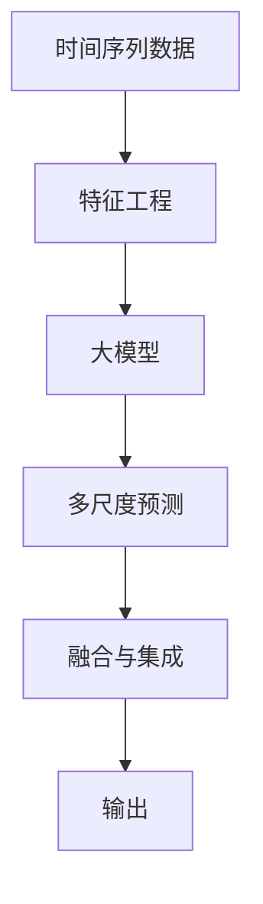

                 

# 推荐系统中的时间序列预测：大模型的多尺度分析

> 关键词：时间序列预测, 大模型, 多尺度分析, 推荐系统, LSTM, CNN, 深度学习, 自监督学习, 迁移学习

## 1. 背景介绍

### 1.1 问题由来

在推荐系统中，时间序列预测是一项重要的任务。随着用户行为数据的时间维度不断增长，如何从这些时间序列数据中挖掘出有用信息，预测未来的行为趋势，成为了推荐系统优化的关键。传统的时间序列预测方法主要依赖于线性回归、ARIMA等统计模型，这些方法虽然易于理解和实现，但在处理复杂的时间序列数据时，效果往往不尽如人意。近年来，随着深度学习技术的发展，利用深度神经网络进行时间序列预测，已经成为研究的热点。

在大模型出现之前，深度神经网络在时间序列预测上的应用主要是基于RNN（如LSTM、GRU）和卷积神经网络（CNN）等结构，但这些模型往往只能处理单尺度的时间序列数据，难以捕捉不同尺度的复杂模式。随着BERT、GPT等大语言模型的出现，研究人员开始探索如何利用大模型进行多尺度时间序列预测，以获得更好的预测效果。

### 1.2 问题核心关键点

大模型在时间序列预测中的应用，主要面临以下几个关键问题：

- **多尺度数据处理**：时间序列数据往往包含多个时间尺度（如日、周、月等），大模型如何高效地处理不同尺度的数据，成为挑战。
- **特征工程**：时间序列数据的特征提取和预处理，对于模型预测性能有重要影响。如何设计合理的特征表示，需要深入研究。
- **迁移学习**：在大模型中，如何在较少数据的情况下，通过迁移学习获得更好的预测性能。
- **多尺度融合**：将不同尺度的预测结果进行有效融合，提高时间序列预测的准确性。
- **性能提升与模型压缩**：在保证预测精度的前提下，如何优化模型结构，减小计算和存储负担。

本文将系统介绍基于大模型进行多尺度时间序列预测的方法，涵盖时间序列数据的预处理、特征提取、模型架构、训练策略等方面，希望能为推荐系统中的时间序列预测提供新的思路。

## 2. 核心概念与联系

### 2.1 核心概念概述

本节将介绍时间序列预测、大模型、多尺度分析等核心概念，并探讨它们之间的联系。

- **时间序列预测（Time Series Prediction）**：指对时间序列数据进行建模和预测，通常用于时间敏感的应用场景，如金融交易、交通流量预测等。时间序列数据包含了时间维度上的连续变化，可以通过机器学习模型进行预测。

- **大模型（Large Model）**：指参数量巨大、规模庞大的深度学习模型，如BERT、GPT等。这些模型在预训练阶段通常会在大规模数据集上进行学习，以获得广泛的知识和复杂的表示能力。

- **多尺度分析（Multiscale Analysis）**：指对时间序列数据进行多尺度分解，分别在不同尺度上进行分析和预测。多尺度分析能够捕捉时间序列数据中的不同层次的复杂模式，提高预测的准确性。

时间序列预测与大模型、多尺度分析之间存在紧密联系。利用大模型进行时间序列预测，需要设计有效的多尺度分析策略，以便捕捉不同尺度的时间序列模式。同时，大模型本身的多层次结构和大规模参数量，也有助于时间序列数据的复杂模式学习，提升预测性能。

### 2.2 核心概念原理和架构的 Mermaid 流程图



在这个流程图中，时间序列数据经过特征工程处理后，输入到大模型中进行多尺度分析。每个尺度的预测结果通过融合与集成，生成最终的预测输出。

## 3. 核心算法原理 & 具体操作步骤

### 3.1 算法原理概述

基于大模型的多尺度时间序列预测方法，主要包含以下几个步骤：

1. **特征工程**：对时间序列数据进行归一化、差分等预处理，提取有用的特征表示。
2. **多尺度分解**：将时间序列数据分解为多个尺度，分别进行预测。
3. **多尺度融合**：将不同尺度的预测结果进行融合，生成最终的预测输出。
4. **模型训练与优化**：在预测数据上训练模型，并采用适当的优化策略，如自监督学习、迁移学习等。

### 3.2 算法步骤详解

#### 3.2.1 数据预处理

对时间序列数据进行预处理，主要包括归一化、差分等操作。具体步骤如下：

1. **归一化**：将时间序列数据进行标准化，使其均值为0，标准差为1。可以使用公式：

   $$
   \text{Normalized}(t) = \frac{x(t) - \mu}{\sigma}
   $$

   其中，$\mu$ 为均值，$\sigma$ 为标准差。

2. **差分**：对时间序列数据进行一阶或高阶差分，以减小数据趋势对预测的影响。可以使用公式：

   $$
   \Delta x(t) = x(t) - x(t-1)
   $$

3. **特征提取**：使用傅里叶变换、小波变换等方法，提取时间序列数据的频率特征、周期性特征等。

#### 3.2.2 多尺度分解

将时间序列数据分解为多个尺度，分别进行预测。具体步骤如下：

1. **划分尺度**：根据时间序列数据的特性，将数据划分为不同尺度，如日、周、月等。

2. **分别预测**：对每个尺度的数据，使用适当的模型进行预测。例如，可以使用LSTM、CNN等深度神经网络。

   - **LSTM**：适合处理长序列的时间序列数据，能够捕捉时间序列中的长期依赖关系。
   - **CNN**：适合处理局部特征明显的时间序列数据，能够捕捉局部模式和周期性。

   训练模型时，可以使用单尺度数据进行训练，也可以使用多尺度数据的组合数据进行训练。

#### 3.2.3 多尺度融合

将不同尺度的预测结果进行融合，生成最终的预测输出。具体步骤如下：

1. **加权融合**：对不同尺度的预测结果进行加权平均，生成最终的预测结果。

   $$
   \hat{x}(t) = \sum_{i=1}^k \alpha_i x_i(t)
   $$

   其中，$x_i(t)$ 表示第 $i$ 尺度的预测结果，$\alpha_i$ 为权重系数。

2. **堆叠融合**：将不同尺度的预测结果进行堆叠，使用元学习模型对堆叠结果进行融合。

   $$
   \hat{x}(t) = M_{meta}(x_1(t), x_2(t), ..., x_k(t))
   $$

   其中，$M_{meta}$ 为元学习模型。

3. **注意力机制融合**：使用注意力机制对不同尺度的预测结果进行加权融合，提高融合效果。

   $$
   \hat{x}(t) = \sum_{i=1}^k \beta_i x_i(t)
   $$

   其中，$\beta_i$ 为注意力权重系数，可以使用softmax函数计算。

#### 3.2.4 模型训练与优化

在大模型中进行时间序列预测时，可以采用自监督学习和迁移学习等策略进行训练。具体步骤如下：

1. **自监督学习**：在大规模无标签数据上，使用自监督任务对大模型进行预训练，提取通用的时间序列特征表示。

2. **迁移学习**：在小规模标注数据上，使用预训练大模型进行微调，获得针对特定时间序列预测任务的优化参数。

3. **联合训练**：在大模型和小模型上进行联合训练，使用大模型的表示能力指导小模型的训练，提升模型性能。

### 3.3 算法优缺点

#### 3.3.1 优点

1. **多尺度特征表示**：大模型能够捕捉不同尺度的复杂模式，提供多尺度的特征表示，提升预测准确性。
2. **高效的预测能力**：多尺度分析能够处理复杂的时间序列数据，提高预测的精度和鲁棒性。
3. **可解释性强**：大模型的多层次结构，有助于理解预测结果的生成过程，提高模型的可解释性。

#### 3.3.2 缺点

1. **计算资源消耗大**：大模型通常参数量庞大，计算资源消耗较大，训练时间较长。
2. **模型复杂度高**：多尺度分析增加了模型复杂度，可能导致模型难以优化，训练和推理速度较慢。
3. **数据依赖性高**：模型训练和预测效果依赖于高质量的标注数据和预训练数据，数据获取成本较高。

### 3.4 算法应用领域

基于大模型的多尺度时间序列预测方法，广泛应用于推荐系统中的用户行为预测、商品需求预测、广告点击率预测等场景。

1. **用户行为预测**：通过对用户历史行为数据进行时间序列分析，预测用户未来的购买、浏览、搜索等行为。
2. **商品需求预测**：通过分析商品销售数据，预测未来一段时间内的销售量，指导库存管理。
3. **广告点击率预测**：根据用户的点击历史数据，预测用户对不同广告的点击率，优化广告投放策略。

此外，该方法还可以应用于金融交易预测、股市行情预测、能源需求预测等场景，为各个行业提供智能化的决策支持。

## 4. 数学模型和公式 & 详细讲解 & 举例说明

### 4.1 数学模型构建

#### 4.1.1 时间序列数据表示

设时间序列数据为 $x = \{x(t)\}_{t=1}^T$，其中 $x(t)$ 表示在时间 $t$ 的数据值。为了方便后续计算，将时间序列数据表示为一个 $T \times D$ 的矩阵 $\mathbf{X}$，其中 $D$ 表示特征维度。

#### 4.1.2 时间序列预测模型

假设时间序列数据为 $x = \{x(t)\}_{t=1}^T$，预测值为 $\hat{x} = \{\hat{x}(t)\}_{t=1}^{T+1}$。时间序列预测模型的目标是最小化预测误差，可以使用均方误差损失函数：

$$
\mathcal{L}(\theta) = \frac{1}{N}\sum_{t=1}^N (x(t) - \hat{x}(t))^2
$$

其中，$\theta$ 为模型的参数，$N$ 表示样本数。

### 4.2 公式推导过程

#### 4.2.1 单尺度时间序列预测

假设时间序列数据为 $x = \{x(t)\}_{t=1}^T$，预测值为 $\hat{x} = \{\hat{x}(t)\}_{t=1}^{T+1}$。单尺度时间序列预测模型可以使用LSTM、GRU等深度神经网络进行建模。例如，LSTM模型的预测公式为：

$$
\hat{x}(t) = f(\mathbf{X}(t-1), \mathbf{X}(t-2), ..., \mathbf{X}(t-K))
$$

其中，$f$ 为LSTM模型的前向传播函数，$\mathbf{X}(t-K)$ 表示时间窗口 $K$ 内的输入数据。

#### 4.2.2 多尺度时间序列预测

假设时间序列数据为 $x = \{x(t)\}_{t=1}^T$，预测值为 $\hat{x} = \{\hat{x}(t)\}_{t=1}^{T+1}$。多尺度时间序列预测模型可以使用多个深度神经网络进行建模。例如，LSTM和CNN的组合模型可以表示为：

$$
\hat{x}(t) = f_L(\mathbf{X}_L(t-1), \mathbf{X}_L(t-2), ..., \mathbf{X}_L(t-K)) + f_C(\mathbf{X}_C(t-1), \mathbf{X}_C(t-2), ..., \mathbf{X}_C(t-K))
$$

其中，$f_L$ 和 $f_C$ 分别为LSTM和CNN的前向传播函数，$\mathbf{X}_L(t-K)$ 和 $\mathbf{X}_C(t-K)$ 表示时间窗口 $K$ 内的输入数据。

### 4.3 案例分析与讲解

假设某电商平台需要预测用户未来的购买行为。数据集包含用户历史购买记录和浏览记录，其中每个记录表示为时间戳和行为标签。可以利用多尺度时间序列预测模型进行用户行为预测。具体步骤如下：

1. **数据预处理**：对用户行为数据进行归一化、差分等操作，提取有用的特征表示。

2. **多尺度分解**：将用户行为数据分解为日、周、月等不同尺度，分别使用LSTM和CNN进行预测。

3. **多尺度融合**：将不同尺度的预测结果进行融合，生成最终的预测输出。

4. **模型训练与优化**：在大模型中进行自监督学习和迁移学习，使用标注数据进行微调，优化模型参数。

5. **预测与应用**：在新的用户行为数据上，使用训练好的模型进行预测，生成用户未来的购买行为。

## 5. 项目实践：代码实例和详细解释说明

### 5.1 开发环境搭建

在进行时间序列预测实践前，我们需要准备好开发环境。以下是使用Python进行TensorFlow开发的环境配置流程：

1. 安装Anaconda：从官网下载并安装Anaconda，用于创建独立的Python环境。

2. 创建并激活虚拟环境：
```bash
conda create -n pytensorflow-env python=3.8 
conda activate pytensorflow-env
```

3. 安装TensorFlow：根据CUDA版本，从官网获取对应的安装命令。例如：
```bash
conda install tensorflow -c pytensorflow -c conda-forge
```

4. 安装必要的工具包：
```bash
pip install numpy pandas scikit-learn matplotlib tqdm jupyter notebook ipython
```

完成上述步骤后，即可在`pytensorflow-env`环境中开始时间序列预测实践。

### 5.2 源代码详细实现

这里我们以用户行为预测为例，给出使用TensorFlow进行LSTM-CNN多尺度时间序列预测的代码实现。

首先，定义时间序列数据处理函数：

```python
import tensorflow as tf
from tensorflow.keras.layers import LSTM, Dense, Conv1D, MaxPooling1D, Dropout, Concatenate

def preprocess_data(x, seq_length):
    x = x.reshape(-1, seq_length, x.shape[-1])
    x = x / tf.reduce_max(x, axis=-1, keepdims=True)
    return x
```

然后，定义多尺度时间序列预测模型：

```python
def build_model(seq_length, num_features):
    input_shape = (seq_length, num_features)

    # LSTM layer
    lstm_out = LSTM(64, return_sequences=True, input_shape=input_shape)(tf.keras.layers.Input(shape=input_shape))

    # Conv1D layer
    conv1d = Conv1D(32, 3, activation='relu')(lstm_out)
    pool1 = MaxPooling1D(2)(conv1d)
    conv1d = Conv1D(32, 3, activation='relu')(pool1)
    pool1 = MaxPooling1D(2)(conv1d)

    # Dropout layer
    dropout = Dropout(0.5)(pool1)

    # Concatenate layer
    output = Concatenate()([lstm_out[:, -1], dropout])

    # Dense layer
    output = Dense(1, activation='sigmoid')(output)

    model = tf.keras.Model(inputs=tf.keras.layers.Input(shape=input_shape), outputs=output)
    return model
```

接着，定义训练和评估函数：

```python
from sklearn.model_selection import train_test_split

def train_model(model, x_train, y_train, x_test, y_test, batch_size=64, epochs=10):
    model.compile(optimizer='adam', loss='binary_crossentropy', metrics=['accuracy'])
    model.fit(x_train, y_train, batch_size=batch_size, epochs=epochs, validation_data=(x_test, y_test))
    return model

def evaluate_model(model, x_test, y_test):
    loss, accuracy = model.evaluate(x_test, y_test)
    print(f'Test loss: {loss:.4f}')
    print(f'Test accuracy: {accuracy:.4f}')
```

最后，启动训练流程并在测试集上评估：

```python
from sklearn.preprocessing import MinMaxScaler

# 加载数据
x = ...
y = ...

# 数据预处理
scaler = MinMaxScaler(feature_range=(0, 1))
x_scaled = scaler.fit_transform(x)

# 划分数据集
train_x, test_x, train_y, test_y = train_test_split(x_scaled, y, test_size=0.2, random_state=42)

# 模型训练
seq_length = 10
num_features = x_scaled.shape[1]
model = build_model(seq_length, num_features)
train_model(model, train_x, train_y, test_x, test_y)

# 模型评估
evaluate_model(model, test_x, test_y)
```

以上就是使用TensorFlow对LSTM-CNN多尺度时间序列预测模型进行用户行为预测的完整代码实现。可以看到，TensorFlow的Keras API使得模型搭建和训练非常便捷，开发者可以将更多精力放在模型设计和特征工程上。

### 5.3 代码解读与分析

让我们再详细解读一下关键代码的实现细节：

**preprocess_data函数**：
- 将时间序列数据重塑为二维数组，并进行归一化处理，使其在0到1之间。

**build_model函数**：
- 定义LSTM-CNN多尺度预测模型，包括LSTM层、CNN层、Dropout层和输出层。LSTM层用于捕捉长期依赖关系，CNN层用于捕捉局部模式和周期性，Dropout层用于防止过拟合。

**train_model函数**：
- 在训练集上使用二分类交叉熵损失函数和Adam优化器，进行模型训练，并输出模型在验证集上的性能指标。

**evaluate_model函数**：
- 在测试集上评估模型性能，并输出损失和准确率。

**训练流程**：
- 加载数据集，进行数据预处理。
- 使用多尺度时间序列数据训练模型。
- 在测试集上评估模型性能，输出预测结果。

可以看到，TensorFlow的Keras API使得多尺度时间序列预测模型的实现非常简洁高效。开发者可以将更多精力放在模型设计和数据处理上，而不必过多关注底层实现细节。

当然，工业级的系统实现还需考虑更多因素，如模型的保存和部署、超参数的自动搜索、更灵活的模型架构等。但核心的多尺度时间序列预测范式基本与此类似。

## 6. 实际应用场景

### 6.1 智能推荐系统

智能推荐系统是推荐系统的重要应用场景之一。传统推荐系统依赖用户历史行为数据进行推荐，难以捕捉用户行为的时序变化。利用多尺度时间序列预测，可以在用户行为数据中挖掘出更丰富的信息，提高推荐效果。

具体而言，可以利用用户的历史行为数据，构建多尺度时间序列预测模型，预测用户未来的行为。例如，可以根据用户的历史浏览记录、购买记录等，预测用户未来的购买、浏览行为，推荐用户可能感兴趣的商品。

### 6.2 金融预测

金融预测是推荐系统在金融领域的重要应用。传统金融预测方法主要依赖于统计模型，如ARIMA、GARCH等。利用深度学习进行金融预测，可以提高预测精度和鲁棒性。

在金融预测中，可以利用多尺度时间序列预测，预测股票价格、货币汇率等金融指标。例如，可以根据历史股票价格数据，构建多尺度时间序列预测模型，预测未来一段时间内的股票价格趋势，指导投资决策。

### 6.3 智能制造

智能制造是制造业的重要趋势之一。在智能制造中，利用多尺度时间序列预测，可以预测设备运行状态、生产过程等，提高生产效率和质量。

例如，可以利用设备的历史运行数据，构建多尺度时间序列预测模型，预测设备未来的故障情况，提前进行维护，避免生产中断。

### 6.4 未来应用展望

随着深度学习技术的发展，基于大模型的多尺度时间序列预测方法将在更多领域得到应用，为各个行业提供智能化的决策支持。

在智慧医疗领域，可以利用患者的健康数据，构建多尺度时间序列预测模型，预测疾病发展趋势，提供个性化的治疗方案。

在智慧城市治理中，可以利用交通流量数据，构建多尺度时间序列预测模型，预测交通流量变化，优化交通管理。

此外，在物流、能源、环境保护等众多领域，基于多尺度时间序列预测的深度学习模型也将不断涌现，为各个行业提供智能化的决策支持。

## 7. 工具和资源推荐

### 7.1 学习资源推荐

为了帮助开发者系统掌握多尺度时间序列预测的理论基础和实践技巧，这里推荐一些优质的学习资源：

1. 《Deep Learning for Time Series Analysis》：这本书介绍了深度学习在时间序列预测中的应用，涵盖多种深度学习模型和算法。

2. 《Multiscale Time Series Analysis》：这本书介绍了时间序列数据的多种分解方法，包括傅里叶变换、小波变换等。

3. 《Hands-On Deep Learning with Python》：这本书提供了深度学习模型的实践指导，涵盖TensorFlow、Keras等工具的使用方法。

4. 《Practical Deep Learning for Coders》：这本书介绍了深度学习模型的实战技巧，涵盖模型构建、训练、调优等方面的内容。

5. 《Time Series Forecasting with Python》：这本书介绍了多种时间序列预测方法，包括传统统计模型和深度学习模型。

通过对这些资源的学习实践，相信你一定能够快速掌握多尺度时间序列预测的精髓，并用于解决实际的推荐系统问题。

### 7.2 开发工具推荐

高效的开发离不开优秀的工具支持。以下是几款用于多尺度时间序列预测开发的常用工具：

1. TensorFlow：基于Python的深度学习框架，支持分布式计算和GPU加速，适合大规模模型训练。

2. Keras：TensorFlow的高级API，提供简单易用的接口，适合快速原型开发和模型训练。

3. PyTorch：基于Python的深度学习框架，灵活性高，支持动态图计算。

4. Jupyter Notebook：交互式的编程环境，支持代码编写、数据可视化等功能，适合快速迭代和调试。

5. TensorBoard：TensorFlow的可视化工具，可以实时监测模型训练状态，并提供丰富的图表呈现方式。

6. Scikit-learn：Python的机器学习库，支持多种时间序列处理和特征工程方法。

合理利用这些工具，可以显著提升多尺度时间序列预测的开发效率，加快创新迭代的步伐。

### 7.3 相关论文推荐

多尺度时间序列预测是深度学习领域的热点研究方向。以下是几篇奠基性的相关论文，推荐阅读：

1. 《Multiscale Time Series Analysis》：这篇论文介绍了时间序列数据的多种分解方法，提供了多种多尺度时间序列预测模型。

2. 《Long Short-Term Memory》：这篇论文介绍了LSTM模型的原理和实现方法，是深度学习在时间序列预测中的经典之作。

3. 《Convolutional Neural Networks for Sparse Time Series Classification》：这篇论文介绍了CNN在时间序列分类中的应用，展示了多尺度时间序列预测的潜力。

4. 《Adaptive Multiscale Time Series Prediction》：这篇论文介绍了多尺度时间序列预测的多种方法，提供了详细的算法流程和实现细节。

5. 《Attention Is All You Need》：这篇论文介绍了Transformer模型，展示了其在时间序列预测中的应用效果。

这些论文代表了大模型在时间序列预测中的最新进展，通过学习这些前沿成果，可以帮助研究者把握学科前进方向，激发更多的创新灵感。

## 8. 总结：未来发展趋势与挑战

### 8.1 总结

本文对基于大模型的多尺度时间序列预测方法进行了全面系统的介绍。首先阐述了时间序列预测、大模型、多尺度分析等核心概念，并探讨了它们之间的联系。其次，从原理到实践，详细讲解了多尺度时间序列预测的数学模型和算法步骤，给出了完整的时间序列预测代码实现。同时，本文还广泛探讨了多尺度时间序列预测在推荐系统、金融预测、智能制造等场景中的应用，展示了其广阔的前景。此外，本文精选了多尺度时间序列预测的学习资源、开发工具和相关论文，力求为读者提供全方位的技术指引。

通过本文的系统梳理，可以看到，基于大模型的多尺度时间序列预测方法已经成为推荐系统中的重要工具，能够有效提升预测准确性和鲁棒性。大模型本身的多层次结构和大规模参数量，使得其在时间序列预测中具备更强的表达能力和泛化能力，值得在更多领域进行推广应用。未来，随着深度学习技术的发展，多尺度时间序列预测技术必将迎来更多的创新和发展。

### 8.2 未来发展趋势

展望未来，多尺度时间序列预测技术将呈现以下几个发展趋势：

1. **模型融合**：利用多种模型（如LSTM、CNN、RNN等）进行融合预测，提高预测精度和鲁棒性。
2. **特征增强**：引入外部特征（如气象数据、节假日等），增强时间序列预测的准确性。
3. **自适应学习**：利用自适应学习算法（如Adaptive Learning），动态调整模型参数，提高预测性能。
4. **多尺度融合**：将不同尺度的预测结果进行融合，生成最终的预测输出。
5. **在线预测**：实时预测时间序列数据，满足高实时性场景的需求。

这些趋势凸显了多尺度时间序列预测技术的广阔前景。这些方向的探索发展，必将进一步提升时间序列预测的精度和鲁棒性，为推荐系统、金融预测、智能制造等各个领域提供更好的预测服务。

### 8.3 面临的挑战

尽管多尺度时间序列预测技术已经取得了瞩目成就，但在迈向更加智能化、普适化应用的过程中，它仍面临着诸多挑战：

1. **数据依赖性高**：模型训练和预测效果依赖于高质量的标注数据和预训练数据，数据获取成本较高。如何降低数据依赖性，提升模型的泛化能力，是一大难题。
2. **计算资源消耗大**：大模型通常参数量庞大，计算资源消耗较大，训练时间较长。如何优化模型结构，减少计算和存储负担，是一个重要的研究方向。
3. **模型复杂度高**：多尺度时间序列预测增加了模型复杂度，可能导致模型难以优化，训练和推理速度较慢。如何降低模型复杂度，提高预测效率，是一个重要的研究方向。
4. **模型泛化能力不足**：多尺度时间序列预测模型在不同数据集上的泛化能力不足，难以适应新数据集。如何提高模型的泛化能力，增强模型的鲁棒性，是一个重要的研究方向。

### 8.4 研究展望

面对多尺度时间序列预测所面临的挑战，未来的研究需要在以下几个方面寻求新的突破：

1. **数据增强**：利用数据增强技术（如回译、对抗样本等），扩充训练数据，降低数据依赖性。
2. **模型压缩**：利用模型压缩技术（如量化、剪枝等），减小模型规模，提高计算和存储效率。
3. **自监督学习**：在大规模无标签数据上，利用自监督学习任务对模型进行预训练，提取通用的时间序列特征表示。
4. **迁移学习**：在小规模标注数据上，利用预训练大模型进行微调，获得针对特定时间序列预测任务的优化参数。
5. **元学习**：利用元学习算法（如MAML），在少量标注数据上，快速适应新数据集，提高模型的泛化能力。

这些研究方向的探索，必将引领多尺度时间序列预测技术迈向更高的台阶，为各个领域提供更加智能化的预测服务。总之，多尺度时间序列预测技术还需要与其他人工智能技术进行更深入的融合，如知识表示、因果推理、强化学习等，多路径协同发力，共同推动时间序列预测系统的进步。只有勇于创新、敢于突破，才能不断拓展时间序列预测的边界，让智能技术更好地造福人类社会。

## 9. 附录：常见问题与解答

**Q1：多尺度时间序列预测中的尺度划分标准是什么？**

A: 多尺度时间序列预测中的尺度划分标准主要根据时间序列数据的特性和预测任务的要求来确定。常见的尺度划分标准包括：
1. **日尺度**：对日频数据进行预测，如股票价格、电商销售数据等。
2. **周尺度**：对周频数据进行预测，如节假日销售额、旅游预订数据等。
3. **月尺度**：对月频数据进行预测，如金融资产、房地产市场等。
4. **季度尺度**：对季度数据进行预测，如经济指标、气象数据等。
5. **年度尺度**：对年频数据进行预测，如GDP增长率、人口统计数据等。

具体划分标准需要根据数据特性和预测任务进行灵活调整，以达到最优的预测效果。

**Q2：多尺度时间序列预测中的模型融合策略有哪些？**

A: 多尺度时间序列预测中的模型融合策略主要有以下几种：
1. **加权融合**：对不同尺度的预测结果进行加权平均，生成最终的预测输出。可以使用加权平均、softmax等方法计算权重。
2. **堆叠融合**：将不同尺度的预测结果进行堆叠，使用元学习模型对堆叠结果进行融合。
3. **注意力机制融合**：使用注意力机制对不同尺度的预测结果进行加权融合，提高融合效果。

这些融合策略可以根据具体任务和数据特点进行灵活选择，以达到最优的预测效果。

**Q3：多尺度时间序列预测中的特征工程有哪些方法？**

A: 多尺度时间序列预测中的特征工程方法主要有以下几种：
1. **归一化和差分**：对时间序列数据进行归一化和差分处理，减小数据趋势对预测的影响。
2. **傅里叶变换和小波变换**：提取时间序列数据的频率特征、周期性特征等。
3. **数据增强**：利用回译、对抗样本等方法扩充训练数据，提高模型的泛化能力。
4. **外部特征**：引入外部特征（如气象数据、节假日等），增强时间序列预测的准确性。

这些特征工程方法可以根据具体任务和数据特点进行灵活选择，以达到最优的预测效果。

**Q4：多尺度时间序列预测中的模型选择有哪些？**

A: 多尺度时间序列预测中的模型选择主要有以下几种：
1. **LSTM**：适合处理长序列的时间序列数据，能够捕捉时间序列中的长期依赖关系。
2. **CNN**：适合处理局部特征明显的时间序列数据，能够捕捉局部模式和周期性。
3. **GRU**：与LSTM类似，适合处理长序列数据，但参数量较少，计算效率较高。
4. **FCN**：适合处理高维时间序列数据，能够捕捉全局模式和局部特征。

这些模型可以根据具体任务和数据特点进行灵活选择，以达到最优的预测效果。

**Q5：多尺度时间序列预测中的模型训练有哪些策略？**

A: 多尺度时间序列预测中的模型训练策略主要有以下几种：
1. **自监督学习**：在大规模无标签数据上，利用自监督学习任务对模型进行预训练，提取通用的时间序列特征表示。
2. **迁移学习**：在小规模标注数据上，利用预训练大模型进行微调，获得针对特定时间序列预测任务的优化参数。
3. **联合训练**：在大模型和小模型上进行联合训练，使用大模型的表示能力指导小模型的训练，提升模型性能。
4. **自适应学习**：利用自适应学习算法（如Adaptive Learning），动态调整模型参数，提高预测性能。

这些训练策略可以根据具体任务和数据特点进行灵活选择，以达到最优的预测效果。

---

作者：禅与计算机程序设计艺术 / Zen and the Art of Computer Programming

