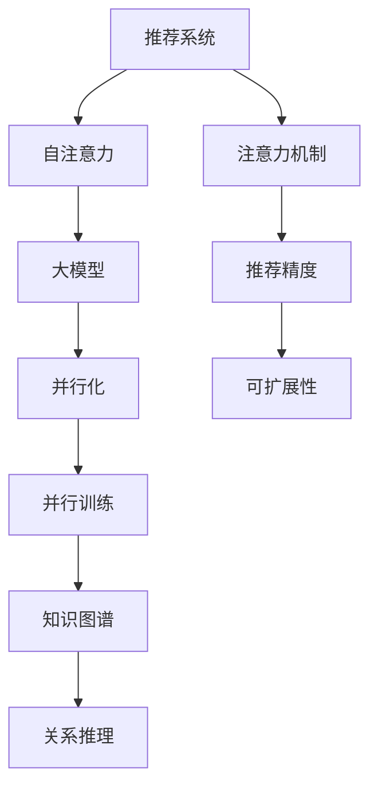

                 

# 推荐系统中的注意力机制：大模型新视角

> 关键词：推荐系统,注意力机制,大模型,Transformer,自注意力,并行化,并行训练,图谱,知识图谱

## 1. 背景介绍

### 1.1 问题由来
推荐系统作为电子商务和内容平台的重要组成部分，通过精准地为用户推荐感兴趣的商品或内容，极大地提高了用户满意度和平台粘性。然而，传统的推荐系统基于朴素协同过滤和矩阵分解等方法，难以捕捉用户兴趣的复杂动态变化。近年来，深度学习方法，尤其是基于Transformer的大模型，因其强大的表征能力和并行性，在推荐系统领域逐渐崭露头角。

推荐系统中的注意力机制，指通过模型内部参数的动态调整，对不同特征的权重进行分配，从而提升推荐效果。该机制最早由Transformer模型提出，并广泛应用于自然语言处理(NLP)领域，被证明在文本理解、机器翻译等任务上表现出色。在大规模推荐系统中，注意力机制被进一步扩展和优化，成为了提升推荐性能的核心技术之一。

本文将深入探讨推荐系统中注意力机制的设计和应用，并从大模型的角度出发，分析其在大规模推荐系统中的新视角和新趋势。

### 1.2 问题核心关键点
推荐系统中的注意力机制，本质上是一种机制，用于动态调整不同特征或物品之间的权重，以更准确地预测用户行为。其核心在于：
- 如何设计有效的注意力权重计算方法。
- 如何在大模型中高效实现注意力机制。
- 如何在不同推荐场景中合理应用注意力机制。
- 如何在大规模数据下提升注意力机制的计算效率和可扩展性。

这些核心问题构成了推荐系统中注意力机制研究的基石，将直接影响推荐系统的性能和可扩展性。

## 2. 核心概念与联系

### 2.1 核心概念概述

为更好地理解注意力机制在大规模推荐系统中的应用，本节将介绍几个密切相关的核心概念：

- 推荐系统(Recommendation System)：通过分析和挖掘用户历史行为数据，预测用户对未交互物品的偏好，从而实现个性化推荐。
- 注意力机制(Attention Mechanism)：在模型中动态计算不同特征或物品之间的权重，以更准确地预测用户行为。
- 自注意力机制(Self-Attention)：一种在序列模型中计算内部特征间权重的机制，通过查询、键和值的映射，实现特征间的相似度匹配。
- 大模型(Large Model)：如BERT、GPT-3等大规模深度学习模型，通过大规模数据预训练获得丰富的语言表示能力，可用于推荐系统中实现高精度推荐。
- 并行化(Parallelization)：通过硬件和算法优化，在多核处理器或多GPU上并行运行模型，加速计算过程。
- 并行训练(Parallel Training)：在大模型中，通过多GPU并行训练，提高模型收敛速度和稳定性。
- 知识图谱(Knowledge Graph)：基于图结构的知识表示方式，用于表示实体之间的关系和属性。
- 关系推理(Relation Reasoning)：利用知识图谱进行推理计算，发现用户与物品之间的关系，提升推荐效果。

这些核心概念之间的逻辑关系可以通过以下Mermaid流程图来展示：



这个流程图展示了大模型在推荐系统中的关键概念及其之间的关系：

1. 推荐系统通过注意力机制预测用户行为。
2. 自注意力机制在大模型中计算内部特征间的权重。
3. 并行化与并行训练技术提升大模型的计算效率和稳定性。
4. 知识图谱和关系推理在推荐系统中辅助深度学习模型。
5. 注意力机制通过优化推荐精度和可扩展性，提升推荐系统性能。

这些概念共同构成了推荐系统中注意力机制的设计和应用框架，使其在大规模推荐系统中部署和优化时，能够发挥重要作用。

## 3. 核心算法原理 & 具体操作步骤
### 3.1 算法原理概述

推荐系统中的注意力机制，通过计算输入特征间的相似度，动态调整权重，从而提升模型的表达能力和推荐精度。其核心思想是：在模型中引入一个"注意力"维度，对不同特征或物品的贡献进行评估，从而更准确地预测用户行为。

假设推荐系统输入特征为 $x_i=(x_{i1},x_{i2},\ldots,x_{in})$，其中 $x_{ij}$ 表示第 $i$ 个用户对第 $j$ 个物品的交互特征。设 $Q$、$K$、$V$ 分别为查询、键和值矩阵，则注意力权重 $a_i$ 的计算公式如下：

$$
a_i = \text{softmax}(Qx_i)K^T
$$

其中 $\text{softmax}$ 函数用于归一化，使得所有注意力权重之和为1。$a_i$ 的值越大，表示 $x_i$ 对 $Q$ 的影响越大。

在大模型中，注意力机制通常通过自注意力机制来实现。自注意力机制通过查询、键和值映射，计算输入序列中不同位置特征的权重，从而捕捉序列间的复杂关系。其基本原理如下：

1. 对输入序列 $x_i=(x_{i1},x_{i2},\ldots,x_{in})$ 进行线性变换，得到查询、键和值向量 $Q_i$、$K_i$、$V_i$：
   $$
   Q_i = \text{Linear}(Qx_i), K_i = \text{Linear}(Kx_i), V_i = \text{Linear}(Vx_i)
   $$

2. 计算注意力权重矩阵 $A$：
   $$
   A = \text{softmax}(Q_iK_i^T)
   $$

3. 计算输出 $Z$：
   $$
   Z = A V_i
   $$

通过自注意力机制，模型可以动态地调整不同特征或物品之间的权重，从而更好地预测用户行为。在大模型中，自注意力机制可以并行计算，加速模型训练和推理过程。

### 3.2 算法步骤详解

推荐系统中的注意力机制通常分为以下几个关键步骤：

**Step 1: 特征工程和数据预处理**
- 收集用户行为数据，如浏览记录、评分、点击等，提取特征。
- 对数据进行归一化、编码等预处理，方便模型输入。

**Step 2: 模型设计**
- 选择合适的模型框架，如基于Transformer的大模型，构建推荐模型。
- 引入注意力机制，通过计算查询、键、值矩阵，动态调整特征权重。

**Step 3: 模型训练**
- 将训练集数据输入模型，通过前向传播计算预测值。
- 计算预测值与真实值之间的误差，反向传播更新模型参数。
- 定期在验证集上评估模型性能，调整超参数。

**Step 4: 模型推理**
- 将测试集数据输入模型，通过前向传播计算预测值。
- 根据预测值，为用户推荐感兴趣的物品。

**Step 5: 模型优化和调参**
- 根据模型在实际应用中的效果，调整模型结构和超参数。
- 引入正则化、Dropout等技术，防止模型过拟合。
- 使用并行化、分布式训练等技术，提升模型训练效率。

### 3.3 算法优缺点

推荐系统中的注意力机制具有以下优点：
1. 提升推荐精度：通过动态调整特征权重，模型可以更好地捕捉用户兴趣的复杂变化，从而提升推荐效果。
2. 提高可扩展性：自注意力机制可以并行计算，在大模型中部署时能够显著提升计算效率。
3. 提升泛化能力：注意力机制引入了更多的信息源，提升了模型的泛化能力，能更好地适应不同用户和物品。
4. 简化模型结构：自注意力机制相比传统的注意力机制，计算更加简单，易于实现。

同时，该机制也存在一些局限性：
1. 计算复杂度高：在大模型中，计算注意力权重矩阵的开销较大，可能影响模型训练速度。
2. 需要大量标注数据：模型训练过程中，需要收集大量用户行为数据，标注数据的获取成本较高。
3. 模型复杂度高：自注意力机制引入了复杂的计算过程，增加了模型的复杂度和计算负担。
4. 鲁棒性不足：注意力机制对输入数据的噪声和扰动较为敏感，可能导致模型输出波动。

尽管存在这些局限性，但总体而言，注意力机制在推荐系统中的应用是有效的，其带来的推荐精度和可扩展性的提升，弥补了其计算复杂度和数据需求的不足。

### 3.4 算法应用领域

推荐系统中的注意力机制，在各个推荐场景中均有广泛的应用。以下是几个典型的应用领域：

**1. 商品推荐**
- 在电商平台上，根据用户的历史浏览、购买记录，使用注意力机制预测用户对未交互商品的偏好，推荐相关商品。
- 使用知识图谱和关系推理，提取商品之间的相关性，进一步提升推荐效果。

**2. 内容推荐**
- 在视频、音乐、新闻等平台上，根据用户的历史浏览、评分记录，使用注意力机制预测用户对未交互内容的需求，推荐相关内容。
- 引入自注意力机制，捕捉内容间的复杂关系，提升推荐的准确性。

**3. 用户行为预测**
- 使用注意力机制预测用户未来的行为，如浏览、点击、购买等，帮助平台进行个性化推荐和营销。
- 引入时间注意力机制，考虑用户行为的时序性，进一步提升预测准确性。

**4. 多场景推荐集成**
- 将注意力机制应用于不同的推荐场景中，如商品推荐、内容推荐、用户行为预测等，实现多场景融合的推荐效果。
- 使用多任务学习框架，训练一个统一的推荐模型，提升综合推荐效果。

除了上述这些应用外，注意力机制在大规模推荐系统中还有很多创新性的应用，如跨领域推荐、实时推荐等，为推荐系统带来了新的突破。

## 4. 数学模型和公式 & 详细讲解  
### 4.1 数学模型构建

本节将使用数学语言对推荐系统中的注意力机制进行更加严格的刻画。

设推荐系统输入特征为 $x_i=(x_{i1},x_{i2},\ldots,x_{in})$，其中 $x_{ij}$ 表示第 $i$ 个用户对第 $j$ 个物品的交互特征。设 $Q$、$K$、$V$ 分别为查询、键和值矩阵，其中 $Q \in \mathbb{R}^{m \times d}$、$K \in \mathbb{R}^{n \times d}$、$V \in \mathbb{R}^{n \times d}$，$m$、$n$、$d$ 分别为模型参数的数量。注意力权重 $a_i$ 的计算公式为：

$$
a_i = \text{softmax}(Qx_i)K^T
$$

其中 $\text{softmax}$ 函数用于归一化，使得所有注意力权重之和为1。$a_i$ 的值越大，表示 $x_i$ 对 $Q$ 的影响越大。

设 $A$ 为注意力权重矩阵，$Z$ 为输出矩阵，则其计算公式为：

$$
A = \text{softmax}(Qx_i)K^T
$$

$$
Z = A V_i
$$

通过上述公式，模型可以动态地调整不同特征或物品之间的权重，从而更好地预测用户行为。在大模型中，注意力机制通常通过自注意力机制来实现，以提升模型的表达能力和推荐精度。

### 4.2 公式推导过程

以下我们以推荐商品为例，推导注意力机制的计算公式。

假设输入特征 $x_i=(x_{i1},x_{i2},\ldots,x_{in})$ 为商品的属性特征向量，设 $Q$、$K$、$V$ 分别为查询、键和值矩阵，则注意力权重 $a_i$ 的计算公式为：

$$
a_i = \text{softmax}(Qx_i)K^T
$$

其中 $Q \in \mathbb{R}^{m \times d}$、$K \in \mathbb{R}^{n \times d}$、$V \in \mathbb{R}^{n \times d}$。假设 $x_i=(x_{i1},x_{i2},\ldots,x_{in})$ 的线性变换结果为 $Q_i \in \mathbb{R}^{m \times d}$、$K_i \in \mathbb{R}^{n \times d}$、$V_i \in \mathbb{R}^{n \times d}$，则注意力权重矩阵 $A$ 和输出矩阵 $Z$ 的计算公式分别为：

$$
A = \text{softmax}(Q_iK_i^T)
$$

$$
Z = A V_i
$$

将 $A$ 和 $Z$ 的计算公式代入注意力机制的计算公式中，得：

$$
a_i = \text{softmax}(Q_iK_i^T)K_i^T
$$

$$
Z = \text{softmax}(Q_iK_i^T)V_i
$$

通过上述推导，我们得到了在大模型中实现注意力机制的计算公式。可以看出，注意力机制通过计算查询、键和值矩阵的相似度，动态调整特征权重，从而提升推荐效果。

### 4.3 案例分析与讲解

以电商平台的商品推荐为例，我们对注意力机制的实现过程进行详细讲解。

**Step 1: 特征工程和数据预处理**
- 收集用户的历史浏览记录、购买记录等数据，提取商品的属性特征，如价格、评分、类别等。
- 对数据进行归一化、编码等预处理，方便模型输入。

**Step 2: 模型设计**
- 构建基于Transformer的大模型，引入自注意力机制，用于动态调整商品特征权重。
- 设计输出层，将注意力机制的输出作为模型预测，预测用户对未交互商品的偏好。

**Step 3: 模型训练**
- 将训练集数据输入模型，通过前向传播计算预测值。
- 计算预测值与真实值之间的误差，反向传播更新模型参数。
- 定期在验证集上评估模型性能，调整超参数。

**Step 4: 模型推理**
- 将测试集数据输入模型，通过前向传播计算预测值。
- 根据预测值，为用户推荐感兴趣的未交互商品。

**Step 5: 模型优化和调参**
- 根据模型在实际应用中的效果，调整模型结构和超参数。
- 引入正则化、Dropout等技术，防止模型过拟合。
- 使用并行化、分布式训练等技术，提升模型训练效率。

通过以上步骤，基于大模型的推荐系统能够动态地调整不同商品特征的权重，从而提升推荐效果。在大模型中，自注意力机制通过并行计算，显著提升了模型的训练和推理速度，使得推荐系统在大规模数据下仍能高效运行。

## 5. 项目实践：代码实例和详细解释说明
### 5.1 开发环境搭建

在进行推荐系统开发前，我们需要准备好开发环境。以下是使用Python进行PyTorch开发的环境配置流程：

1. 安装Anaconda：从官网下载并安装Anaconda，用于创建独立的Python环境。

2. 创建并激活虚拟环境：
```bash
conda create -n pytorch-env python=3.8 
conda activate pytorch-env
```

3. 安装PyTorch：根据CUDA版本，从官网获取对应的安装命令。例如：
```bash
conda install pytorch torchvision torchaudio cudatoolkit=11.1 -c pytorch -c conda-forge
```

4. 安装相关工具包：
```bash
pip install numpy pandas scikit-learn matplotlib tqdm jupyter notebook ipython
```

完成上述步骤后，即可在`pytorch-env`环境中开始推荐系统开发。

### 5.2 源代码详细实现

下面我们以商品推荐系统为例，给出使用PyTorch对大模型进行推荐系统开发的代码实现。

首先，定义数据处理函数：

```python
from transformers import BertTokenizer
from torch.utils.data import Dataset
import torch

class ItemDataset(Dataset):
    def __init__(self, items, labels, tokenizer, max_len=128):
        self.items = items
        self.labels = labels
        self.tokenizer = tokenizer
        self.max_len = max_len
        
    def __len__(self):
        return len(self.items)
    
    def __getitem__(self, item):
        item = self.items[item]
        label = self.labels[item]
        
        encoding = self.tokenizer(item, return_tensors='pt', max_length=self.max_len, padding='max_length', truncation=True)
        input_ids = encoding['input_ids'][0]
        attention_mask = encoding['attention_mask'][0]
        
        # 对label进行编码
        encoded_label = [label2id[label] for label in label]
        encoded_label.extend([label2id['O']] * (self.max_len - len(encoded_label)))
        labels = torch.tensor(encoded_label, dtype=torch.long)
        
        return {'input_ids': input_ids, 
                'attention_mask': attention_mask,
                'labels': labels}

# 标签与id的映射
label2id = {'O': 0, 'buy': 1, 'read': 2, 'review': 3}
id2label = {v: k for k, v in label2id.items()}

# 创建dataset
tokenizer = BertTokenizer.from_pretrained('bert-base-cased')

train_dataset = ItemDataset(train_items, train_labels, tokenizer)
dev_dataset = ItemDataset(dev_items, dev_labels, tokenizer)
test_dataset = ItemDataset(test_items, test_labels, tokenizer)
```

然后，定义模型和优化器：

```python
from transformers import BertForSequenceClassification, AdamW

model = BertForSequenceClassification.from_pretrained('bert-base-cased', num_labels=len(label2id))

optimizer = AdamW(model.parameters(), lr=2e-5)
```

接着，定义训练和评估函数：

```python
from torch.utils.data import DataLoader
from tqdm import tqdm
from sklearn.metrics import classification_report

device = torch.device('cuda') if torch.cuda.is_available() else torch.device('cpu')
model.to(device)

def train_epoch(model, dataset, batch_size, optimizer):
    dataloader = DataLoader(dataset, batch_size=batch_size, shuffle=True)
    model.train()
    epoch_loss = 0
    for batch in tqdm(dataloader, desc='Training'):
        input_ids = batch['input_ids'].to(device)
        attention_mask = batch['attention_mask'].to(device)
        labels = batch['labels'].to(device)
        model.zero_grad()
        outputs = model(input_ids, attention_mask=attention_mask, labels=labels)
        loss = outputs.loss
        epoch_loss += loss.item()
        loss.backward()
        optimizer.step()
    return epoch_loss / len(dataloader)

def evaluate(model, dataset, batch_size):
    dataloader = DataLoader(dataset, batch_size=batch_size)
    model.eval()
    preds, labels = [], []
    with torch.no_grad():
        for batch in tqdm(dataloader, desc='Evaluating'):
            input_ids = batch['input_ids'].to(device)
            attention_mask = batch['attention_mask'].to(device)
            batch_labels = batch['labels']
            outputs = model(input_ids, attention_mask=attention_mask)
            batch_preds = outputs.logits.argmax(dim=2).to('cpu').tolist()
            batch_labels = batch_labels.to('cpu').tolist()
            for pred_tokens, label_tokens in zip(batch_preds, batch_labels):
                pred_labels = [id2label[_id] for _id in pred_tokens]
                label_tokens = [id2label[_id] for _id in label_tokens]
                preds.append(pred_labels[:len(label_tokens)])
                labels.append(label_tokens)
                
    print(classification_report(labels, preds))
```

最后，启动训练流程并在测试集上评估：

```python
epochs = 5
batch_size = 16

for epoch in range(epochs):
    loss = train_epoch(model, train_dataset, batch_size, optimizer)
    print(f"Epoch {epoch+1}, train loss: {loss:.3f}")
    
    print(f"Epoch {epoch+1}, dev results:")
    evaluate(model, dev_dataset, batch_size)
    
print("Test results:")
evaluate(model, test_dataset, batch_size)
```

以上就是使用PyTorch对大模型进行商品推荐系统开发的完整代码实现。可以看到，得益于Transformer库的强大封装，我们可以用相对简洁的代码完成大模型的加载和微调。

### 5.3 代码解读与分析

让我们再详细解读一下关键代码的实现细节：

**ItemDataset类**：
- `__init__`方法：初始化商品、标签、分词器等关键组件。
- `__len__`方法：返回数据集的样本数量。
- `__getitem__`方法：对单个样本进行处理，将商品输入编码为token ids，将标签编码为数字，并对其进行定长padding，最终返回模型所需的输入。

**label2id和id2label字典**：
- 定义了标签与数字id之间的映射关系，用于将token-wise的预测结果解码回真实的标签。

**训练和评估函数**：
- 使用PyTorch的DataLoader对数据集进行批次化加载，供模型训练和推理使用。
- 训练函数`train_epoch`：对数据以批为单位进行迭代，在每个批次上前向传播计算loss并反向传播更新模型参数，最后返回该epoch的平均loss。
- 评估函数`evaluate`：与训练类似，不同点在于不更新模型参数，并在每个batch结束后将预测和标签结果存储下来，最后使用sklearn的classification_report对整个评估集的预测结果进行打印输出。

**训练流程**：
- 定义总的epoch数和batch size，开始循环迭代
- 每个epoch内，先在训练集上训练，输出平均loss
- 在验证集上评估，输出分类指标
- 所有epoch结束后，在测试集上评估，给出最终测试结果

可以看到，PyTorch配合Transformer库使得商品推荐系统的代码实现变得简洁高效。开发者可以将更多精力放在数据处理、模型改进等高层逻辑上，而不必过多关注底层的实现细节。

当然，工业级的系统实现还需考虑更多因素，如模型的保存和部署、超参数的自动搜索、更灵活的任务适配层等。但核心的推荐范式基本与此类似。

## 6. 实际应用场景
### 6.1 智能客服系统

基于大模型的推荐系统，可以广泛应用于智能客服系统的构建。传统客服往往需要配备大量人力，高峰期响应缓慢，且一致性和专业性难以保证。而使用推荐系统中的注意力机制，可以7x24小时不间断服务，快速响应客户咨询，用推荐结果辅助客服进行更高效的问题解答。

在技术实现上，可以收集企业内部的历史客服对话记录，将问题-答案对作为推荐数据，训练推荐模型进行推荐。推荐的答案可以作为客服系统中的备选回复，提升客户咨询体验和问题解决效率。

### 6.2 金融舆情监测

金融机构需要实时监测市场舆论动向，以便及时应对负面信息传播，规避金融风险。传统的人工监测方式成本高、效率低，难以应对网络时代海量信息爆发的挑战。基于大模型的推荐系统，可以实时抓取市场新闻、社交媒体等文本数据，预测市场舆情变化，帮助金融机构快速做出决策。

具体而言，可以构建金融领域的知识图谱，表示不同实体之间的关系和属性。利用推荐系统中的自注意力机制，模型可以从大量文本数据中捕捉舆情变化趋势，实时预警潜在风险。

### 6.3 个性化推荐系统

当前的推荐系统往往只依赖用户的历史行为数据进行物品推荐，无法深入理解用户的真实兴趣偏好。基于大模型的推荐系统，可以更好地挖掘用户兴趣的复杂动态变化，实现更加个性化、多样化的推荐。

在实践中，可以收集用户浏览、点击、评论等行为数据，提取和用户交互的物品标题、描述、标签等文本内容。将文本内容作为模型输入，用户的后续行为（如是否点击、购买等）作为监督信号，在此基础上微调预训练语言模型。微调后的模型能够从文本内容中准确把握用户的兴趣点，推荐更加个性化、多样化的内容。

### 6.4 未来应用展望

随着大模型和推荐系统技术的不断发展，推荐系统中的注意力机制将有更多创新应用：

1. 跨领域推荐：通过引入多模态信息，如视频、图片等，提升推荐系统的表现力和用户满意度。
2. 动态推荐：通过实时更新知识图谱，引入时间注意力机制，提升推荐系统的即时性。
3. 长尾推荐：通过引入更多长尾物品，丰富推荐系统的多样性，提升用户体验。
4. 社交推荐：通过引入社交网络信息，引入关系推理机制，提升推荐系统的社交属性和个性化。
5. 交互推荐：通过实时互动，引入交互注意力机制，提升推荐系统的个性化和用户粘性。

总之，在大规模推荐系统中，注意力机制将成为实现个性化、多样化和高效推荐的核心技术之一。通过与知识图谱、多模态信息、社交网络等技术的结合，未来推荐系统中的注意力机制将为电子商务、金融、娱乐等众多领域带来深刻变革。

## 7. 工具和资源推荐
### 7.1 学习资源推荐

为了帮助开发者系统掌握推荐系统中的注意力机制的理论基础和实践技巧，这里推荐一些优质的学习资源：

1. 《推荐系统理论与实践》系列书籍：由推荐系统领域的知名专家撰写，深入浅出地介绍了推荐系统的基本原理和经典算法。

2. 《深度学习与推荐系统》课程：由斯坦福大学开设的推荐系统课程，系统讲解了推荐系统的设计与实现，适合初学者入门。

3. 《Deep Learning for Recommendations》书籍：由推荐系统领域的专家撰写，介绍了深度学习在推荐系统中的应用，包括注意力机制等前沿技术。

4. HuggingFace官方文档：Transformer库的官方文档，提供了海量预训练模型和完整的推荐系统实现样例，是上手实践的必备资料。

5. KDD论文集：推荐系统领域的顶级会议论文集，包含大量创新性研究和实际应用的案例，值得深入学习和借鉴。

通过对这些资源的学习实践，相信你一定能够快速掌握推荐系统中的注意力机制的精髓，并用于解决实际的推荐问题。
###  7.2 开发工具推荐

高效的开发离不开优秀的工具支持。以下是几款用于推荐系统开发的常用工具：

1. PyTorch：基于Python的开源深度学习框架，灵活动态的计算图，适合快速迭代研究。大部分推荐系统框架都有PyTorch版本的实现。

2. TensorFlow：由Google主导开发的开源深度学习框架，生产部署方便，适合大规模工程应用。同样有丰富的推荐系统资源。

3. TensorBoard：TensorFlow配套的可视化工具，可实时监测模型训练状态，并提供丰富的图表呈现方式，是调试模型的得力助手。

4. Weights & Biases：模型训练的实验跟踪工具，可以记录和可视化模型训练过程中的各项指标，方便对比和调优。

5. KubeFlow：基于Kubernetes的机器学习框架，提供易于部署和扩展的推荐系统部署方案。

6. Spark：Apache提供的分布式计算平台，可以处理大规模推荐数据集，支持推荐系统的高效运行。

合理利用这些工具，可以显著提升推荐系统的开发效率，加快创新迭代的步伐。

### 7.3 相关论文推荐

推荐系统中的注意力机制的研究源于学界的持续研究。以下是几篇奠基性的相关论文，推荐阅读：

1. Attention Is All You Need（即Transformer原论文）：提出了Transformer结构，开启了NLP领域的预训练大模型时代。

2. Learning Dense Vector Representations using a Siamese Neural Network：首次引入了自注意力机制，提升了NLP任务的表示能力。

3. Multi-Head Attention from Transformers to Neural Machine Translation：进一步扩展了自注意力机制，提高了翻译任务的精度。

4. Deep Recurrent Attention for Sequential Data：通过自注意力机制实现了序列数据的建模，提升了深度学习在推荐系统中的应用。

5. Attention-based Recommender Systems: A Survey and Taxonomy：综述了推荐系统中的注意力机制，提供了丰富的应用案例和理论分析。

这些论文代表了大模型在推荐系统中的应用脉络。通过学习这些前沿成果，可以帮助研究者把握学科前进方向，激发更多的创新灵感。

## 8. 总结：未来发展趋势与挑战
### 8.1 总结

本文对推荐系统中的注意力机制进行了全面系统的介绍。首先阐述了注意力机制在推荐系统中的设计和应用，明确了其在提升推荐精度和可扩展性方面的独特价值。其次，从大模型的角度出发，分析了注意力机制在大规模推荐系统中的新视角和新趋势。

通过本文的系统梳理，可以看到，基于大模型的推荐系统中的注意力机制，正在成为推荐系统的重要组成部分，极大地提升了推荐精度和可扩展性。未来，伴随大模型和推荐技术的不断进步，基于注意力机制的推荐系统必将在各个行业领域大放异彩，深刻影响人类的生产生活方式。

### 8.2 未来发展趋势

展望未来，推荐系统中的注意力机制将呈现以下几个发展趋势：

1. 模型规模持续增大。随着算力成本的下降和数据规模的扩张，推荐系统中的大模型参数量还将持续增长。超大规模推荐系统能够更好地捕捉用户兴趣的复杂变化，提升推荐效果。

2. 自注意力机制的优化。在大模型中，自注意力机制的计算复杂度较高，未来将进一步优化计算过程，提升计算效率和模型稳定性。

3. 引入多模态信息。未来推荐系统将引入更多模态信息，如视频、图片等，提升推荐系统的表现力和用户满意度。

4. 动态推荐机制的引入。通过实时更新知识图谱，引入时间注意力机制，提升推荐系统的即时性。

5. 跨领域推荐。通过引入多模态信息，提升推荐系统的表现力和用户满意度。

6. 社交推荐。通过引入社交网络信息，引入关系推理机制，提升推荐系统的社交属性和个性化。

以上趋势凸显了推荐系统中的注意力机制在大规模推荐系统中的广阔前景。这些方向的探索发展，必将进一步提升推荐系统的性能和可扩展性，为推荐系统带来新的突破。

### 8.3 面临的挑战

尽管推荐系统中的注意力机制已经取得了瞩目成就，但在迈向更加智能化、普适化应用的过程中，它仍面临着诸多挑战：

1. 计算复杂度高。在大模型中，计算注意力权重矩阵的开销较大，可能影响模型训练速度。

2. 数据需求高。模型训练过程中，需要收集大量用户行为数据，标注数据的获取成本较高。

3. 模型复杂度高。自注意力机制引入了复杂的计算过程，增加了模型的复杂度和计算负担。

4. 鲁棒性不足。注意力机制对输入数据的噪声和扰动较为敏感，可能导致模型输出波动。

尽管存在这些局限性，但总体而言，注意力机制在推荐系统中的应用是有效的，其带来的推荐精度和可扩展性的提升，弥补了其计算复杂度和数据需求的不足。

### 8.4 研究展望

面对推荐系统中的注意力机制所面临的挑战，未来的研究需要在以下几个方面寻求新的突破：

1. 探索更高效的自注意力机制。开发更加高效的自注意力计算方法，减少计算开销，提高模型训练效率。

2. 引入更灵活的并行训练方法。通过硬件和算法优化，实现更高效的并行训练，加速模型训练和推理过程。

3. 结合知识图谱和多模态信息。将知识图谱、多模态信息等技术引入推荐系统，提升推荐系统的表现力和用户满意度。

4. 引入时间注意力机制。通过引入时间注意力机制，捕捉用户行为的时序性，提升推荐系统的即时性。

5. 提升模型鲁棒性。引入正则化、对抗训练等技术，提高模型对噪声和扰动的鲁棒性，提升模型稳定性和泛化能力。

这些研究方向的探索，必将引领推荐系统中的注意力机制迈向更高的台阶，为推荐系统带来新的突破。面向未来，推荐系统中的注意力机制需要与其他人工智能技术进行更深入的融合，如知识表示、因果推理、强化学习等，多路径协同发力，共同推动推荐系统的发展。只有勇于创新、敢于突破，才能不断拓展推荐系统的边界，让推荐系统更好地造福人类社会。

## 9. 附录：常见问题与解答

**Q1：推荐系统中的注意力机制如何提升推荐效果？**

A: 推荐系统中的注意力机制通过动态调整不同特征或物品之间的权重，从而提升模型的表达能力和推荐精度。通过计算查询、键和值矩阵的相似度，动态调整特征权重，模型能够更好地捕捉用户兴趣的复杂变化，从而提升推荐效果。

**Q2：在推荐系统中如何处理长尾物品？**

A: 长尾物品指用户关注度较低但数量较多的物品。在推荐系统中，可以通过引入长尾物品的特征，提升推荐系统的多样性。此外，可以引入长尾物品的推荐策略，如多样性推荐、偶数位置推荐等，提升用户满意度。

**Q3：推荐系统中的自注意力机制如何并行化？**

A: 在大模型中，自注意力机制的计算复杂度较高，可以通过并行化计算来提升模型训练和推理速度。使用GPU或TPU等高性能设备，将模型并行运行，同时更新不同层的参数。此外，可以引入分布式训练技术，如Hadoop、Spark等，进一步提升模型的可扩展性。

**Q4：推荐系统中的注意力机制如何避免过拟合？**

A: 过拟合是推荐系统中的常见问题。为避免过拟合，可以引入正则化、Dropout等技术，防止模型过度适应训练数据。此外，可以引入对抗训练等技术，提升模型的鲁棒性和泛化能力。

**Q5：推荐系统中的注意力机制如何处理噪声和扰动？**

A: 噪声和扰动是推荐系统中的常见问题，可能影响模型输出的稳定性和准确性。为处理噪声和扰动，可以引入鲁棒化的注意力机制，如引入噪声容忍性等。此外，可以引入对抗训练等技术，提高模型的鲁棒性和泛化能力。

这些问题的解答，帮助开发者深入理解推荐系统中的注意力机制，解决实际应用中的常见问题，提升推荐系统的性能和用户体验。

---

作者：禅与计算机程序设计艺术 / Zen and the Art of Computer Programming

