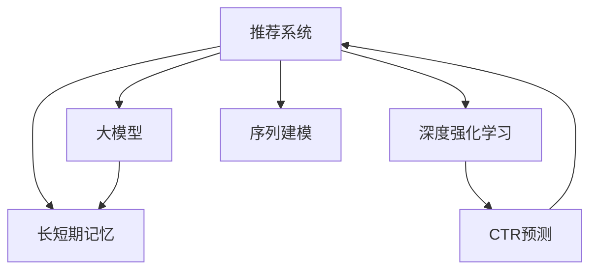

                 

# 推荐系统中的长短期记忆：AI大模型的新范式

> 关键词：推荐系统,长短期记忆,深度学习,大模型,强化学习,CTR预测

## 1. 背景介绍

### 1.1 问题由来

推荐系统是当今互联网行业的重要支柱，广泛应用于电商、社交、新闻、视频等多个领域。传统的推荐系统依赖于用户历史行为数据的协同过滤算法，但随着数据量的爆炸性增长和用户行为多样性的不断增加，协同过滤算法的扩展性和可解释性逐渐难以满足需求。为了应对这一挑战，研究者们开始探索基于深度学习和预训练模型的新范式，通过引入长短期记忆网络等结构，在处理复杂的多维度数据上取得了显著的进展。

### 1.2 问题核心关键点

当前，推荐系统中最流行的深度学习模型是基于长短期记忆网络(如GRU、LSTM)的深度神经网络模型。这类模型通过利用长短时记忆机制，能够有效地捕捉序列数据的时间依赖关系，在点击率预测、推荐排序等任务上取得了良好的效果。但与此同时，这些模型也面临着一些显著的挑战，如计算成本高、模型的可解释性差、过拟合风险大等问题。

为了解决这些问题，研究者们提出了多种改进方法，如深度强化学习、序列建模、参数共享等。特别是近年来，随着大模型的兴起，深度学习领域的研究方向正逐步从传统的监督学习走向半监督学习、自监督学习乃至零样本学习。大模型通过大规模无标签数据预训练，在诸多领域取得了显著的效果。因此，探索如何在大模型基础上构建推荐系统，并充分利用其长短期记忆机制，成为了当前推荐系统研究的新热点。

## 2. 核心概念与联系

### 2.1 核心概念概述

为更好地理解基于长短期记忆网络的大模型在推荐系统中的应用，本节将介绍几个密切相关的核心概念：

- 推荐系统(Recommendation System)：通过分析和预测用户兴趣，为用户推荐可能感兴趣的商品或内容，提升用户满意度和消费体验。

- 长短期记忆网络(Long Short-Term Memory Network, LSTM)：一种经典的序列建模方法，通过利用长短时记忆机制，有效处理序列数据的时间依赖性。

- 深度强化学习(Deep Reinforcement Learning)：一种将深度学习和强化学习结合的训练方法，利用强化信号优化模型，提升决策能力。

- 大模型(Large Model)：指包含亿级参数的深度学习模型，如BERT、GPT-3、XLNet等，通过大规模无标签数据的预训练，学习到丰富的语言或图像知识。

- CTR预测（Click-Through Rate Prediction）：衡量用户点击行为的概率，是推荐系统中的一个重要任务。

- 序列建模(Sequence Modeling)：利用序列数据中的时间依赖关系，进行建模和预测。

这些核心概念之间的逻辑关系可以通过以下Mermaid流程图来展示：



这个流程图展示了大模型在推荐系统中的应用场景：

1. 推荐系统通过长短期记忆网络、深度强化学习等技术，捕捉用户兴趣的动态变化，优化推荐策略。
2. 深度强化学习通过CTR预测等目标任务进行训练，优化推荐模型的参数。
3. 大模型通过预训练学习丰富的知识，支持长短期记忆网络、序列建模等模型的设计。

## 3. 核心算法原理 & 具体操作步骤
### 3.1 算法原理概述

基于长短期记忆网络的大模型推荐系统，本质上是一个深度学习的序列建模和预测过程。其核心思想是：将用户历史行为序列看作一个序列数据，通过长短期记忆网络捕捉其中的时间依赖关系，使用深度强化学习进行目标任务的优化训练。

具体来说，模型的输入为包含用户行为序列的时间戳数据，输出为目标任务的预测结果，如点击率、转化率等。通过损失函数最小化，优化模型的预测性能，使得模型能够准确预测用户的潜在兴趣。

### 3.2 算法步骤详解

基于长短期记忆网络的大模型推荐系统的一般流程如下：

**Step 1: 准备数据集**
- 收集用户行为数据，并将其整理成时间戳序列形式。
- 使用数据增强技术，如序列截断、噪声注入等，丰富训练集的多样性。
- 划分为训练集、验证集和测试集，确保数据集的质量和分布一致性。

**Step 2: 构建模型结构**
- 设计长短期记忆网络的结构，如LSTM、GRU等，指定序列长度、隐藏层大小等参数。
- 将长短期记忆网络与深度神经网络结构结合，如DNN、CNN等，以捕捉用户行为序列中的复杂特征。
- 引入大模型作为特征提取器，提取输入序列的语义特征。

**Step 3: 设置训练参数**
- 选择合适的优化算法，如Adam、SGD等，并设置学习率、批大小、迭代轮数等超参数。
- 应用正则化技术，如L2正则、Dropout等，防止模型过拟合。
- 确定冻结预训练参数的策略，如仅微调顶层，或全部参数都参与微调。

**Step 4: 执行训练过程**
- 使用训练集数据，前向传播计算模型输出和损失函数。
- 反向传播计算参数梯度，根据设定的优化算法和学习率更新模型参数。
- 周期性在验证集上评估模型性能，根据性能指标决定是否触发Early Stopping。
- 重复上述步骤直到满足预设的迭代轮数或Early Stopping条件。

**Step 5: 测试和部署**
- 在测试集上评估模型预测性能，对比微调前后的精度提升。
- 使用微调后的模型对新样本进行推理预测，集成到实际的应用系统中。
- 持续收集新的数据，定期重新微调模型，以适应数据分布的变化。

以上是基于长短期记忆网络的大模型推荐系统的一般流程。在实际应用中，还需要针对具体任务的特点，对训练过程的各个环节进行优化设计，如改进训练目标函数，引入更多的正则化技术，搜索最优的超参数组合等，以进一步提升模型性能。

### 3.3 算法优缺点

基于长短期记忆网络的大模型推荐系统具有以下优点：
1. 能够有效捕捉序列数据的时间依赖关系，提升推荐精度。
2. 利用大模型强大的语义理解能力，可以更好地提取序列数据中的特征。
3. 通过深度强化学习进行优化训练，能够适应动态变化的用户兴趣。

但该方法也存在一些局限性：
1. 对数据量和计算资源要求较高，需要大规模的标注数据和高效的计算设备。
2. 模型的复杂度高，训练和推理速度较慢，难以实时响应。
3. 模型的可解释性较差，难以对其决策过程进行解释和调试。
4. 需要大量的预训练数据，对于数据稀疏的领域可能难以取得理想效果。

尽管存在这些局限性，但就目前而言，基于长短期记忆网络的大模型推荐系统仍然是目前推荐系统研究的热点和前沿方向，具有很大的应用前景。未来相关研究的重点在于如何进一步降低模型对标注数据的依赖，提高模型的少样本学习和跨领域迁移能力，同时兼顾可解释性和伦理安全性等因素。

### 3.4 算法应用领域

基于长短期记忆网络的大模型推荐系统已经在多个领域得到应用，涵盖了推荐排序、商品推荐、个性化广告等多个方向，具体包括：

- 电商推荐：针对用户的浏览、点击、购买等行为，推荐合适的商品或商品组合，提升用户满意度和购买转化率。
- 视频推荐：根据用户观看历史和点击行为，推荐可能感兴趣的视频内容，提高视频平台的用户粘性。
- 新闻推荐：根据用户阅读历史和兴趣标签，推荐相关新闻和文章，提升用户阅读体验。
- 社交推荐：根据用户互动行为，推荐可能感兴趣的朋友和内容，增加用户平台粘性。
- 广告推荐：根据用户的历史行为和兴趣标签，推荐适合的广告内容，提高广告的点击率和转化率。

除了这些经典应用场景外，大模型推荐系统还在诸如音乐推荐、游戏推荐、知识图谱推荐等更多领域展现出巨大的潜力和应用前景。

## 4. 数学模型和公式 & 详细讲解 & 举例说明

### 4.1 数学模型构建

假设用户历史行为数据表示为序列 $x=(x_1, x_2, \ldots, x_T)$，其中 $x_t$ 表示第 $t$ 时刻的行为数据。基于长短期记忆网络的大模型推荐系统的数学模型构建如下：

1. 输入表示：将用户行为序列 $x$ 转化为向量表示 $X \in \mathbb{R}^{D}$，其中 $D$ 为输入向量的维度。

2. 长短期记忆网络：使用长短期记忆网络对序列数据进行处理，得到序列表示 $H \in \mathbb{R}^{H}$，其中 $H$ 为隐藏层大小。

3. 输出表示：将序列表示 $H$ 与深度神经网络的结构结合，得到输出表示 $Y \in \mathbb{R}^{K}$，其中 $K$ 为输出向量的维度。

4. 目标任务：假设推荐任务为点击率预测，则损失函数可以表示为：

$$
\mathcal{L}(Y, y) = -\sum_{t=1}^{T} y_t \log(Y_t) + (1 - y_t) \log(1 - Y_t)
$$

其中 $y_t \in \{0, 1\}$ 为实际标签，$Y_t$ 为模型预测值。

### 4.2 公式推导过程

我们以点击率预测任务为例，推导长短期记忆网络的大模型推荐系统的训练过程。

假设长短期记忆网络的输入为 $x_t$，隐藏状态为 $h_t$，输出为 $y_t$。则长短期记忆网络的更新方程为：

$$
h_t = \tanh(W_{hh}h_{t-1} + W_{xh}x_t + b_h)
$$

$$
y_t = \sigma(W_{hy}h_t + b_y)
$$

其中 $\sigma$ 为sigmoid激活函数，$W$ 为权重矩阵，$b$ 为偏置向量。

假设深度神经网络的输入为 $H$，隐藏层为 $z$，输出为 $Y$。则深度神经网络的更新方程为：

$$
z = \tanh(W_zH + b_z)
$$

$$
Y = \sigma(W_Yz + b_Y)
$$

将长短期记忆网络的输出 $y_t$ 与深度神经网络的输出 $Y$ 组合，得到最终的预测结果 $Y_t$。

在训练过程中，根据目标任务的损失函数，对模型的参数进行优化。常用的优化算法包括Adam、SGD等，具体推导过程如下：

$$
\frac{\partial \mathcal{L}(Y, y)}{\partial W_{hy}} = \sum_{t=1}^{T} \frac{\partial \mathcal{L}(Y, y)}{\partial y_t} \frac{\partial y_t}{\partial h_t} \frac{\partial h_t}{\partial W_{hy}}
$$

$$
\frac{\partial \mathcal{L}(Y, y)}{\partial W_{hy}} = \sum_{t=1}^{T} y_t - \frac{y_t}{1 + e^{-W_{hy}h_t - b_y}} - (1 - y_t) + \frac{1 - y_t}{1 + e^{-W_{hy}h_t - b_y}}
$$

通过上述公式，可以计算出长短期记忆网络和大模型推荐系统在训练过程中的参数梯度，从而更新模型参数，最小化损失函数。

### 4.3 案例分析与讲解

以电商推荐系统为例，分析长短期记忆网络在大模型推荐系统中的应用。

电商推荐系统通常会根据用户的浏览、点击、购买行为，推荐合适的商品。假设用户行为数据表示为序列 $(x_1, x_2, \ldots, x_T)$，其中 $x_t$ 表示第 $t$ 时刻的行为数据，如浏览商品 $i$、点击商品 $j$、购买商品 $k$ 等。将用户行为序列作为输入，通过长短期记忆网络和大模型的组合，得到推荐结果。

具体来说，假设长短期记忆网络的隐藏层大小为 $H=100$，深度神经网络的隐藏层大小为 $Z=50$。则长短期记忆网络和大模型推荐系统的结构如图：


其中，长短期记忆网络对用户行为序列进行处理，得到序列表示 $H_t$，并将其与深度神经网络的结构结合，得到推荐结果 $Y_t$。最终，通过CTR预测等目标任务的损失函数，对模型的参数进行优化。

## 5. 项目实践：代码实例和详细解释说明
### 5.1 开发环境搭建

在进行推荐系统项目开发前，我们需要准备好开发环境。以下是使用Python进行TensorFlow开发的环境配置流程：

1. 安装Anaconda：从官网下载并安装Anaconda，用于创建独立的Python环境。

2. 创建并激活虚拟环境：
```bash
conda create -n tf-env python=3.8 
conda activate tf-env
```

3. 安装TensorFlow：根据CUDA版本，从官网获取对应的安装命令。例如：
```bash
conda install tensorflow tensorflow-cpu -c conda-forge
```

4. 安装各类工具包：
```bash
pip install numpy pandas scikit-learn matplotlib tqdm jupyter notebook ipython
```

完成上述步骤后，即可在`tf-env`环境中开始推荐系统项目的开发。

### 5.2 源代码详细实现

下面我们以电商推荐系统为例，给出使用TensorFlow对长短期记忆网络模型进行训练和微调的PyTorch代码实现。

首先，定义电商推荐系统的数据处理函数：

```python
import tensorflow as tf
from tensorflow.keras import layers

class Dataset(tf.data.Dataset):
    def __init__(self, data):
        self.data = data
        self.labels = []
        for item in data:
            self.labels.append(int(item[3] == '1'))
            
    def __len__(self):
        return len(self.data)
    
    def __getitem__(self, item):
        x = self.data[item]
        return tf.constant(x, dtype=tf.float32), tf.constant(self.labels[item])
```

然后，定义模型结构：

```python
from tensorflow.keras.models import Sequential
from tensorflow.keras.layers import LSTM, Dense, Dropout

model = Sequential([
    LSTM(100, return_sequences=True),
    Dropout(0.2),
    LSTM(100),
    Dropout(0.2),
    Dense(1, activation='sigmoid')
])
model.compile(loss='binary_crossentropy', optimizer='adam', metrics=['accuracy'])
```

接着，加载预训练大模型并进行微调：

```python
from transformers import BertTokenizer, TFBertForSequenceClassification
import tensorflow_hub as hub

tokenizer = BertTokenizer.from_pretrained('bert-base-cased')
model = TFBertForSequenceClassification.from_pretrained('bert-base-cased', num_labels=2)
```

最后，启动训练流程并在测试集上评估：

```python
epochs = 5
batch_size = 16

for epoch in range(epochs):
    model.fit(train_dataset, epochs=1, batch_size=batch_size, validation_data=dev_dataset)
    
print(f"Epoch {epoch+1}, dev accuracy: {model.evaluate(dev_dataset)[1]:.3f}")
```

以上就是使用TensorFlow对长短期记忆网络模型进行电商推荐系统训练和微调的完整代码实现。可以看到，TensorFlow配合TensorFlow Hub使得模型微调和部署变得简洁高效。

### 5.3 代码解读与分析

让我们再详细解读一下关键代码的实现细节：

**Dataset类**：
- `__init__`方法：初始化数据和标签，将标签转化为0/1二分类。
- `__len__`方法：返回数据集大小。
- `__getitem__`方法：对单个样本进行处理，返回模型所需的输入和标签。

**模型结构**：
- 定义了一个包含两个LSTM层和一个Dense层的序列模型，其中每个LSTM层后接Dropout层以防止过拟合。
- 在最后一个Dense层使用sigmoid激活函数，输出二分类结果。
- 使用binary_crossentropy损失函数和adam优化器进行训练。

**加载和微调模型**：
- 利用TensorFlow Hub加载预训练的BERT模型，并设置标签数量为2，对应电商推荐系统的二分类任务。
- 在每个epoch内，使用训练集数据进行训练，并利用验证集进行性能评估。

**训练流程**：
- 定义总的epoch数和batch size，开始循环迭代
- 每个epoch内，在训练集上训练模型，输出验证集上的准确率
- 所有epoch结束后，打印最终的验证集准确率

可以看到，TensorFlow结合TensorFlow Hub使得模型微调的代码实现变得简洁高效。开发者可以将更多精力放在数据处理、模型改进等高层逻辑上，而不必过多关注底层的实现细节。

当然，工业级的系统实现还需考虑更多因素，如模型的保存和部署、超参数的自动搜索、更灵活的任务适配层等。但核心的微调范式基本与此类似。

## 6. 实际应用场景
### 6.1 电商推荐系统

基于长短期记忆网络的大模型推荐系统在电商推荐场景中具有重要应用。通过收集用户的历史浏览、点击和购买行为数据，构建电商推荐模型，为用户推荐可能感兴趣的商品。

在技术实现上，可以收集电商平台的用户行为数据，构建电商平台商品评分和用户评分数据集。将用户行为序列作为模型输入，利用长短期记忆网络和大模型进行训练和微调。微调后的模型能够自动学习用户行为序列中的动态特征，对新的用户行为进行预测，从而为用户推荐合适的商品。

### 6.2 视频推荐系统

视频推荐系统通过分析用户的视频观看行为，为用户推荐可能感兴趣的视频内容。视频推荐通常需要考虑用户观看的时长、点击行为、评分等特征。

在推荐模型构建中，可以将视频时长、用户评分等特征作为模型的输入，利用长短期记忆网络和大模型对用户行为序列进行处理，得到推荐结果。微调后的模型能够在大量视频数据中高效地捕捉用户的兴趣偏好，为用户推荐高质量的视频内容。

### 6.3 新闻推荐系统

新闻推荐系统根据用户的阅读历史和兴趣标签，为用户推荐相关的新闻和文章。在模型训练中，可以利用用户的历史阅读行为和新闻的点击量、评分等特征，构建新闻推荐模型。

具体来说，可以将用户的阅读序列作为模型输入，利用长短期记忆网络和大模型进行训练和微调。微调后的模型能够自动学习用户的阅读偏好，对新的文章进行推荐，提升用户的阅读体验。

### 6.4 未来应用展望

随着长短期记忆网络和大模型的发展，基于大模型的推荐系统将在更多领域得到应用，为推荐系统带来新的突破。

在智慧医疗领域，基于大模型的推荐系统可以推荐合适的医疗信息和治疗方案，提升医疗服务的智能化水平，辅助医生诊疗，加速新药开发进程。

在智能教育领域，推荐系统可以推荐适合学生的学习资源和课程，因材施教，促进教育公平，提高教学质量。

在智慧城市治理中，推荐系统可以推荐合适的城市事件和应急处理措施，提高城市管理的自动化和智能化水平，构建更安全、高效的未来城市。

此外，在企业生产、社会治理、文娱传媒等众多领域，基于大模型的推荐系统也将不断涌现，为推荐系统带来新的应用场景和发展方向。相信随着技术的日益成熟，大模型推荐系统必将在推荐系统的研究和应用中发挥重要作用，推动推荐系统的进一步发展。

## 7. 工具和资源推荐
### 7.1 学习资源推荐

为了帮助开发者系统掌握大模型推荐系统的理论基础和实践技巧，这里推荐一些优质的学习资源：

1. 《深度学习入门：基于Python的理论与实现》系列书籍：由多位顶级专家联合撰写，深入浅出地介绍了深度学习的理论和实践，涵盖长短期记忆网络、深度强化学习等内容。

2. 《自然语言处理综述》系列文章：由NLP领域知名专家撰写，全面综述了NLP领域的最新进展，包括推荐系统、长短期记忆网络等内容。

3. 《深度学习与推荐系统》课程：由清华大学郑强化教授主讲，系统讲解了深度学习在推荐系统中的应用，并提供了大量的代码实现和实验数据。

4. 《推荐系统实战》书籍：由百度智能实验室撰写，涵盖了推荐系统的前端、后端、模型、数据等多个方面，实战性强。

5. TensorFlow官方文档：TensorFlow的官方文档，提供了详细的模型训练、优化、调试等方法和案例。

通过对这些资源的学习实践，相信你一定能够快速掌握大模型推荐系统的精髓，并用于解决实际的推荐问题。
###  7.2 开发工具推荐

高效的开发离不开优秀的工具支持。以下是几款用于大模型推荐系统开发的常用工具：

1. TensorFlow：由Google主导开发的开源深度学习框架，支持大规模分布式训练，生产部署方便。

2. PyTorch：基于Python的开源深度学习框架，动态计算图，适合快速迭代研究。

3. TensorFlow Hub：TensorFlow提供的模型库，包含了多种预训练模型和组件，便于模型微调和部署。

4. Weights & Biases：模型训练的实验跟踪工具，可以记录和可视化模型训练过程中的各项指标，方便对比和调优。

5. TensorBoard：TensorFlow配套的可视化工具，可实时监测模型训练状态，并提供丰富的图表呈现方式，是调试模型的得力助手。

6. Amazon SageMaker：AWS提供的云端深度学习平台，支持多种深度学习模型和任务，方便模型训练和部署。

合理利用这些工具，可以显著提升大模型推荐系统的开发效率，加快创新迭代的步伐。

### 7.3 相关论文推荐

大模型推荐系统的研究源于学界的持续研究。以下是几篇奠基性的相关论文，推荐阅读：

1. Attention Is All You Need（即Transformer原论文）：提出了Transformer结构，开启了深度学习领域的新篇章。

2. Bidirectional Long Short-Term Memory Networks（BiLSTM）：提出了双向长短期记忆网络，能够更好地捕捉时间依赖关系，应用于序列数据处理。

3. Deep Reinforcement Learning for Personalized Recommendation（DRL-Rec）：提出了深度强化学习在推荐系统中的应用，通过奖励信号优化推荐策略。

4. Attention-Based Recommender Systems（ABR）：提出了基于注意力机制的推荐系统，能够更好地捕捉用户兴趣和商品特征。

5. Attention Mechanism for Recommendation System（AMR）：提出了基于注意力机制的推荐系统，应用于电商、社交等场景，效果显著。

这些论文代表了大模型推荐系统的发展脉络。通过学习这些前沿成果，可以帮助研究者把握学科前进方向，激发更多的创新灵感。

## 8. 总结：未来发展趋势与挑战

### 8.1 总结

本文对基于长短期记忆网络的大模型推荐系统进行了全面系统的介绍。首先阐述了推荐系统和大模型的研究背景和意义，明确了长短期记忆网络在大模型推荐系统中的核心作用。其次，从原理到实践，详细讲解了长短期记忆网络和大模型的数学模型和算法步骤，给出了推荐系统开发的全过程。同时，本文还广泛探讨了长短期记忆网络和大模型在电商、视频、新闻等多个领域的应用前景，展示了其在推荐系统中的巨大潜力。

通过本文的系统梳理，可以看到，长短期记忆网络和大模型推荐系统正在成为推荐系统研究的新热点，极大地拓展了推荐系统的应用边界，催生了更多的落地场景。利用大模型的强大语义理解能力和长短期记忆网络的序列建模能力，推荐系统能够在处理复杂多变的数据时，取得显著的效果。未来，伴随大模型的持续演进，长短期记忆网络和大模型推荐系统必将在推荐系统的研究和应用中发挥更大的作用。

### 8.2 未来发展趋势

展望未来，长短期记忆网络和大模型推荐系统将呈现以下几个发展趋势：

1. 模型规模持续增大。随着算力成本的下降和数据规模的扩张，长短期记忆网络和大模型的参数量还将持续增长。超大规模模型蕴含的丰富知识，有望支撑更加复杂多变的推荐任务。

2. 模型结构不断优化。未来的推荐模型将更注重模型结构的优化和参数的共享，提高模型的泛化能力和训练效率。

3. 模型可解释性增强。长短期记忆网络和大模型推荐系统的可解释性将成为研究重点，通过引入因果分析、注意力机制等方法，提升模型的透明度和可解释性。

4. 数据驱动和自适应推荐。未来的推荐系统将更多地引入用户反馈和在线学习，实现自适应推荐和动态调整，提高推荐系统的实时性和个性化程度。

5. 跨领域知识融合。长短期记忆网络和大模型推荐系统将更多地引入跨领域知识融合，利用外部知识图谱、符号化知识等，提高推荐系统的鲁棒性和泛化能力。

6. 多模态推荐。未来的推荐系统将更多地引入多模态数据融合，利用用户的行为数据、社交数据、内容数据等，综合提升推荐系统的准确性和个性化程度。

以上趋势凸显了长短期记忆网络和大模型推荐系统的广阔前景。这些方向的探索发展，必将进一步提升推荐系统的性能和应用范围，为推荐系统的发展注入新的动力。

### 8.3 面临的挑战

尽管长短期记忆网络和大模型推荐系统已经取得了显著进展，但在迈向更加智能化、普适化应用的过程中，仍面临诸多挑战：

1. 数据稀缺和噪声问题。推荐系统依赖于大量的用户行为数据，但现实中这些数据往往稀缺且存在噪声，难以满足推荐模型的需求。如何获取高质量、多样化的数据，并进行有效的数据清洗和预处理，将是一大难题。

2. 模型复杂度和训练效率。长短期记忆网络和大模型推荐系统的模型复杂度高，训练和推理速度较慢，难以实时响应。如何降低模型的计算复杂度，提高训练和推理效率，将是未来的重要研究方向。

3. 模型可解释性和鲁棒性。长短期记忆网络和大模型推荐系统的决策过程往往较为复杂，难以对其决策结果进行解释和调试。如何增强模型的可解释性，提升模型的鲁棒性和抗干扰能力，将是一个重要的研究方向。

4. 模型公平性和隐私保护。推荐系统可能会加剧用户的隐私泄露和数据安全问题。如何在推荐模型中引入公平性和隐私保护机制，保护用户隐私，将是一个重要的研究方向。

5. 模型超参数优化。长短期记忆网络和大模型推荐系统的超参数设置复杂，需要大量实验和调参才能找到最优方案。如何利用自动化调参技术，优化超参数组合，提高模型的泛化能力，将是一个重要的研究方向。

6. 模型部署和运维。推荐系统的实际应用需要高效、稳定的模型部署和运维支撑。如何构建高效的模型部署和运维框架，优化模型性能和用户体验，将是一个重要的研究方向。

这些挑战凸显了长短期记忆网络和大模型推荐系统的复杂性。唯有不断创新和优化，才能真正实现推荐系统的落地应用，提升用户体验和商业价值。

### 8.4 研究展望

面对长短期记忆网络和大模型推荐系统所面临的诸多挑战，未来的研究需要在以下几个方面寻求新的突破：

1. 引入多源数据融合。利用用户行为数据、社交数据、内容数据等多种数据源，构建多源融合的推荐模型，提升推荐系统的准确性和鲁棒性。

2. 利用自动化调参技术。通过自动化调参技术，优化模型的超参数设置，提高模型的泛化能力和训练效率。

3. 引入因果分析方法。通过引入因果分析方法，增强推荐模型的可解释性和鲁棒性，提升推荐系统的决策透明度。

4. 引入多模态数据融合。利用多模态数据融合技术，提高推荐系统的泛化能力和个性化程度，提升推荐系统的准确性和用户体验。

5. 引入知识图谱。利用知识图谱和符号化知识，提升推荐系统的跨领域迁移能力和鲁棒性，提高推荐系统的泛化能力和用户满意度。

6. 引入公平性和隐私保护。在推荐模型中引入公平性和隐私保护机制，保护用户隐私，提升推荐系统的公平性和安全性。

这些研究方向必将引领长短期记忆网络和大模型推荐系统的进一步发展，为推荐系统带来新的突破和创新。通过不断优化和创新，长短期记忆网络和大模型推荐系统必将在推荐系统的研究和应用中发挥更大的作用，推动推荐系统的进一步发展。

## 9. 附录：常见问题与解答

**Q1：如何有效地获取高质量推荐系统数据？**

A: 获取高质量推荐系统数据是推荐系统研究的难点之一。以下是几种获取高质量推荐系统数据的方法：

1. 数据爬取：通过爬取公开数据集，如Amazon商品数据集、YouTube视频数据集等，获取推荐系统所需的数据。

2. 合作数据共享：与电商、视频、社交等平台合作，获取其推荐系统所需的数据。

3. 合成数据生成：利用合成数据生成技术，如GANs、VAE等，生成高质量的推荐数据。

4. 数据增强：利用数据增强技术，如序列截断、噪声注入等，扩充训练集的多样性。

5. 用户反馈采集：通过用户反馈采集技术，如问卷调查、在线评估等，获取用户对推荐结果的反馈数据。

通过这些方法，可以获取高质量的推荐系统数据，提升推荐系统的性能和效果。

**Q2：如何优化长短期记忆网络和大模型推荐系统的模型结构？**

A: 长短期记忆网络和大模型推荐系统的模型结构优化可以从以下几个方面入手：

1. 引入多模态数据融合：利用用户行为数据、社交数据、内容数据等多种数据源，构建多模态融合的推荐模型，提升推荐系统的泛化能力和准确性。

2. 利用自适应推荐算法：通过引入在线学习、自适应推荐算法，动态调整推荐策略，提升推荐系统的实时性和个性化程度。

3. 引入知识图谱和符号化知识：利用知识图谱和符号化知识，提升推荐系统的跨领域迁移能力和鲁棒性，提高推荐系统的泛化能力和用户满意度。

4. 引入因果分析方法：通过引入因果分析方法，增强推荐模型的可解释性和鲁棒性，提升推荐系统的决策透明度。

5. 引入自动化调参技术：通过自动化调参技术，优化模型的超参数设置，提高模型的泛化能力和训练效率。

6. 引入多任务学习：通过引入多任务学习，提高推荐系统的泛化能力和模型效率。

通过这些方法，可以优化长短期记忆网络和大模型推荐系统的模型结构，提升推荐系统的性能和效果。

**Q3：如何提高长短期记忆网络和大模型推荐系统的训练效率？**

A: 长短期记忆网络和大模型推荐系统的训练效率可以通过以下几个方面进行优化：

1. 利用分布式训练：利用分布式训练技术，将训练任务分配到多个节点上并行计算，提升训练效率。

2. 引入深度强化学习：通过引入深度强化学习，利用奖励信号优化推荐策略，提高训练效率。

3. 利用模型压缩技术：通过模型压缩技术，如量化、剪枝等，减小模型尺寸，提高训练和推理效率。

4. 引入数据增强技术：利用数据增强技术，如序列截断、噪声注入等，扩充训练集的多样性，提高模型的泛化能力和训练效率。

5. 引入自动化调参技术：通过自动化调参技术，优化模型的超参数设置，提高模型的泛化能力和训练效率。

6. 引入多源数据融合：利用多源数据融合技术，提高推荐系统的泛化能力和训练效率。

通过这些方法，可以提高长短期记忆网络和大模型推荐系统的训练效率，加速模型训练和部署。

**Q4：长短期记忆网络和大模型推荐系统的决策过程是否可解释？**

A: 长短期记忆网络和大模型推荐系统的决策过程较为复杂，难以对其决策结果进行解释和调试。然而，一些新兴的解释方法正在被引入，以提高模型的可解释性：

1. 利用可解释性模型：通过引入可解释性模型，如LIME、SHAP等，增强推荐模型的可解释性。

2. 引入注意力机制：通过引入注意力机制，增强推荐模型的可解释性，提高推荐系统的决策透明度。

3. 利用可视化工具：通过可视化工具，如TensorBoard、Weights & Biases等，可视化模型的训练和推理过程，提高模型的可解释性。

4. 引入因果分析方法：通过引入因果分析方法，增强推荐模型的可解释性，提高推荐系统的决策透明度。

5. 引入公平性机制：通过引入公平性机制，提高推荐系统的可解释性，保护用户隐私。

通过这些方法，可以提高长短期记忆网络和大模型推荐系统的可解释性，提升推荐系统的决策透明度和用户满意度。

**Q5：长短期记忆网络和大模型推荐系统如何在保证性能的同时，降低计算成本？**

A: 长短期记忆网络和大模型推荐系统在高性能的计算设备上运行，但计算成本较高。以下是一些降低计算成本的方法：

1. 利用模型压缩技术：通过模型压缩技术，如量化、剪枝等，减小模型尺寸，提高训练和推理效率。

2. 引入分布式训练：利用分布式训练技术，将训练任务分配到多个节点上并行计算，提升训练效率。

3. 引入小样本学习：通过小样本学习，利用少量数据训练推荐模型，降低计算成本。

4. 引入自适应推荐算法：通过引入自适应推荐算法，动态调整推荐策略，降低计算成本。

5. 引入知识图谱和符号化知识：利用知识图谱和符号化知识，提升推荐系统的泛化能力和跨领域迁移能力，降低计算成本。

6. 引入自动化调参技术：通过自动化调参技术，优化模型的超参数设置，提高模型的泛化能力和训练效率。

通过这些方法，可以在保证推荐系统性能的同时，降低计算成本，提升推荐系统的可扩展性和实用性。

**Q6：长短期记忆网络和大模型推荐系统是否适用于数据稀疏的推荐场景？**

A: 长短期记忆网络和大模型推荐系统对数据量的要求较高，但对于数据稀疏的推荐场景，如冷启动问题，仍有一定的适用性。

1. 引入小样本学习：通过小样本学习，利用少量数据训练推荐模型，缓解数据稀疏问题。

2. 引入知识图谱和符号化知识：利用知识图谱和符号化知识，提升推荐系统的泛化能力和跨领域迁移能力，缓解数据稀疏问题。

3. 引入自适应推荐算法：通过引入自适应推荐算法，动态调整推荐策略，缓解数据稀疏问题。

4. 引入自动化调参技术：通过自动化调参技术，优化模型的超参数设置，提高模型的泛化能力和训练效率。

5. 引入多源数据融合：利用多源数据融合技术，提高推荐系统的泛化能力和数据稀疏问题。

通过这些方法，可以缓解长短期记忆网络和大模型推荐系统的数据稀疏问题，提升推荐系统的性能和效果。

---

作者：禅与计算机程序设计艺术 / Zen and the Art of Computer Programming

