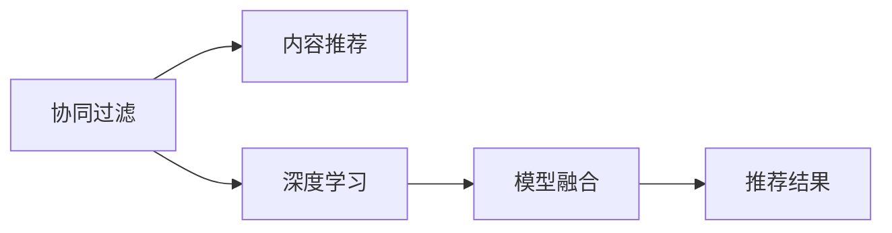

                 

# 推荐系统发展现状:架构、问题与挑战

## 1. 背景介绍

推荐系统（Recommender System）是一种通过分析用户行为数据和商品属性数据，为用户推荐合适商品或内容的智能算法。自20世纪90年代以来，随着电子商务和互联网媒体的蓬勃发展，推荐系统逐渐成为推动个性化服务的重要技术手段。

推荐系统一般包含数据预处理、特征提取、模型训练和推荐展示等主要模块。其中，模型训练是核心环节，通过不同算法处理用户行为和商品属性，构建用户兴趣模型和商品属性模型，最终在模型指导下生成推荐结果。

## 2. 核心概念与联系

推荐系统的核心概念包括以下几个方面：

- **协同过滤**：基于用户和商品之间的行为数据进行相似性匹配，推断用户可能感兴趣的未交互商品。
- **内容推荐**：根据商品属性特征和用户兴趣模型进行推荐，如通过LDA（Latent Dirichlet Allocation）对商品进行主题建模，或使用TF-IDF（Term Frequency-Inverse Document Frequency）计算商品相似度。
- **深度学习**：利用神经网络模型从用户行为数据中提取高级特征，建立更加准确的推荐模型，如DNN（Deep Neural Network）、RNN（Recurrent Neural Network）、CNN（Convolutional Neural Network）等。
- **模型融合**：将多种算法进行组合，取长补短，提升推荐效果。

这些概念之间的联系可以用以下Mermaid流程图表示：



其中，协同过滤和内容推荐是最早出现的推荐方式，而深度学习通过引入神经网络模型，极大提升了推荐系统的精度和灵活性。模型融合技术则是将不同模型进行组合，通过混合模型的优势，进一步提升推荐效果。

## 3. 核心算法原理 & 具体操作步骤
### 3.1 算法原理概述

推荐系统的主要算法包括基于协同过滤、基于内容的推荐和基于深度学习的推荐等。

- **基于协同过滤的推荐算法**：基于用户之间的相似度和商品之间的相似度，构建推荐模型。经典算法包括基于用户的协同过滤（User-Based Collaborative Filtering）和基于商品的协同过滤（Item-Based Collaborative Filtering）。
- **基于内容的推荐算法**：通过分析商品的属性特征，与用户兴趣模型进行匹配，推荐相似商品。常用的方法包括LDA主题建模和TF-IDF文本相似度计算。
- **基于深度学习的推荐算法**：利用神经网络模型学习用户行为数据中的高阶特征，建立推荐模型。经典模型包括DeepFM、Wide&Deep等。

### 3.2 算法步骤详解

以基于深度学习的推荐系统为例，其操作步骤如下：

1. **数据预处理**：收集用户行为数据和商品属性数据，并进行清洗、归一化等预处理操作。
2. **特征提取**：从用户行为数据中提取特征，如浏览历史、购买记录、评分等。
3. **模型训练**：使用深度神经网络模型对用户行为数据进行建模，生成推荐模型。
4. **模型评估**：使用测试集对模型进行评估，如通过点击率（Click-Through Rate, CTR）、转化率（Conversion Rate, CR）等指标进行衡量。
5. **推荐展示**：根据模型输出，生成推荐结果，并通过网站、APP等渠道展示给用户。

### 3.3 算法优缺点

基于深度学习的推荐系统具有以下优点：

- **高精度**：利用神经网络模型提取高级特征，能够有效捕捉用户行为的复杂模式。
- **可扩展性**：神经网络模型具有很好的扩展性，可以处理大规模数据。
- **自适应性**：通过端到端训练，能够实时适应数据变化，提高推荐效果。

同时，也存在以下缺点：

- **计算资源要求高**：神经网络模型需要大量计算资源，训练成本较高。
- **解释性差**：神经网络模型通常被视为"黑盒"，难以解释推荐决策的依据。
- **过拟合风险**：神经网络模型容易过拟合，需要更多的正则化技术进行处理。

### 3.4 算法应用领域

推荐系统广泛应用于电商、社交媒体、视频网站、新闻平台等场景。例如：

- **电商推荐系统**：通过分析用户购物历史和商品属性，推荐商品给用户，提升购物体验。
- **社交媒体推荐系统**：通过分析用户行为和内容特征，推荐相关内容，增加用户粘性。
- **视频网站推荐系统**：通过分析用户观看历史和视频属性，推荐相关视频，增加用户留存率。
- **新闻平台推荐系统**：通过分析用户阅读历史和新闻属性，推荐相关新闻，增加用户点击率。

## 4. 数学模型和公式 & 详细讲解  
### 4.1 数学模型构建

以深度学习推荐系统为例，其数学模型包括用户兴趣模型和商品属性模型。

用户兴趣模型通过神经网络对用户行为数据进行建模，其输入为[用户ID, 商品ID, 时间戳]，输出为[用户ID, 商品ID, 评分]。用户兴趣模型的公式如下：

$$
\begin{aligned}
&U(x_u, i, t) = \sum_{k=1}^K W_k^u \phi_k^{u,i}(x_u) \\
&\phi_k^{u,i}(x_u) = f(W_k^{iu} \cdot x_u + b_k^{iu})
\end{aligned}
$$

其中，$U$为用户兴趣模型，$x_u$为用户行为数据，$k$为神经网络层数，$W_k^u$为第$k$层权重，$\phi_k^{u,i}$为第$k$层激活函数。

商品属性模型通过神经网络对商品属性数据进行建模，其输入为[商品ID, 商品属性]，输出为[商品ID, 商品评分]。商品属性模型的公式如下：

$$
\begin{aligned}
&I(x_i, t) = \sum_{k=1}^K W_k^i \phi_k^i(x_i) \\
&\phi_k^i(x_i) = f(W_k^i \cdot x_i + b_k^i)
\end{aligned}
$$

其中，$I$为商品属性模型，$x_i$为商品属性数据，$W_k^i$为第$k$层权重，$\phi_k^i$为第$k$层激活函数。

### 4.2 公式推导过程

用户兴趣模型和商品属性模型的推导过程如下：

- **用户兴趣模型**：将用户行为数据$x_u$映射到用户兴趣向量$u$，其中$u$由各层权重$W_k^u$和激活函数$\phi_k^{u,i}$组成。
- **商品属性模型**：将商品属性数据$x_i$映射到商品兴趣向量$i$，其中$i$由各层权重$W_k^i$和激活函数$\phi_k^i$组成。

最终，将用户兴趣模型和商品属性模型的输出进行拼接，通过线性层和激活函数得到最终的推荐分数。

### 4.3 案例分析与讲解

以DeepFM模型为例，其核心公式如下：

$$
\begin{aligned}
&r_{u,i} = \sigma(W_{FM} \cdot (u \odot i) + b_{FM}) + \sigma(W_{DNN} \cdot [U(x_u), I(x_i)] + b_{DNN})
\end{aligned}
$$

其中，$r_{u,i}$为推荐分数，$W_{FM}$和$b_{FM}$为FM层的权重和偏置，$W_{DNN}$和$b_{DNN}$为DNN层的权重和偏置。$u$为用户兴趣向量，$i$为商品属性向量，$[U(x_u), I(x_i)]$为用户行为和商品属性的拼接特征。

DeepFM模型将用户行为数据和商品属性数据进行拼接，并通过FM层和DNN层分别进行处理，最后将两个层的结果相加，生成推荐分数。

## 5. 项目实践：代码实例和详细解释说明
### 5.1 开发环境搭建

推荐系统的开发环境需要安装Python、TensorFlow或PyTorch等深度学习框架，以及相关库如TensorBoard、Horovod等。

```bash
pip install tensorflow
pip install pytorch
pip install torchvision torchtext
pip install tensorflow-addons
pip install horovod
```

### 5.2 源代码详细实现

以TensorFlow为例，推荐系统的一般代码如下：

```python
import tensorflow as tf
from tensorflow.keras import layers

# 定义模型
model = tf.keras.Sequential([
    layers.Embedding(input_dim=10000, output_dim=16, input_length=1),
    layers.Conv1D(32, 3, activation='relu'),
    layers.MaxPooling1D(pool_size=2),
    layers.Flatten(),
    layers.Dense(64, activation='relu'),
    layers.Dense(1, activation='sigmoid')
])

# 编译模型
model.compile(loss='binary_crossentropy', optimizer='adam', metrics=['accuracy'])

# 训练模型
model.fit(x_train, y_train, epochs=10, batch_size=32)
```

### 5.3 代码解读与分析

上述代码中，我们使用了TensorFlow的Keras API来定义和训练推荐模型。

- **模型定义**：我们使用Embedding层将用户ID和商品ID转换为向量，通过Conv1D层和MaxPooling1D层进行特征提取，最后通过Dense层生成推荐分数。
- **模型编译**：我们指定了损失函数为二元交叉熵，优化器为Adam，评估指标为准确率。
- **模型训练**：我们使用fit方法对模型进行训练，指定训练集和验证集，迭代次数和批次大小。

### 5.4 运行结果展示

训练完成后，我们可以使用evaluate方法对模型进行评估，并输出准确率和损失函数值：

```python
loss, accuracy = model.evaluate(x_test, y_test)
print(f'Test loss: {loss:.4f}')
print(f'Test accuracy: {accuracy:.4f}')
```

## 6. 实际应用场景

推荐系统在实际应用中具有广泛的应用场景，包括：

- **电商推荐**：电商平台通过分析用户购买行为和商品属性，为用户推荐个性化商品，提升购物体验。
- **视频推荐**：视频平台通过分析用户观看行为和视频属性，为用户推荐相关视频，增加用户留存率。
- **新闻推荐**：新闻平台通过分析用户阅读行为和新闻属性，为用户推荐相关新闻，增加用户点击率。
- **社交媒体推荐**：社交媒体平台通过分析用户行为和内容特征，为用户推荐相关内容，增加用户粘性。

## 7. 工具和资源推荐
### 7.1 学习资源推荐

为了帮助开发者系统掌握推荐系统开发，以下是一些优质的学习资源：

1. **《推荐系统原理与算法》**：清华大学郑伟宏教授的推荐系统课程，讲解了推荐系统的基本原理和常用算法。
2. **《TensorFlow推荐系统》**：TensorFlow官方文档，详细介绍了如何使用TensorFlow实现推荐系统。
3. **《深度学习推荐系统》**：美团XDG的深度学习推荐系统课程，讲解了深度学习在推荐系统中的应用。

### 7.2 开发工具推荐

推荐系统开发常用的工具包括：

1. **TensorFlow**：开源深度学习框架，提供了强大的机器学习功能。
2. **PyTorch**：开源深度学习框架，灵活的动态计算图设计，适用于研究型开发。
3. **TensorBoard**：可视化工具，用于监控和调试模型训练过程。
4. **Horovod**：分布式深度学习框架，支持多GPU和多节点训练，提升训练效率。

### 7.3 相关论文推荐

以下是几篇奠基性的推荐系统论文，推荐阅读：

1. **《A Factorization-Machine Approach for Predictive Modeling with Large Datasets》**：提出了FM模型，通过矩阵分解来拟合用户行为数据。
2. **《Wide & Deep Learning for Recommender Systems》**：提出了Wide&Deep模型，将线性模型和深度模型结合，提升推荐效果。
3. **《Deep Neural Networks for Large-scale Recommender Systems: A Case Study》**：提出了DeepFM模型，将FM和DNN结合，提升了推荐精度和扩展性。

## 8. 总结：未来发展趋势与挑战
### 8.1 总结

推荐系统作为个性化服务的重要技术手段，其发展经历了从协同过滤、内容推荐到深度学习的演进。当前，基于深度学习的推荐系统已经广泛应用于电商、社交媒体、视频平台等场景，为推荐服务提供了坚实的技术支撑。

### 8.2 未来发展趋势

未来，推荐系统将呈现以下几个发展趋势：

1. **多模态推荐**：将文本、图像、音频等多模态数据进行融合，提供更丰富的推荐内容。
2. **实时推荐**：通过在线学习算法，实现实时动态推荐，提升用户体验。
3. **异构推荐**：将推荐系统与搜索、广告等其他业务进行融合，提升整体业务效果。
4. **联邦推荐**：通过分布式协同学习，保护用户隐私的同时提升推荐效果。

### 8.3 面临的挑战

尽管推荐系统已经取得了显著进展，但仍面临以下挑战：

1. **数据隐私**：推荐系统需要大量的用户行为数据，如何保护用户隐私是重要问题。
2. **冷启动问题**：新用户或新商品没有足够的行为数据，如何提供有效的推荐。
3. **系统公平性**：推荐系统可能存在偏见，如何保障系统的公平性和公正性。
4. **性能优化**：推荐系统需要处理大规模数据，如何提高模型的性能和效率。

### 8.4 研究展望

未来的推荐系统研究需要从以下几个方向进行突破：

1. **多模态推荐**：将不同模态数据进行融合，提升推荐效果。
2. **实时推荐**：通过在线学习算法，实现实时动态推荐。
3. **异构推荐**：将推荐系统与搜索、广告等其他业务进行融合，提升整体业务效果。
4. **联邦推荐**：通过分布式协同学习，保护用户隐私的同时提升推荐效果。

通过不断探索和创新，相信推荐系统将为个性化服务提供更加精准、高效的技术支撑，进一步提升用户体验和业务效果。

## 9. 附录：常见问题与解答

**Q1：推荐系统有哪些主要算法？**

A: 推荐系统的主要算法包括基于协同过滤的推荐算法、基于内容的推荐算法和基于深度学习的推荐算法等。其中，基于协同过滤的推荐算法有基于用户的协同过滤和基于商品的协同过滤；基于内容的推荐算法有LDA主题建模和TF-IDF文本相似度计算；基于深度学习的推荐算法有DeepFM和Wide&Deep等。

**Q2：推荐系统如何处理冷启动问题？**

A: 推荐系统可以通过以下方法处理冷启动问题：
1. 引入先验知识：使用领域知识或规则模型进行推荐。
2. 推荐热门商品：向新用户推荐热门商品，增加用户互动。
3. 利用用户相似度：通过相似用户的行为数据进行推荐。
4. 基于内容推荐：利用商品属性特征进行推荐。

**Q3：推荐系统如何提升系统公平性？**

A: 推荐系统可以通过以下方法提升系统公平性：
1. 数据预处理：去除低质量数据，减少偏见。
2. 特征选择：选择多样化的特征，减少模型偏差。
3. 公平性约束：在推荐模型中引入公平性约束，保障不同用户群体的推荐公平性。
4. 透明性：通过解释性算法，增加模型透明度，便于用户理解推荐逻辑。

---

作者：禅与计算机程序设计艺术 / Zen and the Art of Computer Programming

